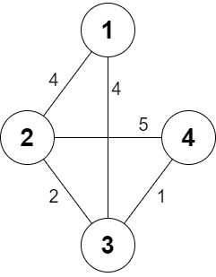
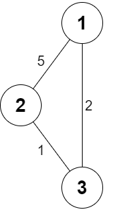

2473. Minimum Cost to Buy Apples

You are given a positive integer `n` representing `n` cities numbered from `1` to `n`. You are also given a **2D** array roads, where `roads[i] = [ai, bi, costi]` indicates that there is a **bidirectional** road between cities `ai` and `bi` with a cost of traveling equal to `costi`.

You can buy apples in any city you want, but some cities have different costs to buy apples. You are given the array `appleCost` where `appleCost[i]` is the cost of buying one apple from city `i`.

You start at some city, traverse through various roads, and eventually buy **exactly** one apple from **any** city. After you buy that apple, you have to return back to the city you **started** at, but now the cost of all the roads will be **multiplied** by a given factor `k`.

Given the integer `k`, return an array `answer` of size `n` where `answer[i]` is the minimum total cost to buy an apple if you start at city `i`.

 

**Example 1:**


```
Input: n = 4, roads = [[1,2,4],[2,3,2],[2,4,5],[3,4,1],[1,3,4]], appleCost = [56,42,102,301], k = 2
Output: [54,42,48,51]
Explanation: The minimum cost for each starting city is the following:
- Starting at city 1: You take the path 1 -> 2, buy an apple at city 2, and finally take the path 2 -> 1. The total cost is 4 + 42 + 4 * 2 = 54.
- Starting at city 2: You directly buy an apple at city 2. The total cost is 42.
- Starting at city 3: You take the path 3 -> 2, buy an apple at city 2, and finally take the path 2 -> 3. The total cost is 2 + 42 + 2 * 2 = 48.
- Starting at city 4: You take the path 4 -> 3 -> 2 then you buy at city 2, and finally take the path 2 -> 3 -> 4. The total cost is 1 + 2 + 42 + 1 * 2 + 2 * 2 = 51.
```

**Example 2:**


```
Input: n = 3, roads = [[1,2,5],[2,3,1],[3,1,2]], appleCost = [2,3,1], k = 3
Output: [2,3,1]
Explanation: It is always optimal to buy the apple in the starting city.
```

**Constraints:**

* `2 <= n <= 1000`
* `1 <= roads.length <= 1000`
* `1 <= ai, bi <= n`
* `ai != bi`
* `1 <= costi <= 10^5`
* `appleCost.length == n`
* `1 <= appleCost[i] <= 10^5`
* `1 <= k <= 100`
* There are no repeated edges.

# Submissions
---
**Solution 1: (Dijkstra)**
```
Runtime: 737 ms
Memory: 14.6 MB
```
```python
class Solution:
    def minCost(self, n: int, roads: List[List[int]], appleCost: List[int], k: int) -> List[int]:
        g = collections.defaultdict(list)
        for a, b, cost in roads:
            g[a-1] += [[b-1, cost]]
            g[b-1] += [[a-1, cost]]
        ans = appleCost[:]
        for i in range(n):
            hq = [[0, i]]
            seen = set()
            while hq:
                c, u = heapq.heappop(hq)
                if u in seen:
                    continue
                seen.add(u)
                ans[i] = min(ans[i], c*(k+1) + appleCost[u])
                for v, vc in g[u]:
                    if not v in seen and (c + vc)*(k+1) < ans[i]:
                        heapq.heappush(hq, [c + vc, v])
                
        return ans
```

**Solution 2: (Dijkstra)**
```
Runtime: 1254 ms
Memory: 14.7 MB
```
```python
class Solution:
    def minCost(self, n: int, roads: List[List[int]], appleCost: List[int], k: int) -> List[int]:
        g = collections.defaultdict(list)
        for a, b, cost in roads:
            g[a-1] += [[b-1, cost]]
            g[b-1] += [[a-1, cost]]
        ans = [0]*n
        for i in range(n):
            hq = [[0, i]]
            dist = [float('inf')]*n
            while hq:
                c, u = heapq.heappop(hq)
                if c*(k+1) + appleCost[u] >= dist[u]:
                    continue
                dist[u] = c*(k+1) + appleCost[u]
                dist[i] = min(dist[i], c*(k+1) + appleCost[u])
                for v, vc in g[u]:
                    if (c + vc)*(k+1) < dist[i]:
                        heapq.heappush(hq, [c + vc, v])
            ans[i] = dist[i]
                
        return ans
```
