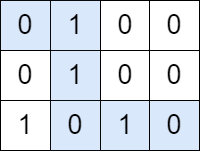
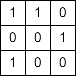

2510. Check if There is a Path With Equal Number of 0's And 1's

You are given a **0-indexed** `m x n` **binary** matrix `grid`. You can move from a cell `(row, col)` to any of the cells `(row + 1, col)` or `(row, col + 1)`.

Return `true` if there is a path from `(0, 0)` to `(m - 1, n - 1)` that visits an **equal** number of `0`'s and `1`'s. Otherwise return `false`.

 

**Example 1:**


```
Input: grid = [[0,1,0,0],[0,1,0,0],[1,0,1,0]]
Output: true
Explanation: The path colored in blue in the above diagram is a valid path because we have 3 cells with a value of 1 and 3 with a value of 0. Since there is a valid path, we return true.
```

**Example 2:**


```
Input: grid = [[1,1,0],[0,0,1],[1,0,0]]
Output: false
Explanation: There is no path in this grid with an equal number of 0's and 1's.
```

**Constraints:**

* `m == grid.length`
* `n == grid[i].length`
* `2 <= m, n <= 10^0`
* `grid[i][j]` is either `0` or `1`.

# Submissions
---
**Solution 1: (DP Top-Down)**
```
Runtime: 74 ms
Memory: 14.7 MB
```
```python
class Solution:
    def isThereAPath(self, grid: List[List[int]]) -> bool:
        M, N = len(grid), len(grid[0])
        if (M+N)%2 == 0:
            return False
       
        @cache
        def dp(i, j, cur):
            cur += (1 if grid[i][j] else -1)
            if i == M-1 and j == N-1:
                return cur == 0
            if j+1 < N and dp(i, j+1, cur):
                return True
            if i+1 < M and dp(i+1, j, cur):
                return True
            return False

        return dp(0, 0, 0)
```

**Solution 2: (DP Bottom-Up, record min, max and compare range)**
```
Runtime: 89 ms
Memory: 14.4 MB
```
```python
class Solution:
    def isThereAPath(self, grid: List[List[int]]) -> bool:
        rows, cols = len(grid), len(grid[0])

        if (rows + cols) % 2 == 0:
            return False

        min_ = [[0] * cols for _ in range(rows)]
        max_ = [[0] * cols for _ in range(rows)]

        min_[0][0] = max_[0][0] = grid[0][0]

        for row in range(1, rows):
            min_[row][0] = min_[row - 1][0] + grid[row][0]
            max_[row][0] = min_[row][0]

        for col in range(1, cols):
            min_[0][col] = min_[0][col - 1] + grid[0][col]
            max_[0][col] = min_[0][col]

        for row in range(1, rows):
            for col in range(1, cols):
                min_prev = min(min_[row - 1][col], min_[row][col - 1])
                min_[row][col] = min_prev + grid[row][col]

                max_prev = max(max_[row - 1][col], max_[row][col - 1])
                max_[row][col] = max_prev + grid[row][col]

        target = (rows + cols - 1) // 2
        return min_[rows - 1][cols - 1] <= target <= max_[rows - 1][cols - 1]
```

**Solution 3: (DP Btoom-Up)**

    [[0,     1,     0,     0],
     -1:1  0:1   -1:1   -2:1
    [0,     1,      0,     0],
    -2:1  -1:1    0:1    -1:1
           1:1   -2:2    -3:3
    [1,      0,     1,      0]]
    -1:1  -2:1    1:1      0:1
           0:1   -1:3     -2:3
                 

    [1,    1,    0],
    1:1    2:1   1:1
    [0,    0,    1],
    0:1   -1:1   0:1
           1:1   2:2
    [1,    0,    0]]
    1:1   0:2   -1:2
                 1:2

```
Runtime: 50 ms, Beats 56.39%
Memory: 18.33 MB, Beats 66.16%
```
```c++
class Solution {
public:
    bool isThereAPath(vector<vector<int>>& grid) {
        int m = grid.size(), n = grid[0].size(), i, j, k;
        vector<vector<vector<bool>>> dp(m, vector<vector<bool>>(n, vector<bool>(101)));
        if (grid[0][0]) {
            k = 1;
        } else {
            k = -1;
        }
        for (i = 1; i < m; i ++) {
            if (grid[i][0]) {
                k += 1;
            } else {
                k -= 1;
            }
            if (k > 50 || k < -50) {
                break;
            }
            dp[i][0][k + 50] = 1;
        }
        if (grid[0][0]) {
            k = 1;
        } else {
            k = -1;
        }
        for (j = 1; j < n; j ++) {
            if (grid[0][j]) {
                k += 1;
            } else {
                k -= 1;
            }
            if (k > 50 || k < -50) {
                break;
            }
            dp[0][j][k + 50] = 1;
        }
        for (i = 1; i < m; i ++) {
            for (j = 1; j < n; j ++) {
                if (grid[i][j] == 0) {
                    for (k = 1; k <= 100; k ++) {
                        if (dp[i-1][j][k]) {
                            dp[i][j][k-1] = 1;
                        }
                        if (dp[i][j-1][k]) {
                            dp[i][j][k-1] = 1;
                        }
                    }
                } else {
                    for (k = 0; k <= 99; k ++) {
                        if (dp[i-1][j][k]) {
                            dp[i][j][k+1] = 1;
                        }
                        if (dp[i][j-1][k]) {
                            dp[i][j][k+1] = 1;
                        }
                    }
                }
            }
        }
        return dp[m-1][n-1][50];
    }
};
```
