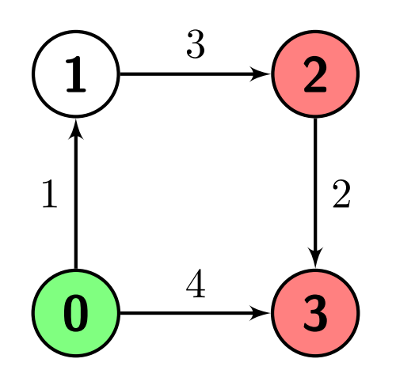
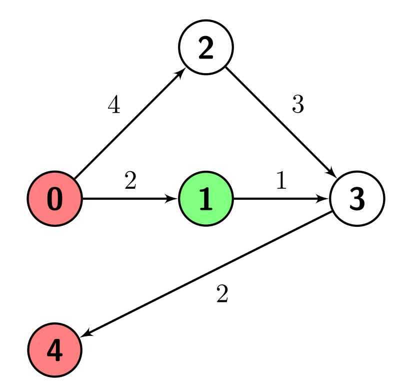
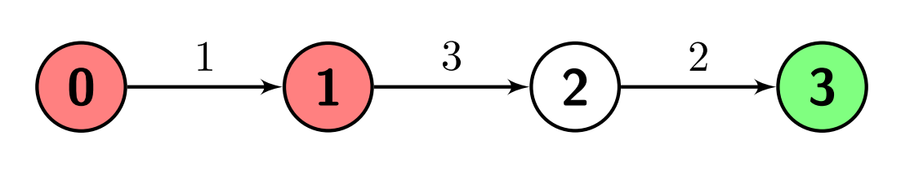

2737. Find the Closest Marked Node

You are given a positive integer `n` which is the number of nodes of a **0-indexed directed weighted** graph and a **0-indexed** 2D array `edges` where `edges[i] = [ui, vi, wi]` indicates that there is an edge from node `ui` to node `vi` with weight `wi`.

You are also given a node `s` and a node array `marked`; your task is to find the **minimum** distance from `s` to any of the nodes in `marked`.

Return an integer denoting the minimum distance from `s` to any node in `marked` or `-1` if there are no paths from `s` to any of the `marked` nodes.

 

**Example 1:**


```
Input: n = 4, edges = [[0,1,1],[1,2,3],[2,3,2],[0,3,4]], s = 0, marked = [2,3]
Output: 4
Explanation: There is one path from node 0 (the green node) to node 2 (a red node), which is 0->1->2, and has a distance of 1 + 3 = 4.
There are two paths from node 0 to node 3 (a red node), which are 0->1->2->3 and 0->3, the first one has a distance of 1 + 3 + 2 = 6 and the second one has a distance of 4.
The minimum of them is 4.
```

**Example 2:**


```
Input: n = 5, edges = [[0,1,2],[0,2,4],[1,3,1],[2,3,3],[3,4,2]], s = 1, marked = [0,4]
Output: 3
Explanation: There are no paths from node 1 (the green node) to node 0 (a red node).
There is one path from node 1 to node 4 (a red node), which is 1->3->4, and has a distance of 1 + 2 = 3.
So the answer is 3.
```

**Example 3:**


```
Input: n = 4, edges = [[0,1,1],[1,2,3],[2,3,2]], s = 3, marked = [0,1]
Output: -1
Explanation: There are no paths from node 3 (the green node) to any of the marked nodes (the red nodes), so the answer is -1.
```

 

**Constraints:**

* `2 <= n <= 500`
* `1 <= edges.length <= 104`
* `edges[i].length = 3`
* `0 <= edges[i][0], edges[i][1] <= n - 1`
* `1 <= edges[i][2] <= 106`
* `1 <= marked.length <= n - 1`
* `0 <= s, marked[i] <= n - 1`
* `s != marked[i]`
* `marked[i] != marked[j] for every i != j`
* The graph might have **repeated edges**.
* The graph is generated such that it has no **self-loops**.

# Submissions
---
**Solution 1: (Dijkstra)**
```
Runtime: 107 ms
Memory: 86.07 MB
```
```C++
class Solution {
public:
    int minimumDistance(int n, vector<vector<int>>& edges, int s, vector<int>& marked) {
        vector<vector<pair<int,int>>> g(n);
        for (auto e: edges) {
            g[e[0]].push_back({e[1], e[2]});
        }
        priority_queue<pair<int,int>, vector<pair<int,int>>, greater<pair<int,int>>> pq;
        pq.push({0, s});
        unordered_set<int> st(marked.begin(), marked.end());
        vector<int> dist(n, INT_MAX);
        dist[s] = 0;
        while (pq.size()) {
            auto [w, v] = pq.top();
            pq.pop();
            if (st.count(v)) {
                return w;
            }
            for (auto [nv, nw]: g[v]) {
                if (w + nw < dist[nv]) {
                    dist[nv] = w + nw;
                    pq.push({w + nw, nv});
                }
            }
        }
        return -1;
    }
};
```
