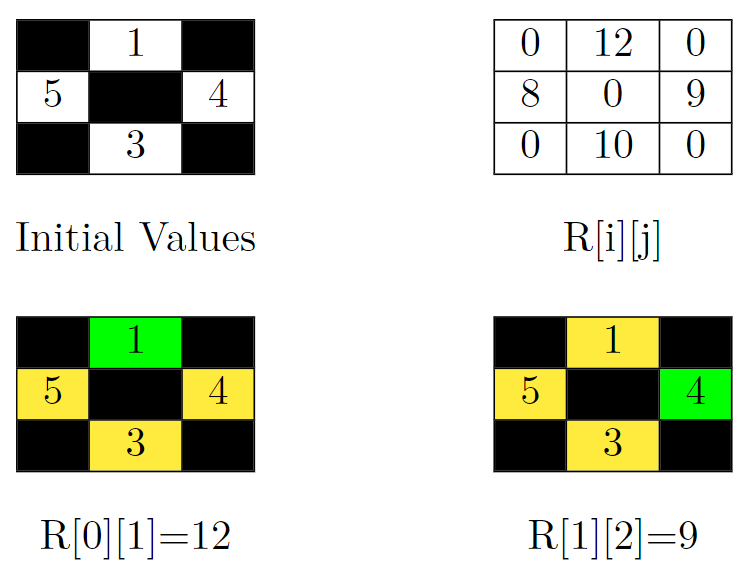
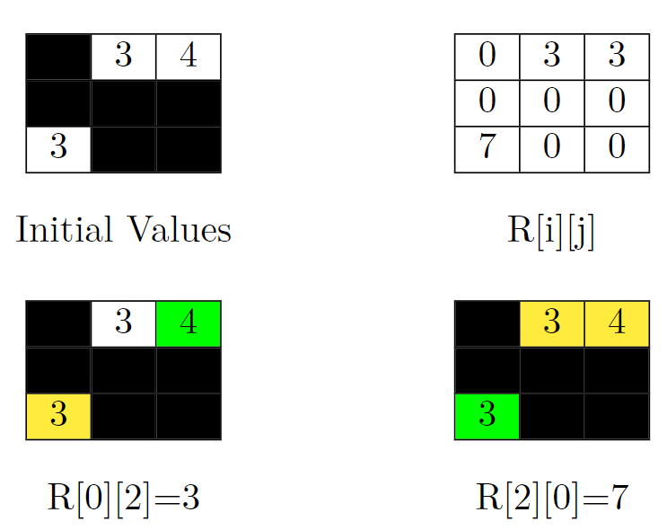

2852. Sum of Remoteness of All Cells

You are given a **0-indexed** matrix `grid` of order `n * n`. Each cell in this matrix has a value `grid[i][j]`, which is either a positive integer or `-1` representing a blocked cell.

You can move from a non-blocked cell to any non-blocked cell that shares an edge.

For any cell `(i, j)`, we **represent** its remoteness as `R[i][j]` which is defined as the following:

* If the cell `(i, j)` is a non-blocked cell, `R[i][j]` is the sum of the values `grid[x][y]` such that there is no path from the non-blocked cell `(x, y)` to the cell `(i, j)`.
* For blocked cells, `R[i][j] == 0`.

Return the sum of `R[i][j]` over all cells.

 

**Example 1:**


```
Input: grid = [[-1,1,-1],[5,-1,4],[-1,3,-1]]
Output: 39
Explanation: In the picture above, there are four grids. The top-left grid contains the initial values in the grid. Blocked cells are colored black, and other cells get their values as it is in the input. In the top-right grid, you can see the value of R[i][j] for all cells. So the answer would be the sum of them. That is: 0 + 12 + 0 + 8 + 0 + 9 + 0 + 10 + 0 = 39.
Let's jump on the bottom-left grid in the above picture and calculate R[0][1] (the target cell is colored green). We should sum up the value of cells that can't be reached by the cell (0, 1). These cells are colored yellow in this grid. So R[0][1] = 5 + 4 + 3 = 12.
Now let's jump on the bottom-right grid in the above picture and calculate R[1][2] (the target cell is colored green). We should sum up the value of cells that can't be reached by the cell (1, 2). These cells are colored yellow in this grid. So R[1][2] = 1 + 5 + 3 = 9.
```

**Example 2:**


```
Input: grid = [[-1,3,4],[-1,-1,-1],[3,-1,-1]]
Output: 13
Explanation: In the picture above, there are four grids. The top-left grid contains the initial values in the grid. Blocked cells are colored black, and other cells get their values as it is in the input. In the top-right grid, you can see the value of R[i][j] for all cells. So the answer would be the sum of them. That is: 3 + 3 + 0 + 0 + 0 + 0 + 7 + 0 + 0 = 13.
Let's jump on the bottom-left grid in the above picture and calculate R[0][2] (the target cell is colored green). We should sum up the value of cells that can't be reached by the cell (0, 2). This cell is colored yellow in this grid. So R[0][2] = 3.
Now let's jump on the bottom-right grid in the above picture and calculate R[2][0] (the target cell is colored green). We should sum up the value of cells that can't be reached by the cell (2, 0). These cells are colored yellow in this grid. So R[2][0] = 3 + 4 = 7.
```

**Example 3:**
```
Input: grid = [[1]]
Output: 0
Explanation: Since there are no other cells than (0, 0), R[0][0] is equal to 0. So the sum of R[i][j] over all cells would be 0.
```

**Constraints:**

* `1 <= n <= 300`
* `1 <= grid[i][j] <= 106 or grid[i][j] == -1`

# Submissions
---
**Solution 1: (BFS)**
```
Runtime: 157 ms
Memory: 64.08 MB
```
```c++
class Solution {
public:
    long long sumRemoteness(vector<vector<int>>& grid) {
        int n = grid.size(), c, ni, nj;
        long long t = 0, cur, ans = 0;
        for (int i = 0; i < n; i ++) {
            for (int j = 0; j < n; j ++) {
                t += max(grid[i][j], 0);
            }
        }
        queue<pair<int, int>> q;
        int d[5] = {0, 1, 0, -1, 0};
        for (int i = 0; i < n; i ++) {
            for (int j = 0; j < n; j ++) {
                if (grid[i][j] != -1) {
                    q.push({i, j});
                    cur = t - grid[i][j];
                    grid[i][j] = -1;
                    c = 0;
                    while (q.size()) {
                        auto [ci, cj] = q.front();
                        q.pop();
                        c += 1;
                        for (int dd = 0; dd < 4; dd++) {
                            ni = ci + d[dd], nj = cj + d[dd+1];
                            if (0 <= ni && ni < n && 0 <= nj && nj < n && grid[ni][nj] != -1) {
                                q.push({ni, nj});
                                cur -= grid[ni][nj];
                                grid[ni][nj] = -1;
                            }
                        }
                    }
                    ans += cur*c;
                }
            }
        }
        return ans;
    }
};
```
