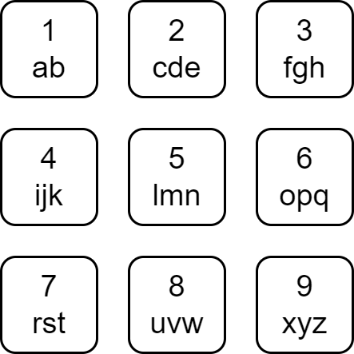

2950. Number of Divisible Substrings

Each character of the English alphabet has been mapped to a digit as shown below.



A string is **divisible** if the sum of the mapped values of its characters is divisible by its length.

Given a string `s`, return the number of divisible substrings of `s`.

A **substring** is a contiguous non-empty sequence of characters within a string.

 

**Example 1:**
```
Substring	Mapped	Sum	Length	Divisible?
a	1	1	1	Yes
s	7	7	1	Yes
d	2	2	1	Yes
f	3	3	1	Yes
as	1, 7	8	2	Yes
sd	7, 2	9	2	No
df	2, 3	5	2	No
asd	1, 7, 2	10	3	No
sdf	7, 2, 3	12	3	Yes
asdf	1, 7, 2, 3	13	4	No
Input: word = "asdf"
Output: 6
Explanation: The table above contains the details about every substring of word, and we can see that 6 of them are divisible.
```

**Example 2:**
```
Input: word = "bdh"
Output: 4
Explanation: The 4 divisible substrings are: "b", "d", "h", "bdh".
It can be shown that there are no other substrings of word that are divisible.
```

**Example 3:**
```
Input: word = "abcd"
Output: 6
Explanation: The 6 divisible substrings are: "a", "b", "c", "d", "ab", "cd".
It can be shown that there are no other substrings of word that are divisible.
```

**Constraints:**

* `1 <= word.length <= 2000`
* `word` consists only of lowercase English letters.

# Submissions
---
**Solution 1: (Prefix sum)**

(f(c1) + f(c2) + f(c3) + ... + f(cp)) / k = d
-> f(c1) + f(c2) + f(c3) + ... + f(cp) = d * k
-> f(c1) + f(c2) + f(c3) + ... + f(cp)) - d * k = 0
-> (f(c1) - d) + (f(c2) - d) + ... + (f(cp) - d) = 0
-> try all d = [0...9]

```
Runtime: 95 ms
Memory: 41.28 MB
```
```c++
class Solution {
public:
    int countDivisibleSubstrings(string word) {
        int ans = 0;
        for (int i = 1; i < 10; ++i) {
            unordered_map<int, int> have = {{0, 1}};
            int cur = 0;
            for (const char c : word) {
                cur += 9 - ('z' - c) / 3 - i;
                ans += have[cur]++;
            }
        }
        return ans;
    }
};
```
