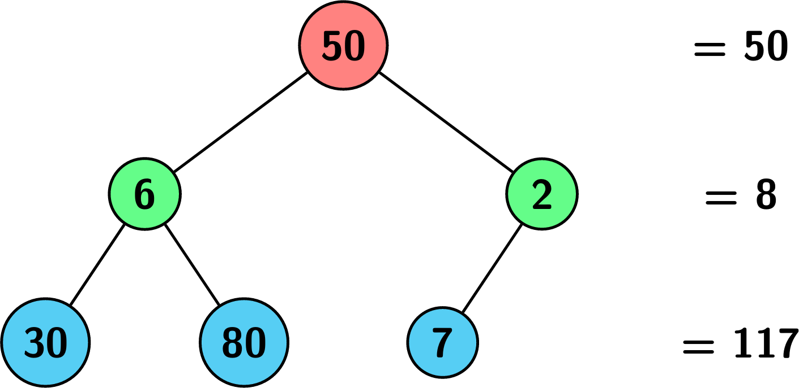
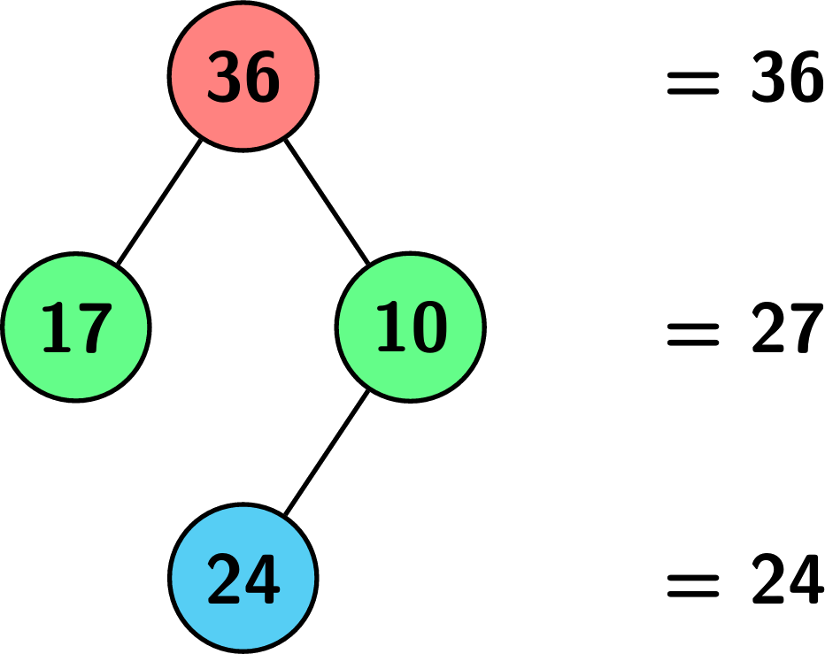
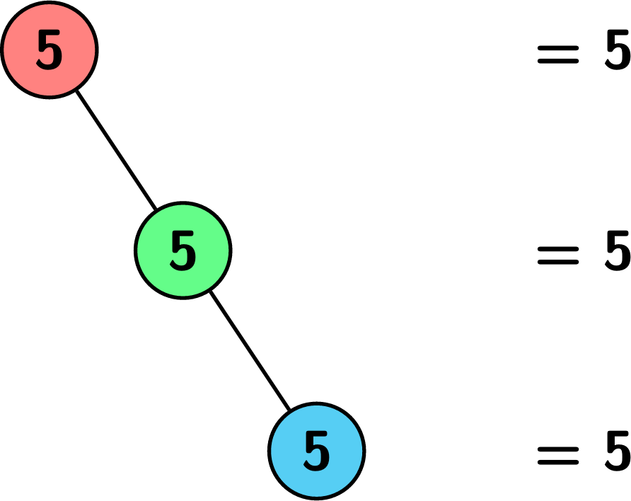

3157. Find the Level of Tree with Minimum Sum

Given the root of a binary tree root where each node has a value, return the level of the tree that has the **minimum** sum of values among all the levels (in case of a tie, return the **lowest** level).

Note that the root of the tree is at level `1` and the level of any other node is its distance from the root `+ 1`.

 

**Example 1:**


```
Input: root = [50,6,2,30,80,7]

Output: 2

Explanation:
```


**Example 2:**


```
Input: root = [36,17,10,null,null,24]

Output: 3

Explanation:
```


**Example 3:**


```
Input: root = [5,null,5,null,5]

Output: 1

Explanation:
```


 

**Constraints:**

* The number of nodes in the tree is in the range `[1, 105]`.
* `1 <= Node.val <= 109`

# Submissions
---
**Solution 1: (BFS)**
```
Runtime: 182 ms
Memory: 146.48 MB
```
```c++
/**
 * Definition for a binary tree node.
 * struct TreeNode {
 *     int val;
 *     TreeNode *left;
 *     TreeNode *right;
 *     TreeNode() : val(0), left(nullptr), right(nullptr) {}
 *     TreeNode(int x) : val(x), left(nullptr), right(nullptr) {}
 *     TreeNode(int x, TreeNode *left, TreeNode *right) : val(x), left(left), right(right) {}
 * };
 */
class Solution {
public:
    int minimumLevel(TreeNode* root) {
        long long mn = INT_MAX, cur;
        int sz, lvl = 1, ans;
        queue<TreeNode*> q;
        TreeNode *node;
        q.push(root);
        while (q.size()) {
            cur = 0;
            sz = q.size();
            for (int i = 0; i < sz; i ++) {
                node = q.front();
                q.pop();
                cur += node->val;
                if (node->left) {
                    q.push(node->left);
                }
                if (node->right) {
                    q.push(node->right);
                }
            }
            if (cur < mn) {
                mn = cur;
                ans = lvl;
            }
            lvl += 1;
        }
        return ans;
    }
};
```
