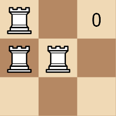

3189. Minimum Moves to Get a Peaceful Board

Given a 2D array `rooks` of length `n`, where `rooks[i] = [xi, yi]` indicates the position of a rook on an `n x n` chess board. Your task is to move the rooks 1 cell at a time vertically or horizontally (to an adjacent cell) such that the board becomes **peaceful**.

A board is **peaceful** if there is exactly one rook in each row and each column.

Return the **minimum** number of moves required to get a peaceful board.

Note that at no point can there be two rooks in the same cell.

 

**Example 1:**
```
Input: rooks = [[0,0],[1,0],[1,1]]

Output: 3

Explanation:
```


**Example 2:**
```
Input: rooks = [[0,0],[0,1],[0,2],[0,3]]

Output: 6

Explanation:
```

 

**Constraints:**

* `1 <= n == rooks.length <= 500`
* `0 <= xi, yi <= n - 1`
* The input is generated such that there are no 2 rooks in the same cell.

# Submissions
---
**Solution 1: (Sort)**
```
Runtime: 228 ms, Beats 0.00%
Memory: 85.13 MB, Beats 9.09%
```
```c++
class Solution {
public:
    int minMoves(vector<vector<int>>& rooks) {
        int n = rooks.size(), i, ans = 0;
        sort(rooks.begin(), rooks.end());
        for (i = 0; i < n; i ++) {
            ans += abs(rooks[i][0] - i);
        }
        sort(rooks.begin(), rooks.end(), [](auto va, auto vb){
            return va[1] < vb[1];
        });
        for (i = 0; i < n; i ++) {
            ans += abs(rooks[i][1] - i);
        }
        return ans;
    }
};
```

**Solution 2: (Counting Sort)**
```
Runtime: 0 ms, Beats 100.00%
Memory: 40.66 MB, Beats 27.27%
```
```c++
class Solution {
public:
    int minMoves(vector<vector<int>>& rooks) {
        int minMoves = 0;

        // Store the count of rooks in each row and column.
        vector<int> row(rooks.size(), 0);
        vector<int> col(rooks.size(), 0);
        for (int i = 0; i < rooks.size(); i++) {
            row[rooks[i][0]]++;
            col[rooks[i][1]]++;
        }

        int rowMinMoves = 0, colMinMoves = 0;
        for (int i = 0; i < rooks.size(); i++) {
            // Difference between the rooks count at row and column and one.
            rowMinMoves += row[i] - 1;
            colMinMoves += col[i] - 1;

            // Moves required for row and column constraints.
            minMoves += abs(rowMinMoves) + abs(colMinMoves);
        }

        return minMoves;
    }
};
```
