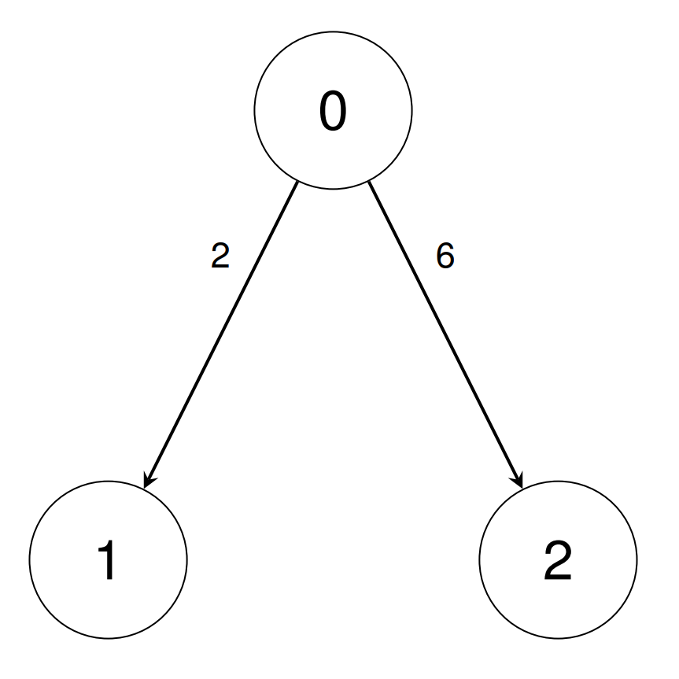
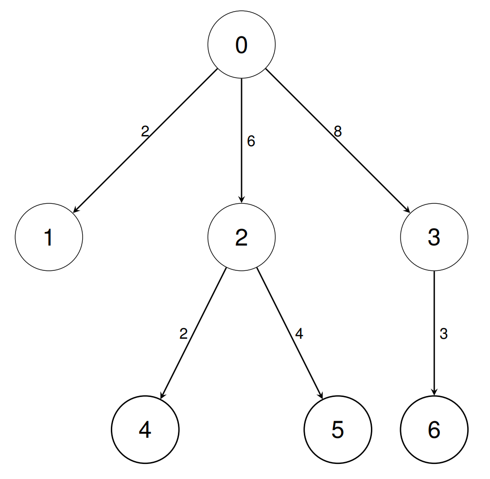

3535. Unit Conversion II

There are `n` types of units indexed from `0` to `n - 1`.

You are given a 2D integer array conversions of length `n - 1`, where `conversions[i] = [sourceUniti, targetUniti, conversionFactori]`. This indicates that a single unit of type `sourceUniti` is equivalent to `conversionFactori` units of type `targetUniti`.

You are also given a 2D integer array `queries` of length `q`, where `queries[i] = [unitAi, unitBi]`.

Return an array answer of length `q` where `answer[i]` is the number of units of type `unitBi` equivalent to 1 unit of type `unitAi`. Return each `answer[i]` as `pq-1` modulo `10^9 + 7`, where `q-1` represents the multiplicative inverse of `q` modulo `10^9 + 7`.

 

**Example 1:**
```
Input: conversions = [[0,1,2],[0,2,6]], queries = [[1,2],[1,0]]

Output: [3,500000004]

Explanation:

In the first query, we can convert unit 1 into 3 units of type 2 using the inverse of conversions[0], then conversions[1].
In the second query, we can convert unit 1 into 1/2 units of type 0 using the inverse of conversions[0]. We return 500000004 since it is the multiplicative inverse of 2.
```
 

**Example 2:**
```
Input: conversions = [[0,1,2],[0,2,6],[0,3,8],[2,4,2],[2,5,4],[3,6,3]], queries = [[1,2],[0,4],[6,5],[4,6],[6,1]]

Output: [3,12,1,2,83333334]

Explanation:

In the first query, we can convert unit 1 into 3 units of type 2 using the inverse of conversions[0], then conversions[1].
In the second query, we can convert unit 0 into 12 units of type 4 using conversions[1], then conversions[3].
In the third query, we can convert unit 6 into 1 unit of type 5 using the inverse of conversions[5], the inverse of conversions[2], conversions[1], then conversions[4].
In the fourth query, we can convert unit 4 into 2 units of type 6 using the inverse of conversions[3], the inverse of conversions[1], conversions[2], then conversions[5].
In the fifth query, we can convert unit 6 into 1/12 units of type 1 using the inverse of conversions[5], the inverse of conversions[2], then conversions[0]. We return 83333334 since it is the multiplicative inverse of 12.
```


**Constraints:**

* `2 <= n <= 10^5`
* `conversions.length == n - 1`
* `0 <= sourceUniti, targetUniti < n`
* `1 <= conversionFactori <= 10^9`
* `1 <= q <= 10^5`
* `queries.length == q`
* `0 <= unitAi, unitBi < n`
* It is guaranteed that unit 0 can be **uniquely** converted into any other unit through a combination of forward or backward conversions.

# Submissions
---
**Solution 1: (DFS)**
```
Runtime: 108 ms, Beats 60.00%
Memory: 273.67 MB, Beats 100.00%
```
```c++
static int MOD = 1e9 + 7;
class Solution {
    int powMod(long long num,int d,int mod) {
        long long result = 1;
        while (d) {
            if (d%2)
                result = (result*num) % mod;
            num = (num*num) % mod;
            d >>= 1;
        }
        return result;
    }
    int divMod(int num,int div,int mod) {
        int e = mod-2;
        return (1LL*num*powMod(div,e,mod)) % mod;
    }
public:
    vector<int> queryConversions(vector<vector<int>>& conversions, vector<vector<int>>& queries) {
        vector<vector<pair<int,int>>> adjList(conversions.size()+1);
        for (auto &v: conversions)
            adjList[v[0]].push_back({v[1],v[2]});
        vector<int> unitsOfTypeZero(adjList.size(),-1);
        queue<int> q;
        q.push(0);
        unitsOfTypeZero[0] = 1;
        vector<int> result;
        // Get the solution for converting zero to all nodes.
        // This is simlar to Unit conversion I - baseUnitConversion.
        // We use bfs here to get the conversion results.
        while (!q.empty()) {
            int node = q.front();
            q.pop();
            for (auto &[n,w]: adjList[node]) {
                if (unitsOfTypeZero[n] == -1) {
                    unitsOfTypeZero[n] = (1LL*unitsOfTypeZero[node]*w) % MOD;
                    q.push(n);
                }
            }
        }
        // For each query convert both nodes to units of type 0
        // and divide them to get the conversion to type `a`.
        // Based on our understanding from the observation above.
        for (auto &q:queries) {
            int a = q[0], b = q[1];
            result.push_back(divMod(unitsOfTypeZero[b], unitsOfTypeZero[a], MOD));
        }
        return result;
    }
};
```
