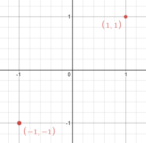

356. Line Reflection

Given n points on a 2D plane, find if there is such a line parallel to y-axis that reflect the given points symmetrically, in other words, answer whether or not if there exists a line that after reflecting all points over the given line the set of the original points is the same that the reflected ones.

Note that there can be repeated points.

**Follow up:**

Could you do better than O(n^2) ?

 

**Example 1:**


```
Input: points = [[1,1],[-1,1]]
Output: true
Explanation: We can choose the line x = 0.
```

**Example 2:**


```
Input: points = [[1,1],[-1,-1]]
Output: false
Explanation: We can't choose a line.
```

**Constraints:**

* `n == points.length`
* `1 <= n <= 10^4`
* `-10^8 <= points[i][j] <= 10^8`

# Submissions
---
**Solution 1: (Set, Greedy)**
```
Runtime: 100 ms
Memory Usage: 18.8 MB
```
```python
class Solution:
    def isReflected(self, points: List[List[int]]) -> bool:
        x = 0
        for i in range(len(points)):
            points[i] = tuple(points[i])
        points = set(points)
        for p in points:
            x += p[0]
        x /= len(points)
        for p in points:
            if p[0] == x:
                continue
            if p[0] > x and not ((int(x - (p[0] - x)), p[1]) in points):
                return False
            if p[0] < x and not ((int(x + (x - p[0])), p[1]) in points):
                return False
        return True
```

**Solution 2: (Hash Table)**

    mid x = (max x + min x) / 2
            ^^^^^^^^^^^^^^^^^^^
            = sum(uniq(x)) / 2

```
Runtime: 12 ms, Beats 14.29%
Memory: 25.20 MB, Beats 6.80%
```
```c++
class Solution {
public:
    bool isReflected(vector<vector<int>>& points) {
        int n = points.size(), i, x, y, xr, mn = INT_MAX, mx = INT_MIN;
        double mid;
        unordered_map<int, unordered_set<int>> g;
        for (auto &p: points) {
            x = p[0];
            y = p[1];
            mn = min(mn, x);
            mx = max(mx, x);
            g[x].insert(y);
        }
        mid = (double)(mn + mx) / 2;
        for (auto &p: points) {
            x = p[0];
            y = p[1];
            xr = 2 * mid - x;
            if (!g.count(xr) || !g[xr].count(y)) {
                return false;
            } 
        }
        return true;
    }
};
```

**Solution 3: (Set, sorted)**
```
Runtime: 4 ms, Beats 60.54%
Memory: 19.03 MB, Beats 38.10%
```
```c++
class Solution {
public:
    bool isReflected(vector<vector<int>>& points) {
        int n = points.size(), i, x, y, xr, mn = INT_MAX, mx = INT_MIN;
        double mid;
        set<pair<int, int>> g;
        for (auto &p: points) {
            x = p[0];
            y = p[1];
            mn = min(mn, x);
            mx = max(mx, x);
            g.insert({x, y});
        }
        mid = (double)(mn + mx) / 2;
        for (auto &p: points) {
            x = p[0];
            y = p[1];
            xr = 2 * mid - x;
            if (!g.count({xr, y})) {
                return false;
            } 
        }
        return true;
    }
};
````
