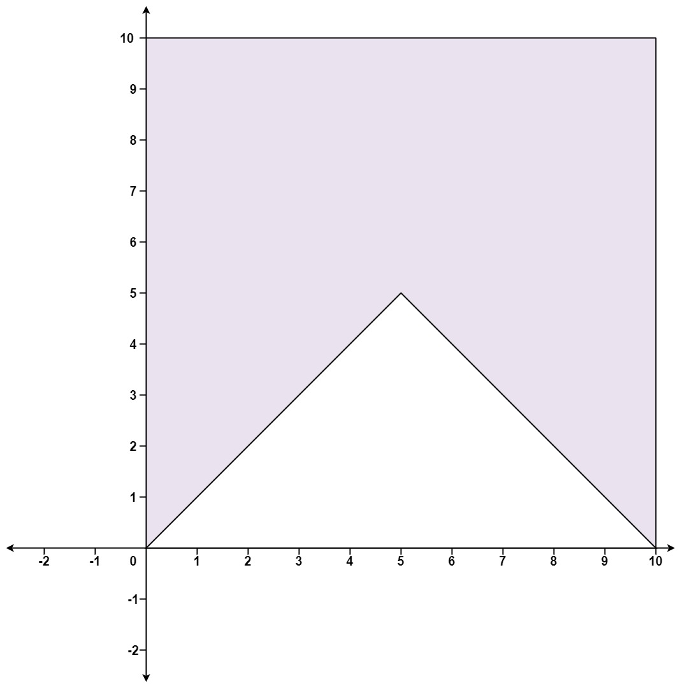

469. Convex Polygon

You are given an array of `points` on the X-Y plane `points` where `points[i] = [xi, yi]`. The points form a polygon when joined sequentially.

Return `true` if this polygon is `convex` and `false` otherwise.

You may assume the polygon formed by given points is always a simple polygon. In other words, we ensure that exactly two edges intersect at each vertex and that edges otherwise don't intersect each other.

 

**Example 1:**


```
Input: points = [[0,0],[0,5],[5,5],[5,0]]
Output: true
```

**Example 2:**


```
Input: points = [[0,0],[0,10],[10,10],[10,0],[5,5]]
Output: false
```

**Constraints:**

* `3 <= points.length <= 10^4`
* `points[i].length == 2`
* `-104 <= xi, yi <= 10^4`
* All the given points are **unique**.

# Submissions
---
**Solution 1: (Math, cross product)**
```
Runtime: 188 ms
Memory Usage: 19.2 MB
```
```python
class Solution:
    def isConvex(self, points: List[List[int]]) -> bool:
        sign = 0
        for i in range(len(points)): 
            val = (points[i][0] - points[i-1][0]) * (points[i-1][1] - points[i-2][1]) - (points[i-1][0] - points[i-2][0]) * (points[i][1] - points[i-1][1])
            if sign * val < 0: return False 
            if val: sign = val 
        return True
```

**Solution 2: (Math, cross product)**
```
Runtime: 86 ms
Memory Usage: 19.5 MB
```
```c++
class Solution {
public:
    bool isConvex(vector<vector<int>>& points) {
        points.push_back(points[0]); 
        points.push_back(points[1]); 
        long sign = 0; 
        for (int i = 2; i < points.size(); ++i) {
            long val = (points[i][0] - points[i-1][0]) * (points[i-1][1] - points[i-2][1]) - (points[i-1][0] - points[i-2][0]) * (points[i][1] - points[i-1][1]); 
            if (sign * val < 0) return false; 
            if (val) sign = val; 
        }
        return true; 
    }
};
```
