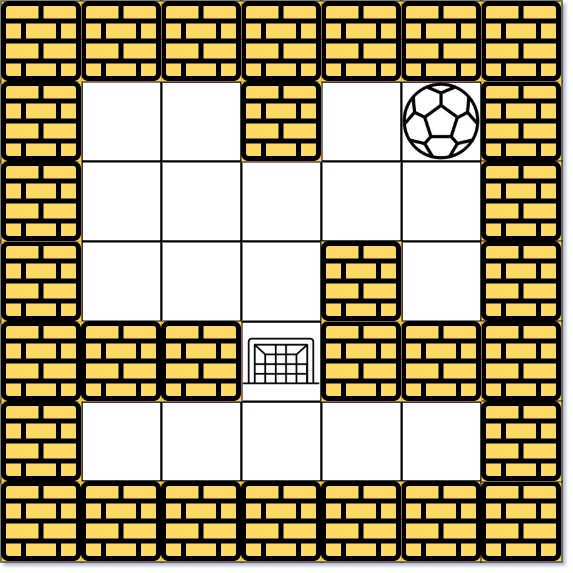

505. The Maze II

There is a ball in a `maze` with empty spaces (represented as `0`) and walls (represented as `1`). The ball can go through the empty spaces by rolling **up**, **down**, **left** or **right**, but it won't stop rolling until hitting a wall. When the ball stops, it could choose the next direction.

Given the `m x n` `maze`, the ball's `start` position and the `destination`, where `start = [startrow, startcol]` and `destination = [destinationrow, destinationcol]`, return the **shortest** distance for the ball to stop at the `destination`. If the ball cannot stop at `destination`, return `-1`.

The **distance** is the number of **empty spaces** traveled by the ball from the `start` position (excluded) to the `destination` (included).

You may assume that **the borders of the maze are all walls** (see examples).

 

**Example 1:**


```
Input: maze = [[0,0,1,0,0],[0,0,0,0,0],[0,0,0,1,0],[1,1,0,1,1],[0,0,0,0,0]], start = [0,4], destination = [4,4]
Output: 12
Explanation: One possible way is : left -> down -> left -> down -> right -> down -> right.
The length of the path is 1 + 1 + 3 + 1 + 2 + 2 + 2 = 12.
```

**Example 2:**


```
Input: maze = [[0,0,1,0,0],[0,0,0,0,0],[0,0,0,1,0],[1,1,0,1,1],[0,0,0,0,0]], start = [0,4], destination = [3,2]
Output: -1
Explanation: There is no way for the ball to stop at the destination. Notice that you can pass through the destination but you cannot stop there.
```

**Example 3:**
```
Input: maze = [[0,0,0,0,0],[1,1,0,0,1],[0,0,0,0,0],[0,1,0,0,1],[0,1,0,0,0]], start = [4,3], destination = [0,1]
Output: -1
```

**Constraints:**

* `m == maze.length`
* `n == maze[i].length`
* `1 <= m, n <= 100`
* `maze[i][j]` is `0` or `1`.
* `start.length == 2`
* `destination.length == 2`
* `0 <= startrow, destinationrow <= m`
* `0 <= startcol, destinationcol <= n`
* Both the ball and the destination exist in an empty space, and they will not be in the same position initially.
* The maze contains **at least 2 empty spaces**.

# Submissions
---
**Solution 1: (BFS)**
```
Runtime: 462 ms
Memory Usage: 14.5 MB
```
```python
class Solution:
    def shortestDistance(self, maze: List[List[int]], start: List[int], destination: List[int]) -> int:
        M, N = len(maze), len(maze[0])
        DIRECTIONS = [(0, 1), (0, -1), (-1, 0), (1, 0)]
        dists = [[float("inf")] * N for _ in range(M)]
        
        dists[start[0]][start[1]] = 0
        q = collections.deque()
        q.append(tuple(start))
        
        while q:
            r, c = q.popleft()
            rr, cc = r, c
            for i, j in DIRECTIONS:
                rr, cc = r, c
                count = 0
                while 0 <= rr + i < M and 0 <= cc + j < N and maze[rr + i][cc + j] == 0: # don't stop until sees a wall
                    rr += i
                    cc += j
                    count += 1
                if dists[r][c] + count < dists[rr][cc]:
                    dists[rr][cc] = dists[r][c] + count
                    q.append((rr, cc))
        result = dists[destination[0]][destination[1]]
        return result if result < float("inf") else -1
```

**Solution 2: (BFS)**
```
Runtime: 59 ms
Memory Usage: 20.2 MB
```
```c++
class Solution {
public:
    int shortestDistance(vector<vector<int>>& maze, vector<int>& start, vector<int>& destination) {
        m = maze.size(), n = maze[0].size();
        distance.assign(m, vector<int>(n, INT_MAX));
        distance[start[0]][start[1]] = 0;  // distance from start position
        bfs(maze, start);
        return distance[destination[0]][destination[1]] == INT_MAX ? -1 : distance[destination[0]][destination[1]];
    }

private:
    int m, n;
    vector<int> dirX = {0, 0, 1, -1};
    vector<int> dirY = {1, -1, 0, 0};
    vector<vector<int>> distance;

    void bfs(const vector<vector<int>> &maze, const vector<int> &start) {
        queue<pair<int, int>> q;
        q.push({start[0], start[1]});
        while (!q.empty()) {
          auto [x, y] = q.front();
          q.pop();
          for (int i = 0; i < 4; i++) {
            int newRow = x + dirX[i], newCol = y + dirY[i];
            int count = 0;
            // Keep moving until we hit the boundary, everything else is
            // treated as unreachable.
            while (newRow >= 0 && newRow < m && newCol >= 0 && newCol < n && maze[newRow][newCol] == 0) {
              newRow += dirX[i], newCol += dirY[i], ++count;
            }
            newRow -= dirX[i], newCol -= dirY[i];  // went too far, back up a bit
            if (distance[x][y] + count < distance[newRow][newCol]) {
              distance[newRow][newCol] = distance[x][y] + count;
              q.push({newRow, newCol});
            }
          }
        }
    }
};
```
