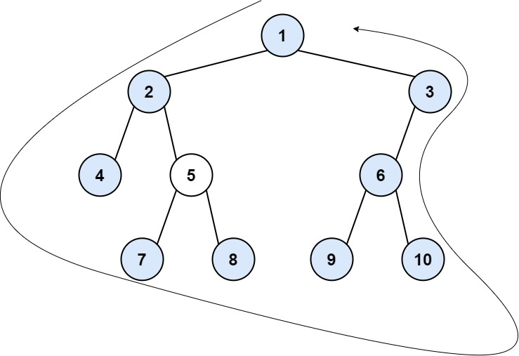

545. Boundary of Binary Tree

The **boundary** of a binary tree is the concatenation of the **root**, the **left boundary**, the **leaves** ordered from left-to-right, and the **reverse order** of the **right boundary**.

The **left boundary** is the set of nodes defined by the following:

* The root node's left child is in the left boundary. If the root does not have a left child, then the left boundary is empty.
* If a node in the left boundary and has a left child, then the left child is in the left boundary.
* If a node is in the left boundary, has no left child, but has a right child, then the right child is in the left boundary.
* The leftmost leaf is **not** in the left boundary.

The **right boundary** is similar to the left boundary, except it is the right side of the root's right subtree. Again, the leaf is not part of the **right boundary**, and the **right boundary** is empty if the root does not have a right child.

The **leaves** are nodes that do not have any children. For this problem, the root is **not** a leaf.

Given the root of a binary tree, return the values of its **boundary**.

 

**Example 1:**


```
Input: root = [1,null,2,3,4]
Output: [1,3,4,2]
Explanation:
- The left boundary is empty because the root does not have a left child.
- The right boundary follows the path starting from the root's right child 2 -> 4.
  4 is a leaf, so the right boundary is [2].
- The leaves from left to right are [3,4].
Concatenating everything results in [1] + [] + [3,4] + [2] = [1,3,4,2].
```

**Example 2:**


```
Input: root = [1,2,3,4,5,6,null,null,null,7,8,9,10]
Output: [1,2,4,7,8,9,10,6,3]
Explanation:
- The left boundary follows the path starting from the root's left child 2 -> 4.
  4 is a leaf, so the left boundary is [2].
- The right boundary follows the path starting from the root's right child 3 -> 6 -> 10.
  10 is a leaf, so the right boundary is [3,6], and in reverse order is [6,3].
- The leaves from left to right are [4,7,8,9,10].
Concatenating everything results in [1] + [2] + [4,7,8,9,10] + [6,3] = [1,2,4,7,8,9,10,6,3].
```

**Constraints:**

* The number of nodes in the tree is in the range `[1, 104]`.
* `-1000 <= Node.val <= 1000`

# Submissions
---
**Solution 1: (Simple Solution)**
```
Runtime: 40 ms
Memory Usage: 16.4 MB
```
```python
# Definition for a binary tree node.
# class TreeNode:
#     def __init__(self, val=0, left=None, right=None):
#         self.val = val
#         self.left = left
#         self.right = right
class Solution:
    def boundaryOfBinaryTree(self, root: TreeNode) -> List[int]:
        
        def isLeaf(t):
            return t.left == None and t.right == None

        def addLeaves(res, root):
            if (isLeaf(root)):
                res += [root.val]
            else:
                if root.left != None:
                    addLeaves(res, root.left)
                if root.right != None:
                    addLeaves(res, root.right)
        
        res = []
        if root == None:
            return res
        if not isLeaf(root):
            res += [root.val]
        t = root.left
        while t != None:
            if not isLeaf(t):
                res += [t.val]
            if t.left != None:
                t = t.left
            else:
                t = t.right
        addLeaves(res, root)
        s = []
        t = root.right
        while t != None:
            if not isLeaf(t):
                s += [t.val]
            if t.right != None:
                t = t.right
            else:
                t = t.left
        while s:
            res += [s.pop()]
        return res
```

**Solution 2: (Using PreOrder Traversal)**
```
Runtime: 52 ms
Memory Usage: 17.4 MB
```
```python
# Definition for a binary tree node.
# class TreeNode:
#     def __init__(self, val=0, left=None, right=None):
#         self.val = val
#         self.left = left
#         self.right = right
class Solution:
    def boundaryOfBinaryTree(self, root: TreeNode) -> List[int]:
        
        def isLeaf(t):
            return t.left == None and t.right == None

        def isRightBoundary(flag):
            return flag == 2
        
        def isLeftBoundary(flag):
            return flag == 1

        def isRoot(flag):
            return flag == 0
        
        def leftChildFlag(cur, flag):
            if isLeftBoundary(flag) or isRoot(flag):
                return 1;
            elif isRightBoundary(flag) and cur.right == None:
                return 2
            else:
                return 3

        def rightChildFlag(cur, flag):
            if isRightBoundary(flag) or isRoot(flag):
                return 2
            elif isLeftBoundary(flag) and cur.left == None:
                return 1
            else:
                return 3
        
        def preorder(cur, left_boundary, right_boundary, leaves, flag):
            if cur == None:
                return
            if isRightBoundary(flag):
                right_boundary.insert(0, cur.val)
            elif isLeftBoundary(flag) or isRoot(flag):
                left_boundary += [cur.val]
            elif isLeaf(cur):
                leaves += [cur.val]
            preorder(cur.left, left_boundary, right_boundary, leaves, leftChildFlag(cur, flag))
            preorder(cur.right, left_boundary, right_boundary, leaves, rightChildFlag(cur, flag))
        
        left_boundary, right_boundary, leaves = [], [], []
        preorder(root, left_boundary, right_boundary, leaves, 0)
        left_boundary.extend(leaves)
        left_boundary.extend(right_boundary)
        return left_boundary
```

**Solution 3: (DFS)**
```
Runtime: 48 ms
Memory: 16.4 MB
```
```python
# Definition for a binary tree node.
# class TreeNode:
#     def __init__(self, val=0, left=None, right=None):
#         self.val = val
#         self.left = left
#         self.right = right
class Solution:
    def boundaryOfBinaryTree(self, root: Optional[TreeNode]) -> List[int]:
        ans = [root.val]
        
        def dfs(node, is_left):
            if not node or (not node.left and not node.right):
                return []
            rst = [node.val]
            if is_left:
                if node.left:
                    rst += dfs(node.left, is_left)
                else:
                    rst += dfs(node.right, is_left)
                return rst
            else:
                if node.right:
                    rst = dfs(node.right, is_left) + rst
                else:
                    rst = dfs(node.left, is_left) + rst
                return rst
            
        def dfs2(node):
            if not node:
                return []
            if not node.left and not node.right:
                return [node.val]
            return dfs2(node.left) + dfs2(node.right)
        
        
        ans += dfs(root.left, True)
        if root.left or root.right:
            ans += dfs2(root)
        ans += dfs(root.right, False)
        return ans
```
