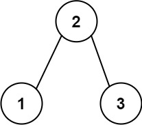

549. Binary Tree Longest Consecutive Sequence II

Given the `root` of a binary tree, return the length of the longest consecutive path in the tree.

A consecutive path is a path where the values of the consecutive nodes in the path differ by one. This path can be either increasing or decreasing.

* For example, `[1,2,3,4]` and `[4,3,2,1]` are both considered valid, but the path `[1,2,4,3]` is not valid.

On the other hand, the path can be in the child-Parent-child order, where not necessarily be parent-child order.

 

**Example 1:**


```
Input: root = [1,2,3]
Output: 2
Explanation: The longest consecutive path is [1, 2] or [2, 1].
```

**Example 2:**


```
Input: root = [2,1,3]
Output: 3
Explanation: The longest consecutive path is [1, 2, 3] or [3, 2, 1].
```

**Constraints:**

* The number of nodes in the tree is in the range `[1, 3 * 104]`.
* `-3 * 10^4 <= Node.val <= 3 * 10^4`

# Submissions
---
**Solution 1: (Single traversal)**
```
Runtime: 75 ms
Memory Usage: 16.6 MB
```
```python
# Definition for a binary tree node.
# class TreeNode:
#     def __init__(self, val=0, left=None, right=None):
#         self.val = val
#         self.left = left
#         self.right = right
class Solution:
    def longestConsecutive(self, root: Optional[TreeNode]) -> int:
        
        def longest_path(root: TreeNode) -> List[int]:
            nonlocal maxval
            
            if not root:
                return [0, 0]
            
            inr = dcr = 1
            if root.left:
                left = longest_path(root.left)
                if (root.val == root.left.val + 1):
                    dcr = left[1] + 1
                elif (root.val == root.left.val - 1):
                    inr = left[0] + 1
            
            if root.right:
                right = longest_path(root.right)
                if (root.val == root.right.val + 1):
                    dcr = max(dcr, right[1] + 1)
                elif (root.val == root.right.val - 1):
                    inr = max(inr, right[0] + 1)
                    
            maxval = max(maxval, dcr + inr - 1)
            return [inr, dcr]
        
        maxval = 0
        longest_path(root)
        return maxval
```

**Solution 2: (DFS)**
```
Runtime: 7 ms
Memory Usage: 23.1 MB
```
```c++
/**
 * Definition for a binary tree node.
 * struct TreeNode {
 *     int val;
 *     TreeNode *left;
 *     TreeNode *right;
 *     TreeNode() : val(0), left(nullptr), right(nullptr) {}
 *     TreeNode(int x) : val(x), left(nullptr), right(nullptr) {}
 *     TreeNode(int x, TreeNode *left, TreeNode *right) : val(x), left(left), right(right) {}
 * };
 */
class Solution {
private: 
    pair<int, int> dfsHelper(TreeNode *curr, int &res) {       
        
        // End case, reach NULL
        if (curr == NULL) return {0, 0};
        
        pair<int, int> lRes = dfsHelper(curr->left, res);
        pair<int, int> rRes = dfsHelper(curr->right, res);
        
        // If left node is not null, check if left is a consequtive sequence
        if (curr->left != NULL) {
            if (curr->left->val != curr->val + 1) lRes.first = 0;
            if (curr->left->val != curr->val - 1) lRes.second = 0;
        }

        // If right node is not null, check if right is a consequtive sequence
        if (curr->right != NULL) {
            if (curr->right->val != curr->val + 1) rRes.first = 0;
            if (curr->right->val != curr->val - 1) rRes.second = 0;
        }
        
        // The maximum path len is max(left increase + right decrease, left decrease + right increase)
        res = max({res, lRes.first + rRes.second + 1, lRes.second + rRes.first + 1});
        
        // Prepare the maximum increasing and decreasing path length for next node
        return {max(lRes.first, rRes.first) + 1, max(lRes.second, rRes.second) + 1};
    }
    
public:
    int longestConsecutive(TreeNode* root) {
        int res = 0;
        dfsHelper(root, res);
        return res;
    }
};
```
