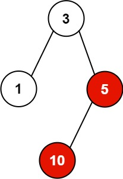

582. Kill Process

You have `n` processes forming a rooted tree structure. You are given two integer arrays `pid` and `ppid`, where `pid[i]` is the ID of the `i`th process and `ppid[i]` is the ID of the `i`th process's parent process.

Each process has only one parent process but may have multiple children processes. Only one process has `ppid[i] = 0`, which means this process has no parent process (the root of the tree).

When a process is killed, all of its children processes will also be killed.

Given an integer kill representing the ID of a process you want to kill, return a list of the IDs of the processes that will be killed. You may return the answer in any order.

 

**Example 1:**


```
Input: pid = [1,3,10,5], ppid = [3,0,5,3], kill = 5
Output: [5,10]
Explanation: The processes colored in red are the processes that should be killed.
```

**Example 2:**
```
Input: pid = [1], ppid = [0], kill = 1
Output: [1]
```

**Constraints:**

* `n == pid.length`
* `n == ppid.length`
* `1 <= n <= 5 * 10^4`
* `1 <= pid[i] <= 5 * 10^4`
* `0 <= ppid[i] <= 5 * 10^4`
* Only one process has no parent.
* All the values of `pid` are **unique**.
* `kill` is **guaranteed** to be in `pid`.

# Submissions
---
**Solution 1: (DFS)**
```
Runtime: 460 ms
Memory Usage: 26.7 MB
```
```python
class Solution:
    def killProcess(self, pid: List[int], ppid: List[int], kill: int) -> List[int]:
        process = collections.defaultdict(list)
        ans = []
        for idx, parent in enumerate(ppid):
            process[parent].append(pid[idx])
        
        def dfs(node):
            ans.append(node)
            for child in process[node]:
                dfs(child)
            
        dfs(kill)
        return ans
```