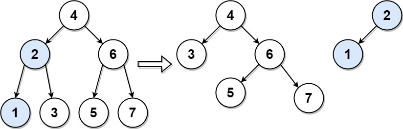

776. Split BST

Given the `root` of a binary search tree (BST) and an integer `target`, split the tree into two subtrees where one subtree has nodes that are all smaller or equal to the target value, while the other subtree has all nodes that are greater than the target value. It Is not necessarily the case that the tree contains a node with the value target.

Additionally, most of the structure of the original tree should remain. Formally, for any child `c` with parent `p` in the original tree, if they are both in the same subtree after the split, then node `c` should still have the parent `p`.

Return an array of the two roots of the two subtrees.

 

**Example 1:**


```
Input: root = [4,2,6,1,3,5,7], target = 2
Output: [[2,1],[4,3,6,null,null,5,7]]
```

**Example 2:**
```
Input: root = [1], target = 1
Output: [[1],[]]
```

**Constraints:**

* The number of nodes in the tree is in the range `[1, 50]`.
* `0 <= Node.val, target <= 1000`

# Submissions
---
**Solution 1: (Recursion)**
```
Runtime: 55 ms
Memory Usage: 14.3 MB
```
```python
# Definition for a binary tree node.
# class TreeNode:
#     def __init__(self, val=0, left=None, right=None):
#         self.val = val
#         self.left = left
#         self.right = right
class Solution:
    def splitBST(self, root: Optional[TreeNode], target: int) -> List[Optional[TreeNode]]:
        if not root:
            return None, None
        elif root.val <= target:
            bns = self.splitBST(root.right, target)
            root.right = bns[0]
            return root, bns[1]
        else:
            bns = self.splitBST(root.left, target)
            root.left = bns[1]
            return bns[0], root
```

**Solution 2: (Recursion)**
```
Runtime: 13 ms
Memory Usage: 8.5 MB
```
```c++
/**
 * Definition for a binary tree node.
 * struct TreeNode {
 *     int val;
 *     TreeNode *left;
 *     TreeNode *right;
 *     TreeNode() : val(0), left(nullptr), right(nullptr) {}
 *     TreeNode(int x) : val(x), left(nullptr), right(nullptr) {}
 *     TreeNode(int x, TreeNode *left, TreeNode *right) : val(x), left(left), right(right) {}
 * };
 */
class Solution {
private: 
    const static int LEFT_PART = 0;
    const static int RIGHT_PART = 1;
public:
    vector<TreeNode*> splitBST(TreeNode* root, int target) {
        vector<TreeNode*> result(2, nullptr); // let initailize the result with null values
        if(root == nullptr)
            return result;    
        if(root->val == target) {
            // we know we need to split the tree from this point, choose root on left side
            result[LEFT_PART] = root;
            result[RIGHT_PART] = root->right;
            root->right = nullptr;
            
        } else if(root->val >  target){
            // split will happen on the left hand side 
             vector<TreeNode*> leftResult =  splitBST(root->left, target);
             result[LEFT_PART] = leftResult[LEFT_PART];
             root->left = leftResult[RIGHT_PART]; // connect the right subtree on left side
             result[RIGHT_PART] = root;      
        } else {
             // split will happen on the right hand side 
             vector<TreeNode*> rightResult =    splitBST(root->right, target);
             result[RIGHT_PART] = rightResult[RIGHT_PART];
             root->right = rightResult[LEFT_PART]; // connect the left subtree on right side
             result[LEFT_PART] = root;  
        }
        return result;
    }
};
```
