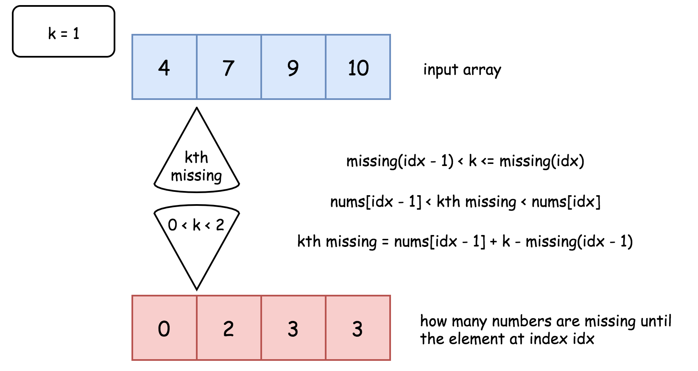

1060. Missing Element in Sorted Array

Given a sorted array `A` of unique numbers, find the `K-th` missing number starting from the leftmost number of the array.

 

**Example 1:**
```
Input: A = [4,7,9,10], K = 1
Output: 5
Explanation: 
The first missing number is 5.
```

**Example 2:**
```
Input: A = [4,7,9,10], K = 3
Output: 8
Explanation: 
The missing numbers are [5,6,8,...], hence the third missing number is 8.
```

**Example 3:**
```
Input: A = [1,2,4], K = 3
Output: 6
Explanation: 
The missing numbers are [3,5,6,7,...], hence the third missing number is 6.
```

**Note:**

* `1 <= A.length <= 50000`
* `1 <= A[i] <= 1e7`
* `1 <= K <= 1e8`

# Solution
---
## Approach 1: One Pass
**Intuition**

The problem is similar to First Missing Positive and the naive idea would be to solve it in a similar way by one pass approach.

Let's first assume that one has a function `missing(idx)` that returns how many numbers are missing until the element at index `idx`.


With the help of such a function the solution is straightforward :

* Find an index such that `missing(idx - 1) < k <= missing(idx)`. In other words, that means that kth missing number is in-between `nums[idx - 1]` and `nums[idx]`.

* One even could compute a difference between `k`th missing number and `nums[idx - 1]`. First, there are `missing(idx - 1)` missing numbers until `nums[idx - 1]`. Second, all `k - missing(idx - 1)` missing numbers from `nums[idx - 1]` to `k`th missing are consecutive ones, because all of them are less than `nums[idx]` and hence there is nothing to separate them. Together that means that kth smallest is larger than `nums[idx - 1]` by `k - missing(idx - 1)`.

* Return `k`th smallest `nums[idx - 1] + k - missing(idx - 1)`.



>The last thing to discuss is how to implement `missing(idx)` function.

Let's consider an array element at index `idx`. If there is no numbers missing, the element should be equal to `nums[idx] = nums[0] + idx`. If `k` numbers are missing, the element should be equal to `nums[idx] = nums[0] + idx + k`. Hence the number of missing elements is equal to `nums[idx] - nums[0] - idx`.


**Algorithm**

* Implement `missing(idx)` function that returns how many numbers are missing until array element with index `idx`. Function returns `nums[idx] - nums[0] - idx`.

* Find an index such that `missing(idx - 1) < k <= missing(idx)` by a linear search.

* Return `k`th smallest `nums[idx - 1] + k - missing(idx - 1)`.

**Implementation**

```python
class Solution:
    def missingElement(self, nums: List[int], k: int) -> int:
        # Return how many numbers are missing until nums[idx]
        missing = lambda idx: nums[idx] - nums[0] - idx
                
        n = len(nums)
        # If kth missing number is larger than 
        # the last element of the array
        if k > missing(n - 1):
            return nums[-1] + k - missing(n - 1) 

        idx = 1
        # find idx such that 
        # missing(idx - 1) < k <= missing(idx)
        while missing(idx) < k:
            idx += 1

        # kth missing number is greater than nums[idx - 1]
        # and less than nums[idx]
        return nums[idx - 1] + k - missing(idx - 1)
```

**Complexity Analysis**

* Time complexity: $\mathcal{O}(N)$ since in the worst case it's one pass along the array.

* Space complexity: $\mathcal{O}(1)$ since it's a constant space solution.

## Approach 2: Binary Search
**Intuition**

Approach 1 uses the linear search and doesn't profit from the fact that array is sorted. One could replace the linear search by a binary one and reduce the time complexity from $\mathcal{O}(N)$ down to $\mathcal{O}(\log N)$.

>The idea is to find the leftmost element such that the number of missing numbers until this element is less or equal to k.


**Algorithm**

* Implement `missing(idx)` function that returns how many numbers are missing until array element with index `idx`. Function returns `nums[idx] - nums[0] - idx`.

* Find an index such that `missing(idx - 1) < k <= missing(idx)` by a binary search.

* Return `k`th smallest `nums[idx - 1] + k - missing(idx - 1)`.

**Implementation**

```python
class Solution:
    def missingElement(self, nums: List[int], k: int) -> int:
        # Return how many numbers are missing until nums[idx]
        missing = lambda idx: nums[idx] - nums[0] - idx
            
        n = len(nums)
        # If kth missing number is larger than 
        # the last element of the array
        if k > missing(n - 1):
            return nums[-1] + k - missing(n - 1) 
        
        left, right = 0, n - 1
        # find left = right index such that 
        # missing(left - 1) < k <= missing(left)
        while left != right:
            pivot = left + (right - left) // 2
            
            if missing(pivot) < k:
                left = pivot + 1
            else:
                right = pivot 
        
        # kth missing number is greater than nums[left - 1]
        # and less than nums[left]
        return nums[left - 1] + k - missing(left - 1) 
```

**Complexity Analysis**

* Time complexity: $\mathcal{O}(\log N)$ since it's a binary search algorithm in the worst case when the missing number is less than the last element of the array.

* Space complexity : $\mathcal{O}(1)$ since it's a constant space solution.

# Submissions
---
**Solution 1: (One Pass)**
```
Runtime: 316 ms
Memory Usage: 20.4 MB
```
```python
class Solution:
    def missingElement(self, nums: List[int], k: int) -> int:
        # Return how many numbers are missing until nums[idx]
        missing = lambda idx: nums[idx] - nums[0] - idx
                
        n = len(nums)
        # If kth missing number is larger than 
        # the last element of the array
        if k > missing(n - 1):
            return nums[-1] + k - missing(n - 1) 

        idx = 1
        # find idx such that 
        # missing(idx - 1) < k <= missing(idx)
        while missing(idx) < k:
            idx += 1

        # kth missing number is greater than nums[idx - 1]
        # and less than nums[idx]
        return nums[idx - 1] + k - missing(idx - 1)
```

**Solution 2: (Binary Search)**
```
Runtime: 300 ms
Memory Usage: 20.3 MB
```
```python
class Solution:
    def missingElement(self, nums: List[int], k: int) -> int:
        # Return how many numbers are missing until nums[idx]
        missing = lambda idx: nums[idx] - nums[0] - idx

        n = len(nums)
        # If kth missing number is larger than 
        # the last element of the array
        if k > missing(n - 1):
            return nums[-1] + k - missing(n - 1) 

        left, right = 0, n - 1
        # find left = right index such that 
        # missing(left - 1) < k <= missing(left)
        while left != right:
            pivot = left + (right - left) // 2

            if missing(pivot) < k:
                left = pivot + 1
            else:
                right = pivot 

        # kth missing number is greater than nums[left - 1]
        # and less than nums[left]
        return nums[left - 1] + k - missing(left - 1) 
```

**Solution 3: (Greedy)**
```
Runtime: 40 ms
Memory: 31.8 MB
```
```c++
class Solution {
public:
    int missingElement(vector<int>& nums, int k) {
        nums.push_back(INT_MAX);
        int d, ans;
        for (int i = 1; i < nums.size(); i ++) {
            d = nums[i] - nums[i-1] - 1;
            if (k > d) {
                k -= d;
            } else {
                ans = nums[i-1] + k;
                break;
            }
        }
        return ans;
    }
};
```

**Solution 4: (Binary Search)**
```
Runtime: 37 ms
Memory: 31.9 MB
```
```c++
class Solution {
public:
    int missingElement(vector<int>& nums, int k) {
        int n = nums.size();
        int left = 0, right = n - 1;

        while (left <= right){
            int mid = left + (right -left) / 2;
            int total_missing_number = nums[mid] - nums[0] - mid;
            if (total_missing_number < k){
                left = mid + 1;
            } else {
                right = mid - 1;
            }
        }
        
        return nums[0] + left + k - 1;
    }
};
```
