1062. Longest Repeating Substring

Given a string `S`, find out the length of the longest repeating substring(s). Return `0` if no repeating substring exists.

 

**Example 1:**
```
Input: S = "abcd"
Output: 0
Explanation: There is no repeating substring.
```

**Example 2:**
```
Input: S = "abbaba"
Output: 2
Explanation: The longest repeating substrings are "ab" and "ba", each of which occurs twice.
```

**Example 3:**
```
Input: S = "aabcaabdaab"
Output: 3
Explanation: The longest repeating substring is "aab", which occurs 3 times.
```

**Example 4:**
```
Input: S = "aaaaa"
Output: 4
Explanation: The longest repeating substring is "aaaa", which occurs twice.
```

**Constraints:**

* The string `S` consists of only lowercase English letters from `'a' - 'z'`.
* `1 <= S.length <= 1500`

# Submissions
---
### Split into two subtasks
Let's focus here on the solutions which are performing better than naive $\mathcal{O}(N^2)$ at least in the best/average cases.

Here we have "two in one" problem :

1. Perform a search by a substring length in the interval from 1 to N.

1. Check if there is a duplicate substring of a given length L.

**Subtask one : Binary search by a substring length**

A naive solution would be to check all possible string length one by one starting from N - 1: if there is a duplicate substring of length N - 1, then of length N - 2, etc. Note that if there is a duplicate substring of length k, that means that there is a duplicate substring of length k - 1. Hence one could use a binary search by string length here, and have the first problem solved in $\mathcal{O}(\log N)$ time.

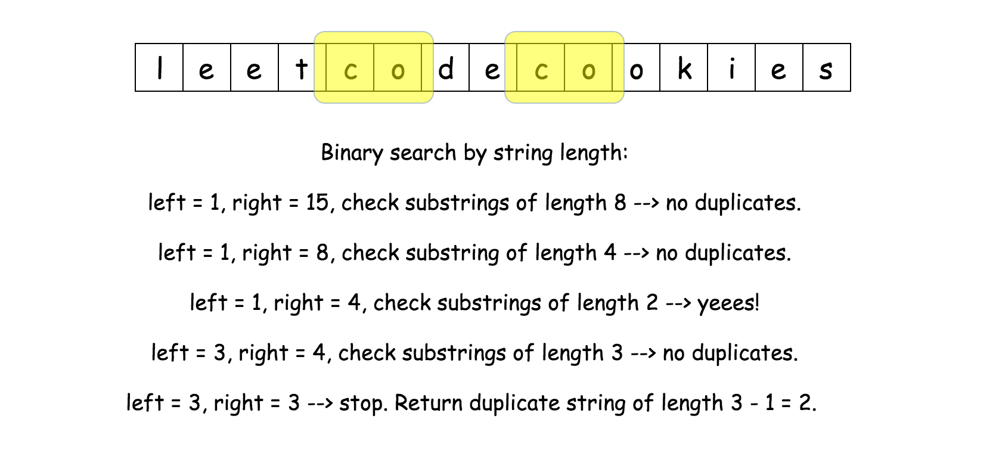

The binary search code is quite standard and we will use it here for all approaches to focus on much more interesting subtask number two.

```python
class Solution:
    def search(self, L: int, n: int, S: str) -> str:
        """
        Search a substring of given length
        that occurs at least 2 times.
        @return start position if the substring exits and -1 otherwise.
        """
        # Subtask 2 : TODO
        
    def longestRepeatingSubstring(self, S: str) -> str:
        n = len(S)
        
        # binary search, L = repeating string length
        left, right = 1, n
        while left <= right:
            L = left + (right - left) // 2
            if self.search(L, n, S) != -1:
                left = L + 1
            else:
                right = L - 1
               
        return left - 1
```

**Subtask two : Check if there is a duplicate substring of length L**

We will discuss here three different ideas how to proceed. They are all based on sliding window + hashset, though their performance and space consumption are quite different.

1. Linear-time slice + hashset of already seen strings. $\mathcal{O}((N - L) L)$ time complexity and huge space consumption in the case of large strings.

1. Linear-time slice + hashset of hashes of already seen strings. $\mathcal{O}((N - L) L)$ time complexity and moderate space consumption even in the case of large strings.

1. Rabin-Karp = constant-time slice + hashset of hashes of already seen strings. Hashes are computed with the rolling hash algorithm. $\mathcal{O}(N - L)$ time complexity and moderate space consumption even in the case of large strings.

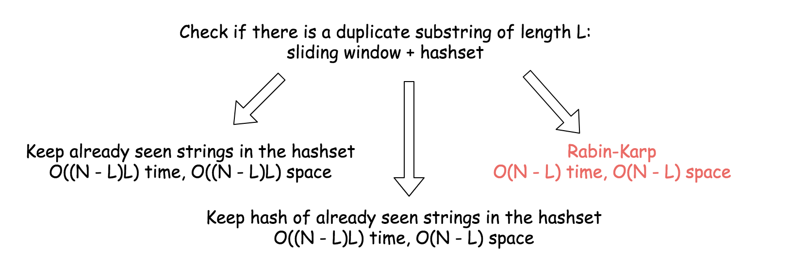

## Approach 1: Binary Search + Hashset of Already Seen Strings
The idea is straightforward :

* Move a sliding window of length L along the string of length N.

* Check if the string in the sliding window is in the hashset of already seen strings.

    * If yes, the duplicate substring is right here.

    * If not, save the string in the sliding window in the hashset.

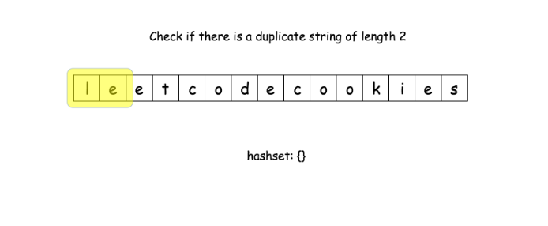
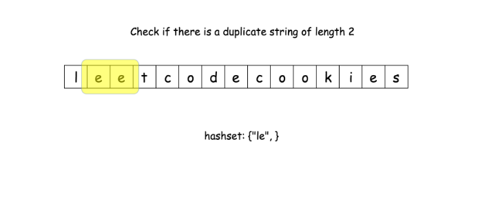
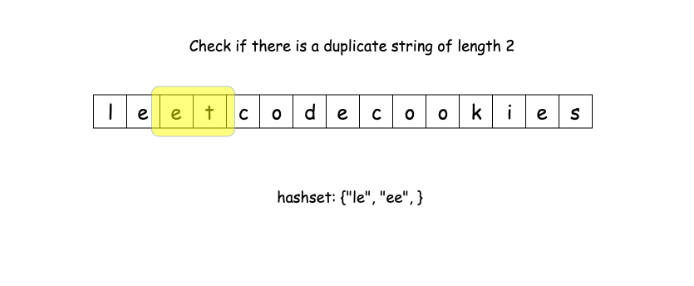
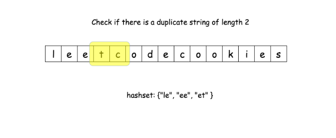
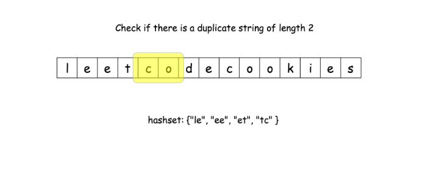
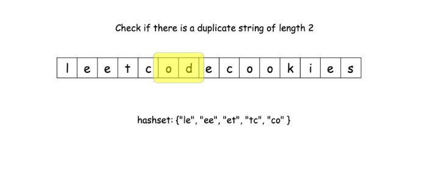
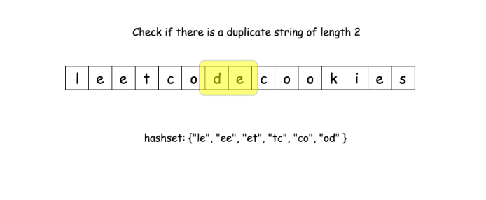
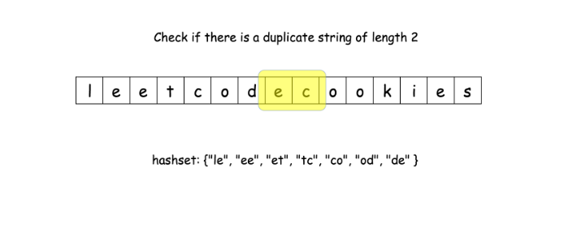
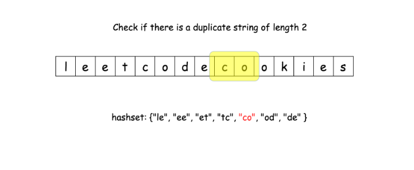
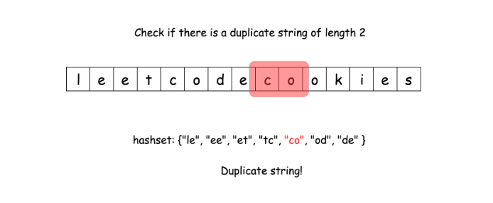

Obvious drawback of this approach is a huge memory consumption in the case of large strings.

```python
class Solution:
    def search(self, L: int, n: int, S: str) -> str:
        """
        Search a substring of given length
        that occurs at least 2 times.
        @return start position if the substring exits and -1 otherwise.
        """
        seen = set()
        for start in range(0, n - L + 1):
            tmp = S[start:start + L]
            if tmp in seen:
                return start
            seen.add(tmp)
        return -1
        
    def longestRepeatingSubstring(self, S: str) -> str:
        n = len(S)
        
        # binary search, L = repeating string length
        left, right = 1, n
        while left <= right:
            L = left + (right - left) // 2
            if self.search(L, n, S) != -1:
                left = L + 1
            else:
                right = L - 1
               
        return left - 1
```

**Complexity Analysis**

* Time complexity : $\mathcal{O}(N \log N)$ in the average case and $\mathcal{O}(N^2)$ in the worst case. One needs $\mathcal{O}((N - L)L)$ for one duplicate check, and one does up to $\mathcal{O}(\log N)$ checks. Together that results in $\mathcal{O}(\sum\limits_{L}{(N - L)L})$, i.e. in $\mathcal{O}(N \log N)$ in the average case and in $\mathcal{O}(N^2)$ in the worst case of L close to $N/2$.

* Space complexity : $\mathcal{O}(N^2)$ to keep the hashset.

## Approach 2: Binary Search + Hashset of Hashes of Already Seen Strings
To reduce the memory consumption by the hashset structure, one could store not the full strings, but their hashes.

The drawback of this approach is a time performance, which is still not always linear.

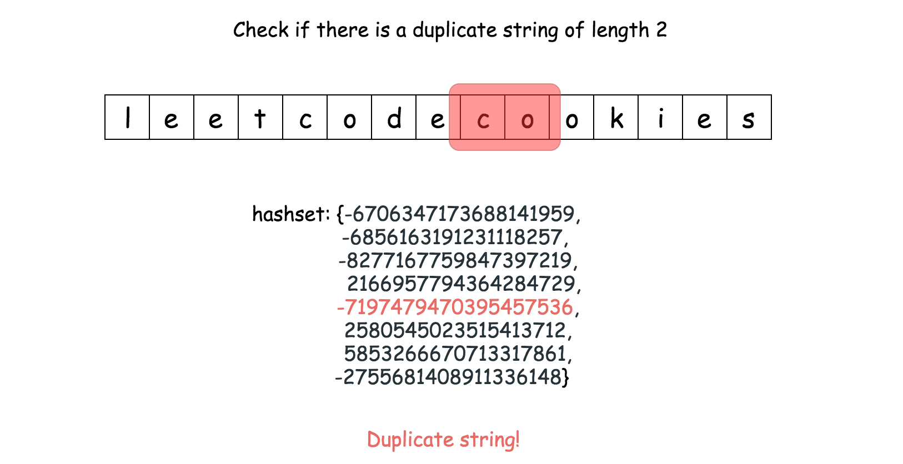

```python
class Solution:
    def search(self, L: int, n: int, S: str) -> str:
        """
        Search a substring of given length
        that occurs at least 2 times.
        @return start position if the substring exits and -1 otherwise.
        """
        seen = set()
        for start in range(0, n - L + 1):
            tmp = S[start:start + L]
            h = hash(tmp)
            if h in seen:
                return start
            seen.add(h)
        return -1
        
    def longestRepeatingSubstring(self, S: str) -> str:
        n = len(S)
        
        # binary search, L = repeating string length
        left, right = 1, n
        while left <= right:
            L = left + (right - left) // 2
            if self.search(L, n, S) != -1:
                left = L + 1
            else:
                right = L - 1
               
        return left - 1
```

**Complexity Analysis**

* Time complexity : $\mathcal{O}(N \log N)$ in the average case and $\mathcal{O}(N^2)$ in the worst case. One needs $\mathcal{O}((N - L)L)$ for one duplicate check, and one does up to $\mathcal{O}(\log N)$ checks. Together that results in $\mathcal{O}(\sum\limits_{L}{(N - L)L})$, i.e. in $\mathcal{O}(N \log N)$ in the average case and in $\mathcal{O}(N^2)$ in the worst case of L close to $N/2$.

* Space complexity : $\mathcal{O}(N)$ to keep the hashset.

## Approach 3: Binary Search + Rabin-Karp
Rabin-Karp algorithm is used to perform a multiple pattern search in a linear time and with a moderate memory consumption suitable for the large strings.

The linear time implementation of this idea is a bit tricky because of two technical problems:

1. How to implement a string slice in a constant time?

1. Hashset memory consumption could be huge for very long strings. One could keep the string hash instead of string itself but hash generation costs $\mathcal{O}(L)$ for the string of length L, and the complexity of algorithm would be $\mathcal{O}((N - L)L)$, N - L for the slice and L for the hash generation. One has to think how to generate hash in a constant time here.

Let's now address these problems.

String slice in a constant time

That's a very language-dependent problem. For the moment for Java and Python there is no straightforward solution, and to move sliding window in a constant time one has to convert string to another data structure.

The simplest solution both for Java and Python is to convert string to integer array of ascii-values.

**Rolling hash : hash generation in a constant time**

To generate hash of array of length L, one needs $\mathcal{O}(L)$ time.

>How to have constant time of hash generation? Use the advantage of slice: only one integer in, and only one - out.

That's the idea of rolling hash. Here we'll implement the simplest one, polynomial rolling hash. Beware that's polynomial rolling hash is NOT the Rabin fingerprint.

Since one deals here with lowercase English letters, all values in the integer array are between 0 and 25 : arr[i] = (int)S.charAt(i) - (int)'a'.
So one could consider string abcd -> [0, 1, 2, 3] as a number in a numeral system with the base 26. Hence abcd -> [0, 1, 2, 3] could be hashed as

$h_0 = 0 \times 26^3 + 1 \times 26^2 + 2 \times 26^1 + 3 \times 26^0$

Let's write the same formula in a generalised way, where $c_i$ is an integer array element and $a = 26$ is a system base.

$h_0 = c_0 a^{L - 1} + c_1 a^{L - 2} + ... + c_i a^{L - 1 - i} + ... + c_{L - 1} a^1 + c_L a^0$

$h_0 = \sum_{i = 0}^{L - 1}{c_i a^{L - 1 - i}}$

Now let's consider the slice abcd -> bcde. For int arrays that means [0, 1, 2, 3] -> [1, 2, 3, 4], to remove number 0 and to add number 4.

$h_1 = (h_0 - 0 \times 26^3) \times 26 + 4 \times 26^0$

In a generalised way

$h_1 = (h_0 a - c_0 a^L) + c_{L + 1}$
 

Now hash regeneration is perfect and fits in a constant time. There is one more issue to address: possible overflow problem.

How to avoid overflow

$a^L$ could be a large number and hence the idea is to set limits to avoid the overflow. To set limits means to limit a hash by a given number called modulus and use everywhere not hash itself but h % modulus.

It's quite obvious that modulus should be large enough, but how large? Here one could read more about the topic, for the problem here $2^{24}$ is enough.

In a real life, when not all testcases are known in advance, one has to check if the strings with equal hashes are truly equal. Such false-positive strings could happen because of a modulus which is too small and strings which are too long. That leads to Rabin-Karp time complexity $\mathcal{O}(NL)$ in the worst case then almost all strings are false-positive. Here it's not the case because all testcases are known and one could adjust the modulus.

Another one overflow issue here is purely Java related. While in Python the hash regeneration goes perfectly fine, in Java the same thing is better to rewrite to avoid long overflow.

```python
h = (h * a - nums[start - 1] * aL + nums[start + L - 1]) % modulus
```

**Rabin-Karp algorithm**

search(L) :

* Compute the hash of substring S.substring(0, L) and initiate the hashset of already seen substring with this value.

* Iterate over the start position of substring : from 1 to $N - L$.

    * Compute rolling hash based on the previous hash value.

    * Return start position if the hash is in the hashset, because that means one met the duplicate.

    * Otherwise, add hash in the hashset.

* Return -1, that means there is no duplicate string of length L.

**Implementation**

```python
class Solution:
    def search(self, L: int, a: int, modulus: int, n: int, nums: List[int]) -> str:
        """
        Rabin-Karp with polynomial rolling hash.
        Search a substring of given length
        that occurs at least 2 times.
        @return start position if the substring exits and -1 otherwise.
        """
        # compute the hash of string S[:L]
        h = 0
        for i in range(L):
            h = (h * a + nums[i]) % modulus
              
        # already seen hashes of strings of length L
        seen = {h} 
        # const value to be used often : a**L % modulus
        aL = pow(a, L, modulus) 
        for start in range(1, n - L + 1):
            # compute rolling hash in O(1) time
            h = (h * a - nums[start - 1] * aL + nums[start + L - 1]) % modulus
            if h in seen:
                return start
            seen.add(h)
        return -1
        
    def longestRepeatingSubstring(self, S: str) -> str:
        n = len(S)
        # convert string to array of integers
        # to implement constant time slice
        nums = [ord(S[i]) - ord('a') for i in range(n)]
        # base value for the rolling hash function
        a = 26
        # modulus value for the rolling hash function to avoid overflow
        modulus = 2**24
        
        # binary search, L = repeating string length
        left, right = 1, n
        while left <= right:
            L = left + (right - left) // 2
            if self.search(L, a, modulus, n, nums) != -1:
                left = L + 1
            else:
                right = L - 1
               
        return left - 1
```

**Complexity Analysis**

* Time complexity : $\mathcal{O}(N \log N)$. $\mathcal{O}(\log N)$ for the binary search and $\mathcal{O}(N)$ for Rabin-Karp algorithm.
* Space complexity : $\mathcal{O}(N)$ to keep the hashset.

# Submissions
---
**Solution 1: (Binary Search + Hashset of Already Seen Strings)**
```
Runtime: 40 ms
Memory Usage: 14 MB
```
```python
class Solution:
    def search(self, L: int, n: int, S: str) -> str:
        """
        Search a substring of given length
        that occurs at least 2 times.
        @return start position if the substring exits and -1 otherwise.
        """
        seen = set()
        for start in range(0, n - L + 1):
            tmp = S[start:start + L]
            if tmp in seen:
                return start
            seen.add(tmp)
        return -1
    
    def longestRepeatingSubstring(self, S: str) -> int:
        n = len(S)

        # binary search, L = repeating string length
        left, right = 1, n
        while left <= right:
            L = left + (right - left) // 2
            if self.search(L, n, S) != -1:
                left = L + 1
            else:
                right = L - 1

        return left - 1
```

**Solution 2: (Binary Search + Rabin-Karp)**
```
Runtime: 32 ms
Memory Usage: 14 MB
```
```python
class Solution:
    def search(self, L: int, a: int, modulus: int, n: int, nums: List[int]) -> str:
        """
        Rabin-Karp with polynomial rolling hash.
        Search a substring of given length
        that occurs at least 2 times.
        @return start position if the substring exits and -1 otherwise.
        """
        # compute the hash of string S[:L]
        h = 0
        for i in range(L):
            h = (h * a + nums[i]) % modulus

        # already seen hashes of strings of length L
        seen = {h} 
        # const value to be used often : a**L % modulus
        aL = pow(a, L, modulus) 
        for start in range(1, n - L + 1):
            # compute rolling hash in O(1) time
            h = (h * a - nums[start - 1] * aL + nums[start + L - 1]) % modulus
            if h in seen:
                return start
            seen.add(h)
        return -1
    
    def longestRepeatingSubstring(self, S: str) -> int:
        n = len(S)
        # convert string to array of integers
        # to implement constant time slice
        nums = [ord(S[i]) - ord('a') for i in range(n)]
        # base value for the rolling hash function
        a = 26
        # modulus value for the rolling hash function to avoid overflow
        modulus = 2**24

        # binary search, L = repeating string length
        left, right = 1, n
        while left <= right:
            L = left + (right - left) // 2
            if self.search(L, a, modulus, n, nums) != -1:
                left = L + 1
            else:
                right = L - 1

        return left - 1
```

**Solution 3: (DP Bottom-Up)**

s =   "a  b  b  a  b  a"
dp  0  1  2  3  4  5  6 j
0
1               1     1
2            1     2
3                  1
4                     2
5
6
i

```
Runtime: 18 ms, Beats 69.44%
Memory: 37.33 MB, Beats 49.07%
```
```c++
class Solution {
public:
    int longestRepeatingSubstring(string s) {
        int n = s.length(), i, j;
        vector<vector<int>> dp(n + 1, vector<int>(n + 1));
        int maxLength = 0;

        // Populate the DP array
        for (i = 1; i <= n; i++) {
            for (j = i + 1; j <= n; j++) {
                // Check if the characters match and update the DP value
                if (s[i - 1] == s[j - 1]) {
                    dp[i][j] = dp[i - 1][j - 1] + 1;
                    maxLength = max(maxLength, dp[i][j]);  // Update maxLength
                }
            }
        }
        return maxLength;
    }
};
```
