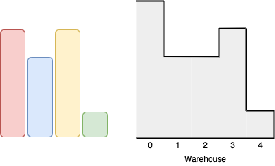

1564. Put Boxes Into the Warehouse I

You are given two arrays of positive integers, `boxes` and `warehouse`, representing the heights of some boxes of unit width and the heights of `n` rooms in a warehouse respectively. The warehouse's rooms are labelled from `0` to `n - 1` from left to right where `warehouse[i]` (`0`-indexed) is the height of the ith room.

Boxes are put into the warehouse by the following rules:

* Boxes cannot be stacked.
* You can rearrange the insertion order of the boxes.
* Boxes can only be pushed into the warehouse from left to right only.
* If the height of some room in the warehouse is less than the height of a box, then that box and all other boxes behind it will be stopped before that room.
* Return the maximum number of boxes you can put into the warehouse.

 

**Example 1:**


```
Input: boxes = [4,3,4,1], warehouse = [5,3,3,4,1]
Output: 3
Explanation: 

We can first put the box of height 1 in room 4. Then we can put the box of height 3 in either of the 3 rooms 1, 2, or 3. Lastly, we can put one box of height 4 in room 0.
There is no way we can fit all 4 boxes in the warehouse.
```


**Example 2:**


```
Input: boxes = [1,2,2,3,4], warehouse = [3,4,1,2]
Output: 3
Explanation: 

Notice that it's not possible to put the box of height 4 into the warehouse since it cannot pass the first room of height 3.
Also, for the last two rooms, 2 and 3, only boxes of height 1 can fit.
We can fit 3 boxes maximum as shown above. The yellow box can also be put in room 2 instead.
Swapping the orange and green boxes is also valid, or swapping one of them with the red box.
```


**Example 3:**
```
Input: boxes = [1,2,3], warehouse = [1,2,3,4]
Output: 1
Explanation: Since the first room in the warehouse is of height 1, we can only put boxes of height 1.
```

**Example 4:**
```
Input: boxes = [4,5,6], warehouse = [3,3,3,3,3]
Output: 0
```

**Constraints:**

* `n == warehouse.length`
* `1 <= boxes.length, warehouse.length <= 10^5`
* `1 <= boxes[i], warehouse[i] <= 10^9`

# Submissions
---
**Solution 1: (Add Smallest Boxes to the Rightmost Warehouse Rooms, think forward)**
```
Runtime: 624 ms
Memory Usage: 30.1 MB
```
```python
class Solution:
    def maxBoxesInWarehouse(self, boxes: List[int], warehouse: List[int]) -> int:
        # Preprocess the height of the warehouse rooms to get usable heights
        for i in range(1, len(warehouse)):
            warehouse[i] = min(warehouse[i - 1], warehouse[i])

        # Iterate through boxes from the smallest to the largest
        boxes.sort()

        count = 0

        for room in reversed(warehouse):
            # Count the boxes that can fit in the current warehouse room
            if count < len(boxes) and boxes[count] <= room:
                count += 1

        return count
```

**Solution 2: (Add Largest Possible Boxes from Left to Right, think backward)**
```
Runtime: 596 ms
Memory Usage: 33.2 MB
```
```python
class Solution:
    def maxBoxesInWarehouse(self, boxes: List[int], warehouse: List[int]) -> int:
        
        i = 0
        count = 0
        boxes.sort(reverse = True)

        for room in warehouse:
            # Iterate through boxes from largest to smallest
            # Discard boxes that doesn't fit in the current warehouse
            while i < len(boxes) and boxes[i] > room:
                i += 1
            if i == len(boxes):
                return count
            count += 1
            i += 1

        return count
```