159. Longest Substring with At Most Two Distinct Characters

Given a string **s** , find the length of the longest substring **t**  that contains **at most** 2 distinct characters.

**Example 1:**
```
Input: "eceba"
Output: 3
Explanation: t is "ece" which its length is 3.
```

**Example 2:**
```
Input: "ccaabbb"
Output: 5
Explanation: t is "aabbb" which its length is 5.
```

# Solution
---
## Approach 1: Sliding Window
**Intuition**

To solve the problem in one pass let's use here sliding window approach with two set pointers `left` and `right` serving as the window boundaries.

The idea is to set both pointers in the position `0` and then move `right` pointer to the right while the window contains not more than two distinct characters. If at some point we've got `3` distinct characters, let's move `left` pointer to keep not more than `2` distinct characters in the window.

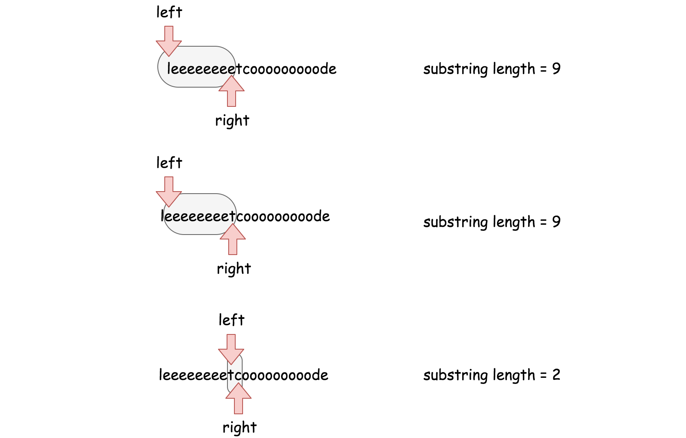

Basically that's the algorithm : to move sliding window along the string, to keep not more than `2` distinct characters in the window, and to update max substring length at each step.

>There is just one more question to reply - how to move the `left` pointer to keep only `2` distinct characters in the string?

Let's use for this purpose hashmap containing all characters in the sliding window as keys and their rightmost positions as values. At each moment, this hashmap could contain not more than `3` elements.

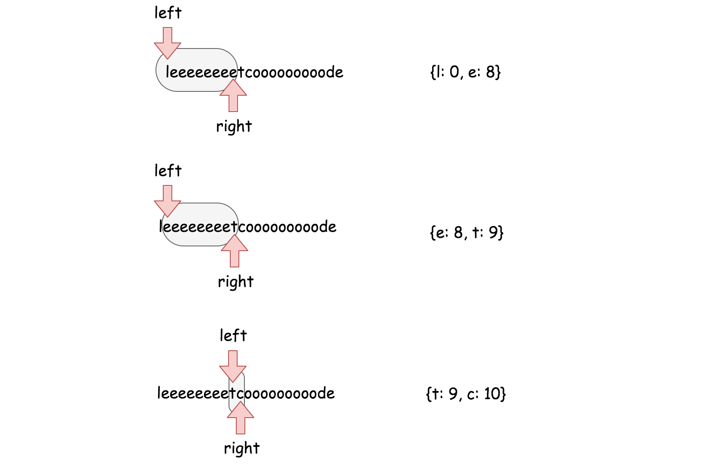

For example, using this hashmap one knows that the rightmost position of character `e` in `"eeeeeeeet"` window is `8` and so one has to move `left` pointer in the position `8 + 1 = 9` to exclude the character `e` from the sliding window.

Do we have here the best possible time complexity? Yes, we do - it's the only one pass along the string with N characters and the time complexity is $\mathcal{O}(N)$.

**Algorithm**

Now one could write down the algortihm.

* Return `N` if the string length `N` is smaller than `3`.
* Set both set pointers in the beginning of the string `left = 0` and `right = 0` and init max substring length `max_len = 2`.
* While `right` pointer is less than `N`:
* If hashmap contains less than `3` distinct characters, add the current character `s[right]` in the hashmap and move `right` pointer to the right.
* If hashmap contains `3` distinct characters, remove the leftmost character from the hashmap and move the `left` pointer so that sliding window contains again 2 distinct characters only.
* Update `max_len`.

**Implementation**

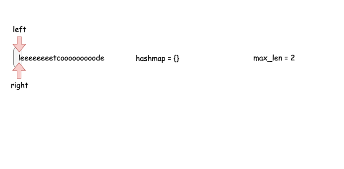
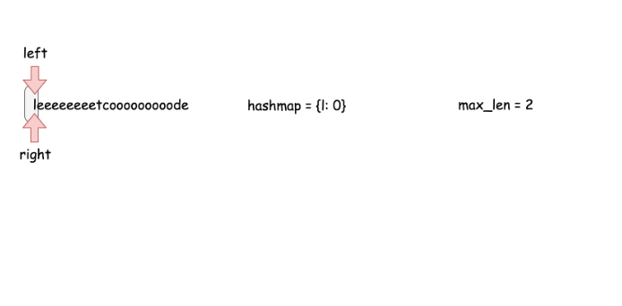
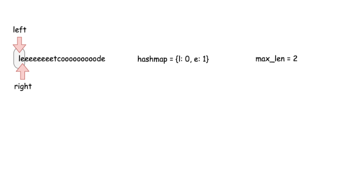
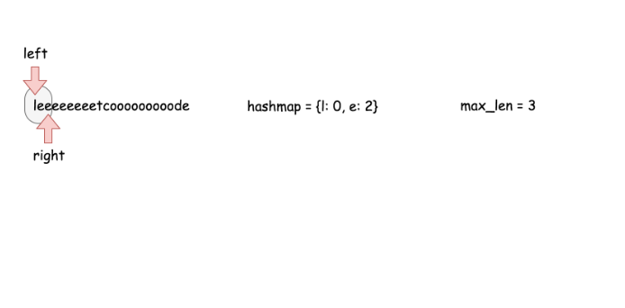
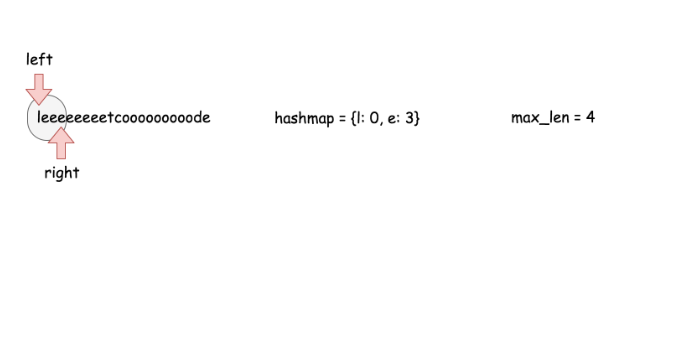
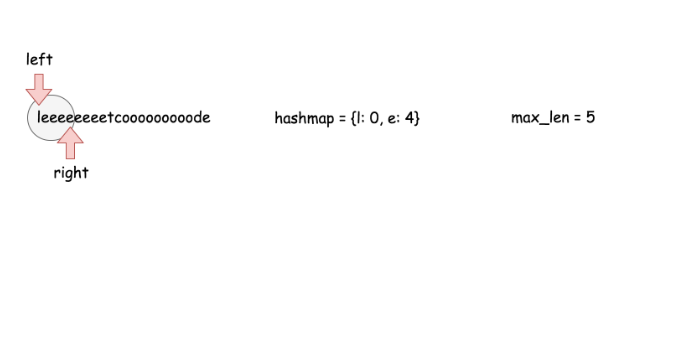


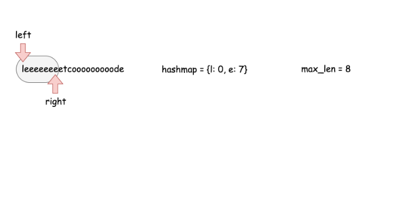
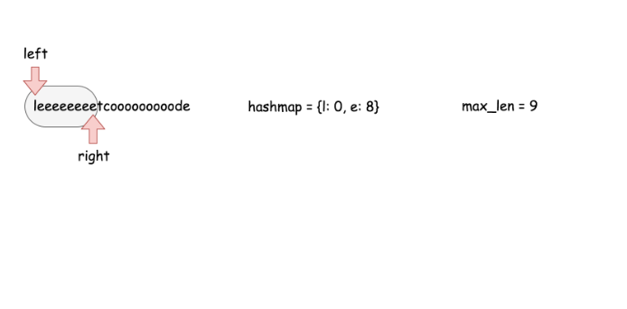
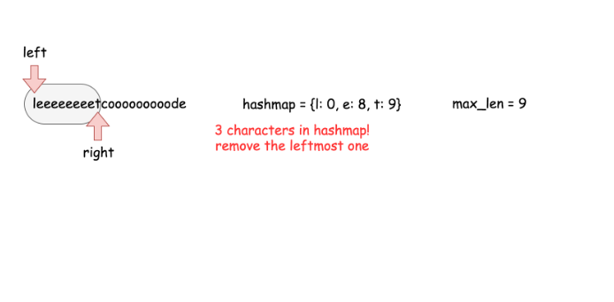
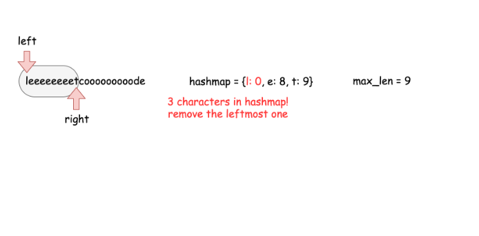
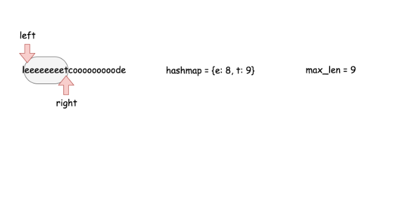
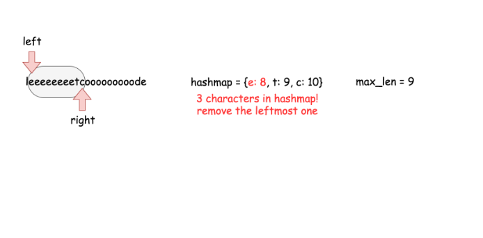
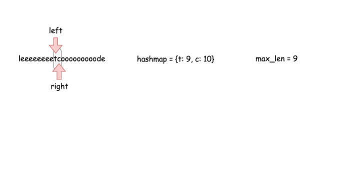
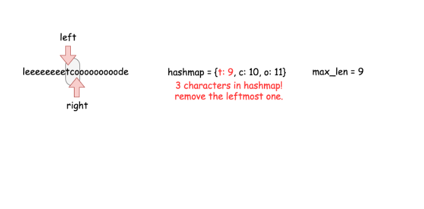
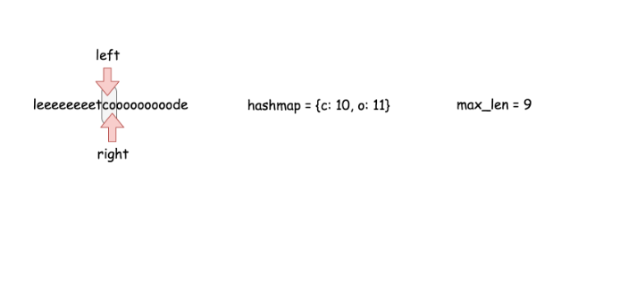
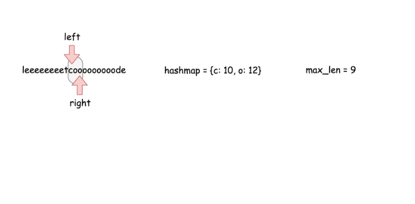
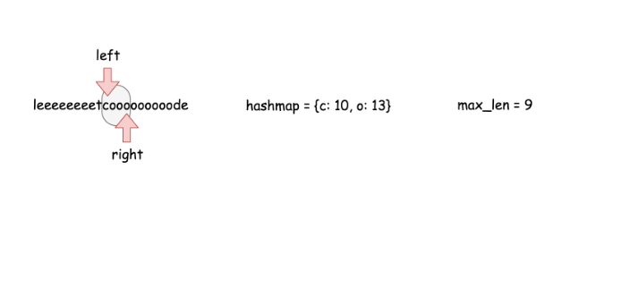
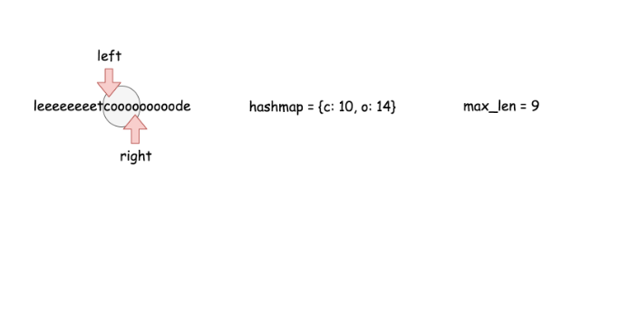
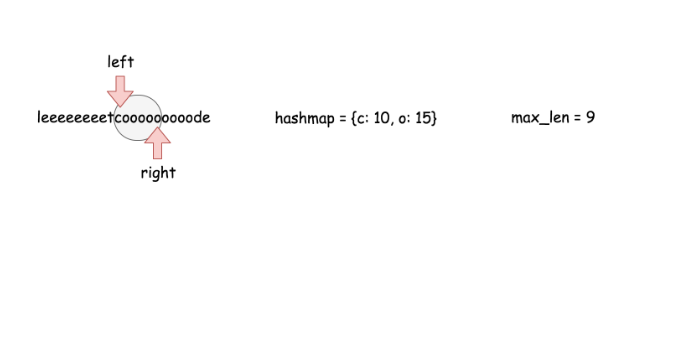
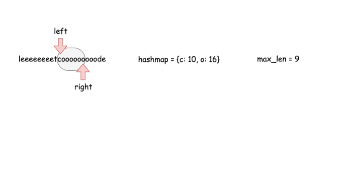
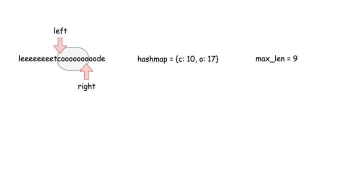
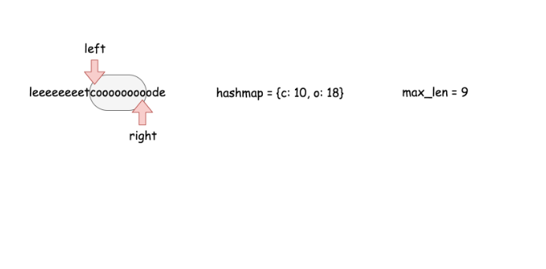
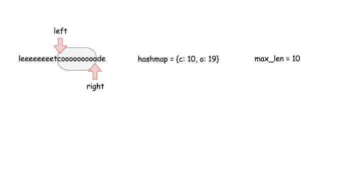
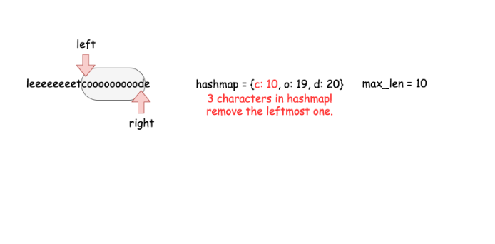

```python
from collections import defaultdict
class Solution:
    def lengthOfLongestSubstringTwoDistinct(self, s: 'str') -> 'int':
        n = len(s) 
        if n < 3:
            return n
        
        # sliding window left and right pointers
        left, right = 0, 0
        # hashmap character -> its rightmost position 
        # in the sliding window
        hashmap = defaultdict()

        max_len = 2
        
        while right < n:
            # slidewindow contains less than 3 characters
            if len(hashmap) < 3:
                hashmap[s[right]] = right
                right += 1

            # slidewindow contains 3 characters
            if len(hashmap) == 3:
                # delete the leftmost character
                del_idx = min(hashmap.values())
                del hashmap[s[del_idx]]
                # move left pointer of the slidewindow
                left = del_idx + 1

            max_len = max(max_len, right - left)

        return max_len
```

**Complexity Analysis**

* Time complexity : $\mathcal{O}(N)$ where N is a number of characters in the input string.

* Space complexity : $\mathcal{O}(1)$ since additional space is used only for a hashmap with at most 3 elements.

**Problem generalization**

The same sliding window approach could be used to solve the generalized problem :

# Submissions
---
**Solution 1: (Sliding Window)**
```
Runtime: 48 ms
Memory Usage: 14 MB
```
```python
class Solution:
    def lengthOfLongestSubstringTwoDistinct(self, s: str) -> int:
        n = len(s) 
        if n < 3:
            return n
        
        # sliding window left and right pointers
        left, right = 0, 0
        # hashmap character -> its rightmost position 
        # in the sliding window
        hashmap = defaultdict()

        max_len = 2
        
        while right < n:
            # slidewindow contains less than 3 characters
            if len(hashmap) < 3:
                hashmap[s[right]] = right
                right += 1

            # slidewindow contains 3 characters
            if len(hashmap) == 3:
                # delete the leftmost character
                del_idx = min(hashmap.values())
                del hashmap[s[del_idx]]
                # move left pointer of the slidewindow
                left = del_idx + 1

            max_len = max(max_len, right - left)

        return max_len
```

**Solution 2: (Sliding Window)**
```
Runtime: 136 ms, Beats 22.02%
Memory: 37.34 MB, Beats 22.03%
```
```c++
class Solution {
public:
    int lengthOfLongestSubstringTwoDistinct(string s) {
        int n = s.size(), i = 0, j, ans = 0;
        unordered_map<char,int> cnt;
        for (j = 0; j < n; j ++) {
            cnt[s[j]] += 1;
            while (cnt.size() > 2) {
                cnt[s[i]] -= 1;
                if (cnt[s[i]] == 0) {
                    cnt.erase(s[i]);
                }
                i += 1;
            }
            ans = max(ans, j-i+1);
        }
        return ans;
    }
};
```

**Solution 3: (Sliding Window)**

         0 1 2 3 4
    s = "e c e b a"
                   j
             i
cnt
a                1
b              1
c             
e            1  

ans      1 2 3

```
Runtime: 120 ms, Beats 70.41%
Memory: 34.97 MB, Beats 73.47%
```
```c++
class Solution {
public:
    int lengthOfLongestSubstringTwoDistinct(string s) {
        int n = s.size(), i = 0, j;
        unordered_map<char,int> cnt;
        for (j = 0; j < n; j ++) {
            cnt[s[j]] += 1;
            if (cnt.size() > 2) {
                cnt[s[i]] -= 1;
                if (cnt[s[i]] == 0) {
                    cnt.erase(s[i]);
                }
                i += 1;
            }
        }
        return j - i;
    }
};
```
