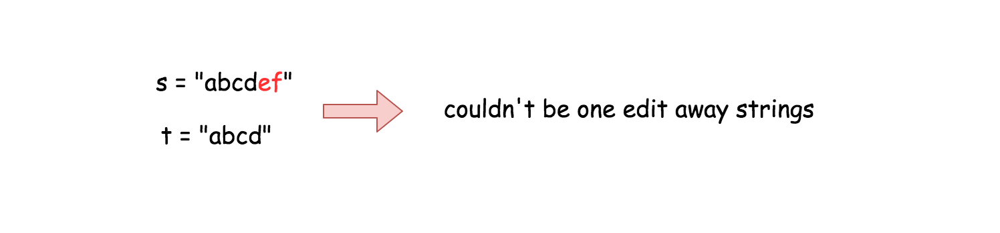
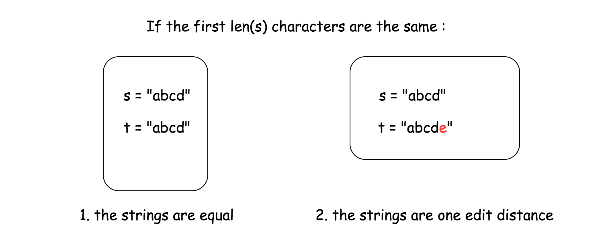
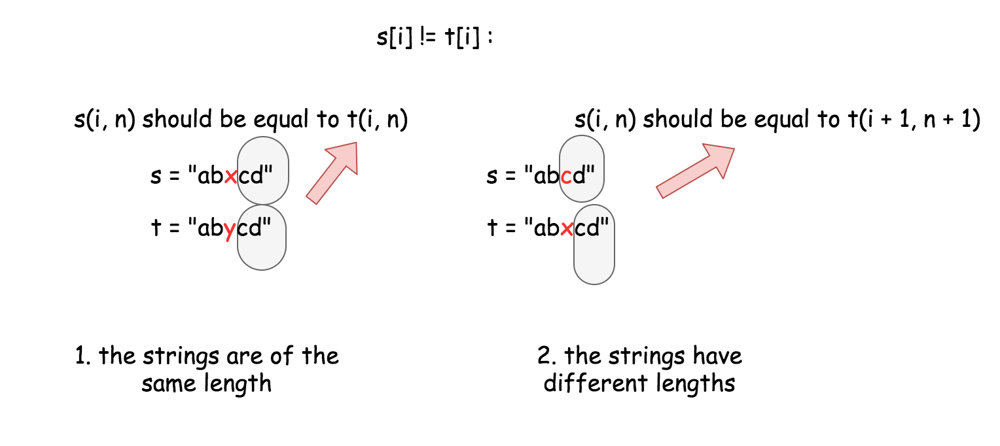

161. One Edit Distance

Given two strings **s** and **t**, determine if they are both one edit distance apart.

**Note:**

There are 3 possiblities to satisify one edit distance apart:

1. Insert a character into **s** to get **t**
1. Delete a character from **s** to get **t**
1. Replace a character of **s** to get **t**

**Example 1:**
```
Input: s = "ab", t = "acb"
Output: true
Explanation: We can insert 'c' into s to get t.
```

**Example 2:**
```
Input: s = "cab", t = "ad"
Output: false
Explanation: We cannot get t from s by only one step.
```

**Example 3:**
```
Input: s = "1203", t = "1213"
Output: true
Explanation: We can replace '0' with '1' to get t.
```

# Solution
---
## Approach 1: One pass algorithm
**Intuition**

First of all, let's ensure that the string lengths are not too far from each other. If the length difference is 2 or more characters, then `s` and `t` couldn't be one edit away strings.



For the next let's assume that `s` is always shorter or the same length as `t`. If not, one could always call `isOneEditDistance(t, s)` to inverse the string order.

Now it's time to pass along the strings and to look for the first different character.

If there is no differences between the first `len(s)` characters, only two situations are possible :

* The strings are equal.

* The strings are one edit away distance.



Now what if there is a different character so that `s[i] != t[i]`.

* If the strings are of the same length, all next characters should be equal to keep one edit away distance. To verify it, one has to compare the substrings of `s` and `t` both starting from the `i + 1`th character.

* If `t` is one character longer than `s`, the additional character `t[i]` should be the only difference between both strings. To verify it, one has to compare a substring of `s` starting from the `i`th character and a substring of `t` starting from the `i + 1`th character.



**Implementation**

```python
class Solution:
    def isOneEditDistance(self, s: 'str', t: 'str') -> 'bool':
        ns, nt = len(s), len(t)

        # Ensure that s is shorter than t.
        if ns > nt:
            return self.isOneEditDistance(t, s)

        # The strings are NOT one edit away distance  
        # if the length diff is more than 1.
        if nt - ns > 1:
            return False

        for i in range(ns):
            if s[i] != t[i]:
                # if strings have the same length
                if ns == nt:
                    return s[i + 1:] == t[i + 1:]
                # if strings have different lengths
                else:
                    return s[i:] == t[i + 1:]
        
        # If there is no diffs on ns distance
        # the strings are one edit away only if
        # t has one more character. 
        return ns + 1 == nt
```

**Complexity Analysis**

* Time complexity : $\mathcal{O}(N)$ in the worst case when string lengths are close enough abs(ns - nt) <= 1, where N is a number of characters in the longest string. $\mathcal{O}(1)$ in the best case when abs(ns - nt) > 1.

* Space complexity : $\mathcal{O}(N)$ because strings are immutable in Python and Java and to create substring costs $\mathcal{O}(N)$ space.

**Problem generalization : Edit distance**

Given two words word1 and word2, find the minimum number of operations required to convert word1 to word2.

# Submissions
---
**Solution 1: (One pass algorithm)**
```
Runtime: 32 ms
Memory Usage: 13.9 MB
```
```python
class Solution:
    def isOneEditDistance(self, s: str, t: str) -> bool:
        ns, nt = len(s), len(t)

        # Ensure that s is shorter than t.
        if ns > nt:
            return self.isOneEditDistance(t, s)

        # The strings are NOT one edit away distance  
        # if the length diff is more than 1.
        if nt - ns > 1:
            return False

        for i in range(ns):
            if s[i] != t[i]:
                # if strings have the same length
                if ns == nt:
                    return s[i + 1:] == t[i + 1:]
                # if strings have different lengths
                else:
                    return s[i:] == t[i + 1:]
        
        # If there is no diffs on ns distance
        # the strings are one edit away only if
        # t has one more character. 
        return ns + 1 == nt
```

**Solution 2: (one pass)**
```
Runtime: 24 ms
Memory Usage: 14 MB
```
```python
class Solution:
    def isOneEditDistance(self, s: str, t: str) -> bool:
        if s == t or abs(len(s) - len(t)) > 1:
            return False
        for i in range(min(len(s), len(t))):
            if s[i] != t[i]:
                delete_one = s[:i] + s[i+1:]
                add_one = s[:i] + t[i] + s[i:]
                replace_one = s[:i] + t[i] + s[i+1:]
                return delete_one == t or \
                       add_one == t or \
                       replace_one == t
        return True
```