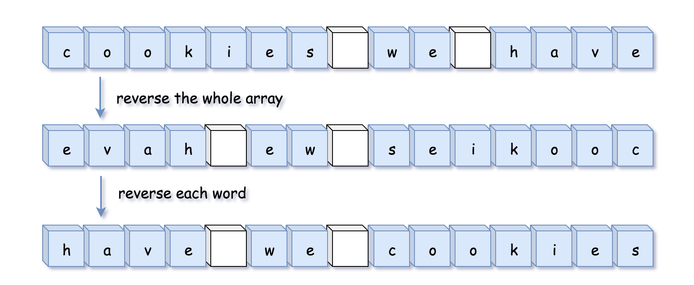
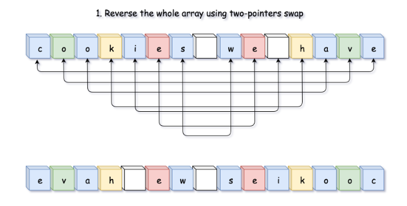
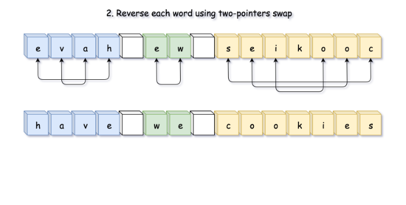

186. Reverse Words in a String II

Given an input string , reverse the string word by word. 

**Example:**
```
Input:  ["t","h","e"," ","s","k","y"," ","i","s"," ","b","l","u","e"]
Output: ["b","l","u","e"," ","i","s"," ","s","k","y"," ","t","h","e"]
```

**Note:** 

* A word is defined as a sequence of non-space characters.
* The input string does not contain leading or trailing spaces.
* The words are always separated by a single space.

**Follow up:** Could you do it in-place without allocating extra space?

# Solution
---
## Approach 1: Reverse the Whole String and Then Reverse Each Word
To have this problem in Amazon interview is a good situation, since input is a mutable structure and hence one could aim \mathcal{O}(1)O(1) space solution without any technical difficulties.

>The idea is simple: reverse the whole string and then reverse each word.



**Algorithm**

Let's first implement two functions:

* `reverse(l: list, left: int, right: int)`, which reverses array characters between `left` and `right` pointers. C++ users could directly use built-in `std::reverse`.

* `reverse_each_word(l: list)`, which uses two pointers to mark the boundaries of each word and previous function to reverse it.

Now `reverseWords(s: List[str])` implementation is straightforward:

* Reverse the whole string: `reverse(s, 0, len(s) - 1)`.

* Reverse each word: `reverse_each_word(s)`.

**Implementation**




**C++**

```c++
class Solution {
  public:
  void reverseWords(vector<char>& s) {
    // reverse the whole string
    reverse(s.begin(), s.end());

    int n = s.size();
    int idx = 0;
    for (int start = 0; start < n; ++start) {
      if (s[start] != ' ') {
        // go to the beginning of the word
        if (idx != 0) s[idx++] = ' ';

        // go to the end of the word
        int end = start;
        while (end < n && s[end] != ' ') s[idx++] = s[end++];

        // reverse the word
        reverse(s.begin() + idx - (end - start), s.begin() + idx);

        // move to the next word
        start = end;
      }
    }
  }
};
```

**Python**

```python
class Solution:
    def reverse(self, l: list, left: int, right: int) -> None:
        while left < right:
            l[left], l[right] = l[right], l[left]
            left, right = left + 1, right - 1
            
    def reverse_each_word(self, l: list) -> None:
        n = len(l)
        start = end = 0
        
        while start < n:
            # go to the end of the word
            while end < n and l[end] != ' ':
                end += 1
            # reverse the word
            self.reverse(l, start, end - 1)
            # move to the next word
            start = end + 1
            end += 1
            
    def reverseWords(self, s: List[str]) -> None:
        """
        Do not return anything, modify s in-place instead.
        """
        # reverse the whole string
        self.reverse(s, 0, len(s) - 1)
        
        # reverse each word
        self.reverse_each_word(s)
```

**Complexity Analysis**

* Time complexity: $\mathcal{O}(N)$, it's two passes along the string.

* Space complexity: $\mathcal{O}(1)$, it's a constant space solution.

# Submissions
---
**Solution 1: (Reverse the Whole String and Then Reverse Each Word)**
```
Runtime: 292 ms
Memory Usage: 18.6 MB
```
```python
class Solution:
    def reverse(self, l: list, left: int, right: int) -> None:
        while left < right:
            l[left], l[right] = l[right], l[left]
            left, right = left + 1, right - 1
            
    def reverse_each_word(self, l: list) -> None:
        n = len(l)
        start = end = 0
        
        while start < n:
            # go to the end of the word
            while end < n and l[end] != ' ':
                end += 1
            # reverse the word
            self.reverse(l, start, end - 1)
            # move to the next word
            start = end + 1
            end += 1
            
    def reverseWords(self, s: List[str]) -> None:
        """
        Do not return anything, modify s in-place instead.
        """
        # reverse the whole string
        self.reverse(s, 0, len(s) - 1)
        
        # reverse each word
        self.reverse_each_word(s)
```