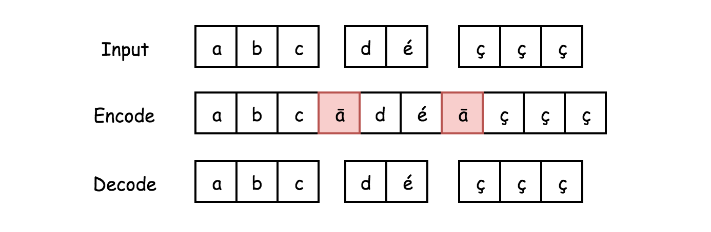
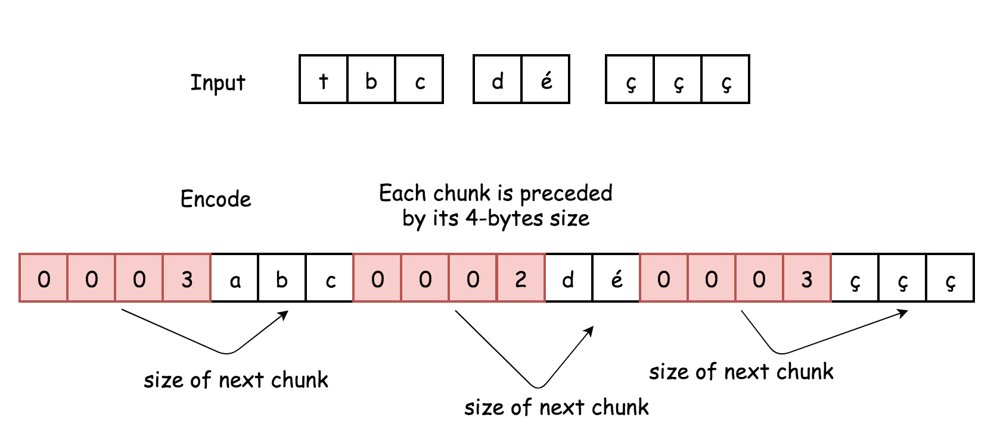

271. Encode and Decode Strings

Design an algorithm to encode **a list of strings** to **a string**. The encoded string is then sent over the network and is decoded back to the original list of strings.

Machine 1 (sender) has the function:
```
string encode(vector<string> strs) {
  // ... your code
  return encoded_string;
}
```
Machine 2 (receiver) has the function:
```
vector<string> decode(string s) {
  //... your code
  return strs;
}
```
So Machine 1 does:
```
string encoded_string = encode(strs);
```
and Machine 2 does:
```
vector<string> strs2 = decode(encoded_string);
```
`strs2` in Machine 2 should be the same as `strs` in Machine 1.

Implement the `encode` and `decode` methods.

 

**Note:**

* The string may contain any possible characters out of 256 valid ascii characters. Your algorithm should be generalized enough to work on any possible characters.
* Do not use class member/global/static variables to store states. Your encode and decode algorithms should be stateless.
* Do not rely on any library method such as eval or serialize methods. You should implement your own encode/decode algorithm.

# Solution
---
## Approach 1: Non-ASCII Delimiter
**Intuition**

Naive solution here is to join strings using delimiters.

>What to use as a delimiter? Each string may contain any possible characters out of 256 valid ascii characters.

Seems like one has to use non-ASCII unichar character, for example `unichr(257)` in Python and `Character.toString((char)257)` in Java (it's character `ā`).



Here it's convenient to use two different non-ASCII characters, to distinguish between situations of "empty array" and of "array of empty strings".

**Implementation**

Use `split` in Java with a second argument `-1` to make it work as `split` in Python.

```python
class Codec:
    def encode(self, strs):
        """Encodes a list of strings to a single string.
        :type strs: List[str]
        :rtype: str
        """
        if len(strs) == 0: 
            return unichr(258)
        
        # encode here is a workaround to fix BE CodecDriver error
        return unichr(257).join(x.encode('utf-8') for x in strs)
        

    def decode(self, s):
        """Decodes a single string to a list of strings.
        :type s: str
        :rtype: List[str]
        """
        if s == unichr(258): 
            return []
        return s.split(unichr(257))
```

**Complexity Analysis**

* Time complexity : $\mathcal{O}(N)$ both for encode and decode, where N is a number of strings in the input array.

* Space complexity : $\mathcal{O}(1)$ for encode to keep the output, since the output is one string. $\mathcal{O}(N)$ for decode keep the output, since the output is an array of strings.

## Approach 2: Chunked Transfer Encoding
Pay attention to this approach because last year Google likes to ask that sort of low-level optimisation. Serialize and deserialize BST problem is a similar example.

This approach is based on the encoding used in HTTP v1.1. It doesn't depend on the set of input characters, and hence is more versatile and effective than Approach 1.

>Data stream is divided into chunks. Each chunk is preceded by its size in bytes.

**Encoding Algorithm**



* Iterate over the array of chunks, i.e. strings.

    * For each chunk compute its length, and convert that length into 4-bytes string.

    * Append to encoded string :

        * 4-bytes string with information about chunk size in bytes.

        * Chunk itself.

    * Return encoded string.

**Decoding Algorithm**


* Iterate over the encoded string with a pointer i initiated as 0. While i < n:

    * Read 4 bytes s[i: i + 4]. It's chunk size in bytes. Convert this 4-bytes string to integer length.

    * Move the pointer by 4 bytes i += 4.

    * Append to the decoded array string s[i: i + length].

    * Move the pointer by length bytes i += length.

* Return decoded array of strings.

**Implementation**

```python
class Codec:
    def len_to_str(self, x):
        """
        Encodes length of string to bytes string
        """
        x = len(x)
        bytes = [chr(x >> (i * 8) & 0xff) for i in range(4)]
        bytes.reverse()
        bytes_str = ''.join(bytes)
        return bytes_str
    
    def encode(self, strs):
        """Encodes a list of strings to a single string.
        :type strs: List[str]
        :rtype: str
        """
        # encode here is a workaround to fix BE CodecDriver error
        return ''.join(self.len_to_str(x) + x.encode('utf-8') for x in strs)
        
    def str_to_int(self, bytes_str):
        """
        Decodes bytes string to integer.
        """
        result = 0
        for ch in bytes_str:
            result = result * 256 + ord(ch)
        return result
    
    def decode(self, s):
        """Decodes a single string to a list of strings.
        :type s: str
        :rtype: List[str]
        """
        i, n = 0, len(s)
        output = []
        while i < n:
            length = self.str_to_int(s[i: i + 4])
            i += 4
            output.append(s[i: i + length])
            i += length
        return output
```

**Complexity Analysis**

* Time complexity : $\mathcal{O}(N)$ both for encode and decode, where N is a number of strings in the input array.

* Space complexity : $\mathcal{O}(1)$ for encode to keep the output, since the output is one string. $\mathcal{O}(N)$ for decode keep the output, since the output is an array of strings.

# Submissions
---
**Solution 1: (Non-ASCII Delimiter)**
```
Runtime: 64 ms
Memory Usage: 13.9 MB
```
```python
class Codec:    
    def encode(self, strs: [str]) -> str:
        """Encodes a list of strings to a single string.
        """
        if len(strs) == 0: 
            return chr(258)
        
        # encode here is a workaround to fix BE CodecDriver error
        return chr(257).join(x.encode('utf-8').decode() for x in strs)

    def decode(self, s: str) -> [str]:
        """Decodes a single string to a list of strings.
        """
        if s == chr(258): 
            return []
        return s.split(chr(257))
    
# Your Codec object will be instantiated and called as such:
# codec = Codec()
# codec.decode(codec.encode(strs))
```

**Solution 2: (Chunked Transfer Encoding)**
```
Runtime: 76 ms
Memory Usage: 13.9 MB
```
```python
class Codec:    
    def len_to_str(self, x):
        """
        Encodes length of string to bytes string
        """
        x = len(x)
        bytes = [chr(x >> (i * 8) & 0xff) for i in range(4)]
        bytes.reverse()
        bytes_str = ''.join(bytes)
        return bytes_str
    
    def encode(self, strs):
        """Encodes a list of strings to a single string.
        :type strs: List[str]
        :rtype: str
        """
        # encode here is a workaround to fix BE CodecDriver error
        return ''.join(self.len_to_str(x) + x.encode('utf-8').decode() for x in strs)
        
    def str_to_int(self, bytes_str):
        """
        Decodes bytes string to integer.
        """
        result = 0
        for ch in bytes_str:
            result = result * 256 + ord(ch)
        return result
    
    def decode(self, s):
        """Decodes a single string to a list of strings.
        :type s: str
        :rtype: List[str]
        """
        i, n = 0, len(s)
        output = []
        while i < n:
            length = self.str_to_int(s[i: i + 4])
            i += 4
            output.append(s[i: i + length])
            i += length
        return output
    
# Your Codec object will be instantiated and called as such:
# codec = Codec()
# codec.decode(codec.encode(strs))
```

**Solution 3: (String)**
```
Runtime: 64 ms
Memory Usage: 14 MB
```
```python
class Codec:    
    def encode(self, strs: [str]) -> str:
        """Encodes a list of strings to a single string.
        """
        res = ""
        for string in strs:
            res += str(len(string)) + "$" + string
        
        return res

    def decode(self, s: str) -> [str]:
        """Decodes a single string to a list of strings.
        """
        strs = []
        i = 0
        while i<len(s):
            indexOfSeperator = s.find("$", i) #.find method finds the first instance it sees starting from i (the second argument)
            sizeOfString = int(s[i:indexOfSeperator])
            i = indexOfSeperator + sizeOfString + 1 #this will land at the next number
            strs.append(s[indexOfSeperator+1 : i])
        
        return strs

# Your Codec object will be instantiated and called as such:
# codec = Codec()
# codec.decode(codec.encode(strs))
```

**Solution 4: (String)**
```
Runtime: 35 ms
Memory: 23.1 MB
```
```c++
class Codec {
public:

    // Encodes a list of strings to a single string.
    string encode(vector<string>& strs) {
        string result;

        for (string str : strs) 
             result += to_string(str.size()) + "#" + str;

        return result;
    }

    // Decodes a single string to a list of strings.
    vector<string> decode(string s) {
        vector<string> result;
        int start = 0;
        int end   = s.find("#");

        while (end != string::npos) {
            
            int size = stoi(s.substr(start, end - start));
            result.push_back(s.substr(end+1, size));
            start = end+size+1;
            end   = s.find("#", start);
        }

        return result;
    }
};
```
