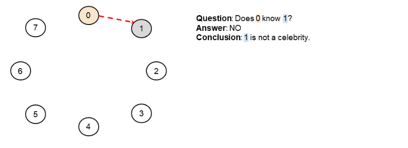

277. Find the Celebrity

Suppose you are at a party with `n` people (labeled from `0` to `n - 1`) and among them, there may exist one celebrity. The definition of a celebrity is that all the other `n - 1` people know him/her but he/she does not know any of them.

Now you want to find out who the celebrity is or verify that there is not one. The only thing you are allowed to do is to ask questions like: "Hi, A. Do you know B?" to get information of whether A knows B. You need to find out the celebrity (or verify there is not one) by asking as few questions as possible (in the asymptotic sense).

You are given a helper function `bool knows(a, b)` which tells you whether A knows B. Implement a function `int findCelebrity(n)`. There will be exactly one celebrity if he/she is in the party. Return the celebrity's label if there is a celebrity in the party. If there is no celebrity, return `-1`.

 

**Example 1:**


```
Input: graph = [
  [1,1,0],
  [0,1,0],
  [1,1,1]
]
Output: 1
Explanation: There are three persons labeled with 0, 1 and 2. graph[i][j] = 1 means person i knows person j, otherwise graph[i][j] = 0 means person i does not know person j. The celebrity is the person labeled as 1 because both 0 and 2 know him but 1 does not know anybody.
```

**Example 2:**


```
Input: graph = [
  [1,0,1],
  [1,1,0],
  [0,1,1]
]
Output: -1
Explanation: There is no celebrity.
```

**Note:**

* The directed graph is represented as an adjacency matrix, which is an `n x n` matrix where `a[i][j] = 1` means person `i` knows person `j` while `a[i][j] = 0` means the contrary.
* Remember that you won't have direct access to the adjacency matrix.

# Solution
---
## Approach 1: Brute Force
**Intuition**

As per the problem statement, for a given person `i`, we can check whether or not `i` is a celebrity by using the `knows(...)` API to see if everybody knows `i`, and that `i` know nobody.

Therefore, the simplest way of solving this problem is to go through each of the people in turn, and check whether or not they are a celebrity.

**Algorithm**

It's best to define a separate `isCelebrity(...)` function that takes the id number of a specific person and returns `true` if they are a celebrity and `false` if not. This avoids the need for complex loop-break conditions, thus keeping the code cleaner.

One edge case we need to be cautious of is not asking person `i` if they know themselves. This can be handled by a check for `i == j` at the start of the main loop of `isCelebrity(...)` and then simply continue-ing when it is `true`.

```python
class Solution:
    def findCelebrity(self, n: int) -> int:
        self.n = n
        for i in range(n):
            if self.is_celebrity(i):
                return i
        return -1
    
    def is_celebrity(self, i):
        for j in range(self.n):
            if i == j: continue # Don't ask if they know themselves.
            if knows(i, j) or not knows(j, i):
                return False
        return True
```

**Complexity Analysis**

We don't know what time and space the `knows(...)` API uses. Because it's not our concern, we'll assume it's $O(1)$ for the purpose of analysing our algorithm.

* Time Complexity : $O(n^2)$.

For each of the nn people, we need to check whether or not they are a celebrity.

Checking whether or not somebody is a celebrity requires making $2$ API calls for each of the $n - 1$ other people, for a total of $2 \cdot (n - 1) = 2 \cdot n - 2$ calls. In big-oh notation, we drop the constants, leaving $O(n)$.

So each of the nn celebrity checks will cost $O(n)$s, giving a total of $O(n^2)$.

* Space Complexity : $O(1)$.

Our code only uses constant extra space. The results of the API calls are not saved.

## Approach 2: Logical Deduction
**Intuition**

We can do far better than the above approach. Let's start by looking at another way of representing the problem, which is a great way for approaching it in an interview. What we actually have in this problem is a **graph**, where a directed edge going from person `A` to person `B` means that we have confirmed that `A knows B`.

For example, here is a possible graph. Assume that we have made all possible calls to the `knows(...)` API to find these edges. Is there a celebrity here? If so, who is it?


What about in this graph?


And this one?


On the graph representation, a celebrity is a person who has exactly `n - 1` directed edges going in (everybody knows them) and `0` edges going out (they know nobody).

On the first example we looked at above, person `4` is a celebrity because they have `5` directed edges going in, which is `n - 1`. They have no directed edges going out. Note that `3` is not a celebrity because they have `5` outgoing edges, not `5` ingoing.

On the second example, there is no celebrity. Person `4` is not a celebrity, because person `2` doesn't know them. There are only `n - 2` directed edges going into `4`.

On the third example, there is also no celebrity. Person `0` is not a celebrity, because they know person `5`, as represented by the directed edge going from `0` to `5`.

At the start, we only know the nodes of the graph. The edges are all hidden. We can "uncover" edges by making calls to the `knows(...)` API. In the first approach, we uncovered all the edges this way. So, the question we need to ask now is... was it actually necessary to uncover all of them? A good way to answer this question in an interview is to work through an example on the whiteboard, where you decide which edges you want to ask for, and then draw them as you go.

When you do your own example, you'll of course need to know what the full graph behind your example is, or at least the important aspects of it, but you also need to focus on what information you've "uncovered" by using the `knows(...)` API.

Here is an animation of an example. To distinguish between `not (A knows B)` and we-haven't-yet-asked if `A knows B`, we use a green solid arrow to show `A knows B`, a red dotted arrow to show `not (A knows B)` and no arrow if we haven't yet asked.


During the example in the animation, we asked if `4` knows `6`. Why was this question not necessary to identify the celebrity?


Well, because we already know that both `4` and `6` know at least one other person, this means that neither of them could be the celebrity! Therefore, we've already ruled them out, there was no need to investigate them further.

So, what can we conclude from the result of an `A knows B` check? If the result was `true`, could `A` be the celebrity? What about `B`?


And what about if `A knows B` returned `false`? Who couldn't be a celebrity now?


In the first example, we know that `A` can't be a celebrity, because `A` knows somebody, namely `B`. In the second example, we know that `B` can't be a celebrity, because `A`, doesn't know him/her.

>Therefore, with each call to `knows(...)`, we can conclusively determine that exactly 1 of the people is not a celebrity!

The following algorithm can, therefore, be used to rule out `n - 1` of the people in $O(n)$ time. We start by guessing that `0` might be a `celebrityCandidate`, and then we check if `0 knows 1` (within the loop). If true, then we know `0` isn't a celebrity (they know somebody), but `1` might be. We update the `celebrityCandidate` variable to `1` to reflect this. Otherwise, we know 1 is not a celebrity (somebody doesn't know them), but we haven't ruled out `0`, yet, so keep them as the `celebrityCandidate`. Whoever we kept is then asked if they know `2`, and so forth.

```
celebrity_candidate = 0
for i in range(1, n):
    if knows(celebrity_candidate, i):
        celebrity_candidate = i
```

At the end, the only person we haven't ruled out is in the `celebrityCandidate` variable.

Here is an animation of the algorithm.





At the end of the example in the animation, this is how our graph looked. The person who we haven't ruled out is `4`.


But do we actually know for sure that this person is a celebrity? (Remember, it's possible there's no celebrity, in which case we'd return `-1`).

Nope! It's still possible that `0` doesn't know `4`, or perhaps `4` knows `3`. We can't rule these possibilities out from the information we have uncovered so far.

So, what can we do? We can use our `isCelebrity(...)` function on 4 to check whether or not they are a celebrity. If they are, our function will return `4`. If not, then it should return `-1`.

**Algorithm**

Our algorithm firstly narrows the people down to a single `celebrityCandidate` using the algorithm just above, and then it checks whether or not that candidate is a celebrity using the `isCelebrity(...)`.

```python
class Solution:
    def findCelebrity(self, n: int) -> int:
        self.n = n
        celebrity_candidate = 0
        for i in range(1, n):
            if knows(celebrity_candidate, i):
                celebrity_candidate = i
        if self.is_celebrity(celebrity_candidate):
            return celebrity_candidate
        return -1

    def is_celebrity(self, i):
        for j in range(self.n):
            if i == j: continue
            if knows(i, j) or not knows(j, i):
                return False
        return True
```

**Complexity Analysis**

* me Complexity : $(n)$

Our code is split into 2 parts.

The first part finds a celebrity candidate. This requires doing $ - 1$ calls to `knows(...)` API, and so is $O(n)$.

The second part is the same as before—checking whether or not a given person is a celebrity. We determined that this is $O(n)$.

Therefore, we have a total time complexity of O(n + n) = O(n)O(n+n)=O(n).

* ace Complexity : $(1)$

Same as above. We are only using constant extra space.

## Approach 3: Logical Deduction with Caching
**Intuition**

You probably won't need to implement this approach in an interview, however, I wouldn't be surprised if discussing these ideas was a follow up question. For that reason, we'll take a quick look at it!

Have a look at our example from above again. These are the calls to the `knows(...)` API that were made to identify that `4` is a celebrity candidate.


Now, these are the calls that our Approach 2 would have made in the second phase to check whether or not our celebrity candidate, `4`, actually is a celebrity.


As shown in the above images, we made some of the same calls twice! The lower the number of the celebrity candidate, the more of these duplicated calls there will be, because the celebrity candidate spent longer in the `celebrityCandidate` variable, and so was involved in a lot more of the initial "questioning". Is this actually wasteful though?

We know that the best possible time complexity we could ever achieve in the average/ worst case is $O(n)$. The easiest way of proving this to point out that confirming that somebody is a celebrity requires $O(n)$ checks. There's simply no way around it, if you miss just one of those checks, it could have been the one that showed they were not.

So, because we can never do better than $O(n)$ anyway, surely it really doesn't matter?

Yes and no! It's possible that calls to the `knows(...)` API could be really expensive (i.e. slow). For example, in the scenario presented in the question, you need to ask the question to people and then listen for their answer. This is time consuming! As a computer-based example, what if the `knows(...)` API was retrieving its answers from a really slow web service on the other side of the world? What if somebody was having to sit in front of their computer, waiting patiently for this algorithm to finish running? They would definitely appreciate it taking 5 seconds instead of 10 seconds, even if that difference is constant.

The cost of this, however, is space. We will now need to store the results of `n - 1` calls the the `knows(...)` API.

This is similar to how web browsers cache data. Often, the cost of retrieving a page again is considered to more expensive than the cost of caching a page.

**Algorithm**

For Java and JavaScript, we'll store our cache in a `HashMap`. For Python, we'll use `lru_cache` in the functools library. Other than that, the code is the same as

```python
from functools import lru_cache

class Solution:
    
    @lru_cache(maxsize=None)
    def cachedKnows(self, a, b):
        return knows(a, b)
    
    def findCelebrity(self, n: int) -> int:
        self.n = n
        celebrity_candidate = 0
        for i in range(1, n):
            if self.cachedKnows(celebrity_candidate, i):
                celebrity_candidate = i
        if self.is_celebrity(celebrity_candidate):
            return celebrity_candidate
        return -1

    def is_celebrity(self, i):
        for j in range(self.n):
            if i == j: continue
            if self.cachedKnows(i, j) or not self.cachedKnows(j, i):
                return False
        return True
```

**Complexity Analysis**

* Time Complexity : $O(n)$.

The time complexity is still $O(n)$. The only difference is that sometimes we're retrieving data from a cache inside our code instead of from the API.

* Space Complexity : $O(n)$.

We're storing the results of the $n - 1$ calls to the know(...) API we made while finding a candidate.

We could optimize the space complexity slightly, by dumping the cached contents each time the celebrityCandidate variable changes, which would be $O(1)$ in the best case (which happens to be the worst case for reducing number of API calls) but it's still $O(n)$ space in the worst case and probably not worth the extra code complexity as the algorithm still ultimately requires the memory/ disk space needed for the worst case.

# Submissions
---
**Solution 1: (Logical Deduction)**
```
Runtime: 1788 ms
Memory Usage: 13.8 MB
```
```python
# The knows API is already defined for you.
# return a bool, whether a knows b
# def knows(a: int, b: int) -> bool:

class Solution:
    def findCelebrity(self, n: int) -> int:
        self.n = n
        celebrity_candidate = 0
        for i in range(1, n):
            if knows(celebrity_candidate, i):
                celebrity_candidate = i
        if self.is_celebrity(celebrity_candidate):
            return celebrity_candidate
        return -1

    def is_celebrity(self, i):
        for j in range(self.n):
            if i == j: continue
            if knows(i, j) or not knows(j, i):
                return False
        return True
```

**Solution 2: (Logical Deduction with Caching)**
```
Runtime: 1796 ms
Memory Usage: 14.2 MB
```
```python
# The knows API is already defined for you.
# return a bool, whether a knows b
# def knows(a: int, b: int) -> bool:

class Solution:
    
    @lru_cache(maxsize=None)
    def cachedKnows(self, a, b):
        return knows(a, b)
    
    def findCelebrity(self, n: int) -> int:
        self.n = n
        celebrity_candidate = 0
        for i in range(1, n):
            if self.cachedKnows(celebrity_candidate, i):
                celebrity_candidate = i
        if self.is_celebrity(celebrity_candidate):
            return celebrity_candidate
        return -1

    def is_celebrity(self, i):
        for j in range(self.n):
            if i == j: continue
            if knows(i, j) or not knows(j, i):
                return False
        return True
```