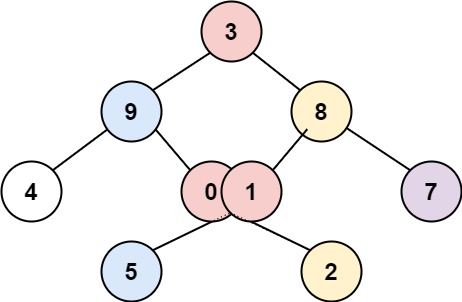

314. Binary Tree Vertical Order Traversal

Given the `root` of a binary tree, return **the vertical order traversal** of its nodes' values. (i.e., from top to bottom, column by column).

If two nodes are in the same row and column, the order should be from **left to right**.

 

**Example 1:**


```
Input: root = [3,9,20,null,null,15,7]
Output: [[9],[3,15],[20],[7]]
```

**Example 2:**


```
Input: root = [3,9,8,4,0,1,7]
Output: [[4],[9],[3,0,1],[8],[7]]
```

**Example 3:**


```
Input: root = [3,9,8,4,0,1,7,null,null,null,2,5]
Output: [[4],[9,5],[3,0,1],[8,2],[7]]
```

**Example 4:**
```
Input: root = []
Output: []
```

**Constraints:**

* The number of nodes in the tree is in the range `[0, 100]`.
* `-100 <= Node.val <= 100`

# Submissions
---
**Solution 1: (Breadth-First Search (BFS))**
```
Runtime: 36 ms
Memory Usage: 14.3 MB
```
```python
# Definition for a binary tree node.
# class TreeNode:
#     def __init__(self, val=0, left=None, right=None):
#         self.val = val
#         self.left = left
#         self.right = right
class Solution:
    def verticalOrder(self, root: TreeNode) -> List[List[int]]:
        columnTable = defaultdict(list)
        queue = deque([(root, 0)])

        while queue:
            node, column = queue.popleft()

            if node is not None:
                columnTable[column].append(node.val)
                
                queue.append((node.left, column - 1))
                queue.append((node.right, column + 1))
                        
        return [columnTable[x] for x in sorted(columnTable.keys())]
```

**Solution 2: (BFS without Sorting)**
```
Runtime: 36 ms
Memory Usage: 14.4 MB
```
```python
# Definition for a binary tree node.
# class TreeNode:
#     def __init__(self, val=0, left=None, right=None):
#         self.val = val
#         self.left = left
#         self.right = right
class Solution:
    def verticalOrder(self, root: TreeNode) -> List[List[int]]:
        if root is None:
            return []

        columnTable = defaultdict(list)
        min_column = max_column = 0
        queue = deque([(root, 0)])

        while queue:
            node, column = queue.popleft()

            if node is not None:
                columnTable[column].append(node.val)
                min_column = min(min_column, column)
                max_column = max(max_column, column)

                queue.append((node.left, column - 1))
                queue.append((node.right, column + 1))

        return [columnTable[x] for x in range(min_column, max_column + 1)]
```

**Solution 3: (Depth-First Search (DFS))**
```
Runtime: 40 ms
Memory Usage: 14.4 MB
```
```python
# Definition for a binary tree node.
# class TreeNode:
#     def __init__(self, val=0, left=None, right=None):
#         self.val = val
#         self.left = left
#         self.right = right
class Solution:
    def verticalOrder(self, root: TreeNode) -> List[List[int]]:
        if root is None:
            return []

        columnTable = defaultdict(list)
        min_column = max_column = 0

        def DFS(node, row, column):
            if node is not None:
                nonlocal min_column, max_column
                columnTable[column].append((row, node.val))
                min_column = min(min_column, column)
                max_column = max(max_column, column)

                # preorder DFS
                DFS(node.left, row + 1, column - 1)
                DFS(node.right, row + 1, column + 1)

        DFS(root, 0, 0)
        
        # order by column and sort by row
        ret = []
        for col in range(min_column, max_column + 1):
            columnTable[col].sort(key=lambda x:x[0])
            colVals = [val for row, val in columnTable[col]]
            ret.append(colVals)

        return ret
```