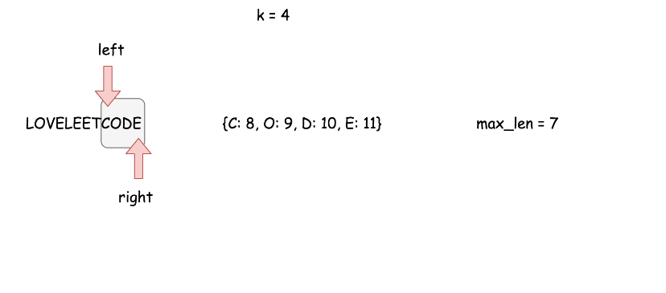

340. Longest Substring with At Most K Distinct Characters

Given a string, find the length of the longest substring T that contains at most `k` distinct characters.

**Example 1:**
```
Input: s = "eceba", k = 2
Output: 3
Explanation: T is "ece" which its length is 3.
```

**Example 2:**
```
Input: s = "aa", k = 1
Output: 2
Explanation: T is "aa" which its length is 2.
```

# Solution
---
## Approach 1: Sliding Window + Hashmap.
**Intuition**

Let's use here the logic from the more simple problem with at most two distinct characters.

To solve the problem in one pass let's use here sliding window approach with two set pointers `eft`and `ight`serving as the window boundaries.

The idea is to set both pointers in the position `0` and then move `right` pointer to the right while the window contains not more than `k` distinct characters. If at some point we've got `k + 1` distinct characters, let's move `left` pointer to keep not more than `k + 1` distinct characters in the window.


Basically that's the algorithm : to move sliding window along the string, to keep not more than `k` distinct characters in the window, and to update max substring length at each step.

>There is just one more question to reply - how to move the `left` pointer to keep only `k` distinct characters in the string?

Let's use for this purpose hashmap containing all characters in the sliding window as keys and their rightmost positions as values. At each moment, this hashmap could contain not more than `k + 1` elements.


For example, using this hashmap one knows that the rightmost position of character `O` in `"LOVELEE"` window is `1` and so one has to move `left` pointer in the position `1 + 1 = 2` to exclude the character O from the sliding window.

**Algorithm**

Now one could write down the algortihm.

* Return `0` if the string is empty or `k` is equal to zero.
* Set both set pointers in the beginning of the string `left = 0` and `right = 0` and init max substring length `max_len = 1`.
* While `right` pointer is less than `N`:
    * Add the current character `s[right]` in the hashmap and move `right` pointer to the right.
    * If hashmap contains `k + 1` distinct characters, remove the leftmost character from the hashmap and move the `left` pointer so that sliding window contains again k distinct characters only.
    * Update `max_len`.
    
**Implementation**





```python
from collections import defaultdict
class Solution:
    def lengthOfLongestSubstringKDistinct(self, s: 'str', k: 'int') -> 'int':
        n = len(s) 
        if k == 0 or n == 0:
            return 0
        
        # sliding window left and right pointers
        left, right = 0, 0
        # hashmap character -> its rightmost position 
        # in the sliding window
        hashmap = defaultdict()

        max_len = 1
        
        while right < n:
            # add new character and move right pointer
            hashmap[s[right]] = right
            right += 1

            # slidewindow contains 3 characters
            if len(hashmap) == k + 1:
                # delete the leftmost character
                del_idx = min(hashmap.values())
                del hashmap[s[del_idx]]
                # move left pointer of the slidewindow
                left = del_idx + 1

            max_len = max(max_len, right - left)

        return max_len
```

**Complexity Analysis**

>Do we have here the best possible time complexity $\mathcal{O}(N)$ as it was for more simple problem with at most two distinct characters?

For the best case when input string contains not more than k distinct characters the answer is yes. It's the only one pass along the string with N characters and the time complexity is $\mathcal{O}(N)$.

For the worst case when the input string contains n distinct characters, the answer is no. In that case at each step one uses \mathcal{O}(k)O(k) time to find a minimum value in the hashmap with k elements and so the overall time complexity is $\mathcal{O}(N k)$.

* Time complexity : $\mathcal{O}(N)$ in the best case of k distinct characters in the string and $\mathcal{O}(N k)$ in the worst case of `N` distinct characters in the string.

* Space complexity : $\mathcal{O}(k)$ since additional space is used only for a hashmap with at most `k + 1` elements.

## Approach 2: Sliding Window + Ordered Dictionary.
How to achieve $\mathcal{O}(N)$ time complexity

Approach 1 with a standard hashmap couldn't ensure $\mathcal{O}(N)$ time complexity.

To have \mathcal{O}(N)O(N) algorithm performance, one would need a structure, which provides four operations in $\mathcal{O}(1)$ time :

* Insert the key

* Get the key / Check if the key exists

* Delete the key

* Return the first / or the last added key/value

The first three operations in $\mathcal{O}(1)$ time are provided by the standard hashmap, and the forth one - by linked list.

>There is a structure called ordered dictionary, it combines behind both hashmap and linked list. In Python this structure is called `OrderedDict` and in Java LinkedHashMap.

Ordered dictionary is quite popular for the interviews, for example, check to implement LRU cache question by Google.

**Algorithm**

Let's use ordered dictionary instead of standard hashmap to trim the algorithm from the approach 1 :

* Return `0` if the string is empty or k is equal to zero.
* Set both set pointers in the beginning of the string `left = 0` and `right = 0` and init max substring length `max_len = 1`.
* While `right` pointer is less than `N`:
    * If the current character `s[right]` is already in the ordered dictionary hashmap -- delete it, to ensure that the first key in hashmap is the leftmost character.
    * Add the current character `s[right]` in the ordered dictionary and move `right` pointer to the right.
    * If ordered dictionary hashmap contains `k + 1` distinct characters, remove the leftmost one and move the `left` pointer so that sliding window contains again `k` distinct characters only.
    * Update `max_len`.

**Implementation**

```python
from collections import OrderedDict
class Solution:
    def lengthOfLongestSubstringKDistinct(self, s: 'str', k: 'int') -> 'int':
        n = len(s) 
        if k == 0 or n == 0:
            return 0
        
        # sliding window left and right pointers
        left, right = 0, 0
        # hashmap character -> its rightmost position 
        # in the sliding window
        hashmap = OrderedDict()

        max_len = 1
        
        while right < n:
            character = s[right]
            # if character is already in the hashmap -
            # delete it, so that after insert it becomes
            # the rightmost element in the hashmap
            if character in hashmap:
                del hashmap[character]
            hashmap[character] = right
            right += 1

            # slidewindow contains k + 1 characters
            if len(hashmap) == k + 1:
                # delete the leftmost character
                _, del_idx = hashmap.popitem(last = False)
                # move left pointer of the slidewindow
                left = del_idx + 1

            max_len = max(max_len, right - left)

        return max_len
```

**Complexity Analysis**

* Time complexity : $\mathcal{O}(N)$ since all operations with ordered dictionary : `insert/get/delete/popitem` (`put/containsKey/remove`) are done in a constant time.

* Space complexity : $\mathcal{O}(k)$ since additional space is used only for an ordered dictionary with at most `k + 1` elements.

# Submissions
---
**Solution 1: (Sliding Window + Hashmap)**
```
Runtime: 68 ms
Memory Usage: 13.9 MB
```
```python
class Solution:
    def lengthOfLongestSubstringKDistinct(self, s: str, k: int) -> int:
        n = len(s) 
        if k == 0 or n == 0:
            return 0
        
        # sliding window left and right pointers
        left, right = 0, 0
        # hashmap character -> its rightmost position 
        # in the sliding window
        hashmap = defaultdict()

        max_len = 1
        
        while right < n:
            # add new character and move right pointer
            hashmap[s[right]] = right
            right += 1

            # slidewindow contains 3 characters
            if len(hashmap) == k + 1:
                # delete the leftmost character
                del_idx = min(hashmap.values())
                del hashmap[s[del_idx]]
                # move left pointer of the slidewindow
                left = del_idx + 1
            
            max_len = max(max_len, right - left)

        return max_len
```

**Solution 2: (Sliding Window + Ordered Dictionary)**
```
Runtime: 72 ms
Memory Usage: 14.1 MB
```
```python
class Solution:
    def lengthOfLongestSubstringKDistinct(self, s: str, k: int) -> int:
        n = len(s) 
        if k == 0 or n == 0:
            return 0
        
        # sliding window left and right pointers
        left, right = 0, 0
        # hashmap character -> its rightmost position 
        # in the sliding window
        hashmap = OrderedDict()

        max_len = 1
        
        while right < n:
            character = s[right]
            # if character is already in the hashmap -
            # delete it, so that after insert it becomes
            # the rightmost element in the hashmap
            if character in hashmap:
                del hashmap[character]
            hashmap[character] = right
            right += 1

            # slidewindow contains k + 1 characters
            if len(hashmap) == k + 1:
                # delete the leftmost character
                _, del_idx = hashmap.popitem(last = False)
                # move left pointer of the slidewindow
                left = del_idx + 1

            max_len = max(max_len, right - left)

        return max_len
```

**Solution 3: (Sliding Window, Hash Table)**
```
Runtime: 36 ms
Memory Usage: 8.2 MB
```
```c++
class Solution {
public:
    int lengthOfLongestSubstringKDistinct(string s, int k) {
        int n = s.size();
        
        if (n == 0 || k == 0) return 0;
        
        std::unordered_map<char, int> table;
        
        int result = 0;
        int left = 0;
        for (int right = 0; right < n; right++)
        {
            table[s[right]]++;
            while (table.size() > k)
            {
                table[s[left]]--;
                if (table[s[left]] == 0)
                    table.erase(s[left]);
                left++;
            }
            result = std::max(result, (right-left)+1);
        }
        return result;
    }
};
```

**Solution 4: (Sliding Window, Hash Table)**
```
Runtime: 7 ms, Beats 52.59%
Memory: 10.74 MB, Beats 29.09%
```
```c++
class Solution {
public:
    int lengthOfLongestSubstringKDistinct(string s, int k) {
        unordered_map<char, int> cnt;
        int n = s.size(), i = 0, j, ans = 0;
        for (j = 0; j < n; j ++) {
            cnt[s[j]] += 1;
            while (cnt.size() > k) {
                cnt[s[i]] -= 1;
                if (cnt[s[i]] == 0) {
                    cnt.erase(s[i]);
                }
                i += 1;
            }
            ans = max(ans, j - i + 1);
        }
        return ans;
    }
};
```
