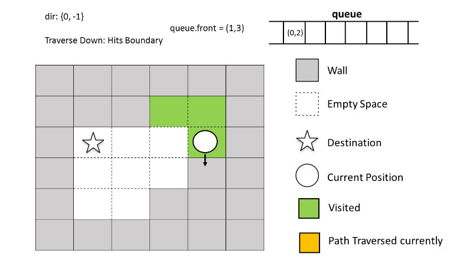

490. The Maze

There is a **ball** in a maze with empty spaces and walls. The ball can go through empty spaces by rolling **up**, **down**, **left** or **right**, but it won't stop rolling until hitting a wall. When the ball stops, it could choose the next direction.

Given the ball's **start** position, the **destination** and the maze, determine whether the ball could stop at the destination.

The maze is represented by a binary 2D array. 1 means the wall and 0 means the empty space. You may assume that the borders of the maze are all walls. The start and destination coordinates are represented by row and column indexes.

 

**Example 1:**
```
Input 1: a maze represented by a 2D array

0 0 1 0 0
0 0 0 0 0
0 0 0 1 0
1 1 0 1 1
0 0 0 0 0

Input 2: start coordinate (rowStart, colStart) = (0, 4)
Input 3: destination coordinate (rowDest, colDest) = (4, 4)

Output: true

Explanation: One possible way is : left -> down -> left -> down -> right -> down -> right.
```


**Example 2:**
```
Input 1: a maze represented by a 2D array

0 0 1 0 0
0 0 0 0 0
0 0 0 1 0
1 1 0 1 1
0 0 0 0 0

Input 2: start coordinate (rowStart, colStart) = (0, 4)
Input 3: destination coordinate (rowDest, colDest) = (3, 2)

Output: false

Explanation: There is no way for the ball to stop at the destination.
```


**Note:**

1. There is only one ball and one destination in the maze.
1. Both the ball and the destination exist on an empty space, and they will not be at the same position initially.
1. The given maze does not contain border (like the red rectangle in the example pictures), but you could assume the border of the maze are all walls.
1. The maze contains at least 2 empty spaces, and both the width and height of the maze won't exceed 100.

# Solution
---
## Approach 1: Depth First Search
We can view the given search space in the form of a tree. The root node of the tree represents the starting position. Four different routes are possible from each position i.e. left, right, up or down. These four options can be represented by 4 branches of each node in the given tree. Thus, the new node reached from the root traversing over the branch represents the new position occupied by the ball after choosing the corresponding direction of travel.


In order to do this traversal, one of the simplest schemes is to undergo depth first search. In this case, we choose one path at a time and try to go as deep as possible into the levels of the tree before going for the next path. In order to implement this, we make use of a recursive function `dfs(maze, start, desination, visited)`. This function takes the given $maze$ array, the $start$ position and the $destination$ position as its arguments along with a $visited$ array. $visited$ array is a 2-D boolean array of the same size as that of $maze$. A True value at $visited[i][j]$ represents that the current position has already been reached earlier during the path traversal. We make use of this array so as to keep track of the same paths being repeated over and over. We mark a True at the current position in the visitedvisited array once we reach that particular positon in the $maze$.

From every startstart position, we can move continuously in either left, right, upward or downward direction till we reach the boundary or a wall. Thus, from the $start$ position, we determine all the end points which can be reached by choosing the four directions. For each of the cases, the new endpoint will now act as the new start point for the traversals. The destination, obviously remains unchanged. Thus, now we call the same function four times for the four directions, each time with a new start point obtained previously.

If any of the function call returns a True value, it means we can reach the desination.

The following animation depicts the process:


```java
public class Solution {
    public boolean hasPath(int[][] maze, int[] start, int[] destination) {
        boolean[][] visited = new boolean[maze.length][maze[0].length];
        return dfs(maze, start, destination, visited);
    }
    public boolean dfs(int[][] maze, int[] start, int[] destination, boolean[][] visited) {
        if (visited[start[0]][start[1]])
            return false;
        if (start[0] == destination[0] && start[1] == destination[1])
            return true;
        visited[start[0]][start[1]] = true;
        int r = start[1] + 1, l = start[1] - 1, u = start[0] - 1, d = start[0] + 1;
        while (r < maze[0].length && maze[start[0]][r] == 0) // right
            r++;
        if (dfs(maze, new int[] {start[0], r - 1}, destination, visited))
            return true;
        while (l >= 0 && maze[start[0]][l] == 0) //left
            l--;
        if (dfs(maze, new int[] {start[0], l + 1}, destination, visited))
            return true;
        while (u >= 0 && maze[u][start[1]] == 0) //up
            u--;
        if (dfs(maze, new int[] {u + 1, start[1]}, destination, visited))
            return true;
        while (d < maze.length && maze[d][start[1]] == 0) //down
            d++;
        if (dfs(maze, new int[] {d - 1, start[1]}, destination, visited))
            return true;
        return false;
    }
}
```

**Complexity Analysis**

* Time complexity : $O(mn)$. Complete traversal of maze will be done in the worst case. Here, $m$ and $n$ refers to the number of rows and coloumns of the maze.

* Space complexity : $O(mn)$. $visited$ array of size $m*n$ is used.

## Approach 2: Breadth First Search
**Algorithm**

The same search space tree can also be explored in a Depth First Search manner. In this case, we try to explore the search space on a level by level basis. i.e. We try to move in all the directions at every step. When all the directions have been explored and we still don't reach the destination, then only we proceed to the new set of traversals from the new positions obtained.

In order to implement this, we make use of a $queue$. We start with the ball at the $start$ position. For every current position, we add all the new positions possible by traversing in all the four directions(till reaching the wall or boundary) into the $queue$ to act as the new start positions and mark these positions as True in the $visited$ array. When all the directions have been covered up, we remove a position value, ss, from the front of the $queue$ and again continue the same process with ss acting as the new $start$ position.

Further, in order to choose the direction of travel, we make use of a dirdir array, which contains 4 entries. Each entry represents a one-dimensional direction of travel. To travel in a particular direction, we keep on adding the particular entry of the dirsdirs array till we hit a wall or a boundary. For a particular start position, we do this process of dirdir addition for all all the four directions possible.

If we hit the destination position at any moment, we return a True directly indicating that the $destination$ position can be reached starting from the $start$ position.

The following animation depicts the process:





```java
public class Solution {
    public boolean hasPath(int[][] maze, int[] start, int[] destination) {
        boolean[][] visited = new boolean[maze.length][maze[0].length];
        int[][] dirs={{0, 1}, {0, -1}, {-1, 0}, {1, 0}};
        Queue < int[] > queue = new LinkedList < > ();
        queue.add(start);
        visited[start[0]][start[1]] = true;
        while (!queue.isEmpty()) {
            int[] s = queue.remove();
            if (s[0] == destination[0] && s[1] == destination[1])
                return true;
            for (int[] dir: dirs) {
                int x = s[0] + dir[0];
                int y = s[1] + dir[1];
                while (x >= 0 && y >= 0 && x < maze.length && y < maze[0].length && maze[x][y] == 0) {
                    x += dir[0];
                    y += dir[1];
                }
                if (!visited[x - dir[0]][y - dir[1]]) {
                    queue.add(new int[] {x - dir[0], y - dir[1]});
                    visited[x - dir[0]][y - dir[1]] = true;
                }
            }
        }
        return false;
    }
}
```

**Complexity Analysis**

* Time complexity : $O(mn)$. Complete traversal of maze will be done in the worst case. Here, $m$ and $n$ refers to the number of rows and coloumns of the maze.

* Space complexity : $O(mn)$. $visited$ array of size $m*n$ is used and $queue$ size can grow upto m*nm∗n in worst case.

# Submissions
---
**Solution 1: (DFS)**
```
Runtime: 280 ms
Memory Usage: 15.3 MB
```
```python
class Solution:
    def hasPath(self, maze: List[List[int]], start: List[int], destination: List[int]) -> bool:
        R, C = len(maze), len(maze[0])
        d = [(0, 1), (0, -1), (1, 0), (-1, 0)]
        
        def dfs(r, c, seen):
            if r == destination[0] and c == destination[1]:
                return True
            seen.add((r, c))
            for dr, dc in d:
                nr, nc = r+dr, c+dc
                while 0 <= nr < R and 0 <= nc < C and maze[nr][nc] == 0:
                    nr, nc = nr+dr, nc+dc
                nr, nc = nr-dr, nc-dc
                if (nr, nc) not in seen:
                    if dfs(nr, nc, seen):
                        return True
            return False
            
        return dfs(start[0], start[1], set())
```

**Solution 2: (BFS)**
```
Runtime: 364 ms
Memory Usage: 14.4 MB
```
```python
class Solution:
    def hasPath(self, maze: List[List[int]], start: List[int], destination: List[int]) -> bool:
        R, C = len(maze), len(maze[0])
        directions = [(0, 1), (0, -1), (1, 0), (-1, 0)]
        visited = set()
        q = [tuple(start)]

        while q:
            location = q.pop(0)
            if location[0] == destination[0] and location[1] == destination[1]:
                return True
            for direction in directions:
                
                r = direction[0] + location[0]
                c = direction[1] + location[1]

                # the `next` step is the step before hitting a wall! not just current + 1
                while 0 <= r < R and 0 <= c < C and maze[r][c] == 0:
                    r = direction[0] + r
                    c = direction[1] + c

                # walk back one step since we are already in the wall. 
                nr = r - direction[0]
                nc = c - direction[1]

                if (nr, nc) not in visited:
                    q.append((nr, nc))
                    visited.add((nr, nc))

        return False
```

**Solution 3: (DFS)**

    maze = [[  0,  0,  1,  0,S>0],
visited        x   x       x   x
            [  0,  0,  0,  0,  0],
               x           x    
            [  0,  0,  0,  1,  0],
                   x   x        
            [  1,  1,  0,  1,  1],
            [  0,  0,  0,  0,D>0]], start = [0,4], destination = [4,4]
                       x       x <true
```
Runtime: 20 ms
Memory: 19.7 MB
```
```c++
int dd[5] = {0, 1, 0, -1, 0};
class Solution {
    bool dfs(int r, int c, int dr, int dc, vector<vector<int>> &maze, vector<vector<bool>> &visited) {
        if (r == dr && c == dc) {
            return true;
        }
        visited[r][c] = true;
        int nr, nc, d;
        for (d = 0; d < 4; d ++) {
            nr = r;
            nc = c;
            while (0 <= nr + dd[d] && nr + dd[d] < maze.size() && 0 <= nc + dd[d + 1] && nc + dd[d + 1] < maze[0].size() && maze[nr + dd[d]][nc + dd[d + 1]] == 0) {
                nr += dd[d];
                nc += dd[d + 1];
            }
            if (!visited[nr][nc] && dfs(nr, nc, dr, dc, maze, visited)) {
                return true;
            }
        }
        return false;
    }
public:
    bool hasPath(vector<vector<int>>& maze, vector<int>& start, vector<int>& destination) {
        int m = maze.size(), n = maze[0].size();
        vector<vector<bool>> visited(m, vector<bool>(n));
        if (dfs(start[0], start[1], destination[0], destination[1], maze, visited)) {
            return true;
        }
        return false;
    }
};
```
