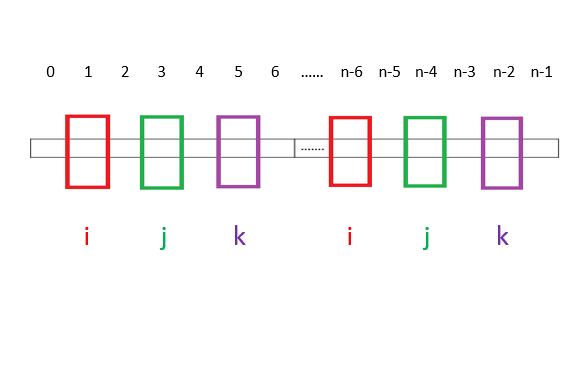
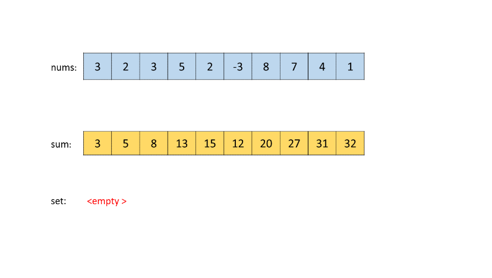
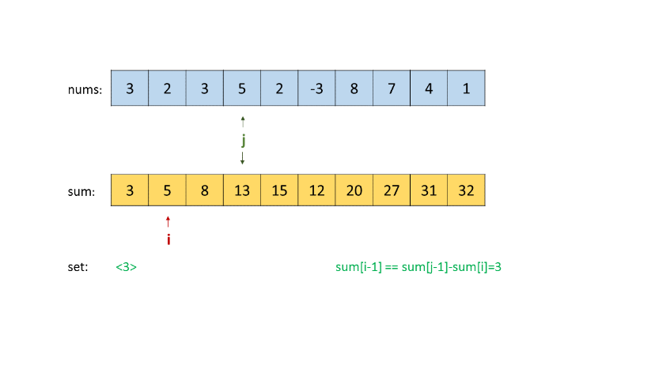
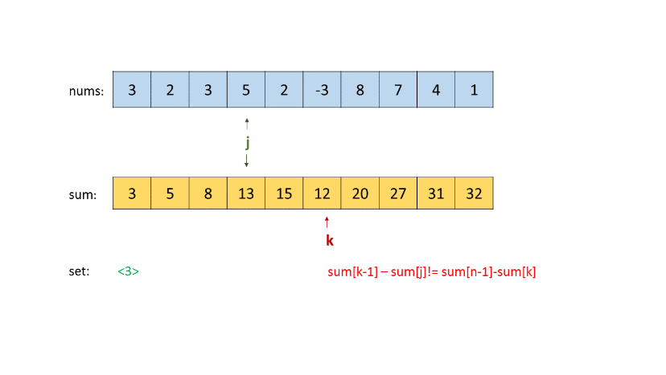
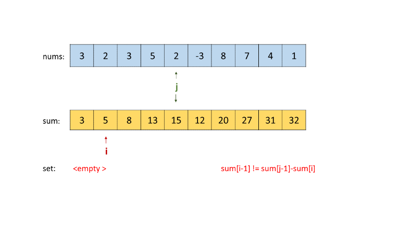
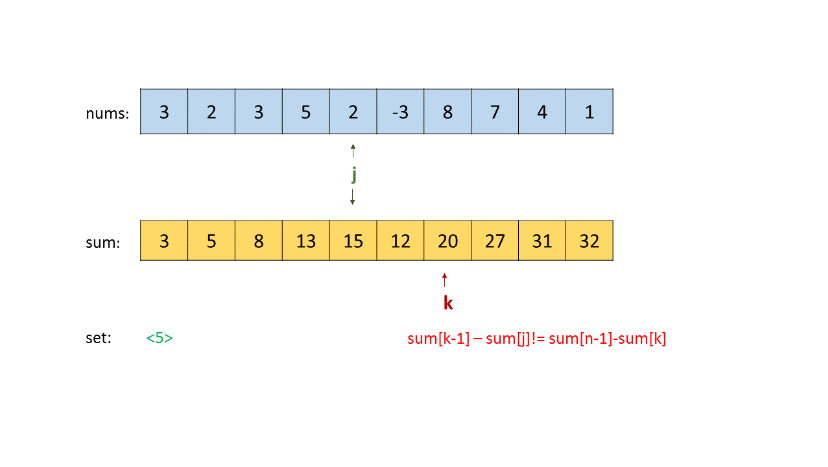
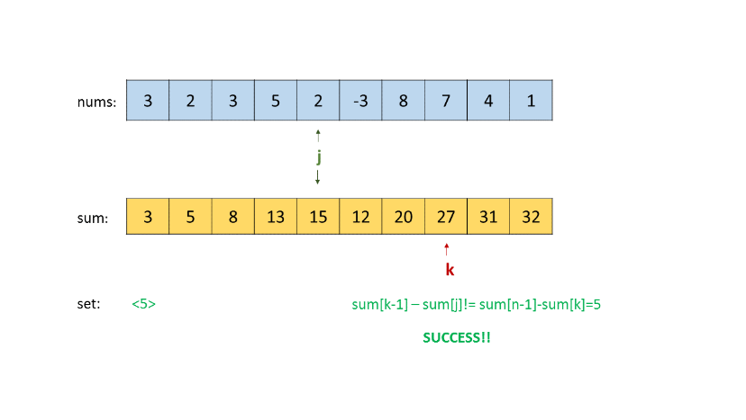

548. Split Array with Equal Sum

Given an array with n integers, you need to find if there are triplets (i, j, k) which satisfies following conditions:

1. 0 < i, i + 1 < j, j + 1 < k < n - 1
1. Sum of subarrays (0, i - 1), (i + 1, j - 1), (j + 1, k - 1) and (k + 1, n - 1) should be equal.

where we define that subarray (L, R) represents a slice of the original array starting from the element indexed L to the element indexed R.

**Example:**
```
Input: [1,2,1,2,1,2,1]
Output: True
Explanation:
i = 1, j = 3, k = 5. 
sum(0, i - 1) = sum(0, 0) = 1
sum(i + 1, j - 1) = sum(2, 2) = 1
sum(j + 1, k - 1) = sum(4, 4) = 1
sum(k + 1, n - 1) = sum(6, 6) = 1
```

**Note:**

* `1 <= n <= 2000`.
* Elements in the given array will be in range `[-1,000,000, 1,000,000]`.

# Solution
---
Approach #1 Brute Force [Time Limit Exceeded]
Algorithm

Before we start looking at any of the approaches for solving this problem, firstly we need to look at the limits imposed on ii, jj and kk by the given set of constraints. The figure below shows the maximum and minimum values that ii, jj and kk can assume.



Thus, the limits based on the length of the array $n$ can now be rewritten as:

1 ≤ i ≤ n-6

i+2 ≤ j ≤ n-4

j+2 ≤ k ≤ n-2

Having discussed the limits imposed on the cuts $i$, $j$, $k$ that we will apply on the given array $nums$, let's look at the first solution that comes to our mind.

We simply traverse over all the elements of the array. We consider all the possible subarrays taking care of the constraints imposed on the cuts, and check if any such cuts exist which satisfy the given equal sum quadruples criteria.

**Java**

```java
public class Solution {

    public int sum(int[] nums, int l, int r) {
        int summ = 0;
        for (int i = l; i < r; i++)
            summ += nums[i];
        return summ;
    }

    public boolean splitArray(int[] nums) {
        if (nums.length < 7)
            return false;
        for (int i = 1; i < nums.length - 5; i++) {
            int sum1 = sum(nums, 0, i);
            for (int j = i + 2; j < nums.length - 3; j++) {
                int sum2 = sum(nums, i + 1, j);
                for (int k = j + 2; k < nums.length - 1; k++) {
                    int sum3 = sum(nums, j + 1, k);
                    int sum4 = sum(nums, k + 1, nums.length);
                    if (sum1 == sum2 && sum3 == sum4 && sum2 == sum4)
                        return true;
                }
            }
        }
        return false;
    }
}
```

**Complexity Analysis**

* Time complexity : $O(n^4)$. Four for loops inside each other each with a worst case run of length nn.
* Space complexity : $O(1)$. Constant Space required.

## Approach #2 Cumulative Sum [Time Limit Exceeded]
**Algorithm**

In the brute force approach, we traversed over the subarrays for every triplet of cuts considered. Rather than doing this, we can save some calculation effort if we make use of a cumulative sum array sumsum, where $sum[i]$ stores the cumulative sum of the array numsnums upto the $i^{th}$ element. Thus, now in order to find the $sum\big(subarray(i:j)\big)$, we can simply use $sum[j]-sum[i]$. Rest of the process remains the same.

**Java**

```java
public class Solution {
    public boolean splitArray(int[] nums) {
        if (nums.length < 7)
            return false;
        int[] sum = new int[nums.length];
        sum[0] = nums[0];
        for (int i = 1; i < nums.length; i++) {
            sum[i] = sum[i - 1] + nums[i];
        }
        for (int i = 1; i < nums.length - 5; i++) {
            int sum1 = sum[i - 1];
            for (int j = i + 2; j < nums.length - 3; j++) {
                int sum2 = sum[j - 1] - sum[i];
                for (int k = j + 2; k < nums.length - 1; k++) {
                    int sum3 = sum[k - 1] - sum[j];
                    int sum4 = sum[nums.length - 1] - sum[k];
                    if (sum1 == sum2 && sum3 == sum4 && sum2 == sum4)
                        return true;
                }
            }
        }
        return false;
    }
}
```

**Complexity Analysis**

* Time complexity : $O(n^3)$. Three for loops are there, one within the other.

* Space complexity : $O(n)$. sumsum array of size $n$ is used for storing cumulative sum.

## Approach #3 Slightly Better Approach [Time Limit Exceeded]
**Algorithm**

We can improve the previous implementation to some extent if we stop checking for further quadruples if the first and second parts formed till now don't have equal sums. This idea is used in the current implementation.

**Java**

```java
public class Solution {
    public boolean splitArray(int[] nums) {
        if (nums.length < 7)
            return false;

        int[] sum = new int[nums.length];
        sum[0] = nums[0];
        for (int i = 1; i < nums.length; i++) {
            sum[i] = sum[i - 1] + nums[i];
        }
        for (int i = 1; i < nums.length - 5; i++) {
            int sum1 = sum[i - 1];
            for (int j = i + 2; j < nums.length - 3; j++) {
                int sum2 = sum[j - 1] - sum[i];
                if (sum1 != sum2)
                    continue;
                for (int k = j + 2; k < nums.length - 1; k++) {
                    int sum3 = sum[k - 1] - sum[j];
                    int sum4 = sum[nums.length - 1] - sum[k];
                    if (sum3 == sum4 && sum2 == sum4)
                        return true;
                }
            }
        }
        return false;
    }
}
```

**Complexity Analysis**

* Time complexity : $O(n^3)$. Three loops are there.

* Space complexity : $O(n)$. sumsum array of size $n$ is used for storing the cumulative sum.

## Approach #4 Using HashMap [Time limit Exceeded]
**Algorithm**

In this approach, we create a data structure called $map$ which is simply a HashMap, with data arranged in the format:

$\big\{csum(i):[i_1,i_2,i_3,....]\big\}$, here $csum(i)$ represents the cumulative sum in the given array $nums$ upto the $i^{th}$ index and its corresponding value represents indices upto which cumulative sum=csum(i).

Once we create this $map$, the solutions gets simplified a lot. Consider only the first two cuts formed by $i$ and $j$. Then, the cumulative sum upto the $(j-1)^{th}$ index will be given by: $csum(j-1)=sum(part1) + nums[i] + sum(part2)$). Now, if we want the first two parts to have the same sum, the same cumulative sum can be rewritten as:

$csum'(j-1) = csum(i-1) + nums[i] + csum(i-1) = 2csum(i-1) + nums[i]$.

Thus, we traverse over the given array, changing the value of the index $i$ forming the first cut, and look if the $map$ formed initially contains a cumulative sum equal to $csum'(j-1)$. If $map$ contains such a cumulative sum, we consider every possible index $j$ satisfying the given constraints and look for the equalities of the first cumulative sum with the third and the fourth parts.

Following the similar lines as the discussion above, the cumulative sum upto the third cut by $k^{th}$ index is given by

$csum(k-1) = sum(part1) + nums[i] + sum(part2) + nums[j] + sum(part3)$.

For equality of sum, the condition becomes:

$csum'(k-1) = 3*csum(i-1) + nums[i] + nums[j]$.

Similarly, the cumulative sum upto the last index becomes:

$csum(end) = sum(part1) + nums[i] + sum(part2) + nums[j] + sum(part3) + nums[k] + sum(part4)$.

Again, for equality, the condition becomes:

$csum'(end) = 4*csum(i-1) + nums[i] + nums[j] + nums[k]$.

For every cut chosen, we look if the required cumulative sum exists in $map$. Thus, we need not calculate sums again and again or traverse over the array for all the triplets $(i, j, k)$ possible. Rather, now, we directly know, what cumulative sum to look for in the $map$, which reduces a lot of computations.

**Java**

```java
public class Solution {
    public boolean splitArray(int[] nums) {
        HashMap < Integer, ArrayList < Integer >> map = new HashMap < > ();
        int summ = 0, tot = 0;
        for (int i = 0; i < nums.length; i++) {
            summ += nums[i];
            if (map.containsKey(summ))
                map.get(summ).add(i);
            else {
                map.put(summ, new ArrayList < Integer > ());
                map.get(summ).add(i);
            }
            tot += nums[i];
        }
        summ = nums[0];
        for (int i = 1; i < nums.length - 5; i++) {
            if (map.containsKey(2 * summ + nums[i])) {
                for (int j: map.get(2 * summ + nums[i])) {
                    j++;
                    if (j > i + 1 && j < nums.length - 3 && map.containsKey(3 * summ + nums[i] + nums[j])) {
                        for (int k: map.get(3 * summ + nums[j] + nums[i])) {
                            k++;
                            if (k < nums.length - 1 && k > j + 1 && 4 * summ + nums[i] + nums[j] + nums[k] == tot)
                                return true;
                        }
                    }
                }
            }
            summ += nums[i];
        }
        return false;
    }
}
```

**mplexity Analysis**

* me complexity : $(n^3)$. Three nested loops are there and every loop runs nn times in the worst case. Consider the worst case `[0,0,0....,1,1,1,1,1,1,1]`.

* Space complexity : $O(n)$. HashMap size can go upto $n$.

## Approach #5 Using Cumulative Sum and HashSet [Accepted]
**Algorithm**

In this approach, firstly we form a cumulative sum array $sum$, where $sum[i]$ stores the cumulative sum of the array $nums$ upto the $i^{th}$ index. Then, we start by traversing over the possible positions for the middle cut formed by $j$. For every $j$, firstly, we find all the left cut's positions, $i$, that lead to equalizing the sum of the first and the second part (i.e. $sum[i-1] = sum [j-1] - sum[i]$) and store such sums in the setset (a new HashSet is formed for every $j$ chosen). Thus, the presence of a sum in setset implies that such a sum is possible for having equal sum of the first and second part for the current position of the middle cut($j$).

Then, we go for the right cut and find the position of the right cut that leads to equal sum of the third and the fourth part ($sum[n-1]-sum[k]=sum[k-1] - sum[j]$), for the same middle cut as chosen earlier. We also, look if the same sum exists in the setset. If so, such a triplet $(i, j, k)$ exists which satisfies the required criteria, otherwise not.

Look at the animation below for a visual representation of the process:











**Java**

```java
public class Solution {
    public boolean splitArray(int[] nums) {
        if (nums.length < 7)
            return false;
        int[] sum = new int[nums.length];
        sum[0] = nums[0];
        for (int i = 1; i < nums.length; i++) {
            sum[i] = sum[i - 1] + nums[i];
        }
        for (int j = 3; j < nums.length - 3; j++) {
            HashSet < Integer > set = new HashSet < > ();
            for (int i = 1; i < j - 1; i++) {
                if (sum[i - 1] == sum[j - 1] - sum[i])
                    set.add(sum[i - 1]);
            }
            for (int k = j + 2; k < nums.length - 1; k++) {
                if (sum[nums.length - 1] - sum[k] == sum[k - 1] - sum[j] && set.contains(sum[k - 1] - sum[j]))
                    return true;
            }
        }
        return false;
    }
}
```

**Complexity Analysis**

* Time complexity : $O(n^2)$. One outer loop and two inner loops are used.

* Space complexity : $O(n)$. HashSet size can go upto $n$.

# Submissions
---
**Solution 1: (Using Cumulative Sum and HashSet)**
```
Runtime: 2620 ms
Memory Usage: 14 MB
```
```python
class Solution:
    def splitArray(self, nums: List[int]) -> bool:
        N = len(nums)
        if N < 7: 
            return False
        cum = [nums[0]] + [0]*(N-1)
        for i in range(1, N):
            cum[i] += cum[i-1] + nums[i]
        for j in range(3, N-3):
            s = set()
            for i in range(1, j-1):
                if cum[i-1] == cum[j-1] - cum[i]:
                    s.add(cum[i-1])
            for k in range(j+2, N-1):
                if cum[N-1]-cum[k] == cum[k-1]-cum[j] and (cum[k-1]-cum[j]) in s:
                    return True
        
        return False
```

**Solution 2: (Using Cumulative Sum and HashSet)**

             0  1  2  3  4  5  6
    nums = [ 1, 2, 1, 2, 1, 2, 1]
    pre      0  1  3  4  6  7  9 10
            --------> j
                     [=]
            --------> | ----------->
                i           k 
               [=]         [=]
               

```
Runtime: 78 ms, Beats 62.50%
Memory: 15.48 MB, Beats 87.50%
```
```c++
class Solution {
public:
    bool splitArray(vector<int>& nums) {
        int n = nums.size(), i, j, k;
        if (n < 7) { 
            return false;
        }
        vector<int> pre(n + 1);
        for (i = 0; i < n; i ++) {
            pre[i + 1] = pre[i] + nums[i];
        }
        unordered_set<int> st;
        for (j = 3; j < n - 3; j ++) {
            st.clear();
            for (i = 1; i < j - 1; i ++) {
                if (pre[i] == pre[j] - pre[i + 1]) {
                    st.insert(pre[i]);
                }
            }
            for (k = j + 2; k < n - 1; k ++) {
                if (pre[k] - pre[j + 1] == pre[n] - pre[k + 1]) {
                    if (st.count(pre[k] - pre[j + 1])) {
                        return true;
                    }
                }
            }
        }
        return false;
    }
};
```
