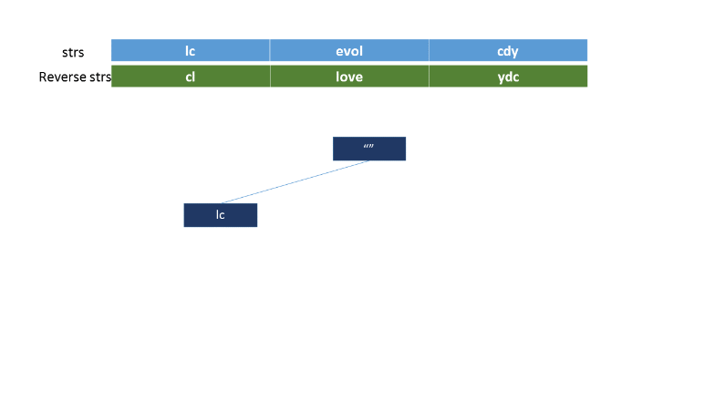
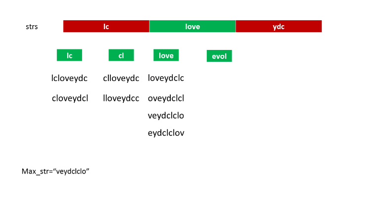
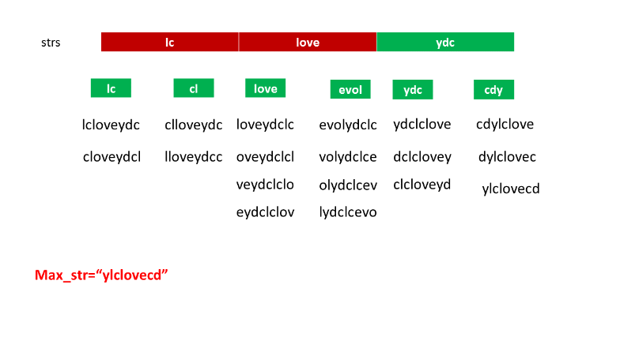

555. Split Concatenated Strings

Given a list of strings, you could concatenate these strings together into a loop, where for each string you could choose to reverse it or not. Among all the possible loops, you need to find the lexicographically biggest string after cutting the loop, which will make the looped string into a regular one.

Specifically, to find the lexicographically biggest string, you need to experience two phases:

1. Concatenate all the strings into a loop, where you can reverse some strings or not and connect them in the same order as given.
1. Cut and make one breakpoint in any place of the loop, which will make the looped string into a regular one starting from the character at the cutpoint.

And your job is to find the lexicographically biggest one among all the possible regular strings.

**Example:**
```
Input: "abc", "xyz"
Output: "zyxcba"
Explanation: You can get the looped string "-abcxyz-", "-abczyx-", "-cbaxyz-", "-cbazyx-", 
where '-' represents the looped status. 
The answer string came from the fourth looped one, 
where you could cut from the middle character 'a' and get "zyxcba".
```

**Note:**

* The input strings will only contain lowercase letters.
* The total length of all the strings will not over 1,000.

# Solution
---
## Summary
We are given a list of strings: $s_1, s_2, s_3,.., s_n$ We need to concatenate all these strings in a circular fashion in the same given order, but we can reverse every individual string before concatenating. Now, we need to make a cut in the final concatenated string such that the new string formed is the largest one possible in the lexicographic sense

## Approach #1 Depth First Search [Time Limit Exceeded]
The simplest solution is to try forming every possible concatenated string by making use of the given strings and then forming every possible cut in each such final concatenated string.

To do so, we can make use of a recursive function `dfs` which appends the current string to the concatenated string formed till now and calls itself with the new concatenated string. It also appends the reversed current string to the current concatenated string and calls itself. The concatenation of strings goes in the manner of a Depth First Search. Thus, after reaching the full depth of every branch traversal, we obtain a new concatenated string as illustrated in the animation below. We can apply all the possible cuts to these strings and find the lexicographically largest string out of all of them.


```java

public class Solution {
    String res = "";
    public String splitLoopedString(String[] strs) {
        dfs(strs, "", 0, strs.length);
        return res;
    }
    public void dfs(String[] strs, String s, int i, int n) {
        if (i < n) {
            dfs(strs, s + strs[i], i + 1, n);
            dfs(strs, s + new StringBuffer(strs[i]).reverse().toString(), i + 1, n);
        } else {
            for (int j = 0; j < s.length(); j++) {
                String t = s.substring(j) + s.substring(0, j);
                if (t.compareTo(res) > 0)
                    res = t;
            }
        }
    }
}
```

**Complexity Analysis**

* Time complexity : $O(n \cdot 2^n)$. Size of Recursion tree can grow upto $2^n$ where $n$ is the number of strings in the list, and at each recursion call one deals with the string of length $n$.

* Space complexity : $O(n)$. Depth of Recursion tree will be $n$

## Approach #2 Breadth First Search [Memory Limit Exceeded]
**Algorithm**

Exploring all strings can also be done using BFS method. A Queue $queue$ is maintained which stores the strings formed till now after concatenation of the next string and also by concatenation of reverse of next string. Every time we remove a string from the front of the queue, we add two strings to the back of the queue(one by concatenating the next string directly and another by concatenating the next string after reversing).

When all the strings are traversed queue contains $O(2^n)$ strings, which correspond to every possible valid string which can be formed by doing the concatenations. We check every string into the queue after circularly rotating by placing the cuts at every possible location. While doing this, we keep a track of the lexicographically largest string.

This animation will depict the method:





```java
public class Solution {

    public String splitLoopedString(String[] strs) {
        Queue < String > queue = new LinkedList < > ();
        String res = "";
        int i = 0, j = 0;
        queue.add("");
        while (i < strs.length) {
            String t = queue.remove();
            queue.add(t + strs[i]);
            queue.add(t + new StringBuffer(strs[i]).reverse().toString());
            j++;
            if (j == 1 << i) {
                i++;
                j = 0;
            }
        }
        while (!queue.isEmpty()) {
            String t = queue.remove();
            for (int k = 0; k < t.length(); k++) {
                String t1 = t.substring(k) + t.substring(0, k);
                if (t1.compareTo(res) > 0)
                    res = t1;
            }
        }
        return res;
    }
}
```

**Complexity Analysis**

* Time complexity : $O(n \cdot 2^n)$. $2^n$ possible strings will be formed where $n$ is the number of strings in the list, and at each recursion call one deals with the string of length $n$.

* Space complexity : $O(2^n)$. queuequeue's size can grow upto $2^n$.

## Approach #3 Optimized Solution [Accepted]
**Algorithm**

In order to understand how this solution works, firstly we'll look at some of the properties of the transformation involved. The first point to note is that the relative ordering of the strings doesn't change after applying the transformations(i.e. reversing and applying cuts).

The second property will be explained taking the help of an example. Consider the given list of strings: $[s_1, s_2, s_3,..,s_j,..s_n]$. Now, assume that we choose $s_j$ to be the string on which the current cut is placed leading to the formation of two substrings from $s_j$, namely, say $s_{jpre}$, $s_{jpost}$. Thus, the concatenated string formed by such a cut will be: $[s_{jpost}, s_{j+1},..., s_n, s_{1rev}, s_{2rev},.., s_{(jpre)rev}]$. Here, $s_{irev}$ means the reversed $s_i$ string.

The concatenated string formed follows the same pattern irrespective of where the cut is placed in $s_j$. But still, the relative ordering of the strings persists, even if we include the reverse operation as well.

Now, if we consider only a single cut for the time being, in string $s_j$ (not reversed) as discussed above, and allow for the reverse operation among the remaining strings, the lexicographically largest concatenated string will be given by: $[s_{jpost}, \text{max}(s_{j+1},s_{(j+1)rev}) ,..., \text{max}(s_{n},s_{(n)rev}), \text{max}(s_{1},s_{(1)rev}), ..., s_{(jpre)rev}]$. Here, $\text{max}$ refers to the lexicographic maximum operation.

Thus, if a particular string $s_j$ is finalized for the cut, the largest lexicographic concatenated string is dependent only on whether the string $s_j$ is reversed or not, and also on the position of the cut. This happens because the reverse/not reverse operation for the rest of the strings is fixed for a chosen $s_j$ as shown above and thus, doesn't impact the final result.

Based on the above observations, we follow the given procedure. For every given string, we replace the string with the lexicographically larger string out of the original string and the reversed one. After this, we pick up every new string(chosen as the string on which the cuts will be applied), and apply a cut at all the positions of the currently picked string and form the full concantenated string keeping the rest of the newly formed strings intact. We also reverse the current string and follow the same process. While doing this, we keep a track of the largest lexicographic string found so far.

For a better understanding of the procedure, watch this animation:







```java
public class Solution {
    public String splitLoopedString(String[] strs) {
        for (int i = 0; i < strs.length; i++) {
            String rev = new StringBuilder(strs[i]).reverse().toString();
            if (strs[i].compareTo(rev) < 0)
                strs[i] = rev;
        }
        String res = "";
        for (int i = 0; i < strs.length; i++) {
            String rev = new StringBuilder(strs[i]).reverse().toString();
            for (String st: new String[] {strs[i], rev}) {
                for (int k = 0; k < st.length(); k++) {
                    StringBuilder t = new StringBuilder(st.substring(k));
                    for (int j = i + 1; j < strs.length; j++)
                        t.append(strs[j]);
                    for (int j = 0; j < i; j++)
                        t.append(strs[j]);
                    t.append(st.substring(0, k));
                    if (t.toString().compareTo(res) > 0)
                        res = t.toString();
                }
            }
        }
        return res;
    }
}
```

**Complexity Analysis**

* Time complexity : $O(n^2)$. where $n$ is the total number of characters in a list.

* Space complexity : $O(n)$. $t$ and $res$ of size $n$ are used.

# Submissions
---
**Solution 1; (String)**
```
Runtime: 84 ms
Memory Usage: 14.6 MB
```
```python
class Solution:
    def splitLoopedString(self, strs: List[str]) -> str:
        def getMaxStr(s: str) -> str:
            i, j = 0, len(s)-1
            while i < j:
                if s[i] < s[j]: return s[::-1]
                if s[i] > s[j]: return s
                i += 1
                j -= 1
            return s

        for i in range(len(strs)): 
            strs[i] = getMaxStr(strs[i])

        concatenated = ''.join(strs)
        exclusives = [''] * len(strs)
        for i in range(len(strs)):
            exclusives[i] = concatenated[len(strs[i]):]
            concatenated = concatenated[len(strs[i]):] + strs[i]

        output = ''
        for i, s in enumerate(strs):
            sr = s[::-1]
            for j in range(len(s)+1):
                output = max(output, s[j:] + exclusives[i] + s[:j], sr[j:] + exclusives[i] + sr[:j])

        return output
```
