562. Longest Line of Consecutive One in Matrix

Given a 01 matrix **M**, find the longest line of consecutive one in the matrix. The line could be horizontal, vertical, diagonal or anti-diagonal.

**Example:**
```
Input:
[[0,1,1,0],
 [0,1,1,0],
 [0,0,0,1]]
Output: 3
```
**Hint:** The number of elements in the given matrix will not exceed 10,000.

# Solution
---
## Approach 1: Brute Force
**Algorithm**

The brute force approach is really simple. We directly traverse along every valid line in the given matrix: i.e. Horizontal, Vertical, Diagonal aline above and below the middle diagonal, Anti-diagonal line above and below the middle anti-diagonal. Each time during the traversal, we keep on incrementing the countcount if we encounter continuous 1's. We reset the countcount for any discontinuity encountered. While doing this, we also keep a track of the maximum countcount found so far.

**Java**

```java
class Solution {
  public int longestLine(int[][] M) {
    if (M.length == 0) return 0;
    int ones = 0;
    // horizontal
    for (int i = 0; i < M.length; i++) {
      int count = 0;
      for (int j = 0; j < M[0].length; j++) {
        if (M[i][j] == 1) {
          count++;
          ones = Math.max(ones, count);
        } else count = 0;
      }
    }
    // vertical
    for (int i = 0; i < M[0].length; i++) {
      int count = 0;
      for (int j = 0; j < M.length; j++) {
        if (M[j][i] == 1) {
          count++;
          ones = Math.max(ones, count);
        } else count = 0;
      }
    }
    // upper diagonal
    for (int i = 0; i < M[0].length || i < M.length; i++) {
      int count = 0;
      for (int x = 0, y = i; x < M.length && y < M[0].length; x++, y++) {
        if (M[x][y] == 1) {
          count++;
          ones = Math.max(ones, count);
        } else count = 0;
      }
    }
    // lower diagonal
    for (int i = 0; i < M[0].length || i < M.length; i++) {
      int count = 0;
      for (int x = i, y = 0; x < M.length && y < M[0].length; x++, y++) {
        if (M[x][y] == 1) {
          count++;
          ones = Math.max(ones, count);
        } else count = 0;
      }
    }
    // upper anti-diagonal
    for (int i = 0; i < M[0].length || i < M.length; i++) {
      int count = 0;
      for (int x = 0, y = M[0].length - i - 1; x < M.length && y >= 0; x++, y--) {
        if (M[x][y] == 1) {
          count++;
          ones = Math.max(ones, count);
        } else count = 0;
      }
    }
    // lower anti-diagonal
    for (int i = 0; i < M[0].length || i < M.length; i++) {
      int count = 0;
      for (int x = i, y = M[0].length - 1; x < M.length && y >= 0; x++, y--) {
        // System.out.println(x+" "+y);
        if (M[x][y] == 1) {
          count++;
          ones = Math.max(ones, count);
        } else count = 0;
      }
    }
    return ones;
  }
}
```

**Complexity Analysis**

Let $m$ be the length of the matrix and nn be the width of the matrix. As a result, $mn$ would be the total number of cells in the matrix.

* Time complexity : $O(mn)$. We traverse along the entire matrix 4 times.
* Space complexity : $O(1)$. Constant space is used.

## Approach 2: Using 3D Dynamic Programming
**Algorithm**

Instead of traversing over the same matrix multiple times, we can keep a track of the 1' along all the lines possible while traversing the matrix once only. In order to do so, we make use of a $4mn$ sized $dp$ array. Here, $dp[0]$, $dp[1]$, $dp[2]$ ,$dp[3]$ are used to store the maximum number of continuous 1's found so far along the Horizontal, Vertical, Diagonal and Anti-diagonal lines respectively. e.g. $dp[i][j][0]$ is used to store the number of continuous 1's found so far(till we reach the element $M[i][j]$), along the horizontal lines only.

Thus, we traverse the matrix $M$ in a row-wise fashion only but, keep updating the entries for every $dp$ appropriately.

The following image shows the filled $dp$ values for this matrix:

```
 0 1 1 0

 0 1 1 0
   
 0 0 1 1
```

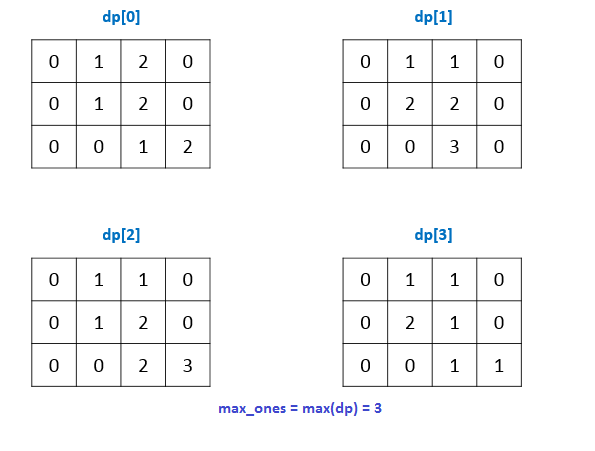

While filling up the $dp$, we can keep a track of the length of the longest consecutive line of 1's.

Watch this animation for complete process:

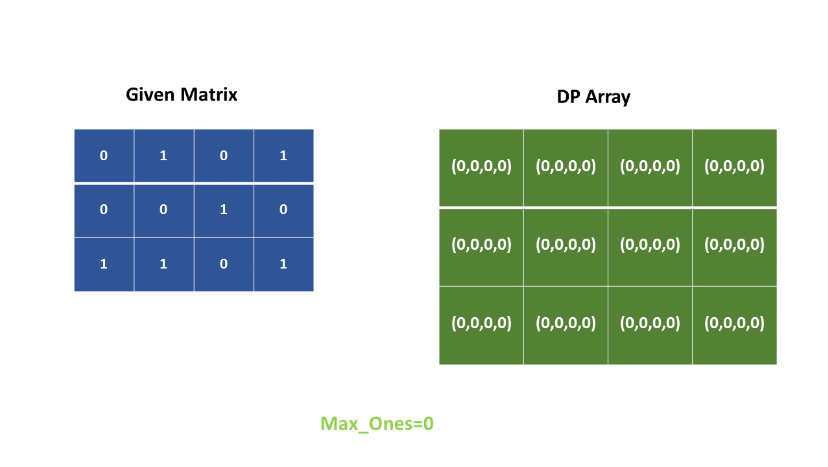
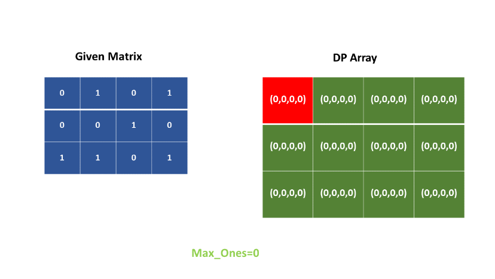
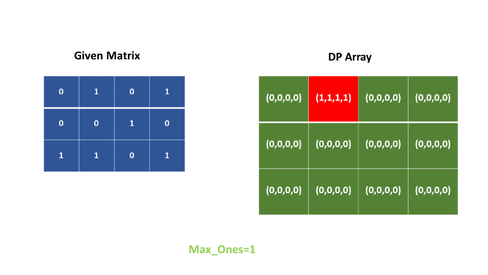
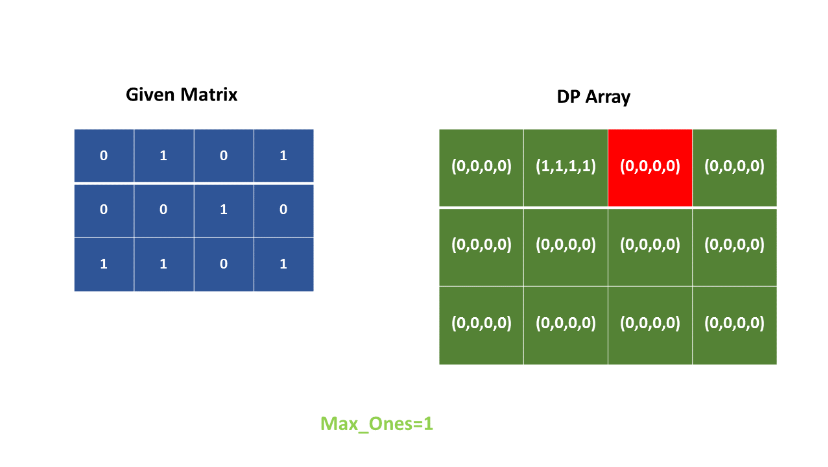
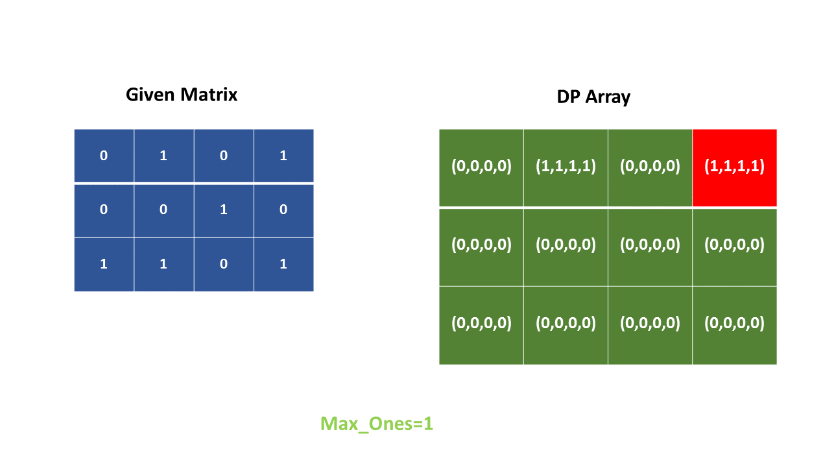
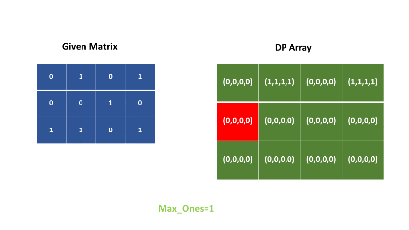
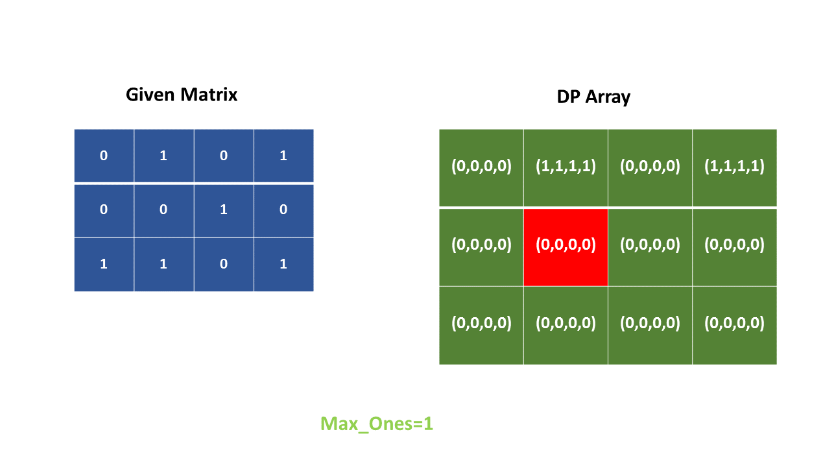
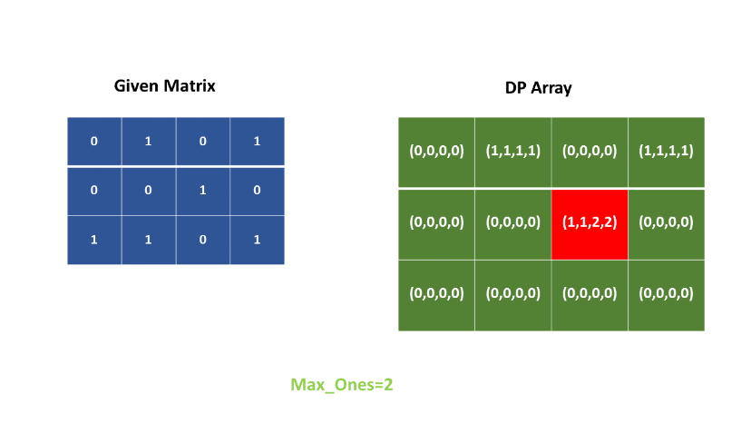
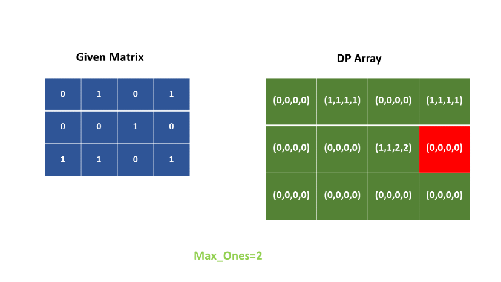
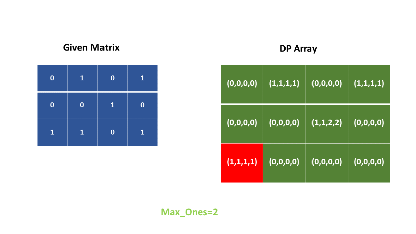
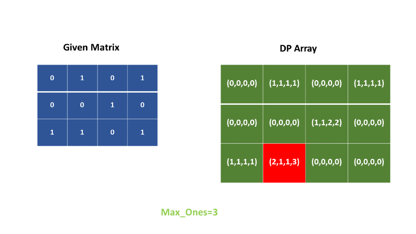
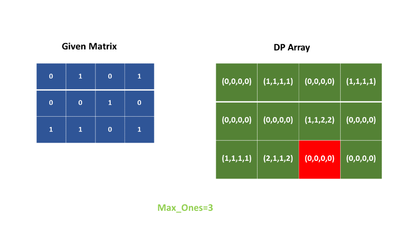
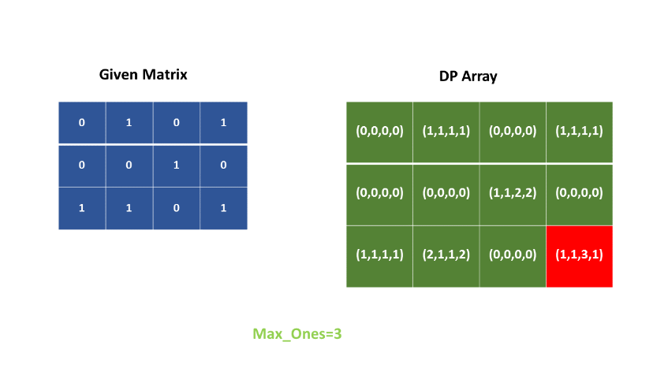
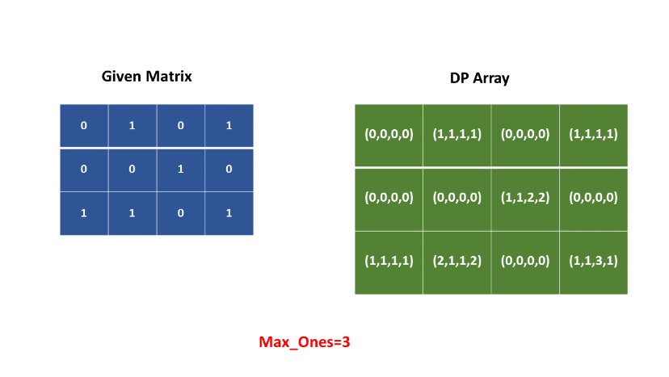

**Java**

```java
class Solution {
  public int longestLine(int[][] M) {
    if (M.length == 0) return 0;
    int ones = 0;
    int[][][] dp = new int[M.length][M[0].length][4];
    for (int i = 0; i < M.length; i++) {
      for (int j = 0; j < M[0].length; j++) {
        if (M[i][j] == 1) {
          dp[i][j][0] = j > 0 ? dp[i][j - 1][0] + 1 : 1;
          dp[i][j][1] = i > 0 ? dp[i - 1][j][1] + 1 : 1;
          dp[i][j][2] = (i > 0 && j > 0) ? dp[i - 1][j - 1][2] + 1 : 1;
          dp[i][j][3] = (i > 0 && j < M[0].length - 1) ? dp[i - 1][j + 1][3] + 1 : 1;
          ones =
              Math.max(
                  ones,
                  Math.max(Math.max(dp[i][j][0], dp[i][j][1]), Math.max(dp[i][j][2], dp[i][j][3])));
        }
      }
    }
    return ones;
  }
}
```

**Complexity Analysis**

* Time complexity : $O(mn)$. We traverse the entire matrix once only.

* Space complexity : $O(mn)$. $dp$ array of size 4mn4mn is used, where $m$ and $n$ are the number of rows ans coloumns of the matrix.

## Approach 3: Using 2D Dynamic Programming
**Algorithm**

In the previous approach, we can observe that the current $dp$ entry is dependent only on the entries of the just previous corresponding $dp$ row. Thus, instead of maintaining a 2-D $dp$ matrix for each kind of line of 1's possible, we can use a 1-d array for each one of them, and update the corresponding entries in the same row during each row's traversal. Taking this into account, the previous 3-D dpdp matrix shrinks to a 2-D $dp$ matrix now. The rest of the procedure remains same as the previous approach.

**Java**

```java
class Solution {
  public int longestLine(int[][] M) {
    if (M.length == 0) return 0;
    int ones = 0;
    int[][] dp = new int[M[0].length][4];
    for (int i = 0; i < M.length; i++) {
      int old = 0;
      for (int j = 0; j < M[0].length; j++) {
        if (M[i][j] == 1) {
          dp[j][0] = j > 0 ? dp[j - 1][0] + 1 : 1;
          dp[j][1] = i > 0 ? dp[j][1] + 1 : 1;
          int prev = dp[j][2];
          dp[j][2] = (i > 0 && j > 0) ? old + 1 : 1;
          old = prev;
          dp[j][3] = (i > 0 && j < M[0].length - 1) ? dp[j + 1][3] + 1 : 1;
          ones =
              Math.max(ones, Math.max(Math.max(dp[j][0], dp[j][1]), Math.max(dp[j][2], dp[j][3])));
        } else {
          old = dp[j][2];
          dp[j][0] = dp[j][1] = dp[j][2] = dp[j][3] = 0;
        }
      }
    }
    return ones;
  }
}
```

**Complexity Analysis**

* Time complexity : $O(mn)$. The entire matrix is traversed once only.

* Space complexity : $O(n)$. $dp$ array of size $4n$ is used, where $n$ is the number of columns of the matrix.

# Submissions
---
**Solution 1: (Using 3D Dynamic Programming)**
```
Runtime: 560 ms
Memory Usage: 17 MB
```
```python
class Solution:
    def longestLine(self, M: List[List[int]]) -> int:
        if not M: return 0
        R, C = len(M), len(M[0])
        ones = 0
        dp = [[[0]*4 for _ in range(C)] for _ in range(R)]
        for i in range(R):
            for j in range(C):
                if M[i][j] == 1:
                    dp[i][j][0] = dp[i][j - 1][0] + 1 if j > 0 else 1
                    dp[i][j][1] = dp[i - 1][j][1] + 1 if i > 0 else 1
                    dp[i][j][2] = dp[i - 1][j - 1][2] + 1 if (i > 0 and j > 0) else 1
                    dp[i][j][3] = dp[i - 1][j + 1][3] + 1 if (i > 0 and j < C - 1) else 1
                    ones = max(ones, max([dp[i][j][k] for k in range(4)]))
                   
        return ones
```

**Solution 2: (Using 2D Dynamic Programming)**
```
Runtime: 516 ms
Memory Usage: 15.8 MB
```
```python
class Solution:
    def longestLine(self, M: List[List[int]]) -> int:
        if not M: return 0
        R, C = len(M), len(M[0])
        ones = 0
        dp = [[0]*4 for _ in range(C)]
        for i in range(R):
            old = 0
            for j in range(C):
                if M[i][j] == 1:
                    dp[j][0] = dp[j - 1][0] + 1 if j > 0 else 1
                    dp[j][1] = dp[j][1] + 1 if i > 0 else 1
                    prev = dp[j][2]
                    dp[j][2] = old + 1 if (i > 0 and j > 0) else 1
                    old = prev
                    dp[j][3] = dp[j + 1][3] + 1 if (i > 0 and j < C - 1) else 1
                    ones = max(ones, max([dp[j][k] for k in range(4)]))
                else:
                    old = dp[j][2]
                    dp[j][0] = dp[j][1] = dp[j][2] = dp[j][3] = 0
                   
        return ones
```