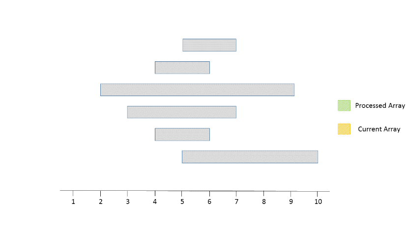
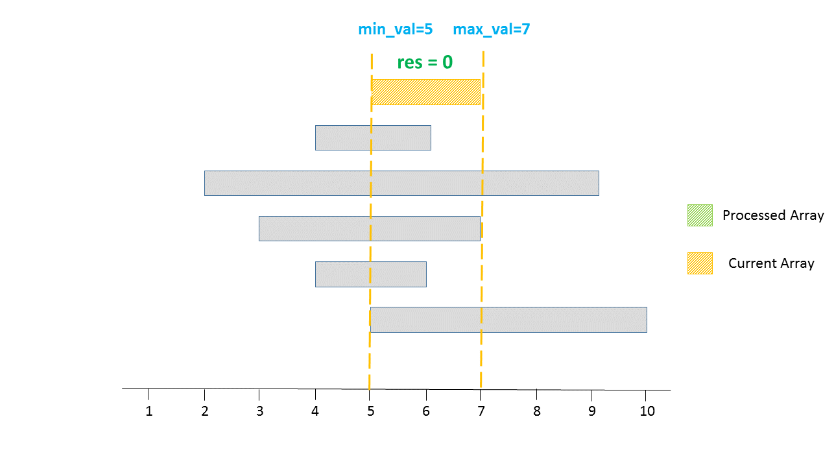
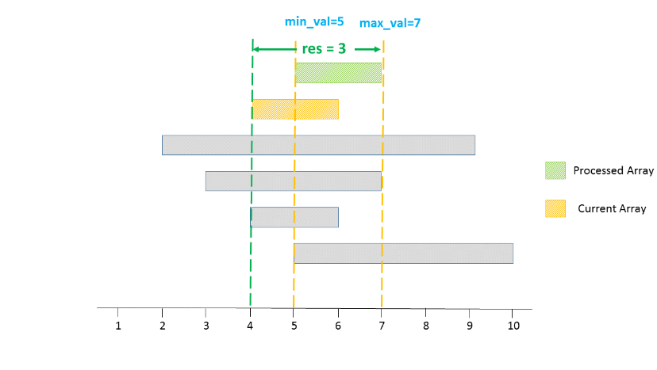
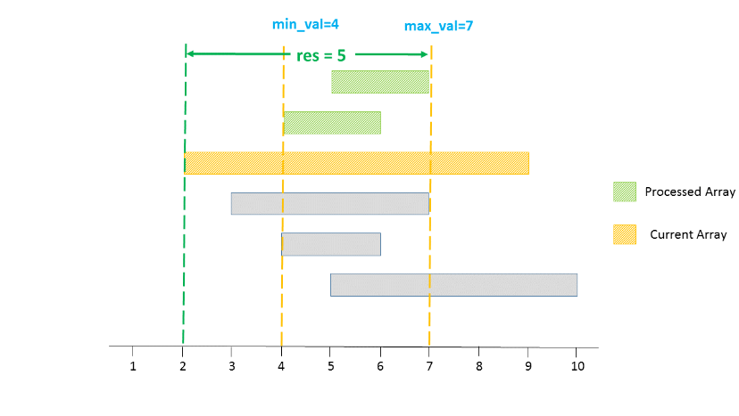
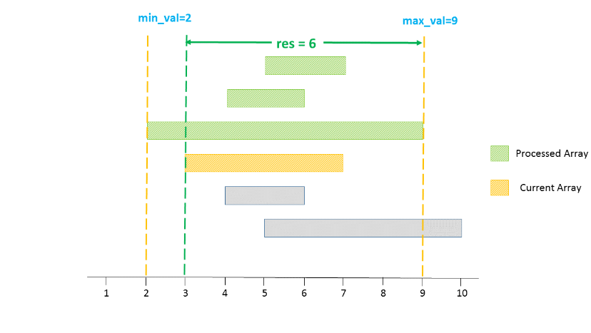
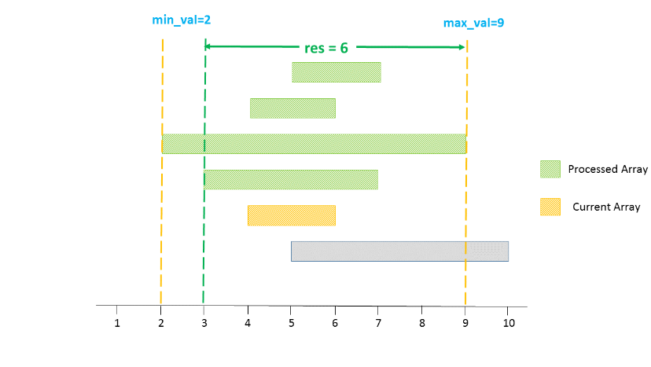
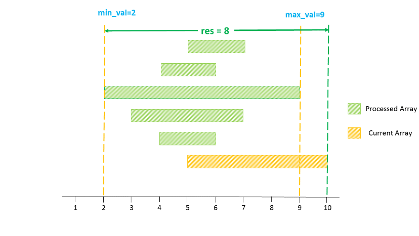
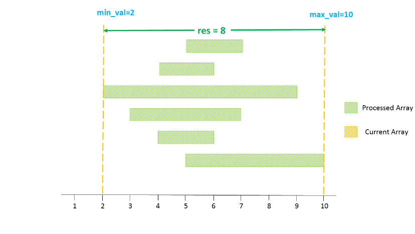

624. Maximum Distance in Arrays

Given `m` arrays, and each array is sorted in ascending order. Now you can pick up two integers from two different arrays (each array picks one) and calculate the distance. We define the distance between two integers `a` and `b` to be their absolute difference `|a-b|`. Your task is to find the maximum distance.

**Example 1:**
```
Input: 
[[1,2,3],
 [4,5],
 [1,2,3]]
Output: 4
Explanation: 
One way to reach the maximum distance 4 is to pick 1 in the first or third array and pick 5 in the second array.
```

**Note:**

* Each given array will have at least `1` number. There will be at least two non-empty arrays.
* The total number of the integers in all the `m` arrays will be in the range of `[2, 10000]`.
* The integers in the `m` arrays will be in the range of `[-10000, 10000]`.

# Solution
---
## Approach #1 Brute Force [Time Limit Exceeded]
The simplest solution is to pick up every element of every array from the listlist and find its distance from every element in all the other arrays except itself and find the largest distance from out of those.

```java
public class Solution {
    public int maxDistance(int[][] list) {
        int res = 0;
        for (int i = 0; i < list.length - 1; i++) {
            for (int j = 0; j < list[i].length; j++) {
                for (int k = i + 1; k < list.length; k++) {
                    for (int l = 0; l < list[k].length; l++) {
                        res = Math.max(res, Math.abs(list[i][j] - list[k][l]));
                    }
                }
            }
        }
        return res;
    }
}
```

**Complexity Analysis**

* Time complexity : $O((n*x)^2)$. We traverse over all the arrays in $list$ for every element of every array considered. Here, nn refers to the number of arrays in the listlist and $x$ refers to the average number of elements in each array in the $list$.

* Space complexity : $O(1)$. Constant extra space is used.

## Approach #2 Better Brute Force [Time Limit Exceeded]
**Algorithm**

In the last approach, we didn't make use of the fact that every array in the listlist is sorted. Thus, instead of considering the distances among all the elements of all the arrays(except intra-array elements), we can consider only the distances between the first(minimum element) element of an array and the last(maximum element) element of the other arrays and find out the maximum distance from among all such distances.

```java
public class Solution {
    public int maxDistance(int[][] list) {
        int res = 0;
        for (int i = 0; i < list.length - 1; i++) {
            for (int j = i + 1; j < list.length; j++) {
                res = Math.max(res, Math.abs(list[i][0] - list[j][list[j].length - 1]));
                res = Math.max(res, Math.abs(list[j][0] - list[i][list[i].length - 1]));
            }
        }
        return res;
    }
}
```

**Complexity Analysis**

* Time complexity : $O(n^2)$. We consider only max and min values directly for every array currenty considered. Here, $n$ refers to the number of arrays in the $list$.

* Space complexity : $O(1)$. Constant extra space is used.

## Approach #3 Single Scan [Accepted]
**Algorithm**

As discussed already, in order to find out the maximum distance between any two arrays, we need not compare every element of the arrays, since the arrays are already sorted. Thus, we can consider only the extreme points in the arrays to do the distance calculations.

Further, the two points being considered for the distance calculation should not both belong to the same array. Thus, for arrays $a$ and $b$ currently chosen, we can just find the maximum out of $a[n-1]-b[0]$ and $b[m-1]-a[0]$ to find the larger distance. Here, $n$ and $m$ refer to the lengths of arrays $a$ and $b$ respectively.

But, we need not compare all the array pairs possible to find the maximum distance. Instead, we can keep on traversing over the arrays in the $list$ and keep a track of the maximum distance found so far.

To do so, we keep a track of the element with minimum value($min\_val$) and the one with maximum value($max_val$) found so far. Thus, now these extreme values can be treated as if they represent the extreme points of a cumulative array of all the arrays that have been considered till now.

For every new array, $a$ considered, we find the distance $a[n-1]-min\_val$ and $max\_val - a[0]$ to compete with the maximum distance found so far. Here, $n$ refers to the number of elements in the current array, $a$. Further, we need to note that the maximum distance found till now needs not always be contributed by the end points of the distance being $max\_val$ and $min\_val$.

But, such points could help in maximizing the distance in the future. Thus, we need to keep track of these maximum and minimum values along with the maximum distance found so far for future calculations. But, in general, the final maximum distance found will always be determined by one of these extreme values, $max\_val$ and $min\_val$, or in some cases, by both of them.

The following animation illustrates the process.










From the above illustration, we can clearly see that although the $max\_val$ or $min\_val$ could not contribute to the local maximum distance values, they could later on contribute to the maximum distance.

```java
public class Solution {
    public int maxDistance(int[][] list) {
        int res = 0, min_val = list[0][0], max_val = list[0][list[0].length - 1];
        for (int i = 1; i < list.length; i++) {
            res = Math.max(res, Math.max(Math.abs(list[i][list[i].length - 1] - min_val), Math.abs(max_val - list[i][0])));
            min_val = Math.min(min_val, list[i][0]);
            max_val = Math.max(max_val, list[i][list[i].length - 1]);
        }
        return res;
    }
}
```

**Complexity Analysis**
* Time complexity : $O(n)$. We traverse over the $list$ of length $n$ once only.

* Space complexity : $O(1)$. Constant extra space is used.

# Submissions
---
**Solution 1: (Single Scan, Greedy)**
```
Runtime: 172 ms
Memory Usage: 16.8 MB
```
```python
class Solution:
    def maxDistance(self, arrays: List[List[int]]) -> int:
        res = 0
        min_val, max_val = arrays[0][0], arrays[0][-1]
        for i in range(1, len(arrays)):
            res = max(res, max(abs(arrays[i][-1] - min_val), abs(max_val - arrays[i][0])))
            min_val = min(min_val, arrays[i][0])
            max_val = max(max_val, arrays[i][-1])
                                         
        return res
```

**Solution 2: (sorted map)**
```
Runtime: 261 ms
Memory: 116.55 MB
```
```c++
class Solution {
public:
    int maxDistance(vector<vector<int>>& arrays) {
        map<int,vector<int>> mini;
        map<int,vector<int>> maxi;
        for(int i=0; i<arrays.size(); i++){
            mini[arrays[i][0]].push_back(i);
            maxi[arrays[i][arrays[i].size()-1]].push_back(i);
        }
        auto miniptr = mini.begin();
        auto maxiptr = maxi.rbegin();
        
        if(miniptr->second[0] == maxiptr->second[0]){
            auto mininext = mini.begin();
            if(mininext->second.size() == 1)mininext++;
            auto maxinext = maxi.rbegin();
            if(maxinext->second.size() == 1)maxinext++;
            return max(abs(maxinext->first - miniptr->first), abs(maxiptr->first - mininext->first));
        }
        return abs(maxiptr->first - miniptr->first);
    }
};
```

**Solution 3: (Greedy)**

    arrays = [[1,2,3],[4,5],[1,2,3]]

arrays 1  2  3  4  5 
0      x  x  x
       mn    mx
-------------------------
1      x  x  x
                x  x
ans          mx-|
       mn----------|  < ans

       mn          mx
-------------------------
2      x  x  x  x  x
       x  x  x
ans    |-----------mx
       mn----|

       mn          mx

```
Runtime: 220 ms
Memory: 107.91 MB
```
```c++
class Solution {
public:
    int maxDistance(vector<vector<int>>& arrays) {
        int ans = 0, mn = arrays[0][0], mx = arrays[0].back();
        for (int i = 1; i < arrays.size(); i ++) {
            ans = max({ans, abs(arrays[i].back() - mn), abs(mx - arrays[i][0])});
            mn = min(mn, arrays[i][0]);
            mx = max(mx, arrays[i].back());
        }
        return ans;
    }
};
```
``
