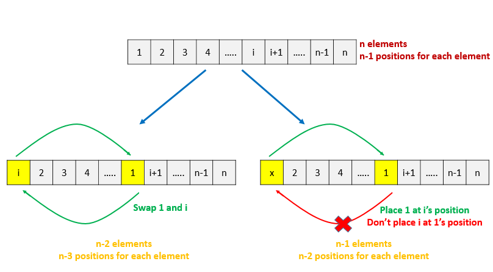

634. Find the Derangement of An Array

In combinatorial mathematics, a derangement is a permutation of the elements of a set, such that no element appears in its original position.

There's originally an array consisting of n integers from `1` to `n` in ascending order, you need to find the number of derangement it can generate.

Also, since the answer may be very large, you should return the output mod `10^9 + 7`.

**Example 1:**
```
Input: 3
Output: 2
Explanation: The original array is [1,2,3]. The two derangements are [2,3,1] and [3,1,2].
```

**Note:**

* `n` is in the range of `[1, 10^6]`.

# Submissions
---
**Solution 1: (Dynamic Programming)**



```
Runtime: 420 ms
Memory Usage: 54.1 MB
```
```python
class Solution:
    def findDerangement(self, n: int) -> int:
        if n == 0:
            return 1
        if n == 1:
            return 0
        dp = [0]*(n+1)
        dp[0] = 1
        dp[1] = 0
        for i in range(2, n+1):
            dp[i] = (i - 1) * (dp[i - 1] + dp[i - 2]) % (10**9 + 7)
        return dp[n]
```

**Solution 2: (Constant Space Dynamic Programming)**
```
Runtime: 432 ms
Memory Usage: 14.3 MB
```
```python
class Solution:
    def findDerangement(self, n: int) -> int:
        mul, sum_, M = 1, 0, 10**9 + 7
        for i in range(n, -1, -1):
            sum_ = (sum_ + M + mul * (1 if i % 2 == 0 else -1)) % M
            mul = (mul * i) % M
        return sum_
```