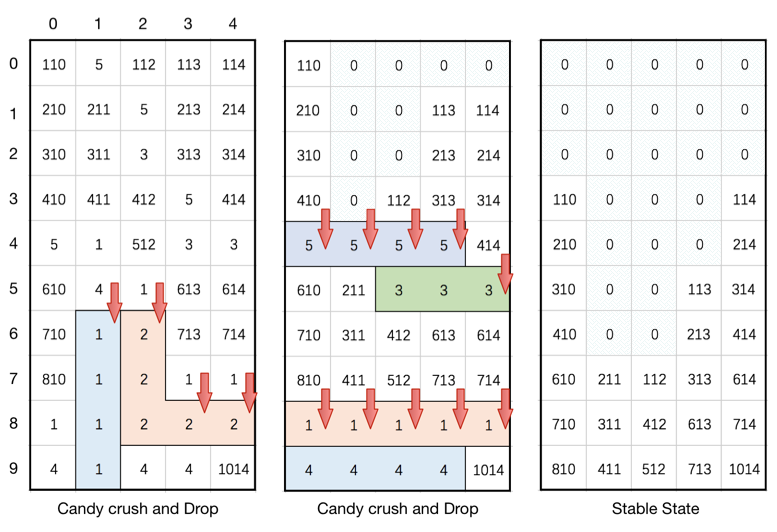

723. Candy Crush

This question is about implementing a basic elimination algorithm for Candy Crush.

Given a 2D integer array `board` representing the grid of candy, different positive integers `board[i][j]` represent different types of candies. A value of `board[i][j] = 0` represents that the cell at position (i, j) is empty. The given board represents the state of the game following the player's move. Now, you need to restore the board to a stable state by crushing candies according to the following rules:

1. If three or more candies of the same type are adjacent vertically or horizontally, "crush" them all at the same time - these positions become empty.
1. After crushing all candies simultaneously, if an empty space on the board has candies on top of itself, then these candies will drop until they hit a candy or bottom at the same time. (No new candies will drop outside the top boundary.)
1. After the above steps, there may exist more candies that can be crushed. If so, you need to repeat the above steps.
1. If there does not exist more candies that can be crushed (ie. the board is stable), then return the current board.

You need to perform the above rules until the board becomes stable, then return the current board.

 

**Example:**
```
Input:
board =
[[110,5,112,113,114],[210,211,5,213,214],[310,311,3,313,314],[410,411,412,5,414],[5,1,512,3,3],[610,4,1,613,614],[710,1,2,713,714],[810,1,2,1,1],[1,1,2,2,2],[4,1,4,4,1014]]

Output:
[[0,0,0,0,0],[0,0,0,0,0],[0,0,0,0,0],[110,0,0,0,114],[210,0,0,0,214],[310,0,0,113,314],[410,0,0,213,414],[610,211,112,313,614],[710,311,412,613,714],[810,411,512,713,1014]]

Explanation:
```


**Note:**

* The length of `board` will be in the range `[3, 50]`.
* The length of `board[i]` will be in the range `[3, 50]`.
* Each `board[i][j]` will initially start as an integer in the range `[1, 2000]`.

## Approach #1: Ad-Hoc
Intuition

We need to simply perform the algorithm as described. It consists of two major steps: a crush step, and a gravity step. We work through each step individually.

**Algorithm**

Crushing Steps

When crushing, one difficulty is that we might accidentally crush candy that is part of another row. For example, if the board is:
```
123
145
111
```
and we crush the vertical row of `1`s early, we may not see there was also a horizontal row.

To remedy this, we should flag candy that should be crushed first. We could use an auxillary `toCrush` boolean array, or we could mark it directly on the board by making the entry negative (ie. `board[i][j] = -Math.abs(board[i][j])`)

As for how to scan the board, we have two approaches. Let's call a line any row or column of the board.

For each line, we could use a sliding window (or `itertools.groupby` in Python) to find contiguous segments of the same character. If any of these segments have length `3` or more, we should flag them.

Alternatively, for each line, we could look at each width-`3` slice of the line: if they are all the same, then we should flag those `3`.

After, we can crush the candy by setting all flagged board cells to zero.

Gravity Step

For each column, we want all the candy to go to the bottom. One way is to iterate through and keep a stack of the (uncrushed) candy, popping and setting as we iterate through the column in reverse order.

Alternatively, we could use a sliding window approach, maintaining a read and write head. As the read head iterates through the column in reverse order, when the read head sees candy, the write head will write it down and move one place. Then, the write head will write zeroes to the remainder of the column.

We showcase the simplest approaches to these steps in the solutions below.

```python
class Solution(object):
    def candyCrush(self, board):
        R, C = len(board), len(board[0])
        todo = False

        for r in xrange(R):
            for c in xrange(C-2):
                if abs(board[r][c]) == abs(board[r][c+1]) == abs(board[r][c+2]) != 0:
                    board[r][c] = board[r][c+1] = board[r][c+2] = -abs(board[r][c])
                    todo = True

        for r in xrange(R-2):
            for c in xrange(C):
                if abs(board[r][c]) == abs(board[r+1][c]) == abs(board[r+2][c]) != 0:
                    board[r][c] = board[r+1][c] = board[r+2][c] = -abs(board[r][c])
                    todo = True

        for c in xrange(C):
            wr = R-1
            for r in xrange(R-1, -1, -1):
                if board[r][c] > 0:
                    board[wr][c] = board[r][c]
                    wr -= 1
            for wr in xrange(wr, -1, -1):
                board[wr][c] = 0

        return self.candyCrush(board) if todo else board
```

**Complexity Analysis**

* Time Complexity: $O((R*C)^2)$, where $R, C$ is the number of rows and columns in board. We need $O(R*C)$ to scan the board, and we might crush only 3 candies repeatedly.

* Space Complexity: $O(1)$ additional complexity, as we edit the board in place.

# Submissions
---
**Solution 1: (Ad-Hoc)**
```
Runtime: 216 ms
Memory Usage: 13.9 MB
```
```python
class Solution:
    def candyCrush(self, board: List[List[int]]) -> List[List[int]]:
        R, C = len(board), len(board[0])
        todo = False

        for r in range(R):
            for c in range(C-2):
                if abs(board[r][c]) == abs(board[r][c+1]) == abs(board[r][c+2]) != 0:
                    board[r][c] = board[r][c+1] = board[r][c+2] = -abs(board[r][c])
                    todo = True

        for r in range(R-2):
            for c in range(C):
                if abs(board[r][c]) == abs(board[r+1][c]) == abs(board[r+2][c]) != 0:
                    board[r][c] = board[r+1][c] = board[r+2][c] = -abs(board[r][c])
                    todo = True

        for c in range(C):
            wr = R-1
            for r in range(R-1, -1, -1):
                if board[r][c] > 0:
                    board[wr][c] = board[r][c]
                    wr -= 1
            for wr in range(wr, -1, -1):
                board[wr][c] = 0

        return self.candyCrush(board) if todo else board
```

**Solution 2: (Separate Steps: Find, Crush, Drop)**
```
Runtime: 136 ms
Memory: 16.4 MB
```
```python
class Solution:
    def candyCrush(self, board: List[List[int]]) -> List[List[int]]:
        m, n = len(board), len(board[0])

        def find():
            crushed_set = set()

            # Check vertically adjacent candies 
            for r in range(1, m - 1):
                for c in range(n):
                    if board[r][c] == 0:
                        continue
                    if board[r][c] == board[r - 1][c] == board[r + 1][c]: 
                        crushed_set.add((r, c))
                        crushed_set.add((r - 1, c))
                        crushed_set.add((r + 1, c))

            # Check horizontally adjacent candies 
            for r in range(m):
                for c in range(1, n - 1):
                    if board[r][c] == 0:
                        continue
                    if board[r][c] == board[r][c - 1] == board[r][c + 1]:
                        crushed_set.add((r, c))
                        crushed_set.add((r, c - 1))
                        crushed_set.add((r, c + 1))
            return crushed_set
        
        # Set the value of each candies to be crushed as 0
        def crush(crushed_set):
            for (r, c) in crushed_set:
                board[r][c] = 0
        
        def drop():
            for c in range(n):
                lowest_zero = -1

                # Iterate over each column
                for r in range(m - 1, -1, -1):
                    if board[r][c] == 0:
                        lowest_zero = max(lowest_zero, r)

                    # Swap current non-zero candy with the lowest zero.
                    elif lowest_zero >= 0:
                        board[r][c], board[lowest_zero][c] = board[lowest_zero][c], board[r][c]
                        lowest_zero -= 1

        # Continue with the three steps until we can no longer find any crushable candies.
        crushed_set = find()
        while crushed_set:
            crush(crushed_set)
            drop()
            crushed_set = find()

        return board
```

**Solution 3: (Ad-Hoc)**
```
Runtime: 14 ms
Memory: 8.8 MB
```
```c++
public:
    vector<vector<int>> candyCrush(vector<vector<int>>& board) {
        int m = board.size(), n = board[0].size();
        bool changed = false;
        for (int r = 0; r < m; r ++) {
            for (int c = 0; c < n-2; c++) {
                if (abs(board[r][c]) != 0 && abs(board[r][c]) == abs(board[r][c+1]) && abs(board[r][c+1]) == abs(board[r][c+2])) {
                    board[r][c] = board[r][c+1] = board[r][c+2] = -abs(board[r][c]);
                    changed = true;
                }
            }
        }
        for (int r = 0; r < m-2; r ++) {
            for (int c = 0; c < n; c ++) {
                if (abs(board[r][c]) != 0 && abs(board[r][c]) == abs(board[r+1][c]) && abs(board[r+1][c]) == abs(board[r+2][c])) {
                    board[r][c] = board[r+1][c] = board[r+2][c] = -abs(board[r][c]);
                    changed = true;
                }
            }
        }
        int wr;
        for (int c = 0; c < n; c ++) {
            wr = m-1;
            for (int r = m-1; r >= 0; r--) {
                if (board[r][c] > 0) {
                    board[wr][c] = board[r][c];
                    wr -= 1;
                }
            }
            while (wr >= 0) {
                board[wr][c] = 0;
                wr -= 1;
            }
        }

        return changed ? candyCrush(board) : board;
    }
};
```
