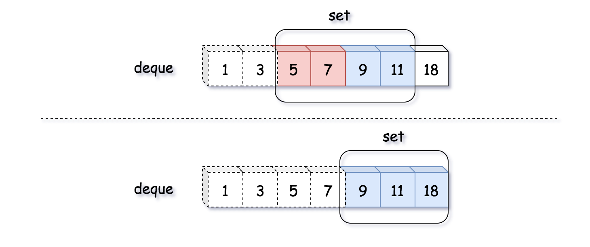
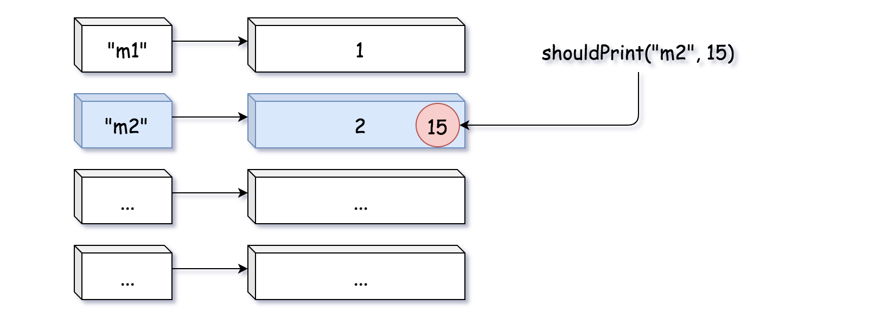

359. Logger Rate Limiter

Design a logger system that receive stream of messages along with its timestamps, each message should be printed if and only if it is **not printed in the last 10 seconds**.

Given a message and a timestamp (in seconds granularity), return true if the message should be printed in the given timestamp, otherwise returns false.

It is possible that several messages arrive roughly at the same time.

**Example:**
```
Logger logger = new Logger();

// logging string "foo" at timestamp 1
logger.shouldPrintMessage(1, "foo"); returns true; 

// logging string "bar" at timestamp 2
logger.shouldPrintMessage(2,"bar"); returns true;

// logging string "foo" at timestamp 3
logger.shouldPrintMessage(3,"foo"); returns false;

// logging string "bar" at timestamp 8
logger.shouldPrintMessage(8,"bar"); returns false;

// logging string "foo" at timestamp 10
logger.shouldPrintMessage(10,"foo"); returns false;

// logging string "foo" at timestamp 11
logger.shouldPrintMessage(11,"foo"); returns true;
```

# Solution
---
## Approach 1: Queue + Set
**Intuition**

Before we tackle the problem, it is imperative to clarify the conditions of the problem, since it was not explicit in the problem description. Here is one important note:

>It is possible that several messages arrive roughly at the same time.

We could interpret that the input messages are in chronological order, i.e. the timestamps of the messages are monotonically increasing, though not strictly. This constraint is critical, since it would simplify the task, as one will see in the following solutions.

As a first solution, let us build a solution intuitively following the tasks described in the problem.

>We keep the incoming messages in a **queue**. In addition, to accelerate the check of duplicates, we use a set data structure to index the messages.



As one see can from the above example where the number indicates the timestamp of each message, the arrival of the message with the timestamp `18` would invalidate both the messages with the timestamp of `5` and `7` which go beyond the time window of 10 seconds.

**Algorithm**

* First of all, we use a queue as a sort of sliding window to keep all the printable messages in certain time frame (10 seconds).

* At the arrival of each incoming message, it comes with a `timestamp`. This timestamp implies the evolution of the sliding windows. Therefore, we should first invalidate those expired messages in our queue.

* Since the `queue` and `set` data structures should be in sync with each other, we would also remove those expired messages from our message set.

* After the updates of our message queue and set, we then simply check if there is any duplicate for the new incoming message. If not, we add the message to the queue as well as the set.

```python
from collections import deque

class Logger(object):

    def __init__(self):
        """
        Initialize your data structure here.
        """
        self._msg_set = set()
        self._msg_queue = deque()
    
    def shouldPrintMessage(self, timestamp, message):
        """
        Returns true if the message should be printed in the given timestamp, otherwise returns false.
        """
        while self._msg_queue:
            msg, ts = self._msg_queue[0]
            if timestamp - ts >= 10:
                self._msg_queue.popleft()
                self._msg_set.remove(msg)
            else:
                break
        
        if message not in self._msg_set:
            self._msg_set.add(message)
            self._msg_queue.append((message, timestamp))
            return True
        else:
            return False
```

As one can see, the usage of set data structure is not absolutely necessary. One could simply iterate the message queue to check if there is any duplicate.

Another important note is that if the messages are not chronologically ordered then we would have to iterate through the entire queue to remove the expired messages, rather than having early stopping. Or one could use some sorted queue such as **Priority Queue** to keep the messages.

**Complexity Analysis**

* Time Complexity: $\mathcal{O}(N)$ where $N$ is the size of the queue. In the worst case, all the messages in the queue become obsolete. As a result, we need clean them up.

* Space Complexity: $\mathcal{O}(N)$ where $N$ is the size of the queue. We keep the incoming messages in both the queue and set. The upper bound of the required space would be 2N2N, if we have no duplicate at all.

## Approach 2: Hashtable / Dictionary
**Intuition**

One could combine the queue and set data structure into a hashtable or dictionary, which gives us the capacity of keeping all unique messages as of queue as well as the capacity to quickly evaluate the duplication of messages as of set.

>The idea is that we keep a hashtable/dictionary with the message as key, and its timestamp as the value. The hashtable keeps all the unique messages along with the latest timestamp that the message was printed.



As one can see from the above example, there is an entry in the hashtable with the message `m2` and the timestamp `2`. Then there comes another message `m2` with the timestamp `15`. Since the message was printed `13` seconds before (i.e. beyond the buffer window), it is therefore eligible to print again the message. As a result, the timestamp of the message `m2` would be updated to `15`.

**Algorithm**

* We initialize a hashtable/dictionary to keep the messages along with the timestamp.

* At the arrival of a new message, the message is eligible to be printed with either of the two conditions as follows:

    * case 1). we have never seen the message before.

    * case 2). we have seen the message before, and it was printed more than 10 seconds ago.

* In both of the above cases, we would then update the entry that is associated with the message in the hashtable, with the latest timestamp.

```python
class Logger(object):

    def __init__(self):
        """
        Initialize your data structure here.
        """
        self._msg_dict = {}
    
    def shouldPrintMessage(self, timestamp, message):
        """
        Returns true if the message should be printed in the given timestamp, otherwise returns false.
        """
        if message not in self._msg_dict:
            # case 1). add the message to print
            self._msg_dict[message] = timestamp
            return True

        if timestamp - self._msg_dict[message] >= 10:
            # case 2). update the timestamp of the message
            self._msg_dict[message] = timestamp
            return True
        else:
            return False
```

Note: for clarity, we separate the two cases into two blocks. One could combine the two blocks together to have a more concise solution.

The main difference between this approach with hashtable and the previous approach with queue is that in previous approach we do proactive cleaning, i.e. at each invocation of function, we first remove those expired messages.

While in this approach, we keep all the messages even when they are expired. This characteristics might become problematic, since the usage of memory would keep on growing over the time. Sometimes it might be more desirable to have the garbage collection property of the previous approach.

**Complexity Analysis**

* Time Complexity: $\mathcal{O}(1)$. The lookup and update of the hashtable takes a constant time.

* Space Complexity: $\mathcal{O}(M)$ where MM is the size of all incoming messages. Over the time, the hashtable would have an entry for each unique message that has appeared.

# Submissions
---
**Solution 1: (Hash Table)**
```
Runtime: 152 ms
Memory Usage: 19.7 MB
```
```python
class Logger:

    def __init__(self):
        """
        Initialize your data structure here.
        """
        self.d = {}
        

    def shouldPrintMessage(self, timestamp: int, message: str) -> bool:
        """
        Returns true if the message should be printed in the given timestamp, otherwise returns false.
        If this method returns false, the message will not be printed.
        The timestamp is in seconds granularity.
        """
        if message not in self.d or timestamp - self.d[message] >= 10:
            self.d[message] = timestamp
            return True
        else:
            return False

# Your Logger object will be instantiated and called as such:
# obj = Logger()
# param_1 = obj.shouldPrintMessage(timestamp,message)
```

**Solution 2: (Hash Table)**
```
Runtime: 148 ms
Memory Usage: 32.8 MB
```
```c++
class Logger {
public:
    unordered_map<string, int> map;
    /** Initialize your data structure here. */
    Logger() {
        
    }
    
    /** Returns true if the message should be printed in the given timestamp, otherwise returns false.
        If this method returns false, the message will not be printed.
        The timestamp is in seconds granularity. */
    bool shouldPrintMessage(int timestamp, string message) {
        if(map.find(message)!=map.end()) {
            if(timestamp-map[message]<10) 
                return false;
        }
        map[message]=timestamp;
        return true;
    }
};

/**
 * Your Logger object will be instantiated and called as such:
 * Logger* obj = new Logger();
 * bool param_1 = obj->shouldPrintMessage(timestamp,message);
 */
```
