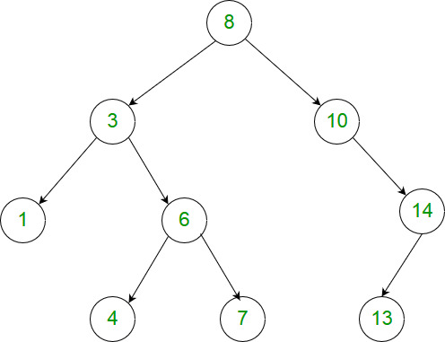

1026. Maximum Difference Between Node and Ancestor

Given the root of a binary tree, find the maximum value `V` for which there exists **different** nodes `A` and `B` where `V = |A.val - B.val|` and `A` is an ancestor of `B`.

(A node `A` is an ancestor of `B` if either: any child of `A` is equal to `B`, or any child of `A` is an ancestor of `B`.)

 

**Example 1:**


```
Input: [8,3,10,1,6,null,14,null,null,4,7,13]
Output: 7
Explanation: 
We have various ancestor-node differences, some of which are given below :
|8 - 3| = 5
|3 - 7| = 4
|8 - 1| = 7
|10 - 13| = 3
Among all possible differences, the maximum value of 7 is obtained by |8 - 1| = 7.
```

**Note:**

* The number of nodes in the tree is between `2` and `5000`.
* Each node will have value between `0` and `100000`.

# Submissions
---
**Solution 1: (Recursion, Preorder with current max and min as parameter)**
```
Runtime: 40 ms
Memory Usage: 20.4 MB
```
```python
# Definition for a binary tree node.
# class TreeNode:
#     def __init__(self, val=0, left=None, right=None):
#         self.val = val
#         self.left = left
#         self.right = right
class Solution:
    def maxAncestorDiff(self, root: TreeNode) -> int:
        if not root:
            return 0
        # record the required maximum difference
        self.result = 0

        def helper(node, cur_max, cur_min):
            if not node:
                return
            # update `result`
            self.result = max(self.result, abs(cur_max-node.val),
                              abs(cur_min-node.val))
            # update the max and min
            cur_max = max(cur_max, node.val)
            cur_min = min(cur_min, node.val)
            helper(node.left, cur_max, cur_min)
            helper(node.right, cur_max, cur_min)

        helper(root, root.val, root.val)
        return self.result
```

**Solution 2: (Maximum Minus Minimum, Postorder with current max and min as parameter and return as answer)**
```
Runtime: 32 ms
Memory Usage: 20.4 MB
```
```python
# Definition for a binary tree node.
# class TreeNode:
#     def __init__(self, val=0, left=None, right=None):
#         self.val = val
#         self.left = left
#         self.right = right
class Solution:
    def maxAncestorDiff(self, root: TreeNode) -> int:
        if not root:
            return 0

        def helper(node, cur_max, cur_min):
            # if encounter leaves, return the max-min along the path
            if not node:
                return cur_max - cur_min
            # else, update max and min
            # and return the max of left and right subtrees
            cur_max = max(cur_max, node.val)
            cur_min = min(cur_min, node.val)
            left = helper(node.left, cur_max, cur_min)
            right = helper(node.right, cur_max, cur_min)
            return max(left, right)

        return helper(root, root.val, root.val)
```

**Solution 3: (DFS, Postorder with current min and max as parameter and return as answer)**
```
Runtime: 28 ms
Memory Usage: 18.9 MB
```
```python
# Definition for a binary tree node.
# class TreeNode:
#     def __init__(self, x):
#         self.val = x
#         self.left = None
#         self.right = None

class Solution:
    def maxAncestorDiff(self, root: TreeNode) -> int:
        def dfs(node, minVal, maxVal):
            if not node:
                return 0

            maxDiff = max(abs(node.val - minVal), abs(node.val - maxVal))
            minVal = min(minVal, node.val)
            maxVal = max(maxVal, node.val)
            left_maxDiff = dfs(node.left, minVal, maxVal)
            right_maxDiff = dfs(node.right, minVal, maxVal)

            return max(maxDiff, left_maxDiff, right_maxDiff)
        
        return dfs(root, root.val, root.val)
```

**Solution 4: (DFS, PostOrder with return current max and min of subtree)**
```
Runtime: 40 ms
Memory Usage: 20.4 MB
```
```python
# Definition for a binary tree node.
# class TreeNode:
#     def __init__(self, val=0, left=None, right=None):
#         self.val = val
#         self.left = left
#         self.right = right
class Solution:
    def maxAncestorDiff(self, root: TreeNode) -> int:
        ans = 0
        
        def dfs(node):
            nonlocal ans
            if not node:
                return float('-inf'), float('inf')
            left_max, left_min = dfs(node.left)
            right_max, right_min = dfs(node.right)
            if left_max != float('-inf'):
                ans = max(ans, abs(node.val-left_max), abs(node.val-left_min))
            if right_max != float('-inf'):
                ans = max(ans, abs(node.val-right_max), abs(node.val-right_min))
            return max(left_max, right_max, node.val), min(left_min, right_min, node.val)
            
        dfs(root)
        return ans
```