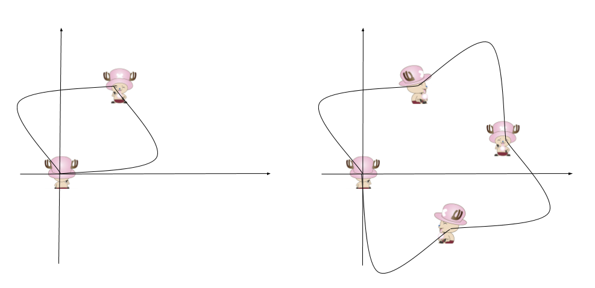

1041. Robot Bounded In Circle

On an infinite plane, a robot initially stands at `(0, 0)` and faces north.  The robot can receive one of three instructions:

* `"G"`: go straight 1 unit;
* `"L"`: turn 90 degrees to the left;
* `"R"`: turn 90 degress to the right.

The robot performs the `instructions` given in order, and repeats them forever.

Return `true` if and only if there exists a circle in the plane such that the robot never leaves the circle.

 

**Example 1:**
```
Input: "GGLLGG"
Output: true
Explanation: 
The robot moves from (0,0) to (0,2), turns 180 degrees, and then returns to (0,0).
When repeating these instructions, the robot remains in the circle of radius 2 centered at the origin.
```

**Example 2:**
```
Input: "GG"
Output: false
Explanation: 
The robot moves north indefinitely.
```

**Example 3:**
```
Input: "GL"
Output: true
Explanation: 
The robot moves from (0, 0) -> (0, 1) -> (-1, 1) -> (-1, 0) -> (0, 0) -> ...
```

**Note:**

* `1 <= instructions.length <= 100`
* `instructions[i] is in {'G', 'L', 'R'}`

# Submissions
---
**Solution 1:**
```
Runtime: 28 ms
Memory Usage: 12.7 MB
```
```python
class Solution:
    def isRobotBounded(self, instructions: str) -> bool:
        # directions -> North, East, South, West -> i.e Up -> Right -> Down -> Left
        # clockwise sequence for right direction
        directions = [(0,1), (1,0), (0,-1), (-1,0)] 
        x = y = 0
        #we face towards north intially as specified in problem
        curr_dir = 0 
        for instr in instructions:
            if instr == 'G':
                x += directions[curr_dir][0]
                y += directions[curr_dir][1]
            elif instr == 'L':
                curr_dir = (curr_dir - 1) % 4 # counter clockwise
            else:
                curr_dir = (curr_dir + 1) % 4 # clockwise
            
        return (x,y) == (0,0) or directions[curr_dir] != (0,1) 
```

**Solution 2:**



**Intuition**
Let chopper help explain.

Starting at the origin and face north (0,1),
after one sequence of instructions,

1. if chopper return to the origin, he's in an obvious circle.
1. if chopper finishes with face not towards north,
it will get back to the initial status in another one or three sequences.

**Explanation**
```
(x,y) is the location of chopper.
d[i] is the direction he is facing.
i = (i + 1) % 4 will turn right
i = (i + 3) % 4 will turn left
Check the final status after instructions.
```

**Complexity**

* Time $O(N)$
* Space $O(1)$


```
Runtime: 28 ms
Memory Usage: 12.7 MB
```
```python
class Solution:
    def isRobotBounded(self, instructions: str) -> bool:
        x, y, dx, dy = 0, 0, 0, 1
        for i in instructions:
            if i == 'R': dx, dy = dy, -dx
            if i == 'L': dx, dy = -dy, dx
            if i == 'G': x, y = x + dx, y + dy
        return (x, y) == (0, 0) or (dx, dy) != (0,1)
```