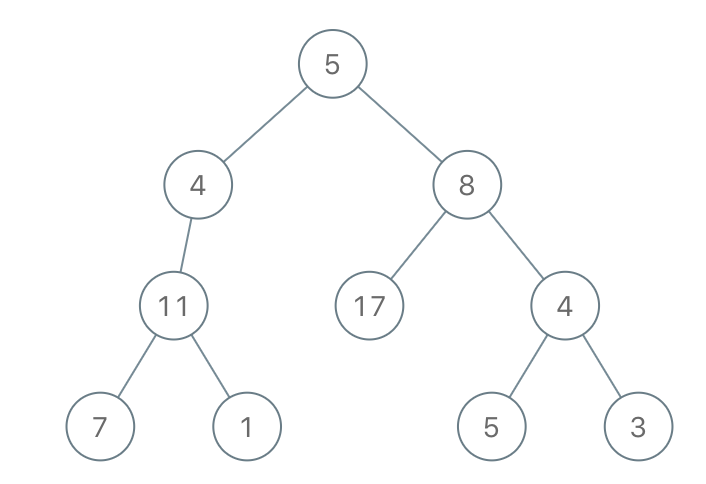
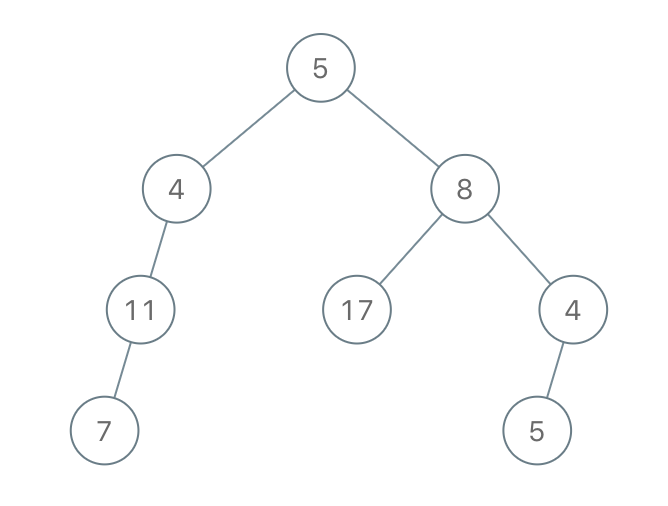
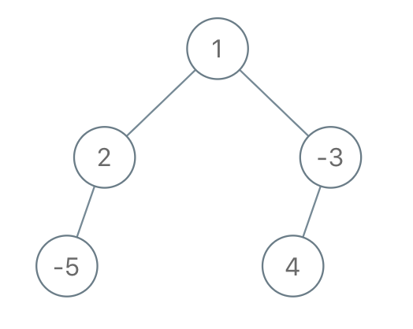

1080. Insufficient Nodes in Root to Leaf Paths

Given the `root` of a binary tree, consider all root to leaf paths: paths from the root to any leaf.  (A leaf is a node with no children.)

A `node` is insufficient if **every** such root to leaf path intersecting this `node` has sum strictly less than `limit`.

Delete all insufficient nodes simultaneously, and return the root of the resulting binary tree.

 

**Example 1:**


```
Input: root = [1,2,3,4,-99,-99,7,8,9,-99,-99,12,13,-99,14], limit = 1
```

```
Output: [1,2,3,4,null,null,7,8,9,null,14]
```

**Example 2:**


```
Input: root = [5,4,8,11,null,17,4,7,1,null,null,5,3], limit = 22
```

```
Output: [5,4,8,11,null,17,4,7,null,null,null,5]
```

**Example 3:**


```
Input: root = [1,2,-3,-5,null,4,null], limit = -1
```

```
Output: [1,null,-3,4]
```

**Note:**

* The given tree will have between `1` and `5000` nodes.
* `-10^5 <= node.val <= 10^5`
* `-10^9 <= limit <= 10^9`

# Submissions
---
**Solution 1:**
```
Runtime: 84 ms
Memory Usage: 14.2 MB
```
```python
# Definition for a binary tree node.
# class TreeNode:
#     def __init__(self, x):
#         self.val = x
#         self.left = None
#         self.right = None

class Solution:
    def sufficientSubset(self, root: TreeNode, limit: int) -> TreeNode:
        # When we arrive at a leaf, we check if the sum accumulated is equal to that node's value
        # In case it is not, we return None to signal this node will be out of the resulting tree
        if not root.left and not root.right:
            if root.val < limit:
                return None
            else:
                return root
        
        # We traverse the tree left and right, effectively solving the problem for the subtree 
        if root.left:
            root.left = self.sufficientSubset(root.left, limit - root.val)
        
        if root.right:
            root.right = self.sufficientSubset(root.right, limit - root.val)
        
        # If, after solving the subproblems for left and right subtrees we realise that both paths have been cut out, it means our node is also insufficient and should be cut out.
        if not root.left and not root.right:
            return None
        
        #Otherwise our node shall be preserved
        return root
```