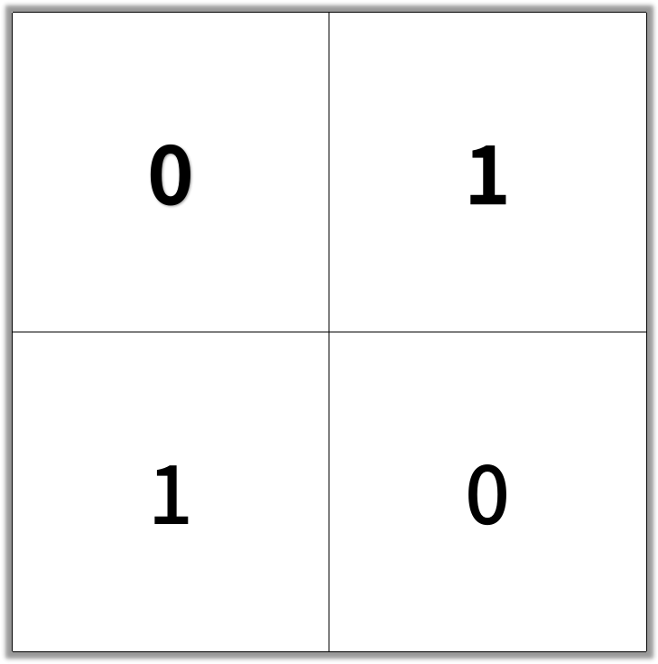
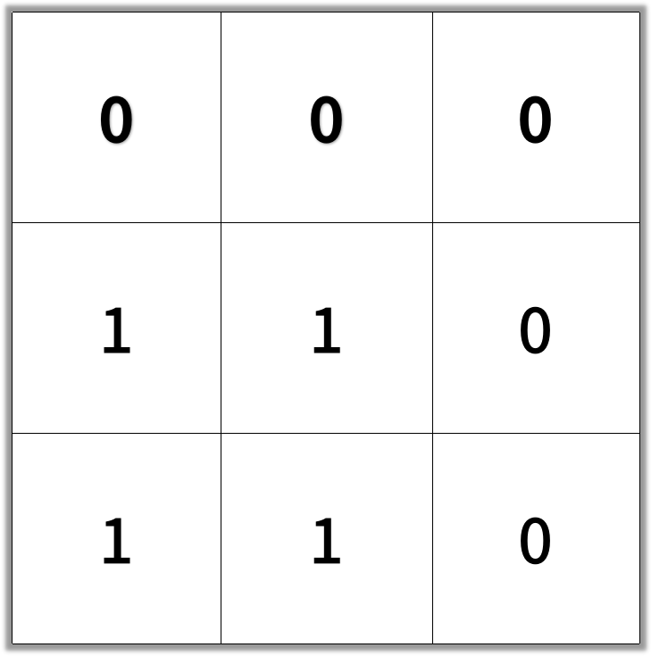

1091. Shortest Path in Binary Matrix

In an N by N square grid, each cell is either empty (`0`) or blocked (`1`).

A clear path from top-left to bottom-right has length `k` if and only if it is composed of cells `C_1, C_2, ..., C_k` such that:

* Adjacent cells `C_i` and `C_{i+1}` are connected 8-directionally (ie., they are different and share an edge or corner)
* `C_1` is at location `(0, 0)` (ie. has value `grid[0][0]`)
* `C_k` is at location `(N-1, N-1)` (ie. has value `grid[N-1][N-1]`)
* If `C_i` is located at `(r, c)`, then `grid[r][c]` is empty (ie. `grid[r][c] == 0`).

Return the length of the shortest such clear path from top-left to bottom-right.  If such a path does not exist, return `-1`.

 

**Example 1:**
```
Input: [[0,1],[1,0]]
```

```
Output: 2
```


**Example 2:**
```
Input: [[0,0,0],[1,1,0],[1,1,0]]
```

```
Output: 4
```


**Note:**

* `1 <= grid.length == grid[0].length <= 100`
* `grid[r][c]` is `0` or `1`

# Submissions
---
**Solution 1: (BFS)**
```
Runtime: 752 ms
Memory Usage: 13.2 MB
```
```python
class Solution:
    def shortestPathBinaryMatrix(self, grid: List[List[int]]) -> int:
        if len(grid) == 0 or len(grid[0]) == 0:
            return -1
        if grid[0][0] == 1 or grid[-1][-1] == 1:
            return -1  
        
        R, C = len(grid), len(grid[0])
        q = collections.deque([(0,0, 1)])
        grid[0][0] = 1
        
        def neighbours(r, c):
            for nr, nc in [(r-1, c-1), (r-1, c), (r-1, c+1), (r, c-1), (r, c+1), (r+1, c-1), (r+1, c), (r+1, c+1)]:
                if 0 <= nr < R and 0 <= nc < C:
                    yield nr, nc
                    
        while q:
            r, c, step = q.popleft()
            if r == R-1 and c == C-1:
                return step
            for nr, nc in neighbours(r, c):
                if not grid[nr][nc]:
                    grid[nr][nc] = 1
                    q.append((nr, nc, step+1))
        return -1
```