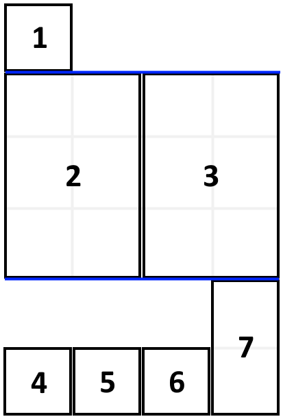

1105. Filling Bookcase Shelves

We have a sequence of `books`: the `i`-th book has thickness `books[i][0]` and height `books[i][1]`.

We want to place these books **in order** onto bookcase shelves that have total width shelf_width.

We choose some of the books to place on this shelf (such that the sum of their thickness is `<= shelf_width`), then build another level of shelf of the bookcase so that the total height of the bookcase has increased by the maximum height of the books we just put down.  We repeat this process until there are no more books to place.

Note again that at each step of the above process, the order of __the books we place is the same order as the given sequence of books__.  For example, if we have an ordered list of 5 books, we might place the first and second book onto the first shelf, the third book on the second shelf, and the fourth and fifth book on the last shelf.

Return the minimum possible height that the total bookshelf can be after placing shelves in this manner.

 

**Example 1:**



```
Input: books = [[1,1],[2,3],[2,3],[1,1],[1,1],[1,1],[1,2]], shelf_width = 4
Output: 6
Explanation:
The sum of the heights of the 3 shelves are 1 + 3 + 2 = 6.
Notice that book number 2 does not have to be on the first shelf.
```

**Constraints:**

1. `1 <= books.length <= 1000`
1. `1 <= books[i][0] <= shelf_width <= 1000`
1. `1 <= books[i][1] <= 1000`

# Submissions
---
**Solution 1: (DP Bottom-Up)**
```
Runtime: 52 ms
Memory Usage: 12.9 MB
```
```python
class Solution:
    def minHeightShelves(self, books: List[List[int]], shelf_width: int) -> int:
        dp = [float('inf') for _ in range(len(books))]
        for i in range(len(dp)):
            w=0
            h=0
            for j in range(i, len(books)):
                w += books[j][0]
                if w > shelf_width:
                    break
                h = max(h, books[j][1])
                dp[j] = min(dp[j], h if i == 0 else dp[i-1] + h)
        return dp[-1]
```

**Solution 2: (DP Top-Down)**
```
Runtime: 44 ms
Memory Usage: 15.1 MB
```
```python
class Solution:
    def minHeightShelves(self, books: List[List[int]], shelf_width: int) -> int:
        
        @lru_cache
        def shelf_height(index, remaining_width, last_height):
            if index >= len(books): return last_height
            book_width, book_height = books[index]
            if remaining_width - book_width >= 0:
                if last_height >= book_height:
                    return shelf_height(index + 1, remaining_width - book_width, last_height)
                else:
                    return min(
                        shelf_height(index + 1, remaining_width - book_width, book_height),
                        last_height + shelf_height(index + 1, shelf_width - book_width, book_height)
                    )
            else:
                return last_height + shelf_height(index + 1, shelf_width - book_width, book_height)

        return shelf_height(0, shelf_width, 0)
```

**Solution 3: (DP Top-Down)**
```
Runtime: 60 ms
Memory: 15.6 MB
```
```
class Solution:
    def minHeightShelves(self, books: List[List[int]], shelfWidth: int) -> int:
        N = len(books)
        
        @functools.lru_cache(None)
        def dp(i, w, h):
            if i == N:
                return h
            if w < books[i][0]:
                return h + dp(i+1, shelfWidth-books[i][0], books[i][1])
            return min(dp(i+1, w-books[i][0], max(h, books[i][1])), h + dp(i+1, shelfWidth-books[i][0], books[i][1]))
            
        return dp(0, shelfWidth, 0)
```
