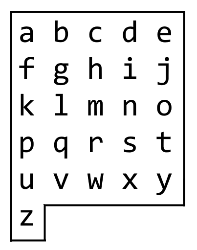

1138. Alphabet Board Path

On an alphabet `board`, we start at position `(0, 0)`, corresponding to character `board[0][0]`.

Here, `board = ["abcde", "fghij", "klmno", "pqrst", "uvwxy", "z"]`, as shown in the diagram below.



We may make the following moves:

* `'U'` moves our position up one row, if the position exists on the board;
* `'D'` moves our position down one row, if the position exists on the board;
* `'L'` moves our position left one column, if the position exists on the board;
* `'R'` moves our position right one column, if the position exists on the board;
* `'!'` adds the character `board[r][c]` at our current position `(r, c)` to the answer.

(Here, the only positions that exist on the board are positions with letters on them.)

Return a sequence of moves that makes our answer equal to `target` in the minimum number of moves.  You may return any path that does so.

 

**Example 1:**
```
Input: target = "leet"
Output: "DDR!UURRR!!DDD!"
```

**Example 2:**
```
Input: target = "code"
Output: "RR!DDRR!UUL!R!"
```

**Constraints:**

* `1 <= target.length <= 100`
* `target` consists only of English lowercase letters

# Submissions
---
**Solution 1:**
```
Runtime: 24 ms
Memory Usage: 12.7 MB
```
```python
class Solution:
    def alphabetBoardPath(self, target: str) -> str:
        C = 5
        prev_y, prev_x = 0, 0
        ans = ''
        for c in target:
            cur_y, cur_x = divmod(ord(c)-ord('a'), C)
            diff_x = cur_x - prev_x
            diff_y = cur_y - prev_y
            if diff_y < 0:
                ans += ('D' if diff_y > 0 else 'U' if diff_y < 0 else '') * abs(diff_y)
                ans += ('R' if diff_x > 0 else 'L' if diff_x < 0 else '') * abs(diff_x)
            else:
                ans += ('R' if diff_x > 0 else 'L' if diff_x < 0 else '') * abs(diff_x)
                ans += ('D' if diff_y > 0 else 'U' if diff_y < 0 else '') * abs(diff_y)
            ans += '!'
            prev_y, prev_x = cur_y, cur_x
        return ans
        
```