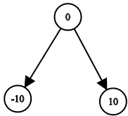

1214. Two Sum BSTs

Given two binary search trees, return `True` if and only if there is a node in the first tree and a node in the second tree whose values sum up to a given integer `target`.

**Example 1:**


```
Input: root1 = [2,1,4], root2 = [1,0,3], target = 5
Output: true
Explanation: 2 and 3 sum up to 5.
```

**Example 2:**



```
Input: root1 = [0,-10,10], root2 = [5,1,7,0,2], target = 18
Output: false
```

**Constraints:**

* Each tree has at most 5000 nodes.
* `-10^9 <= target`, `node.val <= 10^9`

# Submissions
---
**Solution 1:**
```
Runtime: 1372 ms
Memory Usage: 18.1 MB
```
```python
# Definition for a binary tree node.
# class TreeNode:
#     def __init__(self, x):
#         self.val = x
#         self.left = None
#         self.right = None

class Solution:
    def twoSumBSTs(self, root1: TreeNode, root2: TreeNode, target: int) -> bool:
        from functools import lru_cache
        @lru_cache()
        def dfs(n1, n2):
            if not n1 or not n2:
                return False
            if n1.val + n2.val < target:
                return dfs(n1.right, n2) or dfs(n1, n2.right)
            elif n1.val + n2.val > target:
                return dfs(n1.left, n2) or dfs(n1, n2.left)
            else:
                return True
        return dfs(root1, root2)
```

**Solution 2:**
```
Runtime: 520 ms
Memory Usage: 21.9 MB
```
```python
# Definition for a binary tree node.
# class TreeNode:
#     def __init__(self, x):
#         self.val = x
#         self.left = None
#         self.right = None

class Solution:
    def twoSumBSTs(self, root1: TreeNode, root2: TreeNode, target: int) -> bool:
        def dfs(node):
            return dfs(node.left) | dfs(node.right) | {node.val} if node else set()
        q1 = dfs(root1)
        return any(target - a in q1 for a in dfs(root2))
```