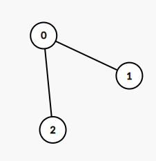

1245. Tree Diameter

Given an undirected tree, return its diameter: the number of **edges** in a longest path in that tree.

The tree is given as an array of edges where `edges[i] = [u, v]` is a bidirectional edge between nodes `u` and `v`.  Each node has labels in the set `{0, 1, ..., edges.length}`.

 

**Example 1:**



```
Input: edges = [[0,1],[0,2]]
Output: 2
Explanation: 
A longest path of the tree is the path 1 - 0 - 2.
```

**Example 2:**


```
Input: edges = [[0,1],[1,2],[2,3],[1,4],[4,5]]
Output: 4
Explanation: 
A longest path of the tree is the path 3 - 2 - 1 - 4 - 5.
```

**Constraints:**

* `0 <= edges.length < 10^4`
* `edges[i][0] != edges[i][1]`
* `0 <= edges[i][j] <= edges.length`
* The given edges form an undirected tree.

# Submissions
---
**Solution 1: (DFS)**
```
Runtime: 220 ms
Memory Usage: 18.8 MB
```
```python
class Solution:
    def treeDiameter(self, edges: List[List[int]]) -> int:
        def dfs(x,prev,length):  #do dfs from node x,update maxlength and end point.
            if len(graph[x]) == 1 and graph[x][0] == prev and length > res[0]:  #end point
                res[0] = length
                res[1] = x
            for y in graph[x]:
                if y != prev:  #since it is acyclic, thus just avoid x->y->x will avoid duplicate visit.
                    dfs(y, x, length + 1)
        
        graph = collections.defaultdict(list)
        for x,y in edges:
            graph[x].append(y)
            graph[y].append(x)
        res = [0, None]  #[maxlen,endNode]
        dfs(edges[0][0], None, 0)
        dfs(res[1], None, 0)
        return res[0]
```