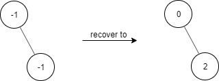

1261. Find Elements in a Contaminated Binary Tree

Given a binary tree with the following rules:

* `root.val == 0`
* If `treeNode.val == x` and `treeNode.left != null`, then `treeNode.left.val == 2 * x + 1`
* If `treeNode.val == x` and `treeNode.right != null`, then `treeNode.right.val == 2 * x + 2`

Now the binary tree is contaminated, which means all `treeNode.val` have been changed to `-1`.

You need to first recover the binary tree and then implement the FindElements class:

`FindElements(TreeNode* root)` Initializes the object with a contamined binary tree, you need to recover it first.
`bool find(int target)` Return if the target value exists in the recovered binary tree.
 
**Example 1:**



```
nput
["FindElements","find","find"]
[[[-1,null,-1]],[1],[2]]
Output
[null,false,true]
Explanation
FindElements findElements = new FindElements([-1,null,-1]); 
findElements.find(1); // return False 
findElements.find(2); // return True 
```

**Example 2:**


```
Input
["FindElements","find","find","find"]
[[[-1,-1,-1,-1,-1]],[1],[3],[5]]
Output
[null,true,true,false]
Explanation
FindElements findElements = new FindElements([-1,-1,-1,-1,-1]);
findElements.find(1); // return True
findElements.find(3); // return True
findElements.find(5); // return False
```

**Example 3:**


```
Input
["FindElements","find","find","find","find"]
[[[-1,null,-1,-1,null,-1]],[2],[3],[4],[5]]
Output
[null,true,false,false,true]
Explanation
FindElements findElements = new FindElements([-1,null,-1,-1,null,-1]);
findElements.find(2); // return True
findElements.find(3); // return False
findElements.find(4); // return False
findElements.find(5); // return True
```

**Constraints:**

* `TreeNode.val == -1`
* The height of the binary tree is less than or equal to `20`
* The total number of nodes is between `[1, 10^4]`
* Total calls of find() is between `[1, 10^4]`
* `0 <= target <= 10^6`

# Submissions
---
**Solution 1: (DFS)**
```
Runtime: 104 ms
Memory Usage: 17.7 MB
```
```python
# Definition for a binary tree node.
# class TreeNode:
#     def __init__(self, x):
#         self.val = x
#         self.left = None
#         self.right = None

class FindElements:

    def __init__(self, root: TreeNode):
        self.seen = set()
        
        def dfs(node: TreeNode, v: int) -> None:
            if node:
                node.val = v    
                self.seen.add(v)
                dfs(node.left, 2 * v + 1)
                dfs(node.right, 2 * v + 2)
            
        dfs(root, 0)

    def find(self, target: int) -> bool:
        return target in self.seen


# Your FindElements object will be instantiated and called as such:
# obj = FindElements(root)
# param_1 = obj.find(target)
```

**Solution 2: (DFS)**
```
Runtime: 8 ms, Beats 73.64%
Memory: 27.08 MB, Beats 83.93%
```
```c++
/**
 * Definition for a binary tree node.
 * struct TreeNode {
 *     int val;
 *     TreeNode *left;
 *     TreeNode *right;
 *     TreeNode() : val(0), left(nullptr), right(nullptr) {}
 *     TreeNode(int x) : val(x), left(nullptr), right(nullptr) {}
 *     TreeNode(int x, TreeNode *left, TreeNode *right) : val(x), left(left), right(right) {}
 * };
 */
class FindElements {
    unordered_set<int> visited;
public:
    FindElements(TreeNode* root) {
        TreeNode *cur;
        stack<TreeNode*> stk;
        root->val = 0;
        stk.push(root);
        while (stk.size()) {
            cur = stk.top();
            stk.pop();
            visited.insert(cur->val);
            if (cur->right) {
                cur->right->val = cur->val*2 + 2;
                stk.push(cur->right);
            }
            if (cur->left) {
                cur->left->val = cur->val*2 + 1;
                stk.push(cur->left);
            }
        }
    }
    
    bool find(int target) {
        return visited.count(target);
    }
};

/**
 * Your FindElements object will be instantiated and called as such:
 * FindElements* obj = new FindElements(root);
 * bool param_1 = obj->find(target);
 */
```
