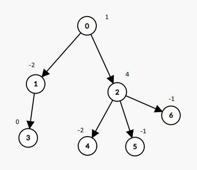

1273. Delete Tree Nodes

A tree rooted at node 0 is given as follows:

* The number of nodes is `nodes`;
* The value of the `i`-th node is `value[i]`;
* The parent of the `i`-th node is `parent[i]`.

Remove every subtree whose sum of values of nodes is zero.

After doing so, return the number of nodes remaining in the tree.

 

**Example 1:**



```
Input: nodes = 7, parent = [-1,0,0,1,2,2,2], value = [1,-2,4,0,-2,-1,-1]
Output: 2
```

**Constraints:**

* `1 <= nodes <= 10^4`
* `-10^5 <= value[i] <= 10^5`
* `parent.length == nodes`
* `parent[0] == -1` which indicates that `0` is the root.

# Submissions
---
**Solution 1: (DFS)**
```
Runtime: 296 ms
Memory Usage: 38.3 MB
```
```python
class Solution:
    def deleteTreeNodes(self, nodes: int, parent: List[int], value: List[int]) -> int:
        sons = {i: set() for i in range(nodes)}
        for i, p in enumerate(parent):
            if i: sons[p].add(i)

        def dfs(x):
            total, count = value[x], 1
            for y in sons[x]:
                t, c = dfs(y)
                total += t
                count += c if t else 0
            return total, count if total else 0
        return dfs(0)[1]
```