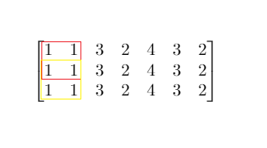

1292. Maximum Side Length of a Square with Sum Less than or Equal to Threshold

Given a `m x n` matrix `mat` and an integer `threshold`. Return the maximum side-length of a square with a sum less than or equal to `threshold` or return `0` if there is no such square.

 

**Example 1:**



```
Input: mat = [[1,1,3,2,4,3,2],[1,1,3,2,4,3,2],[1,1,3,2,4,3,2]], threshold = 4
Output: 2
Explanation: The maximum side length of square with sum less than 4 is 2 as shown.
```

**Example 2:**
```
Input: mat = [[2,2,2,2,2],[2,2,2,2,2],[2,2,2,2,2],[2,2,2,2,2],[2,2,2,2,2]], threshold = 1
Output: 0
```

**Example 3:**
```
Input: mat = [[1,1,1,1],[1,0,0,0],[1,0,0,0],[1,0,0,0]], threshold = 6
Output: 3
```

**Example 4:**
```
Input: mat = [[18,70],[61,1],[25,85],[14,40],[11,96],[97,96],[63,45]], threshold = 40184
Output: 2
```

**Constraints:**

* `1 <= m, n <= 300`
* `m == mat.length`
* `n == mat[i].length`
* `0 <= mat[i][j] <= 10000`
* `0 <= threshold <= 10^5`

# Submissions
---
**Solution 1: (prefix sum with binary search)**

Algorithm:
Build a `(m+1)x(n+1)` matrix of prefix sums of given matrix where `prefix[i][j] = sum(mat[:i][:j])`. And search for maximum `k` such that `sum(mat[i:i+k][j:j+k])` not exceeding threshold. Notice:

* `prefix[i+1][j+1] = prefix[i][j+1] + prefix[i+1][j] - prefix[i][j] + mat[i][j]`.
* `sum(mat[i:i+k][j:j+k]) = prefix[i+k][j+k] - prefix[i][j+k] - prefix[i+k][j] + prefix[i][j]`.

```
Runtime: 1112 ms
Memory Usage: 18.1 MB
```
```python
class Solution:
    def maxSideLength(self, mat: List[List[int]], threshold: int) -> int:
        m, n = len(mat), len(mat[0])
        #build prefix sum 
        prefix = [[0]*(n+1) for _ in range(m+1)]

        for i, j in itertools.product(range(m), range(n)):
            prefix[i+1][j+1] = prefix[i+1][j] + prefix[i][j+1] - prefix[i][j] + mat[i][j]

        def below(k): 
            """reture true if there is such a sub-matrix of length k"""
            for i, j in itertools.product(range(m+1-k), range(n+1-k)):
                if prefix[i+k][j+k] - prefix[i][j+k] - prefix[i+k][j] + prefix[i][j] <= threshold: return True
            return False 

        #binary search
        max_square = 0
        lo, hi = 1, min(m, n)
        while lo <= hi: 
            mi = lo + (hi - lo)//2
            if below(mi):
                max_square = max(max_square, mi)
                lo = mi + 1
            else:
                hi = mi - 1

        return max_square
```

**Solution 2: (Prefix Sum, Binary Search, upper bound)**

    mat = [[1,1,3,2,4,3,2],
           [1,1,3,2,4,3,2],
           [1,1,3,2,4,3,2]]
    dp
            0 0 0  0  0  0  0  0
            0 1 2  5  7 11 14 16
            0 2 4 10 14 22 28 32
            0 3 6

```
Runtime: 12 ms Beats, 68.68%
Memory: 32.73 MB, Beats 68.68%
```
```c++
class Solution {
public:
    int maxSideLength(vector<vector<int>>& mat, int threshold) {
        int m = mat.size(), n = mat[0].size(), i, j, left = 1, right = min(m, n), mid, ans = 0;
        vector<vector<int>> pre(m + 1, vector<int>(n + 1));
        bool flag;
        for (i = 0; i < m; i ++) {
            for (j = 0; j < n; j ++) {
                pre[i + 1][j + 1] = pre[i + 1][j] + pre[i][j + 1] - pre[i][j] + mat[i][j];
            }
        }
        while (left <= right) {
            mid = left + (right - left)/2;
            flag = false;
            for (i = 0; i <= m - mid; i ++) {
                for (j = 0; j <= n - mid; j ++) {
                    if (pre[i + mid][j + mid] - pre[i + mid][j] - pre[i][j + mid] + pre[i][j] <= threshold) {
                        flag = true;
                        break;
                    }
                }
                if (flag) {
                    break;
                }
            }
            if (!flag) {
                right = mid - 1;
            } else {
                ans = mid;
                left = mid + 1;
            }
        }
        return ans;
    }
};
```

**Solution 3: (Prefix Sum, Enumeration, O(min(M, N) + MN))**
```
Runtime: 6 ms, Beats 88.18%
Memory: 32.63 MB, Beats 78.18%
```
```c++
class Solution {
public:
    int maxSideLength(vector<vector<int>>& mat, int threshold) {
        int m = mat.size(), n = mat[0].size(), i, j, left = 1, right = min(m, n);
        vector<vector<int>> pre(m + 1, vector<int>(n + 1));
        bool flag;
        for (i = 0; i < m; i ++) {
            for (j = 0; j < n; j ++) {
                pre[i + 1][j + 1] = pre[i + 1][j] + pre[i][j + 1] - pre[i][j] + mat[i][j];
            }
        }
        for (i = 0; i < m; i ++) {
            for (j = 0; j < n; j ++) {
                while (left <= right && i + left <= m && j + left <= n && pre[i + left][j + left] - pre[i][j + left] - pre[i + left][j] + pre[i][j] <= threshold) {
                    left += 1;
                }
            }
        }
        return left - 1;
    }
};
```
