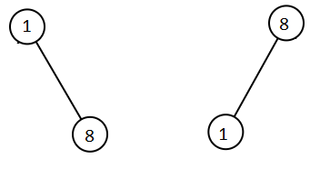

1305. All Elements in Two Binary Search Trees

Given two binary search trees `root1` and `root2`.

Return a list containing all the integers from both trees sorted in ascending order.

 

**Example 1:**


```
Input: root1 = [2,1,4], root2 = [1,0,3]
Output: [0,1,1,2,3,4]
```

**Example 2:**
```
Input: root1 = [0,-10,10], root2 = [5,1,7,0,2]
Output: [-10,0,0,1,2,5,7,10]
```

**Example 3:**
```
Input: root1 = [], root2 = [5,1,7,0,2]
Output: [0,1,2,5,7]
```

**Example 4:**
```
Input: root1 = [0,-10,10], root2 = []
Output: [-10,0,10]
```

**Example 5:**


```
Input: root1 = [1,null,8], root2 = [8,1]
Output: [1,1,8,8]
```

**Constraints:**

* Each tree has at most `5000` nodes.
* Each node's value is between `[-10^5, 10^5]`.

# Submissions
---
**Solution 1: (Tree, Sort, DFS)**
```
Runtime: 600 ms
Memory Usage: 20.5 MB
```
```python
# Definition for a binary tree node.
# class TreeNode:
#     def __init__(self, x):
#         self.val = x
#         self.left = None
#         self.right = None

class Solution:
    def getAllElements(self, root1: TreeNode, root2: TreeNode) -> List[int]:
        def dfs(root):
            if not root: return []
            return dfs(root.left) + [root.val] + dfs(root.right)
        
        nums1, nums2 = dfs(root1), dfs(root2)
        i = j = 0
        ans = []
        
        while i < len(nums1) and j < len(nums2):
            if nums1[i] <= nums2[j]:
                ans.append(nums1[i])
                i += 1
            else:
                ans.append(nums2[j])
                j += 1
                
        return ans + (nums1[i:] if i < len(nums1) else nums2[j:])
```

**Solution 2: (Recursive Inorder Traversal + Sort, Linearithmic Time)**
```
Runtime: 621 ms
Memory Usage: 22.8 MB
```
```python
# Definition for a binary tree node.
# class TreeNode:
#     def __init__(self, val=0, left=None, right=None):
#         self.val = val
#         self.left = left
#         self.right = right
class Solution:
    def getAllElements(self, root1: TreeNode, root2: TreeNode) -> List[int]:
        def inorder(r: TreeNode):
            return inorder(r.left) + [r.val] + inorder(r.right) if r else []
        return sorted(inorder(root1) + inorder(root2))
```

**Solution 3: (Iterative Inorder Traversal, One Pass, Linear Time)**
```
Runtime: 474 ms
Memory Usage: 18 MB
```
```python
# Definition for a binary tree node.
# class TreeNode:
#     def __init__(self, val=0, left=None, right=None):
#         self.val = val
#         self.left = left
#         self.right = right
class Solution:
    def getAllElements(self, root1: TreeNode, root2: TreeNode) -> List[int]:
        stack1, stack2, output = [], [], []
        
        while root1 or root2 or stack1 or stack2:
            # update both stacks
            # by going left till possible
            while root1:
                stack1.append(root1)
                root1 = root1.left
            while root2:
                stack2.append(root2)
                root2 = root2.left

            # Add the smallest value into output,
            # pop it from the stack,
            # and then do one step right
            if not stack2 or stack1 and stack1[-1].val <= stack2[-1].val:
                root1 = stack1.pop()
                output.append(root1.val)
                root1 = root1.right
            else:
                root2 = stack2.pop()
                output.append(root2.val)   
                root2 = root2.right

        return output
```
