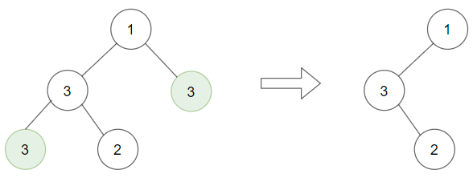

1325. Delete Leaves With a Given Value

Given a binary tree `root` and an integer `target`, delete all the leaf nodes with value `target`.

Note that once you delete a leaf node with value target, if it's parent node becomes a leaf node and has the value target, it should also be deleted (you need to continue doing that until you can't).

 

**Example 1:**


```
Input: root = [1,2,3,2,null,2,4], target = 2
Output: [1,null,3,null,4]
Explanation: Leaf nodes in green with value (target = 2) are removed (Picture in left). 
After removing, new nodes become leaf nodes with value (target = 2) (Picture in center).
```

**Example 2:**


```
Input: root = [1,3,3,3,2], target = 3
Output: [1,3,null,null,2]
```

**Example 3:**


```
Input: root = [1,2,null,2,null,2], target = 2
Output: [1]
Explanation: Leaf nodes in green with value (target = 2) are removed at each step.
```

**Example 4:**
```
Input: root = [1,1,1], target = 1
Output: []
```

**Example 5:**
```
Input: root = [1,2,3], target = 1
Output: [1,2,3]
```

**Constraints:**

* `1 <= target <= 1000`
* Each tree has at most `3000` nodes.
* Each node's value is between `[1, 1000]`.

# Submissions
---
**Solution 1: (DFS)**
```
Runtime: 48 ms
Memory Usage: 13.2 MB
```
```python
# Definition for a binary tree node.
# class TreeNode:
#     def __init__(self, x):
#         self.val = x
#         self.left = None
#         self.right = None

class Solution:
    def removeLeafNodes(self, root: TreeNode, target: int) -> TreeNode:
        def dfs(node):
            if not node:
                return
            node.left, node.right = dfs(node.left), dfs(node.right)
            if node.val == target and node.left == node.right:
                return None
            return node
        return dfs(root)
        
        
```