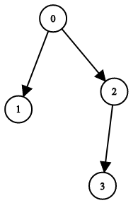

1361. Validate Binary Tree Nodes

You have `n` binary tree nodes numbered from `0` to `n - 1` where node `i` has two children `leftChild[i]` and `rightChild[i]`, return `true` if and only if all the given nodes form exactly one valid binary tree.

If node `i` has no left child then `leftChild[i]` will equal `-1`, similarly for the right child.

Note that the nodes have no values and that we only use the node numbers in this problem.

 

**Example 1:**


```
Input: n = 4, leftChild = [1,-1,3,-1], rightChild = [2,-1,-1,-1]
Output: true
```

**Example 2:**


```
Input: n = 4, leftChild = [1,-1,3,-1], rightChild = [2,3,-1,-1]
Output: false
```

**Example 3:**


```
Input: n = 2, leftChild = [1,0], rightChild = [-1,-1]
Output: false
```

**Example 4:**


```
Input: n = 6, leftChild = [1,-1,-1,4,-1,-1], rightChild = [2,-1,-1,5,-1,-1]
Output: false
```

**Constraints:**

* `1 <= n <= 10^4`
* `leftChild.length == rightChild.length == n`
* `-1 <= leftChild[i], rightChild[i] <= n - 1`

# Submissions
---
**Solution 1: (DFS)**
```
Runtime: 26 ms
Memory: 34.7 MB
```
```c++
class Solution {
    void dfs(int v, vector<bool> &visited, vector<int> &leftChild, vector<int> &rightChild) {
        visited[v] = true;
        if (leftChild[v] != -1) {
            dfs(leftChild[v], visited, leftChild, rightChild);
        }
        if (rightChild[v] != -1) {
            dfs(rightChild[v], visited, leftChild, rightChild);
        }
    }
public:
    bool validateBinaryTreeNodes(int n, vector<int>& leftChild, vector<int>& rightChild) {
        // every node have one parent
        vector<int> indeg(n);
        for (int i = 0; i < n; i ++) {
            if (leftChild[i] != -1) {
                indeg[leftChild[i]] += 1;
                if (indeg[leftChild[i]] > 1) {
                    return false;
                }
            }
            if (rightChild[i] != -1) {
                indeg[rightChild[i]] += 1;
                if (indeg[rightChild[i]] > 1) {
                    return false;
                }
            }
        }

        // single root
        int root = -1;
        for (int i = 0; i < n; i ++) {
            if (indeg[i] == 0) {
                if (root == -1) {
                    root = i;
                } else {
                    return false;
                }
            }
        }
        if (root == -1) {
            return false;
        }

        // filter invalid graph
        vector<bool> visited(n);
        dfs(root, visited, leftChild, rightChild);
        return all_of(visited.begin(), visited.end(), [](int v) {return v == true;});
    }
};
```

