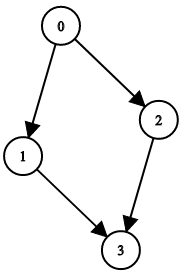
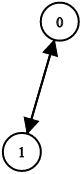

1361. Validate Binary Tree Nodes

You have `n` binary tree nodes numbered from `0` to `n - 1` where node `i` has two children `leftChild[i]` and `rightChild[i]`, return `true` if and only if all the given nodes form exactly one valid binary tree.

If node `i` has no left child then `leftChild[i]` will equal `-1`, similarly for the right child.

Note that the nodes have no values and that we only use the node numbers in this problem.

 

**Example 1:**


```
Input: n = 4, leftChild = [1,-1,3,-1], rightChild = [2,-1,-1,-1]
Output: true
```

**Example 2:**


```
Input: n = 4, leftChild = [1,-1,3,-1], rightChild = [2,3,-1,-1]
Output: false
```

**Example 3:**


```
Input: n = 2, leftChild = [1,0], rightChild = [-1,-1]
Output: false
```

**Example 4:**


```
Input: n = 6, leftChild = [1,-1,-1,4,-1,-1], rightChild = [2,-1,-1,5,-1,-1]
Output: false
```

**Constraints:**

* `1 <= n <= 10^4`
* `leftChild.length == rightChild.length == n`
* `-1 <= leftChild[i], rightChild[i] <= n - 1`

# Submissions
---
**Solution 1: (Math)**

* The total number of children should be `n - 1`.

    * If less, it means there are multiple trees.
    * If more than that, it means there is a cycle or one node is a child of multiple nodes.

```
Runtime: 288 ms
Memory Usage: 14.1 MB
```
```python
class Solution:
    def validateBinaryTreeNodes(self, n: int, leftChild: List[int], rightChild: List[int]) -> bool:
        children = 0
        for i in range(n):
            if leftChild[i] != -1:
                children += 1
            if rightChild[i] != -1:
                children += 1
        return children == n - 1
```