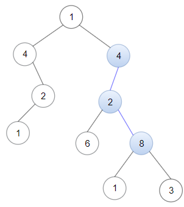

1367. Linked List in Binary Tree

Given a binary tree `root` and a linked list with `head` as the first node. 

Return `True` if all the elements in the linked list starting from the `head` correspond to some downward path connected in the binary tree otherwise return `False`.

In this context downward path means a path that starts at some node and goes downwards.

 

**Example 1:**


```
Input: head = [4,2,8], root = [1,4,4,null,2,2,null,1,null,6,8,null,null,null,null,1,3]
Output: true
Explanation: Nodes in blue form a subpath in the binary Tree.  
```

**Example 2:**


```
Input: head = [1,4,2,6], root = [1,4,4,null,2,2,null,1,null,6,8,null,null,null,null,1,3]
Output: true
```

**Example 3:**
```
Input: head = [1,4,2,6,8], root = [1,4,4,null,2,2,null,1,null,6,8,null,null,null,null,1,3]
Output: false
Explanation: There is no path in the binary tree that contains all the elements of the linked list from head.
```

**Constraints:**

* `1 <= node.val <= 100` for each node in the linked list and binary tree.
* The given linked list will contain between `1` and `100` nodes.
* The given binary tree will contain between `1` and `2500` nodes.

# Submissions
---
**Solution 1: (DFS)**

Time `O(N * min(L,H))`  
Space `O(H)`  
where `N` = tree size, `H` = tree height, `L` = list length.
```
Runtime: 132 ms
Memory Usage: 15.2 MB
```
```python
# Definition for singly-linked list.
# class ListNode:
#     def __init__(self, x):
#         self.val = x
#         self.next = None

# Definition for a binary tree node.
# class TreeNode:
#     def __init__(self, x):
#         self.val = x
#         self.left = None
#         self.right = None

class Solution:
    def isSubPath(self, head: ListNode, root: TreeNode) -> bool:
        def dfs(head, root):
            if not head: return True
            if not root: return False
            return root.val == head.val and (dfs(head.next, root.left) or dfs(head.next, root.right))
        if not head: return True
        if not root: return False
        return dfs(head, root) or self.isSubPath(head, root.left) or self.isSubPath(head, root.right)
```

**Solution 2: (DFS)**
```
Runtime: 24 ms
Memory Usage: 13.9 MB
```
```c
/**
 * Definition for singly-linked list.
 * struct ListNode {
 *     int val;
 *     struct ListNode *next;
 * };
 */
/**
 * Definition for a binary tree node.
 * struct TreeNode {
 *     int val;
 *     struct TreeNode *left;
 *     struct TreeNode *right;
 * };
 */

bool dfs(struct ListNode *head, struct TreeNode *root) {
    if (!head)
        return true;
    if (!root)
        return false;
    return head->val == root->val 
            && (dfs(head->next, root->left) || dfs(head->next, root->right));
}

bool isSubPath(struct ListNode* head, struct TreeNode* root){
    if (!headc
/**
 * Definition for singly-linked list.
 * struct ListNode {
 *     int val;
 *     struct ListNode *next;
 * };
 */
/**
 * Definition for a binary tree node.
 * struct TreeNode {
 *     int val;
 *     struct TreeNode *left;
 *     struct TreeNode *right;
 * };
 */

bool dfs(struct ListNode *head, struct TreeNode *root) {
    if (!head)
        return true;
    if (!root)
        return false;
    return head->val == root->val 
            && (dfs(head->next, root->left) || dfs(head->next, root->right));
}

bool isSubPath(struct ListNode* head, struct TreeNode* root){
    if (!head)
        return true;
    if (!root)
        return false;
    if (dfs(head, root) 
        || isSubPath(head, root->left) 
        || isSubPath(head, root->right))
        return true;
    return false;
}c
/**
 * Definition for singly-linked list.
 * struct ListNode {
 *     int val;
 *     struct ListNode *next;
 * };
 */
/**
 * Definition for a binary tree node.
 * struct TreeNode {
 *     int val;
 *     struct TreeNode *left;
 *     struct TreeNode *right;
 * };
 */

bool dfs(struct ListNode *head, struct TreeNode *root) {
    if (!head)
        return true;
    if (!root)
        return false;
    return head->val == root->val 
            && (dfs(head->next, root->left) || dfs(head->next, root->right));
}

bool isSubPath(struct ListNode* head, struct TreeNode* root){
    if (!head)
        return true;
    if (!root)
        return false;
    if (dfs(head, root) 
        || isSubPath(head, root->left) 
        || isSubPath(head, root->right))
        return true;
    return false;
}c
/**
 * Definition for singly-linked list.
 * struct ListNode {
 *     int val;
 *     struct ListNode *next;
 * };
 */
/**
 * Definition for a binary tree node.
 * struct TreeNode {
 *     int val;
 *     struct TreeNode *left;
 *     struct TreeNode *right;
 * };
 */

bool dfs(struct ListNode *head, struct TreeNode *root) {
    if (!head)
        return true;
    if (!root)
        return false;
    return head->val == root->val 
            && (dfs(head->next, root->left) || dfs(head->next, root->right));
}

bool isSubPath(struct ListNode* head, struct TreeNode* root){
    if (!head)
        return true;
    if (!root)
        return false;
    if (dfs(head, root) 
        || isSubPath(head, root->left) 
        || isSubPath(head, root->right))
        return true;
    return false;
}c
/**
 * Definition for singly-linked list.
 * struct ListNode {
 *     int val;
 *     struct ListNode *next;
 * };
 */
/**
 * Definition for a binary tree node.
 * struct TreeNode {
 *     int val;
 *     struct TreeNode *left;
 *     struct TreeNode *right;
 * };
 */

bool dfs(struct ListNode *head, struct TreeNode *root) {
    if (!head)
        return true;
    if (!root)
        return false;
    return head->val == root->val 
            && (dfs(head->next, root->left) || dfs(head->next, root->right));
}

bool isSubPath(struct ListNode* head, struct TreeNode* root){
    if (!head)
        return true;
    if (!root)
        return false;
    if (dfs(head, root) 
        || isSubPath(head, root->left) 
        || isSubPath(head, root->right))
        return true;
    return false;
}c
/**
 * Definition for singly-linked list.
 * struct ListNode {
 *     int val;
 *     struct ListNode *next;
 * };
 */
/**
 * Definition for a binary tree node.
 * struct TreeNode {
 *     int val;
 *     struct TreeNode *left;
 *     struct TreeNode *right;
 * };
 */

bool dfs(struct ListNode *head, struct TreeNode *root) {
    if (!head)
        return true;
    if (!root)
        return false;
    return head->val == root->val 
            && (dfs(head->next, root->left) || dfs(head->next, root->right));
}

bool isSubPath(struct ListNode* head, struct TreeNode* root){
    if (!head)
        return true;
    if (!root)
        return false;
    if (dfs(head, root) 
        || isSubPath(head, root->left) 
        || isSubPath(head, root->right))
        return true;
    return false;
}c
/**
 * Definition for singly-linked list.
 * struct ListNode {
 *     int val;
 *     struct ListNode *next;
 * };
 */
/**
 * Definition for a binary tree node.
 * struct TreeNode {
 *     int val;
 *     struct TreeNode *left;
 *     struct TreeNode *right;
 * };
 */

bool dfs(struct ListNode *head, struct TreeNode *root) {
    if (!head)
        return true;
    if (!root)
        return false;
    return head->val == root->val 
            && (dfs(head->next, root->left) || dfs(head->next, root->right));
}

bool isSubPath(struct ListNode* head, struct TreeNode* root){
    if (!head)
        return true;
    if (!root)
        return false;
    if (dfs(head, root) 
        || isSubPath(head, root->left) 
        || isSubPath(head, root->right))
        return true;
    return false;
}c
/**
 * Definition for singly-linked list.
 * struct ListNode {
 *     int val;
 *     struct ListNode *next;
 * };
 */
/**
 * Definition for a binary tree node.
 * struct TreeNode {
 *     int val;
 *     struct TreeNode *left;
 *     struct TreeNode *right;
 * };
 */

bool dfs(struct ListNode *head, struct TreeNode *root) {
    if (!head)
        return true;
    if (!root)
        return false;
    return head->val == root->val 
            && (dfs(head->next, root->left) || dfs(head->next, root->right));
}

bool isSubPath(struct ListNode* head, struct TreeNode* root){
    if (!head)
        return true;
    if (!root)
        return false;
    if (dfs(head, root) 
        || isSubPath(head, root->left) 
        || isSubPath(head, root->right))
        return true;
    return false;
}c
/**
 * Definition for singly-linked list.
 * struct ListNode {
 *     int val;
 *     struct ListNode *next;
 * };
 */
/**
 * Definition for a binary tree node.
 * struct TreeNode {
 *     int val;
 *     struct TreeNode *left;
 *     struct TreeNode *right;
 * };
 */

bool dfs(struct ListNode *head, struct TreeNode *root) {
    if (!head)
        return true;
    if (!root)
        return false;
    return head->val == root->val 
            && (dfs(head->next, root->left) || dfs(head->next, root->right));
}

bool isSubPath(struct ListNode* head, struct TreeNode* root){
    if (!head)
        return true;
    if (!root)
        return false;
    if (dfs(head, root) 
        || isSubPath(head, root->left) 
        || isSubPath(head, root->right))
        return true;
    return false;
}c
/**
 * Definition for singly-linked list.
 * struct ListNode {
 *     int val;
 *     struct ListNode *next;
 * };
 */
/**
 * Definition for a binary tree node.
 * struct TreeNode {
 *     int val;
 *     struct TreeNode *left;
 *     struct TreeNode *right;
 * };
 */

bool dfs(struct ListNode *head, struct TreeNode *root) {
    if (!head)
        return true;
    if (!root)
        return false;
    return head->val == root->val 
            && (dfs(head->next, root->left) || dfs(head->next, root->right));
}

bool isSubPath(struct ListNode* head, struct TreeNode* root){
    if (!head)
        return true;
    if (!root)
        return false;
    if (dfs(head, root) 
        || isSubPath(head, root->left) 
        || isSubPath(head, root->right))
        return true;
    return false;
}c
/**
 * Definition for singly-linked list.
 * struct ListNode {
 *     int val;
 *     struct ListNode *next;
 * };
 */
/**
 * Definition for a binary tree node.
 * struct TreeNode {
 *     int val;
 *     struct TreeNode *left;
 *     struct TreeNode *right;
 * };
 */

bool dfs(struct ListNode *head, struct TreeNode *root) {
    if (!head)
        return true;
    if (!root)
        return false;
    return head->val == root->val 
            && (dfs(head->next, root->left) || dfs(head->next, root->right));
}

bool isSubPath(struct ListNode* head, struct TreeNode* root){
    if (!head)
        return true;
    if (!root)
        return false;
    if (dfs(head, root) 
        || isSubPath(head, root->left) 
        || isSubPath(head, root->right))
        return true;
    return false;
}c
/**
 * Definition for singly-linked list.
 * struct ListNode {
 *     int val;
 *     struct ListNode *next;
 * };
 */
/**
 * Definition for a binary tree node.
 * struct TreeNode {
 *     int val;
 *     struct TreeNode *left;
 *     struct TreeNode *right;
 * };
 */

bool dfs(struct ListNode *head, struct TreeNode *root) {
    if (!head)
        return true;
    if (!root)
        return false;
    return head->val == root->val 
            && (dfs(head->next, root->left) || dfs(head->next, root->right));
}

bool isSubPath(struct ListNode* head, struct TreeNode* root){
    if (!head)
        return true;
    if (!root)
        return false;
    if (dfs(head, root) 
        || isSubPath(head, root->left) 
        || isSubPath(head, root->right))
        return true;
    return false;
}c
/**
 * Definition for singly-linked list.
 * struct ListNode {
 *     int val;
 *     struct ListNode *next;
 * };
 */
/**
 * Definition for a binary tree node.
 * struct TreeNode {
 *     int val;
 *     struct TreeNode *left;
 *     struct TreeNode *right;
 * };
 */

bool dfs(struct ListNode *head, struct TreeNode *root) {
    if (!head)
        return true;
    if (!root)
        return false;
    return head->val == root->val 
            && (dfs(head->next, root->left) || dfs(head->next, root->right));
}

bool isSubPath(struct ListNode* head, struct TreeNode* root){
    if (!head)
        return true;
    if (!root)
        return false;
    if (dfs(head, root) 
        || isSubPath(head, root->left) 
        || isSubPath(head, root->right))
        return true;
    return false;
}c
/**
 * Definition for singly-linked list.
 * struct ListNode {
 *     int val;
 *     struct ListNode *next;
 * };
 */
/**
 * Definition for a binary tree node.
 * struct TreeNode {
 *     int val;
 *     struct TreeNode *left;
 *     struct TreeNode *right;
 * };
 */

bool dfs(struct ListNode *head, struct TreeNode *root) {
    if (!head)
        return true;
    if (!root)
        return false;
    return head->val == root->val 
            && (dfs(head->next, root->left) || dfs(head->next, root->right));
}

bool isSubPath(struct ListNode* head, struct TreeNode* root){
    if (!head)
        return true;
    if (!root)
        return false;
    if (dfs(head, root) 
        || isSubPath(head, root->left) 
        || isSubPath(head, root->right))
        return true;
    return false;
}c
/**
 * Definition for singly-linked list.
 * struct ListNode {
 *     int val;
 *     struct ListNode *next;
 * };
 */
/**
 * Definition for a binary tree node.
 * struct TreeNode {
 *     int val;
 *     struct TreeNode *left;
 *     struct TreeNode *right;
 * };
 */

bool dfs(struct ListNode *head, struct TreeNode *root) {
    if (!head)
        return true;
    if (!root)
        return false;
    return head->val == root->val 
            && (dfs(head->next, root->left) || dfs(head->next, root->right));
}

bool isSubPath(struct ListNode* head, struct TreeNode* root){
    if (!head)
        return true;
    if (!root)
        return false;
    if (dfs(head, root) 
        || isSubPath(head, root->left) 
        || isSubPath(head, root->right))
        return true;
    return false;
}c
/**
 * Definition for singly-linked list.
 * struct ListNode {
 *     int val;
 *     struct ListNode *next;
 * };
 */
/**
 * Definition for a binary tree node.
 * struct TreeNode {
 *     int val;
 *     struct TreeNode *left;
 *     struct TreeNode *right;
 * };
 */

bool dfs(struct ListNode *head, struct TreeNode *root) {
    if (!head)
        return true;
    if (!root)
        return false;
    return head->val == root->val 
            && (dfs(head->next, root->left) || dfs(head->next, root->right));
}

bool isSubPath(struct ListNode* head, struct TreeNode* root){
    if (!head)
        return true;
    if (!root)
        return false;
    if (dfs(head, root) 
        || isSubPath(head, root->left) 
        || isSubPath(head, root->right))
        return true;
    return false;
}c
/**
 * Definition for singly-linked list.
 * struct ListNode {
 *     int val;
 *     struct ListNode *next;
 * };
 */
/**
 * Definition for a binary tree node.
 * struct TreeNode {
 *     int val;
 *     struct TreeNode *left;
 *     struct TreeNode *right;
 * };
 */

bool dfs(struct ListNode *head, struct TreeNode *root) {
    if (!head)
        return true;
    if (!root)
        return false;
    return head->val == root->val 
            && (dfs(head->next, root->left) || dfs(head->next, root->right));
}

bool isSubPath(struct ListNode* head, struct TreeNode* root){
    if (!head)
        return true;
    if (!root)
        return false;
    if (dfs(head, root) 
        || isSubPath(head, root->left) 
        || isSubPath(head, root->right))
        return true;
    return false;
}c
/**
 * Definition for singly-linked list.
 * struct ListNode {
 *     int val;
 *     struct ListNode *next;
 * };
 */
/**
 * Definition for a binary tree node.
 * struct TreeNode {
 *     int val;
 *     struct TreeNode *left;
 *     struct TreeNode *right;
 * };
 */

bool dfs(struct ListNode *head, struct TreeNode *root) {
    if (!head)
        return true;
    if (!root)
        return false;
    return head->val == root->val 
            && (dfs(head->next, root->left) || dfs(head->next, root->right));
}

bool isSubPath(struct ListNode* head, struct TreeNode* root){
    if (!head)
        return true;
    if (!root)
        return false;
    if (dfs(head, root) 
        || isSubPath(head, root->left) 
        || isSubPath(head, root->right))
        return true;
    return false;
}c
/**
 * Definition for singly-linked list.
 * struct ListNode {
 *     int val;
 *     struct ListNode *next;
 * };
 */
/**
 * Definition for a binary tree node.
 * struct TreeNode {
 *     int val;
 *     struct TreeNode *left;
 *     struct TreeNode *right;
 * };
 */

bool dfs(struct ListNode *head, struct TreeNode *root) {
    if (!head)
        return true;
    if (!root)
        return false;
    return head->val == root->val 
            && (dfs(head->next, root->left) || dfs(head->next, root->right));
}

bool isSubPath(struct ListNode* head, struct TreeNode* root){
    if (!head)
        return true;
    if (!root)
        return false;
    if (dfs(head, root) 
        || isSubPath(head, root->left) 
        || isSubPath(head, root->right))
        return true;
    return false;
}c
/**
 * Definition for singly-linked list.
 * struct ListNode {
 *     int val;
 *     struct ListNode *next;
 * };
 */
/**
 * Definition for a binary tree node.
 * struct TreeNode {
 *     int val;
 *     struct TreeNode *left;
 *     struct TreeNode *right;
 * };
 */

bool dfs(struct ListNode *head, struct TreeNode *root) {
    if (!head)
        return true;
    if (!root)
        return false;
    return head->val == root->val 
            && (dfs(head->next, root->left) || dfs(head->next, root->right));
}

bool isSubPath(struct ListNode* head, struct TreeNode* root){
    if (!head)
        return true;
    if (!root)
        return false;
    if (dfs(head, root) 
        || isSubPath(head, root->left) 
        || isSubPath(head, root->right))
        return true;
    return false;
}c
/**
 * Definition for singly-linked list.
 * struct ListNode {
 *     int val;
 *     struct ListNode *next;
 * };
 */
/**
 * Definition for a binary tree node.
 * struct TreeNode {
 *     int val;
 *     struct TreeNode *left;
 *     struct TreeNode *right;
 * };
 */

bool dfs(struct ListNode *head, struct TreeNode *root) {
    if (!head)
        return true;
    if (!root)
        return false;
    return head->val == root->val 
            && (dfs(head->next, root->left) || dfs(head->next, root->right));
}

bool isSubPath(struct ListNode* head, struct TreeNode* root){
    if (!head)
        return true;
    if (!root)
        return false;
    if (dfs(head, root) 
        || isSubPath(head, root->left) 
        || isSubPath(head, root->right))
        return true;
    return false;
}c
/**
 * Definition for singly-linked list.
 * struct ListNode {
 *     int val;
 *     struct ListNode *next;
 * };
 */
/**
 * Definition for a binary tree node.
 * struct TreeNode {
 *     int val;
 *     struct TreeNode *left;
 *     struct TreeNode *right;
 * };
 */

bool dfs(struct ListNode *head, struct TreeNode *root) {
    if (!head)
        return true;
    if (!root)
        return false;
    return head->val == root->val 
            && (dfs(head->next, root->left) || dfs(head->next, root->right));
}

bool isSubPath(struct ListNode* head, struct TreeNode* root){
    if (!head)
        return true;
    if (!root)
        return false;
    if (dfs(head, root) 
        || isSubPath(head, root->left) 
        || isSubPath(head, root->right))
        return true;
    return false;
}c
/**
 * Definition for singly-linked list.
 * struct ListNode {
 *     int val;
 *     struct ListNode *next;
 * };
 */
/**
 * Definition for a binary tree node.
 * struct TreeNode {
 *     int val;
 *     struct TreeNode *left;
 *     struct TreeNode *right;
 * };
 */

bool dfs(struct ListNode *head, struct TreeNode *root) {
    if (!head)
        return true;
    if (!root)
        return false;
    return head->val == root->val 
            && (dfs(head->next, root->left) || dfs(head->next, root->right));
}

bool isSubPath(struct ListNode* head, struct TreeNode* root){
    if (!head)
        return true;
    if (!root)
        return false;
    if (dfs(head, root) 
        || isSubPath(head, root->left) 
        || isSubPath(head, root->right))
        return true;
    return false;
}c
/**
 * Definition for singly-linked list.
 * struct ListNode {
 *     int val;
 *     struct ListNode *next;
 * };
 */
/**
 * Definition for a binary tree node.
 * struct TreeNode {
 *     int val;
 *     struct TreeNode *left;
 *     struct TreeNode *right;
 * };
 */

bool dfs(struct ListNode *head, struct TreeNode *root) {
    if (!head)
        return true;
    if (!root)
        return false;
    return head->val == root->val 
            && (dfs(head->next, root->left) || dfs(head->next, root->right));
}

bool isSubPath(struct ListNode* head, struct TreeNode* root){
    if (!head)
        return true;
    if (!root)
        return false;
    if (dfs(head, root) 
        || isSubPath(head, root->left) 
        || isSubPath(head, root->right))
        return true;
    return false;
}c
/**
 * Definition for singly-linked list.
 * struct ListNode {
 *     int val;
 *     struct ListNode *next;
 * };
 */
/**
 * Definition for a binary tree node.
 * struct TreeNode {
 *     int val;
 *     struct TreeNode *left;
 *     struct TreeNode *right;
 * };
 */

bool dfs(struct ListNode *head, struct TreeNode *root) {
    if (!head)
        return true;
    if (!root)
        return false;
    return head->val == root->val 
            && (dfs(head->next, root->left) || dfs(head->next, root->right));
}

bool isSubPath(struct ListNode* head, struct TreeNode* root){
    if (!head)
        return true;
    if (!root)
        return false;
    if (dfs(head, root) 
        || isSubPath(head, root->left) 
        || isSubPath(head, root->right))
        return true;
    return false;
}c
/**
 * Definition for singly-linked list.
 * struct ListNode {
 *     int val;
 *     struct ListNode *next;
 * };
 */
/**
 * Definition for a binary tree node.
 * struct TreeNode {
 *     int val;
 *     struct TreeNode *left;
 *     struct TreeNode *right;
 * };
 */

bool dfs(struct ListNode *head, struct TreeNode *root) {
    if (!head)
        return true;
    if (!root)
        return false;
    return head->val == root->val 
            && (dfs(head->next, root->left) || dfs(head->next, root->right));
}

bool isSubPath(struct ListNode* head, struct TreeNode* root){
    if (!head)
        return true;
    if (!root)
        return false;
    if (dfs(head, root) 
        || isSubPath(head, root->left) 
        || isSubPath(head, root->right))
        return true;
    return false;
}c
/**
 * Definition for singly-linked list.
 * struct ListNode {
 *     int val;
 *     struct ListNode *next;
 * };
 */
/**
 * Definition for a binary tree node.
 * struct TreeNode {
 *     int val;
 *     struct TreeNode *left;
 *     struct TreeNode *right;
 * };
 */

bool dfs(struct ListNode *head, struct TreeNode *root) {
    if (!head)
        return true;
    if (!root)
        return false;
    return head->val == root->val 
            && (dfs(head->next, root->left) || dfs(head->next, root->right));
}

bool isSubPath(struct ListNode* head, struct TreeNode* root){
    if (!head)
        return true;
    if (!root)
        return false;
    if (dfs(head, root) 
        || isSubPath(head, root->left) 
        || isSubPath(head, root->right))
        return true;
    return false;
}c
/**
 * Definition for singly-linked list.
 * struct ListNode {
 *     int val;
 *     struct ListNode *next;
 * };
 */
/**
 * Definition for a binary tree node.
 * struct TreeNode {
 *     int val;
 *     struct TreeNode *left;
 *     struct TreeNode *right;
 * };
 */

bool dfs(struct ListNode *head, struct TreeNode *root) {
    if (!head)
        return true;
    if (!root)
        return false;
    return head->val == root->val 
            && (dfs(head->next, root->left) || dfs(head->next, root->right));
}

bool isSubPath(struct ListNode* head, struct TreeNode* root){
    if (!head)
        return true;
    if (!root)
        return false;
    if (dfs(head, root) 
        || isSubPath(head, root->left) 
        || isSubPath(head, root->right))
        return true;
    return false;
}c
/**
 * Definition for singly-linked list.
 * struct ListNode {
 *     int val;
 *     struct ListNode *next;
 * };
 */
/**
 * Definition for a binary tree node.
 * struct TreeNode {
 *     int val;
 *     struct TreeNode *left;
 *     struct TreeNode *right;
 * };
 */

bool dfs(struct ListNode *head, struct TreeNode *root) {
    if (!head)
        return true;
    if (!root)
        return false;
    return head->val == root->val 
            && (dfs(head->next, root->left) || dfs(head->next, root->right));
}

bool isSubPath(struct ListNode* head, struct TreeNode* root){
    if (!head)
        return true;
    if (!root)
        return false;
    if (dfs(head, root) 
        || isSubPath(head, root->left) 
        || isSubPath(head, root->right))
        return true;
    return false;
}c
/**
 * Definition for singly-linked list.
 * struct ListNode {
 *     int val;
 *     struct ListNode *next;
 * };
 */
/**
 * Definition for a binary tree node.
 * struct TreeNode {
 *     int val;
 *     struct TreeNode *left;
 *     struct TreeNode *right;
 * };
 */

bool dfs(struct ListNode *head, struct TreeNode *root) {
    if (!head)
        return true;
    if (!root)
        return false;
    return head->val == root->val 
            && (dfs(head->next, root->left) || dfs(head->next, root->right));
}

bool isSubPath(struct ListNode* head, struct TreeNode* root){
    if (!head)
        return true;
    if (!root)
        return false;
    if (dfs(head, root) 
        || isSubPath(head, root->left) 
        || isSubPath(head, root->right))
        return true;
    return false;
}c
/**
 * Definition for singly-linked list.
 * struct ListNode {
 *     int val;
 *     struct ListNode *next;
 * };
 */
/**
 * Definition for a binary tree node.
 * struct TreeNode {
 *     int val;
 *     struct TreeNode *left;
 *     struct TreeNode *right;
 * };
 */

bool dfs(struct ListNode *head, struct TreeNode *root) {
    if (!head)
        return true;
    if (!root)
        return false;
    return head->val == root->val 
            && (dfs(head->next, root->left) || dfs(head->next, root->right));
}

bool isSubPath(struct ListNode* head, struct TreeNode* root){
    if (!head)
        return true;
    if (!root)
        return false;
    if (dfs(head, root) 
        || isSubPath(head, root->left) 
        || isSubPath(head, root->right))
        return true;
    return false;
}c
/**
 * Definition for singly-linked list.
 * struct ListNode {
 *     int val;
 *     struct ListNode *next;
 * };
 */
/**
 * Definition for a binary tree node.
 * struct TreeNode {
 *     int val;
 *     struct TreeNode *left;
 *     struct TreeNode *right;
 * };
 */

bool dfs(struct ListNode *head, struct TreeNode *root) {
    if (!head)
        return true;
    if (!root)
        return false;
    return head->val == root->val 
            && (dfs(head->next, root->left) || dfs(head->next, root->right));
}

bool isSubPath(struct ListNode* head, struct TreeNode* root){
    if (!head)
        return true;
    if (!root)
        return false;
    if (dfs(head, root) 
        || isSubPath(head, root->left) 
        || isSubPath(head, root->right))
        return true;
    return false;
}c
/**
 * Definition for singly-linked list.
 * struct ListNode {
 *     int val;
 *     struct ListNode *next;
 * };
 */
/**
 * Definition for a binary tree node.
 * struct TreeNode {
 *     int val;
 *     struct TreeNode *left;
 *     struct TreeNode *right;
 * };
 */

bool dfs(struct ListNode *head, struct TreeNode *root) {
    if (!head)
        return true;
    if (!root)
        return false;
    return head->val == root->val 
            && (dfs(head->next, root->left) || dfs(head->next, root->right));
}

bool isSubPath(struct ListNode* head, struct TreeNode* root){
    if (!head)
        return true;
    if (!root)
        return false;
    if (dfs(head, root) 
        || isSubPath(head, root->left) 
        || isSubPath(head, root->right))
        return true;
    return false;
}c
/**
 * Definition for singly-linked list.
 * struct ListNode {
 *     int val;
 *     struct ListNode *next;
 * };
 */
/**
 * Definition for a binary tree node.
 * struct TreeNode {
 *     int val;
 *     struct TreeNode *left;
 *     struct TreeNode *right;
 * };
 */

bool dfs(struct ListNode *head, struct TreeNode *root) {
    if (!head)
        return true;
    if (!root)
        return false;
    return head->val == root->val 
            && (dfs(head->next, root->left) || dfs(head->next, root->right));
}

bool isSubPath(struct ListNode* head, struct TreeNode* root){
    if (!head)
        return true;
    if (!root)
        return false;
    if (dfs(head, root) 
        || isSubPath(head, root->left) 
        || isSubPath(head, root->right))
        return true;
    return false;
}c
/**
 * Definition for singly-linked list.
 * struct ListNode {
 *     int val;
 *     struct ListNode *next;
 * };
 */
/**
 * Definition for a binary tree node.
 * struct TreeNode {
 *     int val;
 *     struct TreeNode *left;
 *     struct TreeNode *right;
 * };
 */

bool dfs(struct ListNode *head, struct TreeNode *root) {
    if (!head)
        return true;
    if (!root)
        return false;
    return head->val == root->val 
            && (dfs(head->next, root->left) || dfs(head->next, root->right));
}

bool isSubPath(struct ListNode* head, struct TreeNode* root){
    if (!head)
        return true;
    if (!root)
        return false;
    if (dfs(head, root) 
        || isSubPath(head, root->left) 
        || isSubPath(head, root->right))
        return true;
    return false;
}c
/**
 * Definition for singly-linked list.
 * struct ListNode {
 *     int val;
 *     struct ListNode *next;
 * };
 */
/**
 * Definition for a binary tree node.
 * struct TreeNode {
 *     int val;
 *     struct TreeNode *left;
 *     struct TreeNode *right;
 * };
 */

bool dfs(struct ListNode *head, struct TreeNode *root) {
    if (!head)
        return true;
    if (!root)
        return false;
    return head->val == root->val 
            && (dfs(head->next, root->left) || dfs(head->next, root->right));
}

bool isSubPath(struct ListNode* head, struct TreeNode* root){
    if (!head)
        return true;
    if (!root)
        return false;
    if (dfs(head, root) 
        || isSubPath(head, root->left) 
        || isSubPath(head, root->right))
        return true;
    return false;
}c
/**
 * Definition for singly-linked list.
 * struct ListNode {
 *     int val;
 *     struct ListNode *next;
 * };
 */
/**
 * Definition for a binary tree node.
 * struct TreeNode {
 *     int val;
 *     struct TreeNode *left;
 *     struct TreeNode *right;
 * };
 */

bool dfs(struct ListNode *head, struct TreeNode *root) {
    if (!head)
        return true;
    if (!root)
        return false;
    return head->val == root->val 
            && (dfs(head->next, root->left) || dfs(head->next, root->right));
}

bool isSubPath(struct ListNode* head, struct TreeNode* root){
    if (!head)
        return true;
    if (!root)
        return false;
    if (dfs(head, root) 
        || isSubPath(head, root->left) 
        || isSubPath(head, root->right))
        return true;
    return false;
}c
/**
 * Definition for singly-linked list.
 * struct ListNode {
 *     int val;
 *     struct ListNode *next;
 * };
 */
/**
 * Definition for a binary tree node.
 * struct TreeNode {
 *     int val;
 *     struct TreeNode *left;
 *     struct TreeNode *right;
 * };
 */

bool dfs(struct ListNode *head, struct TreeNode *root) {
    if (!head)
        return true;
    if (!root)
        return false;
    return head->val == root->val 
            && (dfs(head->next, root->left) || dfs(head->next, root->right));
}

bool isSubPath(struct ListNode* head, struct TreeNode* root){
    if (!head)
        return true;
    if (!root)
        return false;
    if (dfs(head, root) 
        || isSubPath(head, root->left) 
        || isSubPath(head, root->right))
        return true;
    return false;
}c
/**
 * Definition for singly-linked list.
 * struct ListNode {
 *     int val;
 *     struct ListNode *next;
 * };
 */
/**
 * Definition for a binary tree node.
 * struct TreeNode {
 *     int val;
 *     struct TreeNode *left;
 *     struct TreeNode *right;
 * };
 */

bool dfs(struct ListNode *head, struct TreeNode *root) {
    if (!head)
        return true;
    if (!root)
        return false;
    return head->val == root->val 
            && (dfs(head->next, root->left) || dfs(head->next, root->right));
}

bool isSubPath(struct ListNode* head, struct TreeNode* root){
    if (!head)
        return true;
    if (!root)
        return false;
    if (dfs(head, root) 
        || isSubPath(head, root->left) 
        || isSubPath(head, root->right))
        return true;
    return false;
}c
/**
 * Definition for singly-linked list.
 * struct ListNode {
 *     int val;
 *     struct ListNode *next;
 * };
 */
/**
 * Definition for a binary tree node.
 * struct TreeNode {
 *     int val;
 *     struct TreeNode *left;
 *     struct TreeNode *right;
 * };
 */

bool dfs(struct ListNode *head, struct TreeNode *root) {
    if (!head)
        return true;
    if (!root)
        return false;
    return head->val == root->val 
            && (dfs(head->next, root->left) || dfs(head->next, root->right));
}

bool isSubPath(struct ListNode* head, struct TreeNode* root){
    if (!head)
        return true;
    if (!root)
        return false;
    if (dfs(head, root) 
        || isSubPath(head, root->left) 
        || isSubPath(head, root->right))
        return true;
    return false;
}c
/**
 * Definition for singly-linked list.
 * struct ListNode {
 *     int val;
 *     struct ListNode *next;
 * };
 */
/**
 * Definition for a binary tree node.
 * struct TreeNode {
 *     int val;
 *     struct TreeNode *left;
 *     struct TreeNode *right;
 * };
 */

bool dfs(struct ListNode *head, struct TreeNode *root) {
    if (!head)
        return true;
    if (!root)
        return false;
    return head->val == root->val 
            && (dfs(head->next, root->left) || dfs(head->next, root->right));
}

bool isSubPath(struct ListNode* head, struct TreeNode* root){
    if (!head)
        return true;
    if (!root)
        return false;
    if (dfs(head, root) 
        || isSubPath(head, root->left) 
        || isSubPath(head, root->right))
        return true;
    return false;
}c
/**
 * Definition for singly-linked list.
 * struct ListNode {
 *     int val;
 *     struct ListNode *next;
 * };
 */
/**
 * Definition for a binary tree node.
 * struct TreeNode {
 *     int val;
 *     struct TreeNode *left;
 *     struct TreeNode *right;
 * };
 */

bool dfs(struct ListNode *head, struct TreeNode *root) {
    if (!head)
        return true;
    if (!root)
        return false;
    return head->val == root->val 
            && (dfs(head->next, root->left) || dfs(head->next, root->right));
}

bool isSubPath(struct ListNode* head, struct TreeNode* root){
    if (!head)
        return true;
    if (!root)
        return false;
    if (dfs(head, root) 
        || isSubPath(head, root->left) 
        || isSubPath(head, root->right))
        return true;
    return false;
}c
/**
 * Definition for singly-linked list.
 * struct ListNode {
 *     int val;
 *     struct ListNode *next;
 * };
 */
/**
 * Definition for a binary tree node.
 * struct TreeNode {
 *     int val;
 *     struct TreeNode *left;
 *     struct TreeNode *right;
 * };
 */

bool dfs(struct ListNode *head, struct TreeNode *root) {
    if (!head)
        return true;
    if (!root)
        return false;
    return head->val == root->val 
            && (dfs(head->next, root->left) || dfs(head->next, root->right));
}

bool isSubPath(struct ListNode* head, struct TreeNode* root){
    if (!head)
        return true;
    if (!root)
        return false;
    if (dfs(head, root) 
        || isSubPath(head, root->left) 
        || isSubPath(head, root->right))
        return true;
    return false;
}c
/**
 * Definition for singly-linked list.
 * struct ListNode {
 *     int val;
 *     struct ListNode *next;
 * };
 */
/**
 * Definition for a binary tree node.
 * struct TreeNode {
 *     int val;
 *     struct TreeNode *left;
 *     struct TreeNode *right;
 * };
 */

bool dfs(struct ListNode *head, struct TreeNode *root) {
    if (!head)
        return true;
    if (!root)
        return false;
    return head->val == root->val 
            && (dfs(head->next, root->left) || dfs(head->next, root->right));
}

bool isSubPath(struct ListNode* head, struct TreeNode* root){
    if (!head)
        return true;
    if (!root)
        return false;
    if (dfs(head, root) 
        || isSubPath(head, root->left) 
        || isSubPath(head, root->right))
        return true;
    return false;
}c
/**
 * Definition for singly-linked list.
 * struct ListNode {
 *     int val;
 *     struct ListNode *next;
 * };
 */
/**
 * Definition for a binary tree node.
 * struct TreeNode {
 *     int val;
 *     struct TreeNode *left;
 *     struct TreeNode *right;
 * };
 */

bool dfs(struct ListNode *head, struct TreeNode *root) {
    if (!head)
        return true;
    if (!root)
        return false;
    return head->val == root->val 
            && (dfs(head->next, root->left) || dfs(head->next, root->right));
}

bool isSubPath(struct ListNode* head, struct TreeNode* root){
    if (!head)
        return true;
    if (!root)
        return false;
    if (dfs(head, root) 
        || isSubPath(head, root->left) 
        || isSubPath(head, root->right))
        return true;
    return false;
}c
/**
 * Definition for singly-linked list.
 * struct ListNode {
 *     int val;
 *     struct ListNode *next;
 * };
 */
/**
 * Definition for a binary tree node.
 * struct TreeNode {
 *     int val;
 *     struct TreeNode *left;
 *     struct TreeNode *right;
 * };
 */

bool dfs(struct ListNode *head, struct TreeNode *root) {
    if (!head)
        return true;
    if (!root)
        return false;
    return head->val == root->val 
            && (dfs(head->next, root->left) || dfs(head->next, root->right));
}

bool isSubPath(struct ListNode* head, struct TreeNode* root){
    if (!head)
        return true;
    if (!root)
        return false;
    if (dfs(head, root) 
        || isSubPath(head, root->left) 
        || isSubPath(head, root->right))
        return true;
    return false;
}c
/**
 * Definition for singly-linked list.
 * struct ListNode {
 *     int val;
 *     struct ListNode *next;
 * };
 */
/**
 * Definition for a binary tree node.
 * struct TreeNode {
 *     int val;
 *     struct TreeNode *left;
 *     struct TreeNode *right;
 * };
 */

bool dfs(struct ListNode *head, struct TreeNode *root) {
    if (!head)
        return true;
    if (!root)
        return false;
    return head->val == root->val 
            && (dfs(head->next, root->left) || dfs(head->next, root->right));
}

bool isSubPath(struct ListNode* head, struct TreeNode* root){
    if (!head)
        return true;
    if (!root)
        return false;
    if (dfs(head, root) 
        || isSubPath(head, root->left) 
        || isSubPath(head, root->right))
        return true;
    return false;
}c
/**
 * Definition for singly-linked list.
 * struct ListNode {
 *     int val;
 *     struct ListNode *next;
 * };
 */
/**
 * Definition for a binary tree node.
 * struct TreeNode {
 *     int val;
 *     struct TreeNode *left;
 *     struct TreeNode *right;
 * };
 */

bool dfs(struct ListNode *head, struct TreeNode *root) {
    if (!head)
        return true;
    if (!root)
        return false;
    return head->val == root->val 
            && (dfs(head->next, root->left) || dfs(head->next, root->right));
}

bool isSubPath(struct ListNode* head, struct TreeNode* root){
    if (!head)
        return true;
    if (!root)
        return false;
    if (dfs(head, root) 
        || isSubPath(head, root->left) 
        || isSubPath(head, root->right))
        return true;
    return false;
}c
/**
 * Definition for singly-linked list.
 * struct ListNode {
 *     int val;
 *     struct ListNode *next;
 * };
 */
/**
 * Definition for a binary tree node.
 * struct TreeNode {
 *     int val;
 *     struct TreeNode *left;
 *     struct TreeNode *right;
 * };
 */

bool dfs(struct ListNode *head, struct TreeNode *root) {
    if (!head)
        return true;
    if (!root)
        return false;
    return head->val == root->val 
            && (dfs(head->next, root->left) || dfs(head->next, root->right));
}

bool isSubPath(struct ListNode* head, struct TreeNode* root){
    if (!head)
        return true;
    if (!root)
        return false;
    if (dfs(head, root) 
        || isSubPath(head, root->left) 
        || isSubPath(head, root->right))
        return true;
    return false;
}c
/**
 * Definition for singly-linked list.
 * struct ListNode {
 *     int val;
 *     struct ListNode *next;
 * };
 */
/**
 * Definition for a binary tree node.
 * struct TreeNode {
 *     int val;
 *     struct TreeNode *left;
 *     struct TreeNode *right;
 * };
 */

bool dfs(struct ListNode *head, struct TreeNode *root) {
    if (!head)
        return true;
    if (!root)
        return false;
    return head->val == root->val 
            && (dfs(head->next, root->left) || dfs(head->next, root->right));
}

bool isSubPath(struct ListNode* head, struct TreeNode* root){
    if (!head)
        return true;
    if (!root)
        return false;
    if (dfs(head, root) 
        || isSubPath(head, root->left) 
        || isSubPath(head, root->right))
        return true;
    return false;
}c
/**
 * Definition for singly-linked list.
 * struct ListNode {
 *     int val;
 *     struct ListNode *next;
 * };
 */
/**
 * Definition for a binary tree node.
 * struct TreeNode {
 *     int val;
 *     struct TreeNode *left;
 *     struct TreeNode *right;
 * };
 */

bool dfs(struct ListNode *head, struct TreeNode *root) {
    if (!head)
        return true;
    if (!root)
        return false;
    return head->val == root->val 
            && (dfs(head->next, root->left) || dfs(head->next, root->right));
}

bool isSubPath(struct ListNode* head, struct TreeNode* root){
    if (!head)
        return true;
    if (!root)
        return false;
    if (dfs(head, root) 
        || isSubPath(head, root->left) 
        || isSubPath(head, root->right))
        return true;
    return false;
}c
/**
 * Definition for singly-linked list.
 * struct ListNode {
 *     int val;
 *     struct ListNode *next;
 * };
 */
/**
 * Definition for a binary tree node.
 * struct TreeNode {
 *     int val;
 *     struct TreeNode *left;
 *     struct TreeNode *right;
 * };
 */

bool dfs(struct ListNode *head, struct TreeNode *root) {
    if (!head)
        return true;
    if (!root)
        return false;
    return head->val == root->val 
            && (dfs(head->next, root->left) || dfs(head->next, root->right));
}

bool isSubPath(struct ListNode* head, struct TreeNode* root){
    if (!head)
        return true;
    if (!root)
        return false;
    if (dfs(head, root) 
        || isSubPath(head, root->left) 
        || isSubPath(head, root->right))
        return true;
    return false;
}c
/**
 * Definition for singly-linked list.
 * struct ListNode {
 *     int val;
 *     struct ListNode *next;
 * };
 */
/**
 * Definition for a binary tree node.
 * struct TreeNode {
 *     int val;
 *     struct TreeNode *left;
 *     struct TreeNode *right;
 * };
 */

bool dfs(struct ListNode *head, struct TreeNode *root) {
    if (!head)
        return true;
    if (!root)
        return false;
    return head->val == root->val 
            && (dfs(head->next, root->left) || dfs(head->next, root->right));
}

bool isSubPath(struct ListNode* head, struct TreeNode* root){
    if (!head)
        return true;
    if (!root)
        return false;
    if (dfs(head, root) 
        || isSubPath(head, root->left) 
        || isSubPath(head, root->right))
        return true;
    return false;
}c
/**
 * Definition for singly-linked list.
 * struct ListNode {
 *     int val;
 *     struct ListNode *next;
 * };
 */
/**
 * Definition for a binary tree node.
 * struct TreeNode {
 *     int val;
 *     struct TreeNode *left;
 *     struct TreeNode *right;
 * };
 */

bool dfs(struct ListNode *head, struct TreeNode *root) {
    if (!head)
        return true;
    if (!root)
        return false;
    return head->val == root->val 
            && (dfs(head->next, root->left) || dfs(head->next, root->right));
}

bool isSubPath(struct ListNode* head, struct TreeNode* root){
    if (!head)
        return true;
    if (!root)
        return false;
    if (dfs(head, root) 
        || isSubPath(head, root->left) 
        || isSubPath(head, root->right))
        return true;
    return false;
}c
/**
 * Definition for singly-linked list.
 * struct ListNode {
 *     int val;
 *     struct ListNode *next;
 * };
 */
/**
 * Definition for a binary tree node.
 * struct TreeNode {
 *     int val;
 *     struct TreeNode *left;
 *     struct TreeNode *right;
 * };
 */

bool dfs(struct ListNode *head, struct TreeNode *root) {
    if (!head)
        return true;
    if (!root)
        return false;
    return head->val == root->val 
            && (dfs(head->next, root->left) || dfs(head->next, root->right));
}

bool isSubPath(struct ListNode* head, struct TreeNode* root){
    if (!head)
        return true;
    if (!root)
        return false;
    if (dfs(head, root) 
        || isSubPath(head, root->left) 
        || isSubPath(head, root->right))
        return true;
    return false;
}c
/**
 * Definition for singly-linked list.
 * struct ListNode {
 *     int val;
 *     struct ListNode *next;
 * };
 */
/**
 * Definition for a binary tree node.
 * struct TreeNode {
 *     int val;
 *     struct TreeNode *left;
 *     struct TreeNode *right;
 * };
 */

bool dfs(struct ListNode *head, struct TreeNode *root) {
    if (!head)
        return true;
    if (!root)
        return false;
    return head->val == root->val 
            && (dfs(head->next, root->left) || dfs(head->next, root->right));
}

bool isSubPath(struct ListNode* head, struct TreeNode* root){
    if (!head)
        return true;
    if (!root)
        return false;
    if (dfs(head, root) 
        || isSubPath(head, root->left) 
        || isSubPath(head, root->right))
        return true;
    return false;
}c
/**
 * Definition for singly-linked list.
 * struct ListNode {
 *     int val;
 *     struct ListNode *next;
 * };
 */
/**
 * Definition for a binary tree node.
 * struct TreeNode {
 *     int val;
 *     struct TreeNode *left;
 *     struct TreeNode *right;
 * };
 */

bool dfs(struct ListNode *head, struct TreeNode *root) {
    if (!head)
        return true;
    if (!root)
        return false;
    return head->val == root->val 
            && (dfs(head->next, root->left) || dfs(head->next, root->right));
}

bool isSubPath(struct ListNode* head, struct TreeNode* root){
    if (!head)
        return true;
    if (!root)
        return false;
    if (dfs(head, root) 
        || isSubPath(head, root->left) 
        || isSubPath(head, root->right))
        return true;
    return false;
}c
/**
 * Definition for singly-linked list.
 * struct ListNode {
 *     int val;
 *     struct ListNode *next;
 * };
 */
/**
 * Definition for a binary tree node.
 * struct TreeNode {
 *     int val;
 *     struct TreeNode *left;
 *     struct TreeNode *right;
 * };
 */

bool dfs(struct ListNode *head, struct TreeNode *root) {
    if (!head)
        return true;
    if (!root)
        return false;
    return head->val == root->val 
            && (dfs(head->next, root->left) || dfs(head->next, root->right));
}

bool isSubPath(struct ListNode* head, struct TreeNode* root){
    if (!head)
        return true;
    if (!root)
        return false;
    if (dfs(head, root) 
        || isSubPath(head, root->left) 
        || isSubPath(head, root->right))
        return true;
    return false;
}c
/**
 * Definition for singly-linked list.
 * struct ListNode {
 *     int val;
 *     struct ListNode *next;
 * };
 */
/**
 * Definition for a binary tree node.
 * struct TreeNode {
 *     int val;
 *     struct TreeNode *left;
 *     struct TreeNode *right;
 * };
 */

bool dfs(struct ListNode *head, struct TreeNode *root) {
    if (!head)
        return true;
    if (!root)
        return false;
    return head->val == root->val 
            && (dfs(head->next, root->left) || dfs(head->next, root->right));
}

bool isSubPath(struct ListNode* head, struct TreeNode* root){
    if (!head)
        return true;
    if (!root)
        return false;
    if (dfs(head, root) 
        || isSubPath(head, root->left) 
        || isSubPath(head, root->right))
        return true;
    return false;
}c
/**
 * Definition for singly-linked list.
 * struct ListNode {
 *     int val;
 *     struct ListNode *next;
 * };
 */
/**
 * Definition for a binary tree node.
 * struct TreeNode {
 *     int val;
 *     struct TreeNode *left;
 *     struct TreeNode *right;
 * };
 */

bool dfs(struct ListNode *head, struct TreeNode *root) {
    if (!head)
        return true;
    if (!root)
        return false;
    return head->val == root->val 
            && (dfs(head->next, root->left) || dfs(head->next, root->right));
}

bool isSubPath(struct ListNode* head, struct TreeNode* root){
    if (!head)
        return true;
    if (!root)
        return false;
    if (dfs(head, root) 
        || isSubPath(head, root->left) 
        || isSubPath(head, root->right))
        return true;
    return false;
}c
/**
 * Definition for singly-linked list.
 * struct ListNode {
 *     int val;
 *     struct ListNode *next;
 * };
 */
/**
 * Definition for a binary tree node.
 * struct TreeNode {
 *     int val;
 *     struct TreeNode *left;
 *     struct TreeNode *right;
 * };
 */

bool dfs(struct ListNode *head, struct TreeNode *root) {
    if (!head)
        return true;
    if (!root)
        return false;
    return head->val == root->val 
            && (dfs(head->next, root->left) || dfs(head->next, root->right));
}

bool isSubPath(struct ListNode* head, struct TreeNode* root){
    if (!head)
        return true;
    if (!root)
        return false;
    if (dfs(head, root) 
        || isSubPath(head, root->left) 
        || isSubPath(head, root->right))
        return true;
    return false;
}c
/**
 * Definition for singly-linked list.
 * struct ListNode {
 *     int val;
 *     struct ListNode *next;
 * };
 */
/**
 * Definition for a binary tree node.
 * struct TreeNode {
 *     int val;
 *     struct TreeNode *left;
 *     struct TreeNode *right;
 * };
 */

bool dfs(struct ListNode *head, struct TreeNode *root) {
    if (!head)
        return true;
    if (!root)
        return false;
    return head->val == root->val 
            && (dfs(head->next, root->left) || dfs(head->next, root->right));
}

bool isSubPath(struct ListNode* head, struct TreeNode* root){
    if (!head)
        return true;
    if (!root)
        return false;
    if (dfs(head, root) 
        || isSubPath(head, root->left) 
        || isSubPath(head, root->right))
        return true;
    return false;
}c
/**
 * Definition for singly-linked list.
 * struct ListNode {
 *     int val;
 *     struct ListNode *next;
 * };
 */
/**
 * Definition for a binary tree node.
 * struct TreeNode {
 *     int val;
 *     struct TreeNode *left;
 *     struct TreeNode *right;
 * };
 */

bool dfs(struct ListNode *head, struct TreeNode *root) {
    if (!head)
        return true;
    if (!root)
        return false;
    return head->val == root->val 
            && (dfs(head->next, root->left) || dfs(head->next, root->right));
}

bool isSubPath(struct ListNode* head, struct TreeNode* root){
    if (!head)
        return true;
    if (!root)
        return false;
    if (dfs(head, root) 
        || isSubPath(head, root->left) 
        || isSubPath(head, root->right))
        return true;
    return false;
}c
/**
 * Definition for singly-linked list.
 * struct ListNode {
 *     int val;
 *     struct ListNode *next;
 * };
 */
/**
 * Definition for a binary tree node.
 * struct TreeNode {
 *     int val;
 *     struct TreeNode *left;
 *     struct TreeNode *right;
 * };
 */

bool dfs(struct ListNode *head, struct TreeNode *root) {
    if (!head)
        return true;
    if (!root)
        return false;
    return head->val == root->val 
            && (dfs(head->next, root->left) || dfs(head->next, root->right));
}

bool isSubPath(struct ListNode* head, struct TreeNode* root){
    if (!head)
        return true;
    if (!root)
        return false;
    if (dfs(head, root) 
        || isSubPath(head, root->left) 
        || isSubPath(head, root->right))
        return true;
    return false;
}c
/**
 * Definition for singly-linked list.
 * struct ListNode {
 *     int val;
 *     struct ListNode *next;
 * };
 */
/**
 * Definition for a binary tree node.
 * struct TreeNode {
 *     int val;
 *     struct TreeNode *left;
 *     struct TreeNode *right;
 * };
 */

bool dfs(struct ListNode *head, struct TreeNode *root) {
    if (!head)
        return true;
    if (!root)
        return false;
    return head->val == root->val 
            && (dfs(head->next, root->left) || dfs(head->next, root->right));
}

bool isSubPath(struct ListNode* head, struct TreeNode* root){
    if (!head)
        return true;
    if (!root)
        return false;
    if (dfs(head, root) 
        || isSubPath(head, root->left) 
        || isSubPath(head, root->right))
        return true;
    return false;
}c
/**
 * Definition for singly-linked list.
 * struct ListNode {
 *     int val;
 *     struct ListNode *next;
 * };
 */
/**
 * Definition for a binary tree node.
 * struct TreeNode {
 *     int val;
 *     struct TreeNode *left;
 *     struct TreeNode *right;
 * };
 */

bool dfs(struct ListNode *head, struct TreeNode *root) {
    if (!head)
        return true;
    if (!root)
        return false;
    return head->val == root->val 
            && (dfs(head->next, root->left) || dfs(head->next, root->right));
}

bool isSubPath(struct ListNode* head, struct TreeNode* root){
    if (!head)
        return true;
    if (!root)
        return false;
    if (dfs(head, root) 
        || isSubPath(head, root->left) 
        || isSubPath(head, root->right))
        return true;
    return false;
}c
/**
 * Definition for singly-linked list.
 * struct ListNode {
 *     int val;
 *     struct ListNode *next;
 * };
 */
/**
 * Definition for a binary tree node.
 * struct TreeNode {
 *     int val;
 *     struct TreeNode *left;
 *     struct TreeNode *right;
 * };
 */

bool dfs(struct ListNode *head, struct TreeNode *root) {
    if (!head)
        return true;
    if (!root)
        return false;
    return head->val == root->val 
            && (dfs(head->next, root->left) || dfs(head->next, root->right));
}

bool isSubPath(struct ListNode* head, struct TreeNode* root){
    if (!head)
        return true;
    if (!root)
        return false;
    if (dfs(head, root) 
        || isSubPath(head, root->left) 
        || isSubPath(head, root->right))
        return true;
    return false;
}c
/**
 * Definition for singly-linked list.
 * struct ListNode {
 *     int val;
 *     struct ListNode *next;
 * };
 */
/**
 * Definition for a binary tree node.
 * struct TreeNode {
 *     int val;
 *     struct TreeNode *left;
 *     struct TreeNode *right;
 * };
 */

bool dfs(struct ListNode *head, struct TreeNode *root) {
    if (!head)
        return true;
    if (!root)
        return false;
    return head->val == root->val 
            && (dfs(head->next, root->left) || dfs(head->next, root->right));
}

bool isSubPath(struct ListNode* head, struct TreeNode* root){
    if (!head)
        return true;
    if (!root)
        return false;
    if (dfs(head, root) 
        || isSubPath(head, root->left) 
        || isSubPath(head, root->right))
        return true;
    return false;
}c
/**
 * Definition for singly-linked list.
 * struct ListNode {
 *     int val;
 *     struct ListNode *next;
 * };
 */
/**
 * Definition for a binary tree node.
 * struct TreeNode {
 *     int val;
 *     struct TreeNode *left;
 *     struct TreeNode *right;
 * };
 */

bool dfs(struct ListNode *head, struct TreeNode *root) {
    if (!head)
        return true;
    if (!root)
        return false;
    return head->val == root->val 
            && (dfs(head->next, root->left) || dfs(head->next, root->right));
}

bool isSubPath(struct ListNode* head, struct TreeNode* root){
    if (!head)
        return true;
    if (!root)
        return false;
    if (dfs(head, root) 
        || isSubPath(head, root->left) 
        || isSubPath(head, root->right))
        return true;
    return false;
}c
/**
 * Definition for singly-linked list.
 * struct ListNode {
 *     int val;
 *     struct ListNode *next;
 * };
 */
/**
 * Definition for a binary tree node.
 * struct TreeNode {
 *     int val;
 *     struct TreeNode *left;
 *     struct TreeNode *right;
 * };
 */

bool dfs(struct ListNode *head, struct TreeNode *root) {
    if (!head)
        return true;
    if (!root)
        return false;
    return head->val == root->val 
            && (dfs(head->next, root->left) || dfs(head->next, root->right));
}

bool isSubPath(struct ListNode* head, struct TreeNode* root){
    if (!head)
        return true;
    if (!root)
        return false;
    if (dfs(head, root) 
        || isSubPath(head, root->left) 
        || isSubPath(head, root->right))
        return true;
    return false;
}c
/**
 * Definition for singly-linked list.
 * struct ListNode {
 *     int val;
 *     struct ListNode *next;
 * };
 */
/**
 * Definition for a binary tree node.
 * struct TreeNode {
 *     int val;
 *     struct TreeNode *left;
 *     struct TreeNode *right;
 * };
 */

bool dfs(struct ListNode *head, struct TreeNode *root) {
    if (!head)
        return true;
    if (!root)
        return false;
    return head->val == root->val 
            && (dfs(head->next, root->left) || dfs(head->next, root->right));
}

bool isSubPath(struct ListNode* head, struct TreeNode* root){
    if (!head)
        return true;
    if (!root)
        return false;
    if (dfs(head, root) 
        || isSubPath(head, root->left) 
        || isSubPath(head, root->right))
        return true;
    return false;
}c
/**
 * Definition for singly-linked list.
 * struct ListNode {
 *     int val;
 *     struct ListNode *next;
 * };
 */
/**
 * Definition for a binary tree node.
 * struct TreeNode {
 *     int val;
 *     struct TreeNode *left;
 *     struct TreeNode *right;
 * };
 */

bool dfs(struct ListNode *head, struct TreeNode *root) {
    if (!head)
        return true;
    if (!root)
        return false;
    return head->val == root->val 
            && (dfs(head->next, root->left) || dfs(head->next, root->right));
}

bool isSubPath(struct ListNode* head, struct TreeNode* root){
    if (!head)
        return true;
    if (!root)
        return false;
    if (dfs(head, root) 
        || isSubPath(head, root->left) 
        || isSubPath(head, root->right))
        return true;
    return false;
}c
/**
 * Definition for singly-linked list.
 * struct ListNode {
 *     int val;
 *     struct ListNode *next;
 * };
 */
/**
 * Definition for a binary tree node.
 * struct TreeNode {
 *     int val;
 *     struct TreeNode *left;
 *     struct TreeNode *right;
 * };
 */

bool dfs(struct ListNode *head, struct TreeNode *root) {
    if (!head)
        return true;
    if (!root)
        return false;
    return head->val == root->val 
            && (dfs(head->next, root->left) || dfs(head->next, root->right));
}

bool isSubPath(struct ListNode* head, struct TreeNode* root){
    if (!head)
        return true;
    if (!root)
        return false;
    if (dfs(head, root) 
        || isSubPath(head, root->left) 
        || isSubPath(head, root->right))
        return true;
    return false;
}c
/**
 * Definition for singly-linked list.
 * struct ListNode {
 *     int val;
 *     struct ListNode *next;
 * };
 */
/**
 * Definition for a binary tree node.
 * struct TreeNode {
 *     int val;
 *     struct TreeNode *left;
 *     struct TreeNode *right;
 * };
 */

bool dfs(struct ListNode *head, struct TreeNode *root) {
    if (!head)
        return true;
    if (!root)
        return false;
    return head->val == root->val 
            && (dfs(head->next, root->left) || dfs(head->next, root->right));
}

bool isSubPath(struct ListNode* head, struct TreeNode* root){
    if (!head)
        return true;
    if (!root)
        return false;
    if (dfs(head, root) 
        || isSubPath(head, root->left) 
        || isSubPath(head, root->right))
        return true;
    return false;
}c
/**
 * Definition for singly-linked list.
 * struct ListNode {
 *     int val;
 *     struct ListNode *next;
 * };
 */
/**
 * Definition for a binary tree node.
 * struct TreeNode {
 *     int val;
 *     struct TreeNode *left;
 *     struct TreeNode *right;
 * };
 */

bool dfs(struct ListNode *head, struct TreeNode *root) {
    if (!head)
        return true;
    if (!root)
        return false;
    return head->val == root->val 
            && (dfs(head->next, root->left) || dfs(head->next, root->right));
}

bool isSubPath(struct ListNode* head, struct TreeNode* root){
    if (!head)
        return true;
    if (!root)
        return false;
    if (dfs(head, root) 
        || isSubPath(head, root->left) 
        || isSubPath(head, root->right))
        return true;
    return false;
}c
/**
 * Definition for singly-linked list.
 * struct ListNode {
 *     int val;
 *     struct ListNode *next;
 * };
 */
/**
 * Definition for a binary tree node.
 * struct TreeNode {
 *     int val;
 *     struct TreeNode *left;
 *     struct TreeNode *right;
 * };
 */

bool dfs(struct ListNode *head, struct TreeNode *root) {
    if (!head)
        return true;
    if (!root)
        return false;
    return head->val == root->val 
            && (dfs(head->next, root->left) || dfs(head->next, root->right));
}

bool isSubPath(struct ListNode* head, struct TreeNode* root){
    if (!head)
        return true;
    if (!root)
        return false;
    if (dfs(head, root) 
        || isSubPath(head, root->left) 
        || isSubPath(head, root->right))
        return true;
    return false;
}c
/**
 * Definition for singly-linked list.
 * struct ListNode {
 *     int val;
 *     struct ListNode *next;
 * };
 */
/**
 * Definition for a binary tree node.
 * struct TreeNode {
 *     int val;
 *     struct TreeNode *left;
 *     struct TreeNode *right;
 * };
 */

bool dfs(struct ListNode *head, struct TreeNode *root) {
    if (!head)
        return true;
    if (!root)
        return false;
    return head->val == root->val 
            && (dfs(head->next, root->left) || dfs(head->next, root->right));
}

bool isSubPath(struct ListNode* head, struct TreeNode* root){
    if (!head)
        return true;
    if (!root)
        return false;
    if (dfs(head, root) 
        || isSubPath(head, root->left) 
        || isSubPath(head, root->right))
        return true;
    return false;
}c
/**
 * Definition for singly-linked list.
 * struct ListNode {
 *     int val;
 *     struct ListNode *next;
 * };
 */
/**
 * Definition for a binary tree node.
 * struct TreeNode {
 *     int val;
 *     struct TreeNode *left;
 *     struct TreeNode *right;
 * };
 */

bool dfs(struct ListNode *head, struct TreeNode *root) {
    if (!head)
        return true;
    if (!root)
        return false;
    return head->val == root->val 
            && (dfs(head->next, root->left) || dfs(head->next, root->right));
}

bool isSubPath(struct ListNode* head, struct TreeNode* root){
    if (!head)
        return true;
    if (!root)
        return false;
    if (dfs(head, root) 
        || isSubPath(head, root->left) 
        || isSubPath(head, root->right))
        return true;
    return false;
}c
/**
 * Definition for singly-linked list.
 * struct ListNode {
 *     int val;
 *     struct ListNode *next;
 * };
 */
/**
 * Definition for a binary tree node.
 * struct TreeNode {
 *     int val;
 *     struct TreeNode *left;
 *     struct TreeNode *right;
 * };
 */

bool dfs(struct ListNode *head, struct TreeNode *root) {
    if (!head)
        return true;
    if (!root)
        return false;
    return head->val == root->val 
            && (dfs(head->next, root->left) || dfs(head->next, root->right));
}

bool isSubPath(struct ListNode* head, struct TreeNode* root){
    if (!head)
        return true;
    if (!root)
        return false;
    if (dfs(head, root) 
        || isSubPath(head, root->left) 
        || isSubPath(head, root->right))
        return true;
    return false;
}c
/**
 * Definition for singly-linked list.
 * struct ListNode {
 *     int val;
 *     struct ListNode *next;
 * };
 */
/**
 * Definition for a binary tree node.
 * struct TreeNode {
 *     int val;
 *     struct TreeNode *left;
 *     struct TreeNode *right;
 * };
 */

bool dfs(struct ListNode *head, struct TreeNode *root) {
    if (!head)
        return true;
    if (!root)
        return false;
    return head->val == root->val 
            && (dfs(head->next, root->left) || dfs(head->next, root->right));
}

bool isSubPath(struct ListNode* head, struct TreeNode* root){
    if (!head)
        return true;
    if (!root)
        return false;
    if (dfs(head, root) 
        || isSubPath(head, root->left) 
        || isSubPath(head, root->right))
        return true;
    return false;
}c
/**
 * Definition for singly-linked list.
 * struct ListNode {
 *     int val;
 *     struct ListNode *next;
 * };
 */
/**
 * Definition for a binary tree node.
 * struct TreeNode {
 *     int val;
 *     struct TreeNode *left;
 *     struct TreeNode *right;
 * };
 */

bool dfs(struct ListNode *head, struct TreeNode *root) {
    if (!head)
        return true;
    if (!root)
        return false;
    return head->val == root->val 
            && (dfs(head->next, root->left) || dfs(head->next, root->right));
}

bool isSubPath(struct ListNode* head, struct TreeNode* root){
    if (!head)
        return true;
    if (!root)
        return false;
    if (dfs(head, root) 
        || isSubPath(head, root->left) 
        || isSubPath(head, root->right))
        return true;
    return false;
}c
/**
 * Definition for singly-linked list.
 * struct ListNode {
 *     int val;
 *     struct ListNode *next;
 * };
 */
/**
 * Definition for a binary tree node.
 * struct TreeNode {
 *     int val;
 *     struct TreeNode *left;
 *     struct TreeNode *right;
 * };
 */

bool dfs(struct ListNode *head, struct TreeNode *root) {
    if (!head)
        return true;
    if (!root)
        return false;
    return head->val == root->val 
            && (dfs(head->next, root->left) || dfs(head->next, root->right));
}

bool isSubPath(struct ListNode* head, struct TreeNode* root){
    if (!head)
        return true;
    if (!root)
        return false;
    if (dfs(head, root) 
        || isSubPath(head, root->left) 
        || isSubPath(head, root->right))
        return true;
    return false;
}c
/**
 * Definition for singly-linked list.
 * struct ListNode {
 *     int val;
 *     struct ListNode *next;
 * };
 */
/**
 * Definition for a binary tree node.
 * struct TreeNode {
 *     int val;
 *     struct TreeNode *left;
 *     struct TreeNode *right;
 * };
 */

bool dfs(struct ListNode *head, struct TreeNode *root) {
    if (!head)
        return true;
    if (!root)
        return false;
    return head->val == root->val 
            && (dfs(head->next, root->left) || dfs(head->next, root->right));
}

bool isSubPath(struct ListNode* head, struct TreeNode* root){
    if (!head)
        return true;
    if (!root)
        return false;
    if (dfs(head, root) 
        || isSubPath(head, root->left) 
        || isSubPath(head, root->right))
        return true;
    return false;
}c
/**
 * Definition for singly-linked list.
 * struct ListNode {
 *     int val;
 *     struct ListNode *next;
 * };
 */
/**
 * Definition for a binary tree node.
 * struct TreeNode {
 *     int val;
 *     struct TreeNode *left;
 *     struct TreeNode *right;
 * };
 */

bool dfs(struct ListNode *head, struct TreeNode *root) {
    if (!head)
        return true;
    if (!root)
        return false;
    return head->val == root->val 
            && (dfs(head->next, root->left) || dfs(head->next, root->right));
}

bool isSubPath(struct ListNode* head, struct TreeNode* root){
    if (!head)
        return true;
    if (!root)
        return false;
    if (dfs(head, root) 
        || isSubPath(head, root->left) 
        || isSubPath(head, root->right))
        return true;
    return false;
}c
/**
 * Definition for singly-linked list.
 * struct ListNode {
 *     int val;
 *     struct ListNode *next;
 * };
 */
/**
 * Definition for a binary tree node.
 * struct TreeNode {
 *     int val;
 *     struct TreeNode *left;
 *     struct TreeNode *right;
 * };
 */

bool dfs(struct ListNode *head, struct TreeNode *root) {
    if (!head)
        return true;
    if (!root)
        return false;
    return head->val == root->val 
            && (dfs(head->next, root->left) || dfs(head->next, root->right));
}

bool isSubPath(struct ListNode* head, struct TreeNode* root){
    if (!head)
        return true;
    if (!root)
        return false;
    if (dfs(head, root) 
        || isSubPath(head, root->left) 
        || isSubPath(head, root->right))
        return true;
    return false;
}c
/**
 * Definition for singly-linked list.
 * struct ListNode {
 *     int val;
 *     struct ListNode *next;
 * };
 */
/**
 * Definition for a binary tree node.
 * struct TreeNode {
 *     int val;
 *     struct TreeNode *left;
 *     struct TreeNode *right;
 * };
 */

bool dfs(struct ListNode *head, struct TreeNode *root) {
    if (!head)
        return true;
    if (!root)
        return false;
    return head->val == root->val 
            && (dfs(head->next, root->left) || dfs(head->next, root->right));
}

bool isSubPath(struct ListNode* head, struct TreeNode* root){
    if (!head)
        return true;
    if (!root)
        return false;
    if (dfs(head, root) 
        || isSubPath(head, root->left) 
        || isSubPath(head, root->right))
        return true;
    return false;
}c
/**
 * Definition for singly-linked list.
 * struct ListNode {
 *     int val;
 *     struct ListNode *next;
 * };
 */
/**
 * Definition for a binary tree node.
 * struct TreeNode {
 *     int val;
 *     struct TreeNode *left;
 *     struct TreeNode *right;
 * };
 */

bool dfs(struct ListNode *head, struct TreeNode *root) {
    if (!head)
        return true;
    if (!root)
        return false;
    return head->val == root->val 
            && (dfs(head->next, root->left) || dfs(head->next, root->right));
}

bool isSubPath(struct ListNode* head, struct TreeNode* root){
    if (!head)
        return true;
    if (!root)
        return false;
    if (dfs(head, root) 
        || isSubPath(head, root->left) 
        || isSubPath(head, root->right))
        return true;
    return false;
}c
/**
 * Definition for singly-linked list.
 * struct ListNode {
 *     int val;
 *     struct ListNode *next;
 * };
 */
/**
 * Definition for a binary tree node.
 * struct TreeNode {
 *     int val;
 *     struct TreeNode *left;
 *     struct TreeNode *right;
 * };
 */

bool dfs(struct ListNode *head, struct TreeNode *root) {
    if (!head)
        return true;
    if (!root)
        return false;
    return head->val == root->val 
            && (dfs(head->next, root->left) || dfs(head->next, root->right));
}

bool isSubPath(struct ListNode* head, struct TreeNode* root){
    if (!head)
        return true;
    if (!root)
        return false;
    if (dfs(head, root) 
        || isSubPath(head, root->left) 
        || isSubPath(head, root->right))
        return true;
    return false;
}c
/**
 * Definition for singly-linked list.
 * struct ListNode {
 *     int val;
 *     struct ListNode *next;
 * };
 */
/**
 * Definition for a binary tree node.
 * struct TreeNode {
 *     int val;
 *     struct TreeNode *left;
 *     struct TreeNode *right;
 * };
 */

bool dfs(struct ListNode *head, struct TreeNode *root) {
    if (!head)
        return true;
    if (!root)
        return false;
    return head->val == root->val 
            && (dfs(head->next, root->left) || dfs(head->next, root->right));
}

bool isSubPath(struct ListNode* head, struct TreeNode* root){
    if (!head)
        return true;
    if (!root)
        return false;
    if (dfs(head, root) 
        || isSubPath(head, root->left) 
        || isSubPath(head, root->right))
        return true;
    return false;
}c
/**
 * Definition for singly-linked list.
 * struct ListNode {
 *     int val;
 *     struct ListNode *next;
 * };
 */
/**
 * Definition for a binary tree node.
 * struct TreeNode {
 *     int val;
 *     struct TreeNode *left;
 *     struct TreeNode *right;
 * };
 */

bool dfs(struct ListNode *head, struct TreeNode *root) {
    if (!head)
        return true;
    if (!root)
        return false;
    return head->val == root->val 
            && (dfs(head->next, root->left) || dfs(head->next, root->right));
}

bool isSubPath(struct ListNode* head, struct TreeNode* root){
    if (!head)
        return true;
    if (!root)
        return false;
    if (dfs(head, root) 
        || isSubPath(head, root->left) 
        || isSubPath(head, root->right))
        return true;
    return false;
}c
/**
 * Definition for singly-linked list.
 * struct ListNode {
 *     int val;
 *     struct ListNode *next;
 * };
 */
/**
 * Definition for a binary tree node.
 * struct TreeNode {
 *     int val;
 *     struct TreeNode *left;
 *     struct TreeNode *right;
 * };
 */

bool dfs(struct ListNode *head, struct TreeNode *root) {
    if (!head)
        return true;
    if (!root)
        return false;
    return head->val == root->val 
            && (dfs(head->next, root->left) || dfs(head->next, root->right));
}

bool isSubPath(struct ListNode* head, struct TreeNode* root){
    if (!head)
        return true;
    if (!root)
        return false;
    if (dfs(head, root) 
        || isSubPath(head, root->left) 
        || isSubPath(head, root->right))
        return true;
    return false;
}c
/**
 * Definition for singly-linked list.
 * struct ListNode {
 *     int val;
 *     struct ListNode *next;
 * };
 */
/**
 * Definition for a binary tree node.
 * struct TreeNode {
 *     int val;
 *     struct TreeNode *left;
 *     struct TreeNode *right;
 * };
 */

bool dfs(struct ListNode *head, struct TreeNode *root) {
    if (!head)
        return true;
    if (!root)
        return false;
    return head->val == root->val 
            && (dfs(head->next, root->left) || dfs(head->next, root->right));
}

bool isSubPath(struct ListNode* head, struct TreeNode* root){
    if (!head)
        return true;
    if (!root)
        return false;
    if (dfs(head, root) 
        || isSubPath(head, root->left) 
        || isSubPath(head, root->right))
        return true;
    return false;
}c
/**
 * Definition for singly-linked list.
 * struct ListNode {
 *     int val;
 *     struct ListNode *next;
 * };
 */
/**
 * Definition for a binary tree node.
 * struct TreeNode {
 *     int val;
 *     struct TreeNode *left;
 *     struct TreeNode *right;
 * };
 */

bool dfs(struct ListNode *head, struct TreeNode *root) {
    if (!head)
        return true;
    if (!root)
        return false;
    return head->val == root->val 
            && (dfs(head->next, root->left) || dfs(head->next, root->right));
}

bool isSubPath(struct ListNode* head, struct TreeNode* root){
    if (!head)
        return true;
    if (!root)
        return false;
    if (dfs(head, root) 
        || isSubPath(head, root->left) 
        || isSubPath(head, root->right))
        return true;
    return false;
}c
/**
 * Definition for singly-linked list.
 * struct ListNode {
 *     int val;
 *     struct ListNode *next;
 * };
 */
/**
 * Definition for a binary tree node.
 * struct TreeNode {
 *     int val;
 *     struct TreeNode *left;
 *     struct TreeNode *right;
 * };
 */

bool dfs(struct ListNode *head, struct TreeNode *root) {
    if (!head)
        return true;
    if (!root)
        return false;
    return head->val == root->val 
            && (dfs(head->next, root->left) || dfs(head->next, root->right));
}

bool isSubPath(struct ListNode* head, struct TreeNode* root){
    if (!head)
        return true;
    if (!root)
        return false;
    if (dfs(head, root) 
        || isSubPath(head, root->left) 
        || isSubPath(head, root->right))
        return true;
    return false;
}c
/**
 * Definition for singly-linked list.
 * struct ListNode {
 *     int val;
 *     struct ListNode *next;
 * };
 */
/**
 * Definition for a binary tree node.
 * struct TreeNode {
 *     int val;
 *     struct TreeNode *left;
 *     struct TreeNode *right;
 * };
 */

bool dfs(struct ListNode *head, struct TreeNode *root) {
    if (!head)
        return true;
    if (!root)
        return false;
    return head->val == root->val 
            && (dfs(head->next, root->left) || dfs(head->next, root->right));
}

bool isSubPath(struct ListNode* head, struct TreeNode* root){
    if (!head)
        return true;
    if (!root)
        return false;
    if (dfs(head, root) 
        || isSubPath(head, root->left) 
        || isSubPath(head, root->right))
        return true;
    return false;
}c
/**
 * Definition for singly-linked list.
 * struct ListNode {
 *     int val;
 *     struct ListNode *next;
 * };
 */
/**
 * Definition for a binary tree node.
 * struct TreeNode {
 *     int val;
 *     struct TreeNode *left;
 *     struct TreeNode *right;
 * };
 */

bool dfs(struct ListNode *head, struct TreeNode *root) {
    if (!head)
        return true;
    if (!root)
        return false;
    return head->val == root->val 
            && (dfs(head->next, root->left) || dfs(head->next, root->right));
}

bool isSubPath(struct ListNode* head, struct TreeNode* root){
    if (!head)
        return true;
    if (!root)
        return false;
    if (dfs(head, root) 
        || isSubPath(head, root->left) 
        || isSubPath(head, root->right))
        return true;
    return false;
}c
/**
 * Definition for singly-linked list.
 * struct ListNode {
 *     int val;
 *     struct ListNode *next;
 * };
 */
/**
 * Definition for a binary tree node.
 * struct TreeNode {
 *     int val;
 *     struct TreeNode *left;
 *     struct TreeNode *right;
 * };
 */

bool dfs(struct ListNode *head, struct TreeNode *root) {
    if (!head)
        return true;
    if (!root)
        return false;
    return head->val == root->val 
            && (dfs(head->next, root->left) || dfs(head->next, root->right));
}

bool isSubPath(struct ListNode* head, struct TreeNode* root){
    if (!head)
        return true;
    if (!root)
        return false;
    if (dfs(head, root) 
        || isSubPath(head, root->left) 
        || isSubPath(head, root->right))
        return true;
    return false;
}c
/**
 * Definition for singly-linked list.
 * struct ListNode {
 *     int val;
 *     struct ListNode *next;
 * };
 */
/**
 * Definition for a binary tree node.
 * struct TreeNode {
 *     int val;
 *     struct TreeNode *left;
 *     struct TreeNode *right;
 * };
 */

bool dfs(struct ListNode *head, struct TreeNode *root) {
    if (!head)
        return true;
    if (!root)
        return false;
    return head->val == root->val 
            && (dfs(head->next, root->left) || dfs(head->next, root->right));
}

bool isSubPath(struct ListNode* head, struct TreeNode* root){
    if (!head)
        return true;
    if (!root)
        return false;
    if (dfs(head, root) 
        || isSubPath(head, root->left) 
        || isSubPath(head, root->right))
        return true;
    return false;
}c
/**
 * Definition for singly-linked list.
 * struct ListNode {
 *     int val;
 *     struct ListNode *next;
 * };
 */
/**
 * Definition for a binary tree node.
 * struct TreeNode {
 *     int val;
 *     struct TreeNode *left;
 *     struct TreeNode *right;
 * };
 */

bool dfs(struct ListNode *head, struct TreeNode *root) {
    if (!head)
        return true;
    if (!root)
        return false;
    return head->val == root->val 
            && (dfs(head->next, root->left) || dfs(head->next, root->right));
}

bool isSubPath(struct ListNode* head, struct TreeNode* root){
    if (!head)
        return true;
    if (!root)
        return false;
    if (dfs(head, root) 
        || isSubPath(head, root->left) 
        || isSubPath(head, root->right))
        return true;
    return false;
}c
/**
 * Definition for singly-linked list.
 * struct ListNode {
 *     int val;
 *     struct ListNode *next;
 * };
 */
/**
 * Definition for a binary tree node.
 * struct TreeNode {
 *     int val;
 *     struct TreeNode *left;
 *     struct TreeNode *right;
 * };
 */

bool dfs(struct ListNode *head, struct TreeNode *root) {
    if (!head)
        return true;
    if (!root)
        return false;
    return head->val == root->val 
            && (dfs(head->next, root->left) || dfs(head->next, root->right));
}

bool isSubPath(struct ListNode* head, struct TreeNode* root){
    if (!head)
        return true;
    if (!root)
        return false;
    if (dfs(head, root) 
        || isSubPath(head, root->left) 
        || isSubPath(head, root->right))
        return true;
    return false;
}c
/**
 * Definition for singly-linked list.
 * struct ListNode {
 *     int val;
 *     struct ListNode *next;
 * };
 */
/**
 * Definition for a binary tree node.
 * struct TreeNode {
 *     int val;
 *     struct TreeNode *left;
 *     struct TreeNode *right;
 * };
 */

bool dfs(struct ListNode *head, struct TreeNode *root) {
    if (!head)
        return true;
    if (!root)
        return false;
    return head->val == root->val 
            && (dfs(head->next, root->left) || dfs(head->next, root->right));
}

bool isSubPath(struct ListNode* head, struct TreeNode* root){
    if (!head)
        return true;
    if (!root)
        return false;
    if (dfs(head, root) 
        || isSubPath(head, root->left) 
        || isSubPath(head, root->right))
        return true;
    return false;
}c
/**
 * Definition for singly-linked list.
 * struct ListNode {
 *     int val;
 *     struct ListNode *next;
 * };
 */
/**
 * Definition for a binary tree node.
 * struct TreeNode {
 *     int val;
 *     struct TreeNode *left;
 *     struct TreeNode *right;
 * };
 */

bool dfs(struct ListNode *head, struct TreeNode *root) {
    if (!head)
        return true;
    if (!root)
        return false;
    return head->val == root->val 
            && (dfs(head->next, root->left) || dfs(head->next, root->right));
}

bool isSubPath(struct ListNode* head, struct TreeNode* root){
    if (!head)
        return true;
    if (!root)
        return false;
    if (dfs(head, root) 
        || isSubPath(head, root->left) 
        || isSubPath(head, root->right))
        return true;
    return false;
}c
/**
 * Definition for singly-linked list.
 * struct ListNode {
 *     int val;
 *     struct ListNode *next;
 * };
 */
/**
 * Definition for a binary tree node.
 * struct TreeNode {
 *     int val;
 *     struct TreeNode *left;
 *     struct TreeNode *right;
 * };
 */

bool dfs(struct ListNode *head, struct TreeNode *root) {
    if (!head)
        return true;
    if (!root)
        return false;
    return head->val == root->val 
            && (dfs(head->next, root->left) || dfs(head->next, root->right));
}

bool isSubPath(struct ListNode* head, struct TreeNode* root){
    if (!head)
        return true;
    if (!root)
        return false;
    if (dfs(head, root) 
        || isSubPath(head, root->left) 
        || isSubPath(head, root->right))
        return true;
    return false;
}c
/**
 * Definition for singly-linked list.
 * struct ListNode {
 *     int val;
 *     struct ListNode *next;
 * };
 */
/**
 * Definition for a binary tree node.
 * struct TreeNode {
 *     int val;
 *     struct TreeNode *left;
 *     struct TreeNode *right;
 * };
 */

bool dfs(struct ListNode *head, struct TreeNode *root) {
    if (!head)
        return true;
    if (!root)
        return false;
    return head->val == root->val 
            && (dfs(head->next, root->left) || dfs(head->next, root->right));
}

bool isSubPath(struct ListNode* head, struct TreeNode* root){
    if (!head)
        return true;
    if (!root)
        return false;
    if (dfs(head, root) 
        || isSubPath(head, root->left) 
        || isSubPath(head, root->right))
        return true;
    return false;
}c
/**
 * Definition for singly-linked list.
 * struct ListNode {
 *     int val;
 *     struct ListNode *next;
 * };
 */
/**
 * Definition for a binary tree node.
 * struct TreeNode {
 *     int val;
 *     struct TreeNode *left;
 *     struct TreeNode *right;
 * };
 */

bool dfs(struct ListNode *head, struct TreeNode *root) {
    if (!head)
        return true;
    if (!root)
        return false;
    return head->val == root->val 
            && (dfs(head->next, root->left) || dfs(head->next, root->right));
}

bool isSubPath(struct ListNode* head, struct TreeNode* root){
    if (!head)
        return true;
    if (!root)
        return false;
    if (dfs(head, root) 
        || isSubPath(head, root->left) 
        || isSubPath(head, root->right))
        return true;
    return false;
}c
/**
 * Definition for singly-linked list.
 * struct ListNode {
 *     int val;
 *     struct ListNode *next;
 * };
 */
/**
 * Definition for a binary tree node.
 * struct TreeNode {
 *     int val;
 *     struct TreeNode *left;
 *     struct TreeNode *right;
 * };
 */

bool dfs(struct ListNode *head, struct TreeNode *root) {
    if (!head)
        return true;
    if (!root)
        return false;
    return head->val == root->val 
            && (dfs(head->next, root->left) || dfs(head->next, root->right));
}

bool isSubPath(struct ListNode* head, struct TreeNode* root){
    if (!head)
        return true;
    if (!root)
        return false;
    if (dfs(head, root) 
        || isSubPath(head, root->left) 
        || isSubPath(head, root->right))
        return true;
    return false;
}c
/**
 * Definition for singly-linked list.
 * struct ListNode {
 *     int val;
 *     struct ListNode *next;
 * };
 */
/**
 * Definition for a binary tree node.
 * struct TreeNode {
 *     int val;
 *     struct TreeNode *left;
 *     struct TreeNode *right;
 * };
 */

bool dfs(struct ListNode *head, struct TreeNode *root) {
    if (!head)
        return true;
    if (!root)
        return false;
    return head->val == root->val 
            && (dfs(head->next, root->left) || dfs(head->next, root->right));
}

bool isSubPath(struct ListNode* head, struct TreeNode* root){
    if (!head)
        return true;
    if (!root)
        return false;
    if (dfs(head, root) 
        || isSubPath(head, root->left) 
        || isSubPath(head, root->right))
        return true;
    return false;
}c
/**
 * Definition for singly-linked list.
 * struct ListNode {
 *     int val;
 *     struct ListNode *next;
 * };
 */
/**
 * Definition for a binary tree node.
 * struct TreeNode {
 *     int val;
 *     struct TreeNode *left;
 *     struct TreeNode *right;
 * };
 */

bool dfs(struct ListNode *head, struct TreeNode *root) {
    if (!head)
        return true;
    if (!root)
        return false;
    return head->val == root->val 
            && (dfs(head->next, root->left) || dfs(head->next, root->right));
}

bool isSubPath(struct ListNode* head, struct TreeNode* root){
    if (!head)
        return true;
    if (!root)
        return false;
    if (dfs(head, root) 
        || isSubPath(head, root->left) 
        || isSubPath(head, root->right))
        return true;
    return false;
}c
/**
 * Definition for singly-linked list.
 * struct ListNode {
 *     int val;
 *     struct ListNode *next;
 * };
 */
/**
 * Definition for a binary tree node.
 * struct TreeNode {
 *     int val;
 *     struct TreeNode *left;
 *     struct TreeNode *right;
 * };
 */

bool dfs(struct ListNode *head, struct TreeNode *root) {
    if (!head)
        return true;
    if (!root)
        return false;
    return head->val == root->val 
            && (dfs(head->next, root->left) || dfs(head->next, root->right));
}

bool isSubPath(struct ListNode* head, struct TreeNode* root){
    if (!head)
        return true;
    if (!root)
        return false;
    if (dfs(head, root) 
        || isSubPath(head, root->left) 
        || isSubPath(head, root->right))
        return true;
    return false;
}c
/**
 * Definition for singly-linked list.
 * struct ListNode {
 *     int val;
 *     struct ListNode *next;
 * };
 */
/**
 * Definition for a binary tree node.
 * struct TreeNode {
 *     int val;
 *     struct TreeNode *left;
 *     struct TreeNode *right;
 * };
 */

bool dfs(struct ListNode *head, struct TreeNode *root) {
    if (!head)
        return true;
    if (!root)
        return false;
    return head->val == root->val 
            && (dfs(head->next, root->left) || dfs(head->next, root->right));
}

bool isSubPath(struct ListNode* head, struct TreeNode* root){
    if (!head)
        return true;
    if (!root)
        return false;
    if (dfs(head, root) 
        || isSubPath(head, root->left) 
        || isSubPath(head, root->right))
        return true;
    return false;
}c
/**
 * Definition for singly-linked list.
 * struct ListNode {
 *     int val;
 *     struct ListNode *next;
 * };
 */
/**
 * Definition for a binary tree node.
 * struct TreeNode {
 *     int val;
 *     struct TreeNode *left;
 *     struct TreeNode *right;
 * };
 */

bool dfs(struct ListNode *head, struct TreeNode *root) {
    if (!head)
        return true;
    if (!root)
        return false;
    return head->val == root->val 
            && (dfs(head->next, root->left) || dfs(head->next, root->right));
}

bool isSubPath(struct ListNode* head, struct TreeNode* root){
    if (!head)
        return true;
    if (!root)
        return false;
    if (dfs(head, root) 
        || isSubPath(head, root->left) 
        || isSubPath(head, root->right))
        return true;
    return false;
}c
/**
 * Definition for singly-linked list.
 * struct ListNode {
 *     int val;
 *     struct ListNode *next;
 * };
 */
/**
 * Definition for a binary tree node.
 * struct TreeNode {
 *     int val;
 *     struct TreeNode *left;
 *     struct TreeNode *right;
 * };
 */

bool dfs(struct ListNode *head, struct TreeNode *root) {
    if (!head)
        return true;
    if (!root)
        return false;
    return head->val == root->val 
            && (dfs(head->next, root->left) || dfs(head->next, root->right));
}

bool isSubPath(struct ListNode* head, struct TreeNode* root){
    if (!head)
        return true;
    if (!root)
        return false;
    if (dfs(head, root) 
        || isSubPath(head, root->left) 
        || isSubPath(head, root->right))
        return true;
    return false;
}c
/**
 * Definition for singly-linked list.
 * struct ListNode {
 *     int val;
 *     struct ListNode *next;
 * };
 */
/**
 * Definition for a binary tree node.
 * struct TreeNode {
 *     int val;
 *     struct TreeNode *left;
 *     struct TreeNode *right;
 * };
 */

bool dfs(struct ListNode *head, struct TreeNode *root) {
    if (!head)
        return true;
    if (!root)
        return false;
    return head->val == root->val 
            && (dfs(head->next, root->left) || dfs(head->next, root->right));
}

bool isSubPath(struct ListNode* head, struct TreeNode* root){
    if (!head)
        return true;
    if (!root)
        return false;
    if (dfs(head, root) 
        || isSubPath(head, root->left) 
        || isSubPath(head, root->right))
        return true;
    return false;
}c
/**
 * Definition for singly-linked list.
 * struct ListNode {
 *     int val;
 *     struct ListNode *next;
 * };
 */
/**
 * Definition for a binary tree node.
 * struct TreeNode {
 *     int val;
 *     struct TreeNode *left;
 *     struct TreeNode *right;
 * };
 */

bool dfs(struct ListNode *head, struct TreeNode *root) {
    if (!head)
        return true;
    if (!root)
        return false;
    return head->val == root->val 
            && (dfs(head->next, root->left) || dfs(head->next, root->right));
}

bool isSubPath(struct ListNode* head, struct TreeNode* root){
    if (!head)
        return true;
    if (!root)
        return false;
    if (dfs(head, root) 
        || isSubPath(head, root->left) 
        || isSubPath(head, root->right))
        return true;
    return false;
}c
/**
 * Definition for singly-linked list.
 * struct ListNode {
 *     int val;
 *     struct ListNode *next;
 * };
 */
/**
 * Definition for a binary tree node.
 * struct TreeNode {
 *     int val;
 *     struct TreeNode *left;
 *     struct TreeNode *right;
 * };
 */

bool dfs(struct ListNode *head, struct TreeNode *root) {
    if (!head)
        return true;
    if (!root)
        return false;
    return head->val == root->val 
            && (dfs(head->next, root->left) || dfs(head->next, root->right));
}

bool isSubPath(struct ListNode* head, struct TreeNode* root){
    if (!head)
        return true;
    if (!root)
        return false;
    if (dfs(head, root) 
        || isSubPath(head, root->left) 
        || isSubPath(head, root->right))
        return true;
    return false;
}c
/**
 * Definition for singly-linked list.
 * struct ListNode {
 *     int val;
 *     struct ListNode *next;
 * };
 */
/**
 * Definition for a binary tree node.
 * struct TreeNode {
 *     int val;
 *     struct TreeNode *left;
 *     struct TreeNode *right;
 * };
 */

bool dfs(struct ListNode *head, struct TreeNode *root) {
    if (!head)
        return true;
    if (!root)
        return false;
    return head->val == root->val 
            && (dfs(head->next, root->left) || dfs(head->next, root->right));
}

bool isSubPath(struct ListNode* head, struct TreeNode* root){
    if (!head)
        return true;
    if (!root)
        return false;
    if (dfs(head, root) 
        || isSubPath(head, root->left) 
        || isSubPath(head, root->right))
        return true;
    return false;
}c
/**
 * Definition for singly-linked list.
 * struct ListNode {
 *     int val;
 *     struct ListNode *next;
 * };
 */
/**
 * Definition for a binary tree node.
 * struct TreeNode {
 *     int val;
 *     struct TreeNode *left;
 *     struct TreeNode *right;
 * };
 */

bool dfs(struct ListNode *head, struct TreeNode *root) {
    if (!head)
        return true;
    if (!root)
        return false;
    return head->val == root->val 
            && (dfs(head->next, root->left) || dfs(head->next, root->right));
}

bool isSubPath(struct ListNode* head, struct TreeNode* root){
    if (!head)
        return true;
    if (!root)
        return false;
    if (dfs(head, root) 
        || isSubPath(head, root->left) 
        || isSubPath(head, root->right))
        return true;
    return false;
}c
/**
 * Definition for singly-linked list.
 * struct ListNode {
 *     int val;
 *     struct ListNode *next;
 * };
 */
/**
 * Definition for a binary tree node.
 * struct TreeNode {
 *     int val;
 *     struct TreeNode *left;
 *     struct TreeNode *right;
 * };
 */

bool dfs(struct ListNode *head, struct TreeNode *root) {
    if (!head)
        return true;
    if (!root)
        return false;
    return head->val == root->val 
            && (dfs(head->next, root->left) || dfs(head->next, root->right));
}

bool isSubPath(struct ListNode* head, struct TreeNode* root){
    if (!head)
        return true;
    if (!root)
        return false;
    if (dfs(head, root) 
        || isSubPath(head, root->left) 
        || isSubPath(head, root->right))
        return true;
    return false;
}c
/**
 * Definition for singly-linked list.
 * struct ListNode {
 *     int val;
 *     struct ListNode *next;
 * };
 */
/**
 * Definition for a binary tree node.
 * struct TreeNode {
 *     int val;
 *     struct TreeNode *left;
 *     struct TreeNode *right;
 * };
 */

bool dfs(struct ListNode *head, struct TreeNode *root) {
    if (!head)
        return true;
    if (!root)
        return false;
    return head->val == root->val 
            && (dfs(head->next, root->left) || dfs(head->next, root->right));
}

bool isSubPath(struct ListNode* head, struct TreeNode* root){
    if (!head)
        return true;
    if (!root)
        return false;
    if (dfs(head, root) 
        || isSubPath(head, root->left) 
        || isSubPath(head, root->right))
        return true;
    return false;
}c
/**
 * Definition for singly-linked list.
 * struct ListNode {
 *     int val;
 *     struct ListNode *next;
 * };
 */
/**
 * Definition for a binary tree node.
 * struct TreeNode {
 *     int val;
 *     struct TreeNode *left;
 *     struct TreeNode *right;
 * };
 */

bool dfs(struct ListNode *head, struct TreeNode *root) {
    if (!head)
        return true;
    if (!root)
        return false;
    return head->val == root->val 
            && (dfs(head->next, root->left) || dfs(head->next, root->right));
}

bool isSubPath(struct ListNode* head, struct TreeNode* root){
    if (!head)
        return true;
    if (!root)
        return false;
    if (dfs(head, root) 
        || isSubPath(head, root->left) 
        || isSubPath(head, root->right))
        return true;
    return false;
}c
/**
 * Definition for singly-linked list.
 * struct ListNode {
 *     int val;
 *     struct ListNode *next;
 * };
 */
/**
 * Definition for a binary tree node.
 * struct TreeNode {
 *     int val;
 *     struct TreeNode *left;
 *     struct TreeNode *right;
 * };
 */

bool dfs(struct ListNode *head, struct TreeNode *root) {
    if (!head)
        return true;
    if (!root)
        return false;
    return head->val == root->val 
            && (dfs(head->next, root->left) || dfs(head->next, root->right));
}

bool isSubPath(struct ListNode* head, struct TreeNode* root){
    if (!head)
        return true;
    if (!root)
        return false;
    if (dfs(head, root) 
        || isSubPath(head, root->left) 
        || isSubPath(head, root->right))
        return true;
    return false;
}c
/**
 * Definition for singly-linked list.
 * struct ListNode {
 *     int val;
 *     struct ListNode *next;
 * };
 */
/**
 * Definition for a binary tree node.
 * struct TreeNode {
 *     int val;
 *     struct TreeNode *left;
 *     struct TreeNode *right;
 * };
 */

bool dfs(struct ListNode *head, struct TreeNode *root) {
    if (!head)
        return true;
    if (!root)
        return false;
    return head->val == root->val 
            && (dfs(head->next, root->left) || dfs(head->next, root->right));
}

bool isSubPath(struct ListNode* head, struct TreeNode* root){
    if (!head)
        return true;
    if (!root)
        return false;
    if (dfs(head, root) 
        || isSubPath(head, root->left) 
        || isSubPath(head, root->right))
        return true;
    return false;
}c
/**
 * Definition for singly-linked list.
 * struct ListNode {
 *     int val;
 *     struct ListNode *next;
 * };
 */
/**
 * Definition for a binary tree node.
 * struct TreeNode {
 *     int val;
 *     struct TreeNode *left;
 *     struct TreeNode *right;
 * };
 */

bool dfs(struct ListNode *head, struct TreeNode *root) {
    if (!head)
        return true;
    if (!root)
        return false;
    return head->val == root->val 
            && (dfs(head->next, root->left) || dfs(head->next, root->right));
}

bool isSubPath(struct ListNode* head, struct TreeNode* root){
    if (!head)
        return true;
    if (!root)
        return false;
    if (dfs(head, root) 
        || isSubPath(head, root->left) 
        || isSubPath(head, root->right))
        return true;
    return false;
}c
/**
 * Definition for singly-linked list.
 * struct ListNode {
 *     int val;
 *     struct ListNode *next;
 * };
 */
/**
 * Definition for a binary tree node.
 * struct TreeNode {
 *     int val;
 *     struct TreeNode *left;
 *     struct TreeNode *right;
 * };
 */

bool dfs(struct ListNode *head, struct TreeNode *root) {
    if (!head)
        return true;
    if (!root)
        return false;
    return head->val == root->val 
            && (dfs(head->next, root->left) || dfs(head->next, root->right));
}

bool isSubPath(struct ListNode* head, struct TreeNode* root){
    if (!head)
        return true;
    if (!root)
        return false;
    if (dfs(head, root) 
        || isSubPath(head, root->left) 
        || isSubPath(head, root->right))
        return true;
    return false;
}c
/**
 * Definition for singly-linked list.
 * struct ListNode {
 *     int val;
 *     struct ListNode *next;
 * };
 */
/**
 * Definition for a binary tree node.
 * struct TreeNode {
 *     int val;
 *     struct TreeNode *left;
 *     struct TreeNode *right;
 * };
 */

bool dfs(struct ListNode *head, struct TreeNode *root) {
    if (!head)
        return true;
    if (!root)
        return false;
    return head->val == root->val 
            && (dfs(head->next, root->left) || dfs(head->next, root->right));
}

bool isSubPath(struct ListNode* head, struct TreeNode* root){
    if (!head)
        return true;
    if (!root)
        return false;
    if (dfs(head, root) 
        || isSubPath(head, root->left) 
        || isSubPath(head, root->right))
        return true;
    return false;
}c
/**
 * Definition for singly-linked list.
 * struct ListNode {
 *     int val;
 *     struct ListNode *next;
 * };
 */
/**
 * Definition for a binary tree node.
 * struct TreeNode {
 *     int val;
 *     struct TreeNode *left;
 *     struct TreeNode *right;
 * };
 */

bool dfs(struct ListNode *head, struct TreeNode *root) {
    if (!head)
        return true;
    if (!root)
        return false;
    return head->val == root->val 
            && (dfs(head->next, root->left) || dfs(head->next, root->right));
}

bool isSubPath(struct ListNode* head, struct TreeNode* root){
    if (!head)
        return true;
    if (!root)
        return false;
    if (dfs(head, root) 
        || isSubPath(head, root->left) 
        || isSubPath(head, root->right))
        return true;
    return false;
}c
/**
 * Definition for singly-linked list.
 * struct ListNode {
 *     int val;
 *     struct ListNode *next;
 * };
 */
/**
 * Definition for a binary tree node.
 * struct TreeNode {
 *     int val;
 *     struct TreeNode *left;
 *     struct TreeNode *right;
 * };
 */

bool dfs(struct ListNode *head, struct TreeNode *root) {
    if (!head)
        return true;
    if (!root)
        return false;
    return head->val == root->val 
            && (dfs(head->next, root->left) || dfs(head->next, root->right));
}

bool isSubPath(struct ListNode* head, struct TreeNode* root){
    if (!head)
        return true;
    if (!root)
        return false;
    if (dfs(head, root) 
        || isSubPath(head, root->left) 
        || isSubPath(head, root->right))
        return true;
    return false;
}c
/**
 * Definition for singly-linked list.
 * struct ListNode {
 *     int val;
 *     struct ListNode *next;
 * };
 */
/**
 * Definition for a binary tree node.
 * struct TreeNode {
 *     int val;
 *     struct TreeNode *left;
 *     struct TreeNode *right;
 * };
 */

bool dfs(struct ListNode *head, struct TreeNode *root) {
    if (!head)
        return true;
    if (!root)
        return false;
    return head->val == root->val 
            && (dfs(head->next, root->left) || dfs(head->next, root->right));
}

bool isSubPath(struct ListNode* head, struct TreeNode* root){
    if (!head)
        return true;
    if (!root)
        return false;
    if (dfs(head, root) 
        || isSubPath(head, root->left) 
        || isSubPath(head, root->right))
        return true;
    return false;
}c
/**
 * Definition for singly-linked list.
 * struct ListNode {
 *     int val;
 *     struct ListNode *next;
 * };
 */
/**
 * Definition for a binary tree node.
 * struct TreeNode {
 *     int val;
 *     struct TreeNode *left;
 *     struct TreeNode *right;
 * };
 */

bool dfs(struct ListNode *head, struct TreeNode *root) {
    if (!head)
        return true;
    if (!root)
        return false;
    return head->val == root->val 
            && (dfs(head->next, root->left) || dfs(head->next, root->right));
}

bool isSubPath(struct ListNode* head, struct TreeNode* root){
    if (!head)
        return true;
    if (!root)
        return false;
    if (dfs(head, root) 
        || isSubPath(head, root->left) 
        || isSubPath(head, root->right))
        return true;
    return false;
}c
/**
 * Definition for singly-linked list.
 * struct ListNode {
 *     int val;
 *     struct ListNode *next;
 * };
 */
/**
 * Definition for a binary tree node.
 * struct TreeNode {
 *     int val;
 *     struct TreeNode *left;
 *     struct TreeNode *right;
 * };
 */

bool dfs(struct ListNode *head, struct TreeNode *root) {
    if (!head)
        return true;
    if (!root)
        return false;
    return head->val == root->val 
            && (dfs(head->next, root->left) || dfs(head->next, root->right));
}

bool isSubPath(struct ListNode* head, struct TreeNode* root){
    if (!head)
        return true;
    if (!root)
        return false;
    if (dfs(head, root) 
        || isSubPath(head, root->left) 
        || isSubPath(head, root->right))
        return true;
    return false;
}c
/**
 * Definition for singly-linked list.
 * struct ListNode {
 *     int val;
 *     struct ListNode *next;
 * };
 */
/**
 * Definition for a binary tree node.
 * struct TreeNode {
 *     int val;
 *     struct TreeNode *left;
 *     struct TreeNode *right;
 * };
 */

bool dfs(struct ListNode *head, struct TreeNode *root) {
    if (!head)
        return true;
    if (!root)
        return false;
    return head->val == root->val 
            && (dfs(head->next, root->left) || dfs(head->next, root->right));
}

bool isSubPath(struct ListNode* head, struct TreeNode* root){
    if (!head)
        return true;
    if (!root)
        return false;
    if (dfs(head, root) 
        || isSubPath(head, root->left) 
        || isSubPath(head, root->right))
        return true;
    return false;
}c
/**
 * Definition for singly-linked list.
 * struct ListNode {
 *     int val;
 *     struct ListNode *next;
 * };
 */
/**
 * Definition for a binary tree node.
 * struct TreeNode {
 *     int val;
 *     struct TreeNode *left;
 *     struct TreeNode *right;
 * };
 */

bool dfs(struct ListNode *head, struct TreeNode *root) {
    if (!head)
        return true;
    if (!root)
        return false;
    return head->val == root->val 
            && (dfs(head->next, root->left) || dfs(head->next, root->right));
}

bool isSubPath(struct ListNode* head, struct TreeNode* root){
    if (!head)
        return true;
    if (!root)
        return false;
    if (dfs(head, root) 
        || isSubPath(head, root->left) 
        || isSubPath(head, root->right))
        return true;
    return false;
}c
/**
 * Definition for singly-linked list.
 * struct ListNode {
 *     int val;
 *     struct ListNode *next;
 * };
 */
/**
 * Definition for a binary tree node.
 * struct TreeNode {
 *     int val;
 *     struct TreeNode *left;
 *     struct TreeNode *right;
 * };
 */

bool dfs(struct ListNode *head, struct TreeNode *root) {
    if (!head)
        return true;
    if (!root)
        return false;
    return head->val == root->val 
            && (dfs(head->next, root->left) || dfs(head->next, root->right));
}

bool isSubPath(struct ListNode* head, struct TreeNode* root){
    if (!head)
        return true;
    if (!root)
        return false;
    if (dfs(head, root) 
        || isSubPath(head, root->left) 
        || isSubPath(head, root->right))
        return true;
    return false;
}c
/**
 * Definition for singly-linked list.
 * struct ListNode {
 *     int val;
 *     struct ListNode *next;
 * };
 */
/**
 * Definition for a binary tree node.
 * struct TreeNode {
 *     int val;
 *     struct TreeNode *left;
 *     struct TreeNode *right;
 * };
 */

bool dfs(struct ListNode *head, struct TreeNode *root) {
    if (!head)
        return true;
    if (!root)
        return false;
    return head->val == root->val 
            && (dfs(head->next, root->left) || dfs(head->next, root->right));
}

bool isSubPath(struct ListNode* head, struct TreeNode* root){
    if (!head)
        return true;
    if (!root)
        return false;
    if (dfs(head, root) 
        || isSubPath(head, root->left) 
        || isSubPath(head, root->right))
        return true;
    return false;
}c
/**
 * Definition for singly-linked list.
 * struct ListNode {
 *     int val;
 *     struct ListNode *next;
 * };
 */
/**
 * Definition for a binary tree node.
 * struct TreeNode {
 *     int val;
 *     struct TreeNode *left;
 *     struct TreeNode *right;
 * };
 */

bool dfs(struct ListNode *head, struct TreeNode *root) {
    if (!head)
        return true;
    if (!root)
        return false;
    return head->val == root->val 
            && (dfs(head->next, root->left) || dfs(head->next, root->right));
}

bool isSubPath(struct ListNode* head, struct TreeNode* root){
    if (!head)
        return true;
    if (!root)
        return false;
    if (dfs(head, root) 
        || isSubPath(head, root->left) 
        || isSubPath(head, root->right))
        return true;
    return false;
}c
/**
 * Definition for singly-linked list.
 * struct ListNode {
 *     int val;
 *     struct ListNode *next;
 * };
 */
/**
 * Definition for a binary tree node.
 * struct TreeNode {
 *     int val;
 *     struct TreeNode *left;
 *     struct TreeNode *right;
 * };
 */

bool dfs(struct ListNode *head, struct TreeNode *root) {
    if (!head)
        return true;
    if (!root)
        return false;
    return head->val == root->val 
            && (dfs(head->next, root->left) || dfs(head->next, root->right));
}

bool isSubPath(struct ListNode* head, struct TreeNode* root){
    if (!head)
        return true;
    if (!root)
        return false;
    if (dfs(head, root) 
        || isSubPath(head, root->left) 
        || isSubPath(head, root->right))
        return true;
    return false;
}c
/**
 * Definition for singly-linked list.
 * struct ListNode {
 *     int val;
 *     struct ListNode *next;
 * };
 */
/**
 * Definition for a binary tree node.
 * struct TreeNode {
 *     int val;
 *     struct TreeNode *left;
 *     struct TreeNode *right;
 * };
 */

bool dfs(struct ListNode *head, struct TreeNode *root) {
    if (!head)
        return true;
    if (!root)
        return false;
    return head->val == root->val 
            && (dfs(head->next, root->left) || dfs(head->next, root->right));
}

bool isSubPath(struct ListNode* head, struct TreeNode* root){
    if (!head)
        return true;
    if (!root)
        return false;
    if (dfs(head, root) 
        || isSubPath(head, root->left) 
        || isSubPath(head, root->right))
        return true;
    return false;
}c
/**
 * Definition for singly-linked list.
 * struct ListNode {
 *     int val;
 *     struct ListNode *next;
 * };
 */
/**
 * Definition for a binary tree node.
 * struct TreeNode {
 *     int val;
 *     struct TreeNode *left;
 *     struct TreeNode *right;
 * };
 */

bool dfs(struct ListNode *head, struct TreeNode *root) {
    if (!head)
        return true;
    if (!root)
        return false;
    return head->val == root->val 
            && (dfs(head->next, root->left) || dfs(head->next, root->right));
}

bool isSubPath(struct ListNode* head, struct TreeNode* root){
    if (!head)
        return true;
    if (!root)
        return false;
    if (dfs(head, root) 
        || isSubPath(head, root->left) 
        || isSubPath(head, root->right))
        return true;
    return false;
}c
/**
 * Definition for singly-linked list.
 * struct ListNode {
 *     int val;
 *     struct ListNode *next;
 * };
 */
/**
 * Definition for a binary tree node.
 * struct TreeNode {
 *     int val;
 *     struct TreeNode *left;
 *     struct TreeNode *right;
 * };
 */

bool dfs(struct ListNode *head, struct TreeNode *root) {
    if (!head)
        return true;
    if (!root)
        return false;
    return head->val == root->val 
            && (dfs(head->next, root->left) || dfs(head->next, root->right));
}

bool isSubPath(struct ListNode* head, struct TreeNode* root){
    if (!head)
        return true;
    if (!root)
        return false;
    if (dfs(head, root) 
        || isSubPath(head, root->left) 
        || isSubPath(head, root->right))
        return true;
    return false;
}c
/**
 * Definition for singly-linked list.
 * struct ListNode {
 *     int val;
 *     struct ListNode *next;
 * };
 */
/**
 * Definition for a binary tree node.
 * struct TreeNode {
 *     int val;
 *     struct TreeNode *left;
 *     struct TreeNode *right;
 * };
 */

bool dfs(struct ListNode *head, struct TreeNode *root) {
    if (!head)
        return true;
    if (!root)
        return false;
    return head->val == root->val 
            && (dfs(head->next, root->left) || dfs(head->next, root->right));
}

bool isSubPath(struct ListNode* head, struct TreeNode* root){
    if (!head)
        return true;
    if (!root)
        return false;
    if (dfs(head, root) 
        || isSubPath(head, root->left) 
        || isSubPath(head, root->right))
        return true;
    return false;
}c
/**
 * Definition for singly-linked list.
 * struct ListNode {
 *     int val;
 *     struct ListNode *next;
 * };
 */
/**
 * Definition for a binary tree node.
 * struct TreeNode {
 *     int val;
 *     struct TreeNode *left;
 *     struct TreeNode *right;
 * };
 */

bool dfs(struct ListNode *head, struct TreeNode *root) {
    if (!head)
        return true;
    if (!root)
        return false;
    return head->val == root->val 
            && (dfs(head->next, root->left) || dfs(head->next, root->right));
}

bool isSubPath(struct ListNode* head, struct TreeNode* root){
    if (!head)
        return true;
    if (!root)
        return false;
    if (dfs(head, root) 
        || isSubPath(head, root->left) 
        || isSubPath(head, root->right))
        return true;
    return false;
}c
/**
 * Definition for singly-linked list.
 * struct ListNode {
 *     int val;
 *     struct ListNode *next;
 * };
 */
/**
 * Definition for a binary tree node.
 * struct TreeNode {
 *     int val;
 *     struct TreeNode *left;
 *     struct TreeNode *right;
 * };
 */

bool dfs(struct ListNode *head, struct TreeNode *root) {
    if (!head)
        return true;
    if (!root)
        return false;
    return head->val == root->val 
            && (dfs(head->next, root->left) || dfs(head->next, root->right));
}

bool isSubPath(struct ListNode* head, struct TreeNode* root){
    if (!head)
        return true;
    if (!root)
        return false;
    if (dfs(head, root) 
        || isSubPath(head, root->left) 
        || isSubPath(head, root->right))
        return true;
    return false;
}c
/**
 * Definition for singly-linked list.
 * struct ListNode {
 *     int val;
 *     struct ListNode *next;
 * };
 */
/**
 * Definition for a binary tree node.
 * struct TreeNode {
 *     int val;
 *     struct TreeNode *left;
 *     struct TreeNode *right;
 * };
 */

bool dfs(struct ListNode *head, struct TreeNode *root) {
    if (!head)
        return true;
    if (!root)
        return false;
    return head->val == root->val 
            && (dfs(head->next, root->left) || dfs(head->next, root->right));
}

bool isSubPath(struct ListNode* head, struct TreeNode* root){
    if (!head)
        return true;
    if (!root)
        return false;
    if (dfs(head, root) 
        || isSubPath(head, root->left) 
        || isSubPath(head, root->right))
        return true;
    return false;
}c
/**
 * Definition for singly-linked list.
 * struct ListNode {
 *     int val;
 *     struct ListNode *next;
 * };
 */
/**
 * Definition for a binary tree node.
 * struct TreeNode {
 *     int val;
 *     struct TreeNode *left;
 *     struct TreeNode *right;
 * };
 */

bool dfs(struct ListNode *head, struct TreeNode *root) {
    if (!head)
        return true;
    if (!root)
        return false;
    return head->val == root->val 
            && (dfs(head->next, root->left) || dfs(head->next, root->right));
}

bool isSubPath(struct ListNode* head, struct TreeNode* root){
    if (!head)
        return true;
    if (!root)
        return false;
    if (dfs(head, root) 
        || isSubPath(head, root->left) 
        || isSubPath(head, root->right))
        return true;
    return false;
}c
/**
 * Definition for singly-linked list.
 * struct ListNode {
 *     int val;
 *     struct ListNode *next;
 * };
 */
/**
 * Definition for a binary tree node.
 * struct TreeNode {
 *     int val;
 *     struct TreeNode *left;
 *     struct TreeNode *right;
 * };
 */

bool dfs(struct ListNode *head, struct TreeNode *root) {
    if (!head)
        return true;
    if (!root)
        return false;
    return head->val == root->val 
            && (dfs(head->next, root->left) || dfs(head->next, root->right));
}

bool isSubPath(struct ListNode* head, struct TreeNode* root){
    if (!head)
        return true;
    if (!root)
        return false;
    if (dfs(head, root) 
        || isSubPath(head, root->left) 
        || isSubPath(head, root->right))
        return true;
    return false;
}c
/**
 * Definition for singly-linked list.
 * struct ListNode {
 *     int val;
 *     struct ListNode *next;
 * };
 */
/**
 * Definition for a binary tree node.
 * struct TreeNode {
 *     int val;
 *     struct TreeNode *left;
 *     struct TreeNode *right;
 * };
 */

bool dfs(struct ListNode *head, struct TreeNode *root) {
    if (!head)
        return true;
    if (!root)
        return false;
    return head->val == root->val 
            && (dfs(head->next, root->left) || dfs(head->next, root->right));
}

bool isSubPath(struct ListNode* head, struct TreeNode* root){
    if (!head)
        return true;
    if (!root)
        return false;
    if (dfs(head, root) 
        || isSubPath(head, root->left) 
        || isSubPath(head, root->right))
        return true;
    return false;
}c
/**
 * Definition for singly-linked list.
 * struct ListNode {
 *     int val;
 *     struct ListNode *next;
 * };
 */
/**
 * Definition for a binary tree node.
 * struct TreeNode {
 *     int val;
 *     struct TreeNode *left;
 *     struct TreeNode *right;
 * };
 */

bool dfs(struct ListNode *head, struct TreeNode *root) {
    if (!head)
        return true;
    if (!root)
        return false;
    return head->val == root->val 
            && (dfs(head->next, root->left) || dfs(head->next, root->right));
}

bool isSubPath(struct ListNode* head, struct TreeNode* root){
    if (!head)
        return true;
    if (!root)
        return false;
    if (dfs(head, root) 
        || isSubPath(head, root->left) 
        || isSubPath(head, root->right))
        return true;
    return false;
}c
/**
 * Definition for singly-linked list.
 * struct ListNode {
 *     int val;
 *     struct ListNode *next;
 * };
 */
/**
 * Definition for a binary tree node.
 * struct TreeNode {
 *     int val;
 *     struct TreeNode *left;
 *     struct TreeNode *right;
 * };
 */

bool dfs(struct ListNode *head, struct TreeNode *root) {
    if (!head)
        return true;
    if (!root)
        return false;
    return head->val == root->val 
            && (dfs(head->next, root->left) || dfs(head->next, root->right));
}

bool isSubPath(struct ListNode* head, struct TreeNode* root){
    if (!head)
        return true;
    if (!root)
        return false;
    if (dfs(head, root) 
        || isSubPath(head, root->left) 
        || isSubPath(head, root->right))
        return true;
    return false;
}c
/**
 * Definition for singly-linked list.
 * struct ListNode {
 *     int val;
 *     struct ListNode *next;
 * };
 */
/**
 * Definition for a binary tree node.
 * struct TreeNode {
 *     int val;
 *     struct TreeNode *left;
 *     struct TreeNode *right;
 * };
 */

bool dfs(struct ListNode *head, struct TreeNode *root) {
    if (!head)
        return true;
    if (!root)
        return false;
    return head->val == root->val 
            && (dfs(head->next, root->left) || dfs(head->next, root->right));
}

bool isSubPath(struct ListNode* head, struct TreeNode* root){
    if (!head)
        return true;
    if (!root)
        return false;
    if (dfs(head, root) 
        || isSubPath(head, root->left) 
        || isSubPath(head, root->right))
        return true;
    return false;
}c
/**
 * Definition for singly-linked list.
 * struct ListNode {
 *     int val;
 *     struct ListNode *next;
 * };
 */
/**
 * Definition for a binary tree node.
 * struct TreeNode {
 *     int val;
 *     struct TreeNode *left;
 *     struct TreeNode *right;
 * };
 */

bool dfs(struct ListNode *head, struct TreeNode *root) {
    if (!head)
        return true;
    if (!root)
        return false;
    return head->val == root->val 
            && (dfs(head->next, root->left) || dfs(head->next, root->right));
}

bool isSubPath(struct ListNode* head, struct TreeNode* root){
    if (!head)
        return true;
    if (!root)
        return false;
    if (dfs(head, root) 
        || isSubPath(head, root->left) 
        || isSubPath(head, root->right))
        return true;
    return false;
}c
/**
 * Definition for singly-linked list.
 * struct ListNode {
 *     int val;
 *     struct ListNode *next;
 * };
 */
/**
 * Definition for a binary tree node.
 * struct TreeNode {
 *     int val;
 *     struct TreeNode *left;
 *     struct TreeNode *right;
 * };
 */

bool dfs(struct ListNode *head, struct TreeNode *root) {
    if (!head)
        return true;
    if (!root)
        return false;
    return head->val == root->val 
            && (dfs(head->next, root->left) || dfs(head->next, root->right));
}

bool isSubPath(struct ListNode* head, struct TreeNode* root){
    if (!head)
        return true;
    if (!root)
        return false;
    if (dfs(head, root) 
        || isSubPath(head, root->left) 
        || isSubPath(head, root->right))
        return true;
    return false;
}c
/**
 * Definition for singly-linked list.
 * struct ListNode {
 *     int val;
 *     struct ListNode *next;
 * };
 */
/**
 * Definition for a binary tree node.
 * struct TreeNode {
 *     int val;
 *     struct TreeNode *left;
 *     struct TreeNode *right;
 * };
 */

bool dfs(struct ListNode *head, struct TreeNode *root) {
    if (!head)
        return true;
    if (!root)
        return false;
    return head->val == root->val 
            && (dfs(head->next, root->left) || dfs(head->next, root->right));
}

bool isSubPath(struct ListNode* head, struct TreeNode* root){
    if (!head)
        return true;
    if (!root)
        return false;
    if (dfs(head, root) 
        || isSubPath(head, root->left) 
        || isSubPath(head, root->right))
        return true;
    return false;
}c
/**
 * Definition for singly-linked list.
 * struct ListNode {
 *     int val;
 *     struct ListNode *next;
 * };
 */
/**
 * Definition for a binary tree node.
 * struct TreeNode {
 *     int val;
 *     struct TreeNode *left;
 *     struct TreeNode *right;
 * };
 */

bool dfs(struct ListNode *head, struct TreeNode *root) {
    if (!head)
        return true;
    if (!root)
        return false;
    return head->val == root->val 
            && (dfs(head->next, root->left) || dfs(head->next, root->right));
}

bool isSubPath(struct ListNode* head, struct TreeNode* root){
    if (!head)
        return true;
    if (!root)
        return false;
    if (dfs(head, root) 
        || isSubPath(head, root->left) 
        || isSubPath(head, root->right))
        return true;
    return false;
}c
/**
 * Definition for singly-linked list.
 * struct ListNode {
 *     int val;
 *     struct ListNode *next;
 * };
 */
/**
 * Definition for a binary tree node.
 * struct TreeNode {
 *     int val;
 *     struct TreeNode *left;
 *     struct TreeNode *right;
 * };
 */

bool dfs(struct ListNode *head, struct TreeNode *root) {
    if (!head)
        return true;
    if (!root)
        return false;
    return head->val == root->val 
            && (dfs(head->next, root->left) || dfs(head->next, root->right));
}

bool isSubPath(struct ListNode* head, struct TreeNode* root){
    if (!head)
        return true;
    if (!root)
        return false;
    if (dfs(head, root) 
        || isSubPath(head, root->left) 
        || isSubPath(head, root->right))
        return true;
    return false;
}c
/**
 * Definition for singly-linked list.
 * struct ListNode {
 *     int val;
 *     struct ListNode *next;
 * };
 */
/**
 * Definition for a binary tree node.
 * struct TreeNode {
 *     int val;
 *     struct TreeNode *left;
 *     struct TreeNode *right;
 * };
 */

bool dfs(struct ListNode *head, struct TreeNode *root) {
    if (!head)
        return true;
    if (!root)
        return false;
    return head->val == root->val 
            && (dfs(head->next, root->left) || dfs(head->next, root->right));
}

bool isSubPath(struct ListNode* head, struct TreeNode* root){
    if (!head)
        return true;
    if (!root)
        return false;
    if (dfs(head, root) 
        || isSubPath(head, root->left) 
        || isSubPath(head, root->right))
        return true;
    return false;
}c
/**
 * Definition for singly-linked list.
 * struct ListNode {
 *     int val;
 *     struct ListNode *next;
 * };
 */
/**
 * Definition for a binary tree node.
 * struct TreeNode {
 *     int val;
 *     struct TreeNode *left;
 *     struct TreeNode *right;
 * };
 */

bool dfs(struct ListNode *head, struct TreeNode *root) {
    if (!head)
        return true;
    if (!root)
        return false;
    return head->val == root->val 
            && (dfs(head->next, root->left) || dfs(head->next, root->right));
}

bool isSubPath(struct ListNode* head, struct TreeNode* root){
    if (!head)
        return true;
    if (!root)
        return false;
    if (dfs(head, root) 
        || isSubPath(head, root->left) 
        || isSubPath(head, root->right))
        return true;
    return false;
}c
/**
 * Definition for singly-linked list.
 * struct ListNode {
 *     int val;
 *     struct ListNode *next;
 * };
 */
/**
 * Definition for a binary tree node.
 * struct TreeNode {
 *     int val;
 *     struct TreeNode *left;
 *     struct TreeNode *right;
 * };
 */

bool dfs(struct ListNode *head, struct TreeNode *root) {
    if (!head)
        return true;
    if (!root)
        return false;
    return head->val == root->val 
            && (dfs(head->next, root->left) || dfs(head->next, root->right));
}

bool isSubPath(struct ListNode* head, struct TreeNode* root){
    if (!head)
        return true;
    if (!root)
        return false;
    if (dfs(head, root) 
        || isSubPath(head, root->left) 
        || isSubPath(head, root->right))
        return true;
    return false;
}c
/**
 * Definition for singly-linked list.
 * struct ListNode {
 *     int val;
 *     struct ListNode *next;
 * };
 */
/**
 * Definition for a binary tree node.
 * struct TreeNode {
 *     int val;
 *     struct TreeNode *left;
 *     struct TreeNode *right;
 * };
 */

bool dfs(struct ListNode *head, struct TreeNode *root) {
    if (!head)
        return true;
    if (!root)
        return false;
    return head->val == root->val 
            && (dfs(head->next, root->left) || dfs(head->next, root->right));
}

bool isSubPath(struct ListNode* head, struct TreeNode* root){
    if (!head)
        return true;
    if (!root)
        return false;
    if (dfs(head, root) 
        || isSubPath(head, root->left) 
        || isSubPath(head, root->right))
        return true;
    return false;
}c
/**
 * Definition for singly-linked list.
 * struct ListNode {
 *     int val;
 *     struct ListNode *next;
 * };
 */
/**
 * Definition for a binary tree node.
 * struct TreeNode {
 *     int val;
 *     struct TreeNode *left;
 *     struct TreeNode *right;
 * };
 */

bool dfs(struct ListNode *head, struct TreeNode *root) {
    if (!head)
        return true;
    if (!root)
        return false;
    return head->val == root->val 
            && (dfs(head->next, root->left) || dfs(head->next, root->right));
}

bool isSubPath(struct ListNode* head, struct TreeNode* root){
    if (!head)
        return true;
    if (!root)
        return false;
    if (dfs(head, root) 
        || isSubPath(head, root->left) 
        || isSubPath(head, root->right))
        return true;
    return false;
}c
/**
 * Definition for singly-linked list.
 * struct ListNode {
 *     int val;
 *     struct ListNode *next;
 * };
 */
/**
 * Definition for a binary tree node.
 * struct TreeNode {
 *     int val;
 *     struct TreeNode *left;
 *     struct TreeNode *right;
 * };
 */

bool dfs(struct ListNode *head, struct TreeNode *root) {
    if (!head)
        return true;
    if (!root)
        return false;
    return head->val == root->val 
            && (dfs(head->next, root->left) || dfs(head->next, root->right));
}

bool isSubPath(struct ListNode* head, struct TreeNode* root){
    if (!head)
        return true;
    if (!root)
        return false;
    if (dfs(head, root) 
        || isSubPath(head, root->left) 
        || isSubPath(head, root->right))
        return true;
    return false;
}c
/**
 * Definition for singly-linked list.
 * struct ListNode {
 *     int val;
 *     struct ListNode *next;
 * };
 */
/**
 * Definition for a binary tree node.
 * struct TreeNode {
 *     int val;
 *     struct TreeNode *left;
 *     struct TreeNode *right;
 * };
 */

bool dfs(struct ListNode *head, struct TreeNode *root) {
    if (!head)
        return true;
    if (!root)
        return false;
    return head->val == root->val 
            && (dfs(head->next, root->left) || dfs(head->next, root->right));
}

bool isSubPath(struct ListNode* head, struct TreeNode* root){
    if (!head)
        return true;
    if (!root)
        return false;
    if (dfs(head, root) 
        || isSubPath(head, root->left) 
        || isSubPath(head, root->right))
        return true;
    return false;
}c
/**
 * Definition for singly-linked list.
 * struct ListNode {
 *     int val;
 *     struct ListNode *next;
 * };
 */
/**
 * Definition for a binary tree node.
 * struct TreeNode {
 *     int val;
 *     struct TreeNode *left;
 *     struct TreeNode *right;
 * };
 */

bool dfs(struct ListNode *head, struct TreeNode *root) {
    if (!head)
        return true;
    if (!root)
        return false;
    return head->val == root->val 
            && (dfs(head->next, root->left) || dfs(head->next, root->right));
}

bool isSubPath(struct ListNode* head, struct TreeNode* root){
    if (!head)
        return true;
    if (!root)
        return false;
    if (dfs(head, root) 
        || isSubPath(head, root->left) 
        || isSubPath(head, root->right))
        return true;
    return false;
}c
/**
 * Definition for singly-linked list.
 * struct ListNode {
 *     int val;
 *     struct ListNode *next;
 * };
 */
/**
 * Definition for a binary tree node.
 * struct TreeNode {
 *     int val;
 *     struct TreeNode *left;
 *     struct TreeNode *right;
 * };
 */

bool dfs(struct ListNode *head, struct TreeNode *root) {
    if (!head)
        return true;
    if (!root)
        return false;
    return head->val == root->val 
            && (dfs(head->next, root->left) || dfs(head->next, root->right));
}

bool isSubPath(struct ListNode* head, struct TreeNode* root){
    if (!head)
        return true;
    if (!root)
        return false;
    if (dfs(head, root) 
        || isSubPath(head, root->left) 
        || isSubPath(head, root->right))
        return true;
    return false;
}c
/**
 * Definition for singly-linked list.
 * struct ListNode {
 *     int val;
 *     struct ListNode *next;
 * };
 */
/**
 * Definition for a binary tree node.
 * struct TreeNode {
 *     int val;
 *     struct TreeNode *left;
 *     struct TreeNode *right;
 * };
 */

bool dfs(struct ListNode *head, struct TreeNode *root) {
    if (!head)
        return true;
    if (!root)
        return false;
    return head->val == root->val 
            && (dfs(head->next, root->left) || dfs(head->next, root->right));
}

bool isSubPath(struct ListNode* head, struct TreeNode* root){
    if (!head)
        return true;
    if (!root)
        return false;
    if (dfs(head, root) 
        || isSubPath(head, root->left) 
        || isSubPath(head, root->right))
        return true;
    return false;
}c
/**
 * Definition for singly-linked list.
 * struct ListNode {
 *     int val;
 *     struct ListNode *next;
 * };
 */
/**
 * Definition for a binary tree node.
 * struct TreeNode {
 *     int val;
 *     struct TreeNode *left;
 *     struct TreeNode *right;
 * };
 */

bool dfs(struct ListNode *head, struct TreeNode *root) {
    if (!head)
        return true;
    if (!root)
        return false;
    return head->val == root->val 
            && (dfs(head->next, root->left) || dfs(head->next, root->right));
}

bool isSubPath(struct ListNode* head, struct TreeNode* root){
    if (!head)
        return true;
    if (!root)
        return false;
    if (dfs(head, root) 
        || isSubPath(head, root->left) 
        || isSubPath(head, root->right))
        return true;
    return false;
}c
/**
 * Definition for singly-linked list.
 * struct ListNode {
 *     int val;
 *     struct ListNode *next;
 * };
 */
/**
 * Definition for a binary tree node.
 * struct TreeNode {
 *     int val;
 *     struct TreeNode *left;
 *     struct TreeNode *right;
 * };
 */

bool dfs(struct ListNode *head, struct TreeNode *root) {
    if (!head)
        return true;
    if (!root)
        return false;
    return head->val == root->val 
            && (dfs(head->next, root->left) || dfs(head->next, root->right));
}

bool isSubPath(struct ListNode* head, struct TreeNode* root){
    if (!head)
        return true;
    if (!root)
        return false;
    if (dfs(head, root) 
        || isSubPath(head, root->left) 
        || isSubPath(head, root->right))
        return true;
    return false;
}c
/**
 * Definition for singly-linked list.
 * struct ListNode {
 *     int val;
 *     struct ListNode *next;
 * };
 */
/**
 * Definition for a binary tree node.
 * struct TreeNode {
 *     int val;
 *     struct TreeNode *left;
 *     struct TreeNode *right;
 * };
 */

bool dfs(struct ListNode *head, struct TreeNode *root) {
    if (!head)
        return true;
    if (!root)
        return false;
    return head->val == root->val 
            && (dfs(head->next, root->left) || dfs(head->next, root->right));
}

bool isSubPath(struct ListNode* head, struct TreeNode* root){
    if (!head)
        return true;
    if (!root)
        return false;
    if (dfs(head, root) 
        || isSubPath(head, root->left) 
        || isSubPath(head, root->right))
        return true;
    return false;
}c
/**
 * Definition for singly-linked list.
 * struct ListNode {
 *     int val;
 *     struct ListNode *next;
 * };
 */
/**
 * Definition for a binary tree node.
 * struct TreeNode {
 *     int val;
 *     struct TreeNode *left;
 *     struct TreeNode *right;
 * };
 */

bool dfs(struct ListNode *head, struct TreeNode *root) {
    if (!head)
        return true;
    if (!root)
        return false;
    return head->val == root->val 
            && (dfs(head->next, root->left) || dfs(head->next, root->right));
}

bool isSubPath(struct ListNode* head, struct TreeNode* root){
    if (!head)
        return true;
    if (!root)
        return false;
    if (dfs(head, root) 
        || isSubPath(head, root->left) 
        || isSubPath(head, root->right))
        return true;
    return false;
}c
/**
 * Definition for singly-linked list.
 * struct ListNode {
 *     int val;
 *     struct ListNode *next;
 * };
 */
/**
 * Definition for a binary tree node.
 * struct TreeNode {
 *     int val;
 *     struct TreeNode *left;
 *     struct TreeNode *right;
 * };
 */

bool dfs(struct ListNode *head, struct TreeNode *root) {
    if (!head)
        return true;
    if (!root)
        return false;
    return head->val == root->val 
            && (dfs(head->next, root->left) || dfs(head->next, root->right));
}

bool isSubPath(struct ListNode* head, struct TreeNode* root){
    if (!head)
        return true;
    if (!root)
        return false;
    if (dfs(head, root) 
        || isSubPath(head, root->left) 
        || isSubPath(head, root->right))
        return true;
    return false;
}c
/**
 * Definition for singly-linked list.
 * struct ListNode {
 *     int val;
 *     struct ListNode *next;
 * };
 */
/**
 * Definition for a binary tree node.
 * struct TreeNode {
 *     int val;
 *     struct TreeNode *left;
 *     struct TreeNode *right;
 * };
 */

bool dfs(struct ListNode *head, struct TreeNode *root) {
    if (!head)
        return true;
    if (!root)
        return false;
    return head->val == root->val 
            && (dfs(head->next, root->left) || dfs(head->next, root->right));
}

bool isSubPath(struct ListNode* head, struct TreeNode* root){
    if (!head)
        return true;
    if (!root)
        return false;
    if (dfs(head, root) 
        || isSubPath(head, root->left) 
        || isSubPath(head, root->right))
        return true;
    return false;
}c
/**
 * Definition for singly-linked list.
 * struct ListNode {
 *     int val;
 *     struct ListNode *next;
 * };
 */
/**
 * Definition for a binary tree node.
 * struct TreeNode {
 *     int val;
 *     struct TreeNode *left;
 *     struct TreeNode *right;
 * };
 */

bool dfs(struct ListNode *head, struct TreeNode *root) {
    if (!head)
        return true;
    if (!root)
        return false;
    return head->val == root->val 
            && (dfs(head->next, root->left) || dfs(head->next, root->right));
}

bool isSubPath(struct ListNode* head, struct TreeNode* root){
    if (!head)
        return true;
    if (!root)
        return false;
    if (dfs(head, root) 
        || isSubPath(head, root->left) 
        || isSubPath(head, root->right))
        return true;
    return false;
}c
/**
 * Definition for singly-linked list.
 * struct ListNode {
 *     int val;
 *     struct ListNode *next;
 * };
 */
/**
 * Definition for a binary tree node.
 * struct TreeNode {
 *     int val;
 *     struct TreeNode *left;
 *     struct TreeNode *right;
 * };
 */

bool dfs(struct ListNode *head, struct TreeNode *root) {
    if (!head)
        return true;
    if (!root)
        return false;
    return head->val == root->val 
            && (dfs(head->next, root->left) || dfs(head->next, root->right));
}

bool isSubPath(struct ListNode* head, struct TreeNode* root){
    if (!head)
        return true;
    if (!root)
        return false;
    if (dfs(head, root) 
        || isSubPath(head, root->left) 
        || isSubPath(head, root->right))
        return true;
    return false;
}c
/**
 * Definition for singly-linked list.
 * struct ListNode {
 *     int val;
 *     struct ListNode *next;
 * };
 */
/**
 * Definition for a binary tree node.
 * struct TreeNode {
 *     int val;
 *     struct TreeNode *left;
 *     struct TreeNode *right;
 * };
 */

bool dfs(struct ListNode *head, struct TreeNode *root) {
    if (!head)
        return true;
    if (!root)
        return false;
    return head->val == root->val 
            && (dfs(head->next, root->left) || dfs(head->next, root->right));
}

bool isSubPath(struct ListNode* head, struct TreeNode* root){
    if (!head)
        return true;
    if (!root)
        return false;
    if (dfs(head, root) 
        || isSubPath(head, root->left) 
        || isSubPath(head, root->right))
        return true;
    return false;
}c
/**
 * Definition for singly-linked list.
 * struct ListNode {
 *     int val;
 *     struct ListNode *next;
 * };
 */
/**
 * Definition for a binary tree node.
 * struct TreeNode {
 *     int val;
 *     struct TreeNode *left;
 *     struct TreeNode *right;
 * };
 */

bool dfs(struct ListNode *head, struct TreeNode *root) {
    if (!head)
        return true;
    if (!root)
        return false;
    return head->val == root->val 
            && (dfs(head->next, root->left) || dfs(head->next, root->right));
}

bool isSubPath(struct ListNode* head, struct TreeNode* root){
    if (!head)
        return true;
    if (!root)
        return false;
    if (dfs(head, root) 
        || isSubPath(head, root->left) 
        || isSubPath(head, root->right))
        return true;
    return false;
}c
/**
 * Definition for singly-linked list.
 * struct ListNode {
 *     int val;
 *     struct ListNode *next;
 * };
 */
/**
 * Definition for a binary tree node.
 * struct TreeNode {
 *     int val;
 *     struct TreeNode *left;
 *     struct TreeNode *right;
 * };
 */

bool dfs(struct ListNode *head, struct TreeNode *root) {
    if (!head)
        return true;
    if (!root)
        return false;
    return head->val == root->val 
            && (dfs(head->next, root->left) || dfs(head->next, root->right));
}

bool isSubPath(struct ListNode* head, struct TreeNode* root){
    if (!head)
        return true;
    if (!root)
        return false;
    if (dfs(head, root) 
        || isSubPath(head, root->left) 
        || isSubPath(head, root->right))
        return true;
    return false;
}c
/**
 * Definition for singly-linked list.
 * struct ListNode {
 *     int val;
 *     struct ListNode *next;
 * };
 */
/**
 * Definition for a binary tree node.
 * struct TreeNode {
 *     int val;
 *     struct TreeNode *left;
 *     struct TreeNode *right;
 * };
 */

bool dfs(struct ListNode *head, struct TreeNode *root) {
    if (!head)
        return true;
    if (!root)
        return false;
    return head->val == root->val 
            && (dfs(head->next, root->left) || dfs(head->next, root->right));
}

bool isSubPath(struct ListNode* head, struct TreeNode* root){
    if (!head)
        return true;
    if (!root)
        return false;
    if (dfs(head, root) 
        || isSubPath(head, root->left) 
        || isSubPath(head, root->right))
        return true;
    return false;
}c
/**
 * Definition for singly-linked list.
 * struct ListNode {
 *     int val;
 *     struct ListNode *next;
 * };
 */
/**
 * Definition for a binary tree node.
 * struct TreeNode {
 *     int val;
 *     struct TreeNode *left;
 *     struct TreeNode *right;
 * };
 */

bool dfs(struct ListNode *head, struct TreeNode *root) {
    if (!head)
        return true;
    if (!root)
        return false;
    return head->val == root->val 
            && (dfs(head->next, root->left) || dfs(head->next, root->right));
}

bool isSubPath(struct ListNode* head, struct TreeNode* root){
    if (!head)
        return true;
    if (!root)
        return false;
    if (dfs(head, root) 
        || isSubPath(head, root->left) 
        || isSubPath(head, root->right))
        return true;
    return false;
}c
/**
 * Definition for singly-linked list.
 * struct ListNode {
 *     int val;
 *     struct ListNode *next;
 * };
 */
/**
 * Definition for a binary tree node.
 * struct TreeNode {
 *     int val;
 *     struct TreeNode *left;
 *     struct TreeNode *right;
 * };
 */

bool dfs(struct ListNode *head, struct TreeNode *root) {
    if (!head)
        return true;
    if (!root)
        return false;
    return head->val == root->val 
            && (dfs(head->next, root->left) || dfs(head->next, root->right));
}

bool isSubPath(struct ListNode* head, struct TreeNode* root){
    if (!head)
        return true;
    if (!root)
        return false;
    if (dfs(head, root) 
        || isSubPath(head, root->left) 
        || isSubPath(head, root->right))
        return true;
    return false;
}c
/**
 * Definition for singly-linked list.
 * struct ListNode {
 *     int val;
 *     struct ListNode *next;
 * };
 */
/**
 * Definition for a binary tree node.
 * struct TreeNode {
 *     int val;
 *     struct TreeNode *left;
 *     struct TreeNode *right;
 * };
 */

bool dfs(struct ListNode *head, struct TreeNode *root) {
    if (!head)
        return true;
    if (!root)
        return false;
    return head->val == root->val 
            && (dfs(head->next, root->left) || dfs(head->next, root->right));
}

bool isSubPath(struct ListNode* head, struct TreeNode* root){
    if (!head)
        return true;
    if (!root)
        return false;
    if (dfs(head, root) 
        || isSubPath(head, root->left) 
        || isSubPath(head, root->right))
        return true;
    return false;
}c
/**
 * Definition for singly-linked list.
 * struct ListNode {
 *     int val;
 *     struct ListNode *next;
 * };
 */
/**
 * Definition for a binary tree node.
 * struct TreeNode {
 *     int val;
 *     struct TreeNode *left;
 *     struct TreeNode *right;
 * };
 */

bool dfs(struct ListNode *head, struct TreeNode *root) {
    if (!head)
        return true;
    if (!root)
        return false;
    return head->val == root->val 
            && (dfs(head->next, root->left) || dfs(head->next, root->right));
}

bool isSubPath(struct ListNode* head, struct TreeNode* root){
    if (!head)
        return true;
    if (!root)
        return false;
    if (dfs(head, root) 
        || isSubPath(head, root->left) 
        || isSubPath(head, root->right))
        return true;
    return false;
}c
/**
 * Definition for singly-linked list.
 * struct ListNode {
 *     int val;
 *     struct ListNode *next;
 * };
 */
/**
 * Definition for a binary tree node.
 * struct TreeNode {
 *     int val;
 *     struct TreeNode *left;
 *     struct TreeNode *right;
 * };
 */

bool dfs(struct ListNode *head, struct TreeNode *root) {
    if (!head)
        return true;
    if (!root)
        return false;
    return head->val == root->val 
            && (dfs(head->next, root->left) || dfs(head->next, root->right));
}

bool isSubPath(struct ListNode* head, struct TreeNode* root){
    if (!head)
        return true;
    if (!root)
        return false;
    if (dfs(head, root) 
        || isSubPath(head, root->left) 
        || isSubPath(head, root->right))
        return true;
    return false;
}c
/**
 * Definition for singly-linked list.
 * struct ListNode {
 *     int val;
 *     struct ListNode *next;
 * };
 */
/**
 * Definition for a binary tree node.
 * struct TreeNode {
 *     int val;
 *     struct TreeNode *left;
 *     struct TreeNode *right;
 * };
 */

bool dfs(struct ListNode *head, struct TreeNode *root) {
    if (!head)
        return true;
    if (!root)
        return false;
    return head->val == root->val 
            && (dfs(head->next, root->left) || dfs(head->next, root->right));
}

bool isSubPath(struct ListNode* head, struct TreeNode* root){
    if (!head)
        return true;
    if (!root)
        return false;
    if (dfs(head, root) 
        || isSubPath(head, root->left) 
        || isSubPath(head, root->right))
        return true;
    return false;
}c
/**
 * Definition for singly-linked list.
 * struct ListNode {
 *     int val;
 *     struct ListNode *next;
 * };
 */
/**
 * Definition for a binary tree node.
 * struct TreeNode {
 *     int val;
 *     struct TreeNode *left;
 *     struct TreeNode *right;
 * };
 */

bool dfs(struct ListNode *head, struct TreeNode *root) {
    if (!head)
        return true;
    if (!root)
        return false;
    return head->val == root->val 
            && (dfs(head->next, root->left) || dfs(head->next, root->right));
}

bool isSubPath(struct ListNode* head, struct TreeNode* root){
    if (!head)
        return true;
    if (!root)
        return false;
    if (dfs(head, root) 
        || isSubPath(head, root->left) 
        || isSubPath(head, root->right))
        return true;
    return false;
}c
/**
 * Definition for singly-linked list.
 * struct ListNode {
 *     int val;
 *     struct ListNode *next;
 * };
 */
/**
 * Definition for a binary tree node.
 * struct TreeNode {
 *     int val;
 *     struct TreeNode *left;
 *     struct TreeNode *right;
 * };
 */

bool dfs(struct ListNode *head, struct TreeNode *root) {
    if (!head)
        return true;
    if (!root)
        return false;
    return head->val == root->val 
            && (dfs(head->next, root->left) || dfs(head->next, root->right));
}

bool isSubPath(struct ListNode* head, struct TreeNode* root){
    if (!head)
        return true;
    if (!root)
        return false;
    if (dfs(head, root) 
        || isSubPath(head, root->left) 
        || isSubPath(head, root->right))
        return true;
    return false;
}c
/**
 * Definition for singly-linked list.
 * struct ListNode {
 *     int val;
 *     struct ListNode *next;
 * };
 */
/**
 * Definition for a binary tree node.
 * struct TreeNode {
 *     int val;
 *     struct TreeNode *left;
 *     struct TreeNode *right;
 * };
 */

bool dfs(struct ListNode *head, struct TreeNode *root) {
    if (!head)
        return true;
    if (!root)
        return false;
    return head->val == root->val 
            && (dfs(head->next, root->left) || dfs(head->next, root->right));
}

bool isSubPath(struct ListNode* head, struct TreeNode* root){
    if (!head)
        return true;
    if (!root)
        return false;
    if (dfs(head, root) 
        || isSubPath(head, root->left) 
        || isSubPath(head, root->right))
        return true;
    return false;
}c
/**
 * Definition for singly-linked list.
 * struct ListNode {
 *     int val;
 *     struct ListNode *next;
 * };
 */
/**
 * Definition for a binary tree node.
 * struct TreeNode {
 *     int val;
 *     struct TreeNode *left;
 *     struct TreeNode *right;
 * };
 */

bool dfs(struct ListNode *head, struct TreeNode *root) {
    if (!head)
        return true;
    if (!root)
        return false;
    return head->val == root->val 
            && (dfs(head->next, root->left) || dfs(head->next, root->right));
}

bool isSubPath(struct ListNode* head, struct TreeNode* root){
    if (!head)
        return true;
    if (!root)
        return false;
    if (dfs(head, root) 
        || isSubPath(head, root->left) 
        || isSubPath(head, root->right))
        return true;
    return false;
}c
/**
 * Definition for singly-linked list.
 * struct ListNode {
 *     int val;
 *     struct ListNode *next;
 * };
 */
/**
 * Definition for a binary tree node.
 * struct TreeNode {
 *     int val;
 *     struct TreeNode *left;
 *     struct TreeNode *right;
 * };
 */

bool dfs(struct ListNode *head, struct TreeNode *root) {
    if (!head)
        return true;
    if (!root)
        return false;
    return head->val == root->val 
            && (dfs(head->next, root->left) || dfs(head->next, root->right));
}

bool isSubPath(struct ListNode* head, struct TreeNode* root){
    if (!head)
        return true;
    if (!root)
        return false;
    if (dfs(head, root) 
        || isSubPath(head, root->left) 
        || isSubPath(head, root->right))
        return true;
    return false;
}c
/**
 * Definition for singly-linked list.
 * struct ListNode {
 *     int val;
 *     struct ListNode *next;
 * };
 */
/**
 * Definition for a binary tree node.
 * struct TreeNode {
 *     int val;
 *     struct TreeNode *left;
 *     struct TreeNode *right;
 * };
 */

bool dfs(struct ListNode *head, struct TreeNode *root) {
    if (!head)
        return true;
    if (!root)
        return false;
    return head->val == root->val 
            && (dfs(head->next, root->left) || dfs(head->next, root->right));
}

bool isSubPath(struct ListNode* head, struct TreeNode* root){
    if (!head)
        return true;
    if (!root)
        return false;
    if (dfs(head, root) 
        || isSubPath(head, root->left) 
        || isSubPath(head, root->right))
        return true;
    return false;
}c
/**
 * Definition for singly-linked list.
 * struct ListNode {
 *     int val;
 *     struct ListNode *next;
 * };
 */
/**
 * Definition for a binary tree node.
 * struct TreeNode {
 *     int val;
 *     struct TreeNode *left;
 *     struct TreeNode *right;
 * };
 */

bool dfs(struct ListNode *head, struct TreeNode *root) {
    if (!head)
        return true;
    if (!root)
        return false;
    return head->val == root->val 
            && (dfs(head->next, root->left) || dfs(head->next, root->right));
}

bool isSubPath(struct ListNode* head, struct TreeNode* root){
    if (!head)
        return true;
    if (!root)
        return false;
    if (dfs(head, root) 
        || isSubPath(head, root->left) 
        || isSubPath(head, root->right))
        return true;
    return false;
}c
/**
 * Definition for singly-linked list.
 * struct ListNode {
 *     int val;
 *     struct ListNode *next;
 * };
 */
/**
 * Definition for a binary tree node.
 * struct TreeNode {
 *     int val;
 *     struct TreeNode *left;
 *     struct TreeNode *right;
 * };
 */

bool dfs(struct ListNode *head, struct TreeNode *root) {
    if (!head)
        return true;
    if (!root)
        return false;
    return head->val == root->val 
            && (dfs(head->next, root->left) || dfs(head->next, root->right));
}

bool isSubPath(struct ListNode* head, struct TreeNode* root){
    if (!head)
        return true;
    if (!root)
        return false;
    if (dfs(head, root) 
        || isSubPath(head, root->left) 
        || isSubPath(head, root->right))
        return true;
    return false;
}c
/**
 * Definition for singly-linked list.
 * struct ListNode {
 *     int val;
 *     struct ListNode *next;
 * };
 */
/**
 * Definition for a binary tree node.
 * struct TreeNode {
 *     int val;
 *     struct TreeNode *left;
 *     struct TreeNode *right;
 * };
 */

bool dfs(struct ListNode *head, struct TreeNode *root) {
    if (!head)
        return true;
    if (!root)
        return false;
    return head->val == root->val 
            && (dfs(head->next, root->left) || dfs(head->next, root->right));
}

bool isSubPath(struct ListNode* head, struct TreeNode* root){
    if (!head)
        return true;
    if (!root)
        return false;
    if (dfs(head, root) 
        || isSubPath(head, root->left) 
        || isSubPath(head, root->right))
        return true;
    return false;
}c
/**
 * Definition for singly-linked list.
 * struct ListNode {
 *     int val;
 *     struct ListNode *next;
 * };
 */
/**
 * Definition for a binary tree node.
 * struct TreeNode {
 *     int val;
 *     struct TreeNode *left;
 *     struct TreeNode *right;
 * };
 */

bool dfs(struct ListNode *head, struct TreeNode *root) {
    if (!head)
        return true;
    if (!root)
        return false;
    return head->val == root->val 
            && (dfs(head->next, root->left) || dfs(head->next, root->right));
}

bool isSubPath(struct ListNode* head, struct TreeNode* root){
    if (!head)
        return true;
    if (!root)
        return false;
    if (dfs(head, root) 
        || isSubPath(head, root->left) 
        || isSubPath(head, root->right))
        return true;
    return false;
}c
/**
 * Definition for singly-linked list.
 * struct ListNode {
 *     int val;
 *     struct ListNode *next;
 * };
 */
/**
 * Definition for a binary tree node.
 * struct TreeNode {
 *     int val;
 *     struct TreeNode *left;
 *     struct TreeNode *right;
 * };
 */

bool dfs(struct ListNode *head, struct TreeNode *root) {
    if (!head)
        return true;
    if (!root)
        return false;
    return head->val == root->val 
            && (dfs(head->next, root->left) || dfs(head->next, root->right));
}

bool isSubPath(struct ListNode* head, struct TreeNode* root){
    if (!head)
        return true;
    if (!root)
        return false;
    if (dfs(head, root) 
        || isSubPath(head, root->left) 
        || isSubPath(head, root->right))
        return true;
    return false;
}c
/**
 * Definition for singly-linked list.
 * struct ListNode {
 *     int val;
 *     struct ListNode *next;
 * };
 */
/**
 * Definition for a binary tree node.
 * struct TreeNode {
 *     int val;
 *     struct TreeNode *left;
 *     struct TreeNode *right;
 * };
 */

bool dfs(struct ListNode *head, struct TreeNode *root) {
    if (!head)
        return true;
    if (!root)
        return false;
    return head->val == root->val 
            && (dfs(head->next, root->left) || dfs(head->next, root->right));
}

bool isSubPath(struct ListNode* head, struct TreeNode* root){
    if (!head)
        return true;
    if (!root)
        return false;
    if (dfs(head, root) 
        || isSubPath(head, root->left) 
        || isSubPath(head, root->right))
        return true;
    return false;
}c
/**
 * Definition for singly-linked list.
 * struct ListNode {
 *     int val;
 *     struct ListNode *next;
 * };
 */
/**
 * Definition for a binary tree node.
 * struct TreeNode {
 *     int val;
 *     struct TreeNode *left;
 *     struct TreeNode *right;
 * };
 */

bool dfs(struct ListNode *head, struct TreeNode *root) {
    if (!head)
        return true;
    if (!root)
        return false;
    return head->val == root->val 
            && (dfs(head->next, root->left) || dfs(head->next, root->right));
}

bool isSubPath(struct ListNode* head, struct TreeNode* root){
    if (!head)
        return true;
    if (!root)
        return false;
    if (dfs(head, root) 
        || isSubPath(head, root->left) 
        || isSubPath(head, root->right))
        return true;
    return false;
}c
/**
 * Definition for singly-linked list.
 * struct ListNode {
 *     int val;
 *     struct ListNode *next;
 * };
 */
/**
 * Definition for a binary tree node.
 * struct TreeNode {
 *     int val;
 *     struct TreeNode *left;
 *     struct TreeNode *right;
 * };
 */

bool dfs(struct ListNode *head, struct TreeNode *root) {
    if (!head)
        return true;
    if (!root)
        return false;
    return head->val == root->val 
            && (dfs(head->next, root->left) || dfs(head->next, root->right));
}

bool isSubPath(struct ListNode* head, struct TreeNode* root){
    if (!head)
        return true;
    if (!root)
        return false;
    if (dfs(head, root) 
        || isSubPath(head, root->left) 
        || isSubPath(head, root->right))
        return true;
    return false;
}c
/**
 * Definition for singly-linked list.
 * struct ListNode {
 *     int val;
 *     struct ListNode *next;
 * };
 */
/**
 * Definition for a binary tree node.
 * struct TreeNode {
 *     int val;
 *     struct TreeNode *left;
 *     struct TreeNode *right;
 * };
 */

bool dfs(struct ListNode *head, struct TreeNode *root) {
    if (!head)
        return true;
    if (!root)
        return false;
    return head->val == root->val 
            && (dfs(head->next, root->left) || dfs(head->next, root->right));
}

bool isSubPath(struct ListNode* head, struct TreeNode* root){
    if (!head)
        return true;
    if (!root)
        return false;
    if (dfs(head, root) 
        || isSubPath(head, root->left) 
        || isSubPath(head, root->right))
        return true;
    return false;
}c
/**
 * Definition for singly-linked list.
 * struct ListNode {
 *     int val;
 *     struct ListNode *next;
 * };
 */
/**
 * Definition for a binary tree node.
 * struct TreeNode {
 *     int val;
 *     struct TreeNode *left;
 *     struct TreeNode *right;
 * };
 */

bool dfs(struct ListNode *head, struct TreeNode *root) {
    if (!head)
        return true;
    if (!root)
        return false;
    return head->val == root->val 
            && (dfs(head->next, root->left) || dfs(head->next, root->right));
}

bool isSubPath(struct ListNode* head, struct TreeNode* root){
    if (!head)
        return true;
    if (!root)
        return false;
    if (dfs(head, root) 
        || isSubPath(head, root->left) 
        || isSubPath(head, root->right))
        return true;
    return false;
}c
/**
 * Definition for singly-linked list.
 * struct ListNode {
 *     int val;
 *     struct ListNode *next;
 * };
 */
/**
 * Definition for a binary tree node.
 * struct TreeNode {
 *     int val;
 *     struct TreeNode *left;
 *     struct TreeNode *right;
 * };
 */

bool dfs(struct ListNode *head, struct TreeNode *root) {
    if (!head)
        return true;
    if (!root)
        return false;
    return head->val == root->val 
            && (dfs(head->next, root->left) || dfs(head->next, root->right));
}

bool isSubPath(struct ListNode* head, struct TreeNode* root){
    if (!head)
        return true;
    if (!root)
        return false;
    if (dfs(head, root) 
        || isSubPath(head, root->left) 
        || isSubPath(head, root->right))
        return true;
    return false;
}c
/**
 * Definition for singly-linked list.
 * struct ListNode {
 *     int val;
 *     struct ListNode *next;
 * };
 */
/**
 * Definition for a binary tree node.
 * struct TreeNode {
 *     int val;
 *     struct TreeNode *left;
 *     struct TreeNode *right;
 * };
 */

bool dfs(struct ListNode *head, struct TreeNode *root) {
    if (!head)
        return true;
    if (!root)
        return false;
    return head->val == root->val 
            && (dfs(head->next, root->left) || dfs(head->next, root->right));
}

bool isSubPath(struct ListNode* head, struct TreeNode* root){
    if (!head)
        return true;
    if (!root)
        return false;
    if (dfs(head, root) 
        || isSubPath(head, root->left) 
        || isSubPath(head, root->right))
        return true;
    return false;
}c
/**
 * Definition for singly-linked list.
 * struct ListNode {
 *     int val;
 *     struct ListNode *next;
 * };
 */
/**
 * Definition for a binary tree node.
 * struct TreeNode {
 *     int val;
 *     struct TreeNode *left;
 *     struct TreeNode *right;
 * };
 */

bool dfs(struct ListNode *head, struct TreeNode *root) {
    if (!head)
        return true;
    if (!root)
        return false;
    return head->val == root->val 
            && (dfs(head->next, root->left) || dfs(head->next, root->right));
}

bool isSubPath(struct ListNode* head, struct TreeNode* root){
    if (!head)
        return true;
    if (!root)
        return false;
    if (dfs(head, root) 
        || isSubPath(head, root->left) 
        || isSubPath(head, root->right))
        return true;
    return false;
}c
/**
 * Definition for singly-linked list.
 * struct ListNode {
 *     int val;
 *     struct ListNode *next;
 * };
 */
/**
 * Definition for a binary tree node.
 * struct TreeNode {
 *     int val;
 *     struct TreeNode *left;
 *     struct TreeNode *right;
 * };
 */

bool dfs(struct ListNode *head, struct TreeNode *root) {
    if (!head)
        return true;
    if (!root)
        return false;
    return head->val == root->val 
            && (dfs(head->next, root->left) || dfs(head->next, root->right));
}

bool isSubPath(struct ListNode* head, struct TreeNode* root){
    if (!head)
        return true;
    if (!root)
        return false;
    if (dfs(head, root) 
        || isSubPath(head, root->left) 
        || isSubPath(head, root->right))
        return true;
    return false;
}c
/**
 * Definition for singly-linked list.
 * struct ListNode {
 *     int val;
 *     struct ListNode *next;
 * };
 */
/**
 * Definition for a binary tree node.
 * struct TreeNode {
 *     int val;
 *     struct TreeNode *left;
 *     struct TreeNode *right;
 * };
 */

bool dfs(struct ListNode *head, struct TreeNode *root) {
    if (!head)
        return true;
    if (!root)
        return false;
    return head->val == root->val 
            && (dfs(head->next, root->left) || dfs(head->next, root->right));
}

bool isSubPath(struct ListNode* head, struct TreeNode* root){
    if (!head)
        return true;
    if (!root)
        return false;
    if (dfs(head, root) 
        || isSubPath(head, root->left) 
        || isSubPath(head, root->right))
        return true;
    return false;
}c
/**
 * Definition for singly-linked list.
 * struct ListNode {
 *     int val;
 *     struct ListNode *next;
 * };
 */
/**
 * Definition for a binary tree node.
 * struct TreeNode {
 *     int val;
 *     struct TreeNode *left;
 *     struct TreeNode *right;
 * };
 */

bool dfs(struct ListNode *head, struct TreeNode *root) {
    if (!head)
        return true;
    if (!root)
        return false;
    return head->val == root->val 
            && (dfs(head->next, root->left) || dfs(head->next, root->right));
}

bool isSubPath(struct ListNode* head, struct TreeNode* root){
    if (!head)
        return true;
    if (!root)
        return false;
    if (dfs(head, root) 
        || isSubPath(head, root->left) 
        || isSubPath(head, root->right))
        return true;
    return false;
}c
/**
 * Definition for singly-linked list.
 * struct ListNode {
 *     int val;
 *     struct ListNode *next;
 * };
 */
/**
 * Definition for a binary tree node.
 * struct TreeNode {
 *     int val;
 *     struct TreeNode *left;
 *     struct TreeNode *right;
 * };
 */

bool dfs(struct ListNode *head, struct TreeNode *root) {
    if (!head)
        return true;
    if (!root)
        return false;
    return head->val == root->val 
            && (dfs(head->next, root->left) || dfs(head->next, root->right));
}

bool isSubPath(struct ListNode* head, struct TreeNode* root){
    if (!head)
        return true;
    if (!root)
        return false;
    if (dfs(head, root) 
        || isSubPath(head, root->left) 
        || isSubPath(head, root->right))
        return true;
    return false;
}c
/**
 * Definition for singly-linked list.
 * struct ListNode {
 *     int val;
 *     struct ListNode *next;
 * };
 */
/**
 * Definition for a binary tree node.
 * struct TreeNode {
 *     int val;
 *     struct TreeNode *left;
 *     struct TreeNode *right;
 * };
 */

bool dfs(struct ListNode *head, struct TreeNode *root) {
    if (!head)
        return true;
    if (!root)
        return false;
    return head->val == root->val 
            && (dfs(head->next, root->left) || dfs(head->next, root->right));
}

bool isSubPath(struct ListNode* head, struct TreeNode* root){
    if (!head)
        return true;
    if (!root)
        return false;
    if (dfs(head, root) 
        || isSubPath(head, root->left) 
        || isSubPath(head, root->right))
        return true;
    return false;
}c
/**
 * Definition for singly-linked list.
 * struct ListNode {
 *     int val;
 *     struct ListNode *next;
 * };
 */
/**
 * Definition for a binary tree node.
 * struct TreeNode {
 *     int val;
 *     struct TreeNode *left;
 *     struct TreeNode *right;
 * };
 */

bool dfs(struct ListNode *head, struct TreeNode *root) {
    if (!head)
        return true;
    if (!root)
        return false;
    return head->val == root->val 
            && (dfs(head->next, root->left) || dfs(head->next, root->right));
}

bool isSubPath(struct ListNode* head, struct TreeNode* root){
    if (!head)
        return true;
    if (!root)
        return false;
    if (dfs(head, root) 
        || isSubPath(head, root->left) 
        || isSubPath(head, root->right))
        return true;
    return false;
}c
/**
 * Definition for singly-linked list.
 * struct ListNode {
 *     int val;
 *     struct ListNode *next;
 * };
 */
/**
 * Definition for a binary tree node.
 * struct TreeNode {
 *     int val;
 *     struct TreeNode *left;
 *     struct TreeNode *right;
 * };
 */

bool dfs(struct ListNode *head, struct TreeNode *root) {
    if (!head)
        return true;
    if (!root)
        return false;
    return head->val == root->val 
            && (dfs(head->next, root->left) || dfs(head->next, root->right));
}

bool isSubPath(struct ListNode* head, struct TreeNode* root){
    if (!head)
        return true;
    if (!root)
        return false;
    if (dfs(head, root) 
        || isSubPath(head, root->left) 
        || isSubPath(head, root->right))
        return true;
    return false;
}c
/**
 * Definition for singly-linked list.
 * struct ListNode {
 *     int val;
 *     struct ListNode *next;
 * };
 */
/**
 * Definition for a binary tree node.
 * struct TreeNode {
 *     int val;
 *     struct TreeNode *left;
 *     struct TreeNode *right;
 * };
 */

bool dfs(struct ListNode *head, struct TreeNode *root) {
    if (!head)
        return true;
    if (!root)
        return false;
    return head->val == root->val 
            && (dfs(head->next, root->left) || dfs(head->next, root->right));
}

bool isSubPath(struct ListNode* head, struct TreeNode* root){
    if (!head)
        return true;
    if (!root)
        return false;
    if (dfs(head, root) 
        || isSubPath(head, root->left) 
        || isSubPath(head, root->right))
        return true;
    return false;
}c
/**
 * Definition for singly-linked list.
 * struct ListNode {
 *     int val;
 *     struct ListNode *next;
 * };
 */
/**
 * Definition for a binary tree node.
 * struct TreeNode {
 *     int val;
 *     struct TreeNode *left;
 *     struct TreeNode *right;
 * };
 */

bool dfs(struct ListNode *head, struct TreeNode *root) {
    if (!head)
        return true;
    if (!root)
        return false;
    return head->val == root->val 
            && (dfs(head->next, root->left) || dfs(head->next, root->right));
}

bool isSubPath(struct ListNode* head, struct TreeNode* root){
    if (!head)
        return true;
    if (!root)
        return false;
    if (dfs(head, root) 
        || isSubPath(head, root->left) 
        || isSubPath(head, root->right))
        return true;
    return false;
}c
/**
 * Definition for singly-linked list.
 * struct ListNode {
 *     int val;
 *     struct ListNode *next;
 * };
 */
/**
 * Definition for a binary tree node.
 * struct TreeNode {
 *     int val;
 *     struct TreeNode *left;
 *     struct TreeNode *right;
 * };
 */

bool dfs(struct ListNode *head, struct TreeNode *root) {
    if (!head)
        return true;
    if (!root)
        return false;
    return head->val == root->val 
            && (dfs(head->next, root->left) || dfs(head->next, root->right));
}

bool isSubPath(struct ListNode* head, struct TreeNode* root){
    if (!head)
        return true;
    if (!root)
        return false;
    if (dfs(head, root) 
        || isSubPath(head, root->left) 
        || isSubPath(head, root->right))
        return true;
    return false;
}c
/**
 * Definition for singly-linked list.
 * struct ListNode {
 *     int val;
 *     struct ListNode *next;
 * };
 */
/**
 * Definition for a binary tree node.
 * struct TreeNode {
 *     int val;
 *     struct TreeNode *left;
 *     struct TreeNode *right;
 * };
 */

bool dfs(struct ListNode *head, struct TreeNode *root) {
    if (!head)
        return true;
    if (!root)
        return false;
    return head->val == root->val 
            && (dfs(head->next, root->left) || dfs(head->next, root->right));
}

bool isSubPath(struct ListNode* head, struct TreeNode* root){
    if (!head)
        return true;
    if (!root)
        return false;
    if (dfs(head, root) 
        || isSubPath(head, root->left) 
        || isSubPath(head, root->right))
        return true;
    return false;
}c
/**
 * Definition for singly-linked list.
 * struct ListNode {
 *     int val;
 *     struct ListNode *next;
 * };
 */
/**
 * Definition for a binary tree node.
 * struct TreeNode {
 *     int val;
 *     struct TreeNode *left;
 *     struct TreeNode *right;
 * };
 */

bool dfs(struct ListNode *head, struct TreeNode *root) {
    if (!head)
        return true;
    if (!root)
        return false;
    return head->val == root->val 
            && (dfs(head->next, root->left) || dfs(head->next, root->right));
}

bool isSubPath(struct ListNode* head, struct TreeNode* root){
    if (!head)
        return true;
    if (!root)
        return false;
    if (dfs(head, root) 
        || isSubPath(head, root->left) 
        || isSubPath(head, root->right))
        return true;
    return false;
}c
/**
 * Definition for singly-linked list.
 * struct ListNode {
 *     int val;
 *     struct ListNode *next;
 * };
 */
/**
 * Definition for a binary tree node.
 * struct TreeNode {
 *     int val;
 *     struct TreeNode *left;
 *     struct TreeNode *right;
 * };
 */

bool dfs(struct ListNode *head, struct TreeNode *root) {
    if (!head)
        return true;
    if (!root)
        return false;
    return head->val == root->val 
            && (dfs(head->next, root->left) || dfs(head->next, root->right));
}

bool isSubPath(struct ListNode* head, struct TreeNode* root){
    if (!head)
        return true;
    if (!root)
        return false;
    if (dfs(head, root) 
        || isSubPath(head, root->left) 
        || isSubPath(head, root->right))
        return true;
    return false;
}c
/**
 * Definition for singly-linked list.
 * struct ListNode {
 *     int val;
 *     struct ListNode *next;
 * };
 */
/**
 * Definition for a binary tree node.
 * struct TreeNode {
 *     int val;
 *     struct TreeNode *left;
 *     struct TreeNode *right;
 * };
 */

bool dfs(struct ListNode *head, struct TreeNode *root) {
    if (!head)
        return true;
    if (!root)
        return false;
    return head->val == root->val 
            && (dfs(head->next, root->left) || dfs(head->next, root->right));
}

bool isSubPath(struct ListNode* head, struct TreeNode* root){
    if (!head)
        return true;
    if (!root)
        return false;
    if (dfs(head, root) 
        || isSubPath(head, root->left) 
        || isSubPath(head, root->right))
        return true;
    return false;
}c
/**
 * Definition for singly-linked list.
 * struct ListNode {
 *     int val;
 *     struct ListNode *next;
 * };
 */
/**
 * Definition for a binary tree node.
 * struct TreeNode {
 *     int val;
 *     struct TreeNode *left;
 *     struct TreeNode *right;
 * };
 */

bool dfs(struct ListNode *head, struct TreeNode *root) {
    if (!head)
        return true;
    if (!root)
        return false;
    return head->val == root->val 
            && (dfs(head->next, root->left) || dfs(head->next, root->right));
}

bool isSubPath(struct ListNode* head, struct TreeNode* root){
    if (!head)
        return true;
    if (!root)
        return false;
    if (dfs(head, root) 
        || isSubPath(head, root->left) 
        || isSubPath(head, root->right))
        return true;
    return false;
}c
/**
 * Definition for singly-linked list.
 * struct ListNode {
 *     int val;
 *     struct ListNode *next;
 * };
 */
/**
 * Definition for a binary tree node.
 * struct TreeNode {
 *     int val;
 *     struct TreeNode *left;
 *     struct TreeNode *right;
 * };
 */

bool dfs(struct ListNode *head, struct TreeNode *root) {
    if (!head)
        return true;
    if (!root)
        return false;
    return head->val == root->val 
            && (dfs(head->next, root->left) || dfs(head->next, root->right));
}

bool isSubPath(struct ListNode* head, struct TreeNode* root){
    if (!head)
        return true;
    if (!root)
        return false;
    if (dfs(head, root) 
        || isSubPath(head, root->left) 
        || isSubPath(head, root->right))
        return true;
    return false;
}c
/**
 * Definition for singly-linked list.
 * struct ListNode {
 *     int val;
 *     struct ListNode *next;
 * };
 */
/**
 * Definition for a binary tree node.
 * struct TreeNode {
 *     int val;
 *     struct TreeNode *left;
 *     struct TreeNode *right;
 * };
 */

bool dfs(struct ListNode *head, struct TreeNode *root) {
    if (!head)
        return true;
    if (!root)
        return false;
    return head->val == root->val 
            && (dfs(head->next, root->left) || dfs(head->next, root->right));
}

bool isSubPath(struct ListNode* head, struct TreeNode* root){
    if (!head)
        return true;
    if (!root)
        return false;
    if (dfs(head, root) 
        || isSubPath(head, root->left) 
        || isSubPath(head, root->right))
        return true;
    return false;
}c
/**
 * Definition for singly-linked list.
 * struct ListNode {
 *     int val;
 *     struct ListNode *next;
 * };
 */
/**
 * Definition for a binary tree node.
 * struct TreeNode {
 *     int val;
 *     struct TreeNode *left;
 *     struct TreeNode *right;
 * };
 */

bool dfs(struct ListNode *head, struct TreeNode *root) {
    if (!head)
        return true;
    if (!root)
        return false;
    return head->val == root->val 
            && (dfs(head->next, root->left) || dfs(head->next, root->right));
}

bool isSubPath(struct ListNode* head, struct TreeNode* root){
    if (!head)
        return true;
    if (!root)
        return false;
    if (dfs(head, root) 
        || isSubPath(head, root->left) 
        || isSubPath(head, root->right))
        return true;
    return false;
}c
/**
 * Definition for singly-linked list.
 * struct ListNode {
 *     int val;
 *     struct ListNode *next;
 * };
 */
/**
 * Definition for a binary tree node.
 * struct TreeNode {
 *     int val;
 *     struct TreeNode *left;
 *     struct TreeNode *right;
 * };
 */

bool dfs(struct ListNode *head, struct TreeNode *root) {
    if (!head)
        return true;
    if (!root)
        return false;
    return head->val == root->val 
            && (dfs(head->next, root->left) || dfs(head->next, root->right));
}

bool isSubPath(struct ListNode* head, struct TreeNode* root){
    if (!head)
        return true;
    if (!root)
        return false;
    if (dfs(head, root) 
        || isSubPath(head, root->left) 
        || isSubPath(head, root->right))
        return true;
    return false;
}c
/**
 * Definition for singly-linked list.
 * struct ListNode {
 *     int val;
 *     struct ListNode *next;
 * };
 */
/**
 * Definition for a binary tree node.
 * struct TreeNode {
 *     int val;
 *     struct TreeNode *left;
 *     struct TreeNode *right;
 * };
 */

bool dfs(struct ListNode *head, struct TreeNode *root) {
    if (!head)
        return true;
    if (!root)
        return false;
    return head->val == root->val 
            && (dfs(head->next, root->left) || dfs(head->next, root->right));
}

bool isSubPath(struct ListNode* head, struct TreeNode* root){
    if (!head)
        return true;
    if (!root)
        return false;
    if (dfs(head, root) 
        || isSubPath(head, root->left) 
        || isSubPath(head, root->right))
        return true;
    return false;
}c
/**
 * Definition for singly-linked list.
 * struct ListNode {
 *     int val;
 *     struct ListNode *next;
 * };
 */
/**
 * Definition for a binary tree node.
 * struct TreeNode {
 *     int val;
 *     struct TreeNode *left;
 *     struct TreeNode *right;
 * };
 */

bool dfs(struct ListNode *head, struct TreeNode *root) {
    if (!head)
        return true;
    if (!root)
        return false;
    return head->val == root->val 
            && (dfs(head->next, root->left) || dfs(head->next, root->right));
}

bool isSubPath(struct ListNode* head, struct TreeNode* root){
    if (!head)
        return true;
    if (!root)
        return false;
    if (dfs(head, root) 
        || isSubPath(head, root->left) 
        || isSubPath(head, root->right))
        return true;
    return false;
}c
/**
 * Definition for singly-linked list.
 * struct ListNode {
 *     int val;
 *     struct ListNode *next;
 * };
 */
/**
 * Definition for a binary tree node.
 * struct TreeNode {
 *     int val;
 *     struct TreeNode *left;
 *     struct TreeNode *right;
 * };
 */

bool dfs(struct ListNode *head, struct TreeNode *root) {
    if (!head)
        return true;
    if (!root)
        return false;
    return head->val == root->val 
            && (dfs(head->next, root->left) || dfs(head->next, root->right));
}

bool isSubPath(struct ListNode* head, struct TreeNode* root){
    if (!head)
        return true;
    if (!root)
        return false;
    if (dfs(head, root) 
        || isSubPath(head, root->left) 
        || isSubPath(head, root->right))
        return true;
    return false;
}c
/**
 * Definition for singly-linked list.
 * struct ListNode {
 *     int val;
 *     struct ListNode *next;
 * };
 */
/**
 * Definition for a binary tree node.
 * struct TreeNode {
 *     int val;
 *     struct TreeNode *left;
 *     struct TreeNode *right;
 * };
 */

bool dfs(struct ListNode *head, struct TreeNode *root) {
    if (!head)
        return true;
    if (!root)
        return false;
    return head->val == root->val 
            && (dfs(head->next, root->left) || dfs(head->next, root->right));
}

bool isSubPath(struct ListNode* head, struct TreeNode* root){
    if (!head)
        return true;
    if (!root)
        return false;
    if (dfs(head, root) 
        || isSubPath(head, root->left) 
        || isSubPath(head, root->right))
        return true;
    return false;
}c
/**
 * Definition for singly-linked list.
 * struct ListNode {
 *     int val;
 *     struct ListNode *next;
 * };
 */
/**
 * Definition for a binary tree node.
 * struct TreeNode {
 *     int val;
 *     struct TreeNode *left;
 *     struct TreeNode *right;
 * };
 */

bool dfs(struct ListNode *head, struct TreeNode *root) {
    if (!head)
        return true;
    if (!root)
        return false;
    return head->val == root->val 
            && (dfs(head->next, root->left) || dfs(head->next, root->right));
}

bool isSubPath(struct ListNode* head, struct TreeNode* root){
    if (!head)
        return true;
    if (!root)
        return false;
    if (dfs(head, root) 
        || isSubPath(head, root->left) 
        || isSubPath(head, root->right))
        return true;
    return false;
}c
/**
 * Definition for singly-linked list.
 * struct ListNode {
 *     int val;
 *     struct ListNode *next;
 * };
 */
/**
 * Definition for a binary tree node.
 * struct TreeNode {
 *     int val;
 *     struct TreeNode *left;
 *     struct TreeNode *right;
 * };
 */

bool dfs(struct ListNode *head, struct TreeNode *root) {
    if (!head)
        return true;
    if (!root)
        return false;
    return head->val == root->val 
            && (dfs(head->next, root->left) || dfs(head->next, root->right));
}

bool isSubPath(struct ListNode* head, struct TreeNode* root){
    if (!head)
        return true;
    if (!root)
        return false;
    if (dfs(head, root) 
        || isSubPath(head, root->left) 
        || isSubPath(head, root->right))
        return true;
    return false;
}c
/**
 * Definition for singly-linked list.
 * struct ListNode {
 *     int val;
 *     struct ListNode *next;
 * };
 */
/**
 * Definition for a binary tree node.
 * struct TreeNode {
 *     int val;
 *     struct TreeNode *left;
 *     struct TreeNode *right;
 * };
 */

bool dfs(struct ListNode *head, struct TreeNode *root) {
    if (!head)
        return true;
    if (!root)
        return false;
    return head->val == root->val 
            && (dfs(head->next, root->left) || dfs(head->next, root->right));
}

bool isSubPath(struct ListNode* head, struct TreeNode* root){
    if (!head)
        return true;
    if (!root)
        return false;
    if (dfs(head, root) 
        || isSubPath(head, root->left) 
        || isSubPath(head, root->right))
        return true;
    return false;
}c
/**
 * Definition for singly-linked list.
 * struct ListNode {
 *     int val;
 *     struct ListNode *next;
 * };
 */
/**
 * Definition for a binary tree node.
 * struct TreeNode {
 *     int val;
 *     struct TreeNode *left;
 *     struct TreeNode *right;
 * };
 */

bool dfs(struct ListNode *head, struct TreeNode *root) {
    if (!head)
        return true;
    if (!root)
        return false;
    return head->val == root->val 
            && (dfs(head->next, root->left) || dfs(head->next, root->right));
}

bool isSubPath(struct ListNode* head, struct TreeNode* root){
    if (!head)
        return true;
    if (!root)
        return false;
    if (dfs(head, root) 
        || isSubPath(head, root->left) 
        || isSubPath(head, root->right))
        return true;
    return false;
}c
/**
 * Definition for singly-linked list.
 * struct ListNode {
 *     int val;
 *     struct ListNode *next;
 * };
 */
/**
 * Definition for a binary tree node.
 * struct TreeNode {
 *     int val;
 *     struct TreeNode *left;
 *     struct TreeNode *right;
 * };
 */

bool dfs(struct ListNode *head, struct TreeNode *root) {
    if (!head)
        return true;
    if (!root)
        return false;
    return head->val == root->val 
            && (dfs(head->next, root->left) || dfs(head->next, root->right));
}

bool isSubPath(struct ListNode* head, struct TreeNode* root){
    if (!head)
        return true;
    if (!root)
        return false;
    if (dfs(head, root) 
        || isSubPath(head, root->left) 
        || isSubPath(head, root->right))
        return true;
    return false;
}c
/**
 * Definition for singly-linked list.
 * struct ListNode {
 *     int val;
 *     struct ListNode *next;
 * };
 */
/**
 * Definition for a binary tree node.
 * struct TreeNode {
 *     int val;
 *     struct TreeNode *left;
 *     struct TreeNode *right;
 * };
 */

bool dfs(struct ListNode *head, struct TreeNode *root) {
    if (!head)
        return true;
    if (!root)
        return false;
    return head->val == root->val 
            && (dfs(head->next, root->left) || dfs(head->next, root->right));
}

bool isSubPath(struct ListNode* head, struct TreeNode* root){
    if (!head)
        return true;
    if (!root)
        return false;
    if (dfs(head, root) 
        || isSubPath(head, root->left) 
        || isSubPath(head, root->right))
        return true;
    return false;
}c
/**
 * Definition for singly-linked list.
 * struct ListNode {
 *     int val;
 *     struct ListNode *next;
 * };
 */
/**
 * Definition for a binary tree node.
 * struct TreeNode {
 *     int val;
 *     struct TreeNode *left;
 *     struct TreeNode *right;
 * };
 */

bool dfs(struct ListNode *head, struct TreeNode *root) {
    if (!head)
        return true;
    if (!root)
        return false;
    return head->val == root->val 
            && (dfs(head->next, root->left) || dfs(head->next, root->right));
}

bool isSubPath(struct ListNode* head, struct TreeNode* root){
    if (!head)
        return true;
    if (!root)
        return false;
    if (dfs(head, root) 
        || isSubPath(head, root->left) 
        || isSubPath(head, root->right))
        return true;
    return false;
}c
/**
 * Definition for singly-linked list.
 * struct ListNode {
 *     int val;
 *     struct ListNode *next;
 * };
 */
/**
 * Definition for a binary tree node.
 * struct TreeNode {
 *     int val;
 *     struct TreeNode *left;
 *     struct TreeNode *right;
 * };
 */

bool dfs(struct ListNode *head, struct TreeNode *root) {
    if (!head)
        return true;
    if (!root)
        return false;
    return head->val == root->val 
            && (dfs(head->next, root->left) || dfs(head->next, root->right));
}

bool isSubPath(struct ListNode* head, struct TreeNode* root){
    if (!head)
        return true;
    if (!root)
        return false;
    if (dfs(head, root) 
        || isSubPath(head, root->left) 
        || isSubPath(head, root->right))
        return true;
    return false;
}c
/**
 * Definition for singly-linked list.
 * struct ListNode {
 *     int val;
 *     struct ListNode *next;
 * };
 */
/**
 * Definition for a binary tree node.
 * struct TreeNode {
 *     int val;
 *     struct TreeNode *left;
 *     struct TreeNode *right;
 * };
 */

bool dfs(struct ListNode *head, struct TreeNode *root) {
    if (!head)
        return true;
    if (!root)
        return false;
    return head->val == root->val 
            && (dfs(head->next, root->left) || dfs(head->next, root->right));
}

bool isSubPath(struct ListNode* head, struct TreeNode* root){
    if (!head)
        return true;
    if (!root)
        return false;
    if (dfs(head, root) 
        || isSubPath(head, root->left) 
        || isSubPath(head, root->right))
        return true;
    return false;
}c
/**
 * Definition for singly-linked list.
 * struct ListNode {
 *     int val;
 *     struct ListNode *next;
 * };
 */
/**
 * Definition for a binary tree node.
 * struct TreeNode {
 *     int val;
 *     struct TreeNode *left;
 *     struct TreeNode *right;
 * };
 */

bool dfs(struct ListNode *head, struct TreeNode *root) {
    if (!head)
        return true;
    if (!root)
        return false;
    return head->val == root->val 
            && (dfs(head->next, root->left) || dfs(head->next, root->right));
}

bool isSubPath(struct ListNode* head, struct TreeNode* root){
    if (!head)
        return true;
    if (!root)
        return false;
    if (dfs(head, root) 
        || isSubPath(head, root->left) 
        || isSubPath(head, root->right))
        return true;
    return false;
}c
/**
 * Definition for singly-linked list.
 * struct ListNode {
 *     int val;
 *     struct ListNode *next;
 * };
 */
/**
 * Definition for a binary tree node.
 * struct TreeNode {
 *     int val;
 *     struct TreeNode *left;
 *     struct TreeNode *right;
 * };
 */

bool dfs(struct ListNode *head, struct TreeNode *root) {
    if (!head)
        return true;
    if (!root)
        return false;
    return head->val == root->val 
            && (dfs(head->next, root->left) || dfs(head->next, root->right));
}

bool isSubPath(struct ListNode* head, struct TreeNode* root){
    if (!head)
        return true;
    if (!root)
        return false;
    if (dfs(head, root) 
        || isSubPath(head, root->left) 
        || isSubPath(head, root->right))
        return true;
    return false;
}c
/**
 * Definition for singly-linked list.
 * struct ListNode {
 *     int val;
 *     struct ListNode *next;
 * };
 */
/**
 * Definition for a binary tree node.
 * struct TreeNode {
 *     int val;
 *     struct TreeNode *left;
 *     struct TreeNode *right;
 * };
 */

bool dfs(struct ListNode *head, struct TreeNode *root) {
    if (!head)
        return true;
    if (!root)
        return false;
    return head->val == root->val 
            && (dfs(head->next, root->left) || dfs(head->next, root->right));
}

bool isSubPath(struct ListNode* head, struct TreeNode* root){
    if (!head)
        return true;
    if (!root)
        return false;
    if (dfs(head, root) 
        || isSubPath(head, root->left) 
        || isSubPath(head, root->right))
        return true;
    return false;
}c
/**
 * Definition for singly-linked list.
 * struct ListNode {
 *     int val;
 *     struct ListNode *next;
 * };
 */
/**
 * Definition for a binary tree node.
 * struct TreeNode {
 *     int val;
 *     struct TreeNode *left;
 *     struct TreeNode *right;
 * };
 */

bool dfs(struct ListNode *head, struct TreeNode *root) {
    if (!head)
        return true;
    if (!root)
        return false;
    return head->val == root->val 
            && (dfs(head->next, root->left) || dfs(head->next, root->right));
}

bool isSubPath(struct ListNode* head, struct TreeNode* root){
    if (!head)
        return true;
    if (!root)
        return false;
    if (dfs(head, root) 
        || isSubPath(head, root->left) 
        || isSubPath(head, root->right))
        return true;
    return false;
}c
/**
 * Definition for singly-linked list.
 * struct ListNode {
 *     int val;
 *     struct ListNode *next;
 * };
 */
/**
 * Definition for a binary tree node.
 * struct TreeNode {
 *     int val;
 *     struct TreeNode *left;
 *     struct TreeNode *right;
 * };
 */

bool dfs(struct ListNode *head, struct TreeNode *root) {
    if (!head)
        return true;
    if (!root)
        return false;
    return head->val == root->val 
            && (dfs(head->next, root->left) || dfs(head->next, root->right));
}

bool isSubPath(struct ListNode* head, struct TreeNode* root){
    if (!head)
        return true;
    if (!root)
        return false;
    if (dfs(head, root) 
        || isSubPath(head, root->left) 
        || isSubPath(head, root->right))
        return true;
    return false;
}c
/**
 * Definition for singly-linked list.
 * struct ListNode {
 *     int val;
 *     struct ListNode *next;
 * };
 */
/**
 * Definition for a binary tree node.
 * struct TreeNode {
 *     int val;
 *     struct TreeNode *left;
 *     struct TreeNode *right;
 * };
 */

bool dfs(struct ListNode *head, struct TreeNode *root) {
    if (!head)
        return true;
    if (!root)
        return false;
    return head->val == root->val 
            && (dfs(head->next, root->left) || dfs(head->next, root->right));
}

bool isSubPath(struct ListNode* head, struct TreeNode* root){
    if (!head)
        return true;
    if (!root)
        return false;
    if (dfs(head, root) 
        || isSubPath(head, root->left) 
        || isSubPath(head, root->right))
        return true;
    return false;
}c
/**
 * Definition for singly-linked list.
 * struct ListNode {
 *     int val;
 *     struct ListNode *next;
 * };
 */
/**
 * Definition for a binary tree node.
 * struct TreeNode {
 *     int val;
 *     struct TreeNode *left;
 *     struct TreeNode *right;
 * };
 */

bool dfs(struct ListNode *head, struct TreeNode *root) {
    if (!head)
        return true;
    if (!root)
        return false;
    return head->val == root->val 
            && (dfs(head->next, root->left) || dfs(head->next, root->right));
}

bool isSubPath(struct ListNode* head, struct TreeNode* root){
    if (!head)
        return true;
    if (!root)
        return false;
    if (dfs(head, root) 
        || isSubPath(head, root->left) 
        || isSubPath(head, root->right))
        return true;
    return false;
}c
/**
 * Definition for singly-linked list.
 * struct ListNode {
 *     int val;
 *     struct ListNode *next;
 * };
 */
/**
 * Definition for a binary tree node.
 * struct TreeNode {
 *     int val;
 *     struct TreeNode *left;
 *     struct TreeNode *right;
 * };
 */

bool dfs(struct ListNode *head, struct TreeNode *root) {
    if (!head)
        return true;
    if (!root)
        return false;
    return head->val == root->val 
            && (dfs(head->next, root->left) || dfs(head->next, root->right));
}

bool isSubPath(struct ListNode* head, struct TreeNode* root){
    if (!head)
        return true;
    if (!root)
        return false;
    if (dfs(head, root) 
        || isSubPath(head, root->left) 
        || isSubPath(head, root->right))
        return true;
    return false;
}c
/**
 * Definition for singly-linked list.
 * struct ListNode {
 *     int val;
 *     struct ListNode *next;
 * };
 */
/**
 * Definition for a binary tree node.
 * struct TreeNode {
 *     int val;
 *     struct TreeNode *left;
 *     struct TreeNode *right;
 * };
 */

bool dfs(struct ListNode *head, struct TreeNode *root) {
    if (!head)
        return true;
    if (!root)
        return false;
    return head->val == root->val 
            && (dfs(head->next, root->left) || dfs(head->next, root->right));
}

bool isSubPath(struct ListNode* head, struct TreeNode* root){
    if (!head)
        return true;
    if (!root)
        return false;
    if (dfs(head, root) 
        || isSubPath(head, root->left) 
        || isSubPath(head, root->right))
        return true;
    return false;
}c
/**
 * Definition for singly-linked list.
 * struct ListNode {
 *     int val;
 *     struct ListNode *next;
 * };
 */
/**
 * Definition for a binary tree node.
 * struct TreeNode {
 *     int val;
 *     struct TreeNode *left;
 *     struct TreeNode *right;
 * };
 */

bool dfs(struct ListNode *head, struct TreeNode *root) {
    if (!head)
        return true;
    if (!root)
        return false;
    return head->val == root->val 
            && (dfs(head->next, root->left) || dfs(head->next, root->right));
}

bool isSubPath(struct ListNode* head, struct TreeNode* root){
    if (!head)
        return true;
    if (!root)
        return false;
    if (dfs(head, root) 
        || isSubPath(head, root->left) 
        || isSubPath(head, root->right))
        return true;
    return false;
}c
/**
 * Definition for singly-linked list.
 * struct ListNode {
 *     int val;
 *     struct ListNode *next;
 * };
 */
/**
 * Definition for a binary tree node.
 * struct TreeNode {
 *     int val;
 *     struct TreeNode *left;
 *     struct TreeNode *right;
 * };
 */

bool dfs(struct ListNode *head, struct TreeNode *root) {
    if (!head)
        return true;
    if (!root)
        return false;
    return head->val == root->val 
            && (dfs(head->next, root->left) || dfs(head->next, root->right));
}

bool isSubPath(struct ListNode* head, struct TreeNode* root){
    if (!head)
        return true;
    if (!root)
        return false;
    if (dfs(head, root) 
        || isSubPath(head, root->left) 
        || isSubPath(head, root->right))
        return true;
    return false;
}c
/**
 * Definition for singly-linked list.
 * struct ListNode {
 *     int val;
 *     struct ListNode *next;
 * };
 */
/**
 * Definition for a binary tree node.
 * struct TreeNode {
 *     int val;
 *     struct TreeNode *left;
 *     struct TreeNode *right;
 * };
 */

bool dfs(struct ListNode *head, struct TreeNode *root) {
    if (!head)
        return true;
    if (!root)
        return false;
    return head->val == root->val 
            && (dfs(head->next, root->left) || dfs(head->next, root->right));
}

bool isSubPath(struct ListNode* head, struct TreeNode* root){
    if (!head)
        return true;
    if (!root)
        return false;
    if (dfs(head, root) 
        || isSubPath(head, root->left) 
        || isSubPath(head, root->right))
        return true;
    return false;
}c
/**
 * Definition for singly-linked list.
 * struct ListNode {
 *     int val;
 *     struct ListNode *next;
 * };
 */
/**
 * Definition for a binary tree node.
 * struct TreeNode {
 *     int val;
 *     struct TreeNode *left;
 *     struct TreeNode *right;
 * };
 */

bool dfs(struct ListNode *head, struct TreeNode *root) {
    if (!head)
        return true;
    if (!root)
        return false;
    return head->val == root->val 
            && (dfs(head->next, root->left) || dfs(head->next, root->right));
}

bool isSubPath(struct ListNode* head, struct TreeNode* root){
    if (!head)
        return true;
    if (!root)
        return false;
    if (dfs(head, root) 
        || isSubPath(head, root->left) 
        || isSubPath(head, root->right))
        return true;
    return false;
}c
/**
 * Definition for singly-linked list.
 * struct ListNode {
 *     int val;
 *     struct ListNode *next;
 * };
 */
/**
 * Definition for a binary tree node.
 * struct TreeNode {
 *     int val;
 *     struct TreeNode *left;
 *     struct TreeNode *right;
 * };
 */

bool dfs(struct ListNode *head, struct TreeNode *root) {
    if (!head)
        return true;
    if (!root)
        return false;
    return head->val == root->val 
            && (dfs(head->next, root->left) || dfs(head->next, root->right));
}

bool isSubPath(struct ListNode* head, struct TreeNode* root){
    if (!head)
        return true;
    if (!root)
        return false;
    if (dfs(head, root) 
        || isSubPath(head, root->left) 
        || isSubPath(head, root->right))
        return true;
    return false;
}c
/**
 * Definition for singly-linked list.
 * struct ListNode {
 *     int val;
 *     struct ListNode *next;
 * };
 */
/**
 * Definition for a binary tree node.
 * struct TreeNode {
 *     int val;
 *     struct TreeNode *left;
 *     struct TreeNode *right;
 * };
 */

bool dfs(struct ListNode *head, struct TreeNode *root) {
    if (!head)
        return true;
    if (!root)
        return false;
    return head->val == root->val 
            && (dfs(head->next, root->left) || dfs(head->next, root->right));
}

bool isSubPath(struct ListNode* head, struct TreeNode* root){
    if (!head)
        return true;
    if (!root)
        return false;
    if (dfs(head, root) 
        || isSubPath(head, root->left) 
        || isSubPath(head, root->right))
        return true;
    return false;
}c
/**
 * Definition for singly-linked list.
 * struct ListNode {
 *     int val;
 *     struct ListNode *next;
 * };
 */
/**
 * Definition for a binary tree node.
 * struct TreeNode {
 *     int val;
 *     struct TreeNode *left;
 *     struct TreeNode *right;
 * };
 */

bool dfs(struct ListNode *head, struct TreeNode *root) {
    if (!head)
        return true;
    if (!root)
        return false;
    return head->val == root->val 
            && (dfs(head->next, root->left) || dfs(head->next, root->right));
}

bool isSubPath(struct ListNode* head, struct TreeNode* root){
    if (!head)
        return true;
    if (!root)
        return false;
    if (dfs(head, root) 
        || isSubPath(head, root->left) 
        || isSubPath(head, root->right))
        return true;
    return false;
}c
/**
 * Definition for singly-linked list.
 * struct ListNode {
 *     int val;
 *     struct ListNode *next;
 * };
 */
/**
 * Definition for a binary tree node.
 * struct TreeNode {
 *     int val;
 *     struct TreeNode *left;
 *     struct TreeNode *right;
 * };
 */

bool dfs(struct ListNode *head, struct TreeNode *root) {
    if (!head)
        return true;
    if (!root)
        return false;
    return head->val == root->val 
            && (dfs(head->next, root->left) || dfs(head->next, root->right));
}

bool isSubPath(struct ListNode* head, struct TreeNode* root){
    if (!head)
        return true;
    if (!root)
        return false;
    if (dfs(head, root) 
        || isSubPath(head, root->left) 
        || isSubPath(head, root->right))
        return true;
    return false;
}c
/**
 * Definition for singly-linked list.
 * struct ListNode {
 *     int val;
 *     struct ListNode *next;
 * };
 */
/**
 * Definition for a binary tree node.
 * struct TreeNode {
 *     int val;
 *     struct TreeNode *left;
 *     struct TreeNode *right;
 * };
 */

bool dfs(struct ListNode *head, struct TreeNode *root) {
    if (!head)
        return true;
    if (!root)
        return false;
    return head->val == root->val 
            && (dfs(head->next, root->left) || dfs(head->next, root->right));
}

bool isSubPath(struct ListNode* head, struct TreeNode* root){
    if (!head)
        return true;
    if (!root)
        return false;
    if (dfs(head, root) 
        || isSubPath(head, root->left) 
        || isSubPath(head, root->right))
        return true;
    return false;
}c
/**
 * Definition for singly-linked list.
 * struct ListNode {
 *     int val;
 *     struct ListNode *next;
 * };
 */
/**
 * Definition for a binary tree node.
 * struct TreeNode {
 *     int val;
 *     struct TreeNode *left;
 *     struct TreeNode *right;
 * };
 */

bool dfs(struct ListNode *head, struct TreeNode *root) {
    if (!head)
        return true;
    if (!root)
        return false;
    return head->val == root->val 
            && (dfs(head->next, root->left) || dfs(head->next, root->right));
}

bool isSubPath(struct ListNode* head, struct TreeNode* root){
    if (!head)
        return true;
    if (!root)
        return false;
    if (dfs(head, root) 
        || isSubPath(head, root->left) 
        || isSubPath(head, root->right))
        return true;
    return false;
}c
/**
 * Definition for singly-linked list.
 * struct ListNode {
 *     int val;
 *     struct ListNode *next;
 * };
 */
/**
 * Definition for a binary tree node.
 * struct TreeNode {
 *     int val;
 *     struct TreeNode *left;
 *     struct TreeNode *right;
 * };
 */

bool dfs(struct ListNode *head, struct TreeNode *root) {
    if (!head)
        return true;
    if (!root)
        return false;
    return head->val == root->val 
            && (dfs(head->next, root->left) || dfs(head->next, root->right));
}

bool isSubPath(struct ListNode* head, struct TreeNode* root){
    if (!head)
        return true;
    if (!root)
        return false;
    if (dfs(head, root) 
        || isSubPath(head, root->left) 
        || isSubPath(head, root->right))
        return true;
    return false;
}c
/**
 * Definition for singly-linked list.
 * struct ListNode {
 *     int val;
 *     struct ListNode *next;
 * };
 */
/**
 * Definition for a binary tree node.
 * struct TreeNode {
 *     int val;
 *     struct TreeNode *left;
 *     struct TreeNode *right;
 * };
 */

bool dfs(struct ListNode *head, struct TreeNode *root) {
    if (!head)
        return true;
    if (!root)
        return false;
    return head->val == root->val 
            && (dfs(head->next, root->left) || dfs(head->next, root->right));
}

bool isSubPath(struct ListNode* head, struct TreeNode* root){
    if (!head)
        return true;
    if (!root)
        return false;
    if (dfs(head, root) 
        || isSubPath(head, root->left) 
        || isSubPath(head, root->right))
        return true;
    return false;
}c
/**
 * Definition for singly-linked list.
 * struct ListNode {
 *     int val;
 *     struct ListNode *next;
 * };
 */
/**
 * Definition for a binary tree node.
 * struct TreeNode {
 *     int val;
 *     struct TreeNode *left;
 *     struct TreeNode *right;
 * };
 */

bool dfs(struct ListNode *head, struct TreeNode *root) {
    if (!head)
        return true;
    if (!root)
        return false;
    return head->val == root->val 
            && (dfs(head->next, root->left) || dfs(head->next, root->right));
}

bool isSubPath(struct ListNode* head, struct TreeNode* root){
    if (!head)
        return true;
    if (!root)
        return false;
    if (dfs(head, root) 
        || isSubPath(head, root->left) 
        || isSubPath(head, root->right))
        return true;
    return false;
}c
/**
 * Definition for singly-linked list.
 * struct ListNode {
 *     int val;
 *     struct ListNode *next;
 * };
 */
/**
 * Definition for a binary tree node.
 * struct TreeNode {
 *     int val;
 *     struct TreeNode *left;
 *     struct TreeNode *right;
 * };
 */

bool dfs(struct ListNode *head, struct TreeNode *root) {
    if (!head)
        return true;
    if (!root)
        return false;
    return head->val == root->val 
            && (dfs(head->next, root->left) || dfs(head->next, root->right));
}

bool isSubPath(struct ListNode* head, struct TreeNode* root){
    if (!head)
        return true;
    if (!root)
        return false;
    if (dfs(head, root) 
        || isSubPath(head, root->left) 
        || isSubPath(head, root->right))
        return true;
    return false;
}c
/**
 * Definition for singly-linked list.
 * struct ListNode {
 *     int val;
 *     struct ListNode *next;
 * };
 */
/**
 * Definition for a binary tree node.
 * struct TreeNode {
 *     int val;
 *     struct TreeNode *left;
 *     struct TreeNode *right;
 * };
 */

bool dfs(struct ListNode *head, struct TreeNode *root) {
    if (!head)
        return true;
    if (!root)
        return false;
    return head->val == root->val 
            && (dfs(head->next, root->left) || dfs(head->next, root->right));
}

bool isSubPath(struct ListNode* head, struct TreeNode* root){
    if (!head)
        return true;
    if (!root)
        return false;
    if (dfs(head, root) 
        || isSubPath(head, root->left) 
        || isSubPath(head, root->right))
        return true;
    return false;
}c
/**
 * Definition for singly-linked list.
 * struct ListNode {
 *     int val;
 *     struct ListNode *next;
 * };
 */
/**
 * Definition for a binary tree node.
 * struct TreeNode {
 *     int val;
 *     struct TreeNode *left;
 *     struct TreeNode *right;
 * };
 */

bool dfs(struct ListNode *head, struct TreeNode *root) {
    if (!head)
        return true;
    if (!root)
        return false;
    return head->val == root->val 
            && (dfs(head->next, root->left) || dfs(head->next, root->right));
}

bool isSubPath(struct ListNode* head, struct TreeNode* root){
    if (!head)
        return true;
    if (!root)
        return false;
    if (dfs(head, root) 
        || isSubPath(head, root->left) 
        || isSubPath(head, root->right))
        return true;
    return false;
}c
/**
 * Definition for singly-linked list.
 * struct ListNode {
 *     int val;
 *     struct ListNode *next;
 * };
 */
/**
 * Definition for a binary tree node.
 * struct TreeNode {
 *     int val;
 *     struct TreeNode *left;
 *     struct TreeNode *right;
 * };
 */

bool dfs(struct ListNode *head, struct TreeNode *root) {
    if (!head)
        return true;
    if (!root)
        return false;
    return head->val == root->val 
            && (dfs(head->next, root->left) || dfs(head->next, root->right));
}

bool isSubPath(struct ListNode* head, struct TreeNode* root){
    if (!head)
        return true;
    if (!root)
        return false;
    if (dfs(head, root) 
        || isSubPath(head, root->left) 
        || isSubPath(head, root->right))
        return true;
    return false;
}c
/**
 * Definition for singly-linked list.
 * struct ListNode {
 *     int val;
 *     struct ListNode *next;
 * };
 */
/**
 * Definition for a binary tree node.
 * struct TreeNode {
 *     int val;
 *     struct TreeNode *left;
 *     struct TreeNode *right;
 * };
 */

bool dfs(struct ListNode *head, struct TreeNode *root) {
    if (!head)
        return true;
    if (!root)
        return false;
    return head->val == root->val 
            && (dfs(head->next, root->left) || dfs(head->next, root->right));
}

bool isSubPath(struct ListNode* head, struct TreeNode* root){
    if (!head)
        return true;
    if (!root)
        return false;
    if (dfs(head, root) 
        || isSubPath(head, root->left) 
        || isSubPath(head, root->right))
        return true;
    return false;
}c
/**
 * Definition for singly-linked list.
 * struct ListNode {
 *     int val;
 *     struct ListNode *next;
 * };
 */
/**
 * Definition for a binary tree node.
 * struct TreeNode {
 *     int val;
 *     struct TreeNode *left;
 *     struct TreeNode *right;
 * };
 */

bool dfs(struct ListNode *head, struct TreeNode *root) {
    if (!head)
        return true;
    if (!root)
        return false;
    return head->val == root->val 
            && (dfs(head->next, root->left) || dfs(head->next, root->right));
}

bool isSubPath(struct ListNode* head, struct TreeNode* root){
    if (!head)
        return true;
    if (!root)
        return false;
    if (dfs(head, root) 
        || isSubPath(head, root->left) 
        || isSubPath(head, root->right))
        return true;
    return false;
}c
/**
 * Definition for singly-linked list.
 * struct ListNode {
 *     int val;
 *     struct ListNode *next;
 * };
 */
/**
 * Definition for a binary tree node.
 * struct TreeNode {
 *     int val;
 *     struct TreeNode *left;
 *     struct TreeNode *right;
 * };
 */

bool dfs(struct ListNode *head, struct TreeNode *root) {
    if (!head)
        return true;
    if (!root)
        return false;
    return head->val == root->val 
            && (dfs(head->next, root->left) || dfs(head->next, root->right));
}

bool isSubPath(struct ListNode* head, struct TreeNode* root){
    if (!head)
        return true;
    if (!root)
        return false;
    if (dfs(head, root) 
        || isSubPath(head, root->left) 
        || isSubPath(head, root->right))
        return true;
    return false;
}c
/**
 * Definition for singly-linked list.
 * struct ListNode {
 *     int val;
 *     struct ListNode *next;
 * };
 */
/**
 * Definition for a binary tree node.
 * struct TreeNode {
 *     int val;
 *     struct TreeNode *left;
 *     struct TreeNode *right;
 * };
 */

bool dfs(struct ListNode *head, struct TreeNode *root) {
    if (!head)
        return true;
    if (!root)
        return false;
    return head->val == root->val 
            && (dfs(head->next, root->left) || dfs(head->next, root->right));
}

bool isSubPath(struct ListNode* head, struct TreeNode* root){
    if (!head)
        return true;
    if (!root)
        return false;
    if (dfs(head, root) 
        || isSubPath(head, root->left) 
        || isSubPath(head, root->right))
        return true;
    return false;
}c
/**
 * Definition for singly-linked list.
 * struct ListNode {
 *     int val;
 *     struct ListNode *next;
 * };
 */
/**
 * Definition for a binary tree node.
 * struct TreeNode {
 *     int val;
 *     struct TreeNode *left;
 *     struct TreeNode *right;
 * };
 */

bool dfs(struct ListNode *head, struct TreeNode *root) {
    if (!head)
        return true;
    if (!root)
        return false;
    return head->val == root->val 
            && (dfs(head->next, root->left) || dfs(head->next, root->right));
}

bool isSubPath(struct ListNode* head, struct TreeNode* root){
    if (!head)
        return true;
    if (!root)
        return false;
    if (dfs(head, root) 
        || isSubPath(head, root->left) 
        || isSubPath(head, root->right))
        return true;
    return false;
}c
/**
 * Definition for singly-linked list.
 * struct ListNode {
 *     int val;
 *     struct ListNode *next;
 * };
 */
/**
 * Definition for a binary tree node.
 * struct TreeNode {
 *     int val;
 *     struct TreeNode *left;
 *     struct TreeNode *right;
 * };
 */

bool dfs(struct ListNode *head, struct TreeNode *root) {
    if (!head)
        return true;
    if (!root)
        return false;
    return head->val == root->val 
            && (dfs(head->next, root->left) || dfs(head->next, root->right));
}

bool isSubPath(struct ListNode* head, struct TreeNode* root){
    if (!head)
        return true;
    if (!root)
        return false;
    if (dfs(head, root) 
        || isSubPath(head, root->left) 
        || isSubPath(head, root->right))
        return true;
    return false;
}c
/**
 * Definition for singly-linked list.
 * struct ListNode {
 *     int val;
 *     struct ListNode *next;
 * };
 */
/**
 * Definition for a binary tree node.
 * struct TreeNode {
 *     int val;
 *     struct TreeNode *left;
 *     struct TreeNode *right;
 * };
 */

bool dfs(struct ListNode *head, struct TreeNode *root) {
    if (!head)
        return true;
    if (!root)
        return false;
    return head->val == root->val 
            && (dfs(head->next, root->left) || dfs(head->next, root->right));
}

bool isSubPath(struct ListNode* head, struct TreeNode* root){
    if (!head)
        return true;
    if (!root)
        return false;
    if (dfs(head, root) 
        || isSubPath(head, root->left) 
        || isSubPath(head, root->right))
        return true;
    return false;
}c
/**
 * Definition for singly-linked list.
 * struct ListNode {
 *     int val;
 *     struct ListNode *next;
 * };
 */
/**
 * Definition for a binary tree node.
 * struct TreeNode {
 *     int val;
 *     struct TreeNode *left;
 *     struct TreeNode *right;
 * };
 */

bool dfs(struct ListNode *head, struct TreeNode *root) {
    if (!head)
        return true;
    if (!root)
        return false;
    return head->val == root->val 
            && (dfs(head->next, root->left) || dfs(head->next, root->right));
}

bool isSubPath(struct ListNode* head, struct TreeNode* root){
    if (!head)
        return true;
    if (!root)
        return false;
    if (dfs(head, root) 
        || isSubPath(head, root->left) 
        || isSubPath(head, root->right))
        return true;
    return false;
}c
/**
 * Definition for singly-linked list.
 * struct ListNode {
 *     int val;
 *     struct ListNode *next;
 * };
 */
/**
 * Definition for a binary tree node.
 * struct TreeNode {
 *     int val;
 *     struct TreeNode *left;
 *     struct TreeNode *right;
 * };
 */

bool dfs(struct ListNode *head, struct TreeNode *root) {
    if (!head)
        return true;
    if (!root)
        return false;
    return head->val == root->val 
            && (dfs(head->next, root->left) || dfs(head->next, root->right));
}

bool isSubPath(struct ListNode* head, struct TreeNode* root){
    if (!head)
        return true;
    if (!root)
        return false;
    if (dfs(head, root) 
        || isSubPath(head, root->left) 
        || isSubPath(head, root->right))
        return true;
    return false;
}c
/**
 * Definition for singly-linked list.
 * struct ListNode {
 *     int val;
 *     struct ListNode *next;
 * };
 */
/**
 * Definition for a binary tree node.
 * struct TreeNode {
 *     int val;
 *     struct TreeNode *left;
 *     struct TreeNode *right;
 * };
 */

bool dfs(struct ListNode *head, struct TreeNode *root) {
    if (!head)
        return true;
    if (!root)
        return false;
    return head->val == root->val 
            && (dfs(head->next, root->left) || dfs(head->next, root->right));
}

bool isSubPath(struct ListNode* head, struct TreeNode* root){
    if (!head)
        return true;
    if (!root)
        return false;
    if (dfs(head, root) 
        || isSubPath(head, root->left) 
        || isSubPath(head, root->right))
        return true;
    return false;
}c
/**
 * Definition for singly-linked list.
 * struct ListNode {
 *     int val;
 *     struct ListNode *next;
 * };
 */
/**
 * Definition for a binary tree node.
 * struct TreeNode {
 *     int val;
 *     struct TreeNode *left;
 *     struct TreeNode *right;
 * };
 */

bool dfs(struct ListNode *head, struct TreeNode *root) {
    if (!head)
        return true;
    if (!root)
        return false;
    return head->val == root->val 
            && (dfs(head->next, root->left) || dfs(head->next, root->right));
}

bool isSubPath(struct ListNode* head, struct TreeNode* root){
    if (!head)
        return true;
    if (!root)
        return false;
    if (dfs(head, root) 
        || isSubPath(head, root->left) 
        || isSubPath(head, root->right))
        return true;
    return false;
}c
/**
 * Definition for singly-linked list.
 * struct ListNode {
 *     int val;
 *     struct ListNode *next;
 * };
 */
/**
 * Definition for a binary tree node.
 * struct TreeNode {
 *     int val;
 *     struct TreeNode *left;
 *     struct TreeNode *right;
 * };
 */

bool dfs(struct ListNode *head, struct TreeNode *root) {
    if (!head)
        return true;
    if (!root)
        return false;
    return head->val == root->val 
            && (dfs(head->next, root->left) || dfs(head->next, root->right));
}

bool isSubPath(struct ListNode* head, struct TreeNode* root){
    if (!head)
        return true;
    if (!root)
        return false;
    if (dfs(head, root) 
        || isSubPath(head, root->left) 
        || isSubPath(head, root->right))
        return true;
    return false;
}c
/**
 * Definition for singly-linked list.
 * struct ListNode {
 *     int val;
 *     struct ListNode *next;
 * };
 */
/**
 * Definition for a binary tree node.
 * struct TreeNode {
 *     int val;
 *     struct TreeNode *left;
 *     struct TreeNode *right;
 * };
 */

bool dfs(struct ListNode *head, struct TreeNode *root) {
    if (!head)
        return true;
    if (!root)
        return false;
    return head->val == root->val 
            && (dfs(head->next, root->left) || dfs(head->next, root->right));
}

bool isSubPath(struct ListNode* head, struct TreeNode* root){
    if (!head)
        return true;
    if (!root)
        return false;
    if (dfs(head, root) 
        || isSubPath(head, root->left) 
        || isSubPath(head, root->right))
        return true;
    return false;
}c
/**
 * Definition for singly-linked list.
 * struct ListNode {
 *     int val;
 *     struct ListNode *next;
 * };
 */
/**
 * Definition for a binary tree node.
 * struct TreeNode {
 *     int val;
 *     struct TreeNode *left;
 *     struct TreeNode *right;
 * };
 */

bool dfs(struct ListNode *head, struct TreeNode *root) {
    if (!head)
        return true;
    if (!root)
        return false;
    return head->val == root->val 
            && (dfs(head->next, root->left) || dfs(head->next, root->right));
}

bool isSubPath(struct ListNode* head, struct TreeNode* root){
    if (!head)
        return true;
    if (!root)
        return false;
    if (dfs(head, root) 
        || isSubPath(head, root->left) 
        || isSubPath(head, root->right))
        return true;
    return false;
}c
/**
 * Definition for singly-linked list.
 * struct ListNode {
 *     int val;
 *     struct ListNode *next;
 * };
 */
/**
 * Definition for a binary tree node.
 * struct TreeNode {
 *     int val;
 *     struct TreeNode *left;
 *     struct TreeNode *right;
 * };
 */

bool dfs(struct ListNode *head, struct TreeNode *root) {
    if (!head)
        return true;
    if (!root)
        return false;
    return head->val == root->val 
            && (dfs(head->next, root->left) || dfs(head->next, root->right));
}

bool isSubPath(struct ListNode* head, struct TreeNode* root){
    if (!head)
        return true;
    if (!root)
        return false;
    if (dfs(head, root) 
        || isSubPath(head, root->left) 
        || isSubPath(head, root->right))
        return true;
    return false;
}c
/**
 * Definition for singly-linked list.
 * struct ListNode {
 *     int val;
 *     struct ListNode *next;
 * };
 */
/**
 * Definition for a binary tree node.
 * struct TreeNode {
 *     int val;
 *     struct TreeNode *left;
 *     struct TreeNode *right;
 * };
 */

bool dfs(struct ListNode *head, struct TreeNode *root) {
    if (!head)
        return true;
    if (!root)
        return false;
    return head->val == root->val 
            && (dfs(head->next, root->left) || dfs(head->next, root->right));
}

bool isSubPath(struct ListNode* head, struct TreeNode* root){
    if (!head)
        return true;
    if (!root)
        return false;
    if (dfs(head, root) 
        || isSubPath(head, root->left) 
        || isSubPath(head, root->right))
        return true;
    return false;
}c
/**
 * Definition for singly-linked list.
 * struct ListNode {
 *     int val;
 *     struct ListNode *next;
 * };
 */
/**
 * Definition for a binary tree node.
 * struct TreeNode {
 *     int val;
 *     struct TreeNode *left;
 *     struct TreeNode *right;
 * };
 */

bool dfs(struct ListNode *head, struct TreeNode *root) {
    if (!head)
        return true;
    if (!root)
        return false;
    return head->val == root->val 
            && (dfs(head->next, root->left) || dfs(head->next, root->right));
}

bool isSubPath(struct ListNode* head, struct TreeNode* root){
    if (!head)
        return true;
    if (!root)
        return false;
    if (dfs(head, root) 
        || isSubPath(head, root->left) 
        || isSubPath(head, root->right))
        return true;
    return false;
}c
/**
 * Definition for singly-linked list.
 * struct ListNode {
 *     int val;
 *     struct ListNode *next;
 * };
 */
/**
 * Definition for a binary tree node.
 * struct TreeNode {
 *     int val;
 *     struct TreeNode *left;
 *     struct TreeNode *right;
 * };
 */

bool dfs(struct ListNode *head, struct TreeNode *root) {
    if (!head)
        return true;
    if (!root)
        return false;
    return head->val == root->val 
            && (dfs(head->next, root->left) || dfs(head->next, root->right));
}

bool isSubPath(struct ListNode* head, struct TreeNode* root){
    if (!head)
        return true;
    if (!root)
        return false;
    if (dfs(head, root) 
        || isSubPath(head, root->left) 
        || isSubPath(head, root->right))
        return true;
    return false;
}c
/**
 * Definition for singly-linked list.
 * struct ListNode {
 *     int val;
 *     struct ListNode *next;
 * };
 */
/**
 * Definition for a binary tree node.
 * struct TreeNode {
 *     int val;
 *     struct TreeNode *left;
 *     struct TreeNode *right;
 * };
 */

bool dfs(struct ListNode *head, struct TreeNode *root) {
    if (!head)
        return true;
    if (!root)
        return false;
    return head->val == root->val 
            && (dfs(head->next, root->left) || dfs(head->next, root->right));
}

bool isSubPath(struct ListNode* head, struct TreeNode* root){
    if (!head)
        return true;
    if (!root)
        return false;
    if (dfs(head, root) 
        || isSubPath(head, root->left) 
        || isSubPath(head, root->right))
        return true;
    return false;
}c
/**
 * Definition for singly-linked list.
 * struct ListNode {
 *     int val;
 *     struct ListNode *next;
 * };
 */
/**
 * Definition for a binary tree node.
 * struct TreeNode {
 *     int val;
 *     struct TreeNode *left;
 *     struct TreeNode *right;
 * };
 */

bool dfs(struct ListNode *head, struct TreeNode *root) {
    if (!head)
        return true;
    if (!root)
        return false;
    return head->val == root->val 
            && (dfs(head->next, root->left) || dfs(head->next, root->right));
}

bool isSubPath(struct ListNode* head, struct TreeNode* root){
    if (!head)
        return true;
    if (!root)
        return false;
    if (dfs(head, root) 
        || isSubPath(head, root->left) 
        || isSubPath(head, root->right))
        return true;
    return false;
}c
/**
 * Definition for singly-linked list.
 * struct ListNode {
 *     int val;
 *     struct ListNode *next;
 * };
 */
/**
 * Definition for a binary tree node.
 * struct TreeNode {
 *     int val;
 *     struct TreeNode *left;
 *     struct TreeNode *right;
 * };
 */

bool dfs(struct ListNode *head, struct TreeNode *root) {
    if (!head)
        return true;
    if (!root)
        return false;
    return head->val == root->val 
            && (dfs(head->next, root->left) || dfs(head->next, root->right));
}

bool isSubPath(struct ListNode* head, struct TreeNode* root){
    if (!head)
        return true;
    if (!root)
        return false;
    if (dfs(head, root) 
        || isSubPath(head, root->left) 
        || isSubPath(head, root->right))
        return true;
    return false;
}c
/**
 * Definition for singly-linked list.
 * struct ListNode {
 *     int val;
 *     struct ListNode *next;
 * };
 */
/**
 * Definition for a binary tree node.
 * struct TreeNode {
 *     int val;
 *     struct TreeNode *left;
 *     struct TreeNode *right;
 * };
 */

bool dfs(struct ListNode *head, struct TreeNode *root) {
    if (!head)
        return true;
    if (!root)
        return false;
    return head->val == root->val 
            && (dfs(head->next, root->left) || dfs(head->next, root->right));
}

bool isSubPath(struct ListNode* head, struct TreeNode* root){
    if (!head)
        return true;
    if (!root)
        return false;
    if (dfs(head, root) 
        || isSubPath(head, root->left) 
        || isSubPath(head, root->right))
        return true;
    return false;
}c
/**
 * Definition for singly-linked list.
 * struct ListNode {
 *     int val;
 *     struct ListNode *next;
 * };
 */
/**
 * Definition for a binary tree node.
 * struct TreeNode {
 *     int val;
 *     struct TreeNode *left;
 *     struct TreeNode *right;
 * };
 */

bool dfs(struct ListNode *head, struct TreeNode *root) {
    if (!head)
        return true;
    if (!root)
        return false;
    return head->val == root->val 
            && (dfs(head->next, root->left) || dfs(head->next, root->right));
}

bool isSubPath(struct ListNode* head, struct TreeNode* root){
    if (!head)
        return true;
    if (!root)
        return false;
    if (dfs(head, root) 
        || isSubPath(head, root->left) 
        || isSubPath(head, root->right))
        return true;
    return false;
}c
/**
 * Definition for singly-linked list.
 * struct ListNode {
 *     int val;
 *     struct ListNode *next;
 * };
 */
/**
 * Definition for a binary tree node.
 * struct TreeNode {
 *     int val;
 *     struct TreeNode *left;
 *     struct TreeNode *right;
 * };
 */

bool dfs(struct ListNode *head, struct TreeNode *root) {
    if (!head)
        return true;
    if (!root)
        return false;
    return head->val == root->val 
            && (dfs(head->next, root->left) || dfs(head->next, root->right));
}

bool isSubPath(struct ListNode* head, struct TreeNode* root){
    if (!head)
        return true;
    if (!root)
        return false;
    if (dfs(head, root) 
        || isSubPath(head, root->left) 
        || isSubPath(head, root->right))
        return true;
    return false;
}c
/**
 * Definition for singly-linked list.
 * struct ListNode {
 *     int val;
 *     struct ListNode *next;
 * };
 */
/**
 * Definition for a binary tree node.
 * struct TreeNode {
 *     int val;
 *     struct TreeNode *left;
 *     struct TreeNode *right;
 * };
 */

bool dfs(struct ListNode *head, struct TreeNode *root) {
    if (!head)
        return true;
    if (!root)
        return false;
    return head->val == root->val 
            && (dfs(head->next, root->left) || dfs(head->next, root->right));
}

bool isSubPath(struct ListNode* head, struct TreeNode* root){
    if (!head)
        return true;
    if (!root)
        return false;
    if (dfs(head, root) 
        || isSubPath(head, root->left) 
        || isSubPath(head, root->right))
        return true;
    return false;
}c
/**
 * Definition for singly-linked list.
 * struct ListNode {
 *     int val;
 *     struct ListNode *next;
 * };
 */
/**
 * Definition for a binary tree node.
 * struct TreeNode {
 *     int val;
 *     struct TreeNode *left;
 *     struct TreeNode *right;
 * };
 */

bool dfs(struct ListNode *head, struct TreeNode *root) {
    if (!head)
        return true;
    if (!root)
        return false;
    return head->val == root->val 
            && (dfs(head->next, root->left) || dfs(head->next, root->right));
}

bool isSubPath(struct ListNode* head, struct TreeNode* root){
    if (!head)
        return true;
    if (!root)
        return false;
    if (dfs(head, root) 
        || isSubPath(head, root->left) 
        || isSubPath(head, root->right))
        return true;
    return false;
}c
/**
 * Definition for singly-linked list.
 * struct ListNode {
 *     int val;
 *     struct ListNode *next;
 * };
 */
/**
 * Definition for a binary tree node.
 * struct TreeNode {
 *     int val;
 *     struct TreeNode *left;
 *     struct TreeNode *right;
 * };
 */

bool dfs(struct ListNode *head, struct TreeNode *root) {
    if (!head)
        return true;
    if (!root)
        return false;
    return head->val == root->val 
            && (dfs(head->next, root->left) || dfs(head->next, root->right));
}

bool isSubPath(struct ListNode* head, struct TreeNode* root){
    if (!head)
        return true;
    if (!root)
        return false;
    if (dfs(head, root) 
        || isSubPath(head, root->left) 
        || isSubPath(head, root->right))
        return true;
    return false;
}c
/**
 * Definition for singly-linked list.
 * struct ListNode {
 *     int val;
 *     struct ListNode *next;
 * };
 */
/**
 * Definition for a binary tree node.
 * struct TreeNode {
 *     int val;
 *     struct TreeNode *left;
 *     struct TreeNode *right;
 * };
 */

bool dfs(struct ListNode *head, struct TreeNode *root) {
    if (!head)
        return true;
    if (!root)
        return false;
    return head->val == root->val 
            && (dfs(head->next, root->left) || dfs(head->next, root->right));
}

bool isSubPath(struct ListNode* head, struct TreeNode* root){
    if (!head)
        return true;
    if (!root)
        return false;
    if (dfs(head, root) 
        || isSubPath(head, root->left) 
        || isSubPath(head, root->right))
        return true;
    return false;
}c
/**
 * Definition for singly-linked list.
 * struct ListNode {
 *     int val;
 *     struct ListNode *next;
 * };
 */
/**
 * Definition for a binary tree node.
 * struct TreeNode {
 *     int val;
 *     struct TreeNode *left;
 *     struct TreeNode *right;
 * };
 */

bool dfs(struct ListNode *head, struct TreeNode *root) {
    if (!head)
        return true;
    if (!root)
        return false;
    return head->val == root->val 
            && (dfs(head->next, root->left) || dfs(head->next, root->right));
}

bool isSubPath(struct ListNode* head, struct TreeNode* root){
    if (!head)
        return true;
    if (!root)
        return false;
    if (dfs(head, root) 
        || isSubPath(head, root->left) 
        || isSubPath(head, root->right))
        return true;
    return false;
}c
/**
 * Definition for singly-linked list.
 * struct ListNode {
 *     int val;
 *     struct ListNode *next;
 * };
 */
/**
 * Definition for a binary tree node.
 * struct TreeNode {
 *     int val;
 *     struct TreeNode *left;
 *     struct TreeNode *right;
 * };
 */

bool dfs(struct ListNode *head, struct TreeNode *root) {
    if (!head)
        return true;
    if (!root)
        return false;
    return head->val == root->val 
            && (dfs(head->next, root->left) || dfs(head->next, root->right));
}

bool isSubPath(struct ListNode* head, struct TreeNode* root){
    if (!head)
        return true;
    if (!root)
        return false;
    if (dfs(head, root) 
        || isSubPath(head, root->left) 
        || isSubPath(head, root->right))
        return true;
    return false;
}c
/**
 * Definition for singly-linked list.
 * struct ListNode {
 *     int val;
 *     struct ListNode *next;
 * };
 */
/**
 * Definition for a binary tree node.
 * struct TreeNode {
 *     int val;
 *     struct TreeNode *left;
 *     struct TreeNode *right;
 * };
 */

bool dfs(struct ListNode *head, struct TreeNode *root) {
    if (!head)
        return true;
    if (!root)
        return false;
    return head->val == root->val 
            && (dfs(head->next, root->left) || dfs(head->next, root->right));
}

bool isSubPath(struct ListNode* head, struct TreeNode* root){
    if (!head)
        return true;
    if (!root)
        return false;
    if (dfs(head, root) 
        || isSubPath(head, root->left) 
        || isSubPath(head, root->right))
        return true;
    return false;
}c
/**
 * Definition for singly-linked list.
 * struct ListNode {
 *     int val;
 *     struct ListNode *next;
 * };
 */
/**
 * Definition for a binary tree node.
 * struct TreeNode {
 *     int val;
 *     struct TreeNode *left;
 *     struct TreeNode *right;
 * };
 */

bool dfs(struct ListNode *head, struct TreeNode *root) {
    if (!head)
        return true;
    if (!root)
        return false;
    return head->val == root->val 
            && (dfs(head->next, root->left) || dfs(head->next, root->right));
}

bool isSubPath(struct ListNode* head, struct TreeNode* root){
    if (!head)
        return true;
    if (!root)
        return false;
    if (dfs(head, root) 
        || isSubPath(head, root->left) 
        || isSubPath(head, root->right))
        return true;
    return false;
}c
/**
 * Definition for singly-linked list.
 * struct ListNode {
 *     int val;
 *     struct ListNode *next;
 * };
 */
/**
 * Definition for a binary tree node.
 * struct TreeNode {
 *     int val;
 *     struct TreeNode *left;
 *     struct TreeNode *right;
 * };
 */

bool dfs(struct ListNode *head, struct TreeNode *root) {
    if (!head)
        return true;
    if (!root)
        return false;
    return head->val == root->val 
            && (dfs(head->next, root->left) || dfs(head->next, root->right));
}

bool isSubPath(struct ListNode* head, struct TreeNode* root){
    if (!head)
        return true;
    if (!root)
        return false;
    if (dfs(head, root) 
        || isSubPath(head, root->left) 
        || isSubPath(head, root->right))
        return true;
    return false;
}c
/**
 * Definition for singly-linked list.
 * struct ListNode {
 *     int val;
 *     struct ListNode *next;
 * };
 */
/**
 * Definition for a binary tree node.
 * struct TreeNode {
 *     int val;
 *     struct TreeNode *left;
 *     struct TreeNode *right;
 * };
 */

bool dfs(struct ListNode *head, struct TreeNode *root) {
    if (!head)
        return true;
    if (!root)
        return false;
    return head->val == root->val 
            && (dfs(head->next, root->left) || dfs(head->next, root->right));
}

bool isSubPath(struct ListNode* head, struct TreeNode* root){
    if (!head)
        return true;
    if (!root)
        return false;
    if (dfs(head, root) 
        || isSubPath(head, root->left) 
        || isSubPath(head, root->right))
        return true;
    return false;
}c
/**
 * Definition for singly-linked list.
 * struct ListNode {
 *     int val;
 *     struct ListNode *next;
 * };
 */
/**
 * Definition for a binary tree node.
 * struct TreeNode {
 *     int val;
 *     struct TreeNode *left;
 *     struct TreeNode *right;
 * };
 */

bool dfs(struct ListNode *head, struct TreeNode *root) {
    if (!head)
        return true;
    if (!root)
        return false;
    return head->val == root->val 
            && (dfs(head->next, root->left) || dfs(head->next, root->right));
}

bool isSubPath(struct ListNode* head, struct TreeNode* root){
    if (!head)
        return true;
    if (!root)
        return false;
    if (dfs(head, root) 
        || isSubPath(head, root->left) 
        || isSubPath(head, root->right))
        return true;
    return false;
}c
/**
 * Definition for singly-linked list.
 * struct ListNode {
 *     int val;
 *     struct ListNode *next;
 * };
 */
/**
 * Definition for a binary tree node.
 * struct TreeNode {
 *     int val;
 *     struct TreeNode *left;
 *     struct TreeNode *right;
 * };
 */

bool dfs(struct ListNode *head, struct TreeNode *root) {
    if (!head)
        return true;
    if (!root)
        return false;
    return head->val == root->val 
            && (dfs(head->next, root->left) || dfs(head->next, root->right));
}

bool isSubPath(struct ListNode* head, struct TreeNode* root){
    if (!head)
        return true;
    if (!root)
        return false;
    if (dfs(head, root) 
        || isSubPath(head, root->left) 
        || isSubPath(head, root->right))
        return true;
    return false;
}c
/**
 * Definition for singly-linked list.
 * struct ListNode {
 *     int val;
 *     struct ListNode *next;
 * };
 */
/**
 * Definition for a binary tree node.
 * struct TreeNode {
 *     int val;
 *     struct TreeNode *left;
 *     struct TreeNode *right;
 * };
 */

bool dfs(struct ListNode *head, struct TreeNode *root) {
    if (!head)
        return true;
    if (!root)
        return false;
    return head->val == root->val 
            && (dfs(head->next, root->left) || dfs(head->next, root->right));
}

bool isSubPath(struct ListNode* head, struct TreeNode* root){
    if (!head)
        return true;
    if (!root)
        return false;
    if (dfs(head, root) 
        || isSubPath(head, root->left) 
        || isSubPath(head, root->right))
        return true;
    return false;
}c
/**
 * Definition for singly-linked list.
 * struct ListNode {
 *     int val;
 *     struct ListNode *next;
 * };
 */
/**
 * Definition for a binary tree node.
 * struct TreeNode {
 *     int val;
 *     struct TreeNode *left;
 *     struct TreeNode *right;
 * };
 */

bool dfs(struct ListNode *head, struct TreeNode *root) {
    if (!head)
        return true;
    if (!root)
        return false;
    return head->val == root->val 
            && (dfs(head->next, root->left) || dfs(head->next, root->right));
}

bool isSubPath(struct ListNode* head, struct TreeNode* root){
    if (!head)
        return true;
    if (!root)
        return false;
    if (dfs(head, root) 
        || isSubPath(head, root->left) 
        || isSubPath(head, root->right))
        return true;
    return false;
}c
/**
 * Definition for singly-linked list.
 * struct ListNode {
 *     int val;
 *     struct ListNode *next;
 * };
 */
/**
 * Definition for a binary tree node.
 * struct TreeNode {
 *     int val;
 *     struct TreeNode *left;
 *     struct TreeNode *right;
 * };
 */

bool dfs(struct ListNode *head, struct TreeNode *root) {
    if (!head)
        return true;
    if (!root)
        return false;
    return head->val == root->val 
            && (dfs(head->next, root->left) || dfs(head->next, root->right));
}

bool isSubPath(struct ListNode* head, struct TreeNode* root){
    if (!head)
        return true;
    if (!root)
        return false;
    if (dfs(head, root) 
        || isSubPath(head, root->left) 
        || isSubPath(head, root->right))
        return true;
    return false;
}c
/**
 * Definition for singly-linked list.
 * struct ListNode {
 *     int val;
 *     struct ListNode *next;
 * };
 */
/**
 * Definition for a binary tree node.
 * struct TreeNode {
 *     int val;
 *     struct TreeNode *left;
 *     struct TreeNode *right;
 * };
 */

bool dfs(struct ListNode *head, struct TreeNode *root) {
    if (!head)
        return true;
    if (!root)
        return false;
    return head->val == root->val 
            && (dfs(head->next, root->left) || dfs(head->next, root->right));
}

bool isSubPath(struct ListNode* head, struct TreeNode* root){
    if (!head)
        return true;
    if (!root)
        return false;
    if (dfs(head, root) 
        || isSubPath(head, root->left) 
        || isSubPath(head, root->right))
        return true;
    return false;
}c
/**
 * Definition for singly-linked list.
 * struct ListNode {
 *     int val;
 *     struct ListNode *next;
 * };
 */
/**
 * Definition for a binary tree node.
 * struct TreeNode {
 *     int val;
 *     struct TreeNode *left;
 *     struct TreeNode *right;
 * };
 */

bool dfs(struct ListNode *head, struct TreeNode *root) {
    if (!head)
        return true;
    if (!root)
        return false;
    return head->val == root->val 
            && (dfs(head->next, root->left) || dfs(head->next, root->right));
}

bool isSubPath(struct ListNode* head, struct TreeNode* root){
    if (!head)
        return true;
    if (!root)
        return false;
    if (dfs(head, root) 
        || isSubPath(head, root->left) 
        || isSubPath(head, root->right))
        return true;
    return false;
}c
/**
 * Definition for singly-linked list.
 * struct ListNode {
 *     int val;
 *     struct ListNode *next;
 * };
 */
/**
 * Definition for a binary tree node.
 * struct TreeNode {
 *     int val;
 *     struct TreeNode *left;
 *     struct TreeNode *right;
 * };
 */

bool dfs(struct ListNode *head, struct TreeNode *root) {
    if (!head)
        return true;
    if (!root)
        return false;
    return head->val == root->val 
            && (dfs(head->next, root->left) || dfs(head->next, root->right));
}

bool isSubPath(struct ListNode* head, struct TreeNode* root){
    if (!head)
        return true;
    if (!root)
        return false;
    if (dfs(head, root) 
        || isSubPath(head, root->left) 
        || isSubPath(head, root->right))
        return true;
    return false;
}c
/**
 * Definition for singly-linked list.
 * struct ListNode {
 *     int val;
 *     struct ListNode *next;
 * };
 */
/**
 * Definition for a binary tree node.
 * struct TreeNode {
 *     int val;
 *     struct TreeNode *left;
 *     struct TreeNode *right;
 * };
 */

bool dfs(struct ListNode *head, struct TreeNode *root) {
    if (!head)
        return true;
    if (!root)
        return false;
    return head->val == root->val 
            && (dfs(head->next, root->left) || dfs(head->next, root->right));
}

bool isSubPath(struct ListNode* head, struct TreeNode* root){
    if (!head)
        return true;
    if (!root)
        return false;
    if (dfs(head, root) 
        || isSubPath(head, root->left) 
        || isSubPath(head, root->right))
        return true;
    return false;
}c
/**
 * Definition for singly-linked list.
 * struct ListNode {
 *     int val;
 *     struct ListNode *next;
 * };
 */
/**
 * Definition for a binary tree node.
 * struct TreeNode {
 *     int val;
 *     struct TreeNode *left;
 *     struct TreeNode *right;
 * };
 */

bool dfs(struct ListNode *head, struct TreeNode *root) {
    if (!head)
        return true;
    if (!root)
        return false;
    return head->val == root->val 
            && (dfs(head->next, root->left) || dfs(head->next, root->right));
}

bool isSubPath(struct ListNode* head, struct TreeNode* root){
    if (!head)
        return true;
    if (!root)
        return false;
    if (dfs(head, root) 
        || isSubPath(head, root->left) 
        || isSubPath(head, root->right))
        return true;
    return false;
}c
/**
 * Definition for singly-linked list.
 * struct ListNode {
 *     int val;
 *     struct ListNode *next;
 * };
 */
/**
 * Definition for a binary tree node.
 * struct TreeNode {
 *     int val;
 *     struct TreeNode *left;
 *     struct TreeNode *right;
 * };
 */

bool dfs(struct ListNode *head, struct TreeNode *root) {
    if (!head)
        return true;
    if (!root)
        return false;
    return head->val == root->val 
            && (dfs(head->next, root->left) || dfs(head->next, root->right));
}

bool isSubPath(struct ListNode* head, struct TreeNode* root){
    if (!head)
        return true;
    if (!root)
        return false;
    if (dfs(head, root) 
        || isSubPath(head, root->left) 
        || isSubPath(head, root->right))
        return true;
    return false;
}c
/**
 * Definition for singly-linked list.
 * struct ListNode {
 *     int val;
 *     struct ListNode *next;
 * };
 */
/**
 * Definition for a binary tree node.
 * struct TreeNode {
 *     int val;
 *     struct TreeNode *left;
 *     struct TreeNode *right;
 * };
 */

bool dfs(struct ListNode *head, struct TreeNode *root) {
    if (!head)
        return true;
    if (!root)
        return false;
    return head->val == root->val 
            && (dfs(head->next, root->left) || dfs(head->next, root->right));
}

bool isSubPath(struct ListNode* head, struct TreeNode* root){
    if (!head)
        return true;
    if (!root)
        return false;
    if (dfs(head, root) 
        || isSubPath(head, root->left) 
        || isSubPath(head, root->right))
        return true;
    return false;
}c
/**
 * Definition for singly-linked list.
 * struct ListNode {
 *     int val;
 *     struct ListNode *next;
 * };
 */
/**
 * Definition for a binary tree node.
 * struct TreeNode {
 *     int val;
 *     struct TreeNode *left;
 *     struct TreeNode *right;
 * };
 */

bool dfs(struct ListNode *head, struct TreeNode *root) {
    if (!head)
        return true;
    if (!root)
        return false;
    return head->val == root->val 
            && (dfs(head->next, root->left) || dfs(head->next, root->right));
}

bool isSubPath(struct ListNode* head, struct TreeNode* root){
    if (!head)
        return true;
    if (!root)
        return false;
    if (dfs(head, root) 
        || isSubPath(head, root->left) 
        || isSubPath(head, root->right))
        return true;
    return false;
}c
/**
 * Definition for singly-linked list.
 * struct ListNode {
 *     int val;
 *     struct ListNode *next;
 * };
 */
/**
 * Definition for a binary tree node.
 * struct TreeNode {
 *     int val;
 *     struct TreeNode *left;
 *     struct TreeNode *right;
 * };
 */

bool dfs(struct ListNode *head, struct TreeNode *root) {
    if (!head)
        return true;
    if (!root)
        return false;
    return head->val == root->val 
            && (dfs(head->next, root->left) || dfs(head->next, root->right));
}

bool isSubPath(struct ListNode* head, struct TreeNode* root){
    if (!head)
        return true;
    if (!root)
        return false;
    if (dfs(head, root) 
        || isSubPath(head, root->left) 
        || isSubPath(head, root->right))
        return true;
    return false;
}c
/**
 * Definition for singly-linked list.
 * struct ListNode {
 *     int val;
 *     struct ListNode *next;
 * };
 */
/**
 * Definition for a binary tree node.
 * struct TreeNode {
 *     int val;
 *     struct TreeNode *left;
 *     struct TreeNode *right;
 * };
 */

bool dfs(struct ListNode *head, struct TreeNode *root) {
    if (!head)
        return true;
    if (!root)
        return false;
    return head->val == root->val 
            && (dfs(head->next, root->left) || dfs(head->next, root->right));
}

bool isSubPath(struct ListNode* head, struct TreeNode* root){
    if (!head)
        return true;
    if (!root)
        return false;
    if (dfs(head, root) 
        || isSubPath(head, root->left) 
        || isSubPath(head, root->right))
        return true;
    return false;
}c
/**
 * Definition for singly-linked list.
 * struct ListNode {
 *     int val;
 *     struct ListNode *next;
 * };
 */
/**
 * Definition for a binary tree node.
 * struct TreeNode {
 *     int val;
 *     struct TreeNode *left;
 *     struct TreeNode *right;
 * };
 */

bool dfs(struct ListNode *head, struct TreeNode *root) {
    if (!head)
        return true;
    if (!root)
        return false;
    return head->val == root->val 
            && (dfs(head->next, root->left) || dfs(head->next, root->right));
}

bool isSubPath(struct ListNode* head, struct TreeNode* root){
    if (!head)
        return true;
    if (!root)
        return false;
    if (dfs(head, root) 
        || isSubPath(head, root->left) 
        || isSubPath(head, root->right))
        return true;
    return false;
}c
/**
 * Definition for singly-linked list.
 * struct ListNode {
 *     int val;
 *     struct ListNode *next;
 * };
 */
/**
 * Definition for a binary tree node.
 * struct TreeNode {
 *     int val;
 *     struct TreeNode *left;
 *     struct TreeNode *right;
 * };
 */

bool dfs(struct ListNode *head, struct TreeNode *root) {
    if (!head)
        return true;
    if (!root)
        return false;
    return head->val == root->val 
            && (dfs(head->next, root->left) || dfs(head->next, root->right));
}

bool isSubPath(struct ListNode* head, struct TreeNode* root){
    if (!head)
        return true;
    if (!root)
        return false;
    if (dfs(head, root) 
        || isSubPath(head, root->left) 
        || isSubPath(head, root->right))
        return true;
    return false;
}c
/**
 * Definition for singly-linked list.
 * struct ListNode {
 *     int val;
 *     struct ListNode *next;
 * };
 */
/**
 * Definition for a binary tree node.
 * struct TreeNode {
 *     int val;
 *     struct TreeNode *left;
 *     struct TreeNode *right;
 * };
 */

bool dfs(struct ListNode *head, struct TreeNode *root) {
    if (!head)
        return true;
    if (!root)
        return false;
    return head->val == root->val 
            && (dfs(head->next, root->left) || dfs(head->next, root->right));
}

bool isSubPath(struct ListNode* head, struct TreeNode* root){
    if (!head)
        return true;
    if (!root)
        return false;
    if (dfs(head, root) 
        || isSubPath(head, root->left) 
        || isSubPath(head, root->right))
        return true;
    return false;
}c
/**
 * Definition for singly-linked list.
 * struct ListNode {
 *     int val;
 *     struct ListNode *next;
 * };
 */
/**
 * Definition for a binary tree node.
 * struct TreeNode {
 *     int val;
 *     struct TreeNode *left;
 *     struct TreeNode *right;
 * };
 */

bool dfs(struct ListNode *head, struct TreeNode *root) {
    if (!head)
        return true;
    if (!root)
        return false;
    return head->val == root->val 
            && (dfs(head->next, root->left) || dfs(head->next, root->right));
}

bool isSubPath(struct ListNode* head, struct TreeNode* root){
    if (!head)
        return true;
    if (!root)
        return false;
    if (dfs(head, root) 
        || isSubPath(head, root->left) 
        || isSubPath(head, root->right))
        return true;
    return false;
}c
/**
 * Definition for singly-linked list.
 * struct ListNode {
 *     int val;
 *     struct ListNode *next;
 * };
 */
/**
 * Definition for a binary tree node.
 * struct TreeNode {
 *     int val;
 *     struct TreeNode *left;
 *     struct TreeNode *right;
 * };
 */

bool dfs(struct ListNode *head, struct TreeNode *root) {
    if (!head)
        return true;
    if (!root)
        return false;
    return head->val == root->val 
            && (dfs(head->next, root->left) || dfs(head->next, root->right));
}

bool isSubPath(struct ListNode* head, struct TreeNode* root){
    if (!head)
        return true;
    if (!root)
        return false;
    if (dfs(head, root) 
        || isSubPath(head, root->left) 
        || isSubPath(head, root->right))
        return true;
    return false;
}c
/**
 * Definition for singly-linked list.
 * struct ListNode {
 *     int val;
 *     struct ListNode *next;
 * };
 */
/**
 * Definition for a binary tree node.
 * struct TreeNode {
 *     int val;
 *     struct TreeNode *left;
 *     struct TreeNode *right;
 * };
 */

bool dfs(struct ListNode *head, struct TreeNode *root) {
    if (!head)
        return true;
    if (!root)
        return false;
    return head->val == root->val 
            && (dfs(head->next, root->left) || dfs(head->next, root->right));
}

bool isSubPath(struct ListNode* head, struct TreeNode* root){
    if (!head)
        return true;
    if (!root)
        return false;
    if (dfs(head, root) 
        || isSubPath(head, root->left) 
        || isSubPath(head, root->right))
        return true;
    return false;
}c
/**
 * Definition for singly-linked list.
 * struct ListNode {
 *     int val;
 *     struct ListNode *next;
 * };
 */
/**
 * Definition for a binary tree node.
 * struct TreeNode {
 *     int val;
 *     struct TreeNode *left;
 *     struct TreeNode *right;
 * };
 */

bool dfs(struct ListNode *head, struct TreeNode *root) {
    if (!head)
        return true;
    if (!root)
        return false;
    return head->val == root->val 
            && (dfs(head->next, root->left) || dfs(head->next, root->right));
}

bool isSubPath(struct ListNode* head, struct TreeNode* root){
    if (!head)
        return true;
    if (!root)
        return false;
    if (dfs(head, root) 
        || isSubPath(head, root->left) 
        || isSubPath(head, root->right))
        return true;
    return false;
}c
/**
 * Definition for singly-linked list.
 * struct ListNode {
 *     int val;
 *     struct ListNode *next;
 * };
 */
/**
 * Definition for a binary tree node.
 * struct TreeNode {
 *     int val;
 *     struct TreeNode *left;
 *     struct TreeNode *right;
 * };
 */

bool dfs(struct ListNode *head, struct TreeNode *root) {
    if (!head)
        return true;
    if (!root)
        return false;
    return head->val == root->val 
            && (dfs(head->next, root->left) || dfs(head->next, root->right));
}

bool isSubPath(struct ListNode* head, struct TreeNode* root){
    if (!head)
        return true;
    if (!root)
        return false;
    if (dfs(head, root) 
        || isSubPath(head, root->left) 
        || isSubPath(head, root->right))
        return true;
    return false;
}c
/**
 * Definition for singly-linked list.
 * struct ListNode {
 *     int val;
 *     struct ListNode *next;
 * };
 */
/**
 * Definition for a binary tree node.
 * struct TreeNode {
 *     int val;
 *     struct TreeNode *left;
 *     struct TreeNode *right;
 * };
 */

bool dfs(struct ListNode *head, struct TreeNode *root) {
    if (!head)
        return true;
    if (!root)
        return false;
    return head->val == root->val 
            && (dfs(head->next, root->left) || dfs(head->next, root->right));
}

bool isSubPath(struct ListNode* head, struct TreeNode* root){
    if (!head)
        return true;
    if (!root)
        return false;
    if (dfs(head, root) 
        || isSubPath(head, root->left) 
        || isSubPath(head, root->right))
        return true;
    return false;
}c
/**
 * Definition for singly-linked list.
 * struct ListNode {
 *     int val;
 *     struct ListNode *next;
 * };
 */
/**
 * Definition for a binary tree node.
 * struct TreeNode {
 *     int val;
 *     struct TreeNode *left;
 *     struct TreeNode *right;
 * };
 */

bool dfs(struct ListNode *head, struct TreeNode *root) {
    if (!head)
        return true;
    if (!root)
        return false;
    return head->val == root->val 
            && (dfs(head->next, root->left) || dfs(head->next, root->right));
}

bool isSubPath(struct ListNode* head, struct TreeNode* root){
    if (!head)
        return true;
    if (!root)
        return false;
    if (dfs(head, root) 
        || isSubPath(head, root->left) 
        || isSubPath(head, root->right))
        return true;
    return false;
}c
/**
 * Definition for singly-linked list.
 * struct ListNode {
 *     int val;
 *     struct ListNode *next;
 * };
 */
/**
 * Definition for a binary tree node.
 * struct TreeNode {
 *     int val;
 *     struct TreeNode *left;
 *     struct TreeNode *right;
 * };
 */

bool dfs(struct ListNode *head, struct TreeNode *root) {
    if (!head)
        return true;
    if (!root)
        return false;
    return head->val == root->val 
            && (dfs(head->next, root->left) || dfs(head->next, root->right));
}

bool isSubPath(struct ListNode* head, struct TreeNode* root){
    if (!head)
        return true;
    if (!root)
        return false;
    if (dfs(head, root) 
        || isSubPath(head, root->left) 
        || isSubPath(head, root->right))
        return true;
    return false;
}c
/**
 * Definition for singly-linked list.
 * struct ListNode {
 *     int val;
 *     struct ListNode *next;
 * };
 */
/**
 * Definition for a binary tree node.
 * struct TreeNode {
 *     int val;
 *     struct TreeNode *left;
 *     struct TreeNode *right;
 * };
 */

bool dfs(struct ListNode *head, struct TreeNode *root) {
    if (!head)
        return true;
    if (!root)
        return false;
    return head->val == root->val 
            && (dfs(head->next, root->left) || dfs(head->next, root->right));
}

bool isSubPath(struct ListNode* head, struct TreeNode* root){
    if (!head)
        return true;
    if (!root)
        return false;
    if (dfs(head, root) 
        || isSubPath(head, root->left) 
        || isSubPath(head, root->right))
        return true;
    return false;
}c
/**
 * Definition for singly-linked list.
 * struct ListNode {
 *     int val;
 *     struct ListNode *next;
 * };
 */
/**
 * Definition for a binary tree node.
 * struct TreeNode {
 *     int val;
 *     struct TreeNode *left;
 *     struct TreeNode *right;
 * };
 */

bool dfs(struct ListNode *head, struct TreeNode *root) {
    if (!head)
        return true;
    if (!root)
        return false;
    return head->val == root->val 
            && (dfs(head->next, root->left) || dfs(head->next, root->right));
}

bool isSubPath(struct ListNode* head, struct TreeNode* root){
    if (!head)
        return true;
    if (!root)
        return false;
    if (dfs(head, root) 
        || isSubPath(head, root->left) 
        || isSubPath(head, root->right))
        return true;
    return false;
}c
/**
 * Definition for singly-linked list.
 * struct ListNode {
 *     int val;
 *     struct ListNode *next;
 * };
 */
/**
 * Definition for a binary tree node.
 * struct TreeNode {
 *     int val;
 *     struct TreeNode *left;
 *     struct TreeNode *right;
 * };
 */

bool dfs(struct ListNode *head, struct TreeNode *root) {
    if (!head)
        return true;
    if (!root)
        return false;
    return head->val == root->val 
            && (dfs(head->next, root->left) || dfs(head->next, root->right));
}

bool isSubPath(struct ListNode* head, struct TreeNode* root){
    if (!head)
        return true;
    if (!root)
        return false;
    if (dfs(head, root) 
        || isSubPath(head, root->left) 
        || isSubPath(head, root->right))
        return true;
    return false;
}c
/**
 * Definition for singly-linked list.
 * struct ListNode {
 *     int val;
 *     struct ListNode *next;
 * };
 */
/**
 * Definition for a binary tree node.
 * struct TreeNode {
 *     int val;
 *     struct TreeNode *left;
 *     struct TreeNode *right;
 * };
 */

bool dfs(struct ListNode *head, struct TreeNode *root) {
    if (!head)
        return true;
    if (!root)
        return false;
    return head->val == root->val 
            && (dfs(head->next, root->left) || dfs(head->next, root->right));
}

bool isSubPath(struct ListNode* head, struct TreeNode* root){
    if (!head)
        return true;
    if (!root)
        return false;
    if (dfs(head, root) 
        || isSubPath(head, root->left) 
        || isSubPath(head, root->right))
        return true;
    return false;
}c
/**
 * Definition for singly-linked list.
 * struct ListNode {
 *     int val;
 *     struct ListNode *next;
 * };
 */
/**
 * Definition for a binary tree node.
 * struct TreeNode {
 *     int val;
 *     struct TreeNode *left;
 *     struct TreeNode *right;
 * };
 */

bool dfs(struct ListNode *head, struct TreeNode *root) {
    if (!head)
        return true;
    if (!root)
        return false;
    return head->val == root->val 
            && (dfs(head->next, root->left) || dfs(head->next, root->right));
}

bool isSubPath(struct ListNode* head, struct TreeNode* root){
    if (!head)
        return true;
    if (!root)
        return false;
    if (dfs(head, root) 
        || isSubPath(head, root->left) 
        || isSubPath(head, root->right))
        return true;
    return false;
}c
/**
 * Definition for singly-linked list.
 * struct ListNode {
 *     int val;
 *     struct ListNode *next;
 * };
 */
/**
 * Definition for a binary tree node.
 * struct TreeNode {
 *     int val;
 *     struct TreeNode *left;
 *     struct TreeNode *right;
 * };
 */

bool dfs(struct ListNode *head, struct TreeNode *root) {
    if (!head)
        return true;
    if (!root)
        return false;
    return head->val == root->val 
            && (dfs(head->next, root->left) || dfs(head->next, root->right));
}

bool isSubPath(struct ListNode* head, struct TreeNode* root){
    if (!head)
        return true;
    if (!root)
        return false;
    if (dfs(head, root) 
        || isSubPath(head, root->left) 
        || isSubPath(head, root->right))
        return true;
    return false;
}c
/**
 * Definition for singly-linked list.
 * struct ListNode {
 *     int val;
 *     struct ListNode *next;
 * };
 */
/**
 * Definition for a binary tree node.
 * struct TreeNode {
 *     int val;
 *     struct TreeNode *left;
 *     struct TreeNode *right;
 * };
 */

bool dfs(struct ListNode *head, struct TreeNode *root) {
    if (!head)
        return true;
    if (!root)
        return false;
    return head->val == root->val 
            && (dfs(head->next, root->left) || dfs(head->next, root->right));
}

bool isSubPath(struct ListNode* head, struct TreeNode* root){
    if (!head)
        return true;
    if (!root)
        return false;
    if (dfs(head, root) 
        || isSubPath(head, root->left) 
        || isSubPath(head, root->right))
        return true;
    return false;
}c
/**
 * Definition for singly-linked list.
 * struct ListNode {
 *     int val;
 *     struct ListNode *next;
 * };
 */
/**
 * Definition for a binary tree node.
 * struct TreeNode {
 *     int val;
 *     struct TreeNode *left;
 *     struct TreeNode *right;
 * };
 */

bool dfs(struct ListNode *head, struct TreeNode *root) {
    if (!head)
        return true;
    if (!root)
        return false;
    return head->val == root->val 
            && (dfs(head->next, root->left) || dfs(head->next, root->right));
}

bool isSubPath(struct ListNode* head, struct TreeNode* root){
    if (!head)
        return true;
    if (!root)
        return false;
    if (dfs(head, root) 
        || isSubPath(head, root->left) 
        || isSubPath(head, root->right))
        return true;
    return false;
}c
/**
 * Definition for singly-linked list.
 * struct ListNode {
 *     int val;
 *     struct ListNode *next;
 * };
 */
/**
 * Definition for a binary tree node.
 * struct TreeNode {
 *     int val;
 *     struct TreeNode *left;
 *     struct TreeNode *right;
 * };
 */

bool dfs(struct ListNode *head, struct TreeNode *root) {
    if (!head)
        return true;
    if (!root)
        return false;
    return head->val == root->val 
            && (dfs(head->next, root->left) || dfs(head->next, root->right));
}

bool isSubPath(struct ListNode* head, struct TreeNode* root){
    if (!head)
        return true;
    if (!root)
        return false;
    if (dfs(head, root) 
        || isSubPath(head, root->left) 
        || isSubPath(head, root->right))
        return true;
    return false;
}c
/**
 * Definition for singly-linked list.
 * struct ListNode {
 *     int val;
 *     struct ListNode *next;
 * };
 */
/**
 * Definition for a binary tree node.
 * struct TreeNode {
 *     int val;
 *     struct TreeNode *left;
 *     struct TreeNode *right;
 * };
 */

bool dfs(struct ListNode *head, struct TreeNode *root) {
    if (!head)
        return true;
    if (!root)
        return false;
    return head->val == root->val 
            && (dfs(head->next, root->left) || dfs(head->next, root->right));
}

bool isSubPath(struct ListNode* head, struct TreeNode* root){
    if (!head)
        return true;
    if (!root)
        return false;
    if (dfs(head, root) 
        || isSubPath(head, root->left) 
        || isSubPath(head, root->right))
        return true;
    return false;
}c
/**
 * Definition for singly-linked list.
 * struct ListNode {
 *     int val;
 *     struct ListNode *next;
 * };
 */
/**
 * Definition for a binary tree node.
 * struct TreeNode {
 *     int val;
 *     struct TreeNode *left;
 *     struct TreeNode *right;
 * };
 */

bool dfs(struct ListNode *head, struct TreeNode *root) {
    if (!head)
        return true;
    if (!root)
        return false;
    return head->val == root->val 
            && (dfs(head->next, root->left) || dfs(head->next, root->right));
}

bool isSubPath(struct ListNode* head, struct TreeNode* root){
    if (!head)
        return true;
    if (!root)
        return false;
    if (dfs(head, root) 
        || isSubPath(head, root->left) 
        || isSubPath(head, root->right))
        return true;
    return false;
}c
/**
 * Definition for singly-linked list.
 * struct ListNode {
 *     int val;
 *     struct ListNode *next;
 * };
 */
/**
 * Definition for a binary tree node.
 * struct TreeNode {
 *     int val;
 *     struct TreeNode *left;
 *     struct TreeNode *right;
 * };
 */

bool dfs(struct ListNode *head, struct TreeNode *root) {
    if (!head)
        return true;
    if (!root)
        return false;
    return head->val == root->val 
            && (dfs(head->next, root->left) || dfs(head->next, root->right));
}

bool isSubPath(struct ListNode* head, struct TreeNode* root){
    if (!head)
        return true;
    if (!root)
        return false;
    if (dfs(head, root) 
        || isSubPath(head, root->left) 
        || isSubPath(head, root->right))
        return true;
    return false;
}c
/**
 * Definition for singly-linked list.
 * struct ListNode {
 *     int val;
 *     struct ListNode *next;
 * };
 */
/**
 * Definition for a binary tree node.
 * struct TreeNode {
 *     int val;
 *     struct TreeNode *left;
 *     struct TreeNode *right;
 * };
 */

bool dfs(struct ListNode *head, struct TreeNode *root) {
    if (!head)
        return true;
    if (!root)
        return false;
    return head->val == root->val 
            && (dfs(head->next, root->left) || dfs(head->next, root->right));
}

bool isSubPath(struct ListNode* head, struct TreeNode* root){
    if (!head)
        return true;
    if (!root)
        return false;
    if (dfs(head, root) 
        || isSubPath(head, root->left) 
        || isSubPath(head, root->right))
        return true;
    return false;
}c
/**
 * Definition for singly-linked list.
 * struct ListNode {
 *     int val;
 *     struct ListNode *next;
 * };
 */
/**
 * Definition for a binary tree node.
 * struct TreeNode {
 *     int val;
 *     struct TreeNode *left;
 *     struct TreeNode *right;
 * };
 */

bool dfs(struct ListNode *head, struct TreeNode *root) {
    if (!head)
        return true;
    if (!root)
        return false;
    return head->val == root->val 
            && (dfs(head->next, root->left) || dfs(head->next, root->right));
}

bool isSubPath(struct ListNode* head, struct TreeNode* root){
    if (!head)
        return true;
    if (!root)
        return false;
    if (dfs(head, root) 
        || isSubPath(head, root->left) 
        || isSubPath(head, root->right))
        return true;
    return false;
}c
/**
 * Definition for singly-linked list.
 * struct ListNode {
 *     int val;
 *     struct ListNode *next;
 * };
 */
/**
 * Definition for a binary tree node.
 * struct TreeNode {
 *     int val;
 *     struct TreeNode *left;
 *     struct TreeNode *right;
 * };
 */

bool dfs(struct ListNode *head, struct TreeNode *root) {
    if (!head)
        return true;
    if (!root)
        return false;
    return head->val == root->val 
            && (dfs(head->next, root->left) || dfs(head->next, root->right));
}

bool isSubPath(struct ListNode* head, struct TreeNode* root){
    if (!head)
        return true;
    if (!root)
        return false;
    if (dfs(head, root) 
        || isSubPath(head, root->left) 
        || isSubPath(head, root->right))
        return true;
    return false;
}c
/**
 * Definition for singly-linked list.
 * struct ListNode {
 *     int val;
 *     struct ListNode *next;
 * };
 */
/**
 * Definition for a binary tree node.
 * struct TreeNode {
 *     int val;
 *     struct TreeNode *left;
 *     struct TreeNode *right;
 * };
 */

bool dfs(struct ListNode *head, struct TreeNode *root) {
    if (!head)
        return true;
    if (!root)
        return false;
    return head->val == root->val 
            && (dfs(head->next, root->left) || dfs(head->next, root->right));
}

bool isSubPath(struct ListNode* head, struct TreeNode* root){
    if (!head)
        return true;
    if (!root)
        return false;
    if (dfs(head, root) 
        || isSubPath(head, root->left) 
        || isSubPath(head, root->right))
        return true;
    return false;
}c
/**
 * Definition for singly-linked list.
 * struct ListNode {
 *     int val;
 *     struct ListNode *next;
 * };
 */
/**
 * Definition for a binary tree node.
 * struct TreeNode {
 *     int val;
 *     struct TreeNode *left;
 *     struct TreeNode *right;
 * };
 */

bool dfs(struct ListNode *head, struct TreeNode *root) {
    if (!head)
        return true;
    if (!root)
        return false;
    return head->val == root->val 
            && (dfs(head->next, root->left) || dfs(head->next, root->right));
}

bool isSubPath(struct ListNode* head, struct TreeNode* root){
    if (!head)
        return true;
    if (!root)
        return false;
    if (dfs(head, root) 
        || isSubPath(head, root->left) 
        || isSubPath(head, root->right))
        return true;
    return false;
}c
/**
 * Definition for singly-linked list.
 * struct ListNode {
 *     int val;
 *     struct ListNode *next;
 * };
 */
/**
 * Definition for a binary tree node.
 * struct TreeNode {
 *     int val;
 *     struct TreeNode *left;
 *     struct TreeNode *right;
 * };
 */

bool dfs(struct ListNode *head, struct TreeNode *root) {
    if (!head)
        return true;
    if (!root)
        return false;
    return head->val == root->val 
            && (dfs(head->next, root->left) || dfs(head->next, root->right));
}

bool isSubPath(struct ListNode* head, struct TreeNode* root){
    if (!head)
        return true;
    if (!root)
        return false;
    if (dfs(head, root) 
        || isSubPath(head, root->left) 
        || isSubPath(head, root->right))
        return true;
    return false;
}c
/**
 * Definition for singly-linked list.
 * struct ListNode {
 *     int val;
 *     struct ListNode *next;
 * };
 */
/**
 * Definition for a binary tree node.
 * struct TreeNode {
 *     int val;
 *     struct TreeNode *left;
 *     struct TreeNode *right;
 * };
 */

bool dfs(struct ListNode *head, struct TreeNode *root) {
    if (!head)
        return true;
    if (!root)
        return false;
    return head->val == root->val 
            && (dfs(head->next, root->left) || dfs(head->next, root->right));
}

bool isSubPath(struct ListNode* head, struct TreeNode* root){
    if (!head)
        return true;
    if (!root)
        return false;
    if (dfs(head, root) 
        || isSubPath(head, root->left) 
        || isSubPath(head, root->right))
        return true;
    return false;
}c
/**
 * Definition for singly-linked list.
 * struct ListNode {
 *     int val;
 *     struct ListNode *next;
 * };
 */
/**
 * Definition for a binary tree node.
 * struct TreeNode {
 *     int val;
 *     struct TreeNode *left;
 *     struct TreeNode *right;
 * };
 */

bool dfs(struct ListNode *head, struct TreeNode *root) {
    if (!head)
        return true;
    if (!root)
        return false;
    return head->val == root->val 
            && (dfs(head->next, root->left) || dfs(head->next, root->right));
}

bool isSubPath(struct ListNode* head, struct TreeNode* root){
    if (!head)
        return true;
    if (!root)
        return false;
    if (dfs(head, root) 
        || isSubPath(head, root->left) 
        || isSubPath(head, root->right))
        return true;
    return false;
}c
/**
 * Definition for singly-linked list.
 * struct ListNode {
 *     int val;
 *     struct ListNode *next;
 * };
 */
/**
 * Definition for a binary tree node.
 * struct TreeNode {
 *     int val;
 *     struct TreeNode *left;
 *     struct TreeNode *right;
 * };
 */

bool dfs(struct ListNode *head, struct TreeNode *root) {
    if (!head)
        return true;
    if (!root)
        return false;
    return head->val == root->val 
            && (dfs(head->next, root->left) || dfs(head->next, root->right));
}

bool isSubPath(struct ListNode* head, struct TreeNode* root){
    if (!head)
        return true;
    if (!root)
        return false;
    if (dfs(head, root) 
        || isSubPath(head, root->left) 
        || isSubPath(head, root->right))
        return true;
    return false;
}c
/**
 * Definition for singly-linked list.
 * struct ListNode {
 *     int val;
 *     struct ListNode *next;
 * };
 */
/**
 * Definition for a binary tree node.
 * struct TreeNode {
 *     int val;
 *     struct TreeNode *left;
 *     struct TreeNode *right;
 * };
 */

bool dfs(struct ListNode *head, struct TreeNode *root) {
    if (!head)
        return true;
    if (!root)
        return false;
    return head->val == root->val 
            && (dfs(head->next, root->left) || dfs(head->next, root->right));
}

bool isSubPath(struct ListNode* head, struct TreeNode* root){
    if (!head)
        return true;
    if (!root)
        return false;
    if (dfs(head, root) 
        || isSubPath(head, root->left) 
        || isSubPath(head, root->right))
        return true;
    return false;
}c
/**
 * Definition for singly-linked list.
 * struct ListNode {
 *     int val;
 *     struct ListNode *next;
 * };
 */
/**
 * Definition for a binary tree node.
 * struct TreeNode {
 *     int val;
 *     struct TreeNode *left;
 *     struct TreeNode *right;
 * };
 */

bool dfs(struct ListNode *head, struct TreeNode *root) {
    if (!head)
        return true;
    if (!root)
        return false;
    return head->val == root->val 
            && (dfs(head->next, root->left) || dfs(head->next, root->right));
}

bool isSubPath(struct ListNode* head, struct TreeNode* root){
    if (!head)
        return true;
    if (!root)
        return false;
    if (dfs(head, root) 
        || isSubPath(head, root->left) 
        || isSubPath(head, root->right))
        return true;
    return false;
}c
/**
 * Definition for singly-linked list.
 * struct ListNode {
 *     int val;
 *     struct ListNode *next;
 * };
 */
/**
 * Definition for a binary tree node.
 * struct TreeNode {
 *     int val;
 *     struct TreeNode *left;
 *     struct TreeNode *right;
 * };
 */

bool dfs(struct ListNode *head, struct TreeNode *root) {
    if (!head)
        return true;
    if (!root)
        return false;
    return head->val == root->val 
            && (dfs(head->next, root->left) || dfs(head->next, root->right));
}

bool isSubPath(struct ListNode* head, struct TreeNode* root){
    if (!head)
        return true;
    if (!root)
        return false;
    if (dfs(head, root) 
        || isSubPath(head, root->left) 
        || isSubPath(head, root->right))
        return true;
    return false;
}c
/**
 * Definition for singly-linked list.
 * struct ListNode {
 *     int val;
 *     struct ListNode *next;
 * };
 */
/**
 * Definition for a binary tree node.
 * struct TreeNode {
 *     int val;
 *     struct TreeNode *left;
 *     struct TreeNode *right;
 * };
 */

bool dfs(struct ListNode *head, struct TreeNode *root) {
    if (!head)
        return true;
    if (!root)
        return false;
    return head->val == root->val 
            && (dfs(head->next, root->left) || dfs(head->next, root->right));
}

bool isSubPath(struct ListNode* head, struct TreeNode* root){
    if (!head)
        return true;
    if (!root)
        return false;
    if (dfs(head, root) 
        || isSubPath(head, root->left) 
        || isSubPath(head, root->right))
        return true;
    return false;
}c
/**
 * Definition for singly-linked list.
 * struct ListNode {
 *     int val;
 *     struct ListNode *next;
 * };
 */
/**
 * Definition for a binary tree node.
 * struct TreeNode {
 *     int val;
 *     struct TreeNode *left;
 *     struct TreeNode *right;
 * };
 */

bool dfs(struct ListNode *head, struct TreeNode *root) {
    if (!head)
        return true;
    if (!root)
        return false;
    return head->val == root->val 
            && (dfs(head->next, root->left) || dfs(head->next, root->right));
}

bool isSubPath(struct ListNode* head, struct TreeNode* root){
    if (!head)
        return true;
    if (!root)
        return false;
    if (dfs(head, root) 
        || isSubPath(head, root->left) 
        || isSubPath(head, root->right))
        return true;
    return false;
}c
/**
 * Definition for singly-linked list.
 * struct ListNode {
 *     int val;
 *     struct ListNode *next;
 * };
 */
/**
 * Definition for a binary tree node.
 * struct TreeNode {
 *     int val;
 *     struct TreeNode *left;
 *     struct TreeNode *right;
 * };
 */

bool dfs(struct ListNode *head, struct TreeNode *root) {
    if (!head)
        return true;
    if (!root)
        return false;
    return head->val == root->val 
            && (dfs(head->next, root->left) || dfs(head->next, root->right));
}

bool isSubPath(struct ListNode* head, struct TreeNode* root){
    if (!head)
        return true;
    if (!root)
        return false;
    if (dfs(head, root) 
        || isSubPath(head, root->left) 
        || isSubPath(head, root->right))
        return true;
    return false;
}c
/**
 * Definition for singly-linked list.
 * struct ListNode {
 *     int val;
 *     struct ListNode *next;
 * };
 */
/**
 * Definition for a binary tree node.
 * struct TreeNode {
 *     int val;
 *     struct TreeNode *left;
 *     struct TreeNode *right;
 * };
 */

bool dfs(struct ListNode *head, struct TreeNode *root) {
    if (!head)
        return true;
    if (!root)
        return false;
    return head->val == root->val 
            && (dfs(head->next, root->left) || dfs(head->next, root->right));
}

bool isSubPath(struct ListNode* head, struct TreeNode* root){
    if (!head)
        return true;
    if (!root)
        return false;
    if (dfs(head, root) 
        || isSubPath(head, root->left) 
        || isSubPath(head, root->right))
        return true;
    return false;
}c
/**
 * Definition for singly-linked list.
 * struct ListNode {
 *     int val;
 *     struct ListNode *next;
 * };
 */
/**
 * Definition for a binary tree node.
 * struct TreeNode {
 *     int val;
 *     struct TreeNode *left;
 *     struct TreeNode *right;
 * };
 */

bool dfs(struct ListNode *head, struct TreeNode *root) {
    if (!head)
        return true;
    if (!root)
        return false;
    return head->val == root->val 
            && (dfs(head->next, root->left) || dfs(head->next, root->right));
}

bool isSubPath(struct ListNode* head, struct TreeNode* root){
    if (!head)
        return true;
    if (!root)
        return false;
    if (dfs(head, root) 
        || isSubPath(head, root->left) 
        || isSubPath(head, root->right))
        return true;
    return false;
}c
/**
 * Definition for singly-linked list.
 * struct ListNode {
 *     int val;
 *     struct ListNode *next;
 * };
 */
/**
 * Definition for a binary tree node.
 * struct TreeNode {
 *     int val;
 *     struct TreeNode *left;
 *     struct TreeNode *right;
 * };
 */

bool dfs(struct ListNode *head, struct TreeNode *root) {
    if (!head)
        return true;
    if (!root)
        return false;
    return head->val == root->val 
            && (dfs(head->next, root->left) || dfs(head->next, root->right));
}

bool isSubPath(struct ListNode* head, struct TreeNode* root){
    if (!head)
        return true;
    if (!root)
        return false;
    if (dfs(head, root) 
        || isSubPath(head, root->left) 
        || isSubPath(head, root->right))
        return true;
    return false;
}c
/**
 * Definition for singly-linked list.
 * struct ListNode {
 *     int val;
 *     struct ListNode *next;
 * };
 */
/**
 * Definition for a binary tree node.
 * struct TreeNode {
 *     int val;
 *     struct TreeNode *left;
 *     struct TreeNode *right;
 * };
 */

bool dfs(struct ListNode *head, struct TreeNode *root) {
    if (!head)
        return true;
    if (!root)
        return false;
    return head->val == root->val 
            && (dfs(head->next, root->left) || dfs(head->next, root->right));
}

bool isSubPath(struct ListNode* head, struct TreeNode* root){
    if (!head)
        return true;
    if (!root)
        return false;
    if (dfs(head, root) 
        || isSubPath(head, root->left) 
        || isSubPath(head, root->right))
        return true;
    return false;
}c
/**
 * Definition for singly-linked list.
 * struct ListNode {
 *     int val;
 *     struct ListNode *next;
 * };
 */
/**
 * Definition for a binary tree node.
 * struct TreeNode {
 *     int val;
 *     struct TreeNode *left;
 *     struct TreeNode *right;
 * };
 */

bool dfs(struct ListNode *head, struct TreeNode *root) {
    if (!head)
        return true;
    if (!root)
        return false;
    return head->val == root->val 
            && (dfs(head->next, root->left) || dfs(head->next, root->right));
}

bool isSubPath(struct ListNode* head, struct TreeNode* root){
    if (!head)
        return true;
    if (!root)
        return false;
    if (dfs(head, root) 
        || isSubPath(head, root->left) 
        || isSubPath(head, root->right))
        return true;
    return false;
}c
/**
 * Definition for singly-linked list.
 * struct ListNode {
 *     int val;
 *     struct ListNode *next;
 * };
 */
/**
 * Definition for a binary tree node.
 * struct TreeNode {
 *     int val;
 *     struct TreeNode *left;
 *     struct TreeNode *right;
 * };
 */

bool dfs(struct ListNode *head, struct TreeNode *root) {
    if (!head)
        return true;
    if (!root)
        return false;
    return head->val == root->val 
            && (dfs(head->next, root->left) || dfs(head->next, root->right));
}

bool isSubPath(struct ListNode* head, struct TreeNode* root){
    if (!head)
        return true;
    if (!root)
        return false;
    if (dfs(head, root) 
        || isSubPath(head, root->left) 
        || isSubPath(head, root->right))
        return true;
    return false;
}c
/**
 * Definition for singly-linked list.
 * struct ListNode {
 *     int val;
 *     struct ListNode *next;
 * };
 */
/**
 * Definition for a binary tree node.
 * struct TreeNode {
 *     int val;
 *     struct TreeNode *left;
 *     struct TreeNode *right;
 * };
 */

bool dfs(struct ListNode *head, struct TreeNode *root) {
    if (!head)
        return true;
    if (!root)
        return false;
    return head->val == root->val 
            && (dfs(head->next, root->left) || dfs(head->next, root->right));
}

bool isSubPath(struct ListNode* head, struct TreeNode* root){
    if (!head)
        return true;
    if (!root)
        return false;
    if (dfs(head, root) 
        || isSubPath(head, root->left) 
        || isSubPath(head, root->right))
        return true;
    return false;
}c
/**
 * Definition for singly-linked list.
 * struct ListNode {
 *     int val;
 *     struct ListNode *next;
 * };
 */
/**
 * Definition for a binary tree node.
 * struct TreeNode {
 *     int val;
 *     struct TreeNode *left;
 *     struct TreeNode *right;
 * };
 */

bool dfs(struct ListNode *head, struct TreeNode *root) {
    if (!head)
        return true;
    if (!root)
        return false;
    return head->val == root->val 
            && (dfs(head->next, root->left) || dfs(head->next, root->right));
}

bool isSubPath(struct ListNode* head, struct TreeNode* root){
    if (!head)
        return true;
    if (!root)
        return false;
    if (dfs(head, root) 
        || isSubPath(head, root->left) 
        || isSubPath(head, root->right))
        return true;
    return false;
}c
/**
 * Definition for singly-linked list.
 * struct ListNode {
 *     int val;
 *     struct ListNode *next;
 * };
 */
/**
 * Definition for a binary tree node.
 * struct TreeNode {
 *     int val;
 *     struct TreeNode *left;
 *     struct TreeNode *right;
 * };
 */

bool dfs(struct ListNode *head, struct TreeNode *root) {
    if (!head)
        return true;
    if (!root)
        return false;
    return head->val == root->val 
            && (dfs(head->next, root->left) || dfs(head->next, root->right));
}

bool isSubPath(struct ListNode* head, struct TreeNode* root){
    if (!head)
        return true;
    if (!root)
        return false;
    if (dfs(head, root) 
        || isSubPath(head, root->left) 
        || isSubPath(head, root->right))
        return true;
    return false;
}c
/**
 * Definition for singly-linked list.
 * struct ListNode {
 *     int val;
 *     struct ListNode *next;
 * };
 */
/**
 * Definition for a binary tree node.
 * struct TreeNode {
 *     int val;
 *     struct TreeNode *left;
 *     struct TreeNode *right;
 * };
 */

bool dfs(struct ListNode *head, struct TreeNode *root) {
    if (!head)
        return true;
    if (!root)
        return false;
    return head->val == root->val 
            && (dfs(head->next, root->left) || dfs(head->next, root->right));
}

bool isSubPath(struct ListNode* head, struct TreeNode* root){
    if (!head)
        return true;
    if (!root)
        return false;
    if (dfs(head, root) 
        || isSubPath(head, root->left) 
        || isSubPath(head, root->right))
        return true;
    return false;
}c
/**
 * Definition for singly-linked list.
 * struct ListNode {
 *     int val;
 *     struct ListNode *next;
 * };
 */
/**
 * Definition for a binary tree node.
 * struct TreeNode {
 *     int val;
 *     struct TreeNode *left;
 *     struct TreeNode *right;
 * };
 */

bool dfs(struct ListNode *head, struct TreeNode *root) {
    if (!head)
        return true;
    if (!root)
        return false;
    return head->val == root->val 
            && (dfs(head->next, root->left) || dfs(head->next, root->right));
}

bool isSubPath(struct ListNode* head, struct TreeNode* root){
    if (!head)
        return true;
    if (!root)
        return false;
    if (dfs(head, root) 
        || isSubPath(head, root->left) 
        || isSubPath(head, root->right))
        return true;
    return false;
}c
/**
 * Definition for singly-linked list.
 * struct ListNode {
 *     int val;
 *     struct ListNode *next;
 * };
 */
/**
 * Definition for a binary tree node.
 * struct TreeNode {
 *     int val;
 *     struct TreeNode *left;
 *     struct TreeNode *right;
 * };
 */

bool dfs(struct ListNode *head, struct TreeNode *root) {
    if (!head)
        return true;
    if (!root)
        return false;
    return head->val == root->val 
            && (dfs(head->next, root->left) || dfs(head->next, root->right));
}

bool isSubPath(struct ListNode* head, struct TreeNode* root){
    if (!head)
        return true;
    if (!root)
        return false;
    if (dfs(head, root) 
        || isSubPath(head, root->left) 
        || isSubPath(head, root->right))
        return true;
    return false;
}c
/**
 * Definition for singly-linked list.
 * struct ListNode {
 *     int val;
 *     struct ListNode *next;
 * };
 */
/**
 * Definition for a binary tree node.
 * struct TreeNode {
 *     int val;
 *     struct TreeNode *left;
 *     struct TreeNode *right;
 * };
 */

bool dfs(struct ListNode *head, struct TreeNode *root) {
    if (!head)
        return true;
    if (!root)
        return false;
    return head->val == root->val 
            && (dfs(head->next, root->left) || dfs(head->next, root->right));
}

bool isSubPath(struct ListNode* head, struct TreeNode* root){
    if (!head)
        return true;
    if (!root)
        return false;
    if (dfs(head, root) 
        || isSubPath(head, root->left) 
        || isSubPath(head, root->right))
        return true;
    return false;
}c
/**
 * Definition for singly-linked list.
 * struct ListNode {
 *     int val;
 *     struct ListNode *next;
 * };
 */
/**
 * Definition for a binary tree node.
 * struct TreeNode {
 *     int val;
 *     struct TreeNode *left;
 *     struct TreeNode *right;
 * };
 */

bool dfs(struct ListNode *head, struct TreeNode *root) {
    if (!head)
        return true;
    if (!root)
        return false;
    return head->val == root->val 
            && (dfs(head->next, root->left) || dfs(head->next, root->right));
}

bool isSubPath(struct ListNode* head, struct TreeNode* root){
    if (!head)
        return true;
    if (!root)
        return false;
    if (dfs(head, root) 
        || isSubPath(head, root->left) 
        || isSubPath(head, root->right))
        return true;
    return false;
}c
/**
 * Definition for singly-linked list.
 * struct ListNode {
 *     int val;
 *     struct ListNode *next;
 * };
 */
/**
 * Definition for a binary tree node.
 * struct TreeNode {
 *     int val;
 *     struct TreeNode *left;
 *     struct TreeNode *right;
 * };
 */

bool dfs(struct ListNode *head, struct TreeNode *root) {
    if (!head)
        return true;
    if (!root)
        return false;
    return head->val == root->val 
            && (dfs(head->next, root->left) || dfs(head->next, root->right));
}

bool isSubPath(struct ListNode* head, struct TreeNode* root){
    if (!head)
        return true;
    if (!root)
        return false;
    if (dfs(head, root) 
        || isSubPath(head, root->left) 
        || isSubPath(head, root->right))
        return true;
    return false;
}c
/**
 * Definition for singly-linked list.
 * struct ListNode {
 *     int val;
 *     struct ListNode *next;
 * };
 */
/**
 * Definition for a binary tree node.
 * struct TreeNode {
 *     int val;
 *     struct TreeNode *left;
 *     struct TreeNode *right;
 * };
 */

bool dfs(struct ListNode *head, struct TreeNode *root) {
    if (!head)
        return true;
    if (!root)
        return false;
    return head->val == root->val 
            && (dfs(head->next, root->left) || dfs(head->next, root->right));
}

bool isSubPath(struct ListNode* head, struct TreeNode* root){
    if (!head)
        return true;
    if (!root)
        return false;
    if (dfs(head, root) 
        || isSubPath(head, root->left) 
        || isSubPath(head, root->right))
        return true;
    return false;
}c
/**
 * Definition for singly-linked list.
 * struct ListNode {
 *     int val;
 *     struct ListNode *next;
 * };
 */
/**
 * Definition for a binary tree node.
 * struct TreeNode {
 *     int val;
 *     struct TreeNode *left;
 *     struct TreeNode *right;
 * };
 */

bool dfs(struct ListNode *head, struct TreeNode *root) {
    if (!head)
        return true;
    if (!root)
        return false;
    return head->val == root->val 
            && (dfs(head->next, root->left) || dfs(head->next, root->right));
}

bool isSubPath(struct ListNode* head, struct TreeNode* root){
    if (!head)
        return true;
    if (!root)
        return false;
    if (dfs(head, root) 
        || isSubPath(head, root->left) 
        || isSubPath(head, root->right))
        return true;
    return false;
}c
/**
 * Definition for singly-linked list.
 * struct ListNode {
 *     int val;
 *     struct ListNode *next;
 * };
 */
/**
 * Definition for a binary tree node.
 * struct TreeNode {
 *     int val;
 *     struct TreeNode *left;
 *     struct TreeNode *right;
 * };
 */

bool dfs(struct ListNode *head, struct TreeNode *root) {
    if (!head)
        return true;
    if (!root)
        return false;
    return head->val == root->val 
            && (dfs(head->next, root->left) || dfs(head->next, root->right));
}

bool isSubPath(struct ListNode* head, struct TreeNode* root){
    if (!head)
        return true;
    if (!root)
        return false;
    if (dfs(head, root) 
        || isSubPath(head, root->left) 
        || isSubPath(head, root->right))
        return true;
    return false;
}c
/**
 * Definition for singly-linked list.
 * struct ListNode {
 *     int val;
 *     struct ListNode *next;
 * };
 */
/**
 * Definition for a binary tree node.
 * struct TreeNode {
 *     int val;
 *     struct TreeNode *left;
 *     struct TreeNode *right;
 * };
 */

bool dfs(struct ListNode *head, struct TreeNode *root) {
    if (!head)
        return true;
    if (!root)
        return false;
    return head->val == root->val 
            && (dfs(head->next, root->left) || dfs(head->next, root->right));
}

bool isSubPath(struct ListNode* head, struct TreeNode* root){
    if (!head)
        return true;
    if (!root)
        return false;
    if (dfs(head, root) 
        || isSubPath(head, root->left) 
        || isSubPath(head, root->right))
        return true;
    return false;
}c
/**
 * Definition for singly-linked list.
 * struct ListNode {
 *     int val;
 *     struct ListNode *next;
 * };
 */
/**
 * Definition for a binary tree node.
 * struct TreeNode {
 *     int val;
 *     struct TreeNode *left;
 *     struct TreeNode *right;
 * };
 */

bool dfs(struct ListNode *head, struct TreeNode *root) {
    if (!head)
        return true;
    if (!root)
        return false;
    return head->val == root->val 
            && (dfs(head->next, root->left) || dfs(head->next, root->right));
}

bool isSubPath(struct ListNode* head, struct TreeNode* root){
    if (!head)
        return true;
    if (!root)
        return false;
    if (dfs(head, root) 
        || isSubPath(head, root->left) 
        || isSubPath(head, root->right))
        return true;
    return false;
}c
/**
 * Definition for singly-linked list.
 * struct ListNode {
 *     int val;
 *     struct ListNode *next;
 * };
 */
/**
 * Definition for a binary tree node.
 * struct TreeNode {
 *     int val;
 *     struct TreeNode *left;
 *     struct TreeNode *right;
 * };
 */

bool dfs(struct ListNode *head, struct TreeNode *root) {
    if (!head)
        return true;
    if (!root)
        return false;
    return head->val == root->val 
            && (dfs(head->next, root->left) || dfs(head->next, root->right));
}

bool isSubPath(struct ListNode* head, struct TreeNode* root){
    if (!head)
        return true;
    if (!root)
        return false;
    if (dfs(head, root) 
        || isSubPath(head, root->left) 
        || isSubPath(head, root->right))
        return true;
    return false;
}c
/**
 * Definition for singly-linked list.
 * struct ListNode {
 *     int val;
 *     struct ListNode *next;
 * };
 */
/**
 * Definition for a binary tree node.
 * struct TreeNode {
 *     int val;
 *     struct TreeNode *left;
 *     struct TreeNode *right;
 * };
 */

bool dfs(struct ListNode *head, struct TreeNode *root) {
    if (!head)
        return true;
    if (!root)
        return false;
    return head->val == root->val 
            && (dfs(head->next, root->left) || dfs(head->next, root->right));
}

bool isSubPath(struct ListNode* head, struct TreeNode* root){
    if (!head)
        return true;
    if (!root)
        return false;
    if (dfs(head, root) 
        || isSubPath(head, root->left) 
        || isSubPath(head, root->right))
        return true;
    return false;
}c
/**
 * Definition for singly-linked list.
 * struct ListNode {
 *     int val;
 *     struct ListNode *next;
 * };
 */
/**
 * Definition for a binary tree node.
 * struct TreeNode {
 *     int val;
 *     struct TreeNode *left;
 *     struct TreeNode *right;
 * };
 */

bool dfs(struct ListNode *head, struct TreeNode *root) {
    if (!head)
        return true;
    if (!root)
        return false;
    return head->val == root->val 
            && (dfs(head->next, root->left) || dfs(head->next, root->right));
}

bool isSubPath(struct ListNode* head, struct TreeNode* root){
    if (!head)
        return true;
    if (!root)
        return false;
    if (dfs(head, root) 
        || isSubPath(head, root->left) 
        || isSubPath(head, root->right))
        return true;
    return false;
}c
/**
 * Definition for singly-linked list.
 * struct ListNode {
 *     int val;
 *     struct ListNode *next;
 * };
 */
/**
 * Definition for a binary tree node.
 * struct TreeNode {
 *     int val;
 *     struct TreeNode *left;
 *     struct TreeNode *right;
 * };
 */

bool dfs(struct ListNode *head, struct TreeNode *root) {
    if (!head)
        return true;
    if (!root)
        return false;
    return head->val == root->val 
            && (dfs(head->next, root->left) || dfs(head->next, root->right));
}

bool isSubPath(struct ListNode* head, struct TreeNode* root){
    if (!head)
        return true;
    if (!root)
        return false;
    if (dfs(head, root) 
        || isSubPath(head, root->left) 
        || isSubPath(head, root->right))
        return true;
    return false;
}c
/**
 * Definition for singly-linked list.
 * struct ListNode {
 *     int val;
 *     struct ListNode *next;
 * };
 */
/**
 * Definition for a binary tree node.
 * struct TreeNode {
 *     int val;
 *     struct TreeNode *left;
 *     struct TreeNode *right;
 * };
 */

bool dfs(struct ListNode *head, struct TreeNode *root) {
    if (!head)
        return true;
    if (!root)
        return false;
    return head->val == root->val 
            && (dfs(head->next, root->left) || dfs(head->next, root->right));
}

bool isSubPath(struct ListNode* head, struct TreeNode* root){
    if (!head)
        return true;
    if (!root)
        return false;
    if (dfs(head, root) 
        || isSubPath(head, root->left) 
        || isSubPath(head, root->right))
        return true;
    return false;
}c
/**
 * Definition for singly-linked list.
 * struct ListNode {
 *     int val;
 *     struct ListNode *next;
 * };
 */
/**
 * Definition for a binary tree node.
 * struct TreeNode {
 *     int val;
 *     struct TreeNode *left;
 *     struct TreeNode *right;
 * };
 */

bool dfs(struct ListNode *head, struct TreeNode *root) {
    if (!head)
        return true;
    if (!root)
        return false;
    return head->val == root->val 
            && (dfs(head->next, root->left) || dfs(head->next, root->right));
}

bool isSubPath(struct ListNode* head, struct TreeNode* root){
    if (!head)
        return true;
    if (!root)
        return false;
    if (dfs(head, root) 
        || isSubPath(head, root->left) 
        || isSubPath(head, root->right))
        return true;
    return false;
}c
/**
 * Definition for singly-linked list.
 * struct ListNode {
 *     int val;
 *     struct ListNode *next;
 * };
 */
/**
 * Definition for a binary tree node.
 * struct TreeNode {
 *     int val;
 *     struct TreeNode *left;
 *     struct TreeNode *right;
 * };
 */

bool dfs(struct ListNode *head, struct TreeNode *root) {
    if (!head)
        return true;
    if (!root)
        return false;
    return head->val == root->val 
            && (dfs(head->next, root->left) || dfs(head->next, root->right));
}

bool isSubPath(struct ListNode* head, struct TreeNode* root){
    if (!head)
        return true;
    if (!root)
        return false;
    if (dfs(head, root) 
        || isSubPath(head, root->left) 
        || isSubPath(head, root->right))
        return true;
    return false;
}c
/**
 * Definition for singly-linked list.
 * struct ListNode {
 *     int val;
 *     struct ListNode *next;
 * };
 */
/**
 * Definition for a binary tree node.
 * struct TreeNode {
 *     int val;
 *     struct TreeNode *left;
 *     struct TreeNode *right;
 * };
 */

bool dfs(struct ListNode *head, struct TreeNode *root) {
    if (!head)
        return true;
    if (!root)
        return false;
    return head->val == root->val 
            && (dfs(head->next, root->left) || dfs(head->next, root->right));
}

bool isSubPath(struct ListNode* head, struct TreeNode* root){
    if (!head)
        return true;
    if (!root)
        return false;
    if (dfs(head, root) 
        || isSubPath(head, root->left) 
        || isSubPath(head, root->right))
        return true;
    return false;
}c
/**
 * Definition for singly-linked list.
 * struct ListNode {
 *     int val;
 *     struct ListNode *next;
 * };
 */
/**
 * Definition for a binary tree node.
 * struct TreeNode {
 *     int val;
 *     struct TreeNode *left;
 *     struct TreeNode *right;
 * };
 */

bool dfs(struct ListNode *head, struct TreeNode *root) {
    if (!head)
        return true;
    if (!root)
        return false;
    return head->val == root->val 
            && (dfs(head->next, root->left) || dfs(head->next, root->right));
}

bool isSubPath(struct ListNode* head, struct TreeNode* root){
    if (!head)
        return true;
    if (!root)
        return false;
    if (dfs(head, root) 
        || isSubPath(head, root->left) 
        || isSubPath(head, root->right))
        return true;
    return false;
}c
/**
 * Definition for singly-linked list.
 * struct ListNode {
 *     int val;
 *     struct ListNode *next;
 * };
 */
/**
 * Definition for a binary tree node.
 * struct TreeNode {
 *     int val;
 *     struct TreeNode *left;
 *     struct TreeNode *right;
 * };
 */

bool dfs(struct ListNode *head, struct TreeNode *root) {
    if (!head)
        return true;
    if (!root)
        return false;
    return head->val == root->val 
            && (dfs(head->next, root->left) || dfs(head->next, root->right));
}

bool isSubPath(struct ListNode* head, struct TreeNode* root){
    if (!head)
        return true;
    if (!root)
        return false;
    if (dfs(head, root) 
        || isSubPath(head, root->left) 
        || isSubPath(head, root->right))
        return true;
    return false;
}c
/**
 * Definition for singly-linked list.
 * struct ListNode {
 *     int val;
 *     struct ListNode *next;
 * };
 */
/**
 * Definition for a binary tree node.
 * struct TreeNode {
 *     int val;
 *     struct TreeNode *left;
 *     struct TreeNode *right;
 * };
 */

bool dfs(struct ListNode *head, struct TreeNode *root) {
    if (!head)
        return true;
    if (!root)
        return false;
    return head->val == root->val 
            && (dfs(head->next, root->left) || dfs(head->next, root->right));
}

bool isSubPath(struct ListNode* head, struct TreeNode* root){
    if (!head)
        return true;
    if (!root)
        return false;
    if (dfs(head, root) 
        || isSubPath(head, root->left) 
        || isSubPath(head, root->right))
        return true;
    return false;
}c
/**
 * Definition for singly-linked list.
 * struct ListNode {
 *     int val;
 *     struct ListNode *next;
 * };
 */
/**
 * Definition for a binary tree node.
 * struct TreeNode {
 *     int val;
 *     struct TreeNode *left;
 *     struct TreeNode *right;
 * };
 */

bool dfs(struct ListNode *head, struct TreeNode *root) {
    if (!head)
        return true;
    if (!root)
        return false;
    return head->val == root->val 
            && (dfs(head->next, root->left) || dfs(head->next, root->right));
}

bool isSubPath(struct ListNode* head, struct TreeNode* root){
    if (!head)
        return true;
    if (!root)
        return false;
    if (dfs(head, root) 
        || isSubPath(head, root->left) 
        || isSubPath(head, root->right))
        return true;
    return false;
}c
/**
 * Definition for singly-linked list.
 * struct ListNode {
 *     int val;
 *     struct ListNode *next;
 * };
 */
/**
 * Definition for a binary tree node.
 * struct TreeNode {
 *     int val;
 *     struct TreeNode *left;
 *     struct TreeNode *right;
 * };
 */

bool dfs(struct ListNode *head, struct TreeNode *root) {
    if (!head)
        return true;
    if (!root)
        return false;
    return head->val == root->val 
            && (dfs(head->next, root->left) || dfs(head->next, root->right));
}

bool isSubPath(struct ListNode* head, struct TreeNode* root){
    if (!head)
        return true;
    if (!root)
        return false;
    if (dfs(head, root) 
        || isSubPath(head, root->left) 
        || isSubPath(head, root->right))
        return true;
    return false;
}c
/**
 * Definition for singly-linked list.
 * struct ListNode {
 *     int val;
 *     struct ListNode *next;
 * };
 */
/**
 * Definition for a binary tree node.
 * struct TreeNode {
 *     int val;
 *     struct TreeNode *left;
 *     struct TreeNode *right;
 * };
 */

bool dfs(struct ListNode *head, struct TreeNode *root) {
    if (!head)
        return true;
    if (!root)
        return false;
    return head->val == root->val 
            && (dfs(head->next, root->left) || dfs(head->next, root->right));
}

bool isSubPath(struct ListNode* head, struct TreeNode* root){
    if (!head)
        return true;
    if (!root)
        return false;
    if (dfs(head, root) 
        || isSubPath(head, root->left) 
        || isSubPath(head, root->right))
        return true;
    return false;
}c
/**
 * Definition for singly-linked list.
 * struct ListNode {
 *     int val;
 *     struct ListNode *next;
 * };
 */
/**
 * Definition for a binary tree node.
 * struct TreeNode {
 *     int val;
 *     struct TreeNode *left;
 *     struct TreeNode *right;
 * };
 */

bool dfs(struct ListNode *head, struct TreeNode *root) {
    if (!head)
        return true;
    if (!root)
        return false;
    return head->val == root->val 
            && (dfs(head->next, root->left) || dfs(head->next, root->right));
}

bool isSubPath(struct ListNode* head, struct TreeNode* root){
    if (!head)
        return true;
    if (!root)
        return false;
    if (dfs(head, root) 
        || isSubPath(head, root->left) 
        || isSubPath(head, root->right))
        return true;
    return false;
}c
/**
 * Definition for singly-linked list.
 * struct ListNode {
 *     int val;
 *     struct ListNode *next;
 * };
 */
/**
 * Definition for a binary tree node.
 * struct TreeNode {
 *     int val;
 *     struct TreeNode *left;
 *     struct TreeNode *right;
 * };
 */

bool dfs(struct ListNode *head, struct TreeNode *root) {
    if (!head)
        return true;
    if (!root)
        return false;
    return head->val == root->val 
            && (dfs(head->next, root->left) || dfs(head->next, root->right));
}

bool isSubPath(struct ListNode* head, struct TreeNode* root){
    if (!head)
        return true;
    if (!root)
        return false;
    if (dfs(head, root) 
        || isSubPath(head, root->left) 
        || isSubPath(head, root->right))
        return true;
    return false;
}c
/**
 * Definition for singly-linked list.
 * struct ListNode {
 *     int val;
 *     struct ListNode *next;
 * };
 */
/**
 * Definition for a binary tree node.
 * struct TreeNode {
 *     int val;
 *     struct TreeNode *left;
 *     struct TreeNode *right;
 * };
 */

bool dfs(struct ListNode *head, struct TreeNode *root) {
    if (!head)
        return true;
    if (!root)
        return false;
    return head->val == root->val 
            && (dfs(head->next, root->left) || dfs(head->next, root->right));
}

bool isSubPath(struct ListNode* head, struct TreeNode* root){
    if (!head)
        return true;
    if (!root)
        return false;
    if (dfs(head, root) 
        || isSubPath(head, root->left) 
        || isSubPath(head, root->right))
        return true;
    return false;
}c
/**
 * Definition for singly-linked list.
 * struct ListNode {
 *     int val;
 *     struct ListNode *next;
 * };
 */
/**
 * Definition for a binary tree node.
 * struct TreeNode {
 *     int val;
 *     struct TreeNode *left;
 *     struct TreeNode *right;
 * };
 */

bool dfs(struct ListNode *head, struct TreeNode *root) {
    if (!head)
        return true;
    if (!root)
        return false;
    return head->val == root->val 
            && (dfs(head->next, root->left) || dfs(head->next, root->right));
}

bool isSubPath(struct ListNode* head, struct TreeNode* root){
    if (!head)
        return true;
    if (!root)
        return false;
    if (dfs(head, root) 
        || isSubPath(head, root->left) 
        || isSubPath(head, root->right))
        return true;
    return false;
}c
/**
 * Definition for singly-linked list.
 * struct ListNode {
 *     int val;
 *     struct ListNode *next;
 * };
 */
/**
 * Definition for a binary tree node.
 * struct TreeNode {
 *     int val;
 *     struct TreeNode *left;
 *     struct TreeNode *right;
 * };
 */

bool dfs(struct ListNode *head, struct TreeNode *root) {
    if (!head)
        return true;
    if (!root)
        return false;
    return head->val == root->val 
            && (dfs(head->next, root->left) || dfs(head->next, root->right));
}

bool isSubPath(struct ListNode* head, struct TreeNode* root){
    if (!head)
        return true;
    if (!root)
        return false;
    if (dfs(head, root) 
        || isSubPath(head, root->left) 
        || isSubPath(head, root->right))
        return true;
    return false;
}c
/**
 * Definition for singly-linked list.
 * struct ListNode {
 *     int val;
 *     struct ListNode *next;
 * };
 */
/**
 * Definition for a binary tree node.
 * struct TreeNode {
 *     int val;
 *     struct TreeNode *left;
 *     struct TreeNode *right;
 * };
 */

bool dfs(struct ListNode *head, struct TreeNode *root) {
    if (!head)
        return true;
    if (!root)
        return false;
    return head->val == root->val 
            && (dfs(head->next, root->left) || dfs(head->next, root->right));
}

bool isSubPath(struct ListNode* head, struct TreeNode* root){
    if (!head)
        return true;
    if (!root)
        return false;
    if (dfs(head, root) 
        || isSubPath(head, root->left) 
        || isSubPath(head, root->right))
        return true;
    return false;
}c
/**
 * Definition for singly-linked list.
 * struct ListNode {
 *     int val;
 *     struct ListNode *next;
 * };
 */
/**
 * Definition for a binary tree node.
 * struct TreeNode {
 *     int val;
 *     struct TreeNode *left;
 *     struct TreeNode *right;
 * };
 */

bool dfs(struct ListNode *head, struct TreeNode *root) {
    if (!head)
        return true;
    if (!root)
        return false;
    return head->val == root->val 
            && (dfs(head->next, root->left) || dfs(head->next, root->right));
}

bool isSubPath(struct ListNode* head, struct TreeNode* root){
    if (!head)
        return true;
    if (!root)
        return false;
    if (dfs(head, root) 
        || isSubPath(head, root->left) 
        || isSubPath(head, root->right))
        return true;
    return false;
}c
/**
 * Definition for singly-linked list.
 * struct ListNode {
 *     int val;
 *     struct ListNode *next;
 * };
 */
/**
 * Definition for a binary tree node.
 * struct TreeNode {
 *     int val;
 *     struct TreeNode *left;
 *     struct TreeNode *right;
 * };
 */

bool dfs(struct ListNode *head, struct TreeNode *root) {
    if (!head)
        return true;
    if (!root)
        return false;
    return head->val == root->val 
            && (dfs(head->next, root->left) || dfs(head->next, root->right));
}

bool isSubPath(struct ListNode* head, struct TreeNode* root){
    if (!head)
        return true;
    if (!root)
        return false;
    if (dfs(head, root) 
        || isSubPath(head, root->left) 
        || isSubPath(head, root->right))
        return true;
    return false;
}c
/**
 * Definition for singly-linked list.
 * struct ListNode {
 *     int val;
 *     struct ListNode *next;
 * };
 */
/**
 * Definition for a binary tree node.
 * struct TreeNode {
 *     int val;
 *     struct TreeNode *left;
 *     struct TreeNode *right;
 * };
 */

bool dfs(struct ListNode *head, struct TreeNode *root) {
    if (!head)
        return true;
    if (!root)
        return false;
    return head->val == root->val 
            && (dfs(head->next, root->left) || dfs(head->next, root->right));
}

bool isSubPath(struct ListNode* head, struct TreeNode* root){
    if (!head)
        return true;
    if (!root)
        return false;
    if (dfs(head, root) 
        || isSubPath(head, root->left) 
        || isSubPath(head, root->right))
        return true;
    return false;
}c
/**
 * Definition for singly-linked list.
 * struct ListNode {
 *     int val;
 *     struct ListNode *next;
 * };
 */
/**
 * Definition for a binary tree node.
 * struct TreeNode {
 *     int val;
 *     struct TreeNode *left;
 *     struct TreeNode *right;
 * };
 */

bool dfs(struct ListNode *head, struct TreeNode *root) {
    if (!head)
        return true;
    if (!root)
        return false;
    return head->val == root->val 
            && (dfs(head->next, root->left) || dfs(head->next, root->right));
}

bool isSubPath(struct ListNode* head, struct TreeNode* root){
    if (!head)
        return true;
    if (!root)
        return false;
    if (dfs(head, root) 
        || isSubPath(head, root->left) 
        || isSubPath(head, root->right))
        return true;
    return false;
}c
/**
 * Definition for singly-linked list.
 * struct ListNode {
 *     int val;
 *     struct ListNode *next;
 * };
 */
/**
 * Definition for a binary tree node.
 * struct TreeNode {
 *     int val;
 *     struct TreeNode *left;
 *     struct TreeNode *right;
 * };
 */

bool dfs(struct ListNode *head, struct TreeNode *root) {
    if (!head)
        return true;
    if (!root)
        return false;
    return head->val == root->val 
            && (dfs(head->next, root->left) || dfs(head->next, root->right));
}

bool isSubPath(struct ListNode* head, struct TreeNode* root){
    if (!head)
        return true;
    if (!root)
        return false;
    if (dfs(head, root) 
        || isSubPath(head, root->left) 
        || isSubPath(head, root->right))
        return true;
    return false;
}c
/**
 * Definition for singly-linked list.
 * struct ListNode {
 *     int val;
 *     struct ListNode *next;
 * };
 */
/**
 * Definition for a binary tree node.
 * struct TreeNode {
 *     int val;
 *     struct TreeNode *left;
 *     struct TreeNode *right;
 * };
 */

bool dfs(struct ListNode *head, struct TreeNode *root) {
    if (!head)
        return true;
    if (!root)
        return false;
    return head->val == root->val 
            && (dfs(head->next, root->left) || dfs(head->next, root->right));
}

bool isSubPath(struct ListNode* head, struct TreeNode* root){
    if (!head)
        return true;
    if (!root)
        return false;
    if (dfs(head, root) 
        || isSubPath(head, root->left) 
        || isSubPath(head, root->right))
        return true;
    return false;
}c
/**
 * Definition for singly-linked list.
 * struct ListNode {
 *     int val;
 *     struct ListNode *next;
 * };
 */
/**
 * Definition for a binary tree node.
 * struct TreeNode {
 *     int val;
 *     struct TreeNode *left;
 *     struct TreeNode *right;
 * };
 */

bool dfs(struct ListNode *head, struct TreeNode *root) {
    if (!head)
        return true;
    if (!root)
        return false;
    return head->val == root->val 
            && (dfs(head->next, root->left) || dfs(head->next, root->right));
}

bool isSubPath(struct ListNode* head, struct TreeNode* root){
    if (!head)
        return true;
    if (!root)
        return false;
    if (dfs(head, root) 
        || isSubPath(head, root->left) 
        || isSubPath(head, root->right))
        return true;
    return false;
}c
/**
 * Definition for singly-linked list.
 * struct ListNode {
 *     int val;
 *     struct ListNode *next;
 * };
 */
/**
 * Definition for a binary tree node.
 * struct TreeNode {
 *     int val;
 *     struct TreeNode *left;
 *     struct TreeNode *right;
 * };
 */

bool dfs(struct ListNode *head, struct TreeNode *root) {
    if (!head)
        return true;
    if (!root)
        return false;
    return head->val == root->val 
            && (dfs(head->next, root->left) || dfs(head->next, root->right));
}

bool isSubPath(struct ListNode* head, struct TreeNode* root){
    if (!head)
        return true;
    if (!root)
        return false;
    if (dfs(head, root) 
        || isSubPath(head, root->left) 
        || isSubPath(head, root->right))
        return true;
    return false;
}c
/**
 * Definition for singly-linked list.
 * struct ListNode {
 *     int val;
 *     struct ListNode *next;
 * };
 */
/**
 * Definition for a binary tree node.
 * struct TreeNode {
 *     int val;
 *     struct TreeNode *left;
 *     struct TreeNode *right;
 * };
 */

bool dfs(struct ListNode *head, struct TreeNode *root) {
    if (!head)
        return true;
    if (!root)
        return false;
    return head->val == root->val 
            && (dfs(head->next, root->left) || dfs(head->next, root->right));
}

bool isSubPath(struct ListNode* head, struct TreeNode* root){
    if (!head)
        return true;
    if (!root)
        return false;
    if (dfs(head, root) 
        || isSubPath(head, root->left) 
        || isSubPath(head, root->right))
        return true;
    return false;
}c
/**
 * Definition for singly-linked list.
 * struct ListNode {
 *     int val;
 *     struct ListNode *next;
 * };
 */
/**
 * Definition for a binary tree node.
 * struct TreeNode {
 *     int val;
 *     struct TreeNode *left;
 *     struct TreeNode *right;
 * };
 */

bool dfs(struct ListNode *head, struct TreeNode *root) {
    if (!head)
        return true;
    if (!root)
        return false;
    return head->val == root->val 
            && (dfs(head->next, root->left) || dfs(head->next, root->right));
}

bool isSubPath(struct ListNode* head, struct TreeNode* root){
    if (!head)
        return true;
    if (!root)
        return false;
    if (dfs(head, root) 
        || isSubPath(head, root->left) 
        || isSubPath(head, root->right))
        return true;
    return false;
}c
/**
 * Definition for singly-linked list.
 * struct ListNode {
 *     int val;
 *     struct ListNode *next;
 * };
 */
/**
 * Definition for a binary tree node.
 * struct TreeNode {
 *     int val;
 *     struct TreeNode *left;
 *     struct TreeNode *right;
 * };
 */

bool dfs(struct ListNode *head, struct TreeNode *root) {
    if (!head)
        return true;
    if (!root)
        return false;
    return head->val == root->val 
            && (dfs(head->next, root->left) || dfs(head->next, root->right));
}

bool isSubPath(struct ListNode* head, struct TreeNode* root){
    if (!head)
        return true;
    if (!root)
        return false;
    if (dfs(head, root) 
        || isSubPath(head, root->left) 
        || isSubPath(head, root->right))
        return true;
    return false;
}c
/**
 * Definition for singly-linked list.
 * struct ListNode {
 *     int val;
 *     struct ListNode *next;
 * };
 */
/**
 * Definition for a binary tree node.
 * struct TreeNode {
 *     int val;
 *     struct TreeNode *left;
 *     struct TreeNode *right;
 * };
 */

bool dfs(struct ListNode *head, struct TreeNode *root) {
    if (!head)
        return true;
    if (!root)
        return false;
    return head->val == root->val 
            && (dfs(head->next, root->left) || dfs(head->next, root->right));
}

bool isSubPath(struct ListNode* head, struct TreeNode* root){
    if (!head)
        return true;
    if (!root)
        return false;
    if (dfs(head, root) 
        || isSubPath(head, root->left) 
        || isSubPath(head, root->right))
        return true;
    return false;
}c
/**
 * Definition for singly-linked list.
 * struct ListNode {
 *     int val;
 *     struct ListNode *next;
 * };
 */
/**
 * Definition for a binary tree node.
 * struct TreeNode {
 *     int val;
 *     struct TreeNode *left;
 *     struct TreeNode *right;
 * };
 */

bool dfs(struct ListNode *head, struct TreeNode *root) {
    if (!head)
        return true;
    if (!root)
        return false;
    return head->val == root->val 
            && (dfs(head->next, root->left) || dfs(head->next, root->right));
}

bool isSubPath(struct ListNode* head, struct TreeNode* root){
    if (!head)
        return true;
    if (!root)
        return false;
    if (dfs(head, root) 
        || isSubPath(head, root->left) 
        || isSubPath(head, root->right))
        return true;
    return false;
}c
/**
 * Definition for singly-linked list.
 * struct ListNode {
 *     int val;
 *     struct ListNode *next;
 * };
 */
/**
 * Definition for a binary tree node.
 * struct TreeNode {
 *     int val;
 *     struct TreeNode *left;
 *     struct TreeNode *right;
 * };
 */

bool dfs(struct ListNode *head, struct TreeNode *root) {
    if (!head)
        return true;
    if (!root)
        return false;
    return head->val == root->val 
            && (dfs(head->next, root->left) || dfs(head->next, root->right));
}

bool isSubPath(struct ListNode* head, struct TreeNode* root){
    if (!head)
        return true;
    if (!root)
        return false;
    if (dfs(head, root) 
        || isSubPath(head, root->left) 
        || isSubPath(head, root->right))
        return true;
    return false;
}c
/**
 * Definition for singly-linked list.
 * struct ListNode {
 *     int val;
 *     struct ListNode *next;
 * };
 */
/**
 * Definition for a binary tree node.
 * struct TreeNode {
 *     int val;
 *     struct TreeNode *left;
 *     struct TreeNode *right;
 * };
 */

bool dfs(struct ListNode *head, struct TreeNode *root) {
    if (!head)
        return true;
    if (!root)
        return false;
    return head->val == root->val 
            && (dfs(head->next, root->left) || dfs(head->next, root->right));
}

bool isSubPath(struct ListNode* head, struct TreeNode* root){
    if (!head)
        return true;
    if (!root)
        return false;
    if (dfs(head, root) 
        || isSubPath(head, root->left) 
        || isSubPath(head, root->right))
        return true;
    return false;
}c
/**
 * Definition for singly-linked list.
 * struct ListNode {
 *     int val;
 *     struct ListNode *next;
 * };
 */
/**
 * Definition for a binary tree node.
 * struct TreeNode {
 *     int val;
 *     struct TreeNode *left;
 *     struct TreeNode *right;
 * };
 */

bool dfs(struct ListNode *head, struct TreeNode *root) {
    if (!head)
        return true;
    if (!root)
        return false;
    return head->val == root->val 
            && (dfs(head->next, root->left) || dfs(head->next, root->right));
}

bool isSubPath(struct ListNode* head, struct TreeNode* root){
    if (!head)
        return true;
    if (!root)
        return false;
    if (dfs(head, root) 
        || isSubPath(head, root->left) 
        || isSubPath(head, root->right))
        return true;
    return false;
}c
/**
 * Definition for singly-linked list.
 * struct ListNode {
 *     int val;
 *     struct ListNode *next;
 * };
 */
/**
 * Definition for a binary tree node.
 * struct TreeNode {
 *     int val;
 *     struct TreeNode *left;
 *     struct TreeNode *right;
 * };
 */

bool dfs(struct ListNode *head, struct TreeNode *root) {
    if (!head)
        return true;
    if (!root)
        return false;
    return head->val == root->val 
            && (dfs(head->next, root->left) || dfs(head->next, root->right));
}

bool isSubPath(struct ListNode* head, struct TreeNode* root){
    if (!head)
        return true;
    if (!root)
        return false;
    if (dfs(head, root) 
        || isSubPath(head, root->left) 
        || isSubPath(head, root->right))
        return true;
    return false;
}c
/**
 * Definition for singly-linked list.
 * struct ListNode {
 *     int val;
 *     struct ListNode *next;
 * };
 */
/**
 * Definition for a binary tree node.
 * struct TreeNode {
 *     int val;
 *     struct TreeNode *left;
 *     struct TreeNode *right;
 * };
 */

bool dfs(struct ListNode *head, struct TreeNode *root) {
    if (!head)
        return true;
    if (!root)
        return false;
    return head->val == root->val 
            && (dfs(head->next, root->left) || dfs(head->next, root->right));
}

bool isSubPath(struct ListNode* head, struct TreeNode* root){
    if (!head)
        return true;
    if (!root)
        return false;
    if (dfs(head, root) 
        || isSubPath(head, root->left) 
        || isSubPath(head, root->right))
        return true;
    return false;
}c
/**
 * Definition for singly-linked list.
 * struct ListNode {
 *     int val;
 *     struct ListNode *next;
 * };
 */
/**
 * Definition for a binary tree node.
 * struct TreeNode {
 *     int val;
 *     struct TreeNode *left;
 *     struct TreeNode *right;
 * };
 */

bool dfs(struct ListNode *head, struct TreeNode *root) {
    if (!head)
        return true;
    if (!root)
        return false;
    return head->val == root->val 
            && (dfs(head->next, root->left) || dfs(head->next, root->right));
}

bool isSubPath(struct ListNode* head, struct TreeNode* root){
    if (!head)
        return true;
    if (!root)
        return false;
    if (dfs(head, root) 
        || isSubPath(head, root->left) 
        || isSubPath(head, root->right))
        return true;
    return false;
}c
/**
 * Definition for singly-linked list.
 * struct ListNode {
 *     int val;
 *     struct ListNode *next;
 * };
 */
/**
 * Definition for a binary tree node.
 * struct TreeNode {
 *     int val;
 *     struct TreeNode *left;
 *     struct TreeNode *right;
 * };
 */

bool dfs(struct ListNode *head, struct TreeNode *root) {
    if (!head)
        return true;
    if (!root)
        return false;
    return head->val == root->val 
            && (dfs(head->next, root->left) || dfs(head->next, root->right));
}

bool isSubPath(struct ListNode* head, struct TreeNode* root){
    if (!head)
        return true;
    if (!root)
        return false;
    if (dfs(head, root) 
        || isSubPath(head, root->left) 
        || isSubPath(head, root->right))
        return true;
    return false;
}c
/**
 * Definition for singly-linked list.
 * struct ListNode {
 *     int val;
 *     struct ListNode *next;
 * };
 */
/**
 * Definition for a binary tree node.
 * struct TreeNode {
 *     int val;
 *     struct TreeNode *left;
 *     struct TreeNode *right;
 * };
 */

bool dfs(struct ListNode *head, struct TreeNode *root) {
    if (!head)
        return true;
    if (!root)
        return false;
    return head->val == root->val 
            && (dfs(head->next, root->left) || dfs(head->next, root->right));
}

bool isSubPath(struct ListNode* head, struct TreeNode* root){
    if (!head)
        return true;
    if (!root)
        return false;
    if (dfs(head, root) 
        || isSubPath(head, root->left) 
        || isSubPath(head, root->right))
        return true;
    return false;
}c
/**
 * Definition for singly-linked list.
 * struct ListNode {
 *     int val;
 *     struct ListNode *next;
 * };
 */
/**
 * Definition for a binary tree node.
 * struct TreeNode {
 *     int val;
 *     struct TreeNode *left;
 *     struct TreeNode *right;
 * };
 */

bool dfs(struct ListNode *head, struct TreeNode *root) {
    if (!head)
        return true;
    if (!root)
        return false;
    return head->val == root->val 
            && (dfs(head->next, root->left) || dfs(head->next, root->right));
}

bool isSubPath(struct ListNode* head, struct TreeNode* root){
    if (!head)
        return true;
    if (!root)
        return false;
    if (dfs(head, root) 
        || isSubPath(head, root->left) 
        || isSubPath(head, root->right))
        return true;
    return false;
}c
/**
 * Definition for singly-linked list.
 * struct ListNode {
 *     int val;
 *     struct ListNode *next;
 * };
 */
/**
 * Definition for a binary tree node.
 * struct TreeNode {
 *     int val;
 *     struct TreeNode *left;
 *     struct TreeNode *right;
 * };
 */

bool dfs(struct ListNode *head, struct TreeNode *root) {
    if (!head)
        return true;
    if (!root)
        return false;
    return head->val == root->val 
            && (dfs(head->next, root->left) || dfs(head->next, root->right));
}

bool isSubPath(struct ListNode* head, struct TreeNode* root){
    if (!head)
        return true;
    if (!root)
        return false;
    if (dfs(head, root) 
        || isSubPath(head, root->left) 
        || isSubPath(head, root->right))
        return true;
    return false;
}c
/**
 * Definition for singly-linked list.
 * struct ListNode {
 *     int val;
 *     struct ListNode *next;
 * };
 */
/**
 * Definition for a binary tree node.
 * struct TreeNode {
 *     int val;
 *     struct TreeNode *left;
 *     struct TreeNode *right;
 * };
 */

bool dfs(struct ListNode *head, struct TreeNode *root) {
    if (!head)
        return true;
    if (!root)
        return false;
    return head->val == root->val 
            && (dfs(head->next, root->left) || dfs(head->next, root->right));
}

bool isSubPath(struct ListNode* head, struct TreeNode* root){
    if (!head)
        return true;
    if (!root)
        return false;
    if (dfs(head, root) 
        || isSubPath(head, root->left) 
        || isSubPath(head, root->right))
        return true;
    return false;
}c
/**
 * Definition for singly-linked list.
 * struct ListNode {
 *     int val;
 *     struct ListNode *next;
 * };
 */
/**
 * Definition for a binary tree node.
 * struct TreeNode {
 *     int val;
 *     struct TreeNode *left;
 *     struct TreeNode *right;
 * };
 */

bool dfs(struct ListNode *head, struct TreeNode *root) {
    if (!head)
        return true;
    if (!root)
        return false;
    return head->val == root->val 
            && (dfs(head->next, root->left) || dfs(head->next, root->right));
}

bool isSubPath(struct ListNode* head, struct TreeNode* root){
    if (!head)
        return true;
    if (!root)
        return false;
    if (dfs(head, root) 
        || isSubPath(head, root->left) 
        || isSubPath(head, root->right))
        return true;
    return false;
}c
/**
 * Definition for singly-linked list.
 * struct ListNode {
 *     int val;
 *     struct ListNode *next;
 * };
 */
/**
 * Definition for a binary tree node.
 * struct TreeNode {
 *     int val;
 *     struct TreeNode *left;
 *     struct TreeNode *right;
 * };
 */

bool dfs(struct ListNode *head, struct TreeNode *root) {
    if (!head)
        return true;
    if (!root)
        return false;
    return head->val == root->val 
            && (dfs(head->next, root->left) || dfs(head->next, root->right));
}

bool isSubPath(struct ListNode* head, struct TreeNode* root){
    if (!head)
        return true;
    if (!root)
        return false;
    if (dfs(head, root) 
        || isSubPath(head, root->left) 
        || isSubPath(head, root->right))
        return true;
    return false;
}c
/**
 * Definition for singly-linked list.
 * struct ListNode {
 *     int val;
 *     struct ListNode *next;
 * };
 */
/**
 * Definition for a binary tree node.
 * struct TreeNode {
 *     int val;
 *     struct TreeNode *left;
 *     struct TreeNode *right;
 * };
 */

bool dfs(struct ListNode *head, struct TreeNode *root) {
    if (!head)
        return true;
    if (!root)
        return false;
    return head->val == root->val 
            && (dfs(head->next, root->left) || dfs(head->next, root->right));
}

bool isSubPath(struct ListNode* head, struct TreeNode* root){
    if (!head)
        return true;
    if (!root)
        return false;
    if (dfs(head, root) 
        || isSubPath(head, root->left) 
        || isSubPath(head, root->right))
        return true;
    return false;
}c
/**
 * Definition for singly-linked list.
 * struct ListNode {
 *     int val;
 *     struct ListNode *next;
 * };
 */
/**
 * Definition for a binary tree node.
 * struct TreeNode {
 *     int val;
 *     struct TreeNode *left;
 *     struct TreeNode *right;
 * };
 */

bool dfs(struct ListNode *head, struct TreeNode *root) {
    if (!head)
        return true;
    if (!root)
        return false;
    return head->val == root->val 
            && (dfs(head->next, root->left) || dfs(head->next, root->right));
}

bool isSubPath(struct ListNode* head, struct TreeNode* root){
    if (!head)
        return true;
    if (!root)
        return false;
    if (dfs(head, root) 
        || isSubPath(head, root->left) 
        || isSubPath(head, root->right))
        return true;
    return false;
}c
/**
 * Definition for singly-linked list.
 * struct ListNode {
 *     int val;
 *     struct ListNode *next;
 * };
 */
/**
 * Definition for a binary tree node.
 * struct TreeNode {
 *     int val;
 *     struct TreeNode *left;
 *     struct TreeNode *right;
 * };
 */

bool dfs(struct ListNode *head, struct TreeNode *root) {
    if (!head)
        return true;
    if (!root)
        return false;
    return head->val == root->val 
            && (dfs(head->next, root->left) || dfs(head->next, root->right));
}

bool isSubPath(struct ListNode* head, struct TreeNode* root){
    if (!head)
        return true;
    if (!root)
        return false;
    if (dfs(head, root) 
        || isSubPath(head, root->left) 
        || isSubPath(head, root->right))
        return true;
    return false;
}c
/**
 * Definition for singly-linked list.
 * struct ListNode {
 *     int val;
 *     struct ListNode *next;
 * };
 */
/**
 * Definition for a binary tree node.
 * struct TreeNode {
 *     int val;
 *     struct TreeNode *left;
 *     struct TreeNode *right;
 * };
 */

bool dfs(struct ListNode *head, struct TreeNode *root) {
    if (!head)
        return true;
    if (!root)
        return false;
    return head->val == root->val 
            && (dfs(head->next, root->left) || dfs(head->next, root->right));
}

bool isSubPath(struct ListNode* head, struct TreeNode* root){
    if (!head)
        return true;
    if (!root)
        return false;
    if (dfs(head, root) 
        || isSubPath(head, root->left) 
        || isSubPath(head, root->right))
        return true;
    return false;
}c
/**
 * Definition for singly-linked list.
 * struct ListNode {
 *     int val;
 *     struct ListNode *next;
 * };
 */
/**
 * Definition for a binary tree node.
 * struct TreeNode {
 *     int val;
 *     struct TreeNode *left;
 *     struct TreeNode *right;
 * };
 */

bool dfs(struct ListNode *head, struct TreeNode *root) {
    if (!head)
        return true;
    if (!root)
        return false;
    return head->val == root->val 
            && (dfs(head->next, root->left) || dfs(head->next, root->right));
}

bool isSubPath(struct ListNode* head, struct TreeNode* root){
    if (!head)
        return true;
    if (!root)
        return false;
    if (dfs(head, root) 
        || isSubPath(head, root->left) 
        || isSubPath(head, root->right))
        return true;
    return false;
}c
/**
 * Definition for singly-linked list.
 * struct ListNode {
 *     int val;
 *     struct ListNode *next;
 * };
 */
/**
 * Definition for a binary tree node.
 * struct TreeNode {
 *     int val;
 *     struct TreeNode *left;
 *     struct TreeNode *right;
 * };
 */

bool dfs(struct ListNode *head, struct TreeNode *root) {
    if (!head)
        return true;
    if (!root)
        return false;
    return head->val == root->val 
            && (dfs(head->next, root->left) || dfs(head->next, root->right));
}

bool isSubPath(struct ListNode* head, struct TreeNode* root){
    if (!head)
        return true;
    if (!root)
        return false;
    if (dfs(head, root) 
        || isSubPath(head, root->left) 
        || isSubPath(head, root->right))
        return true;
    return false;
}c
/**
 * Definition for singly-linked list.
 * struct ListNode {
 *     int val;
 *     struct ListNode *next;
 * };
 */
/**
 * Definition for a binary tree node.
 * struct TreeNode {
 *     int val;
 *     struct TreeNode *left;
 *     struct TreeNode *right;
 * };
 */

bool dfs(struct ListNode *head, struct TreeNode *root) {
    if (!head)
        return true;
    if (!root)
        return false;
    return head->val == root->val 
            && (dfs(head->next, root->left) || dfs(head->next, root->right));
}

bool isSubPath(struct ListNode* head, struct TreeNode* root){
    if (!head)
        return true;
    if (!root)
        return false;
    if (dfs(head, root) 
        || isSubPath(head, root->left) 
        || isSubPath(head, root->right))
        return true;
    return false;
}c
/**
 * Definition for singly-linked list.
 * struct ListNode {
 *     int val;
 *     struct ListNode *next;
 * };
 */
/**
 * Definition for a binary tree node.
 * struct TreeNode {
 *     int val;
 *     struct TreeNode *left;
 *     struct TreeNode *right;
 * };
 */

bool dfs(struct ListNode *head, struct TreeNode *root) {
    if (!head)
        return true;
    if (!root)
        return false;
    return head->val == root->val 
            && (dfs(head->next, root->left) || dfs(head->next, root->right));
}

bool isSubPath(struct ListNode* head, struct TreeNode* root){
    if (!head)
        return true;
    if (!root)
        return false;
    if (dfs(head, root) 
        || isSubPath(head, root->left) 
        || isSubPath(head, root->right))
        return true;
    return false;
}c
/**
 * Definition for singly-linked list.
 * struct ListNode {
 *     int val;
 *     struct ListNode *next;
 * };
 */
/**
 * Definition for a binary tree node.
 * struct TreeNode {
 *     int val;
 *     struct TreeNode *left;
 *     struct TreeNode *right;
 * };
 */

bool dfs(struct ListNode *head, struct TreeNode *root) {
    if (!head)
        return true;
    if (!root)
        return false;
    return head->val == root->val 
            && (dfs(head->next, root->left) || dfs(head->next, root->right));
}

bool isSubPath(struct ListNode* head, struct TreeNode* root){
    if (!head)
        return true;
    if (!root)
        return false;
    if (dfs(head, root) 
        || isSubPath(head, root->left) 
        || isSubPath(head, root->right))
        return true;
    return false;
}c
/**
 * Definition for singly-linked list.
 * struct ListNode {
 *     int val;
 *     struct ListNode *next;
 * };
 */
/**
 * Definition for a binary tree node.
 * struct TreeNode {
 *     int val;
 *     struct TreeNode *left;
 *     struct TreeNode *right;
 * };
 */

bool dfs(struct ListNode *head, struct TreeNode *root) {
    if (!head)
        return true;
    if (!root)
        return false;
    return head->val == root->val 
            && (dfs(head->next, root->left) || dfs(head->next, root->right));
}

bool isSubPath(struct ListNode* head, struct TreeNode* root){
    if (!head)
        return true;
    if (!root)
        return false;
    if (dfs(head, root) 
        || isSubPath(head, root->left) 
        || isSubPath(head, root->right))
        return true;
    return false;
}c
/**
 * Definition for singly-linked list.
 * struct ListNode {
 *     int val;
 *     struct ListNode *next;
 * };
 */
/**
 * Definition for a binary tree node.
 * struct TreeNode {
 *     int val;
 *     struct TreeNode *left;
 *     struct TreeNode *right;
 * };
 */

bool dfs(struct ListNode *head, struct TreeNode *root) {
    if (!head)
        return true;
    if (!root)
        return false;
    return head->val == root->val 
            && (dfs(head->next, root->left) || dfs(head->next, root->right));
}

bool isSubPath(struct ListNode* head, struct TreeNode* root){
    if (!head)
        return true;
    if (!root)
        return false;
    if (dfs(head, root) 
        || isSubPath(head, root->left) 
        || isSubPath(head, root->right))
        return true;
    return false;
}c
/**
 * Definition for singly-linked list.
 * struct ListNode {
 *     int val;
 *     struct ListNode *next;
 * };
 */
/**
 * Definition for a binary tree node.
 * struct TreeNode {
 *     int val;
 *     struct TreeNode *left;
 *     struct TreeNode *right;
 * };
 */

bool dfs(struct ListNode *head, struct TreeNode *root) {
    if (!head)
        return true;
    if (!root)
        return false;
    return head->val == root->val 
            && (dfs(head->next, root->left) || dfs(head->next, root->right));
}

bool isSubPath(struct ListNode* head, struct TreeNode* root){
    if (!head)
        return true;
    if (!root)
        return false;
    if (dfs(head, root) 
        || isSubPath(head, root->left) 
        || isSubPath(head, root->right))
        return true;
    return false;
}c
/**
 * Definition for singly-linked list.
 * struct ListNode {
 *     int val;
 *     struct ListNode *next;
 * };
 */
/**
 * Definition for a binary tree node.
 * struct TreeNode {
 *     int val;
 *     struct TreeNode *left;
 *     struct TreeNode *right;
 * };
 */

bool dfs(struct ListNode *head, struct TreeNode *root) {
    if (!head)
        return true;
    if (!root)
        return false;
    return head->val == root->val 
            && (dfs(head->next, root->left) || dfs(head->next, root->right));
}

bool isSubPath(struct ListNode* head, struct TreeNode* root){
    if (!head)
        return true;
    if (!root)
        return false;
    if (dfs(head, root) 
        || isSubPath(head, root->left) 
        || isSubPath(head, root->right))
        return true;
    return false;
}c
/**
 * Definition for singly-linked list.
 * struct ListNode {
 *     int val;
 *     struct ListNode *next;
 * };
 */
/**
 * Definition for a binary tree node.
 * struct TreeNode {
 *     int val;
 *     struct TreeNode *left;
 *     struct TreeNode *right;
 * };
 */

bool dfs(struct ListNode *head, struct TreeNode *root) {
    if (!head)
        return true;
    if (!root)
        return false;
    return head->val == root->val 
            && (dfs(head->next, root->left) || dfs(head->next, root->right));
}

bool isSubPath(struct ListNode* head, struct TreeNode* root){
    if (!head)
        return true;
    if (!root)
        return false;
    if (dfs(head, root) 
        || isSubPath(head, root->left) 
        || isSubPath(head, root->right))
        return true;
    return false;
}c
/**
 * Definition for singly-linked list.
 * struct ListNode {
 *     int val;
 *     struct ListNode *next;
 * };
 */
/**
 * Definition for a binary tree node.
 * struct TreeNode {
 *     int val;
 *     struct TreeNode *left;
 *     struct TreeNode *right;
 * };
 */

bool dfs(struct ListNode *head, struct TreeNode *root) {
    if (!head)
        return true;
    if (!root)
        return false;
    return head->val == root->val 
            && (dfs(head->next, root->left) || dfs(head->next, root->right));
}

bool isSubPath(struct ListNode* head, struct TreeNode* root){
    if (!head)
        return true;
    if (!root)
        return false;
    if (dfs(head, root) 
        || isSubPath(head, root->left) 
        || isSubPath(head, root->right))
        return true;
    return false;
}c
/**
 * Definition for singly-linked list.
 * struct ListNode {
 *     int val;
 *     struct ListNode *next;
 * };
 */
/**
 * Definition for a binary tree node.
 * struct TreeNode {
 *     int val;
 *     struct TreeNode *left;
 *     struct TreeNode *right;
 * };
 */

bool dfs(struct ListNode *head, struct TreeNode *root) {
    if (!head)
        return true;
    if (!root)
        return false;
    return head->val == root->val 
            && (dfs(head->next, root->left) || dfs(head->next, root->right));
}

bool isSubPath(struct ListNode* head, struct TreeNode* root){
    if (!head)
        return true;
    if (!root)
        return false;
    if (dfs(head, root) 
        || isSubPath(head, root->left) 
        || isSubPath(head, root->right))
        return true;
    return false;
}c
/**
 * Definition for singly-linked list.
 * struct ListNode {
 *     int val;
 *     struct ListNode *next;
 * };
 */
/**
 * Definition for a binary tree node.
 * struct TreeNode {
 *     int val;
 *     struct TreeNode *left;
 *     struct TreeNode *right;
 * };
 */

bool dfs(struct ListNode *head, struct TreeNode *root) {
    if (!head)
        return true;
    if (!root)
        return false;
    return head->val == root->val 
            && (dfs(head->next, root->left) || dfs(head->next, root->right));
}

bool isSubPath(struct ListNode* head, struct TreeNode* root){
    if (!head)
        return true;
    if (!root)
        return false;
    if (dfs(head, root) 
        || isSubPath(head, root->left) 
        || isSubPath(head, root->right))
        return true;
    return false;
}c
/**
 * Definition for singly-linked list.
 * struct ListNode {
 *     int val;
 *     struct ListNode *next;
 * };
 */
/**
 * Definition for a binary tree node.
 * struct TreeNode {
 *     int val;
 *     struct TreeNode *left;
 *     struct TreeNode *right;
 * };
 */

bool dfs(struct ListNode *head, struct TreeNode *root) {
    if (!head)
        return true;
    if (!root)
        return false;
    return head->val == root->val 
            && (dfs(head->next, root->left) || dfs(head->next, root->right));
}

bool isSubPath(struct ListNode* head, struct TreeNode* root){
    if (!head)
        return true;
    if (!root)
        return false;
    if (dfs(head, root) 
        || isSubPath(head, root->left) 
        || isSubPath(head, root->right))
        return true;
    return false;
}c
/**
 * Definition for singly-linked list.
 * struct ListNode {
 *     int val;
 *     struct ListNode *next;
 * };
 */
/**
 * Definition for a binary tree node.
 * struct TreeNode {
 *     int val;
 *     struct TreeNode *left;
 *     struct TreeNode *right;
 * };
 */

bool dfs(struct ListNode *head, struct TreeNode *root) {
    if (!head)
        return true;
    if (!root)
        return false;
    return head->val == root->val 
            && (dfs(head->next, root->left) || dfs(head->next, root->right));
}

bool isSubPath(struct ListNode* head, struct TreeNode* root){
    if (!head)
        return true;
    if (!root)
        return false;
    if (dfs(head, root) 
        || isSubPath(head, root->left) 
        || isSubPath(head, root->right))
        return true;
    return false;
}c
/**
 * Definition for singly-linked list.
 * struct ListNode {
 *     int val;
 *     struct ListNode *next;
 * };
 */
/**
 * Definition for a binary tree node.
 * struct TreeNode {
 *     int val;
 *     struct TreeNode *left;
 *     struct TreeNode *right;
 * };
 */

bool dfs(struct ListNode *head, struct TreeNode *root) {
    if (!head)
        return true;
    if (!root)
        return false;
    return head->val == root->val 
            && (dfs(head->next, root->left) || dfs(head->next, root->right));
}

bool isSubPath(struct ListNode* head, struct TreeNode* root){
    if (!head)
        return true;
    if (!root)
        return false;
    if (dfs(head, root) 
        || isSubPath(head, root->left) 
        || isSubPath(head, root->right))
        return true;
    return false;
}c
/**
 * Definition for singly-linked list.
 * struct ListNode {
 *     int val;
 *     struct ListNode *next;
 * };
 */
/**
 * Definition for a binary tree node.
 * struct TreeNode {
 *     int val;
 *     struct TreeNode *left;
 *     struct TreeNode *right;
 * };
 */

bool dfs(struct ListNode *head, struct TreeNode *root) {
    if (!head)
        return true;
    if (!root)
        return false;
    return head->val == root->val 
            && (dfs(head->next, root->left) || dfs(head->next, root->right));
}

bool isSubPath(struct ListNode* head, struct TreeNode* root){
    if (!head)
        return true;
    if (!root)
        return false;
    if (dfs(head, root) 
        || isSubPath(head, root->left) 
        || isSubPath(head, root->right))
        return true;
    return false;
}c
/**
 * Definition for singly-linked list.
 * struct ListNode {
 *     int val;
 *     struct ListNode *next;
 * };
 */
/**
 * Definition for a binary tree node.
 * struct TreeNode {
 *     int val;
 *     struct TreeNode *left;
 *     struct TreeNode *right;
 * };
 */

bool dfs(struct ListNode *head, struct TreeNode *root) {
    if (!head)
        return true;
    if (!root)
        return false;
    return head->val == root->val 
            && (dfs(head->next, root->left) || dfs(head->next, root->right));
}

bool isSubPath(struct ListNode* head, struct TreeNode* root){
    if (!head)
        return true;
    if (!root)
        return false;
    if (dfs(head, root) 
        || isSubPath(head, root->left) 
        || isSubPath(head, root->right))
        return true;
    return false;
}c
/**
 * Definition for singly-linked list.
 * struct ListNode {
 *     int val;
 *     struct ListNode *next;
 * };
 */
/**
 * Definition for a binary tree node.
 * struct TreeNode {
 *     int val;
 *     struct TreeNode *left;
 *     struct TreeNode *right;
 * };
 */

bool dfs(struct ListNode *head, struct TreeNode *root) {
    if (!head)
        return true;
    if (!root)
        return false;
    return head->val == root->val 
            && (dfs(head->next, root->left) || dfs(head->next, root->right));
}

bool isSubPath(struct ListNode* head, struct TreeNode* root){
    if (!head)
        return true;
    if (!root)
        return false;
    if (dfs(head, root) 
        || isSubPath(head, root->left) 
        || isSubPath(head, root->right))
        return true;
    return false;
}c
/**
 * Definition for singly-linked list.
 * struct ListNode {
 *     int val;
 *     struct ListNode *next;
 * };
 */
/**
 * Definition for a binary tree node.
 * struct TreeNode {
 *     int val;
 *     struct TreeNode *left;
 *     struct TreeNode *right;
 * };
 */

bool dfs(struct ListNode *head, struct TreeNode *root) {
    if (!head)
        return true;
    if (!root)
        return false;
    return head->val == root->val 
            && (dfs(head->next, root->left) || dfs(head->next, root->right));
}

bool isSubPath(struct ListNode* head, struct TreeNode* root){
    if (!head)
        return true;
    if (!root)
        return false;
    if (dfs(head, root) 
        || isSubPath(head, root->left) 
        || isSubPath(head, root->right))
        return true;
    return false;
}c
/**
 * Definition for singly-linked list.
 * struct ListNode {
 *     int val;
 *     struct ListNode *next;
 * };
 */
/**
 * Definition for a binary tree node.
 * struct TreeNode {
 *     int val;
 *     struct TreeNode *left;
 *     struct TreeNode *right;
 * };
 */

bool dfs(struct ListNode *head, struct TreeNode *root) {
    if (!head)
        return true;
    if (!root)
        return false;
    return head->val == root->val 
            && (dfs(head->next, root->left) || dfs(head->next, root->right));
}

bool isSubPath(struct ListNode* head, struct TreeNode* root){
    if (!head)
        return true;
    if (!root)
        return false;
    if (dfs(head, root) 
        || isSubPath(head, root->left) 
        || isSubPath(head, root->right))
        return true;
    return false;
}c
/**
 * Definition for singly-linked list.
 * struct ListNode {
 *     int val;
 *     struct ListNode *next;
 * };
 */
/**
 * Definition for a binary tree node.
 * struct TreeNode {
 *     int val;
 *     struct TreeNode *left;
 *     struct TreeNode *right;
 * };
 */

bool dfs(struct ListNode *head, struct TreeNode *root) {
    if (!head)
        return true;
    if (!root)
        return false;
    return head->val == root->val 
            && (dfs(head->next, root->left) || dfs(head->next, root->right));
}

bool isSubPath(struct ListNode* head, struct TreeNode* root){
    if (!head)
        return true;
    if (!root)
        return false;
    if (dfs(head, root) 
        || isSubPath(head, root->left) 
        || isSubPath(head, root->right))
        return true;
    return false;
}c
/**
 * Definition for singly-linked list.
 * struct ListNode {
 *     int val;
 *     struct ListNode *next;
 * };
 */
/**
 * Definition for a binary tree node.
 * struct TreeNode {
 *     int val;
 *     struct TreeNode *left;
 *     struct TreeNode *right;
 * };
 */

bool dfs(struct ListNode *head, struct TreeNode *root) {
    if (!head)
        return true;
    if (!root)
        return false;
    return head->val == root->val 
            && (dfs(head->next, root->left) || dfs(head->next, root->right));
}

bool isSubPath(struct ListNode* head, struct TreeNode* root){
    if (!head)
        return true;
    if (!root)
        return false;
    if (dfs(head, root) 
        || isSubPath(head, root->left) 
        || isSubPath(head, root->right))
        return true;
    return false;
}c
/**
 * Definition for singly-linked list.
 * struct ListNode {
 *     int val;
 *     struct ListNode *next;
 * };
 */
/**
 * Definition for a binary tree node.
 * struct TreeNode {
 *     int val;
 *     struct TreeNode *left;
 *     struct TreeNode *right;
 * };
 */

bool dfs(struct ListNode *head, struct TreeNode *root) {
    if (!head)
        return true;
    if (!root)
        return false;
    return head->val == root->val 
            && (dfs(head->next, root->left) || dfs(head->next, root->right));
}

bool isSubPath(struct ListNode* head, struct TreeNode* root){
    if (!head)
        return true;
    if (!root)
        return false;
    if (dfs(head, root) 
        || isSubPath(head, root->left) 
        || isSubPath(head, root->right))
        return true;
    return false;
}c
/**
 * Definition for singly-linked list.
 * struct ListNode {
 *     int val;
 *     struct ListNode *next;
 * };
 */
/**
 * Definition for a binary tree node.
 * struct TreeNode {
 *     int val;
 *     struct TreeNode *left;
 *     struct TreeNode *right;
 * };
 */

bool dfs(struct ListNode *head, struct TreeNode *root) {
    if (!head)
        return true;
    if (!root)
        return false;
    return head->val == root->val 
            && (dfs(head->next, root->left) || dfs(head->next, root->right));
}

bool isSubPath(struct ListNode* head, struct TreeNode* root){
    if (!head)
        return true;
    if (!root)
        return false;
    if (dfs(head, root) 
        || isSubPath(head, root->left) 
        || isSubPath(head, root->right))
        return true;
    return false;
}c
/**
 * Definition for singly-linked list.
 * struct ListNode {
 *     int val;
 *     struct ListNode *next;
 * };
 */
/**
 * Definition for a binary tree node.
 * struct TreeNode {
 *     int val;
 *     struct TreeNode *left;
 *     struct TreeNode *right;
 * };
 */

bool dfs(struct ListNode *head, struct TreeNode *root) {
    if (!head)
        return true;
    if (!root)
        return false;
    return head->val == root->val 
            && (dfs(head->next, root->left) || dfs(head->next, root->right));
}

bool isSubPath(struct ListNode* head, struct TreeNode* root){
    if (!head)
        return true;
    if (!root)
        return false;
    if (dfs(head, root) 
        || isSubPath(head, root->left) 
        || isSubPath(head, root->right))
        return true;
    return false;
}c
/**
 * Definition for singly-linked list.
 * struct ListNode {
 *     int val;
 *     struct ListNode *next;
 * };
 */
/**
 * Definition for a binary tree node.
 * struct TreeNode {
 *     int val;
 *     struct TreeNode *left;
 *     struct TreeNode *right;
 * };
 */

bool dfs(struct ListNode *head, struct TreeNode *root) {
    if (!head)
        return true;
    if (!root)
        return false;
    return head->val == root->val 
            && (dfs(head->next, root->left) || dfs(head->next, root->right));
}

bool isSubPath(struct ListNode* head, struct TreeNode* root){
    if (!head)
        return true;
    if (!root)
        return false;
    if (dfs(head, root) 
        || isSubPath(head, root->left) 
        || isSubPath(head, root->right))
        return true;
    return false;
}c
/**
 * Definition for singly-linked list.
 * struct ListNode {
 *     int val;
 *     struct ListNode *next;
 * };
 */
/**
 * Definition for a binary tree node.
 * struct TreeNode {
 *     int val;
 *     struct TreeNode *left;
 *     struct TreeNode *right;
 * };
 */

bool dfs(struct ListNode *head, struct TreeNode *root) {
    if (!head)
        return true;
    if (!root)
        return false;
    return head->val == root->val 
            && (dfs(head->next, root->left) || dfs(head->next, root->right));
}

bool isSubPath(struct ListNode* head, struct TreeNode* root){
    if (!head)
        return true;
    if (!root)
        return false;
    if (dfs(head, root) 
        || isSubPath(head, root->left) 
        || isSubPath(head, root->right))
        return true;
    return false;
}c
/**
 * Definition for singly-linked list.
 * struct ListNode {
 *     int val;
 *     struct ListNode *next;
 * };
 */
/**
 * Definition for a binary tree node.
 * struct TreeNode {
 *     int val;
 *     struct TreeNode *left;
 *     struct TreeNode *right;
 * };
 */

bool dfs(struct ListNode *head, struct TreeNode *root) {
    if (!head)
        return true;
    if (!root)
        return false;
    return head->val == root->val 
            && (dfs(head->next, root->left) || dfs(head->next, root->right));
}

bool isSubPath(struct ListNode* head, struct TreeNode* root){
    if (!head)
        return true;
    if (!root)
        return false;
    if (dfs(head, root) 
        || isSubPath(head, root->left) 
        || isSubPath(head, root->right))
        return true;
    return false;
}c
/**
 * Definition for singly-linked list.
 * struct ListNode {
 *     int val;
 *     struct ListNode *next;
 * };
 */
/**
 * Definition for a binary tree node.
 * struct TreeNode {
 *     int val;
 *     struct TreeNode *left;
 *     struct TreeNode *right;
 * };
 */

bool dfs(struct ListNode *head, struct TreeNode *root) {
    if (!head)
        return true;
    if (!root)
        return false;
    return head->val == root->val 
            && (dfs(head->next, root->left) || dfs(head->next, root->right));
}

bool isSubPath(struct ListNode* head, struct TreeNode* root){
    if (!head)
        return true;
    if (!root)
        return false;
    if (dfs(head, root) 
        || isSubPath(head, root->left) 
        || isSubPath(head, root->right))
        return true;
    return false;
}c
/**
 * Definition for singly-linked list.
 * struct ListNode {
 *     int val;
 *     struct ListNode *next;
 * };
 */
/**
 * Definition for a binary tree node.
 * struct TreeNode {
 *     int val;
 *     struct TreeNode *left;
 *     struct TreeNode *right;
 * };
 */

bool dfs(struct ListNode *head, struct TreeNode *root) {
    if (!head)
        return true;
    if (!root)
        return false;
    return head->val == root->val 
            && (dfs(head->next, root->left) || dfs(head->next, root->right));
}

bool isSubPath(struct ListNode* head, struct TreeNode* root){
    if (!head)
        return true;
    if (!root)
        return false;
    if (dfs(head, root) 
        || isSubPath(head, root->left) 
        || isSubPath(head, root->right))
        return true;
    return false;
}c
/**
 * Definition for singly-linked list.
 * struct ListNode {
 *     int val;
 *     struct ListNode *next;
 * };
 */
/**
 * Definition for a binary tree node.
 * struct TreeNode {
 *     int val;
 *     struct TreeNode *left;
 *     struct TreeNode *right;
 * };
 */

bool dfs(struct ListNode *head, struct TreeNode *root) {
    if (!head)
        return true;
    if (!root)
        return false;
    return head->val == root->val 
            && (dfs(head->next, root->left) || dfs(head->next, root->right));
}

bool isSubPath(struct ListNode* head, struct TreeNode* root){
    if (!head)
        return true;
    if (!root)
        return false;
    if (dfs(head, root) 
        || isSubPath(head, root->left) 
        || isSubPath(head, root->right))
        return true;
    return false;
}c
/**
 * Definition for singly-linked list.
 * struct ListNode {
 *     int val;
 *     struct ListNode *next;
 * };
 */
/**
 * Definition for a binary tree node.
 * struct TreeNode {
 *     int val;
 *     struct TreeNode *left;
 *     struct TreeNode *right;
 * };
 */

bool dfs(struct ListNode *head, struct TreeNode *root) {
    if (!head)
        return true;
    if (!root)
        return false;
    return head->val == root->val 
            && (dfs(head->next, root->left) || dfs(head->next, root->right));
}

bool isSubPath(struct ListNode* head, struct TreeNode* root){
    if (!head)
        return true;
    if (!root)
        return false;
    if (dfs(head, root) 
        || isSubPath(head, root->left) 
        || isSubPath(head, root->right))
        return true;
    return false;
}c
/**
 * Definition for singly-linked list.
 * struct ListNode {
 *     int val;
 *     struct ListNode *next;
 * };
 */
/**
 * Definition for a binary tree node.
 * struct TreeNode {
 *     int val;
 *     struct TreeNode *left;
 *     struct TreeNode *right;
 * };
 */

bool dfs(struct ListNode *head, struct TreeNode *root) {
    if (!head)
        return true;
    if (!root)
        return false;
    return head->val == root->val 
            && (dfs(head->next, root->left) || dfs(head->next, root->right));
}

bool isSubPath(struct ListNode* head, struct TreeNode* root){
    if (!head)
        return true;
    if (!root)
        return false;
    if (dfs(head, root) 
        || isSubPath(head, root->left) 
        || isSubPath(head, root->right))
        return true;
    return false;
}c
/**
 * Definition for singly-linked list.
 * struct ListNode {
 *     int val;
 *     struct ListNode *next;
 * };
 */
/**
 * Definition for a binary tree node.
 * struct TreeNode {
 *     int val;
 *     struct TreeNode *left;
 *     struct TreeNode *right;
 * };
 */

bool dfs(struct ListNode *head, struct TreeNode *root) {
    if (!head)
        return true;
    if (!root)
        return false;
    return head->val == root->val 
            && (dfs(head->next, root->left) || dfs(head->next, root->right));
}

bool isSubPath(struct ListNode* head, struct TreeNode* root){
    if (!head)
        return true;
    if (!root)
        return false;
    if (dfs(head, root) 
        || isSubPath(head, root->left) 
        || isSubPath(head, root->right))
        return true;
    return false;
}c
/**
 * Definition for singly-linked list.
 * struct ListNode {
 *     int val;
 *     struct ListNode *next;
 * };
 */
/**
 * Definition for a binary tree node.
 * struct TreeNode {
 *     int val;
 *     struct TreeNode *left;
 *     struct TreeNode *right;
 * };
 */

bool dfs(struct ListNode *head, struct TreeNode *root) {
    if (!head)
        return true;
    if (!root)
        return false;
    return head->val == root->val 
            && (dfs(head->next, root->left) || dfs(head->next, root->right));
}

bool isSubPath(struct ListNode* head, struct TreeNode* root){
    if (!head)
        return true;
    if (!root)
        return false;
    if (dfs(head, root) 
        || isSubPath(head, root->left) 
        || isSubPath(head, root->right))
        return true;
    return false;
}c
/**
 * Definition for singly-linked list.
 * struct ListNode {
 *     int val;
 *     struct ListNode *next;
 * };
 */
/**
 * Definition for a binary tree node.
 * struct TreeNode {
 *     int val;
 *     struct TreeNode *left;
 *     struct TreeNode *right;
 * };
 */

bool dfs(struct ListNode *head, struct TreeNode *root) {
    if (!head)
        return true;
    if (!root)
        return false;
    return head->val == root->val 
            && (dfs(head->next, root->left) || dfs(head->next, root->right));
}

bool isSubPath(struct ListNode* head, struct TreeNode* root){
    if (!head)
        return true;
    if (!root)
        return false;
    if (dfs(head, root) 
        || isSubPath(head, root->left) 
        || isSubPath(head, root->right))
        return true;
    return false;
}c
/**
 * Definition for singly-linked list.
 * struct ListNode {
 *     int val;
 *     struct ListNode *next;
 * };
 */
/**
 * Definition for a binary tree node.
 * struct TreeNode {
 *     int val;
 *     struct TreeNode *left;
 *     struct TreeNode *right;
 * };
 */

bool dfs(struct ListNode *head, struct TreeNode *root) {
    if (!head)
        return true;
    if (!root)
        return false;
    return head->val == root->val 
            && (dfs(head->next, root->left) || dfs(head->next, root->right));
}

bool isSubPath(struct ListNode* head, struct TreeNode* root){
    if (!head)
        return true;
    if (!root)
        return false;
    if (dfs(head, root) 
        || isSubPath(head, root->left) 
        || isSubPath(head, root->right))
        return true;
    return false;
}c
/**
 * Definition for singly-linked list.
 * struct ListNode {
 *     int val;
 *     struct ListNode *next;
 * };
 */
/**
 * Definition for a binary tree node.
 * struct TreeNode {
 *     int val;
 *     struct TreeNode *left;
 *     struct TreeNode *right;
 * };
 */

bool dfs(struct ListNode *head, struct TreeNode *root) {
    if (!head)
        return true;
    if (!root)
        return false;
    return head->val == root->val 
            && (dfs(head->next, root->left) || dfs(head->next, root->right));
}

bool isSubPath(struct ListNode* head, struct TreeNode* root){
    if (!head)
        return true;
    if (!root)
        return false;
    if (dfs(head, root) 
        || isSubPath(head, root->left) 
        || isSubPath(head, root->right))
        return true;
    return false;
}c
/**
 * Definition for singly-linked list.
 * struct ListNode {
 *     int val;
 *     struct ListNode *next;
 * };
 */
/**
 * Definition for a binary tree node.
 * struct TreeNode {
 *     int val;
 *     struct TreeNode *left;
 *     struct TreeNode *right;
 * };
 */

bool dfs(struct ListNode *head, struct TreeNode *root) {
    if (!head)
        return true;
    if (!root)
        return false;
    return head->val == root->val 
            && (dfs(head->next, root->left) || dfs(head->next, root->right));
}

bool isSubPath(struct ListNode* head, struct TreeNode* root){
    if (!head)
        return true;
    if (!root)
        return false;
    if (dfs(head, root) 
        || isSubPath(head, root->left) 
        || isSubPath(head, root->right))
        return true;
    return false;
}c
/**
 * Definition for singly-linked list.
 * struct ListNode {
 *     int val;
 *     struct ListNode *next;
 * };
 */
/**
 * Definition for a binary tree node.
 * struct TreeNode {
 *     int val;
 *     struct TreeNode *left;
 *     struct TreeNode *right;
 * };
 */

bool dfs(struct ListNode *head, struct TreeNode *root) {
    if (!head)
        return true;
    if (!root)
        return false;
    return head->val == root->val 
            && (dfs(head->next, root->left) || dfs(head->next, root->right));
}

bool isSubPath(struct ListNode* head, struct TreeNode* root){
    if (!head)
        return true;
    if (!root)
        return false;
    if (dfs(head, root) 
        || isSubPath(head, root->left) 
        || isSubPath(head, root->right))
        return true;
    return false;
}c
/**
 * Definition for singly-linked list.
 * struct ListNode {
 *     int val;
 *     struct ListNode *next;
 * };
 */
/**
 * Definition for a binary tree node.
 * struct TreeNode {
 *     int val;
 *     struct TreeNode *left;
 *     struct TreeNode *right;
 * };
 */

bool dfs(struct ListNode *head, struct TreeNode *root) {
    if (!head)
        return true;
    if (!root)
        return false;
    return head->val == root->val 
            && (dfs(head->next, root->left) || dfs(head->next, root->right));
}

bool isSubPath(struct ListNode* head, struct TreeNode* root){
    if (!head)
        return true;
    if (!root)
        return false;
    if (dfs(head, root) 
        || isSubPath(head, root->left) 
        || isSubPath(head, root->right))
        return true;
    return false;
}c
/**
 * Definition for singly-linked list.
 * struct ListNode {
 *     int val;
 *     struct ListNode *next;
 * };
 */
/**
 * Definition for a binary tree node.
 * struct TreeNode {
 *     int val;
 *     struct TreeNode *left;
 *     struct TreeNode *right;
 * };
 */

bool dfs(struct ListNode *head, struct TreeNode *root) {
    if (!head)
        return true;
    if (!root)
        return false;
    return head->val == root->val 
            && (dfs(head->next, root->left) || dfs(head->next, root->right));
}

bool isSubPath(struct ListNode* head, struct TreeNode* root){
    if (!head)
        return true;
    if (!root)
        return false;
    if (dfs(head, root) 
        || isSubPath(head, root->left) 
        || isSubPath(head, root->right))
        return true;
    return false;
}c
/**
 * Definition for singly-linked list.
 * struct ListNode {
 *     int val;
 *     struct ListNode *next;
 * };
 */
/**
 * Definition for a binary tree node.
 * struct TreeNode {
 *     int val;
 *     struct TreeNode *left;
 *     struct TreeNode *right;
 * };
 */

bool dfs(struct ListNode *head, struct TreeNode *root) {
    if (!head)
        return true;
    if (!root)
        return false;
    return head->val == root->val 
            && (dfs(head->next, root->left) || dfs(head->next, root->right));
}

bool isSubPath(struct ListNode* head, struct TreeNode* root){
    if (!head)
        return true;
    if (!root)
        return false;
    if (dfs(head, root) 
        || isSubPath(head, root->left) 
        || isSubPath(head, root->right))
        return true;
    return false;
}c
/**
 * Definition for singly-linked list.
 * struct ListNode {
 *     int val;
 *     struct ListNode *next;
 * };
 */
/**
 * Definition for a binary tree node.
 * struct TreeNode {
 *     int val;
 *     struct TreeNode *left;
 *     struct TreeNode *right;
 * };
 */

bool dfs(struct ListNode *head, struct TreeNode *root) {
    if (!head)
        return true;
    if (!root)
        return false;
    return head->val == root->val 
            && (dfs(head->next, root->left) || dfs(head->next, root->right));
}

bool isSubPath(struct ListNode* head, struct TreeNode* root){
    if (!head)
        return true;
    if (!root)
        return false;
    if (dfs(head, root) 
        || isSubPath(head, root->left) 
        || isSubPath(head, root->right))
        return true;
    return false;
}c
/**
 * Definition for singly-linked list.
 * struct ListNode {
 *     int val;
 *     struct ListNode *next;
 * };
 */
/**
 * Definition for a binary tree node.
 * struct TreeNode {
 *     int val;
 *     struct TreeNode *left;
 *     struct TreeNode *right;
 * };
 */

bool dfs(struct ListNode *head, struct TreeNode *root) {
    if (!head)
        return true;
    if (!root)
        return false;
    return head->val == root->val 
            && (dfs(head->next, root->left) || dfs(head->next, root->right));
}

bool isSubPath(struct ListNode* head, struct TreeNode* root){
    if (!head)
        return true;
    if (!root)
        return false;
    if (dfs(head, root) 
        || isSubPath(head, root->left) 
        || isSubPath(head, root->right))
        return true;
    return false;
}c
/**
 * Definition for singly-linked list.
 * struct ListNode {
 *     int val;
 *     struct ListNode *next;
 * };
 */
/**
 * Definition for a binary tree node.
 * struct TreeNode {
 *     int val;
 *     struct TreeNode *left;
 *     struct TreeNode *right;
 * };
 */

bool dfs(struct ListNode *head, struct TreeNode *root) {
    if (!head)
        return true;
    if (!root)
        return false;
    return head->val == root->val 
            && (dfs(head->next, root->left) || dfs(head->next, root->right));
}

bool isSubPath(struct ListNode* head, struct TreeNode* root){
    if (!head)
        return true;
    if (!root)
        return false;
    if (dfs(head, root) 
        || isSubPath(head, root->left) 
        || isSubPath(head, root->right))
        return true;
    return false;
}c
/**
 * Definition for singly-linked list.
 * struct ListNode {
 *     int val;
 *     struct ListNode *next;
 * };
 */
/**
 * Definition for a binary tree node.
 * struct TreeNode {
 *     int val;
 *     struct TreeNode *left;
 *     struct TreeNode *right;
 * };
 */

bool dfs(struct ListNode *head, struct TreeNode *root) {
    if (!head)
        return true;
    if (!root)
        return false;
    return head->val == root->val 
            && (dfs(head->next, root->left) || dfs(head->next, root->right));
}

bool isSubPath(struct ListNode* head, struct TreeNode* root){
    if (!head)
        return true;
    if (!root)
        return false;
    if (dfs(head, root) 
        || isSubPath(head, root->left) 
        || isSubPath(head, root->right))
        return true;
    return false;
}c
/**
 * Definition for singly-linked list.
 * struct ListNode {
 *     int val;
 *     struct ListNode *next;
 * };
 */
/**
 * Definition for a binary tree node.
 * struct TreeNode {
 *     int val;
 *     struct TreeNode *left;
 *     struct TreeNode *right;
 * };
 */

bool dfs(struct ListNode *head, struct TreeNode *root) {
    if (!head)
        return true;
    if (!root)
        return false;
    return head->val == root->val 
            && (dfs(head->next, root->left) || dfs(head->next, root->right));
}

bool isSubPath(struct ListNode* head, struct TreeNode* root){
    if (!head)
        return true;
    if (!root)
        return false;
    if (dfs(head, root) 
        || isSubPath(head, root->left) 
        || isSubPath(head, root->right))
        return true;
    return false;
}c
/**
 * Definition for singly-linked list.
 * struct ListNode {
 *     int val;
 *     struct ListNode *next;
 * };
 */
/**
 * Definition for a binary tree node.
 * struct TreeNode {
 *     int val;
 *     struct TreeNode *left;
 *     struct TreeNode *right;
 * };
 */

bool dfs(struct ListNode *head, struct TreeNode *root) {
    if (!head)
        return true;
    if (!root)
        return false;
    return head->val == root->val 
            && (dfs(head->next, root->left) || dfs(head->next, root->right));
}

bool isSubPath(struct ListNode* head, struct TreeNode* root){
    if (!head)
        return true;
    if (!root)
        return false;
    if (dfs(head, root) 
        || isSubPath(head, root->left) 
        || isSubPath(head, root->right))
        return true;
    return false;
}c
/**
 * Definition for singly-linked list.
 * struct ListNode {
 *     int val;
 *     struct ListNode *next;
 * };
 */
/**
 * Definition for a binary tree node.
 * struct TreeNode {
 *     int val;
 *     struct TreeNode *left;
 *     struct TreeNode *right;
 * };
 */

bool dfs(struct ListNode *head, struct TreeNode *root) {
    if (!head)
        return true;
    if (!root)
        return false;
    return head->val == root->val 
            && (dfs(head->next, root->left) || dfs(head->next, root->right));
}

bool isSubPath(struct ListNode* head, struct TreeNode* root){
    if (!head)
        return true;
    if (!root)
        return false;
    if (dfs(head, root) 
        || isSubPath(head, root->left) 
        || isSubPath(head, root->right))
        return true;
    return false;
}c
/**
 * Definition for singly-linked list.
 * struct ListNode {
 *     int val;
 *     struct ListNode *next;
 * };
 */
/**
 * Definition for a binary tree node.
 * struct TreeNode {
 *     int val;
 *     struct TreeNode *left;
 *     struct TreeNode *right;
 * };
 */

bool dfs(struct ListNode *head, struct TreeNode *root) {
    if (!head)
        return true;
    if (!root)
        return false;
    return head->val == root->val 
            && (dfs(head->next, root->left) || dfs(head->next, root->right));
}

bool isSubPath(struct ListNode* head, struct TreeNode* root){
    if (!head)
        return true;
    if (!root)
        return false;
    if (dfs(head, root) 
        || isSubPath(head, root->left) 
        || isSubPath(head, root->right))
        return true;
    return false;
}c
/**
 * Definition for singly-linked list.
 * struct ListNode {
 *     int val;
 *     struct ListNode *next;
 * };
 */
/**
 * Definition for a binary tree node.
 * struct TreeNode {
 *     int val;
 *     struct TreeNode *left;
 *     struct TreeNode *right;
 * };
 */

bool dfs(struct ListNode *head, struct TreeNode *root) {
    if (!head)
        return true;
    if (!root)
        return false;
    return head->val == root->val 
            && (dfs(head->next, root->left) || dfs(head->next, root->right));
}

bool isSubPath(struct ListNode* head, struct TreeNode* root){
    if (!head)
        return true;
    if (!root)
        return false;
    if (dfs(head, root) 
        || isSubPath(head, root->left) 
        || isSubPath(head, root->right))
        return true;
    return false;
}c
/**
 * Definition for singly-linked list.
 * struct ListNode {
 *     int val;
 *     struct ListNode *next;
 * };
 */
/**
 * Definition for a binary tree node.
 * struct TreeNode {
 *     int val;
 *     struct TreeNode *left;
 *     struct TreeNode *right;
 * };
 */

bool dfs(struct ListNode *head, struct TreeNode *root) {
    if (!head)
        return true;
    if (!root)
        return false;
    return head->val == root->val 
            && (dfs(head->next, root->left) || dfs(head->next, root->right));
}

bool isSubPath(struct ListNode* head, struct TreeNode* root){
    if (!head)
        return true;
    if (!root)
        return false;
    if (dfs(head, root) 
        || isSubPath(head, root->left) 
        || isSubPath(head, root->right))
        return true;
    return false;
}c
/**
 * Definition for singly-linked list.
 * struct ListNode {
 *     int val;
 *     struct ListNode *next;
 * };
 */
/**
 * Definition for a binary tree node.
 * struct TreeNode {
 *     int val;
 *     struct TreeNode *left;
 *     struct TreeNode *right;
 * };
 */

bool dfs(struct ListNode *head, struct TreeNode *root) {
    if (!head)
        return true;
    if (!root)
        return false;
    return head->val == root->val 
            && (dfs(head->next, root->left) || dfs(head->next, root->right));
}

bool isSubPath(struct ListNode* head, struct TreeNode* root){
    if (!head)
        return true;
    if (!root)
        return false;
    if (dfs(head, root) 
        || isSubPath(head, root->left) 
        || isSubPath(head, root->right))
        return true;
    return false;
}c
/**
 * Definition for singly-linked list.
 * struct ListNode {
 *     int val;
 *     struct ListNode *next;
 * };
 */
/**
 * Definition for a binary tree node.
 * struct TreeNode {
 *     int val;
 *     struct TreeNode *left;
 *     struct TreeNode *right;
 * };
 */

bool dfs(struct ListNode *head, struct TreeNode *root) {
    if (!head)
        return true;
    if (!root)
        return false;
    return head->val == root->val 
            && (dfs(head->next, root->left) || dfs(head->next, root->right));
}

bool isSubPath(struct ListNode* head, struct TreeNode* root){
    if (!head)
        return true;
    if (!root)
        return false;
    if (dfs(head, root) 
        || isSubPath(head, root->left) 
        || isSubPath(head, root->right))
        return true;
    return false;
}c
/**
 * Definition for singly-linked list.
 * struct ListNode {
 *     int val;
 *     struct ListNode *next;
 * };
 */
/**
 * Definition for a binary tree node.
 * struct TreeNode {
 *     int val;
 *     struct TreeNode *left;
 *     struct TreeNode *right;
 * };
 */

bool dfs(struct ListNode *head, struct TreeNode *root) {
    if (!head)
        return true;
    if (!root)
        return false;
    return head->val == root->val 
            && (dfs(head->next, root->left) || dfs(head->next, root->right));
}

bool isSubPath(struct ListNode* head, struct TreeNode* root){
    if (!head)
        return true;
    if (!root)
        return false;
    if (dfs(head, root) 
        || isSubPath(head, root->left) 
        || isSubPath(head, root->right))
        return true;
    return false;
}c
/**
 * Definition for singly-linked list.
 * struct ListNode {
 *     int val;
 *     struct ListNode *next;
 * };
 */
/**
 * Definition for a binary tree node.
 * struct TreeNode {
 *     int val;
 *     struct TreeNode *left;
 *     struct TreeNode *right;
 * };
 */

bool dfs(struct ListNode *head, struct TreeNode *root) {
    if (!head)
        return true;
    if (!root)
        return false;
    return head->val == root->val 
            && (dfs(head->next, root->left) || dfs(head->next, root->right));
}

bool isSubPath(struct ListNode* head, struct TreeNode* root){
    if (!head)
        return true;
    if (!root)
        return false;
    if (dfs(head, root) 
        || isSubPath(head, root->left) 
        || isSubPath(head, root->right))
        return true;
    return false;
}c
/**
 * Definition for singly-linked list.
 * struct ListNode {
 *     int val;
 *     struct ListNode *next;
 * };
 */
/**
 * Definition for a binary tree node.
 * struct TreeNode {
 *     int val;
 *     struct TreeNode *left;
 *     struct TreeNode *right;
 * };
 */

bool dfs(struct ListNode *head, struct TreeNode *root) {
    if (!head)
        return true;
    if (!root)
        return false;
    return head->val == root->val 
            && (dfs(head->next, root->left) || dfs(head->next, root->right));
}

bool isSubPath(struct ListNode* head, struct TreeNode* root){
    if (!head)
        return true;
    if (!root)
        return false;
    if (dfs(head, root) 
        || isSubPath(head, root->left) 
        || isSubPath(head, root->right))
        return true;
    return false;
}c
/**
 * Definition for singly-linked list.
 * struct ListNode {
 *     int val;
 *     struct ListNode *next;
 * };
 */
/**
 * Definition for a binary tree node.
 * struct TreeNode {
 *     int val;
 *     struct TreeNode *left;
 *     struct TreeNode *right;
 * };
 */

bool dfs(struct ListNode *head, struct TreeNode *root) {
    if (!head)
        return true;
    if (!root)
        return false;
    return head->val == root->val 
            && (dfs(head->next, root->left) || dfs(head->next, root->right));
}

bool isSubPath(struct ListNode* head, struct TreeNode* root){
    if (!head)
        return true;
    if (!root)
        return false;
    if (dfs(head, root) 
        || isSubPath(head, root->left) 
        || isSubPath(head, root->right))
        return true;
    return false;
}c
/**
 * Definition for singly-linked list.
 * struct ListNode {
 *     int val;
 *     struct ListNode *next;
 * };
 */
/**
 * Definition for a binary tree node.
 * struct TreeNode {
 *     int val;
 *     struct TreeNode *left;
 *     struct TreeNode *right;
 * };
 */

bool dfs(struct ListNode *head, struct TreeNode *root) {
    if (!head)
        return true;
    if (!root)
        return false;
    return head->val == root->val 
            && (dfs(head->next, root->left) || dfs(head->next, root->right));
}

bool isSubPath(struct ListNode* head, struct TreeNode* root){
    if (!head)
        return true;
    if (!root)
        return false;
    if (dfs(head, root) 
        || isSubPath(head, root->left) 
        || isSubPath(head, root->right))
        return true;
    return false;
}c
/**
 * Definition for singly-linked list.
 * struct ListNode {
 *     int val;
 *     struct ListNode *next;
 * };
 */
/**
 * Definition for a binary tree node.
 * struct TreeNode {
 *     int val;
 *     struct TreeNode *left;
 *     struct TreeNode *right;
 * };
 */

bool dfs(struct ListNode *head, struct TreeNode *root) {
    if (!head)
        return true;
    if (!root)
        return false;
    return head->val == root->val 
            && (dfs(head->next, root->left) || dfs(head->next, root->right));
}

bool isSubPath(struct ListNode* head, struct TreeNode* root){
    if (!head)
        return true;
    if (!root)
        return false;
    if (dfs(head, root) 
        || isSubPath(head, root->left) 
        || isSubPath(head, root->right))
        return true;
    return false;
}c
/**
 * Definition for singly-linked list.
 * struct ListNode {
 *     int val;
 *     struct ListNode *next;
 * };
 */
/**
 * Definition for a binary tree node.
 * struct TreeNode {
 *     int val;
 *     struct TreeNode *left;
 *     struct TreeNode *right;
 * };
 */

bool dfs(struct ListNode *head, struct TreeNode *root) {
    if (!head)
        return true;
    if (!root)
        return false;
    return head->val == root->val 
            && (dfs(head->next, root->left) || dfs(head->next, root->right));
}

bool isSubPath(struct ListNode* head, struct TreeNode* root){
    if (!head)
        return true;
    if (!root)
        return false;
    if (dfs(head, root) 
        || isSubPath(head, root->left) 
        || isSubPath(head, root->right))
        return true;
    return false;
}c
/**
 * Definition for singly-linked list.
 * struct ListNode {
 *     int val;
 *     struct ListNode *next;
 * };
 */
/**
 * Definition for a binary tree node.
 * struct TreeNode {
 *     int val;
 *     struct TreeNode *left;
 *     struct TreeNode *right;
 * };
 */

bool dfs(struct ListNode *head, struct TreeNode *root) {
    if (!head)
        return true;
    if (!root)
        return false;
    return head->val == root->val 
            && (dfs(head->next, root->left) || dfs(head->next, root->right));
}

bool isSubPath(struct ListNode* head, struct TreeNode* root){
    if (!head)
        return true;
    if (!root)
        return false;
    if (dfs(head, root) 
        || isSubPath(head, root->left) 
        || isSubPath(head, root->right))
        return true;
    return false;
}c
/**
 * Definition for singly-linked list.
 * struct ListNode {
 *     int val;
 *     struct ListNode *next;
 * };
 */
/**
 * Definition for a binary tree node.
 * struct TreeNode {
 *     int val;
 *     struct TreeNode *left;
 *     struct TreeNode *right;
 * };
 */

bool dfs(struct ListNode *head, struct TreeNode *root) {
    if (!head)
        return true;
    if (!root)
        return false;
    return head->val == root->val 
            && (dfs(head->next, root->left) || dfs(head->next, root->right));
}

bool isSubPath(struct ListNode* head, struct TreeNode* root){
    if (!head)
        return true;
    if (!root)
        return false;
    if (dfs(head, root) 
        || isSubPath(head, root->left) 
        || isSubPath(head, root->right))
        return true;
    return false;
}c
/**
 * Definition for singly-linked list.
 * struct ListNode {
 *     int val;
 *     struct ListNode *next;
 * };
 */
/**
 * Definition for a binary tree node.
 * struct TreeNode {
 *     int val;
 *     struct TreeNode *left;
 *     struct TreeNode *right;
 * };
 */

bool dfs(struct ListNode *head, struct TreeNode *root) {
    if (!head)
        return true;
    if (!root)
        return false;
    return head->val == root->val 
            && (dfs(head->next, root->left) || dfs(head->next, root->right));
}

bool isSubPath(struct ListNode* head, struct TreeNode* root){
    if (!head)
        return true;
    if (!root)
        return false;
    if (dfs(head, root) 
        || isSubPath(head, root->left) 
        || isSubPath(head, root->right))
        return true;
    return false;
}c
/**
 * Definition for singly-linked list.
 * struct ListNode {
 *     int val;
 *     struct ListNode *next;
 * };
 */
/**
 * Definition for a binary tree node.
 * struct TreeNode {
 *     int val;
 *     struct TreeNode *left;
 *     struct TreeNode *right;
 * };
 */

bool dfs(struct ListNode *head, struct TreeNode *root) {
    if (!head)
        return true;
    if (!root)
        return false;
    return head->val == root->val 
            && (dfs(head->next, root->left) || dfs(head->next, root->right));
}

bool isSubPath(struct ListNode* head, struct TreeNode* root){
    if (!head)
        return true;
    if (!root)
        return false;
    if (dfs(head, root) 
        || isSubPath(head, root->left) 
        || isSubPath(head, root->right))
        return true;
    return false;
}c
/**
 * Definition for singly-linked list.
 * struct ListNode {
 *     int val;
 *     struct ListNode *next;
 * };
 */
/**
 * Definition for a binary tree node.
 * struct TreeNode {
 *     int val;
 *     struct TreeNode *left;
 *     struct TreeNode *right;
 * };
 */

bool dfs(struct ListNode *head, struct TreeNode *root) {
    if (!head)
        return true;
    if (!root)
        return false;
    return head->val == root->val 
            && (dfs(head->next, root->left) || dfs(head->next, root->right));
}

bool isSubPath(struct ListNode* head, struct TreeNode* root){
    if (!head)
        return true;
    if (!root)
        return false;
    if (dfs(head, root) 
        || isSubPath(head, root->left) 
        || isSubPath(head, root->right))
        return true;
    return false;
}c
/**
 * Definition for singly-linked list.
 * struct ListNode {
 *     int val;
 *     struct ListNode *next;
 * };
 */
/**
 * Definition for a binary tree node.
 * struct TreeNode {
 *     int val;
 *     struct TreeNode *left;
 *     struct TreeNode *right;
 * };
 */

bool dfs(struct ListNode *head, struct TreeNode *root) {
    if (!head)
        return true;
    if (!root)
        return false;
    return head->val == root->val 
            && (dfs(head->next, root->left) || dfs(head->next, root->right));
}

bool isSubPath(struct ListNode* head, struct TreeNode* root){
    if (!head)
        return true;
    if (!root)
        return false;
    if (dfs(head, root) 
        || isSubPath(head, root->left) 
        || isSubPath(head, root->right))
        return true;
    return false;
}c
/**
 * Definition for singly-linked list.
 * struct ListNode {
 *     int val;
 *     struct ListNode *next;
 * };
 */
/**
 * Definition for a binary tree node.
 * struct TreeNode {
 *     int val;
 *     struct TreeNode *left;
 *     struct TreeNode *right;
 * };
 */

bool dfs(struct ListNode *head, struct TreeNode *root) {
    if (!head)
        return true;
    if (!root)
        return false;
    return head->val == root->val 
            && (dfs(head->next, root->left) || dfs(head->next, root->right));
}

bool isSubPath(struct ListNode* head, struct TreeNode* root){
    if (!head)
        return true;
    if (!root)
        return false;
    if (dfs(head, root) 
        || isSubPath(head, root->left) 
        || isSubPath(head, root->right))
        return true;
    return false;
}c
/**
 * Definition for singly-linked list.
 * struct ListNode {
 *     int val;
 *     struct ListNode *next;
 * };
 */
/**
 * Definition for a binary tree node.
 * struct TreeNode {
 *     int val;
 *     struct TreeNode *left;
 *     struct TreeNode *right;
 * };
 */

bool dfs(struct ListNode *head, struct TreeNode *root) {
    if (!head)
        return true;
    if (!root)
        return false;
    return head->val == root->val 
            && (dfs(head->next, root->left) || dfs(head->next, root->right));
}

bool isSubPath(struct ListNode* head, struct TreeNode* root){
    if (!head)
        return true;
    if (!root)
        return false;
    if (dfs(head, root) 
        || isSubPath(head, root->left) 
        || isSubPath(head, root->right))
        return true;
    return false;
}c
/**
 * Definition for singly-linked list.
 * struct ListNode {
 *     int val;
 *     struct ListNode *next;
 * };
 */
/**
 * Definition for a binary tree node.
 * struct TreeNode {
 *     int val;
 *     struct TreeNode *left;
 *     struct TreeNode *right;
 * };
 */

bool dfs(struct ListNode *head, struct TreeNode *root) {
    if (!head)
        return true;
    if (!root)
        return false;
    return head->val == root->val 
            && (dfs(head->next, root->left) || dfs(head->next, root->right));
}

bool isSubPath(struct ListNode* head, struct TreeNode* root){
    if (!head)
        return true;
    if (!root)
        return false;
    if (dfs(head, root) 
        || isSubPath(head, root->left) 
        || isSubPath(head, root->right))
        return true;
    return false;
}c
/**
 * Definition for singly-linked list.
 * struct ListNode {
 *     int val;
 *     struct ListNode *next;
 * };
 */
/**
 * Definition for a binary tree node.
 * struct TreeNode {
 *     int val;
 *     struct TreeNode *left;
 *     struct TreeNode *right;
 * };
 */

bool dfs(struct ListNode *head, struct TreeNode *root) {
    if (!head)
        return true;
    if (!root)
        return false;
    return head->val == root->val 
            && (dfs(head->next, root->left) || dfs(head->next, root->right));
}

bool isSubPath(struct ListNode* head, struct TreeNode* root){
    if (!head)
        return true;
    if (!root)
        return false;
    if (dfs(head, root) 
        || isSubPath(head, root->left) 
        || isSubPath(head, root->right))
        return true;
    return false;
}c
/**
 * Definition for singly-linked list.
 * struct ListNode {
 *     int val;
 *     struct ListNode *next;
 * };
 */
/**
 * Definition for a binary tree node.
 * struct TreeNode {
 *     int val;
 *     struct TreeNode *left;
 *     struct TreeNode *right;
 * };
 */

bool dfs(struct ListNode *head, struct TreeNode *root) {
    if (!head)
        return true;
    if (!root)
        return false;
    return head->val == root->val 
            && (dfs(head->next, root->left) || dfs(head->next, root->right));
}

bool isSubPath(struct ListNode* head, struct TreeNode* root){
    if (!head)
        return true;
    if (!root)
        return false;
    if (dfs(head, root) 
        || isSubPath(head, root->left) 
        || isSubPath(head, root->right))
        return true;
    return false;
}c
/**
 * Definition for singly-linked list.
 * struct ListNode {
 *     int val;
 *     struct ListNode *next;
 * };
 */
/**
 * Definition for a binary tree node.
 * struct TreeNode {
 *     int val;
 *     struct TreeNode *left;
 *     struct TreeNode *right;
 * };
 */

bool dfs(struct ListNode *head, struct TreeNode *root) {
    if (!head)
        return true;
    if (!root)
        return false;
    return head->val == root->val 
            && (dfs(head->next, root->left) || dfs(head->next, root->right));
}

bool isSubPath(struct ListNode* head, struct TreeNode* root){
    if (!head)
        return true;
    if (!root)
        return false;
    if (dfs(head, root) 
        || isSubPath(head, root->left) 
        || isSubPath(head, root->right))
        return true;
    return false;
}c
/**
 * Definition for singly-linked list.
 * struct ListNode {
 *     int val;
 *     struct ListNode *next;
 * };
 */
/**
 * Definition for a binary tree node.
 * struct TreeNode {
 *     int val;
 *     struct TreeNode *left;
 *     struct TreeNode *right;
 * };
 */

bool dfs(struct ListNode *head, struct TreeNode *root) {
    if (!head)
        return true;
    if (!root)
        return false;
    return head->val == root->val 
            && (dfs(head->next, root->left) || dfs(head->next, root->right));
}

bool isSubPath(struct ListNode* head, struct TreeNode* root){
    if (!head)
        return true;
    if (!root)
        return false;
    if (dfs(head, root) 
        || isSubPath(head, root->left) 
        || isSubPath(head, root->right))
        return true;
    return false;
}c
/**
 * Definition for singly-linked list.
 * struct ListNode {
 *     int val;
 *     struct ListNode *next;
 * };
 */
/**
 * Definition for a binary tree node.
 * struct TreeNode {
 *     int val;
 *     struct TreeNode *left;
 *     struct TreeNode *right;
 * };
 */

bool dfs(struct ListNode *head, struct TreeNode *root) {
    if (!head)
        return true;
    if (!root)
        return false;
    return head->val == root->val 
            && (dfs(head->next, root->left) || dfs(head->next, root->right));
}

bool isSubPath(struct ListNode* head, struct TreeNode* root){
    if (!head)
        return true;
    if (!root)
        return false;
    if (dfs(head, root) 
        || isSubPath(head, root->left) 
        || isSubPath(head, root->right))
        return true;
    return false;
}c
/**
 * Definition for singly-linked list.
 * struct ListNode {
 *     int val;
 *     struct ListNode *next;
 * };
 */
/**
 * Definition for a binary tree node.
 * struct TreeNode {
 *     int val;
 *     struct TreeNode *left;
 *     struct TreeNode *right;
 * };
 */

bool dfs(struct ListNode *head, struct TreeNode *root) {
    if (!head)
        return true;
    if (!root)
        return false;
    return head->val == root->val 
            && (dfs(head->next, root->left) || dfs(head->next, root->right));
}

bool isSubPath(struct ListNode* head, struct TreeNode* root){
    if (!head)
        return true;
    if (!root)
        return false;
    if (dfs(head, root) 
        || isSubPath(head, root->left) 
        || isSubPath(head, root->right))
        return true;
    return false;
}c
/**
 * Definition for singly-linked list.
 * struct ListNode {
 *     int val;
 *     struct ListNode *next;
 * };
 */
/**
 * Definition for a binary tree node.
 * struct TreeNode {
 *     int val;
 *     struct TreeNode *left;
 *     struct TreeNode *right;
 * };
 */

bool dfs(struct ListNode *head, struct TreeNode *root) {
    if (!head)
        return true;
    if (!root)
        return false;
    return head->val == root->val 
            && (dfs(head->next, root->left) || dfs(head->next, root->right));
}

bool isSubPath(struct ListNode* head, struct TreeNode* root){
    if (!head)
        return true;
    if (!root)
        return false;
    if (dfs(head, root) 
        || isSubPath(head, root->left) 
        || isSubPath(head, root->right))
        return true;
    return false;
}c
/**
 * Definition for singly-linked list.
 * struct ListNode {
 *     int val;
 *     struct ListNode *next;
 * };
 */
/**
 * Definition for a binary tree node.
 * struct TreeNode {
 *     int val;
 *     struct TreeNode *left;
 *     struct TreeNode *right;
 * };
 */

bool dfs(struct ListNode *head, struct TreeNode *root) {
    if (!head)
        return true;
    if (!root)
        return false;
    return head->val == root->val 
            && (dfs(head->next, root->left) || dfs(head->next, root->right));
}

bool isSubPath(struct ListNode* head, struct TreeNode* root){
    if (!head)
        return true;
    if (!root)
        return false;
    if (dfs(head, root) 
        || isSubPath(head, root->left) 
        || isSubPath(head, root->right))
        return true;
    return false;
}c
/**
 * Definition for singly-linked list.
 * struct ListNode {
 *     int val;
 *     struct ListNode *next;
 * };
 */
/**
 * Definition for a binary tree node.
 * struct TreeNode {
 *     int val;
 *     struct TreeNode *left;
 *     struct TreeNode *right;
 * };
 */

bool dfs(struct ListNode *head, struct TreeNode *root) {
    if (!head)
        return true;
    if (!root)
        return false;
    return head->val == root->val 
            && (dfs(head->next, root->left) || dfs(head->next, root->right));
}

bool isSubPath(struct ListNode* head, struct TreeNode* root){
    if (!head)
        return true;
    if (!root)
        return false;
    if (dfs(head, root) 
        || isSubPath(head, root->left) 
        || isSubPath(head, root->right))
        return true;
    return false;
}c
/**
 * Definition for singly-linked list.
 * struct ListNode {
 *     int val;
 *     struct ListNode *next;
 * };
 */
/**
 * Definition for a binary tree node.
 * struct TreeNode {
 *     int val;
 *     struct TreeNode *left;
 *     struct TreeNode *right;
 * };
 */

bool dfs(struct ListNode *head, struct TreeNode *root) {
    if (!head)
        return true;
    if (!root)
        return false;
    return head->val == root->val 
            && (dfs(head->next, root->left) || dfs(head->next, root->right));
}

bool isSubPath(struct ListNode* head, struct TreeNode* root){
    if (!head)
        return true;
    if (!root)
        return false;
    if (dfs(head, root) 
        || isSubPath(head, root->left) 
        || isSubPath(head, root->right))
        return true;
    return false;
}c
/**
 * Definition for singly-linked list.
 * struct ListNode {
 *     int val;
 *     struct ListNode *next;
 * };
 */
/**
 * Definition for a binary tree node.
 * struct TreeNode {
 *     int val;
 *     struct TreeNode *left;
 *     struct TreeNode *right;
 * };
 */

bool dfs(struct ListNode *head, struct TreeNode *root) {
    if (!head)
        return true;
    if (!root)
        return false;
    return head->val == root->val 
            && (dfs(head->next, root->left) || dfs(head->next, root->right));
}

bool isSubPath(struct ListNode* head, struct TreeNode* root){
    if (!head)
        return true;
    if (!root)
        return false;
    if (dfs(head, root) 
        || isSubPath(head, root->left) 
        || isSubPath(head, root->right))
        return true;
    return false;
}c
/**
 * Definition for singly-linked list.
 * struct ListNode {
 *     int val;
 *     struct ListNode *next;
 * };
 */
/**
 * Definition for a binary tree node.
 * struct TreeNode {
 *     int val;
 *     struct TreeNode *left;
 *     struct TreeNode *right;
 * };
 */

bool dfs(struct ListNode *head, struct TreeNode *root) {
    if (!head)
        return true;
    if (!root)
        return false;
    return head->val == root->val 
            && (dfs(head->next, root->left) || dfs(head->next, root->right));
}

bool isSubPath(struct ListNode* head, struct TreeNode* root){
    if (!head)
        return true;
    if (!root)
        return false;
    if (dfs(head, root) 
        || isSubPath(head, root->left) 
        || isSubPath(head, root->right))
        return true;
    return false;
}c
/**
 * Definition for singly-linked list.
 * struct ListNode {
 *     int val;
 *     struct ListNode *next;
 * };
 */
/**
 * Definition for a binary tree node.
 * struct TreeNode {
 *     int val;
 *     struct TreeNode *left;
 *     struct TreeNode *right;
 * };
 */

bool dfs(struct ListNode *head, struct TreeNode *root) {
    if (!head)
        return true;
    if (!root)
        return false;
    return head->val == root->val 
            && (dfs(head->next, root->left) || dfs(head->next, root->right));
}

bool isSubPath(struct ListNode* head, struct TreeNode* root){
    if (!head)
        return true;
    if (!root)
        return false;
    if (dfs(head, root) 
        || isSubPath(head, root->left) 
        || isSubPath(head, root->right))
        return true;
    return false;
}c
/**
 * Definition for singly-linked list.
 * struct ListNode {
 *     int val;
 *     struct ListNode *next;
 * };
 */
/**
 * Definition for a binary tree node.
 * struct TreeNode {
 *     int val;
 *     struct TreeNode *left;
 *     struct TreeNode *right;
 * };
 */

bool dfs(struct ListNode *head, struct TreeNode *root) {
    if (!head)
        return true;
    if (!root)
        return false;
    return head->val == root->val 
            && (dfs(head->next, root->left) || dfs(head->next, root->right));
}

bool isSubPath(struct ListNode* head, struct TreeNode* root){
    if (!head)
        return true;
    if (!root)
        return false;
    if (dfs(head, root) 
        || isSubPath(head, root->left) 
        || isSubPath(head, root->right))
        return true;
    return false;
}c
/**
 * Definition for singly-linked list.
 * struct ListNode {
 *     int val;
 *     struct ListNode *next;
 * };
 */
/**
 * Definition for a binary tree node.
 * struct TreeNode {
 *     int val;
 *     struct TreeNode *left;
 *     struct TreeNode *right;
 * };
 */

bool dfs(struct ListNode *head, struct TreeNode *root) {
    if (!head)
        return true;
    if (!root)
        return false;
    return head->val == root->val 
            && (dfs(head->next, root->left) || dfs(head->next, root->right));
}

bool isSubPath(struct ListNode* head, struct TreeNode* root){
    if (!head)
        return true;
    if (!root)
        return false;
    if (dfs(head, root) 
        || isSubPath(head, root->left) 
        || isSubPath(head, root->right))
        return true;
    return false;
}c
/**
 * Definition for singly-linked list.
 * struct ListNode {
 *     int val;
 *     struct ListNode *next;
 * };
 */
/**
 * Definition for a binary tree node.
 * struct TreeNode {
 *     int val;
 *     struct TreeNode *left;
 *     struct TreeNode *right;
 * };
 */

bool dfs(struct ListNode *head, struct TreeNode *root) {
    if (!head)
        return true;
    if (!root)
        return false;
    return head->val == root->val 
            && (dfs(head->next, root->left) || dfs(head->next, root->right));
}

bool isSubPath(struct ListNode* head, struct TreeNode* root){
    if (!head)
        return true;
    if (!root)
        return false;
    if (dfs(head, root) 
        || isSubPath(head, root->left) 
        || isSubPath(head, root->right))
        return true;
    return false;
}c
/**
 * Definition for singly-linked list.
 * struct ListNode {
 *     int val;
 *     struct ListNode *next;
 * };
 */
/**
 * Definition for a binary tree node.
 * struct TreeNode {
 *     int val;
 *     struct TreeNode *left;
 *     struct TreeNode *right;
 * };
 */

bool dfs(struct ListNode *head, struct TreeNode *root) {
    if (!head)
        return true;
    if (!root)
        return false;
    return head->val == root->val 
            && (dfs(head->next, root->left) || dfs(head->next, root->right));
}

bool isSubPath(struct ListNode* head, struct TreeNode* root){
    if (!head)
        return true;
    if (!root)
        return false;
    if (dfs(head, root) 
        || isSubPath(head, root->left) 
        || isSubPath(head, root->right))
        return true;
    return false;
}c
/**
 * Definition for singly-linked list.
 * struct ListNode {
 *     int val;
 *     struct ListNode *next;
 * };
 */
/**
 * Definition for a binary tree node.
 * struct TreeNode {
 *     int val;
 *     struct TreeNode *left;
 *     struct TreeNode *right;
 * };
 */

bool dfs(struct ListNode *head, struct TreeNode *root) {
    if (!head)
        return true;
    if (!root)
        return false;
    return head->val == root->val 
            && (dfs(head->next, root->left) || dfs(head->next, root->right));
}

bool isSubPath(struct ListNode* head, struct TreeNode* root){
    if (!head)
        return true;
    if (!root)
        return false;
    if (dfs(head, root) 
        || isSubPath(head, root->left) 
        || isSubPath(head, root->right))
        return true;
    return false;
}c
/**
 * Definition for singly-linked list.
 * struct ListNode {
 *     int val;
 *     struct ListNode *next;
 * };
 */
/**
 * Definition for a binary tree node.
 * struct TreeNode {
 *     int val;
 *     struct TreeNode *left;
 *     struct TreeNode *right;
 * };
 */

bool dfs(struct ListNode *head, struct TreeNode *root) {
    if (!head)
        return true;
    if (!root)
        return false;
    return head->val == root->val 
            && (dfs(head->next, root->left) || dfs(head->next, root->right));
}

bool isSubPath(struct ListNode* head, struct TreeNode* root){
    if (!head)
        return true;
    if (!root)
        return false;
    if (dfs(head, root) 
        || isSubPath(head, root->left) 
        || isSubPath(head, root->right))
        return true;
    return false;
}c
/**
 * Definition for singly-linked list.
 * struct ListNode {
 *     int val;
 *     struct ListNode *next;
 * };
 */
/**
 * Definition for a binary tree node.
 * struct TreeNode {
 *     int val;
 *     struct TreeNode *left;
 *     struct TreeNode *right;
 * };
 */

bool dfs(struct ListNode *head, struct TreeNode *root) {
    if (!head)
        return true;
    if (!root)
        return false;
    return head->val == root->val 
            && (dfs(head->next, root->left) || dfs(head->next, root->right));
}

bool isSubPath(struct ListNode* head, struct TreeNode* root){
    if (!head)
        return true;
    if (!root)
        return false;
    if (dfs(head, root) 
        || isSubPath(head, root->left) 
        || isSubPath(head, root->right))
        return true;
    return false;
}c
/**
 * Definition for singly-linked list.
 * struct ListNode {
 *     int val;
 *     struct ListNode *next;
 * };
 */
/**
 * Definition for a binary tree node.
 * struct TreeNode {
 *     int val;
 *     struct TreeNode *left;
 *     struct TreeNode *right;
 * };
 */

bool dfs(struct ListNode *head, struct TreeNode *root) {
    if (!head)
        return true;
    if (!root)
        return false;
    return head->val == root->val 
            && (dfs(head->next, root->left) || dfs(head->next, root->right));
}

bool isSubPath(struct ListNode* head, struct TreeNode* root){
    if (!head)
        return true;
    if (!root)
        return false;
    if (dfs(head, root) 
        || isSubPath(head, root->left) 
        || isSubPath(head, root->right))
        return true;
    return false;
}c
/**
 * Definition for singly-linked list.
 * struct ListNode {
 *     int val;
 *     struct ListNode *next;
 * };
 */
/**
 * Definition for a binary tree node.
 * struct TreeNode {
 *     int val;
 *     struct TreeNode *left;
 *     struct TreeNode *right;
 * };
 */

bool dfs(struct ListNode *head, struct TreeNode *root) {
    if (!head)
        return true;
    if (!root)
        return false;
    return head->val == root->val 
            && (dfs(head->next, root->left) || dfs(head->next, root->right));
}

bool isSubPath(struct ListNode* head, struct TreeNode* root){
    if (!head)
        return true;
    if (!root)
        return false;
    if (dfs(head, root) 
        || isSubPath(head, root->left) 
        || isSubPath(head, root->right))
        return true;
    return false;
}c
/**
 * Definition for singly-linked list.
 * struct ListNode {
 *     int val;
 *     struct ListNode *next;
 * };
 */
/**
 * Definition for a binary tree node.
 * struct TreeNode {
 *     int val;
 *     struct TreeNode *left;
 *     struct TreeNode *right;
 * };
 */

bool dfs(struct ListNode *head, struct TreeNode *root) {
    if (!head)
        return true;
    if (!root)
        return false;
    return head->val == root->val 
            && (dfs(head->next, root->left) || dfs(head->next, root->right));
}

bool isSubPath(struct ListNode* head, struct TreeNode* root){
    if (!head)
        return true;
    if (!root)
        return false;
    if (dfs(head, root) 
        || isSubPath(head, root->left) 
        || isSubPath(head, root->right))
        return true;
    return false;
}c
/**
 * Definition for singly-linked list.
 * struct ListNode {
 *     int val;
 *     struct ListNode *next;
 * };
 */
/**
 * Definition for a binary tree node.
 * struct TreeNode {
 *     int val;
 *     struct TreeNode *left;
 *     struct TreeNode *right;
 * };
 */

bool dfs(struct ListNode *head, struct TreeNode *root) {
    if (!head)
        return true;
    if (!root)
        return false;
    return head->val == root->val 
            && (dfs(head->next, root->left) || dfs(head->next, root->right));
}

bool isSubPath(struct ListNode* head, struct TreeNode* root){
    if (!head)
        return true;
    if (!root)
        return false;
    if (dfs(head, root) 
        || isSubPath(head, root->left) 
        || isSubPath(head, root->right))
        return true;
    return false;
}c
/**
 * Definition for singly-linked list.
 * struct ListNode {
 *     int val;
 *     struct ListNode *next;
 * };
 */
/**
 * Definition for a binary tree node.
 * struct TreeNode {
 *     int val;
 *     struct TreeNode *left;
 *     struct TreeNode *right;
 * };
 */

bool dfs(struct ListNode *head, struct TreeNode *root) {
    if (!head)
        return true;
    if (!root)
        return false;
    return head->val == root->val 
            && (dfs(head->next, root->left) || dfs(head->next, root->right));
}

bool isSubPath(struct ListNode* head, struct TreeNode* root){
    if (!head)
        return true;
    if (!root)
        return false;
    if (dfs(head, root) 
        || isSubPath(head, root->left) 
        || isSubPath(head, root->right))
        return true;
    return false;
}c
/**
 * Definition for singly-linked list.
 * struct ListNode {
 *     int val;
 *     struct ListNode *next;
 * };
 */
/**
 * Definition for a binary tree node.
 * struct TreeNode {
 *     int val;
 *     struct TreeNode *left;
 *     struct TreeNode *right;
 * };
 */

bool dfs(struct ListNode *head, struct TreeNode *root) {
    if (!head)
        return true;
    if (!root)
        return false;
    return head->val == root->val 
            && (dfs(head->next, root->left) || dfs(head->next, root->right));
}

bool isSubPath(struct ListNode* head, struct TreeNode* root){
    if (!head)
        return true;
    if (!root)
        return false;
    if (dfs(head, root) 
        || isSubPath(head, root->left) 
        || isSubPath(head, root->right))
        return true;
    return false;
}c
/**
 * Definition for singly-linked list.
 * struct ListNode {
 *     int val;
 *     struct ListNode *next;
 * };
 */
/**
 * Definition for a binary tree node.
 * struct TreeNode {
 *     int val;
 *     struct TreeNode *left;
 *     struct TreeNode *right;
 * };
 */

bool dfs(struct ListNode *head, struct TreeNode *root) {
    if (!head)
        return true;
    if (!root)
        return false;
    return head->val == root->val 
            && (dfs(head->next, root->left) || dfs(head->next, root->right));
}

bool isSubPath(struct ListNode* head, struct TreeNode* root){
    if (!head)
        return true;
    if (!root)
        return false;
    if (dfs(head, root) 
        || isSubPath(head, root->left) 
        || isSubPath(head, root->right))
        return true;
    return false;
}c
/**
 * Definition for singly-linked list.
 * struct ListNode {
 *     int val;
 *     struct ListNode *next;
 * };
 */
/**
 * Definition for a binary tree node.
 * struct TreeNode {
 *     int val;
 *     struct TreeNode *left;
 *     struct TreeNode *right;
 * };
 */

bool dfs(struct ListNode *head, struct TreeNode *root) {
    if (!head)
        return true;
    if (!root)
        return false;
    return head->val == root->val 
            && (dfs(head->next, root->left) || dfs(head->next, root->right));
}

bool isSubPath(struct ListNode* head, struct TreeNode* root){
    if (!head)
        return true;
    if (!root)
        return false;
    if (dfs(head, root) 
        || isSubPath(head, root->left) 
        || isSubPath(head, root->right))
        return true;
    return false;
}c
/**
 * Definition for singly-linked list.
 * struct ListNode {
 *     int val;
 *     struct ListNode *next;
 * };
 */
/**
 * Definition for a binary tree node.
 * struct TreeNode {
 *     int val;
 *     struct TreeNode *left;
 *     struct TreeNode *right;
 * };
 */

bool dfs(struct ListNode *head, struct TreeNode *root) {
    if (!head)
        return true;
    if (!root)
        return false;
    return head->val == root->val 
            && (dfs(head->next, root->left) || dfs(head->next, root->right));
}

bool isSubPath(struct ListNode* head, struct TreeNode* root){
    if (!head)
        return true;
    if (!root)
        return false;
    if (dfs(head, root) 
        || isSubPath(head, root->left) 
        || isSubPath(head, root->right))
        return true;
    return false;
}c
/**
 * Definition for singly-linked list.
 * struct ListNode {
 *     int val;
 *     struct ListNode *next;
 * };
 */
/**
 * Definition for a binary tree node.
 * struct TreeNode {
 *     int val;
 *     struct TreeNode *left;
 *     struct TreeNode *right;
 * };
 */

bool dfs(struct ListNode *head, struct TreeNode *root) {
    if (!head)
        return true;
    if (!root)
        return false;
    return head->val == root->val 
            && (dfs(head->next, root->left) || dfs(head->next, root->right));
}

bool isSubPath(struct ListNode* head, struct TreeNode* root){
    if (!head)
        return true;
    if (!root)
        return false;
    if (dfs(head, root) 
        || isSubPath(head, root->left) 
        || isSubPath(head, root->right))
        return true;
    return false;
}c
/**
 * Definition for singly-linked list.
 * struct ListNode {
 *     int val;
 *     struct ListNode *next;
 * };
 */
/**
 * Definition for a binary tree node.
 * struct TreeNode {
 *     int val;
 *     struct TreeNode *left;
 *     struct TreeNode *right;
 * };
 */

bool dfs(struct ListNode *head, struct TreeNode *root) {
    if (!head)
        return true;
    if (!root)
        return false;
    return head->val == root->val 
            && (dfs(head->next, root->left) || dfs(head->next, root->right));
}

bool isSubPath(struct ListNode* head, struct TreeNode* root){
    if (!head)
        return true;
    if (!root)
        return false;
    if (dfs(head, root) 
        || isSubPath(head, root->left) 
        || isSubPath(head, root->right))
        return true;
    return false;
}c
/**
 * Definition for singly-linked list.
 * struct ListNode {
 *     int val;
 *     struct ListNode *next;
 * };
 */
/**
 * Definition for a binary tree node.
 * struct TreeNode {
 *     int val;
 *     struct TreeNode *left;
 *     struct TreeNode *right;
 * };
 */

bool dfs(struct ListNode *head, struct TreeNode *root) {
    if (!head)
        return true;
    if (!root)
        return false;
    return head->val == root->val 
            && (dfs(head->next, root->left) || dfs(head->next, root->right));
}

bool isSubPath(struct ListNode* head, struct TreeNode* root){
    if (!head)
        return true;
    if (!root)
        return false;
    if (dfs(head, root) 
        || isSubPath(head, root->left) 
        || isSubPath(head, root->right))
        return true;
    return false;
}c
/**
 * Definition for singly-linked list.
 * struct ListNode {
 *     int val;
 *     struct ListNode *next;
 * };
 */
/**
 * Definition for a binary tree node.
 * struct TreeNode {
 *     int val;
 *     struct TreeNode *left;
 *     struct TreeNode *right;
 * };
 */

bool dfs(struct ListNode *head, struct TreeNode *root) {
    if (!head)
        return true;
    if (!root)
        return false;
    return head->val == root->val 
            && (dfs(head->next, root->left) || dfs(head->next, root->right));
}

bool isSubPath(struct ListNode* head, struct TreeNode* root){
    if (!head)
        return true;
    if (!root)
        return false;
    if (dfs(head, root) 
        || isSubPath(head, root->left) 
        || isSubPath(head, root->right))
        return true;
    return false;
}c
/**
 * Definition for singly-linked list.
 * struct ListNode {
 *     int val;
 *     struct ListNode *next;
 * };
 */
/**
 * Definition for a binary tree node.
 * struct TreeNode {
 *     int val;
 *     struct TreeNode *left;
 *     struct TreeNode *right;
 * };
 */

bool dfs(struct ListNode *head, struct TreeNode *root) {
    if (!head)
        return true;
    if (!root)
        return false;
    return head->val == root->val 
            && (dfs(head->next, root->left) || dfs(head->next, root->right));
}

bool isSubPath(struct ListNode* head, struct TreeNode* root){
    if (!head)
        return true;
    if (!root)
        return false;
    if (dfs(head, root) 
        || isSubPath(head, root->left) 
        || isSubPath(head, root->right))
        return true;
    return false;
}c
/**
 * Definition for singly-linked list.
 * struct ListNode {
 *     int val;
 *     struct ListNode *next;
 * };
 */
/**
 * Definition for a binary tree node.
 * struct TreeNode {
 *     int val;
 *     struct TreeNode *left;
 *     struct TreeNode *right;
 * };
 */

bool dfs(struct ListNode *head, struct TreeNode *root) {
    if (!head)
        return true;
    if (!root)
        return false;
    return head->val == root->val 
            && (dfs(head->next, root->left) || dfs(head->next, root->right));
}

bool isSubPath(struct ListNode* head, struct TreeNode* root){
    if (!head)
        return true;
    if (!root)
        return false;
    if (dfs(head, root) 
        || isSubPath(head, root->left) 
        || isSubPath(head, root->right))
        return true;
    return false;
}c
/**
 * Definition for singly-linked list.
 * struct ListNode {
 *     int val;
 *     struct ListNode *next;
 * };
 */
/**
 * Definition for a binary tree node.
 * struct TreeNode {
 *     int val;
 *     struct TreeNode *left;
 *     struct TreeNode *right;
 * };
 */

bool dfs(struct ListNode *head, struct TreeNode *root) {
    if (!head)
        return true;
    if (!root)
        return false;
    return head->val == root->val 
            && (dfs(head->next, root->left) || dfs(head->next, root->right));
}

bool isSubPath(struct ListNode* head, struct TreeNode* root){
    if (!head)
        return true;
    if (!root)
        return false;
    if (dfs(head, root) 
        || isSubPath(head, root->left) 
        || isSubPath(head, root->right))
        return true;
    return false;
}c
/**
 * Definition for singly-linked list.
 * struct ListNode {
 *     int val;
 *     struct ListNode *next;
 * };
 */
/**
 * Definition for a binary tree node.
 * struct TreeNode {
 *     int val;
 *     struct TreeNode *left;
 *     struct TreeNode *right;
 * };
 */

bool dfs(struct ListNode *head, struct TreeNode *root) {
    if (!head)
        return true;
    if (!root)
        return false;
    return head->val == root->val 
            && (dfs(head->next, root->left) || dfs(head->next, root->right));
}

bool isSubPath(struct ListNode* head, struct TreeNode* root){
    if (!head)
        return true;
    if (!root)
        return false;
    if (dfs(head, root) 
        || isSubPath(head, root->left) 
        || isSubPath(head, root->right))
        return true;
    return false;
}c
/**
 * Definition for singly-linked list.
 * struct ListNode {
 *     int val;
 *     struct ListNode *next;
 * };
 */
/**
 * Definition for a binary tree node.
 * struct TreeNode {
 *     int val;
 *     struct TreeNode *left;
 *     struct TreeNode *right;
 * };
 */

bool dfs(struct ListNode *head, struct TreeNode *root) {
    if (!head)
        return true;
    if (!root)
        return false;
    return head->val == root->val 
            && (dfs(head->next, root->left) || dfs(head->next, root->right));
}

bool isSubPath(struct ListNode* head, struct TreeNode* root){
    if (!head)
        return true;
    if (!root)
        return false;
    if (dfs(head, root) 
        || isSubPath(head, root->left) 
        || isSubPath(head, root->right))
        return true;
    return false;
}c
/**
 * Definition for singly-linked list.
 * struct ListNode {
 *     int val;
 *     struct ListNode *next;
 * };
 */
/**
 * Definition for a binary tree node.
 * struct TreeNode {
 *     int val;
 *     struct TreeNode *left;
 *     struct TreeNode *right;
 * };
 */

bool dfs(struct ListNode *head, struct TreeNode *root) {
    if (!head)
        return true;
    if (!root)
        return false;
    return head->val == root->val 
            && (dfs(head->next, root->left) || dfs(head->next, root->right));
}

bool isSubPath(struct ListNode* head, struct TreeNode* root){
    if (!head)
        return true;
    if (!root)
        return false;
    if (dfs(head, root) 
        || isSubPath(head, root->left) 
        || isSubPath(head, root->right))
        return true;
    return false;
}c
/**
 * Definition for singly-linked list.
 * struct ListNode {
 *     int val;
 *     struct ListNode *next;
 * };
 */
/**
 * Definition for a binary tree node.
 * struct TreeNode {
 *     int val;
 *     struct TreeNode *left;
 *     struct TreeNode *right;
 * };
 */

bool dfs(struct ListNode *head, struct TreeNode *root) {
    if (!head)
        return true;
    if (!root)
        return false;
    return head->val == root->val 
            && (dfs(head->next, root->left) || dfs(head->next, root->right));
}

bool isSubPath(struct ListNode* head, struct TreeNode* root){
    if (!head)
        return true;
    if (!root)
        return false;
    if (dfs(head, root) 
        || isSubPath(head, root->left) 
        || isSubPath(head, root->right))
        return true;
    return false;
}c
/**
 * Definition for singly-linked list.
 * struct ListNode {
 *     int val;
 *     struct ListNode *next;
 * };
 */
/**
 * Definition for a binary tree node.
 * struct TreeNode {
 *     int val;
 *     struct TreeNode *left;
 *     struct TreeNode *right;
 * };
 */

bool dfs(struct ListNode *head, struct TreeNode *root) {
    if (!head)
        return true;
    if (!root)
        return false;
    return head->val == root->val 
            && (dfs(head->next, root->left) || dfs(head->next, root->right));
}

bool isSubPath(struct ListNode* head, struct TreeNode* root){
    if (!head)
        return true;
    if (!root)
        return false;
    if (dfs(head, root) 
        || isSubPath(head, root->left) 
        || isSubPath(head, root->right))
        return true;
    return false;
}c
/**
 * Definition for singly-linked list.
 * struct ListNode {
 *     int val;
 *     struct ListNode *next;
 * };
 */
/**
 * Definition for a binary tree node.
 * struct TreeNode {
 *     int val;
 *     struct TreeNode *left;
 *     struct TreeNode *right;
 * };
 */

bool dfs(struct ListNode *head, struct TreeNode *root) {
    if (!head)
        return true;
    if (!root)
        return false;
    return head->val == root->val 
            && (dfs(head->next, root->left) || dfs(head->next, root->right));
}

bool isSubPath(struct ListNode* head, struct TreeNode* root){
    if (!head)
        return true;
    if (!root)
        return false;
    if (dfs(head, root) 
        || isSubPath(head, root->left) 
        || isSubPath(head, root->right))
        return true;
    return false;
}c
/**
 * Definition for singly-linked list.
 * struct ListNode {
 *     int val;
 *     struct ListNode *next;
 * };
 */
/**
 * Definition for a binary tree node.
 * struct TreeNode {
 *     int val;
 *     struct TreeNode *left;
 *     struct TreeNode *right;
 * };
 */

bool dfs(struct ListNode *head, struct TreeNode *root) {
    if (!head)
        return true;
    if (!root)
        return false;
    return head->val == root->val 
            && (dfs(head->next, root->left) || dfs(head->next, root->right));
}

bool isSubPath(struct ListNode* head, struct TreeNode* root){
    if (!head)
        return true;
    if (!root)
        return false;
    if (dfs(head, root) 
        || isSubPath(head, root->left) 
        || isSubPath(head, root->right))
        return true;
    return false;
}c
/**
 * Definition for singly-linked list.
 * struct ListNode {
 *     int val;
 *     struct ListNode *next;
 * };
 */
/**
 * Definition for a binary tree node.
 * struct TreeNode {
 *     int val;
 *     struct TreeNode *left;
 *     struct TreeNode *right;
 * };
 */

bool dfs(struct ListNode *head, struct TreeNode *root) {
    if (!head)
        return true;
    if (!root)
        return false;
    return head->val == root->val 
            && (dfs(head->next, root->left) || dfs(head->next, root->right));
}

bool isSubPath(struct ListNode* head, struct TreeNode* root){
    if (!head)
        return true;
    if (!root)
        return false;
    if (dfs(head, root) 
        || isSubPath(head, root->left) 
        || isSubPath(head, root->right))
        return true;
    return false;
}c
/**
 * Definition for singly-linked list.
 * struct ListNode {
 *     int val;
 *     struct ListNode *next;
 * };
 */
/**
 * Definition for a binary tree node.
 * struct TreeNode {
 *     int val;
 *     struct TreeNode *left;
 *     struct TreeNode *right;
 * };
 */

bool dfs(struct ListNode *head, struct TreeNode *root) {
    if (!head)
        return true;
    if (!root)
        return false;
    return head->val == root->val 
            && (dfs(head->next, root->left) || dfs(head->next, root->right));
}

bool isSubPath(struct ListNode* head, struct TreeNode* root){
    if (!head)
        return true;
    if (!root)
        return false;
    if (dfs(head, root) 
        || isSubPath(head, root->left) 
        || isSubPath(head, root->right))
        return true;
    return false;
}c
/**
 * Definition for singly-linked list.
 * struct ListNode {
 *     int val;
 *     struct ListNode *next;
 * };
 */
/**
 * Definition for a binary tree node.
 * struct TreeNode {
 *     int val;
 *     struct TreeNode *left;
 *     struct TreeNode *right;
 * };
 */

bool dfs(struct ListNode *head, struct TreeNode *root) {
    if (!head)
        return true;
    if (!root)
        return false;
    return head->val == root->val 
            && (dfs(head->next, root->left) || dfs(head->next, root->right));
}

bool isSubPath(struct ListNode* head, struct TreeNode* root){
    if (!head)
        return true;
    if (!root)
        return false;
    if (dfs(head, root) 
        || isSubPath(head, root->left) 
        || isSubPath(head, root->right))
        return true;
    return false;
}c
/**
 * Definition for singly-linked list.
 * struct ListNode {
 *     int val;
 *     struct ListNode *next;
 * };
 */
/**
 * Definition for a binary tree node.
 * struct TreeNode {
 *     int val;
 *     struct TreeNode *left;
 *     struct TreeNode *right;
 * };
 */

bool dfs(struct ListNode *head, struct TreeNode *root) {
    if (!head)
        return true;
    if (!root)
        return false;
    return head->val == root->val 
            && (dfs(head->next, root->left) || dfs(head->next, root->right));
}

bool isSubPath(struct ListNode* head, struct TreeNode* root){
    if (!head)
        return true;
    if (!root)
        return false;
    if (dfs(head, root) 
        || isSubPath(head, root->left) 
        || isSubPath(head, root->right))
        return true;
    return false;
}c
/**
 * Definition for singly-linked list.
 * struct ListNode {
 *     int val;
 *     struct ListNode *next;
 * };
 */
/**
 * Definition for a binary tree node.
 * struct TreeNode {
 *     int val;
 *     struct TreeNode *left;
 *     struct TreeNode *right;
 * };
 */

bool dfs(struct ListNode *head, struct TreeNode *root) {
    if (!head)
        return true;
    if (!root)
        return false;
    return head->val == root->val 
            && (dfs(head->next, root->left) || dfs(head->next, root->right));
}

bool isSubPath(struct ListNode* head, struct TreeNode* root){
    if (!head)
        return true;
    if (!root)
        return false;
    if (dfs(head, root) 
        || isSubPath(head, root->left) 
        || isSubPath(head, root->right))
        return true;
    return false;
}c
/**
 * Definition for singly-linked list.
 * struct ListNode {
 *     int val;
 *     struct ListNode *next;
 * };
 */
/**
 * Definition for a binary tree node.
 * struct TreeNode {
 *     int val;
 *     struct TreeNode *left;
 *     struct TreeNode *right;
 * };
 */

bool dfs(struct ListNode *head, struct TreeNode *root) {
    if (!head)
        return true;
    if (!root)
        return false;
    return head->val == root->val 
            && (dfs(head->next, root->left) || dfs(head->next, root->right));
}

bool isSubPath(struct ListNode* head, struct TreeNode* root){
    if (!head)
        return true;
    if (!root)
        return false;
    if (dfs(head, root) 
        || isSubPath(head, root->left) 
        || isSubPath(head, root->right))
        return true;
    return false;
}c
/**
 * Definition for singly-linked list.
 * struct ListNode {
 *     int val;
 *     struct ListNode *next;
 * };
 */
/**
 * Definition for a binary tree node.
 * struct TreeNode {
 *     int val;
 *     struct TreeNode *left;
 *     struct TreeNode *right;
 * };
 */

bool dfs(struct ListNode *head, struct TreeNode *root) {
    if (!head)
        return true;
    if (!root)
        return false;
    return head->val == root->val 
            && (dfs(head->next, root->left) || dfs(head->next, root->right));
}

bool isSubPath(struct ListNode* head, struct TreeNode* root){
    if (!head)
        return true;
    if (!root)
        return false;
    if (dfs(head, root) 
        || isSubPath(head, root->left) 
        || isSubPath(head, root->right))
        return true;
    return false;
}c
/**
 * Definition for singly-linked list.
 * struct ListNode {
 *     int val;
 *     struct ListNode *next;
 * };
 */
/**
 * Definition for a binary tree node.
 * struct TreeNode {
 *     int val;
 *     struct TreeNode *left;
 *     struct TreeNode *right;
 * };
 */

bool dfs(struct ListNode *head, struct TreeNode *root) {
    if (!head)
        return true;
    if (!root)
        return false;
    return head->val == root->val 
            && (dfs(head->next, root->left) || dfs(head->next, root->right));
}

bool isSubPath(struct ListNode* head, struct TreeNode* root){
    if (!head)
        return true;
    if (!root)
        return false;
    if (dfs(head, root) 
        || isSubPath(head, root->left) 
        || isSubPath(head, root->right))
        return true;
    return false;
}c
/**
 * Definition for singly-linked list.
 * struct ListNode {
 *     int val;
 *     struct ListNode *next;
 * };
 */
/**
 * Definition for a binary tree node.
 * struct TreeNode {
 *     int val;
 *     struct TreeNode *left;
 *     struct TreeNode *right;
 * };
 */

bool dfs(struct ListNode *head, struct TreeNode *root) {
    if (!head)
        return true;
    if (!root)
        return false;
    return head->val == root->val 
            && (dfs(head->next, root->left) || dfs(head->next, root->right));
}

bool isSubPath(struct ListNode* head, struct TreeNode* root){
    if (!head)
        return true;
    if (!root)
        return false;
    if (dfs(head, root) 
        || isSubPath(head, root->left) 
        || isSubPath(head, root->right))
        return true;
    return false;
}c
/**
 * Definition for singly-linked list.
 * struct ListNode {
 *     int val;
 *     struct ListNode *next;
 * };
 */
/**
 * Definition for a binary tree node.
 * struct TreeNode {
 *     int val;
 *     struct TreeNode *left;
 *     struct TreeNode *right;
 * };
 */

bool dfs(struct ListNode *head, struct TreeNode *root) {
    if (!head)
        return true;
    if (!root)
        return false;
    return head->val == root->val 
            && (dfs(head->next, root->left) || dfs(head->next, root->right));
}

bool isSubPath(struct ListNode* head, struct TreeNode* root){
    if (!head)
        return true;
    if (!root)
        return false;
    if (dfs(head, root) 
        || isSubPath(head, root->left) 
        || isSubPath(head, root->right))
        return true;
    return false;
}c
/**
 * Definition for singly-linked list.
 * struct ListNode {
 *     int val;
 *     struct ListNode *next;
 * };
 */
/**
 * Definition for a binary tree node.
 * struct TreeNode {
 *     int val;
 *     struct TreeNode *left;
 *     struct TreeNode *right;
 * };
 */

bool dfs(struct ListNode *head, struct TreeNode *root) {
    if (!head)
        return true;
    if (!root)
        return false;
    return head->val == root->val 
            && (dfs(head->next, root->left) || dfs(head->next, root->right));
}

bool isSubPath(struct ListNode* head, struct TreeNode* root){
    if (!head)
        return true;
    if (!root)
        return false;
    if (dfs(head, root) 
        || isSubPath(head, root->left) 
        || isSubPath(head, root->right))
        return true;
    return false;
}c
/**
 * Definition for singly-linked list.
 * struct ListNode {
 *     int val;
 *     struct ListNode *next;
 * };
 */
/**
 * Definition for a binary tree node.
 * struct TreeNode {
 *     int val;
 *     struct TreeNode *left;
 *     struct TreeNode *right;
 * };
 */

bool dfs(struct ListNode *head, struct TreeNode *root) {
    if (!head)
        return true;
    if (!root)
        return false;
    return head->val == root->val 
            && (dfs(head->next, root->left) || dfs(head->next, root->right));
}

bool isSubPath(struct ListNode* head, struct TreeNode* root){
    if (!head)
        return true;
    if (!root)
        return false;
    if (dfs(head, root) 
        || isSubPath(head, root->left) 
        || isSubPath(head, root->right))
        return true;
    return false;
}c
/**
 * Definition for singly-linked list.
 * struct ListNode {
 *     int val;
 *     struct ListNode *next;
 * };
 */
/**
 * Definition for a binary tree node.
 * struct TreeNode {
 *     int val;
 *     struct TreeNode *left;
 *     struct TreeNode *right;
 * };
 */

bool dfs(struct ListNode *head, struct TreeNode *root) {
    if (!head)
        return true;
    if (!root)
        return false;
    return head->val == root->val 
            && (dfs(head->next, root->left) || dfs(head->next, root->right));
}

bool isSubPath(struct ListNode* head, struct TreeNode* root){
    if (!head)
        return true;
    if (!root)
        return false;
    if (dfs(head, root) 
        || isSubPath(head, root->left) 
        || isSubPath(head, root->right))
        return true;
    return false;
}c
/**
 * Definition for singly-linked list.
 * struct ListNode {
 *     int val;
 *     struct ListNode *next;
 * };
 */
/**
 * Definition for a binary tree node.
 * struct TreeNode {
 *     int val;
 *     struct TreeNode *left;
 *     struct TreeNode *right;
 * };
 */

bool dfs(struct ListNode *head, struct TreeNode *root) {
    if (!head)
        return true;
    if (!root)
        return false;
    return head->val == root->val 
            && (dfs(head->next, root->left) || dfs(head->next, root->right));
}

bool isSubPath(struct ListNode* head, struct TreeNode* root){
    if (!head)
        return true;
    if (!root)
        return false;
    if (dfs(head, root) 
        || isSubPath(head, root->left) 
        || isSubPath(head, root->right))
        return true;
    return false;
}c
/**
 * Definition for singly-linked list.
 * struct ListNode {
 *     int val;
 *     struct ListNode *next;
 * };
 */
/**
 * Definition for a binary tree node.
 * struct TreeNode {
 *     int val;
 *     struct TreeNode *left;
 *     struct TreeNode *right;
 * };
 */

bool dfs(struct ListNode *head, struct TreeNode *root) {
    if (!head)
        return true;
    if (!root)
        return false;
    return head->val == root->val 
            && (dfs(head->next, root->left) || dfs(head->next, root->right));
}

bool isSubPath(struct ListNode* head, struct TreeNode* root){
    if (!head)
        return true;
    if (!root)
        return false;
    if (dfs(head, root) 
        || isSubPath(head, root->left) 
        || isSubPath(head, root->right))
        return true;
    return false;
}c
/**
 * Definition for singly-linked list.
 * struct ListNode {
 *     int val;
 *     struct ListNode *next;
 * };
 */
/**
 * Definition for a binary tree node.
 * struct TreeNode {
 *     int val;
 *     struct TreeNode *left;
 *     struct TreeNode *right;
 * };
 */

bool dfs(struct ListNode *head, struct TreeNode *root) {
    if (!head)
        return true;
    if (!root)
        return false;
    return head->val == root->val 
            && (dfs(head->next, root->left) || dfs(head->next, root->right));
}

bool isSubPath(struct ListNode* head, struct TreeNode* root){
    if (!head)
        return true;
    if (!root)
        return false;
    if (dfs(head, root) 
        || isSubPath(head, root->left) 
        || isSubPath(head, root->right))
        return true;
    return false;
}c
/**
 * Definition for singly-linked list.
 * struct ListNode {
 *     int val;
 *     struct ListNode *next;
 * };
 */
/**
 * Definition for a binary tree node.
 * struct TreeNode {
 *     int val;
 *     struct TreeNode *left;
 *     struct TreeNode *right;
 * };
 */

bool dfs(struct ListNode *head, struct TreeNode *root) {
    if (!head)
        return true;
    if (!root)
        return false;
    return head->val == root->val 
            && (dfs(head->next, root->left) || dfs(head->next, root->right));
}

bool isSubPath(struct ListNode* head, struct TreeNode* root){
    if (!head)
        return true;
    if (!root)
        return false;
    if (dfs(head, root) 
        || isSubPath(head, root->left) 
        || isSubPath(head, root->right))
        return true;
    return false;
}c
/**
 * Definition for singly-linked list.
 * struct ListNode {
 *     int val;
 *     struct ListNode *next;
 * };
 */
/**
 * Definition for a binary tree node.
 * struct TreeNode {
 *     int val;
 *     struct TreeNode *left;
 *     struct TreeNode *right;
 * };
 */

bool dfs(struct ListNode *head, struct TreeNode *root) {
    if (!head)
        return true;
    if (!root)
        return false;
    return head->val == root->val 
            && (dfs(head->next, root->left) || dfs(head->next, root->right));
}

bool isSubPath(struct ListNode* head, struct TreeNode* root){
    if (!head)
        return true;
    if (!root)
        return false;
    if (dfs(head, root) 
        || isSubPath(head, root->left) 
        || isSubPath(head, root->right))
        return true;
    return false;
}c
/**
 * Definition for singly-linked list.
 * struct ListNode {
 *     int val;
 *     struct ListNode *next;
 * };
 */
/**
 * Definition for a binary tree node.
 * struct TreeNode {
 *     int val;
 *     struct TreeNode *left;
 *     struct TreeNode *right;
 * };
 */

bool dfs(struct ListNode *head, struct TreeNode *root) {
    if (!head)
        return true;
    if (!root)
        return false;
    return head->val == root->val 
            && (dfs(head->next, root->left) || dfs(head->next, root->right));
}

bool isSubPath(struct ListNode* head, struct TreeNode* root){
    if (!head)
        return true;
    if (!root)
        return false;
    if (dfs(head, root) 
        || isSubPath(head, root->left) 
        || isSubPath(head, root->right))
        return true;
    return false;
}c
/**
 * Definition for singly-linked list.
 * struct ListNode {
 *     int val;
 *     struct ListNode *next;
 * };
 */
/**
 * Definition for a binary tree node.
 * struct TreeNode {
 *     int val;
 *     struct TreeNode *left;
 *     struct TreeNode *right;
 * };
 */

bool dfs(struct ListNode *head, struct TreeNode *root) {
    if (!head)
        return true;
    if (!root)
        return false;
    return head->val == root->val 
            && (dfs(head->next, root->left) || dfs(head->next, root->right));
}

bool isSubPath(struct ListNode* head, struct TreeNode* root){
    if (!head)
        return true;
    if (!root)
        return false;
    if (dfs(head, root) 
        || isSubPath(head, root->left) 
        || isSubPath(head, root->right))
        return true;
    return false;
}c
/**
 * Definition for singly-linked list.
 * struct ListNode {
 *     int val;
 *     struct ListNode *next;
 * };
 */
/**
 * Definition for a binary tree node.
 * struct TreeNode {
 *     int val;
 *     struct TreeNode *left;
 *     struct TreeNode *right;
 * };
 */

bool dfs(struct ListNode *head, struct TreeNode *root) {
    if (!head)
        return true;
    if (!root)
        return false;
    return head->val == root->val 
            && (dfs(head->next, root->left) || dfs(head->next, root->right));
}

bool isSubPath(struct ListNode* head, struct TreeNode* root){
    if (!head)
        return true;
    if (!root)
        return false;
    if (dfs(head, root) 
        || isSubPath(head, root->left) 
        || isSubPath(head, root->right))
        return true;
    return false;
}c
/**
 * Definition for singly-linked list.
 * struct ListNode {
 *     int val;
 *     struct ListNode *next;
 * };
 */
/**
 * Definition for a binary tree node.
 * struct TreeNode {
 *     int val;
 *     struct TreeNode *left;
 *     struct TreeNode *right;
 * };
 */

bool dfs(struct ListNode *head, struct TreeNode *root) {
    if (!head)
        return true;
    if (!root)
        return false;
    return head->val == root->val 
            && (dfs(head->next, root->left) || dfs(head->next, root->right));
}

bool isSubPath(struct ListNode* head, struct TreeNode* root){
    if (!head)
        return true;
    if (!root)
        return false;
    if (dfs(head, root) 
        || isSubPath(head, root->left) 
        || isSubPath(head, root->right))
        return true;
    return false;
}c
/**
 * Definition for singly-linked list.
 * struct ListNode {
 *     int val;
 *     struct ListNode *next;
 * };
 */
/**
 * Definition for a binary tree node.
 * struct TreeNode {
 *     int val;
 *     struct TreeNode *left;
 *     struct TreeNode *right;
 * };
 */

bool dfs(struct ListNode *head, struct TreeNode *root) {
    if (!head)
        return true;
    if (!root)
        return false;
    return head->val == root->val 
            && (dfs(head->next, root->left) || dfs(head->next, root->right));
}

bool isSubPath(struct ListNode* head, struct TreeNode* root){
    if (!head)
        return true;
    if (!root)
        return false;
    if (dfs(head, root) 
        || isSubPath(head, root->left) 
        || isSubPath(head, root->right))
        return true;
    return false;
}c
/**
 * Definition for singly-linked list.
 * struct ListNode {
 *     int val;
 *     struct ListNode *next;
 * };
 */
/**
 * Definition for a binary tree node.
 * struct TreeNode {
 *     int val;
 *     struct TreeNode *left;
 *     struct TreeNode *right;
 * };
 */

bool dfs(struct ListNode *head, struct TreeNode *root) {
    if (!head)
        return true;
    if (!root)
        return false;
    return head->val == root->val 
            && (dfs(head->next, root->left) || dfs(head->next, root->right));
}

bool isSubPath(struct ListNode* head, struct TreeNode* root){
    if (!head)
        return true;
    if (!root)
        return false;
    if (dfs(head, root) 
        || isSubPath(head, root->left) 
        || isSubPath(head, root->right))
        return true;
    return false;
}c
/**
 * Definition for singly-linked list.
 * struct ListNode {
 *     int val;
 *     struct ListNode *next;
 * };
 */
/**
 * Definition for a binary tree node.
 * struct TreeNode {
 *     int val;
 *     struct TreeNode *left;
 *     struct TreeNode *right;
 * };
 */

bool dfs(struct ListNode *head, struct TreeNode *root) {
    if (!head)
        return true;
    if (!root)
        return false;
    return head->val == root->val 
            && (dfs(head->next, root->left) || dfs(head->next, root->right));
}

bool isSubPath(struct ListNode* head, struct TreeNode* root){
    if (!head)
        return true;
    if (!root)
        return false;
    if (dfs(head, root) 
        || isSubPath(head, root->left) 
        || isSubPath(head, root->right))
        return true;
    return false;
}c
/**
 * Definition for singly-linked list.
 * struct ListNode {
 *     int val;
 *     struct ListNode *next;
 * };
 */
/**
 * Definition for a binary tree node.
 * struct TreeNode {
 *     int val;
 *     struct TreeNode *left;
 *     struct TreeNode *right;
 * };
 */

bool dfs(struct ListNode *head, struct TreeNode *root) {
    if (!head)
        return true;
    if (!root)
        return false;
    return head->val == root->val 
            && (dfs(head->next, root->left) || dfs(head->next, root->right));
}

bool isSubPath(struct ListNode* head, struct TreeNode* root){
    if (!head)
        return true;
    if (!root)
        return false;
    if (dfs(head, root) 
        || isSubPath(head, root->left) 
        || isSubPath(head, root->right))
        return true;
    return false;
}c
/**
 * Definition for singly-linked list.
 * struct ListNode {
 *     int val;
 *     struct ListNode *next;
 * };
 */
/**
 * Definition for a binary tree node.
 * struct TreeNode {
 *     int val;
 *     struct TreeNode *left;
 *     struct TreeNode *right;
 * };
 */

bool dfs(struct ListNode *head, struct TreeNode *root) {
    if (!head)
        return true;
    if (!root)
        return false;
    return head->val == root->val 
            && (dfs(head->next, root->left) || dfs(head->next, root->right));
}

bool isSubPath(struct ListNode* head, struct TreeNode* root){
    if (!head)
        return true;
    if (!root)
        return false;
    if (dfs(head, root) 
        || isSubPath(head, root->left) 
        || isSubPath(head, root->right))
        return true;
    return false;
}c
/**
 * Definition for singly-linked list.
 * struct ListNode {
 *     int val;
 *     struct ListNode *next;
 * };
 */
/**
 * Definition for a binary tree node.
 * struct TreeNode {
 *     int val;
 *     struct TreeNode *left;
 *     struct TreeNode *right;
 * };
 */

bool dfs(struct ListNode *head, struct TreeNode *root) {
    if (!head)
        return true;
    if (!root)
        return false;
    return head->val == root->val 
            && (dfs(head->next, root->left) || dfs(head->next, root->right));
}

bool isSubPath(struct ListNode* head, struct TreeNode* root){
    if (!head)
        return true;
    if (!root)
        return false;
    if (dfs(head, root) 
        || isSubPath(head, root->left) 
        || isSubPath(head, root->right))
        return true;
    return false;
}c
/**
 * Definition for singly-linked list.
 * struct ListNode {
 *     int val;
 *     struct ListNode *next;
 * };
 */
/**
 * Definition for a binary tree node.
 * struct TreeNode {
 *     int val;
 *     struct TreeNode *left;
 *     struct TreeNode *right;
 * };
 */

bool dfs(struct ListNode *head, struct TreeNode *root) {
    if (!head)
        return true;
    if (!root)
        return false;
    return head->val == root->val 
            && (dfs(head->next, root->left) || dfs(head->next, root->right));
}

bool isSubPath(struct ListNode* head, struct TreeNode* root){
    if (!head)
        return true;
    if (!root)
        return false;
    if (dfs(head, root) 
        || isSubPath(head, root->left) 
        || isSubPath(head, root->right))
        return true;
    return false;
}c
/**
 * Definition for singly-linked list.
 * struct ListNode {
 *     int val;
 *     struct ListNode *next;
 * };
 */
/**
 * Definition for a binary tree node.
 * struct TreeNode {
 *     int val;
 *     struct TreeNode *left;
 *     struct TreeNode *right;
 * };
 */

bool dfs(struct ListNode *head, struct TreeNode *root) {
    if (!head)
        return true;
    if (!root)
        return false;
    return head->val == root->val 
            && (dfs(head->next, root->left) || dfs(head->next, root->right));
}

bool isSubPath(struct ListNode* head, struct TreeNode* root){
    if (!head)
        return true;
    if (!root)
        return false;
    if (dfs(head, root) 
        || isSubPath(head, root->left) 
        || isSubPath(head, root->right))
        return true;
    return false;
}c
/**
 * Definition for singly-linked list.
 * struct ListNode {
 *     int val;
 *     struct ListNode *next;
 * };
 */
/**
 * Definition for a binary tree node.
 * struct TreeNode {
 *     int val;
 *     struct TreeNode *left;
 *     struct TreeNode *right;
 * };
 */

bool dfs(struct ListNode *head, struct TreeNode *root) {
    if (!head)
        return true;
    if (!root)
        return false;
    return head->val == root->val 
            && (dfs(head->next, root->left) || dfs(head->next, root->right));
}

bool isSubPath(struct ListNode* head, struct TreeNode* root){
    if (!head)
        return true;
    if (!root)
        return false;
    if (dfs(head, root) 
        || isSubPath(head, root->left) 
        || isSubPath(head, root->right))
        return true;
    return false;
}c
/**
 * Definition for singly-linked list.
 * struct ListNode {
 *     int val;
 *     struct ListNode *next;
 * };
 */
/**
 * Definition for a binary tree node.
 * struct TreeNode {
 *     int val;
 *     struct TreeNode *left;
 *     struct TreeNode *right;
 * };
 */

bool dfs(struct ListNode *head, struct TreeNode *root) {
    if (!head)
        return true;
    if (!root)
        return false;
    return head->val == root->val 
            && (dfs(head->next, root->left) || dfs(head->next, root->right));
}

bool isSubPath(struct ListNode* head, struct TreeNode* root){
    if (!head)
        return true;
    if (!root)
        return false;
    if (dfs(head, root) 
        || isSubPath(head, root->left) 
        || isSubPath(head, root->right))
        return true;
    return false;
}c
/**
 * Definition for singly-linked list.
 * struct ListNode {
 *     int val;
 *     struct ListNode *next;
 * };
 */
/**
 * Definition for a binary tree node.
 * struct TreeNode {
 *     int val;
 *     struct TreeNode *left;
 *     struct TreeNode *right;
 * };
 */

bool dfs(struct ListNode *head, struct TreeNode *root) {
    if (!head)
        return true;
    if (!root)
        return false;
    return head->val == root->val 
            && (dfs(head->next, root->left) || dfs(head->next, root->right));
}

bool isSubPath(struct ListNode* head, struct TreeNode* root){
    if (!head)
        return true;
    if (!root)
        return false;
    if (dfs(head, root) 
        || isSubPath(head, root->left) 
        || isSubPath(head, root->right))
        return true;
    return false;
}c
/**
 * Definition for singly-linked list.
 * struct ListNode {
 *     int val;
 *     struct ListNode *next;
 * };
 */
/**
 * Definition for a binary tree node.
 * struct TreeNode {
 *     int val;
 *     struct TreeNode *left;
 *     struct TreeNode *right;
 * };
 */

bool dfs(struct ListNode *head, struct TreeNode *root) {
    if (!head)
        return true;
    if (!root)
        return false;
    return head->val == root->val 
            && (dfs(head->next, root->left) || dfs(head->next, root->right));
}

bool isSubPath(struct ListNode* head, struct TreeNode* root){
    if (!head)
        return true;
    if (!root)
        return false;
    if (dfs(head, root) 
        || isSubPath(head, root->left) 
        || isSubPath(head, root->right))
        return true;
    return false;
}c
/**
 * Definition for singly-linked list.
 * struct ListNode {
 *     int val;
 *     struct ListNode *next;
 * };
 */
/**
 * Definition for a binary tree node.
 * struct TreeNode {
 *     int val;
 *     struct TreeNode *left;
 *     struct TreeNode *right;
 * };
 */

bool dfs(struct ListNode *head, struct TreeNode *root) {
    if (!head)
        return true;
    if (!root)
        return false;
    return head->val == root->val 
            && (dfs(head->next, root->left) || dfs(head->next, root->right));
}

bool isSubPath(struct ListNode* head, struct TreeNode* root){
    if (!head)
        return true;
    if (!root)
        return false;
    if (dfs(head, root) 
        || isSubPath(head, root->left) 
        || isSubPath(head, root->right))
        return true;
    return false;
}c
/**
 * Definition for singly-linked list.
 * struct ListNode {
 *     int val;
 *     struct ListNode *next;
 * };
 */
/**
 * Definition for a binary tree node.
 * struct TreeNode {
 *     int val;
 *     struct TreeNode *left;
 *     struct TreeNode *right;
 * };
 */

bool dfs(struct ListNode *head, struct TreeNode *root) {
    if (!head)
        return true;
    if (!root)
        return false;
    return head->val == root->val 
            && (dfs(head->next, root->left) || dfs(head->next, root->right));
}

bool isSubPath(struct ListNode* head, struct TreeNode* root){
    if (!head)
        return true;
    if (!root)
        return false;
    if (dfs(head, root) 
        || isSubPath(head, root->left) 
        || isSubPath(head, root->right))
        return true;
    return false;
}c
/**
 * Definition for singly-linked list.
 * struct ListNode {
 *     int val;
 *     struct ListNode *next;
 * };
 */
/**
 * Definition for a binary tree node.
 * struct TreeNode {
 *     int val;
 *     struct TreeNode *left;
 *     struct TreeNode *right;
 * };
 */

bool dfs(struct ListNode *head, struct TreeNode *root) {
    if (!head)
        return true;
    if (!root)
        return false;
    return head->val == root->val 
            && (dfs(head->next, root->left) || dfs(head->next, root->right));
}

bool isSubPath(struct ListNode* head, struct TreeNode* root){
    if (!head)
        return true;
    if (!root)
        return false;
    if (dfs(head, root) 
        || isSubPath(head, root->left) 
        || isSubPath(head, root->right))
        return true;
    return false;
}c
/**
 * Definition for singly-linked list.
 * struct ListNode {
 *     int val;
 *     struct ListNode *next;
 * };
 */
/**
 * Definition for a binary tree node.
 * struct TreeNode {
 *     int val;
 *     struct TreeNode *left;
 *     struct TreeNode *right;
 * };
 */

bool dfs(struct ListNode *head, struct TreeNode *root) {
    if (!head)
        return true;
    if (!root)
        return false;
    return head->val == root->val 
            && (dfs(head->next, root->left) || dfs(head->next, root->right));
}

bool isSubPath(struct ListNode* head, struct TreeNode* root){
    if (!head)
        return true;
    if (!root)
        return false;
    if (dfs(head, root) 
        || isSubPath(head, root->left) 
        || isSubPath(head, root->right))
        return true;
    return false;
}c
/**
 * Definition for singly-linked list.
 * struct ListNode {
 *     int val;
 *     struct ListNode *next;
 * };
 */
/**
 * Definition for a binary tree node.
 * struct TreeNode {
 *     int val;
 *     struct TreeNode *left;
 *     struct TreeNode *right;
 * };
 */

bool dfs(struct ListNode *head, struct TreeNode *root) {
    if (!head)
        return true;
    if (!root)
        return false;
    return head->val == root->val 
            && (dfs(head->next, root->left) || dfs(head->next, root->right));
}

bool isSubPath(struct ListNode* head, struct TreeNode* root){
    if (!head)
        return true;
    if (!root)
        return false;
    if (dfs(head, root) 
        || isSubPath(head, root->left) 
        || isSubPath(head, root->right))
        return true;
    return false;
}c
/**
 * Definition for singly-linked list.
 * struct ListNode {
 *     int val;
 *     struct ListNode *next;
 * };
 */
/**
 * Definition for a binary tree node.
 * struct TreeNode {
 *     int val;
 *     struct TreeNode *left;
 *     struct TreeNode *right;
 * };
 */

bool dfs(struct ListNode *head, struct TreeNode *root) {
    if (!head)
        return true;
    if (!root)
        return false;
    return head->val == root->val 
            && (dfs(head->next, root->left) || dfs(head->next, root->right));
}

bool isSubPath(struct ListNode* head, struct TreeNode* root){
    if (!head)
        return true;
    if (!root)
        return false;
    if (dfs(head, root) 
        || isSubPath(head, root->left) 
        || isSubPath(head, root->right))
        return true;
    return false;
}c
/**
 * Definition for singly-linked list.
 * struct ListNode {
 *     int val;
 *     struct ListNode *next;
 * };
 */
/**
 * Definition for a binary tree node.
 * struct TreeNode {
 *     int val;
 *     struct TreeNode *left;
 *     struct TreeNode *right;
 * };
 */

bool dfs(struct ListNode *head, struct TreeNode *root) {
    if (!head)
        return true;
    if (!root)
        return false;
    return head->val == root->val 
            && (dfs(head->next, root->left) || dfs(head->next, root->right));
}

bool isSubPath(struct ListNode* head, struct TreeNode* root){
    if (!head)
        return true;
    if (!root)
        return false;
    if (dfs(head, root) 
        || isSubPath(head, root->left) 
        || isSubPath(head, root->right))
        return true;
    return false;
}c
/**
 * Definition for singly-linked list.
 * struct ListNode {
 *     int val;
 *     struct ListNode *next;
 * };
 */
/**
 * Definition for a binary tree node.
 * struct TreeNode {
 *     int val;
 *     struct TreeNode *left;
 *     struct TreeNode *right;
 * };
 */

bool dfs(struct ListNode *head, struct TreeNode *root) {
    if (!head)
        return true;
    if (!root)
        return false;
    return head->val == root->val 
            && (dfs(head->next, root->left) || dfs(head->next, root->right));
}

bool isSubPath(struct ListNode* head, struct TreeNode* root){
    if (!head)
        return true;
    if (!root)
        return false;
    if (dfs(head, root) 
        || isSubPath(head, root->left) 
        || isSubPath(head, root->right))
        return true;
    return false;
}c
/**
 * Definition for singly-linked list.
 * struct ListNode {
 *     int val;
 *     struct ListNode *next;
 * };
 */
/**
 * Definition for a binary tree node.
 * struct TreeNode {
 *     int val;
 *     struct TreeNode *left;
 *     struct TreeNode *right;
 * };
 */

bool dfs(struct ListNode *head, struct TreeNode *root) {
    if (!head)
        return true;
    if (!root)
        return false;
    return head->val == root->val 
            && (dfs(head->next, root->left) || dfs(head->next, root->right));
}

bool isSubPath(struct ListNode* head, struct TreeNode* root){
    if (!head)
        return true;
    if (!root)
        return false;
    if (dfs(head, root) 
        || isSubPath(head, root->left) 
        || isSubPath(head, root->right))
        return true;
    return false;
}c
/**
 * Definition for singly-linked list.
 * struct ListNode {
 *     int val;
 *     struct ListNode *next;
 * };
 */
/**
 * Definition for a binary tree node.
 * struct TreeNode {
 *     int val;
 *     struct TreeNode *left;
 *     struct TreeNode *right;
 * };
 */

bool dfs(struct ListNode *head, struct TreeNode *root) {
    if (!head)
        return true;
    if (!root)
        return false;
    return head->val == root->val 
            && (dfs(head->next, root->left) || dfs(head->next, root->right));
}

bool isSubPath(struct ListNode* head, struct TreeNode* root){
    if (!head)
        return true;
    if (!root)
        return false;
    if (dfs(head, root) 
        || isSubPath(head, root->left) 
        || isSubPath(head, root->right))
        return true;
    return false;
}c
/**
 * Definition for singly-linked list.
 * struct ListNode {
 *     int val;
 *     struct ListNode *next;
 * };
 */
/**
 * Definition for a binary tree node.
 * struct TreeNode {
 *     int val;
 *     struct TreeNode *left;
 *     struct TreeNode *right;
 * };
 */

bool dfs(struct ListNode *head, struct TreeNode *root) {
    if (!head)
        return true;
    if (!root)
        return false;
    return head->val == root->val 
            && (dfs(head->next, root->left) || dfs(head->next, root->right));
}

bool isSubPath(struct ListNode* head, struct TreeNode* root){
    if (!head)
        return true;
    if (!root)
        return false;
    if (dfs(head, root) 
        || isSubPath(head, root->left) 
        || isSubPath(head, root->right))
        return true;
    return false;
}c
/**
 * Definition for singly-linked list.
 * struct ListNode {
 *     int val;
 *     struct ListNode *next;
 * };
 */
/**
 * Definition for a binary tree node.
 * struct TreeNode {
 *     int val;
 *     struct TreeNode *left;
 *     struct TreeNode *right;
 * };
 */

bool dfs(struct ListNode *head, struct TreeNode *root) {
    if (!head)
        return true;
    if (!root)
        return false;
    return head->val == root->val 
            && (dfs(head->next, root->left) || dfs(head->next, root->right));
}

bool isSubPath(struct ListNode* head, struct TreeNode* root){
    if (!head)
        return true;
    if (!root)
        return false;
    if (dfs(head, root) 
        || isSubPath(head, root->left) 
        || isSubPath(head, root->right))
        return true;
    return false;
}c
/**
 * Definition for singly-linked list.
 * struct ListNode {
 *     int val;
 *     struct ListNode *next;
 * };
 */
/**
 * Definition for a binary tree node.
 * struct TreeNode {
 *     int val;
 *     struct TreeNode *left;
 *     struct TreeNode *right;
 * };
 */

bool dfs(struct ListNode *head, struct TreeNode *root) {
    if (!head)
        return true;
    if (!root)
        return false;
    return head->val == root->val 
            && (dfs(head->next, root->left) || dfs(head->next, root->right));
}

bool isSubPath(struct ListNode* head, struct TreeNode* root){
    if (!head)
        return true;
    if (!root)
        return false;
    if (dfs(head, root) 
        || isSubPath(head, root->left) 
        || isSubPath(head, root->right))
        return true;
    return false;
}c
/**
 * Definition for singly-linked list.
 * struct ListNode {
 *     int val;
 *     struct ListNode *next;
 * };
 */
/**
 * Definition for a binary tree node.
 * struct TreeNode {
 *     int val;
 *     struct TreeNode *left;
 *     struct TreeNode *right;
 * };
 */

bool dfs(struct ListNode *head, struct TreeNode *root) {
    if (!head)
        return true;
    if (!root)
        return false;
    return head->val == root->val 
            && (dfs(head->next, root->left) || dfs(head->next, root->right));
}

bool isSubPath(struct ListNode* head, struct TreeNode* root){
    if (!head)
        return true;
    if (!root)
        return false;
    if (dfs(head, root) 
        || isSubPath(head, root->left) 
        || isSubPath(head, root->right))
        return true;
    return false;
}c
/**
 * Definition for singly-linked list.
 * struct ListNode {
 *     int val;
 *     struct ListNode *next;
 * };
 */
/**
 * Definition for a binary tree node.
 * struct TreeNode {
 *     int val;
 *     struct TreeNode *left;
 *     struct TreeNode *right;
 * };
 */

bool dfs(struct ListNode *head, struct TreeNode *root) {
    if (!head)
        return true;
    if (!root)
        return false;
    return head->val == root->val 
            && (dfs(head->next, root->left) || dfs(head->next, root->right));
}

bool isSubPath(struct ListNode* head, struct TreeNode* root){
    if (!head)
        return true;
    if (!root)
        return false;
    if (dfs(head, root) 
        || isSubPath(head, root->left) 
        || isSubPath(head, root->right))
        return true;
    return false;
}c
/**
 * Definition for singly-linked list.
 * struct ListNode {
 *     int val;
 *     struct ListNode *next;
 * };
 */
/**
 * Definition for a binary tree node.
 * struct TreeNode {
 *     int val;
 *     struct TreeNode *left;
 *     struct TreeNode *right;
 * };
 */

bool dfs(struct ListNode *head, struct TreeNode *root) {
    if (!head)
        return true;
    if (!root)
        return false;
    return head->val == root->val 
            && (dfs(head->next, root->left) || dfs(head->next, root->right));
}

bool isSubPath(struct ListNode* head, struct TreeNode* root){
    if (!head)
        return true;
    if (!root)
        return false;
    if (dfs(head, root) 
        || isSubPath(head, root->left) 
        || isSubPath(head, root->right))
        return true;
    return false;
}c
/**
 * Definition for singly-linked list.
 * struct ListNode {
 *     int val;
 *     struct ListNode *next;
 * };
 */
/**
 * Definition for a binary tree node.
 * struct TreeNode {
 *     int val;
 *     struct TreeNode *left;
 *     struct TreeNode *right;
 * };
 */

bool dfs(struct ListNode *head, struct TreeNode *root) {
    if (!head)
        return true;
    if (!root)
        return false;
    return head->val == root->val 
            && (dfs(head->next, root->left) || dfs(head->next, root->right));
}

bool isSubPath(struct ListNode* head, struct TreeNode* root){
    if (!head)
        return true;
    if (!root)
        return false;
    if (dfs(head, root) 
        || isSubPath(head, root->left) 
        || isSubPath(head, root->right))
        return true;
    return false;
}c
/**
 * Definition for singly-linked list.
 * struct ListNode {
 *     int val;
 *     struct ListNode *next;
 * };
 */
/**
 * Definition for a binary tree node.
 * struct TreeNode {
 *     int val;
 *     struct TreeNode *left;
 *     struct TreeNode *right;
 * };
 */

bool dfs(struct ListNode *head, struct TreeNode *root) {
    if (!head)
        return true;
    if (!root)
        return false;
    return head->val == root->val 
            && (dfs(head->next, root->left) || dfs(head->next, root->right));
}

bool isSubPath(struct ListNode* head, struct TreeNode* root){
    if (!head)
        return true;
    if (!root)
        return false;
    if (dfs(head, root) 
        || isSubPath(head, root->left) 
        || isSubPath(head, root->right))
        return true;
    return false;
}c
/**
 * Definition for singly-linked list.
 * struct ListNode {
 *     int val;
 *     struct ListNode *next;
 * };
 */
/**
 * Definition for a binary tree node.
 * struct TreeNode {
 *     int val;
 *     struct TreeNode *left;
 *     struct TreeNode *right;
 * };
 */

bool dfs(struct ListNode *head, struct TreeNode *root) {
    if (!head)
        return true;
    if (!root)
        return false;
    return head->val == root->val 
            && (dfs(head->next, root->left) || dfs(head->next, root->right));
}

bool isSubPath(struct ListNode* head, struct TreeNode* root){
    if (!head)
        return true;
    if (!root)
        return false;
    if (dfs(head, root) 
        || isSubPath(head, root->left) 
        || isSubPath(head, root->right))
        return true;
    return false;
}c
/**
 * Definition for singly-linked list.
 * struct ListNode {
 *     int val;
 *     struct ListNode *next;
 * };
 */
/**
 * Definition for a binary tree node.
 * struct TreeNode {
 *     int val;
 *     struct TreeNode *left;
 *     struct TreeNode *right;
 * };
 */

bool dfs(struct ListNode *head, struct TreeNode *root) {
    if (!head)
        return true;
    if (!root)
        return false;
    return head->val == root->val 
            && (dfs(head->next, root->left) || dfs(head->next, root->right));
}

bool isSubPath(struct ListNode* head, struct TreeNode* root){
    if (!head)
        return true;
    if (!root)
        return false;
    if (dfs(head, root) 
        || isSubPath(head, root->left) 
        || isSubPath(head, root->right))
        return true;
    return false;
}c
/**
 * Definition for singly-linked list.
 * struct ListNode {
 *     int val;
 *     struct ListNode *next;
 * };
 */
/**
 * Definition for a binary tree node.
 * struct TreeNode {
 *     int val;
 *     struct TreeNode *left;
 *     struct TreeNode *right;
 * };
 */

bool dfs(struct ListNode *head, struct TreeNode *root) {
    if (!head)
        return true;
    if (!root)
        return false;
    return head->val == root->val 
            && (dfs(head->next, root->left) || dfs(head->next, root->right));
}

bool isSubPath(struct ListNode* head, struct TreeNode* root){
    if (!head)
        return true;
    if (!root)
        return false;
    if (dfs(head, root) 
        || isSubPath(head, root->left) 
        || isSubPath(head, root->right))
        return true;
    return false;
}c
/**
 * Definition for singly-linked list.
 * struct ListNode {
 *     int val;
 *     struct ListNode *next;
 * };
 */
/**
 * Definition for a binary tree node.
 * struct TreeNode {
 *     int val;
 *     struct TreeNode *left;
 *     struct TreeNode *right;
 * };
 */

bool dfs(struct ListNode *head, struct TreeNode *root) {
    if (!head)
        return true;
    if (!root)
        return false;
    return head->val == root->val 
            && (dfs(head->next, root->left) || dfs(head->next, root->right));
}

bool isSubPath(struct ListNode* head, struct TreeNode* root){
    if (!head)
        return true;
    if (!root)
        return false;
    if (dfs(head, root) 
        || isSubPath(head, root->left) 
        || isSubPath(head, root->right))
        return true;
    return false;
}c
/**
 * Definition for singly-linked list.
 * struct ListNode {
 *     int val;
 *     struct ListNode *next;
 * };
 */
/**
 * Definition for a binary tree node.
 * struct TreeNode {
 *     int val;
 *     struct TreeNode *left;
 *     struct TreeNode *right;
 * };
 */

bool dfs(struct ListNode *head, struct TreeNode *root) {
    if (!head)
        return true;
    if (!root)
        return false;
    return head->val == root->val 
            && (dfs(head->next, root->left) || dfs(head->next, root->right));
}

bool isSubPath(struct ListNode* head, struct TreeNode* root){
    if (!head)
        return true;
    if (!root)
        return false;
    if (dfs(head, root) 
        || isSubPath(head, root->left) 
        || isSubPath(head, root->right))
        return true;
    return false;
}c
/**
 * Definition for singly-linked list.
 * struct ListNode {
 *     int val;
 *     struct ListNode *next;
 * };
 */
/**
 * Definition for a binary tree node.
 * struct TreeNode {
 *     int val;
 *     struct TreeNode *left;
 *     struct TreeNode *right;
 * };
 */

bool dfs(struct ListNode *head, struct TreeNode *root) {
    if (!head)
        return true;
    if (!root)
        return false;
    return head->val == root->val 
            && (dfs(head->next, root->left) || dfs(head->next, root->right));
}

bool isSubPath(struct ListNode* head, struct TreeNode* root){
    if (!head)
        return true;
    if (!root)
        return false;
    if (dfs(head, root) 
        || isSubPath(head, root->left) 
        || isSubPath(head, root->right))
        return true;
    return false;
}c
/**
 * Definition for singly-linked list.
 * struct ListNode {
 *     int val;
 *     struct ListNode *next;
 * };
 */
/**
 * Definition for a binary tree node.
 * struct TreeNode {
 *     int val;
 *     struct TreeNode *left;
 *     struct TreeNode *right;
 * };
 */

bool dfs(struct ListNode *head, struct TreeNode *root) {
    if (!head)
        return true;
    if (!root)
        return false;
    return head->val == root->val 
            && (dfs(head->next, root->left) || dfs(head->next, root->right));
}

bool isSubPath(struct ListNode* head, struct TreeNode* root){
    if (!head)
        return true;
    if (!root)
        return false;
    if (dfs(head, root) 
        || isSubPath(head, root->left) 
        || isSubPath(head, root->right))
        return true;
    return false;
}c
/**
 * Definition for singly-linked list.
 * struct ListNode {
 *     int val;
 *     struct ListNode *next;
 * };
 */
/**
 * Definition for a binary tree node.
 * struct TreeNode {
 *     int val;
 *     struct TreeNode *left;
 *     struct TreeNode *right;
 * };
 */

bool dfs(struct ListNode *head, struct TreeNode *root) {
    if (!head)
        return true;
    if (!root)
        return false;
    return head->val == root->val 
            && (dfs(head->next, root->left) || dfs(head->next, root->right));
}

bool isSubPath(struct ListNode* head, struct TreeNode* root){
    if (!head)
        return true;
    if (!root)
        return false;
    if (dfs(head, root) 
        || isSubPath(head, root->left) 
        || isSubPath(head, root->right))
        return true;
    return false;
}c
/**
 * Definition for singly-linked list.
 * struct ListNode {
 *     int val;
 *     struct ListNode *next;
 * };
 */
/**
 * Definition for a binary tree node.
 * struct TreeNode {
 *     int val;
 *     struct TreeNode *left;
 *     struct TreeNode *right;
 * };
 */

bool dfs(struct ListNode *head, struct TreeNode *root) {
    if (!head)
        return true;
    if (!root)
        return false;
    return head->val == root->val 
            && (dfs(head->next, root->left) || dfs(head->next, root->right));
}

bool isSubPath(struct ListNode* head, struct TreeNode* root){
    if (!head)
        return true;
    if (!root)
        return false;
    if (dfs(head, root) 
        || isSubPath(head, root->left) 
        || isSubPath(head, root->right))
        return true;
    return false;
}c
/**
 * Definition for singly-linked list.
 * struct ListNode {
 *     int val;
 *     struct ListNode *next;
 * };
 */
/**
 * Definition for a binary tree node.
 * struct TreeNode {
 *     int val;
 *     struct TreeNode *left;
 *     struct TreeNode *right;
 * };
 */

bool dfs(struct ListNode *head, struct TreeNode *root) {
    if (!head)
        return true;
    if (!root)
        return false;
    return head->val == root->val 
            && (dfs(head->next, root->left) || dfs(head->next, root->right));
}

bool isSubPath(struct ListNode* head, struct TreeNode* root){
    if (!head)
        return true;
    if (!root)
        return false;
    if (dfs(head, root) 
        || isSubPath(head, root->left) 
        || isSubPath(head, root->right))
        return true;
    return false;
}c
/**
 * Definition for singly-linked list.
 * struct ListNode {
 *     int val;
 *     struct ListNode *next;
 * };
 */
/**
 * Definition for a binary tree node.
 * struct TreeNode {
 *     int val;
 *     struct TreeNode *left;
 *     struct TreeNode *right;
 * };
 */

bool dfs(struct ListNode *head, struct TreeNode *root) {
    if (!head)
        return true;
    if (!root)
        return false;
    return head->val == root->val 
            && (dfs(head->next, root->left) || dfs(head->next, root->right));
}

bool isSubPath(struct ListNode* head, struct TreeNode* root){
    if (!head)
        return true;
    if (!root)
        return false;
    if (dfs(head, root) 
        || isSubPath(head, root->left) 
        || isSubPath(head, root->right))
        return true;
    return false;
}c
/**
 * Definition for singly-linked list.
 * struct ListNode {
 *     int val;
 *     struct ListNode *next;
 * };
 */
/**
 * Definition for a binary tree node.
 * struct TreeNode {
 *     int val;
 *     struct TreeNode *left;
 *     struct TreeNode *right;
 * };
 */

bool dfs(struct ListNode *head, struct TreeNode *root) {
    if (!head)
        return true;
    if (!root)
        return false;
    return head->val == root->val 
            && (dfs(head->next, root->left) || dfs(head->next, root->right));
}

bool isSubPath(struct ListNode* head, struct TreeNode* root){
    if (!head)
        return true;
    if (!root)
        return false;
    if (dfs(head, root) 
        || isSubPath(head, root->left) 
        || isSubPath(head, root->right))
        return true;
    return false;
}c
/**
 * Definition for singly-linked list.
 * struct ListNode {
 *     int val;
 *     struct ListNode *next;
 * };
 */
/**
 * Definition for a binary tree node.
 * struct TreeNode {
 *     int val;
 *     struct TreeNode *left;
 *     struct TreeNode *right;
 * };
 */

bool dfs(struct ListNode *head, struct TreeNode *root) {
    if (!head)
        return true;
    if (!root)
        return false;
    return head->val == root->val 
            && (dfs(head->next, root->left) || dfs(head->next, root->right));
}

bool isSubPath(struct ListNode* head, struct TreeNode* root){
    if (!head)
        return true;
    if (!root)
        return false;
    if (dfs(head, root) 
        || isSubPath(head, root->left) 
        || isSubPath(head, root->right))
        return true;
    return false;
}c
/**
 * Definition for singly-linked list.
 * struct ListNode {
 *     int val;
 *     struct ListNode *next;
 * };
 */
/**
 * Definition for a binary tree node.
 * struct TreeNode {
 *     int val;
 *     struct TreeNode *left;
 *     struct TreeNode *right;
 * };
 */

bool dfs(struct ListNode *head, struct TreeNode *root) {
    if (!head)
        return true;
    if (!root)
        return false;
    return head->val == root->val 
            && (dfs(head->next, root->left) || dfs(head->next, root->right));
}

bool isSubPath(struct ListNode* head, struct TreeNode* root){
    if (!head)
        return true;
    if (!root)
        return false;
    if (dfs(head, root) 
        || isSubPath(head, root->left) 
        || isSubPath(head, root->right))
        return true;
    return false;
}c
/**
 * Definition for singly-linked list.
 * struct ListNode {
 *     int val;
 *     struct ListNode *next;
 * };
 */
/**
 * Definition for a binary tree node.
 * struct TreeNode {
 *     int val;
 *     struct TreeNode *left;
 *     struct TreeNode *right;
 * };
 */

bool dfs(struct ListNode *head, struct TreeNode *root) {
    if (!head)
        return true;
    if (!root)
        return false;
    return head->val == root->val 
            && (dfs(head->next, root->left) || dfs(head->next, root->right));
}

bool isSubPath(struct ListNode* head, struct TreeNode* root){
    if (!head)
        return true;
    if (!root)
        return false;
    if (dfs(head, root) 
        || isSubPath(head, root->left) 
        || isSubPath(head, root->right))
        return true;
    return false;
}c
/**
 * Definition for singly-linked list.
 * struct ListNode {
 *     int val;
 *     struct ListNode *next;
 * };
 */
/**
 * Definition for a binary tree node.
 * struct TreeNode {
 *     int val;
 *     struct TreeNode *left;
 *     struct TreeNode *right;
 * };
 */

bool dfs(struct ListNode *head, struct TreeNode *root) {
    if (!head)
        return true;
    if (!root)
        return false;
    return head->val == root->val 
            && (dfs(head->next, root->left) || dfs(head->next, root->right));
}

bool isSubPath(struct ListNode* head, struct TreeNode* root){
    if (!head)
        return true;
    if (!root)
        return false;
    if (dfs(head, root) 
        || isSubPath(head, root->left) 
        || isSubPath(head, root->right))
        return true;
    return false;
}c
/**
 * Definition for singly-linked list.
 * struct ListNode {
 *     int val;
 *     struct ListNode *next;
 * };
 */
/**
 * Definition for a binary tree node.
 * struct TreeNode {
 *     int val;
 *     struct TreeNode *left;
 *     struct TreeNode *right;
 * };
 */

bool dfs(struct ListNode *head, struct TreeNode *root) {
    if (!head)
        return true;
    if (!root)
        return false;
    return head->val == root->val 
            && (dfs(head->next, root->left) || dfs(head->next, root->right));
}

bool isSubPath(struct ListNode* head, struct TreeNode* root){
    if (!head)
        return true;
    if (!root)
        return false;
    if (dfs(head, root) 
        || isSubPath(head, root->left) 
        || isSubPath(head, root->right))
        return true;
    return false;
}c
/**
 * Definition for singly-linked list.
 * struct ListNode {
 *     int val;
 *     struct ListNode *next;
 * };
 */
/**
 * Definition for a binary tree node.
 * struct TreeNode {
 *     int val;
 *     struct TreeNode *left;
 *     struct TreeNode *right;
 * };
 */

bool dfs(struct ListNode *head, struct TreeNode *root) {
    if (!head)
        return true;
    if (!root)
        return false;
    return head->val == root->val 
            && (dfs(head->next, root->left) || dfs(head->next, root->right));
}

bool isSubPath(struct ListNode* head, struct TreeNode* root){
    if (!head)
        return true;
    if (!root)
        return false;
    if (dfs(head, root) 
        || isSubPath(head, root->left) 
        || isSubPath(head, root->right))
        return true;
    return false;
}c
/**
 * Definition for singly-linked list.
 * struct ListNode {
 *     int val;
 *     struct ListNode *next;
 * };
 */
/**
 * Definition for a binary tree node.
 * struct TreeNode {
 *     int val;
 *     struct TreeNode *left;
 *     struct TreeNode *right;
 * };
 */

bool dfs(struct ListNode *head, struct TreeNode *root) {
    if (!head)
        return true;
    if (!root)
        return false;
    return head->val == root->val 
            && (dfs(head->next, root->left) || dfs(head->next, root->right));
}

bool isSubPath(struct ListNode* head, struct TreeNode* root){
    if (!head)
        return true;
    if (!root)
        return false;
    if (dfs(head, root) 
        || isSubPath(head, root->left) 
        || isSubPath(head, root->right))
        return true;
    return false;
}c
/**
 * Definition for singly-linked list.
 * struct ListNode {
 *     int val;
 *     struct ListNode *next;
 * };
 */
/**
 * Definition for a binary tree node.
 * struct TreeNode {
 *     int val;
 *     struct TreeNode *left;
 *     struct TreeNode *right;
 * };
 */

bool dfs(struct ListNode *head, struct TreeNode *root) {
    if (!head)
        return true;
    if (!root)
        return false;
    return head->val == root->val 
            && (dfs(head->next, root->left) || dfs(head->next, root->right));
}

bool isSubPath(struct ListNode* head, struct TreeNode* root){
    if (!head)
        return true;
    if (!root)
        return false;
    if (dfs(head, root) 
        || isSubPath(head, root->left) 
        || isSubPath(head, root->right))
        return true;
    return false;
}c
/**
 * Definition for singly-linked list.
 * struct ListNode {
 *     int val;
 *     struct ListNode *next;
 * };
 */
/**
 * Definition for a binary tree node.
 * struct TreeNode {
 *     int val;
 *     struct TreeNode *left;
 *     struct TreeNode *right;
 * };
 */

bool dfs(struct ListNode *head, struct TreeNode *root) {
    if (!head)
        return true;
    if (!root)
        return false;
    return head->val == root->val 
            && (dfs(head->next, root->left) || dfs(head->next, root->right));
}

bool isSubPath(struct ListNode* head, struct TreeNode* root){
    if (!head)
        return true;
    if (!root)
        return false;
    if (dfs(head, root) 
        || isSubPath(head, root->left) 
        || isSubPath(head, root->right))
        return true;
    return false;
}c
/**
 * Definition for singly-linked list.
 * struct ListNode {
 *     int val;
 *     struct ListNode *next;
 * };
 */
/**
 * Definition for a binary tree node.
 * struct TreeNode {
 *     int val;
 *     struct TreeNode *left;
 *     struct TreeNode *right;
 * };
 */

bool dfs(struct ListNode *head, struct TreeNode *root) {
    if (!head)
        return true;
    if (!root)
        return false;
    return head->val == root->val 
            && (dfs(head->next, root->left) || dfs(head->next, root->right));
}

bool isSubPath(struct ListNode* head, struct TreeNode* root){
    if (!head)
        return true;
    if (!root)
        return false;
    if (dfs(head, root) 
        || isSubPath(head, root->left) 
        || isSubPath(head, root->right))
        return true;
    return false;
}c
/**
 * Definition for singly-linked list.
 * struct ListNode {
 *     int val;
 *     struct ListNode *next;
 * };
 */
/**
 * Definition for a binary tree node.
 * struct TreeNode {
 *     int val;
 *     struct TreeNode *left;
 *     struct TreeNode *right;
 * };
 */

bool dfs(struct ListNode *head, struct TreeNode *root) {
    if (!head)
        return true;
    if (!root)
        return false;
    return head->val == root->val 
            && (dfs(head->next, root->left) || dfs(head->next, root->right));
}

bool isSubPath(struct ListNode* head, struct TreeNode* root){
    if (!head)
        return true;
    if (!root)
        return false;
    if (dfs(head, root) 
        || isSubPath(head, root->left) 
        || isSubPath(head, root->right))
        return true;
    return false;
}c
/**
 * Definition for singly-linked list.
 * struct ListNode {
 *     int val;
 *     struct ListNode *next;
 * };
 */
/**
 * Definition for a binary tree node.
 * struct TreeNode {
 *     int val;
 *     struct TreeNode *left;
 *     struct TreeNode *right;
 * };
 */

bool dfs(struct ListNode *head, struct TreeNode *root) {
    if (!head)
        return true;
    if (!root)
        return false;
    return head->val == root->val 
            && (dfs(head->next, root->left) || dfs(head->next, root->right));
}

bool isSubPath(struct ListNode* head, struct TreeNode* root){
    if (!head)
        return true;
    if (!root)
        return false;
    if (dfs(head, root) 
        || isSubPath(head, root->left) 
        || isSubPath(head, root->right))
        return true;
    return false;
}c
/**
 * Definition for singly-linked list.
 * struct ListNode {
 *     int val;
 *     struct ListNode *next;
 * };
 */
/**
 * Definition for a binary tree node.
 * struct TreeNode {
 *     int val;
 *     struct TreeNode *left;
 *     struct TreeNode *right;
 * };
 */

bool dfs(struct ListNode *head, struct TreeNode *root) {
    if (!head)
        return true;
    if (!root)
        return false;
    return head->val == root->val 
            && (dfs(head->next, root->left) || dfs(head->next, root->right));
}

bool isSubPath(struct ListNode* head, struct TreeNode* root){
    if (!head)
        return true;
    if (!root)
        return false;
    if (dfs(head, root) 
        || isSubPath(head, root->left) 
        || isSubPath(head, root->right))
        return true;
    return false;
}c
/**
 * Definition for singly-linked list.
 * struct ListNode {
 *     int val;
 *     struct ListNode *next;
 * };
 */
/**
 * Definition for a binary tree node.
 * struct TreeNode {
 *     int val;
 *     struct TreeNode *left;
 *     struct TreeNode *right;
 * };
 */

bool dfs(struct ListNode *head, struct TreeNode *root) {
    if (!head)
        return true;
    if (!root)
        return false;
    return head->val == root->val 
            && (dfs(head->next, root->left) || dfs(head->next, root->right));
}

bool isSubPath(struct ListNode* head, struct TreeNode* root){
    if (!head)
        return true;
    if (!root)
        return false;
    if (dfs(head, root) 
        || isSubPath(head, root->left) 
        || isSubPath(head, root->right))
        return true;
    return false;
}c
/**
 * Definition for singly-linked list.
 * struct ListNode {
 *     int val;
 *     struct ListNode *next;
 * };
 */
/**
 * Definition for a binary tree node.
 * struct TreeNode {
 *     int val;
 *     struct TreeNode *left;
 *     struct TreeNode *right;
 * };
 */

bool dfs(struct ListNode *head, struct TreeNode *root) {
    if (!head)
        return true;
    if (!root)
        return false;
    return head->val == root->val 
            && (dfs(head->next, root->left) || dfs(head->next, root->right));
}

bool isSubPath(struct ListNode* head, struct TreeNode* root){
    if (!head)
        return true;
    if (!root)
        return false;
    if (dfs(head, root) 
        || isSubPath(head, root->left) 
        || isSubPath(head, root->right))
        return true;
    return false;
}c
/**
 * Definition for singly-linked list.
 * struct ListNode {
 *     int val;
 *     struct ListNode *next;
 * };
 */
/**
 * Definition for a binary tree node.
 * struct TreeNode {
 *     int val;
 *     struct TreeNode *left;
 *     struct TreeNode *right;
 * };
 */

bool dfs(struct ListNode *head, struct TreeNode *root) {
    if (!head)
        return true;
    if (!root)
        return false;
    return head->val == root->val 
            && (dfs(head->next, root->left) || dfs(head->next, root->right));
}

bool isSubPath(struct ListNode* head, struct TreeNode* root){
    if (!head)
        return true;
    if (!root)
        return false;
    if (dfs(head, root) 
        || isSubPath(head, root->left) 
        || isSubPath(head, root->right))
        return true;
    return false;
}c
/**
 * Definition for singly-linked list.
 * struct ListNode {
 *     int val;
 *     struct ListNode *next;
 * };
 */
/**
 * Definition for a binary tree node.
 * struct TreeNode {
 *     int val;
 *     struct TreeNode *left;
 *     struct TreeNode *right;
 * };
 */

bool dfs(struct ListNode *head, struct TreeNode *root) {
    if (!head)
        return true;
    if (!root)
        return false;
    return head->val == root->val 
            && (dfs(head->next, root->left) || dfs(head->next, root->right));
}

bool isSubPath(struct ListNode* head, struct TreeNode* root){
    if (!head)
        return true;
    if (!root)
        return false;
    if (dfs(head, root) 
        || isSubPath(head, root->left) 
        || isSubPath(head, root->right))
        return true;
    return false;
}c
/**
 * Definition for singly-linked list.
 * struct ListNode {
 *     int val;
 *     struct ListNode *next;
 * };
 */
/**
 * Definition for a binary tree node.
 * struct TreeNode {
 *     int val;
 *     struct TreeNode *left;
 *     struct TreeNode *right;
 * };
 */

bool dfs(struct ListNode *head, struct TreeNode *root) {
    if (!head)
        return true;
    if (!root)
        return false;
    return head->val == root->val 
            && (dfs(head->next, root->left) || dfs(head->next, root->right));
}

bool isSubPath(struct ListNode* head, struct TreeNode* root){
    if (!head)
        return true;
    if (!root)
        return false;
    if (dfs(head, root) 
        || isSubPath(head, root->left) 
        || isSubPath(head, root->right))
        return true;
    return false;
}c
/**
 * Definition for singly-linked list.
 * struct ListNode {
 *     int val;
 *     struct ListNode *next;
 * };
 */
/**
 * Definition for a binary tree node.
 * struct TreeNode {
 *     int val;
 *     struct TreeNode *left;
 *     struct TreeNode *right;
 * };
 */

bool dfs(struct ListNode *head, struct TreeNode *root) {
    if (!head)
        return true;
    if (!root)
        return false;
    return head->val == root->val 
            && (dfs(head->next, root->left) || dfs(head->next, root->right));
}

bool isSubPath(struct ListNode* head, struct TreeNode* root){
    if (!head)
        return true;
    if (!root)
        return false;
    if (dfs(head, root) 
        || isSubPath(head, root->left) 
        || isSubPath(head, root->right))
        return true;
    return false;
}c
/**
 * Definition for singly-linked list.
 * struct ListNode {
 *     int val;
 *     struct ListNode *next;
 * };
 */
/**
 * Definition for a binary tree node.
 * struct TreeNode {
 *     int val;
 *     struct TreeNode *left;
 *     struct TreeNode *right;
 * };
 */

bool dfs(struct ListNode *head, struct TreeNode *root) {
    if (!head)
        return true;
    if (!root)
        return false;
    return head->val == root->val 
            && (dfs(head->next, root->left) || dfs(head->next, root->right));
}

bool isSubPath(struct ListNode* head, struct TreeNode* root){
    if (!head)
        return true;
    if (!root)
        return false;
    if (dfs(head, root) 
        || isSubPath(head, root->left) 
        || isSubPath(head, root->right))
        return true;
    return false;
}c
/**
 * Definition for singly-linked list.
 * struct ListNode {
 *     int val;
 *     struct ListNode *next;
 * };
 */
/**
 * Definition for a binary tree node.
 * struct TreeNode {
 *     int val;
 *     struct TreeNode *left;
 *     struct TreeNode *right;
 * };
 */

bool dfs(struct ListNode *head, struct TreeNode *root) {
    if (!head)
        return true;
    if (!root)
        return false;
    return head->val == root->val 
            && (dfs(head->next, root->left) || dfs(head->next, root->right));
}

bool isSubPath(struct ListNode* head, struct TreeNode* root){
    if (!head)
        return true;
    if (!root)
        return false;
    if (dfs(head, root) 
        || isSubPath(head, root->left) 
        || isSubPath(head, root->right))
        return true;
    return false;
}c
/**
 * Definition for singly-linked list.
 * struct ListNode {
 *     int val;
 *     struct ListNode *next;
 * };
 */
/**
 * Definition for a binary tree node.
 * struct TreeNode {
 *     int val;
 *     struct TreeNode *left;
 *     struct TreeNode *right;
 * };
 */

bool dfs(struct ListNode *head, struct TreeNode *root) {
    if (!head)
        return true;
    if (!root)
        return false;
    return head->val == root->val 
            && (dfs(head->next, root->left) || dfs(head->next, root->right));
}

bool isSubPath(struct ListNode* head, struct TreeNode* root){
    if (!head)
        return true;
    if (!root)
        return false;
    if (dfs(head, root) 
        || isSubPath(head, root->left) 
        || isSubPath(head, root->right))
        return true;
    return false;
}c
/**
 * Definition for singly-linked list.
 * struct ListNode {
 *     int val;
 *     struct ListNode *next;
 * };
 */
/**
 * Definition for a binary tree node.
 * struct TreeNode {
 *     int val;
 *     struct TreeNode *left;
 *     struct TreeNode *right;
 * };
 */

bool dfs(struct ListNode *head, struct TreeNode *root) {
    if (!head)
        return true;
    if (!root)
        return false;
    return head->val == root->val 
            && (dfs(head->next, root->left) || dfs(head->next, root->right));
}

bool isSubPath(struct ListNode* head, struct TreeNode* root){
    if (!head)
        return true;
    if (!root)
        return false;
    if (dfs(head, root) 
        || isSubPath(head, root->left) 
        || isSubPath(head, root->right))
        return true;
    return false;
}c
/**
 * Definition for singly-linked list.
 * struct ListNode {
 *     int val;
 *     struct ListNode *next;
 * };
 */
/**
 * Definition for a binary tree node.
 * struct TreeNode {
 *     int val;
 *     struct TreeNode *left;
 *     struct TreeNode *right;
 * };
 */

bool dfs(struct ListNode *head, struct TreeNode *root) {
    if (!head)
        return true;
    if (!root)
        return false;
    return head->val == root->val 
            && (dfs(head->next, root->left) || dfs(head->next, root->right));
}

bool isSubPath(struct ListNode* head, struct TreeNode* root){
    if (!head)
        return true;
    if (!root)
        return false;
    if (dfs(head, root) 
        || isSubPath(head, root->left) 
        || isSubPath(head, root->right))
        return true;
    return false;
}c
/**
 * Definition for singly-linked list.
 * struct ListNode {
 *     int val;
 *     struct ListNode *next;
 * };
 */
/**
 * Definition for a binary tree node.
 * struct TreeNode {
 *     int val;
 *     struct TreeNode *left;
 *     struct TreeNode *right;
 * };
 */

bool dfs(struct ListNode *head, struct TreeNode *root) {
    if (!head)
        return true;
    if (!root)
        return false;
    return head->val == root->val 
            && (dfs(head->next, root->left) || dfs(head->next, root->right));
}

bool isSubPath(struct ListNode* head, struct TreeNode* root){
    if (!head)
        return true;
    if (!root)
        return false;
    if (dfs(head, root) 
        || isSubPath(head, root->left) 
        || isSubPath(head, root->right))
        return true;
    return false;
}c
/**
 * Definition for singly-linked list.
 * struct ListNode {
 *     int val;
 *     struct ListNode *next;
 * };
 */
/**
 * Definition for a binary tree node.
 * struct TreeNode {
 *     int val;
 *     struct TreeNode *left;
 *     struct TreeNode *right;
 * };
 */

bool dfs(struct ListNode *head, struct TreeNode *root) {
    if (!head)
        return true;
    if (!root)
        return false;
    return head->val == root->val 
            && (dfs(head->next, root->left) || dfs(head->next, root->right));
}

bool isSubPath(struct ListNode* head, struct TreeNode* root){
    if (!head)
        return true;
    if (!root)
        return false;
    if (dfs(head, root) 
        || isSubPath(head, root->left) 
        || isSubPath(head, root->right))
        return true;
    return false;
}c
/**
 * Definition for singly-linked list.
 * struct ListNode {
 *     int val;
 *     struct ListNode *next;
 * };
 */
/**
 * Definition for a binary tree node.
 * struct TreeNode {
 *     int val;
 *     struct TreeNode *left;
 *     struct TreeNode *right;
 * };
 */

bool dfs(struct ListNode *head, struct TreeNode *root) {
    if (!head)
        return true;
    if (!root)
        return false;
    return head->val == root->val 
            && (dfs(head->next, root->left) || dfs(head->next, root->right));
}

bool isSubPath(struct ListNode* head, struct TreeNode* root){
    if (!head)
        return true;
    if (!root)
        return false;
    if (dfs(head, root) 
        || isSubPath(head, root->left) 
        || isSubPath(head, root->right))
        return true;
    return false;
}c
/**
 * Definition for singly-linked list.
 * struct ListNode {
 *     int val;
 *     struct ListNode *next;
 * };
 */
/**
 * Definition for a binary tree node.
 * struct TreeNode {
 *     int val;
 *     struct TreeNode *left;
 *     struct TreeNode *right;
 * };
 */

bool dfs(struct ListNode *head, struct TreeNode *root) {
    if (!head)
        return true;
    if (!root)
        return false;
    return head->val == root->val 
            && (dfs(head->next, root->left) || dfs(head->next, root->right));
}

bool isSubPath(struct ListNode* head, struct TreeNode* root){
    if (!head)
        return true;
    if (!root)
        return false;
    if (dfs(head, root) 
        || isSubPath(head, root->left) 
        || isSubPath(head, root->right))
        return true;
    return false;
}c
/**
 * Definition for singly-linked list.
 * struct ListNode {
 *     int val;
 *     struct ListNode *next;
 * };
 */
/**
 * Definition for a binary tree node.
 * struct TreeNode {
 *     int val;
 *     struct TreeNode *left;
 *     struct TreeNode *right;
 * };
 */

bool dfs(struct ListNode *head, struct TreeNode *root) {
    if (!head)
        return true;
    if (!root)
        return false;
    return head->val == root->val 
            && (dfs(head->next, root->left) || dfs(head->next, root->right));
}

bool isSubPath(struct ListNode* head, struct TreeNode* root){
    if (!head)
        return true;
    if (!root)
        return false;
    if (dfs(head, root) 
        || isSubPath(head, root->left) 
        || isSubPath(head, root->right))
        return true;
    return false;
}c
/**
 * Definition for singly-linked list.
 * struct ListNode {
 *     int val;
 *     struct ListNode *next;
 * };
 */
/**
 * Definition for a binary tree node.
 * struct TreeNode {
 *     int val;
 *     struct TreeNode *left;
 *     struct TreeNode *right;
 * };
 */

bool dfs(struct ListNode *head, struct TreeNode *root) {
    if (!head)
        return true;
    if (!root)
        return false;
    return head->val == root->val 
            && (dfs(head->next, root->left) || dfs(head->next, root->right));
}

bool isSubPath(struct ListNode* head, struct TreeNode* root){
    if (!head)
        return true;
    if (!root)
        return false;
    if (dfs(head, root) 
        || isSubPath(head, root->left) 
        || isSubPath(head, root->right))
        return true;
    return false;
}c
/**
 * Definition for singly-linked list.
 * struct ListNode {
 *     int val;
 *     struct ListNode *next;
 * };
 */
/**
 * Definition for a binary tree node.
 * struct TreeNode {
 *     int val;
 *     struct TreeNode *left;
 *     struct TreeNode *right;
 * };
 */

bool dfs(struct ListNode *head, struct TreeNode *root) {
    if (!head)
        return true;
    if (!root)
        return false;
    return head->val == root->val 
            && (dfs(head->next, root->left) || dfs(head->next, root->right));
}

bool isSubPath(struct ListNode* head, struct TreeNode* root){
    if (!head)
        return true;
    if (!root)
        return false;
    if (dfs(head, root) 
        || isSubPath(head, root->left) 
        || isSubPath(head, root->right))
        return true;
    return false;
}c
/**
 * Definition for singly-linked list.
 * struct ListNode {
 *     int val;
 *     struct ListNode *next;
 * };
 */
/**
 * Definition for a binary tree node.
 * struct TreeNode {
 *     int val;
 *     struct TreeNode *left;
 *     struct TreeNode *right;
 * };
 */

bool dfs(struct ListNode *head, struct TreeNode *root) {
    if (!head)
        return true;
    if (!root)
        return false;
    return head->val == root->val 
            && (dfs(head->next, root->left) || dfs(head->next, root->right));
}

bool isSubPath(struct ListNode* head, struct TreeNode* root){
    if (!head)
        return true;
    if (!root)
        return false;
    if (dfs(head, root) 
        || isSubPath(head, root->left) 
        || isSubPath(head, root->right))
        return true;
    return false;
}c
/**
 * Definition for singly-linked list.
 * struct ListNode {
 *     int val;
 *     struct ListNode *next;
 * };
 */
/**
 * Definition for a binary tree node.
 * struct TreeNode {
 *     int val;
 *     struct TreeNode *left;
 *     struct TreeNode *right;
 * };
 */

bool dfs(struct ListNode *head, struct TreeNode *root) {
    if (!head)
        return true;
    if (!root)
        return false;
    return head->val == root->val 
            && (dfs(head->next, root->left) || dfs(head->next, root->right));
}

bool isSubPath(struct ListNode* head, struct TreeNode* root){
    if (!head)
        return true;
    if (!root)
        return false;
    if (dfs(head, root) 
        || isSubPath(head, root->left) 
        || isSubPath(head, root->right))
        return true;
    return false;
}c
/**
 * Definition for singly-linked list.
 * struct ListNode {
 *     int val;
 *     struct ListNode *next;
 * };
 */
/**
 * Definition for a binary tree node.
 * struct TreeNode {
 *     int val;
 *     struct TreeNode *left;
 *     struct TreeNode *right;
 * };
 */

bool dfs(struct ListNode *head, struct TreeNode *root) {
    if (!head)
        return true;
    if (!root)
        return false;
    return head->val == root->val 
            && (dfs(head->next, root->left) || dfs(head->next, root->right));
}

bool isSubPath(struct ListNode* head, struct TreeNode* root){
    if (!head)
        return true;
    if (!root)
        return false;
    if (dfs(head, root) 
        || isSubPath(head, root->left) 
        || isSubPath(head, root->right))
        return true;
    return false;
}c
/**
 * Definition for singly-linked list.
 * struct ListNode {
 *     int val;
 *     struct ListNode *next;
 * };
 */
/**
 * Definition for a binary tree node.
 * struct TreeNode {
 *     int val;
 *     struct TreeNode *left;
 *     struct TreeNode *right;
 * };
 */

bool dfs(struct ListNode *head, struct TreeNode *root) {
    if (!head)
        return true;
    if (!root)
        return false;
    return head->val == root->val 
            && (dfs(head->next, root->left) || dfs(head->next, root->right));
}

bool isSubPath(struct ListNode* head, struct TreeNode* root){
    if (!head)
        return true;
    if (!root)
        return false;
    if (dfs(head, root) 
        || isSubPath(head, root->left) 
        || isSubPath(head, root->right))
        return true;
    return false;
}c
/**
 * Definition for singly-linked list.
 * struct ListNode {
 *     int val;
 *     struct ListNode *next;
 * };
 */
/**
 * Definition for a binary tree node.
 * struct TreeNode {
 *     int val;
 *     struct TreeNode *left;
 *     struct TreeNode *right;
 * };
 */

bool dfs(struct ListNode *head, struct TreeNode *root) {
    if (!head)
        return true;
    if (!root)
        return false;
    return head->val == root->val 
            && (dfs(head->next, root->left) || dfs(head->next, root->right));
}

bool isSubPath(struct ListNode* head, struct TreeNode* root){
    if (!head)
        return true;
    if (!root)
        return false;
    if (dfs(head, root) 
        || isSubPath(head, root->left) 
        || isSubPath(head, root->right))
        return true;
    return false;
}c
/**
 * Definition for singly-linked list.
 * struct ListNode {
 *     int val;
 *     struct ListNode *next;
 * };
 */
/**
 * Definition for a binary tree node.
 * struct TreeNode {
 *     int val;
 *     struct TreeNode *left;
 *     struct TreeNode *right;
 * };
 */

bool dfs(struct ListNode *head, struct TreeNode *root) {
    if (!head)
        return true;
    if (!root)
        return false;
    return head->val == root->val 
            && (dfs(head->next, root->left) || dfs(head->next, root->right));
}

bool isSubPath(struct ListNode* head, struct TreeNode* root){
    if (!head)
        return true;
    if (!root)
        return false;
    if (dfs(head, root) 
        || isSubPath(head, root->left) 
        || isSubPath(head, root->right))
        return true;
    return false;
}c
/**
 * Definition for singly-linked list.
 * struct ListNode {
 *     int val;
 *     struct ListNode *next;
 * };
 */
/**
 * Definition for a binary tree node.
 * struct TreeNode {
 *     int val;
 *     struct TreeNode *left;
 *     struct TreeNode *right;
 * };
 */

bool dfs(struct ListNode *head, struct TreeNode *root) {
    if (!head)
        return true;
    if (!root)
        return false;
    return head->val == root->val 
            && (dfs(head->next, root->left) || dfs(head->next, root->right));
}

bool isSubPath(struct ListNode* head, struct TreeNode* root){
    if (!head)
        return true;
    if (!root)
        return false;
    if (dfs(head, root) 
        || isSubPath(head, root->left) 
        || isSubPath(head, root->right))
        return true;
    return false;
}c
/**
 * Definition for singly-linked list.
 * struct ListNode {
 *     int val;
 *     struct ListNode *next;
 * };
 */
/**
 * Definition for a binary tree node.
 * struct TreeNode {
 *     int val;
 *     struct TreeNode *left;
 *     struct TreeNode *right;
 * };
 */

bool dfs(struct ListNode *head, struct TreeNode *root) {
    if (!head)
        return true;
    if (!root)
        return false;
    return head->val == root->val 
            && (dfs(head->next, root->left) || dfs(head->next, root->right));
}

bool isSubPath(struct ListNode* head, struct TreeNode* root){
    if (!head)
        return true;
    if (!root)
        return false;
    if (dfs(head, root) 
        || isSubPath(head, root->left) 
        || isSubPath(head, root->right))
        return true;
    return false;
}c
/**
 * Definition for singly-linked list.
 * struct ListNode {
 *     int val;
 *     struct ListNode *next;
 * };
 */
/**
 * Definition for a binary tree node.
 * struct TreeNode {
 *     int val;
 *     struct TreeNode *left;
 *     struct TreeNode *right;
 * };
 */

bool dfs(struct ListNode *head, struct TreeNode *root) {
    if (!head)
        return true;
    if (!root)
        return false;
    return head->val == root->val 
            && (dfs(head->next, root->left) || dfs(head->next, root->right));
}

bool isSubPath(struct ListNode* head, struct TreeNode* root){
    if (!head)
        return true;
    if (!root)
        return false;
    if (dfs(head, root) 
        || isSubPath(head, root->left) 
        || isSubPath(head, root->right))
        return true;
    return false;
}c
/**
 * Definition for singly-linked list.
 * struct ListNode {
 *     int val;
 *     struct ListNode *next;
 * };
 */
/**
 * Definition for a binary tree node.
 * struct TreeNode {
 *     int val;
 *     struct TreeNode *left;
 *     struct TreeNode *right;
 * };
 */

bool dfs(struct ListNode *head, struct TreeNode *root) {
    if (!head)
        return true;
    if (!root)
        return false;
    return head->val == root->val 
            && (dfs(head->next, root->left) || dfs(head->next, root->right));
}

bool isSubPath(struct ListNode* head, struct TreeNode* root){
    if (!head)
        return true;
    if (!root)
        return false;
    if (dfs(head, root) 
        || isSubPath(head, root->left) 
        || isSubPath(head, root->right))
        return true;
    return false;
}c
/**
 * Definition for singly-linked list.
 * struct ListNode {
 *     int val;
 *     struct ListNode *next;
 * };
 */
/**
 * Definition for a binary tree node.
 * struct TreeNode {
 *     int val;
 *     struct TreeNode *left;
 *     struct TreeNode *right;
 * };
 */

bool dfs(struct ListNode *head, struct TreeNode *root) {
    if (!head)
        return true;
    if (!root)
        return false;
    return head->val == root->val 
            && (dfs(head->next, root->left) || dfs(head->next, root->right));
}

bool isSubPath(struct ListNode* head, struct TreeNode* root){
    if (!head)
        return true;
    if (!root)
        return false;
    if (dfs(head, root) 
        || isSubPath(head, root->left) 
        || isSubPath(head, root->right))
        return true;
    return false;
}c
/**
 * Definition for singly-linked list.
 * struct ListNode {
 *     int val;
 *     struct ListNode *next;
 * };
 */
/**
 * Definition for a binary tree node.
 * struct TreeNode {
 *     int val;
 *     struct TreeNode *left;
 *     struct TreeNode *right;
 * };
 */

bool dfs(struct ListNode *head, struct TreeNode *root) {
    if (!head)
        return true;
    if (!root)
        return false;
    return head->val == root->val 
            && (dfs(head->next, root->left) || dfs(head->next, root->right));
}

bool isSubPath(struct ListNode* head, struct TreeNode* root){
    if (!head)
        return true;
    if (!root)
        return false;
    if (dfs(head, root) 
        || isSubPath(head, root->left) 
        || isSubPath(head, root->right))
        return true;
    return false;
}c
/**
 * Definition for singly-linked list.
 * struct ListNode {
 *     int val;
 *     struct ListNode *next;
 * };
 */
/**
 * Definition for a binary tree node.
 * struct TreeNode {
 *     int val;
 *     struct TreeNode *left;
 *     struct TreeNode *right;
 * };
 */

bool dfs(struct ListNode *head, struct TreeNode *root) {
    if (!head)
        return true;
    if (!root)
        return false;
    return head->val == root->val 
            && (dfs(head->next, root->left) || dfs(head->next, root->right));
}

bool isSubPath(struct ListNode* head, struct TreeNode* root){
    if (!head)
        return true;
    if (!root)
        return false;
    if (dfs(head, root) 
        || isSubPath(head, root->left) 
        || isSubPath(head, root->right))
        return true;
    return false;
}c
/**
 * Definition for singly-linked list.
 * struct ListNode {
 *     int val;
 *     struct ListNode *next;
 * };
 */
/**
 * Definition for a binary tree node.
 * struct TreeNode {
 *     int val;
 *     struct TreeNode *left;
 *     struct TreeNode *right;
 * };
 */

bool dfs(struct ListNode *head, struct TreeNode *root) {
    if (!head)
        return true;
    if (!root)
        return false;
    return head->val == root->val 
            && (dfs(head->next, root->left) || dfs(head->next, root->right));
}

bool isSubPath(struct ListNode* head, struct TreeNode* root){
    if (!head)
        return true;
    if (!root)
        return false;
    if (dfs(head, root) 
        || isSubPath(head, root->left) 
        || isSubPath(head, root->right))
        return true;
    return false;
}c
/**
 * Definition for singly-linked list.
 * struct ListNode {
 *     int val;
 *     struct ListNode *next;
 * };
 */
/**
 * Definition for a binary tree node.
 * struct TreeNode {
 *     int val;
 *     struct TreeNode *left;
 *     struct TreeNode *right;
 * };
 */

bool dfs(struct ListNode *head, struct TreeNode *root) {
    if (!head)
        return true;
    if (!root)
        return false;
    return head->val == root->val 
            && (dfs(head->next, root->left) || dfs(head->next, root->right));
}

bool isSubPath(struct ListNode* head, struct TreeNode* root){
    if (!head)
        return true;
    if (!root)
        return false;
    if (dfs(head, root) 
        || isSubPath(head, root->left) 
        || isSubPath(head, root->right))
        return true;
    return false;
}c
/**
 * Definition for singly-linked list.
 * struct ListNode {
 *     int val;
 *     struct ListNode *next;
 * };
 */
/**
 * Definition for a binary tree node.
 * struct TreeNode {
 *     int val;
 *     struct TreeNode *left;
 *     struct TreeNode *right;
 * };
 */

bool dfs(struct ListNode *head, struct TreeNode *root) {
    if (!head)
        return true;
    if (!root)
        return false;
    return head->val == root->val 
            && (dfs(head->next, root->left) || dfs(head->next, root->right));
}

bool isSubPath(struct ListNode* head, struct TreeNode* root){
    if (!head)
        return true;
    if (!root)
        return false;
    if (dfs(head, root) 
        || isSubPath(head, root->left) 
        || isSubPath(head, root->right))
        return true;
    return false;
}c
/**
 * Definition for singly-linked list.
 * struct ListNode {
 *     int val;
 *     struct ListNode *next;
 * };
 */
/**
 * Definition for a binary tree node.
 * struct TreeNode {
 *     int val;
 *     struct TreeNode *left;
 *     struct TreeNode *right;
 * };
 */

bool dfs(struct ListNode *head, struct TreeNode *root) {
    if (!head)
        return true;
    if (!root)
        return false;
    return head->val == root->val 
            && (dfs(head->next, root->left) || dfs(head->next, root->right));
}

bool isSubPath(struct ListNode* head, struct TreeNode* root){
    if (!head)
        return true;
    if (!root)
        return false;
    if (dfs(head, root) 
        || isSubPath(head, root->left) 
        || isSubPath(head, root->right))
        return true;
    return false;
}c
/**
 * Definition for singly-linked list.
 * struct ListNode {
 *     int val;
 *     struct ListNode *next;
 * };
 */
/**
 * Definition for a binary tree node.
 * struct TreeNode {
 *     int val;
 *     struct TreeNode *left;
 *     struct TreeNode *right;
 * };
 */

bool dfs(struct ListNode *head, struct TreeNode *root) {
    if (!head)
        return true;
    if (!root)
        return false;
    return head->val == root->val 
            && (dfs(head->next, root->left) || dfs(head->next, root->right));
}

bool isSubPath(struct ListNode* head, struct TreeNode* root){
    if (!head)
        return true;
    if (!root)
        return false;
    if (dfs(head, root) 
        || isSubPath(head, root->left) 
        || isSubPath(head, root->right))
        return true;
    return false;
}c
/**
 * Definition for singly-linked list.
 * struct ListNode {
 *     int val;
 *     struct ListNode *next;
 * };
 */
/**
 * Definition for a binary tree node.
 * struct TreeNode {
 *     int val;
 *     struct TreeNode *left;
 *     struct TreeNode *right;
 * };
 */

bool dfs(struct ListNode *head, struct TreeNode *root) {
    if (!head)
        return true;
    if (!root)
        return false;
    return head->val == root->val 
            && (dfs(head->next, root->left) || dfs(head->next, root->right));
}

bool isSubPath(struct ListNode* head, struct TreeNode* root){
    if (!head)
        return true;
    if (!root)
        return false;
    if (dfs(head, root) 
        || isSubPath(head, root->left) 
        || isSubPath(head, root->right))
        return true;
    return false;
}c
/**
 * Definition for singly-linked list.
 * struct ListNode {
 *     int val;
 *     struct ListNode *next;
 * };
 */
/**
 * Definition for a binary tree node.
 * struct TreeNode {
 *     int val;
 *     struct TreeNode *left;
 *     struct TreeNode *right;
 * };
 */

bool dfs(struct ListNode *head, struct TreeNode *root) {
    if (!head)
        return true;
    if (!root)
        return false;
    return head->val == root->val 
            && (dfs(head->next, root->left) || dfs(head->next, root->right));
}

bool isSubPath(struct ListNode* head, struct TreeNode* root){
    if (!head)
        return true;
    if (!root)
        return false;
    if (dfs(head, root) 
        || isSubPath(head, root->left) 
        || isSubPath(head, root->right))
        return true;
    return false;
}c
/**
 * Definition for singly-linked list.
 * struct ListNode {
 *     int val;
 *     struct ListNode *next;
 * };
 */
/**
 * Definition for a binary tree node.
 * struct TreeNode {
 *     int val;
 *     struct TreeNode *left;
 *     struct TreeNode *right;
 * };
 */

bool dfs(struct ListNode *head, struct TreeNode *root) {
    if (!head)
        return true;
    if (!root)
        return false;
    return head->val == root->val 
            && (dfs(head->next, root->left) || dfs(head->next, root->right));
}

bool isSubPath(struct ListNode* head, struct TreeNode* root){
    if (!head)
        return true;
    if (!root)
        return false;
    if (dfs(head, root) 
        || isSubPath(head, root->left) 
        || isSubPath(head, root->right))
        return true;
    return false;
}c
/**
 * Definition for singly-linked list.
 * struct ListNode {
 *     int val;
 *     struct ListNode *next;
 * };
 */
/**
 * Definition for a binary tree node.
 * struct TreeNode {
 *     int val;
 *     struct TreeNode *left;
 *     struct TreeNode *right;
 * };
 */

bool dfs(struct ListNode *head, struct TreeNode *root) {
    if (!head)
        return true;
    if (!root)
        return false;
    return head->val == root->val 
            && (dfs(head->next, root->left) || dfs(head->next, root->right));
}

bool isSubPath(struct ListNode* head, struct TreeNode* root){
    if (!head)
        return true;
    if (!root)
        return false;
    if (dfs(head, root) 
        || isSubPath(head, root->left) 
        || isSubPath(head, root->right))
        return true;
    return false;
}c
/**
 * Definition for singly-linked list.
 * struct ListNode {
 *     int val;
 *     struct ListNode *next;
 * };
 */
/**
 * Definition for a binary tree node.
 * struct TreeNode {
 *     int val;
 *     struct TreeNode *left;
 *     struct TreeNode *right;
 * };
 */

bool dfs(struct ListNode *head, struct TreeNode *root) {
    if (!head)
        return true;
    if (!root)
        return false;
    return head->val == root->val 
            && (dfs(head->next, root->left) || dfs(head->next, root->right));
}

bool isSubPath(struct ListNode* head, struct TreeNode* root){
    if (!head)
        return true;
    if (!root)
        return false;
    if (dfs(head, root) 
        || isSubPath(head, root->left) 
        || isSubPath(head, root->right))
        return true;
    return false;
}c
/**
 * Definition for singly-linked list.
 * struct ListNode {
 *     int val;
 *     struct ListNode *next;
 * };
 */
/**
 * Definition for a binary tree node.
 * struct TreeNode {
 *     int val;
 *     struct TreeNode *left;
 *     struct TreeNode *right;
 * };
 */

bool dfs(struct ListNode *head, struct TreeNode *root) {
    if (!head)
        return true;
    if (!root)
        return false;
    return head->val == root->val 
            && (dfs(head->next, root->left) || dfs(head->next, root->right));
}

bool isSubPath(struct ListNode* head, struct TreeNode* root){
    if (!head)
        return true;
    if (!root)
        return false;
    if (dfs(head, root) 
        || isSubPath(head, root->left) 
        || isSubPath(head, root->right))
        return true;
    return false;
}c
/**
 * Definition for singly-linked list.
 * struct ListNode {
 *     int val;
 *     struct ListNode *next;
 * };
 */
/**
 * Definition for a binary tree node.
 * struct TreeNode {
 *     int val;
 *     struct TreeNode *left;
 *     struct TreeNode *right;
 * };
 */

bool dfs(struct ListNode *head, struct TreeNode *root) {
    if (!head)
        return true;
    if (!root)
        return false;
    return head->val == root->val 
            && (dfs(head->next, root->left) || dfs(head->next, root->right));
}

bool isSubPath(struct ListNode* head, struct TreeNode* root){
    if (!head)
        return true;
    if (!root)
        return false;
    if (dfs(head, root) 
        || isSubPath(head, root->left) 
        || isSubPath(head, root->right))
        return true;
    return false;
}c
/**
 * Definition for singly-linked list.
 * struct ListNode {
 *     int val;
 *     struct ListNode *next;
 * };
 */
/**
 * Definition for a binary tree node.
 * struct TreeNode {
 *     int val;
 *     struct TreeNode *left;
 *     struct TreeNode *right;
 * };
 */

bool dfs(struct ListNode *head, struct TreeNode *root) {
    if (!head)
        return true;
    if (!root)
        return false;
    return head->val == root->val 
            && (dfs(head->next, root->left) || dfs(head->next, root->right));
}

bool isSubPath(struct ListNode* head, struct TreeNode* root){
    if (!head)
        return true;
    if (!root)
        return false;
    if (dfs(head, root) 
        || isSubPath(head, root->left) 
        || isSubPath(head, root->right))
        return true;
    return false;
}c
/**
 * Definition for singly-linked list.
 * struct ListNode {
 *     int val;
 *     struct ListNode *next;
 * };
 */
/**
 * Definition for a binary tree node.
 * struct TreeNode {
 *     int val;
 *     struct TreeNode *left;
 *     struct TreeNode *right;
 * };
 */

bool dfs(struct ListNode *head, struct TreeNode *root) {
    if (!head)
        return true;
    if (!root)
        return false;
    return head->val == root->val 
            && (dfs(head->next, root->left) || dfs(head->next, root->right));
}

bool isSubPath(struct ListNode* head, struct TreeNode* root){
    if (!head)
        return true;
    if (!root)
        return false;
    if (dfs(head, root) 
        || isSubPath(head, root->left) 
        || isSubPath(head, root->right))
        return true;
    return false;
}c
/**
 * Definition for singly-linked list.
 * struct ListNode {
 *     int val;
 *     struct ListNode *next;
 * };
 */
/**
 * Definition for a binary tree node.
 * struct TreeNode {
 *     int val;
 *     struct TreeNode *left;
 *     struct TreeNode *right;
 * };
 */

bool dfs(struct ListNode *head, struct TreeNode *root) {
    if (!head)
        return true;
    if (!root)
        return false;
    return head->val == root->val 
            && (dfs(head->next, root->left) || dfs(head->next, root->right));
}

bool isSubPath(struct ListNode* head, struct TreeNode* root){
    if (!head)
        return true;
    if (!root)
        return false;
    if (dfs(head, root) 
        || isSubPath(head, root->left) 
        || isSubPath(head, root->right))
        return true;
    return false;
}c
/**
 * Definition for singly-linked list.
 * struct ListNode {
 *     int val;
 *     struct ListNode *next;
 * };
 */
/**
 * Definition for a binary tree node.
 * struct TreeNode {
 *     int val;
 *     struct TreeNode *left;
 *     struct TreeNode *right;
 * };
 */

bool dfs(struct ListNode *head, struct TreeNode *root) {
    if (!head)
        return true;
    if (!root)
        return false;
    return head->val == root->val 
            && (dfs(head->next, root->left) || dfs(head->next, root->right));
}

bool isSubPath(struct ListNode* head, struct TreeNode* root){
    if (!head)
        return true;
    if (!root)
        return false;
    if (dfs(head, root) 
        || isSubPath(head, root->left) 
        || isSubPath(head, root->right))
        return true;
    return false;
}c
/**
 * Definition for singly-linked list.
 * struct ListNode {
 *     int val;
 *     struct ListNode *next;
 * };
 */
/**
 * Definition for a binary tree node.
 * struct TreeNode {
 *     int val;
 *     struct TreeNode *left;
 *     struct TreeNode *right;
 * };
 */

bool dfs(struct ListNode *head, struct TreeNode *root) {
    if (!head)
        return true;
    if (!root)
        return false;
    return head->val == root->val 
            && (dfs(head->next, root->left) || dfs(head->next, root->right));
}

bool isSubPath(struct ListNode* head, struct TreeNode* root){
    if (!head)
        return true;
    if (!root)
        return false;
    if (dfs(head, root) 
        || isSubPath(head, root->left) 
        || isSubPath(head, root->right))
        return true;
    return false;
}c
/**
 * Definition for singly-linked list.
 * struct ListNode {
 *     int val;
 *     struct ListNode *next;
 * };
 */
/**
 * Definition for a binary tree node.
 * struct TreeNode {
 *     int val;
 *     struct TreeNode *left;
 *     struct TreeNode *right;
 * };
 */

bool dfs(struct ListNode *head, struct TreeNode *root) {
    if (!head)
        return true;
    if (!root)
        return false;
    return head->val == root->val 
            && (dfs(head->next, root->left) || dfs(head->next, root->right));
}

bool isSubPath(struct ListNode* head, struct TreeNode* root){
    if (!head)
        return true;
    if (!root)
        return false;
    if (dfs(head, root) 
        || isSubPath(head, root->left) 
        || isSubPath(head, root->right))
        return true;
    return false;
}c
/**
 * Definition for singly-linked list.
 * struct ListNode {
 *     int val;
 *     struct ListNode *next;
 * };
 */
/**
 * Definition for a binary tree node.
 * struct TreeNode {
 *     int val;
 *     struct TreeNode *left;
 *     struct TreeNode *right;
 * };
 */

bool dfs(struct ListNode *head, struct TreeNode *root) {
    if (!head)
        return true;
    if (!root)
        return false;
    return head->val == root->val 
            && (dfs(head->next, root->left) || dfs(head->next, root->right));
}

bool isSubPath(struct ListNode* head, struct TreeNode* root){
    if (!head)
        return true;
    if (!root)
        return false;
    if (dfs(head, root) 
        || isSubPath(head, root->left) 
        || isSubPath(head, root->right))
        return true;
    return false;
}c
/**
 * Definition for singly-linked list.
 * struct ListNode {
 *     int val;
 *     struct ListNode *next;
 * };
 */
/**
 * Definition for a binary tree node.
 * struct TreeNode {
 *     int val;
 *     struct TreeNode *left;
 *     struct TreeNode *right;
 * };
 */

bool dfs(struct ListNode *head, struct TreeNode *root) {
    if (!head)
        return true;
    if (!root)
        return false;
    return head->val == root->val 
            && (dfs(head->next, root->left) || dfs(head->next, root->right));
}

bool isSubPath(struct ListNode* head, struct TreeNode* root){
    if (!head)
        return true;
    if (!root)
        return false;
    if (dfs(head, root) 
        || isSubPath(head, root->left) 
        || isSubPath(head, root->right))
        return true;
    return false;
}c
/**
 * Definition for singly-linked list.
 * struct ListNode {
 *     int val;
 *     struct ListNode *next;
 * };
 */
/**
 * Definition for a binary tree node.
 * struct TreeNode {
 *     int val;
 *     struct TreeNode *left;
 *     struct TreeNode *right;
 * };
 */

bool dfs(struct ListNode *head, struct TreeNode *root) {
    if (!head)
        return true;
    if (!root)
        return false;
    return head->val == root->val 
            && (dfs(head->next, root->left) || dfs(head->next, root->right));
}

bool isSubPath(struct ListNode* head, struct TreeNode* root){
    if (!head)
        return true;
    if (!root)
        return false;
    if (dfs(head, root) 
        || isSubPath(head, root->left) 
        || isSubPath(head, root->right))
        return true;
    return false;
}c
/**
 * Definition for singly-linked list.
 * struct ListNode {
 *     int val;
 *     struct ListNode *next;
 * };
 */
/**
 * Definition for a binary tree node.
 * struct TreeNode {
 *     int val;
 *     struct TreeNode *left;
 *     struct TreeNode *right;
 * };
 */

bool dfs(struct ListNode *head, struct TreeNode *root) {
    if (!head)
        return true;
    if (!root)
        return false;
    return head->val == root->val 
            && (dfs(head->next, root->left) || dfs(head->next, root->right));
}

bool isSubPath(struct ListNode* head, struct TreeNode* root){
    if (!head)
        return true;
    if (!root)
        return false;
    if (dfs(head, root) 
        || isSubPath(head, root->left) 
        || isSubPath(head, root->right))
        return true;
    return false;
}c
/**
 * Definition for singly-linked list.
 * struct ListNode {
 *     int val;
 *     struct ListNode *next;
 * };
 */
/**
 * Definition for a binary tree node.
 * struct TreeNode {
 *     int val;
 *     struct TreeNode *left;
 *     struct TreeNode *right;
 * };
 */

bool dfs(struct ListNode *head, struct TreeNode *root) {
    if (!head)
        return true;
    if (!root)
        return false;
    return head->val == root->val 
            && (dfs(head->next, root->left) || dfs(head->next, root->right));
}

bool isSubPath(struct ListNode* head, struct TreeNode* root){
    if (!head)
        return true;
    if (!root)
        return false;
    if (dfs(head, root) 
        || isSubPath(head, root->left) 
        || isSubPath(head, root->right))
        return true;
    return false;
}c
/**
 * Definition for singly-linked list.
 * struct ListNode {
 *     int val;
 *     struct ListNode *next;
 * };
 */
/**
 * Definition for a binary tree node.
 * struct TreeNode {
 *     int val;
 *     struct TreeNode *left;
 *     struct TreeNode *right;
 * };
 */

bool dfs(struct ListNode *head, struct TreeNode *root) {
    if (!head)
        return true;
    if (!root)
        return false;
    return head->val == root->val 
            && (dfs(head->next, root->left) || dfs(head->next, root->right));
}

bool isSubPath(struct ListNode* head, struct TreeNode* root){
    if (!head)
        return true;
    if (!root)
        return false;
    if (dfs(head, root) 
        || isSubPath(head, root->left) 
        || isSubPath(head, root->right))
        return true;
    return false;
}c
/**
 * Definition for singly-linked list.
 * struct ListNode {
 *     int val;
 *     struct ListNode *next;
 * };
 */
/**
 * Definition for a binary tree node.
 * struct TreeNode {
 *     int val;
 *     struct TreeNode *left;
 *     struct TreeNode *right;
 * };
 */

bool dfs(struct ListNode *head, struct TreeNode *root) {
    if (!head)
        return true;
    if (!root)
        return false;
    return head->val == root->val 
            && (dfs(head->next, root->left) || dfs(head->next, root->right));
}

bool isSubPath(struct ListNode* head, struct TreeNode* root){
    if (!head)
        return true;
    if (!root)
        return false;
    if (dfs(head, root) 
        || isSubPath(head, root->left) 
        || isSubPath(head, root->right))
        return true;
    return false;
}c
/**
 * Definition for singly-linked list.
 * struct ListNode {
 *     int val;
 *     struct ListNode *next;
 * };
 */
/**
 * Definition for a binary tree node.
 * struct TreeNode {
 *     int val;
 *     struct TreeNode *left;
 *     struct TreeNode *right;
 * };
 */

bool dfs(struct ListNode *head, struct TreeNode *root) {
    if (!head)
        return true;
    if (!root)
        return false;
    return head->val == root->val 
            && (dfs(head->next, root->left) || dfs(head->next, root->right));
}

bool isSubPath(struct ListNode* head, struct TreeNode* root){
    if (!head)
        return true;
    if (!root)
        return false;
    if (dfs(head, root) 
        || isSubPath(head, root->left) 
        || isSubPath(head, root->right))
        return true;
    return false;
}c
/**
 * Definition for singly-linked list.
 * struct ListNode {
 *     int val;
 *     struct ListNode *next;
 * };
 */
/**
 * Definition for a binary tree node.
 * struct TreeNode {
 *     int val;
 *     struct TreeNode *left;
 *     struct TreeNode *right;
 * };
 */

bool dfs(struct ListNode *head, struct TreeNode *root) {
    if (!head)
        return true;
    if (!root)
        return false;
    return head->val == root->val 
            && (dfs(head->next, root->left) || dfs(head->next, root->right));
}

bool isSubPath(struct ListNode* head, struct TreeNode* root){
    if (!head)
        return true;
    if (!root)
        return false;
    if (dfs(head, root) 
        || isSubPath(head, root->left) 
        || isSubPath(head, root->right))
        return true;
    return false;
}c
/**
 * Definition for singly-linked list.
 * struct ListNode {
 *     int val;
 *     struct ListNode *next;
 * };
 */
/**
 * Definition for a binary tree node.
 * struct TreeNode {
 *     int val;
 *     struct TreeNode *left;
 *     struct TreeNode *right;
 * };
 */

bool dfs(struct ListNode *head, struct TreeNode *root) {
    if (!head)
        return true;
    if (!root)
        return false;
    return head->val == root->val 
            && (dfs(head->next, root->left) || dfs(head->next, root->right));
}

bool isSubPath(struct ListNode* head, struct TreeNode* root){
    if (!head)
        return true;
    if (!root)
        return false;
    if (dfs(head, root) 
        || isSubPath(head, root->left) 
        || isSubPath(head, root->right))
        return true;
    return false;
}c
/**
 * Definition for singly-linked list.
 * struct ListNode {
 *     int val;
 *     struct ListNode *next;
 * };
 */
/**
 * Definition for a binary tree node.
 * struct TreeNode {
 *     int val;
 *     struct TreeNode *left;
 *     struct TreeNode *right;
 * };
 */

bool dfs(struct ListNode *head, struct TreeNode *root) {
    if (!head)
        return true;
    if (!root)
        return false;
    return head->val == root->val 
            && (dfs(head->next, root->left) || dfs(head->next, root->right));
}

bool isSubPath(struct ListNode* head, struct TreeNode* root){
    if (!head)
        return true;
    if (!root)
        return false;
    if (dfs(head, root) 
        || isSubPath(head, root->left) 
        || isSubPath(head, root->right))
        return true;
    return false;
}c
/**
 * Definition for singly-linked list.
 * struct ListNode {
 *     int val;
 *     struct ListNode *next;
 * };
 */
/**
 * Definition for a binary tree node.
 * struct TreeNode {
 *     int val;
 *     struct TreeNode *left;
 *     struct TreeNode *right;
 * };
 */

bool dfs(struct ListNode *head, struct TreeNode *root) {
    if (!head)
        return true;
    if (!root)
        return false;
    return head->val == root->val 
            && (dfs(head->next, root->left) || dfs(head->next, root->right));
}

bool isSubPath(struct ListNode* head, struct TreeNode* root){
    if (!head)
        return true;
    if (!root)
        return false;
    if (dfs(head, root) 
        || isSubPath(head, root->left) 
        || isSubPath(head, root->right))
        return true;
    return false;
}c
/**
 * Definition for singly-linked list.
 * struct ListNode {
 *     int val;
 *     struct ListNode *next;
 * };
 */
/**
 * Definition for a binary tree node.
 * struct TreeNode {
 *     int val;
 *     struct TreeNode *left;
 *     struct TreeNode *right;
 * };
 */

bool dfs(struct ListNode *head, struct TreeNode *root) {
    if (!head)
        return true;
    if (!root)
        return false;
    return head->val == root->val 
            && (dfs(head->next, root->left) || dfs(head->next, root->right));
}

bool isSubPath(struct ListNode* head, struct TreeNode* root){
    if (!head)
        return true;
    if (!root)
        return false;
    if (dfs(head, root) 
        || isSubPath(head, root->left) 
        || isSubPath(head, root->right))
        return true;
    return false;
}c
/**
 * Definition for singly-linked list.
 * struct ListNode {
 *     int val;
 *     struct ListNode *next;
 * };
 */
/**
 * Definition for a binary tree node.
 * struct TreeNode {
 *     int val;
 *     struct TreeNode *left;
 *     struct TreeNode *right;
 * };
 */

bool dfs(struct ListNode *head, struct TreeNode *root) {
    if (!head)
        return true;
    if (!root)
        return false;
    return head->val == root->val 
            && (dfs(head->next, root->left) || dfs(head->next, root->right));
}

bool isSubPath(struct ListNode* head, struct TreeNode* root){
    if (!head)
        return true;
    if (!root)
        return false;
    if (dfs(head, root) 
        || isSubPath(head, root->left) 
        || isSubPath(head, root->right))
        return true;
    return false;
}c
/**
 * Definition for singly-linked list.
 * struct ListNode {
 *     int val;
 *     struct ListNode *next;
 * };
 */
/**
 * Definition for a binary tree node.
 * struct TreeNode {
 *     int val;
 *     struct TreeNode *left;
 *     struct TreeNode *right;
 * };
 */

bool dfs(struct ListNode *head, struct TreeNode *root) {
    if (!head)
        return true;
    if (!root)
        return false;
    return head->val == root->val 
            && (dfs(head->next, root->left) || dfs(head->next, root->right));
}

bool isSubPath(struct ListNode* head, struct TreeNode* root){
    if (!head)
        return true;
    if (!root)
        return false;
    if (dfs(head, root) 
        || isSubPath(head, root->left) 
        || isSubPath(head, root->right))
        return true;
    return false;
}c
/**
 * Definition for singly-linked list.
 * struct ListNode {
 *     int val;
 *     struct ListNode *next;
 * };
 */
/**
 * Definition for a binary tree node.
 * struct TreeNode {
 *     int val;
 *     struct TreeNode *left;
 *     struct TreeNode *right;
 * };
 */

bool dfs(struct ListNode *head, struct TreeNode *root) {
    if (!head)
        return true;
    if (!root)
        return false;
    return head->val == root->val 
            && (dfs(head->next, root->left) || dfs(head->next, root->right));
}

bool isSubPath(struct ListNode* head, struct TreeNode* root){
    if (!head)
        return true;
    if (!root)
        return false;
    if (dfs(head, root) 
        || isSubPath(head, root->left) 
        || isSubPath(head, root->right))
        return true;
    return false;
}c
/**
 * Definition for singly-linked list.
 * struct ListNode {
 *     int val;
 *     struct ListNode *next;
 * };
 */
/**
 * Definition for a binary tree node.
 * struct TreeNode {
 *     int val;
 *     struct TreeNode *left;
 *     struct TreeNode *right;
 * };
 */

bool dfs(struct ListNode *head, struct TreeNode *root) {
    if (!head)
        return true;
    if (!root)
        return false;
    return head->val == root->val 
            && (dfs(head->next, root->left) || dfs(head->next, root->right));
}

bool isSubPath(struct ListNode* head, struct TreeNode* root){
    if (!head)
        return true;
    if (!root)
        return false;
    if (dfs(head, root) 
        || isSubPath(head, root->left) 
        || isSubPath(head, root->right))
        return true;
    return false;
}c
/**
 * Definition for singly-linked list.
 * struct ListNode {
 *     int val;
 *     struct ListNode *next;
 * };
 */
/**
 * Definition for a binary tree node.
 * struct TreeNode {
 *     int val;
 *     struct TreeNode *left;
 *     struct TreeNode *right;
 * };
 */

bool dfs(struct ListNode *head, struct TreeNode *root) {
    if (!head)
        return true;
    if (!root)
        return false;
    return head->val == root->val 
            && (dfs(head->next, root->left) || dfs(head->next, root->right));
}

bool isSubPath(struct ListNode* head, struct TreeNode* root){
    if (!head)
        return true;
    if (!root)
        return false;
    if (dfs(head, root) 
        || isSubPath(head, root->left) 
        || isSubPath(head, root->right))
        return true;
    return false;
}c
/**
 * Definition for singly-linked list.
 * struct ListNode {
 *     int val;
 *     struct ListNode *next;
 * };
 */
/**
 * Definition for a binary tree node.
 * struct TreeNode {
 *     int val;
 *     struct TreeNode *left;
 *     struct TreeNode *right;
 * };
 */

bool dfs(struct ListNode *head, struct TreeNode *root) {
    if (!head)
        return true;
    if (!root)
        return false;
    return head->val == root->val 
            && (dfs(head->next, root->left) || dfs(head->next, root->right));
}

bool isSubPath(struct ListNode* head, struct TreeNode* root){
    if (!head)
        return true;
    if (!root)
        return false;
    if (dfs(head, root) 
        || isSubPath(head, root->left) 
        || isSubPath(head, root->right))
        return true;
    return false;
}c
/**
 * Definition for singly-linked list.
 * struct ListNode {
 *     int val;
 *     struct ListNode *next;
 * };
 */
/**
 * Definition for a binary tree node.
 * struct TreeNode {
 *     int val;
 *     struct TreeNode *left;
 *     struct TreeNode *right;
 * };
 */

bool dfs(struct ListNode *head, struct TreeNode *root) {
    if (!head)
        return true;
    if (!root)
        return false;
    return head->val == root->val 
            && (dfs(head->next, root->left) || dfs(head->next, root->right));
}

bool isSubPath(struct ListNode* head, struct TreeNode* root){
    if (!head)
        return true;
    if (!root)
        return false;
    if (dfs(head, root) 
        || isSubPath(head, root->left) 
        || isSubPath(head, root->right))
        return true;
    return false;
}c
/**
 * Definition for singly-linked list.
 * struct ListNode {
 *     int val;
 *     struct ListNode *next;
 * };
 */
/**
 * Definition for a binary tree node.
 * struct TreeNode {
 *     int val;
 *     struct TreeNode *left;
 *     struct TreeNode *right;
 * };
 */

bool dfs(struct ListNode *head, struct TreeNode *root) {
    if (!head)
        return true;
    if (!root)
        return false;
    return head->val == root->val 
            && (dfs(head->next, root->left) || dfs(head->next, root->right));
}

bool isSubPath(struct ListNode* head, struct TreeNode* root){
    if (!head)
        return true;
    if (!root)
        return false;
    if (dfs(head, root) 
        || isSubPath(head, root->left) 
        || isSubPath(head, root->right))
        return true;
    return false;
}c
/**
 * Definition for singly-linked list.
 * struct ListNode {
 *     int val;
 *     struct ListNode *next;
 * };
 */
/**
 * Definition for a binary tree node.
 * struct TreeNode {
 *     int val;
 *     struct TreeNode *left;
 *     struct TreeNode *right;
 * };
 */

bool dfs(struct ListNode *head, struct TreeNode *root) {
    if (!head)
        return true;
    if (!root)
        return false;
    return head->val == root->val 
            && (dfs(head->next, root->left) || dfs(head->next, root->right));
}

bool isSubPath(struct ListNode* head, struct TreeNode* root){
    if (!head)
        return true;
    if (!root)
        return false;
    if (dfs(head, root) 
        || isSubPath(head, root->left) 
        || isSubPath(head, root->right))
        return true;
    return false;
}c
/**
 * Definition for singly-linked list.
 * struct ListNode {
 *     int val;
 *     struct ListNode *next;
 * };
 */
/**
 * Definition for a binary tree node.
 * struct TreeNode {
 *     int val;
 *     struct TreeNode *left;
 *     struct TreeNode *right;
 * };
 */

bool dfs(struct ListNode *head, struct TreeNode *root) {
    if (!head)
        return true;
    if (!root)
        return false;
    return head->val == root->val 
            && (dfs(head->next, root->left) || dfs(head->next, root->right));
}

bool isSubPath(struct ListNode* head, struct TreeNode* root){
    if (!head)
        return true;
    if (!root)
        return false;
    if (dfs(head, root) 
        || isSubPath(head, root->left) 
        || isSubPath(head, root->right))
        return true;
    return false;
}c
/**
 * Definition for singly-linked list.
 * struct ListNode {
 *     int val;
 *     struct ListNode *next;
 * };
 */
/**
 * Definition for a binary tree node.
 * struct TreeNode {
 *     int val;
 *     struct TreeNode *left;
 *     struct TreeNode *right;
 * };
 */

bool dfs(struct ListNode *head, struct TreeNode *root) {
    if (!head)
        return true;
    if (!root)
        return false;
    return head->val == root->val 
            && (dfs(head->next, root->left) || dfs(head->next, root->right));
}

bool isSubPath(struct ListNode* head, struct TreeNode* root){
    if (!head)
        return true;
    if (!root)
        return false;
    if (dfs(head, root) 
        || isSubPath(head, root->left) 
        || isSubPath(head, root->right))
        return true;
    return false;
}c
/**
 * Definition for singly-linked list.
 * struct ListNode {
 *     int val;
 *     struct ListNode *next;
 * };
 */
/**
 * Definition for a binary tree node.
 * struct TreeNode {
 *     int val;
 *     struct TreeNode *left;
 *     struct TreeNode *right;
 * };
 */

bool dfs(struct ListNode *head, struct TreeNode *root) {
    if (!head)
        return true;
    if (!root)
        return false;
    return head->val == root->val 
            && (dfs(head->next, root->left) || dfs(head->next, root->right));
}

bool isSubPath(struct ListNode* head, struct TreeNode* root){
    if (!head)
        return true;
    if (!root)
        return false;
    if (dfs(head, root) 
        || isSubPath(head, root->left) 
        || isSubPath(head, root->right))
        return true;
    return false;
}c
/**
 * Definition for singly-linked list.
 * struct ListNode {
 *     int val;
 *     struct ListNode *next;
 * };
 */
/**
 * Definition for a binary tree node.
 * struct TreeNode {
 *     int val;
 *     struct TreeNode *left;
 *     struct TreeNode *right;
 * };
 */

bool dfs(struct ListNode *head, struct TreeNode *root) {
    if (!head)
        return true;
    if (!root)
        return false;
    return head->val == root->val 
            && (dfs(head->next, root->left) || dfs(head->next, root->right));
}

bool isSubPath(struct ListNode* head, struct TreeNode* root){
    if (!head)
        return true;
    if (!root)
        return false;
    if (dfs(head, root) 
        || isSubPath(head, root->left) 
        || isSubPath(head, root->right))
        return true;
    return false;
}c
/**
 * Definition for singly-linked list.
 * struct ListNode {
 *     int val;
 *     struct ListNode *next;
 * };
 */
/**
 * Definition for a binary tree node.
 * struct TreeNode {
 *     int val;
 *     struct TreeNode *left;
 *     struct TreeNode *right;
 * };
 */

bool dfs(struct ListNode *head, struct TreeNode *root) {
    if (!head)
        return true;
    if (!root)
        return false;
    return head->val == root->val 
            && (dfs(head->next, root->left) || dfs(head->next, root->right));
}

bool isSubPath(struct ListNode* head, struct TreeNode* root){
    if (!head)
        return true;
    if (!root)
        return false;
    if (dfs(head, root) 
        || isSubPath(head, root->left) 
        || isSubPath(head, root->right))
        return true;
    return false;
}c
/**
 * Definition for singly-linked list.
 * struct ListNode {
 *     int val;
 *     struct ListNode *next;
 * };
 */
/**
 * Definition for a binary tree node.
 * struct TreeNode {
 *     int val;
 *     struct TreeNode *left;
 *     struct TreeNode *right;
 * };
 */

bool dfs(struct ListNode *head, struct TreeNode *root) {
    if (!head)
        return true;
    if (!root)
        return false;
    return head->val == root->val 
            && (dfs(head->next, root->left) || dfs(head->next, root->right));
}

bool isSubPath(struct ListNode* head, struct TreeNode* root){
    if (!head)
        return true;
    if (!root)
        return false;
    if (dfs(head, root) 
        || isSubPath(head, root->left) 
        || isSubPath(head, root->right))
        return true;
    return false;
}c
/**
 * Definition for singly-linked list.
 * struct ListNode {
 *     int val;
 *     struct ListNode *next;
 * };
 */
/**
 * Definition for a binary tree node.
 * struct TreeNode {
 *     int val;
 *     struct TreeNode *left;
 *     struct TreeNode *right;
 * };
 */

bool dfs(struct ListNode *head, struct TreeNode *root) {
    if (!head)
        return true;
    if (!root)
        return false;
    return head->val == root->val 
            && (dfs(head->next, root->left) || dfs(head->next, root->right));
}

bool isSubPath(struct ListNode* head, struct TreeNode* root){
    if (!head)
        return true;
    if (!root)
        return false;
    if (dfs(head, root) 
        || isSubPath(head, root->left) 
        || isSubPath(head, root->right))
        return true;
    return false;
}c
/**
 * Definition for singly-linked list.
 * struct ListNode {
 *     int val;
 *     struct ListNode *next;
 * };
 */
/**
 * Definition for a binary tree node.
 * struct TreeNode {
 *     int val;
 *     struct TreeNode *left;
 *     struct TreeNode *right;
 * };
 */

bool dfs(struct ListNode *head, struct TreeNode *root) {
    if (!head)
        return true;
    if (!root)
        return false;
    return head->val == root->val 
            && (dfs(head->next, root->left) || dfs(head->next, root->right));
}

bool isSubPath(struct ListNode* head, struct TreeNode* root){
    if (!head)
        return true;
    if (!root)
        return false;
    if (dfs(head, root) 
        || isSubPath(head, root->left) 
        || isSubPath(head, root->right))
        return true;
    return false;
}c
/**
 * Definition for singly-linked list.
 * struct ListNode {
 *     int val;
 *     struct ListNode *next;
 * };
 */
/**
 * Definition for a binary tree node.
 * struct TreeNode {
 *     int val;
 *     struct TreeNode *left;
 *     struct TreeNode *right;
 * };
 */

bool dfs(struct ListNode *head, struct TreeNode *root) {
    if (!head)
        return true;
    if (!root)
        return false;
    return head->val == root->val 
            && (dfs(head->next, root->left) || dfs(head->next, root->right));
}

bool isSubPath(struct ListNode* head, struct TreeNode* root){
    if (!head)
        return true;
    if (!root)
        return false;
    if (dfs(head, root) 
        || isSubPath(head, root->left) 
        || isSubPath(head, root->right))
        return true;
    return false;
}c
/**
 * Definition for singly-linked list.
 * struct ListNode {
 *     int val;
 *     struct ListNode *next;
 * };
 */
/**
 * Definition for a binary tree node.
 * struct TreeNode {
 *     int val;
 *     struct TreeNode *left;
 *     struct TreeNode *right;
 * };
 */

bool dfs(struct ListNode *head, struct TreeNode *root) {
    if (!head)
        return true;
    if (!root)
        return false;
    return head->val == root->val 
            && (dfs(head->next, root->left) || dfs(head->next, root->right));
}

bool isSubPath(struct ListNode* head, struct TreeNode* root){
    if (!head)
        return true;
    if (!root)
        return false;
    if (dfs(head, root) 
        || isSubPath(head, root->left) 
        || isSubPath(head, root->right))
        return true;
    return false;
}c
/**
 * Definition for singly-linked list.
 * struct ListNode {
 *     int val;
 *     struct ListNode *next;
 * };
 */
/**
 * Definition for a binary tree node.
 * struct TreeNode {
 *     int val;
 *     struct TreeNode *left;
 *     struct TreeNode *right;
 * };
 */

bool dfs(struct ListNode *head, struct TreeNode *root) {
    if (!head)
        return true;
    if (!root)
        return false;
    return head->val == root->val 
            && (dfs(head->next, root->left) || dfs(head->next, root->right));
}

bool isSubPath(struct ListNode* head, struct TreeNode* root){
    if (!head)
        return true;
    if (!root)
        return false;
    if (dfs(head, root) 
        || isSubPath(head, root->left) 
        || isSubPath(head, root->right))
        return true;
    return false;
}c
/**
 * Definition for singly-linked list.
 * struct ListNode {
 *     int val;
 *     struct ListNode *next;
 * };
 */
/**
 * Definition for a binary tree node.
 * struct TreeNode {
 *     int val;
 *     struct TreeNode *left;
 *     struct TreeNode *right;
 * };
 */

bool dfs(struct ListNode *head, struct TreeNode *root) {
    if (!head)
        return true;
    if (!root)
        return false;
    return head->val == root->val 
            && (dfs(head->next, root->left) || dfs(head->next, root->right));
}

bool isSubPath(struct ListNode* head, struct TreeNode* root){
    if (!head)
        return true;
    if (!root)
        return false;
    if (dfs(head, root) 
        || isSubPath(head, root->left) 
        || isSubPath(head, root->right))
        return true;
    return false;
}c
/**
 * Definition for singly-linked list.
 * struct ListNode {
 *     int val;
 *     struct ListNode *next;
 * };
 */
/**
 * Definition for a binary tree node.
 * struct TreeNode {
 *     int val;
 *     struct TreeNode *left;
 *     struct TreeNode *right;
 * };
 */

bool dfs(struct ListNode *head, struct TreeNode *root) {
    if (!head)
        return true;
    if (!root)
        return false;
    return head->val == root->val 
            && (dfs(head->next, root->left) || dfs(head->next, root->right));
}

bool isSubPath(struct ListNode* head, struct TreeNode* root){
    if (!head)
        return true;
    if (!root)
        return false;
    if (dfs(head, root) 
        || isSubPath(head, root->left) 
        || isSubPath(head, root->right))
        return true;
    return false;
}c
/**
 * Definition for singly-linked list.
 * struct ListNode {
 *     int val;
 *     struct ListNode *next;
 * };
 */
/**
 * Definition for a binary tree node.
 * struct TreeNode {
 *     int val;
 *     struct TreeNode *left;
 *     struct TreeNode *right;
 * };
 */

bool dfs(struct ListNode *head, struct TreeNode *root) {
    if (!head)
        return true;
    if (!root)
        return false;
    return head->val == root->val 
            && (dfs(head->next, root->left) || dfs(head->next, root->right));
}

bool isSubPath(struct ListNode* head, struct TreeNode* root){
    if (!head)
        return true;
    if (!root)
        return false;
    if (dfs(head, root) 
        || isSubPath(head, root->left) 
        || isSubPath(head, root->right))
        return true;
    return false;
}c
/**
 * Definition for singly-linked list.
 * struct ListNode {
 *     int val;
 *     struct ListNode *next;
 * };
 */
/**
 * Definition for a binary tree node.
 * struct TreeNode {
 *     int val;
 *     struct TreeNode *left;
 *     struct TreeNode *right;
 * };
 */

bool dfs(struct ListNode *head, struct TreeNode *root) {
    if (!head)
        return true;
    if (!root)
        return false;
    return head->val == root->val 
            && (dfs(head->next, root->left) || dfs(head->next, root->right));
}

bool isSubPath(struct ListNode* head, struct TreeNode* root){
    if (!head)
        return true;
    if (!root)
        return false;
    if (dfs(head, root) 
        || isSubPath(head, root->left) 
        || isSubPath(head, root->right))
        return true;
    return false;
}c
/**
 * Definition for singly-linked list.
 * struct ListNode {
 *     int val;
 *     struct ListNode *next;
 * };
 */
/**
 * Definition for a binary tree node.
 * struct TreeNode {
 *     int val;
 *     struct TreeNode *left;
 *     struct TreeNode *right;
 * };
 */

bool dfs(struct ListNode *head, struct TreeNode *root) {
    if (!head)
        return true;
    if (!root)
        return false;
    return head->val == root->val 
            && (dfs(head->next, root->left) || dfs(head->next, root->right));
}

bool isSubPath(struct ListNode* head, struct TreeNode* root){
    if (!head)
        return true;
    if (!root)
        return false;
    if (dfs(head, root) 
        || isSubPath(head, root->left) 
        || isSubPath(head, root->right))
        return true;
    return false;
}c
/**
 * Definition for singly-linked list.
 * struct ListNode {
 *     int val;
 *     struct ListNode *next;
 * };
 */
/**
 * Definition for a binary tree node.
 * struct TreeNode {
 *     int val;
 *     struct TreeNode *left;
 *     struct TreeNode *right;
 * };
 */

bool dfs(struct ListNode *head, struct TreeNode *root) {
    if (!head)
        return true;
    if (!root)
        return false;
    return head->val == root->val 
            && (dfs(head->next, root->left) || dfs(head->next, root->right));
}

bool isSubPath(struct ListNode* head, struct TreeNode* root){
    if (!head)
        return true;
    if (!root)
        return false;
    if (dfs(head, root) 
        || isSubPath(head, root->left) 
        || isSubPath(head, root->right))
        return true;
    return false;
}c
/**
 * Definition for singly-linked list.
 * struct ListNode {
 *     int val;
 *     struct ListNode *next;
 * };
 */
/**
 * Definition for a binary tree node.
 * struct TreeNode {
 *     int val;
 *     struct TreeNode *left;
 *     struct TreeNode *right;
 * };
 */

bool dfs(struct ListNode *head, struct TreeNode *root) {
    if (!head)
        return true;
    if (!root)
        return false;
    return head->val == root->val 
            && (dfs(head->next, root->left) || dfs(head->next, root->right));
}

bool isSubPath(struct ListNode* head, struct TreeNode* root){
    if (!head)
        return true;
    if (!root)
        return false;
    if (dfs(head, root) 
        || isSubPath(head, root->left) 
        || isSubPath(head, root->right))
        return true;
    return false;
}c
/**
 * Definition for singly-linked list.
 * struct ListNode {
 *     int val;
 *     struct ListNode *next;
 * };
 */
/**
 * Definition for a binary tree node.
 * struct TreeNode {
 *     int val;
 *     struct TreeNode *left;
 *     struct TreeNode *right;
 * };
 */

bool dfs(struct ListNode *head, struct TreeNode *root) {
    if (!head)
        return true;
    if (!root)
        return false;
    return head->val == root->val 
            && (dfs(head->next, root->left) || dfs(head->next, root->right));
}

bool isSubPath(struct ListNode* head, struct TreeNode* root){
    if (!head)
        return true;
    if (!root)
        return false;
    if (dfs(head, root) 
        || isSubPath(head, root->left) 
        || isSubPath(head, root->right))
        return true;
    return false;
}c
/**
 * Definition for singly-linked list.
 * struct ListNode {
 *     int val;
 *     struct ListNode *next;
 * };
 */
/**
 * Definition for a binary tree node.
 * struct TreeNode {
 *     int val;
 *     struct TreeNode *left;
 *     struct TreeNode *right;
 * };
 */

bool dfs(struct ListNode *head, struct TreeNode *root) {
    if (!head)
        return true;
    if (!root)
        return false;
    return head->val == root->val 
            && (dfs(head->next, root->left) || dfs(head->next, root->right));
}

bool isSubPath(struct ListNode* head, struct TreeNode* root){
    if (!head)
        return true;
    if (!root)
        return false;
    if (dfs(head, root) 
        || isSubPath(head, root->left) 
        || isSubPath(head, root->right))
        return true;
    return false;
}c
/**
 * Definition for singly-linked list.
 * struct ListNode {
 *     int val;
 *     struct ListNode *next;
 * };
 */
/**
 * Definition for a binary tree node.
 * struct TreeNode {
 *     int val;
 *     struct TreeNode *left;
 *     struct TreeNode *right;
 * };
 */

bool dfs(struct ListNode *head, struct TreeNode *root) {
    if (!head)
        return true;
    if (!root)
        return false;
    return head->val == root->val 
            && (dfs(head->next, root->left) || dfs(head->next, root->right));
}

bool isSubPath(struct ListNode* head, struct TreeNode* root){
    if (!head)
        return true;
    if (!root)
        return false;
    if (dfs(head, root) 
        || isSubPath(head, root->left) 
        || isSubPath(head, root->right))
        return true;
    return false;
}c
/**
 * Definition for singly-linked list.
 * struct ListNode {
 *     int val;
 *     struct ListNode *next;
 * };
 */
/**
 * Definition for a binary tree node.
 * struct TreeNode {
 *     int val;
 *     struct TreeNode *left;
 *     struct TreeNode *right;
 * };
 */

bool dfs(struct ListNode *head, struct TreeNode *root) {
    if (!head)
        return true;
    if (!root)
        return false;
    return head->val == root->val 
            && (dfs(head->next, root->left) || dfs(head->next, root->right));
}

bool isSubPath(struct ListNode* head, struct TreeNode* root){
    if (!head)
        return true;
    if (!root)
        return false;
    if (dfs(head, root) 
        || isSubPath(head, root->left) 
        || isSubPath(head, root->right))
        return true;
    return false;
}c
/**
 * Definition for singly-linked list.
 * struct ListNode {
 *     int val;
 *     struct ListNode *next;
 * };
 */
/**
 * Definition for a binary tree node.
 * struct TreeNode {
 *     int val;
 *     struct TreeNode *left;
 *     struct TreeNode *right;
 * };
 */

bool dfs(struct ListNode *head, struct TreeNode *root) {
    if (!head)
        return true;
    if (!root)
        return false;
    return head->val == root->val 
            && (dfs(head->next, root->left) || dfs(head->next, root->right));
}

bool isSubPath(struct ListNode* head, struct TreeNode* root){
    if (!head)
        return true;
    if (!root)
        return false;
    if (dfs(head, root) 
        || isSubPath(head, root->left) 
        || isSubPath(head, root->right))
        return true;
    return false;
}c
/**
 * Definition for singly-linked list.
 * struct ListNode {
 *     int val;
 *     struct ListNode *next;
 * };
 */
/**
 * Definition for a binary tree node.
 * struct TreeNode {
 *     int val;
 *     struct TreeNode *left;
 *     struct TreeNode *right;
 * };
 */

bool dfs(struct ListNode *head, struct TreeNode *root) {
    if (!head)
        return true;
    if (!root)
        return false;
    return head->val == root->val 
            && (dfs(head->next, root->left) || dfs(head->next, root->right));
}

bool isSubPath(struct ListNode* head, struct TreeNode* root){
    if (!head)
        return true;
    if (!root)
        return false;
    if (dfs(head, root) 
        || isSubPath(head, root->left) 
        || isSubPath(head, root->right))
        return true;
    return false;
}c
/**
 * Definition for singly-linked list.
 * struct ListNode {
 *     int val;
 *     struct ListNode *next;
 * };
 */
/**
 * Definition for a binary tree node.
 * struct TreeNode {
 *     int val;
 *     struct TreeNode *left;
 *     struct TreeNode *right;
 * };
 */

bool dfs(struct ListNode *head, struct TreeNode *root) {
    if (!head)
        return true;
    if (!root)
        return false;
    return head->val == root->val 
            && (dfs(head->next, root->left) || dfs(head->next, root->right));
}

bool isSubPath(struct ListNode* head, struct TreeNode* root){
    if (!head)
        return true;
    if (!root)
        return false;
    if (dfs(head, root) 
        || isSubPath(head, root->left) 
        || isSubPath(head, root->right))
        return true;
    return false;
}c
/**
 * Definition for singly-linked list.
 * struct ListNode {
 *     int val;
 *     struct ListNode *next;
 * };
 */
/**
 * Definition for a binary tree node.
 * struct TreeNode {
 *     int val;
 *     struct TreeNode *left;
 *     struct TreeNode *right;
 * };
 */

bool dfs(struct ListNode *head, struct TreeNode *root) {
    if (!head)
        return true;
    if (!root)
        return false;
    return head->val == root->val 
            && (dfs(head->next, root->left) || dfs(head->next, root->right));
}

bool isSubPath(struct ListNode* head, struct TreeNode* root){
    if (!head)
        return true;
    if (!root)
        return false;
    if (dfs(head, root) 
        || isSubPath(head, root->left) 
        || isSubPath(head, root->right))
        return true;
    return false;
}c
/**
 * Definition for singly-linked list.
 * struct ListNode {
 *     int val;
 *     struct ListNode *next;
 * };
 */
/**
 * Definition for a binary tree node.
 * struct TreeNode {
 *     int val;
 *     struct TreeNode *left;
 *     struct TreeNode *right;
 * };
 */

bool dfs(struct ListNode *head, struct TreeNode *root) {
    if (!head)
        return true;
    if (!root)
        return false;
    return head->val == root->val 
            && (dfs(head->next, root->left) || dfs(head->next, root->right));
}

bool isSubPath(struct ListNode* head, struct TreeNode* root){
    if (!head)
        return true;
    if (!root)
        return false;
    if (dfs(head, root) 
        || isSubPath(head, root->left) 
        || isSubPath(head, root->right))
        return true;
    return false;
}c
/**
 * Definition for singly-linked list.
 * struct ListNode {
 *     int val;
 *     struct ListNode *next;
 * };
 */
/**
 * Definition for a binary tree node.
 * struct TreeNode {
 *     int val;
 *     struct TreeNode *left;
 *     struct TreeNode *right;
 * };
 */

bool dfs(struct ListNode *head, struct TreeNode *root) {
    if (!head)
        return true;
    if (!root)
        return false;
    return head->val == root->val 
            && (dfs(head->next, root->left) || dfs(head->next, root->right));
}

bool isSubPath(struct ListNode* head, struct TreeNode* root){
    if (!head)
        return true;
    if (!root)
        return false;
    if (dfs(head, root) 
        || isSubPath(head, root->left) 
        || isSubPath(head, root->right))
        return true;
    return false;
}c
/**
 * Definition for singly-linked list.
 * struct ListNode {
 *     int val;
 *     struct ListNode *next;
 * };
 */
/**
 * Definition for a binary tree node.
 * struct TreeNode {
 *     int val;
 *     struct TreeNode *left;
 *     struct TreeNode *right;
 * };
 */

bool dfs(struct ListNode *head, struct TreeNode *root) {
    if (!head)
        return true;
    if (!root)
        return false;
    return head->val == root->val 
            && (dfs(head->next, root->left) || dfs(head->next, root->right));
}

bool isSubPath(struct ListNode* head, struct TreeNode* root){
    if (!head)
        return true;
    if (!root)
        return false;
    if (dfs(head, root) 
        || isSubPath(head, root->left) 
        || isSubPath(head, root->right))
        return true;
    return false;
}c
/**
 * Definition for singly-linked list.
 * struct ListNode {
 *     int val;
 *     struct ListNode *next;
 * };
 */
/**
 * Definition for a binary tree node.
 * struct TreeNode {
 *     int val;
 *     struct TreeNode *left;
 *     struct TreeNode *right;
 * };
 */

bool dfs(struct ListNode *head, struct TreeNode *root) {
    if (!head)
        return true;
    if (!root)
        return false;
    return head->val == root->val 
            && (dfs(head->next, root->left) || dfs(head->next, root->right));
}

bool isSubPath(struct ListNode* head, struct TreeNode* root){
    if (!head)
        return true;
    if (!root)
        return false;
    if (dfs(head, root) 
        || isSubPath(head, root->left) 
        || isSubPath(head, root->right))
        return true;
    return false;
}c
/**
 * Definition for singly-linked list.
 * struct ListNode {
 *     int val;
 *     struct ListNode *next;
 * };
 */
/**
 * Definition for a binary tree node.
 * struct TreeNode {
 *     int val;
 *     struct TreeNode *left;
 *     struct TreeNode *right;
 * };
 */

bool dfs(struct ListNode *head, struct TreeNode *root) {
    if (!head)
        return true;
    if (!root)
        return false;
    return head->val == root->val 
            && (dfs(head->next, root->left) || dfs(head->next, root->right));
}

bool isSubPath(struct ListNode* head, struct TreeNode* root){
    if (!head)
        return true;
    if (!root)
        return false;
    if (dfs(head, root) 
        || isSubPath(head, root->left) 
        || isSubPath(head, root->right))
        return true;
    return false;
}c
/**
 * Definition for singly-linked list.
 * struct ListNode {
 *     int val;
 *     struct ListNode *next;
 * };
 */
/**
 * Definition for a binary tree node.
 * struct TreeNode {
 *     int val;
 *     struct TreeNode *left;
 *     struct TreeNode *right;
 * };
 */

bool dfs(struct ListNode *head, struct TreeNode *root) {
    if (!head)
        return true;
    if (!root)
        return false;
    return head->val == root->val 
            && (dfs(head->next, root->left) || dfs(head->next, root->right));
}

bool isSubPath(struct ListNode* head, struct TreeNode* root){
    if (!head)
        return true;
    if (!root)
        return false;
    if (dfs(head, root) 
        || isSubPath(head, root->left) 
        || isSubPath(head, root->right))
        return true;
    return false;
}c
/**
 * Definition for singly-linked list.
 * struct ListNode {
 *     int val;
 *     struct ListNode *next;
 * };
 */
/**
 * Definition for a binary tree node.
 * struct TreeNode {
 *     int val;
 *     struct TreeNode *left;
 *     struct TreeNode *right;
 * };
 */

bool dfs(struct ListNode *head, struct TreeNode *root) {
    if (!head)
        return true;
    if (!root)
        return false;
    return head->val == root->val 
            && (dfs(head->next, root->left) || dfs(head->next, root->right));
}

bool isSubPath(struct ListNode* head, struct TreeNode* root){
    if (!head)
        return true;
    if (!root)
        return false;
    if (dfs(head, root) 
        || isSubPath(head, root->left) 
        || isSubPath(head, root->right))
        return true;
    return false;
}c
/**
 * Definition for singly-linked list.
 * struct ListNode {
 *     int val;
 *     struct ListNode *next;
 * };
 */
/**
 * Definition for a binary tree node.
 * struct TreeNode {
 *     int val;
 *     struct TreeNode *left;
 *     struct TreeNode *right;
 * };
 */

bool dfs(struct ListNode *head, struct TreeNode *root) {
    if (!head)
        return true;
    if (!root)
        return false;
    return head->val == root->val 
            && (dfs(head->next, root->left) || dfs(head->next, root->right));
}

bool isSubPath(struct ListNode* head, struct TreeNode* root){
    if (!head)
        return true;
    if (!root)
        return false;
    if (dfs(head, root) 
        || isSubPath(head, root->left) 
        || isSubPath(head, root->right))
        return true;
    return false;
}c
/**
 * Definition for singly-linked list.
 * struct ListNode {
 *     int val;
 *     struct ListNode *next;
 * };
 */
/**
 * Definition for a binary tree node.
 * struct TreeNode {
 *     int val;
 *     struct TreeNode *left;
 *     struct TreeNode *right;
 * };
 */

bool dfs(struct ListNode *head, struct TreeNode *root) {
    if (!head)
        return true;
    if (!root)
        return false;
    return head->val == root->val 
            && (dfs(head->next, root->left) || dfs(head->next, root->right));
}

bool isSubPath(struct ListNode* head, struct TreeNode* root){
    if (!head)
        return true;
    if (!root)
        return false;
    if (dfs(head, root) 
        || isSubPath(head, root->left) 
        || isSubPath(head, root->right))
        return true;
    return false;
}c
/**
 * Definition for singly-linked list.
 * struct ListNode {
 *     int val;
 *     struct ListNode *next;
 * };
 */
/**
 * Definition for a binary tree node.
 * struct TreeNode {
 *     int val;
 *     struct TreeNode *left;
 *     struct TreeNode *right;
 * };
 */

bool dfs(struct ListNode *head, struct TreeNode *root) {
    if (!head)
        return true;
    if (!root)
        return false;
    return head->val == root->val 
            && (dfs(head->next, root->left) || dfs(head->next, root->right));
}

bool isSubPath(struct ListNode* head, struct TreeNode* root){
    if (!head)
        return true;
    if (!root)
        return false;
    if (dfs(head, root) 
        || isSubPath(head, root->left) 
        || isSubPath(head, root->right))
        return true;
    return false;
}c
/**
 * Definition for singly-linked list.
 * struct ListNode {
 *     int val;
 *     struct ListNode *next;
 * };
 */
/**
 * Definition for a binary tree node.
 * struct TreeNode {
 *     int val;
 *     struct TreeNode *left;
 *     struct TreeNode *right;
 * };
 */

bool dfs(struct ListNode *head, struct TreeNode *root) {
    if (!head)
        return true;
    if (!root)
        return false;
    return head->val == root->val 
            && (dfs(head->next, root->left) || dfs(head->next, root->right));
}

bool isSubPath(struct ListNode* head, struct TreeNode* root){
    if (!head)
        return true;
    if (!root)
        return false;
    if (dfs(head, root) 
        || isSubPath(head, root->left) 
        || isSubPath(head, root->right))
        return true;
    return false;
}c
/**
 * Definition for singly-linked list.
 * struct ListNode {
 *     int val;
 *     struct ListNode *next;
 * };
 */
/**
 * Definition for a binary tree node.
 * struct TreeNode {
 *     int val;
 *     struct TreeNode *left;
 *     struct TreeNode *right;
 * };
 */

bool dfs(struct ListNode *head, struct TreeNode *root) {
    if (!head)
        return true;
    if (!root)
        return false;
    return head->val == root->val 
            && (dfs(head->next, root->left) || dfs(head->next, root->right));
}

bool isSubPath(struct ListNode* head, struct TreeNode* root){
    if (!head)
        return true;
    if (!root)
        return false;
    if (dfs(head, root) 
        || isSubPath(head, root->left) 
        || isSubPath(head, root->right))
        return true;
    return false;
}c
/**
 * Definition for singly-linked list.
 * struct ListNode {
 *     int val;
 *     struct ListNode *next;
 * };
 */
/**
 * Definition for a binary tree node.
 * struct TreeNode {
 *     int val;
 *     struct TreeNode *left;
 *     struct TreeNode *right;
 * };
 */

bool dfs(struct ListNode *head, struct TreeNode *root) {
    if (!head)
        return true;
    if (!root)
        return false;
    return head->val == root->val 
            && (dfs(head->next, root->left) || dfs(head->next, root->right));
}

bool isSubPath(struct ListNode* head, struct TreeNode* root){
    if (!head)
        return true;
    if (!root)
        return false;
    if (dfs(head, root) 
        || isSubPath(head, root->left) 
        || isSubPath(head, root->right))
        return true;
    return false;
}c
/**
 * Definition for singly-linked list.
 * struct ListNode {
 *     int val;
 *     struct ListNode *next;
 * };
 */
/**
 * Definition for a binary tree node.
 * struct TreeNode {
 *     int val;
 *     struct TreeNode *left;
 *     struct TreeNode *right;
 * };
 */

bool dfs(struct ListNode *head, struct TreeNode *root) {
    if (!head)
        return true;
    if (!root)
        return false;
    return head->val == root->val 
            && (dfs(head->next, root->left) || dfs(head->next, root->right));
}

bool isSubPath(struct ListNode* head, struct TreeNode* root){
    if (!head)
        return true;
    if (!root)
        return false;
    if (dfs(head, root) 
        || isSubPath(head, root->left) 
        || isSubPath(head, root->right))
        return true;
    return false;
}c
/**
 * Definition for singly-linked list.
 * struct ListNode {
 *     int val;
 *     struct ListNode *next;
 * };
 */
/**
 * Definition for a binary tree node.
 * struct TreeNode {
 *     int val;
 *     struct TreeNode *left;
 *     struct TreeNode *right;
 * };
 */

bool dfs(struct ListNode *head, struct TreeNode *root) {
    if (!head)
        return true;
    if (!root)
        return false;
    return head->val == root->val 
            && (dfs(head->next, root->left) || dfs(head->next, root->right));
}

bool isSubPath(struct ListNode* head, struct TreeNode* root){
    if (!head)
        return true;
    if (!root)
        return false;
    if (dfs(head, root) 
        || isSubPath(head, root->left) 
        || isSubPath(head, root->right))
        return true;
    return false;
}c
/**
 * Definition for singly-linked list.
 * struct ListNode {
 *     int val;
 *     struct ListNode *next;
 * };
 */
/**
 * Definition for a binary tree node.
 * struct TreeNode {
 *     int val;
 *     struct TreeNode *left;
 *     struct TreeNode *right;
 * };
 */

bool dfs(struct ListNode *head, struct TreeNode *root) {
    if (!head)
        return true;
    if (!root)
        return false;
    return head->val == root->val 
            && (dfs(head->next, root->left) || dfs(head->next, root->right));
}

bool isSubPath(struct ListNode* head, struct TreeNode* root){
    if (!head)
        return true;
    if (!root)
        return false;
    if (dfs(head, root) 
        || isSubPath(head, root->left) 
        || isSubPath(head, root->right))
        return true;
    return false;
}c
/**
 * Definition for singly-linked list.
 * struct ListNode {
 *     int val;
 *     struct ListNode *next;
 * };
 */
/**
 * Definition for a binary tree node.
 * struct TreeNode {
 *     int val;
 *     struct TreeNode *left;
 *     struct TreeNode *right;
 * };
 */

bool dfs(struct ListNode *head, struct TreeNode *root) {
    if (!head)
        return true;
    if (!root)
        return false;
    return head->val == root->val 
            && (dfs(head->next, root->left) || dfs(head->next, root->right));
}

bool isSubPath(struct ListNode* head, struct TreeNode* root){
    if (!head)
        return true;
    if (!root)
        return false;
    if (dfs(head, root) 
        || isSubPath(head, root->left) 
        || isSubPath(head, root->right))
        return true;
    return false;
}c
/**
 * Definition for singly-linked list.
 * struct ListNode {
 *     int val;
 *     struct ListNode *next;
 * };
 */
/**
 * Definition for a binary tree node.
 * struct TreeNode {
 *     int val;
 *     struct TreeNode *left;
 *     struct TreeNode *right;
 * };
 */

bool dfs(struct ListNode *head, struct TreeNode *root) {
    if (!head)
        return true;
    if (!root)
        return false;
    return head->val == root->val 
            && (dfs(head->next, root->left) || dfs(head->next, root->right));
}

bool isSubPath(struct ListNode* head, struct TreeNode* root){
    if (!head)
        return true;
    if (!root)
        return false;
    if (dfs(head, root) 
        || isSubPath(head, root->left) 
        || isSubPath(head, root->right))
        return true;
    return false;
}c
/**
 * Definition for singly-linked list.
 * struct ListNode {
 *     int val;
 *     struct ListNode *next;
 * };
 */
/**
 * Definition for a binary tree node.
 * struct TreeNode {
 *     int val;
 *     struct TreeNode *left;
 *     struct TreeNode *right;
 * };
 */

bool dfs(struct ListNode *head, struct TreeNode *root) {
    if (!head)
        return true;
    if (!root)
        return false;
    return head->val == root->val 
            && (dfs(head->next, root->left) || dfs(head->next, root->right));
}

bool isSubPath(struct ListNode* head, struct TreeNode* root){
    if (!head)
        return true;
    if (!root)
        return false;
    if (dfs(head, root) 
        || isSubPath(head, root->left) 
        || isSubPath(head, root->right))
        return true;
    return false;
}c
/**
 * Definition for singly-linked list.
 * struct ListNode {
 *     int val;
 *     struct ListNode *next;
 * };
 */
/**
 * Definition for a binary tree node.
 * struct TreeNode {
 *     int val;
 *     struct TreeNode *left;
 *     struct TreeNode *right;
 * };
 */

bool dfs(struct ListNode *head, struct TreeNode *root) {
    if (!head)
        return true;
    if (!root)
        return false;
    return head->val == root->val 
            && (dfs(head->next, root->left) || dfs(head->next, root->right));
}

bool isSubPath(struct ListNode* head, struct TreeNode* root){
    if (!head)
        return true;
    if (!root)
        return false;
    if (dfs(head, root) 
        || isSubPath(head, root->left) 
        || isSubPath(head, root->right))
        return true;
    return false;
}c
/**
 * Definition for singly-linked list.
 * struct ListNode {
 *     int val;
 *     struct ListNode *next;
 * };
 */
/**
 * Definition for a binary tree node.
 * struct TreeNode {
 *     int val;
 *     struct TreeNode *left;
 *     struct TreeNode *right;
 * };
 */

bool dfs(struct ListNode *head, struct TreeNode *root) {
    if (!head)
        return true;
    if (!root)
        return false;
    return head->val == root->val 
            && (dfs(head->next, root->left) || dfs(head->next, root->right));
}

bool isSubPath(struct ListNode* head, struct TreeNode* root){
    if (!head)
        return true;
    if (!root)
        return false;
    if (dfs(head, root) 
        || isSubPath(head, root->left) 
        || isSubPath(head, root->right))
        return true;
    return false;
}c
/**
 * Definition for singly-linked list.
 * struct ListNode {
 *     int val;
 *     struct ListNode *next;
 * };
 */
/**
 * Definition for a binary tree node.
 * struct TreeNode {
 *     int val;
 *     struct TreeNode *left;
 *     struct TreeNode *right;
 * };
 */

bool dfs(struct ListNode *head, struct TreeNode *root) {
    if (!head)
        return true;
    if (!root)
        return false;
    return head->val == root->val 
            && (dfs(head->next, root->left) || dfs(head->next, root->right));
}

bool isSubPath(struct ListNode* head, struct TreeNode* root){
    if (!head)
        return true;
    if (!root)
        return false;
    if (dfs(head, root) 
        || isSubPath(head, root->left) 
        || isSubPath(head, root->right))
        return true;
    return false;
}c
/**
 * Definition for singly-linked list.
 * struct ListNode {
 *     int val;
 *     struct ListNode *next;
 * };
 */
/**
 * Definition for a binary tree node.
 * struct TreeNode {
 *     int val;
 *     struct TreeNode *left;
 *     struct TreeNode *right;
 * };
 */

bool dfs(struct ListNode *head, struct TreeNode *root) {
    if (!head)
        return true;
    if (!root)
        return false;
    return head->val == root->val 
            && (dfs(head->next, root->left) || dfs(head->next, root->right));
}

bool isSubPath(struct ListNode* head, struct TreeNode* root){
    if (!head)
        return true;
    if (!root)
        return false;
    if (dfs(head, root) 
        || isSubPath(head, root->left) 
        || isSubPath(head, root->right))
        return true;
    return false;
}c
/**
 * Definition for singly-linked list.
 * struct ListNode {
 *     int val;
 *     struct ListNode *next;
 * };
 */
/**
 * Definition for a binary tree node.
 * struct TreeNode {
 *     int val;
 *     struct TreeNode *left;
 *     struct TreeNode *right;
 * };
 */

bool dfs(struct ListNode *head, struct TreeNode *root) {
    if (!head)
        return true;
    if (!root)
        return false;
    return head->val == root->val 
            && (dfs(head->next, root->left) || dfs(head->next, root->right));
}

bool isSubPath(struct ListNode* head, struct TreeNode* root){
    if (!head)
        return true;
    if (!root)
        return false;
    if (dfs(head, root) 
        || isSubPath(head, root->left) 
        || isSubPath(head, root->right))
        return true;
    return false;
}c
/**
 * Definition for singly-linked list.
 * struct ListNode {
 *     int val;
 *     struct ListNode *next;
 * };
 */
/**
 * Definition for a binary tree node.
 * struct TreeNode {
 *     int val;
 *     struct TreeNode *left;
 *     struct TreeNode *right;
 * };
 */

bool dfs(struct ListNode *head, struct TreeNode *root) {
    if (!head)
        return true;
    if (!root)
        return false;
    return head->val == root->val 
            && (dfs(head->next, root->left) || dfs(head->next, root->right));
}

bool isSubPath(struct ListNode* head, struct TreeNode* root){
    if (!head)
        return true;
    if (!root)
        return false;
    if (dfs(head, root) 
        || isSubPath(head, root->left) 
        || isSubPath(head, root->right))
        return true;
    return false;
}c
/**
 * Definition for singly-linked list.
 * struct ListNode {
 *     int val;
 *     struct ListNode *next;
 * };
 */
/**
 * Definition for a binary tree node.
 * struct TreeNode {
 *     int val;
 *     struct TreeNode *left;
 *     struct TreeNode *right;
 * };
 */

bool dfs(struct ListNode *head, struct TreeNode *root) {
    if (!head)
        return true;
    if (!root)
        return false;
    return head->val == root->val 
            && (dfs(head->next, root->left) || dfs(head->next, root->right));
}

bool isSubPath(struct ListNode* head, struct TreeNode* root){
    if (!head)
        return true;
    if (!root)
        return false;
    if (dfs(head, root) 
        || isSubPath(head, root->left) 
        || isSubPath(head, root->right))
        return true;
    return false;
}c
/**
 * Definition for singly-linked list.
 * struct ListNode {
 *     int val;
 *     struct ListNode *next;
 * };
 */
/**
 * Definition for a binary tree node.
 * struct TreeNode {
 *     int val;
 *     struct TreeNode *left;
 *     struct TreeNode *right;
 * };
 */

bool dfs(struct ListNode *head, struct TreeNode *root) {
    if (!head)
        return true;
    if (!root)
        return false;
    return head->val == root->val 
            && (dfs(head->next, root->left) || dfs(head->next, root->right));
}

bool isSubPath(struct ListNode* head, struct TreeNode* root){
    if (!head)
        return true;
    if (!root)
        return false;
    if (dfs(head, root) 
        || isSubPath(head, root->left) 
        || isSubPath(head, root->right))
        return true;
    return false;
}c
/**
 * Definition for singly-linked list.
 * struct ListNode {
 *     int val;
 *     struct ListNode *next;
 * };
 */
/**
 * Definition for a binary tree node.
 * struct TreeNode {
 *     int val;
 *     struct TreeNode *left;
 *     struct TreeNode *right;
 * };
 */

bool dfs(struct ListNode *head, struct TreeNode *root) {
    if (!head)
        return true;
    if (!root)
        return false;
    return head->val == root->val 
            && (dfs(head->next, root->left) || dfs(head->next, root->right));
}

bool isSubPath(struct ListNode* head, struct TreeNode* root){
    if (!head)
        return true;
    if (!root)
        return false;
    if (dfs(head, root) 
        || isSubPath(head, root->left) 
        || isSubPath(head, root->right))
        return true;
    return false;
}c
/**
 * Definition for singly-linked list.
 * struct ListNode {
 *     int val;
 *     struct ListNode *next;
 * };
 */
/**
 * Definition for a binary tree node.
 * struct TreeNode {
 *     int val;
 *     struct TreeNode *left;
 *     struct TreeNode *right;
 * };
 */

bool dfs(struct ListNode *head, struct TreeNode *root) {
    if (!head)
        return true;
    if (!root)
        return false;
    return head->val == root->val 
            && (dfs(head->next, root->left) || dfs(head->next, root->right));
}

bool isSubPath(struct ListNode* head, struct TreeNode* root){
    if (!head)
        return true;
    if (!root)
        return false;
    if (dfs(head, root) 
        || isSubPath(head, root->left) 
        || isSubPath(head, root->right))
        return true;
    return false;
}c
/**
 * Definition for singly-linked list.
 * struct ListNode {
 *     int val;
 *     struct ListNode *next;
 * };
 */
/**
 * Definition for a binary tree node.
 * struct TreeNode {
 *     int val;
 *     struct TreeNode *left;
 *     struct TreeNode *right;
 * };
 */

bool dfs(struct ListNode *head, struct TreeNode *root) {
    if (!head)
        return true;
    if (!root)
        return false;
    return head->val == root->val 
            && (dfs(head->next, root->left) || dfs(head->next, root->right));
}

bool isSubPath(struct ListNode* head, struct TreeNode* root){
    if (!head)
        return true;
    if (!root)
        return false;
    if (dfs(head, root) 
        || isSubPath(head, root->left) 
        || isSubPath(head, root->right))
        return true;
    return false;
}c
/**
 * Definition for singly-linked list.
 * struct ListNode {
 *     int val;
 *     struct ListNode *next;
 * };
 */
/**
 * Definition for a binary tree node.
 * struct TreeNode {
 *     int val;
 *     struct TreeNode *left;
 *     struct TreeNode *right;
 * };
 */

bool dfs(struct ListNode *head, struct TreeNode *root) {
    if (!head)
        return true;
    if (!root)
        return false;
    return head->val == root->val 
            && (dfs(head->next, root->left) || dfs(head->next, root->right));
}

bool isSubPath(struct ListNode* head, struct TreeNode* root){
    if (!head)
        return true;
    if (!root)
        return false;
    if (dfs(head, root) 
        || isSubPath(head, root->left) 
        || isSubPath(head, root->right))
        return true;
    return false;
}c
/**
 * Definition for singly-linked list.
 * struct ListNode {
 *     int val;
 *     struct ListNode *next;
 * };
 */
/**
 * Definition for a binary tree node.
 * struct TreeNode {
 *     int val;
 *     struct TreeNode *left;
 *     struct TreeNode *right;
 * };
 */

bool dfs(struct ListNode *head, struct TreeNode *root) {
    if (!head)
        return true;
    if (!root)
        return false;
    return head->val == root->val 
            && (dfs(head->next, root->left) || dfs(head->next, root->right));
}

bool isSubPath(struct ListNode* head, struct TreeNode* root){
    if (!head)
        return true;
    if (!root)
        return false;
    if (dfs(head, root) 
        || isSubPath(head, root->left) 
        || isSubPath(head, root->right))
        return true;
    return false;
}c
/**
 * Definition for singly-linked list.
 * struct ListNode {
 *     int val;
 *     struct ListNode *next;
 * };
 */
/**
 * Definition for a binary tree node.
 * struct TreeNode {
 *     int val;
 *     struct TreeNode *left;
 *     struct TreeNode *right;
 * };
 */

bool dfs(struct ListNode *head, struct TreeNode *root) {
    if (!head)
        return true;
    if (!root)
        return false;
    return head->val == root->val 
            && (dfs(head->next, root->left) || dfs(head->next, root->right));
}

bool isSubPath(struct ListNode* head, struct TreeNode* root){
    if (!head)
        return true;
    if (!root)
        return false;
    if (dfs(head, root) 
        || isSubPath(head, root->left) 
        || isSubPath(head, root->right))
        return true;
    return false;
}c
/**
 * Definition for singly-linked list.
 * struct ListNode {
 *     int val;
 *     struct ListNode *next;
 * };
 */
/**
 * Definition for a binary tree node.
 * struct TreeNode {
 *     int val;
 *     struct TreeNode *left;
 *     struct TreeNode *right;
 * };
 */

bool dfs(struct ListNode *head, struct TreeNode *root) {
    if (!head)
        return true;
    if (!root)
        return false;
    return head->val == root->val 
            && (dfs(head->next, root->left) || dfs(head->next, root->right));
}

bool isSubPath(struct ListNode* head, struct TreeNode* root){
    if (!head)
        return true;
    if (!root)
        return false;
    if (dfs(head, root) 
        || isSubPath(head, root->left) 
        || isSubPath(head, root->right))
        return true;
    return false;
}c
/**
 * Definition for singly-linked list.
 * struct ListNode {
 *     int val;
 *     struct ListNode *next;
 * };
 */
/**
 * Definition for a binary tree node.
 * struct TreeNode {
 *     int val;
 *     struct TreeNode *left;
 *     struct TreeNode *right;
 * };
 */

bool dfs(struct ListNode *head, struct TreeNode *root) {
    if (!head)
        return true;
    if (!root)
        return false;
    return head->val == root->val 
            && (dfs(head->next, root->left) || dfs(head->next, root->right));
}

bool isSubPath(struct ListNode* head, struct TreeNode* root){
    if (!head)
        return true;
    if (!root)
        return false;
    if (dfs(head, root) 
        || isSubPath(head, root->left) 
        || isSubPath(head, root->right))
        return true;
    return false;
}c
/**
 * Definition for singly-linked list.
 * struct ListNode {
 *     int val;
 *     struct ListNode *next;
 * };
 */
/**
 * Definition for a binary tree node.
 * struct TreeNode {
 *     int val;
 *     struct TreeNode *left;
 *     struct TreeNode *right;
 * };
 */

bool dfs(struct ListNode *head, struct TreeNode *root) {
    if (!head)
        return true;
    if (!root)
        return false;
    return head->val == root->val 
            && (dfs(head->next, root->left) || dfs(head->next, root->right));
}

bool isSubPath(struct ListNode* head, struct TreeNode* root){
    if (!head)
        return true;
    if (!root)
        return false;
    if (dfs(head, root) 
        || isSubPath(head, root->left) 
        || isSubPath(head, root->right))
        return true;
    return false;
}c
/**
 * Definition for singly-linked list.
 * struct ListNode {
 *     int val;
 *     struct ListNode *next;
 * };
 */
/**
 * Definition for a binary tree node.
 * struct TreeNode {
 *     int val;
 *     struct TreeNode *left;
 *     struct TreeNode *right;
 * };
 */

bool dfs(struct ListNode *head, struct TreeNode *root) {
    if (!head)
        return true;
    if (!root)
        return false;
    return head->val == root->val 
            && (dfs(head->next, root->left) || dfs(head->next, root->right));
}

bool isSubPath(struct ListNode* head, struct TreeNode* root){
    if (!head)
        return true;
    if (!root)
        return false;
    if (dfs(head, root) 
        || isSubPath(head, root->left) 
        || isSubPath(head, root->right))
        return true;
    return false;
}c
/**
 * Definition for singly-linked list.
 * struct ListNode {
 *     int val;
 *     struct ListNode *next;
 * };
 */
/**
 * Definition for a binary tree node.
 * struct TreeNode {
 *     int val;
 *     struct TreeNode *left;
 *     struct TreeNode *right;
 * };
 */

bool dfs(struct ListNode *head, struct TreeNode *root) {
    if (!head)
        return true;
    if (!root)
        return false;
    return head->val == root->val 
            && (dfs(head->next, root->left) || dfs(head->next, root->right));
}

bool isSubPath(struct ListNode* head, struct TreeNode* root){
    if (!head)
        return true;
    if (!root)
        return false;
    if (dfs(head, root) 
        || isSubPath(head, root->left) 
        || isSubPath(head, root->right))
        return true;
    return false;
}c
/**
 * Definition for singly-linked list.
 * struct ListNode {
 *     int val;
 *     struct ListNode *next;
 * };
 */
/**
 * Definition for a binary tree node.
 * struct TreeNode {
 *     int val;
 *     struct TreeNode *left;
 *     struct TreeNode *right;
 * };
 */

bool dfs(struct ListNode *head, struct TreeNode *root) {
    if (!head)
        return true;
    if (!root)
        return false;
    return head->val == root->val 
            && (dfs(head->next, root->left) || dfs(head->next, root->right));
}

bool isSubPath(struct ListNode* head, struct TreeNode* root){
    if (!head)
        return true;
    if (!root)
        return false;
    if (dfs(head, root) 
        || isSubPath(head, root->left) 
        || isSubPath(head, root->right))
        return true;
    return false;
}c
/**
 * Definition for singly-linked list.
 * struct ListNode {
 *     int val;
 *     struct ListNode *next;
 * };
 */
/**
 * Definition for a binary tree node.
 * struct TreeNode {
 *     int val;
 *     struct TreeNode *left;
 *     struct TreeNode *right;
 * };
 */

bool dfs(struct ListNode *head, struct TreeNode *root) {
    if (!head)
        return true;
    if (!root)
        return false;
    return head->val == root->val 
            && (dfs(head->next, root->left) || dfs(head->next, root->right));
}

bool isSubPath(struct ListNode* head, struct TreeNode* root){
    if (!head)
        return true;
    if (!root)
        return false;
    if (dfs(head, root) 
        || isSubPath(head, root->left) 
        || isSubPath(head, root->right))
        return true;
    return false;
}c
/**
 * Definition for singly-linked list.
 * struct ListNode {
 *     int val;
 *     struct ListNode *next;
 * };
 */
/**
 * Definition for a binary tree node.
 * struct TreeNode {
 *     int val;
 *     struct TreeNode *left;
 *     struct TreeNode *right;
 * };
 */

bool dfs(struct ListNode *head, struct TreeNode *root) {
    if (!head)
        return true;
    if (!root)
        return false;
    return head->val == root->val 
            && (dfs(head->next, root->left) || dfs(head->next, root->right));
}

bool isSubPath(struct ListNode* head, struct TreeNode* root){
    if (!head)
        return true;
    if (!root)
        return false;
    if (dfs(head, root) 
        || isSubPath(head, root->left) 
        || isSubPath(head, root->right))
        return true;
    return false;
}c
/**
 * Definition for singly-linked list.
 * struct ListNode {
 *     int val;
 *     struct ListNode *next;
 * };
 */
/**
 * Definition for a binary tree node.
 * struct TreeNode {
 *     int val;
 *     struct TreeNode *left;
 *     struct TreeNode *right;
 * };
 */

bool dfs(struct ListNode *head, struct TreeNode *root) {
    if (!head)
        return true;
    if (!root)
        return false;
    return head->val == root->val 
            && (dfs(head->next, root->left) || dfs(head->next, root->right));
}

bool isSubPath(struct ListNode* head, struct TreeNode* root){
    if (!head)
        return true;
    if (!root)
        return false;
    if (dfs(head, root) 
        || isSubPath(head, root->left) 
        || isSubPath(head, root->right))
        return true;
    return false;
}c
/**
 * Definition for singly-linked list.
 * struct ListNode {
 *     int val;
 *     struct ListNode *next;
 * };
 */
/**
 * Definition for a binary tree node.
 * struct TreeNode {
 *     int val;
 *     struct TreeNode *left;
 *     struct TreeNode *right;
 * };
 */

bool dfs(struct ListNode *head, struct TreeNode *root) {
    if (!head)
        return true;
    if (!root)
        return false;
    return head->val == root->val 
            && (dfs(head->next, root->left) || dfs(head->next, root->right));
}

bool isSubPath(struct ListNode* head, struct TreeNode* root){
    if (!head)
        return true;
    if (!root)
        return false;
    if (dfs(head, root) 
        || isSubPath(head, root->left) 
        || isSubPath(head, root->right))
        return true;
    return false;
}c
/**
 * Definition for singly-linked list.
 * struct ListNode {
 *     int val;
 *     struct ListNode *next;
 * };
 */
/**
 * Definition for a binary tree node.
 * struct TreeNode {
 *     int val;
 *     struct TreeNode *left;
 *     struct TreeNode *right;
 * };
 */

bool dfs(struct ListNode *head, struct TreeNode *root) {
    if (!head)
        return true;
    if (!root)
        return false;
    return head->val == root->val 
            && (dfs(head->next, root->left) || dfs(head->next, root->right));
}

bool isSubPath(struct ListNode* head, struct TreeNode* root){
    if (!head)
        return true;
    if (!root)
        return false;
    if (dfs(head, root) 
        || isSubPath(head, root->left) 
        || isSubPath(head, root->right))
        return true;
    return false;
}c
/**
 * Definition for singly-linked list.
 * struct ListNode {
 *     int val;
 *     struct ListNode *next;
 * };
 */
/**
 * Definition for a binary tree node.
 * struct TreeNode {
 *     int val;
 *     struct TreeNode *left;
 *     struct TreeNode *right;
 * };
 */

bool dfs(struct ListNode *head, struct TreeNode *root) {
    if (!head)
        return true;
    if (!root)
        return false;
    return head->val == root->val 
            && (dfs(head->next, root->left) || dfs(head->next, root->right));
}

bool isSubPath(struct ListNode* head, struct TreeNode* root){
    if (!head)
        return true;
    if (!root)
        return false;
    if (dfs(head, root) 
        || isSubPath(head, root->left) 
        || isSubPath(head, root->right))
        return true;
    return false;
}c
/**
 * Definition for singly-linked list.
 * struct ListNode {
 *     int val;
 *     struct ListNode *next;
 * };
 */
/**
 * Definition for a binary tree node.
 * struct TreeNode {
 *     int val;
 *     struct TreeNode *left;
 *     struct TreeNode *right;
 * };
 */

bool dfs(struct ListNode *head, struct TreeNode *root) {
    if (!head)
        return true;
    if (!root)
        return false;
    return head->val == root->val 
            && (dfs(head->next, root->left) || dfs(head->next, root->right));
}

bool isSubPath(struct ListNode* head, struct TreeNode* root){
    if (!head)
        return true;
    if (!root)
        return false;
    if (dfs(head, root) 
        || isSubPath(head, root->left) 
        || isSubPath(head, root->right))
        return true;
    return false;
}c
/**
 * Definition for singly-linked list.
 * struct ListNode {
 *     int val;
 *     struct ListNode *next;
 * };
 */
/**
 * Definition for a binary tree node.
 * struct TreeNode {
 *     int val;
 *     struct TreeNode *left;
 *     struct TreeNode *right;
 * };
 */

bool dfs(struct ListNode *head, struct TreeNode *root) {
    if (!head)
        return true;
    if (!root)
        return false;
    return head->val == root->val 
            && (dfs(head->next, root->left) || dfs(head->next, root->right));
}

bool isSubPath(struct ListNode* head, struct TreeNode* root){
    if (!head)
        return true;
    if (!root)
        return false;
    if (dfs(head, root) 
        || isSubPath(head, root->left) 
        || isSubPath(head, root->right))
        return true;
    return false;
}c
/**
 * Definition for singly-linked list.
 * struct ListNode {
 *     int val;
 *     struct ListNode *next;
 * };
 */
/**
 * Definition for a binary tree node.
 * struct TreeNode {
 *     int val;
 *     struct TreeNode *left;
 *     struct TreeNode *right;
 * };
 */

bool dfs(struct ListNode *head, struct TreeNode *root) {
    if (!head)
        return true;
    if (!root)
        return false;
    return head->val == root->val 
            && (dfs(head->next, root->left) || dfs(head->next, root->right));
}

bool isSubPath(struct ListNode* head, struct TreeNode* root){
    if (!head)
        return true;
    if (!root)
        return false;
    if (dfs(head, root) 
        || isSubPath(head, root->left) 
        || isSubPath(head, root->right))
        return true;
    return false;
}c
/**
 * Definition for singly-linked list.
 * struct ListNode {
 *     int val;
 *     struct ListNode *next;
 * };
 */
/**
 * Definition for a binary tree node.
 * struct TreeNode {
 *     int val;
 *     struct TreeNode *left;
 *     struct TreeNode *right;
 * };
 */

bool dfs(struct ListNode *head, struct TreeNode *root) {
    if (!head)
        return true;
    if (!root)
        return false;
    return head->val == root->val 
            && (dfs(head->next, root->left) || dfs(head->next, root->right));
}

bool isSubPath(struct ListNode* head, struct TreeNode* root){
    if (!head)
        return true;
    if (!root)
        return false;
    if (dfs(head, root) 
        || isSubPath(head, root->left) 
        || isSubPath(head, root->right))
        return true;
    return false;
}c
/**
 * Definition for singly-linked list.
 * struct ListNode {
 *     int val;
 *     struct ListNode *next;
 * };
 */
/**
 * Definition for a binary tree node.
 * struct TreeNode {
 *     int val;
 *     struct TreeNode *left;
 *     struct TreeNode *right;
 * };
 */

bool dfs(struct ListNode *head, struct TreeNode *root) {
    if (!head)
        return true;
    if (!root)
        return false;
    return head->val == root->val 
            && (dfs(head->next, root->left) || dfs(head->next, root->right));
}

bool isSubPath(struct ListNode* head, struct TreeNode* root){
    if (!head)
        return true;
    if (!root)
        return false;
    if (dfs(head, root) 
        || isSubPath(head, root->left) 
        || isSubPath(head, root->right))
        return true;
    return false;
}c
/**
 * Definition for singly-linked list.
 * struct ListNode {
 *     int val;
 *     struct ListNode *next;
 * };
 */
/**
 * Definition for a binary tree node.
 * struct TreeNode {
 *     int val;
 *     struct TreeNode *left;
 *     struct TreeNode *right;
 * };
 */

bool dfs(struct ListNode *head, struct TreeNode *root) {
    if (!head)
        return true;
    if (!root)
        return false;
    return head->val == root->val 
            && (dfs(head->next, root->left) || dfs(head->next, root->right));
}

bool isSubPath(struct ListNode* head, struct TreeNode* root){
    if (!head)
        return true;
    if (!root)
        return false;
    if (dfs(head, root) 
        || isSubPath(head, root->left) 
        || isSubPath(head, root->right))
        return true;
    return false;
}c
/**
 * Definition for singly-linked list.
 * struct ListNode {
 *     int val;
 *     struct ListNode *next;
 * };
 */
/**
 * Definition for a binary tree node.
 * struct TreeNode {
 *     int val;
 *     struct TreeNode *left;
 *     struct TreeNode *right;
 * };
 */

bool dfs(struct ListNode *head, struct TreeNode *root) {
    if (!head)
        return true;
    if (!root)
        return false;
    return head->val == root->val 
            && (dfs(head->next, root->left) || dfs(head->next, root->right));
}

bool isSubPath(struct ListNode* head, struct TreeNode* root){
    if (!head)
        return true;
    if (!root)
        return false;
    if (dfs(head, root) 
        || isSubPath(head, root->left) 
        || isSubPath(head, root->right))
        return true;
    return false;
}c
/**
 * Definition for singly-linked list.
 * struct ListNode {
 *     int val;
 *     struct ListNode *next;
 * };
 */
/**
 * Definition for a binary tree node.
 * struct TreeNode {
 *     int val;
 *     struct TreeNode *left;
 *     struct TreeNode *right;
 * };
 */

bool dfs(struct ListNode *head, struct TreeNode *root) {
    if (!head)
        return true;
    if (!root)
        return false;
    return head->val == root->val 
            && (dfs(head->next, root->left) || dfs(head->next, root->right));
}

bool isSubPath(struct ListNode* head, struct TreeNode* root){
    if (!head)
        return true;
    if (!root)
        return false;
    if (dfs(head, root) 
        || isSubPath(head, root->left) 
        || isSubPath(head, root->right))
        return true;
    return false;
}c
/**
 * Definition for singly-linked list.
 * struct ListNode {
 *     int val;
 *     struct ListNode *next;
 * };
 */
/**
 * Definition for a binary tree node.
 * struct TreeNode {
 *     int val;
 *     struct TreeNode *left;
 *     struct TreeNode *right;
 * };
 */

bool dfs(struct ListNode *head, struct TreeNode *root) {
    if (!head)
        return true;
    if (!root)
        return false;
    return head->val == root->val 
            && (dfs(head->next, root->left) || dfs(head->next, root->right));
}

bool isSubPath(struct ListNode* head, struct TreeNode* root){
    if (!head)
        return true;
    if (!root)
        return false;
    if (dfs(head, root) 
        || isSubPath(head, root->left) 
        || isSubPath(head, root->right))
        return true;
    return false;
}c
/**
 * Definition for singly-linked list.
 * struct ListNode {
 *     int val;
 *     struct ListNode *next;
 * };
 */
/**
 * Definition for a binary tree node.
 * struct TreeNode {
 *     int val;
 *     struct TreeNode *left;
 *     struct TreeNode *right;
 * };
 */

bool dfs(struct ListNode *head, struct TreeNode *root) {
    if (!head)
        return true;
    if (!root)
        return false;
    return head->val == root->val 
            && (dfs(head->next, root->left) || dfs(head->next, root->right));
}

bool isSubPath(struct ListNode* head, struct TreeNode* root){
    if (!head)
        return true;
    if (!root)
        return false;
    if (dfs(head, root) 
        || isSubPath(head, root->left) 
        || isSubPath(head, root->right))
        return true;
    return false;
}c
/**
 * Definition for singly-linked list.
 * struct ListNode {
 *     int val;
 *     struct ListNode *next;
 * };
 */
/**
 * Definition for a binary tree node.
 * struct TreeNode {
 *     int val;
 *     struct TreeNode *left;
 *     struct TreeNode *right;
 * };
 */

bool dfs(struct ListNode *head, struct TreeNode *root) {
    if (!head)
        return true;
    if (!root)
        return false;
    return head->val == root->val 
            && (dfs(head->next, root->left) || dfs(head->next, root->right));
}

bool isSubPath(struct ListNode* head, struct TreeNode* root){
    if (!head)
        return true;
    if (!root)
        return false;
    if (dfs(head, root) 
        || isSubPath(head, root->left) 
        || isSubPath(head, root->right))
        return true;
    return false;
}c
/**
 * Definition for singly-linked list.
 * struct ListNode {
 *     int val;
 *     struct ListNode *next;
 * };
 */
/**
 * Definition for a binary tree node.
 * struct TreeNode {
 *     int val;
 *     struct TreeNode *left;
 *     struct TreeNode *right;
 * };
 */

bool dfs(struct ListNode *head, struct TreeNode *root) {
    if (!head)
        return true;
    if (!root)
        return false;
    return head->val == root->val 
            && (dfs(head->next, root->left) || dfs(head->next, root->right));
}

bool isSubPath(struct ListNode* head, struct TreeNode* root){
    if (!head)
        return true;
    if (!root)
        return false;
    if (dfs(head, root) 
        || isSubPath(head, root->left) 
        || isSubPath(head, root->right))
        return true;
    return false;
}c
/**
 * Definition for singly-linked list.
 * struct ListNode {
 *     int val;
 *     struct ListNode *next;
 * };
 */
/**
 * Definition for a binary tree node.
 * struct TreeNode {
 *     int val;
 *     struct TreeNode *left;
 *     struct TreeNode *right;
 * };
 */

bool dfs(struct ListNode *head, struct TreeNode *root) {
    if (!head)
        return true;
    if (!root)
        return false;
    return head->val == root->val 
            && (dfs(head->next, root->left) || dfs(head->next, root->right));
}

bool isSubPath(struct ListNode* head, struct TreeNode* root){
    if (!head)
        return true;
    if (!root)
        return false;
    if (dfs(head, root) 
        || isSubPath(head, root->left) 
        || isSubPath(head, root->right))
        return true;
    return false;
}c
/**
 * Definition for singly-linked list.
 * struct ListNode {
 *     int val;
 *     struct ListNode *next;
 * };
 */
/**
 * Definition for a binary tree node.
 * struct TreeNode {
 *     int val;
 *     struct TreeNode *left;
 *     struct TreeNode *right;
 * };
 */

bool dfs(struct ListNode *head, struct TreeNode *root) {
    if (!head)
        return true;
    if (!root)
        return false;
    return head->val == root->val 
            && (dfs(head->next, root->left) || dfs(head->next, root->right));
}

bool isSubPath(struct ListNode* head, struct TreeNode* root){
    if (!head)
        return true;
    if (!root)
        return false;
    if (dfs(head, root) 
        || isSubPath(head, root->left) 
        || isSubPath(head, root->right))
        return true;
    return false;
}c
/**
 * Definition for singly-linked list.
 * struct ListNode {
 *     int val;
 *     struct ListNode *next;
 * };
 */
/**
 * Definition for a binary tree node.
 * struct TreeNode {
 *     int val;
 *     struct TreeNode *left;
 *     struct TreeNode *right;
 * };
 */

bool dfs(struct ListNode *head, struct TreeNode *root) {
    if (!head)
        return true;
    if (!root)
        return false;
    return head->val == root->val 
            && (dfs(head->next, root->left) || dfs(head->next, root->right));
}

bool isSubPath(struct ListNode* head, struct TreeNode* root){
    if (!head)
        return true;
    if (!root)
        return false;
    if (dfs(head, root) 
        || isSubPath(head, root->left) 
        || isSubPath(head, root->right))
        return true;
    return false;
}c
/**
 * Definition for singly-linked list.
 * struct ListNode {
 *     int val;
 *     struct ListNode *next;
 * };
 */
/**
 * Definition for a binary tree node.
 * struct TreeNode {
 *     int val;
 *     struct TreeNode *left;
 *     struct TreeNode *right;
 * };
 */

bool dfs(struct ListNode *head, struct TreeNode *root) {
    if (!head)
        return true;
    if (!root)
        return false;
    return head->val == root->val 
            && (dfs(head->next, root->left) || dfs(head->next, root->right));
}

bool isSubPath(struct ListNode* head, struct TreeNode* root){
    if (!head)
        return true;
    if (!root)
        return false;
    if (dfs(head, root) 
        || isSubPath(head, root->left) 
        || isSubPath(head, root->right))
        return true;
    return false;
}c
/**
 * Definition for singly-linked list.
 * struct ListNode {
 *     int val;
 *     struct ListNode *next;
 * };
 */
/**
 * Definition for a binary tree node.
 * struct TreeNode {
 *     int val;
 *     struct TreeNode *left;
 *     struct TreeNode *right;
 * };
 */

bool dfs(struct ListNode *head, struct TreeNode *root) {
    if (!head)
        return true;
    if (!root)
        return false;
    return head->val == root->val 
            && (dfs(head->next, root->left) || dfs(head->next, root->right));
}

bool isSubPath(struct ListNode* head, struct TreeNode* root){
    if (!head)
        return true;
    if (!root)
        return false;
    if (dfs(head, root) 
        || isSubPath(head, root->left) 
        || isSubPath(head, root->right))
        return true;
    return false;
}c
/**
 * Definition for singly-linked list.
 * struct ListNode {
 *     int val;
 *     struct ListNode *next;
 * };
 */
/**
 * Definition for a binary tree node.
 * struct TreeNode {
 *     int val;
 *     struct TreeNode *left;
 *     struct TreeNode *right;
 * };
 */

bool dfs(struct ListNode *head, struct TreeNode *root) {
    if (!head)
        return true;
    if (!root)
        return false;
    return head->val == root->val 
            && (dfs(head->next, root->left) || dfs(head->next, root->right));
}

bool isSubPath(struct ListNode* head, struct TreeNode* root){
    if (!head)
        return true;
    if (!root)
        return false;
    if (dfs(head, root) 
        || isSubPath(head, root->left) 
        || isSubPath(head, root->right))
        return true;
    return false;
}c
/**
 * Definition for singly-linked list.
 * struct ListNode {
 *     int val;
 *     struct ListNode *next;
 * };
 */
/**
 * Definition for a binary tree node.
 * struct TreeNode {
 *     int val;
 *     struct TreeNode *left;
 *     struct TreeNode *right;
 * };
 */

bool dfs(struct ListNode *head, struct TreeNode *root) {
    if (!head)
        return true;
    if (!root)
        return false;
    return head->val == root->val 
            && (dfs(head->next, root->left) || dfs(head->next, root->right));
}

bool isSubPath(struct ListNode* head, struct TreeNode* root){
    if (!head)
        return true;
    if (!root)
        return false;
    if (dfs(head, root) 
        || isSubPath(head, root->left) 
        || isSubPath(head, root->right))
        return true;
    return false;
}c
/**
 * Definition for singly-linked list.
 * struct ListNode {
 *     int val;
 *     struct ListNode *next;
 * };
 */
/**
 * Definition for a binary tree node.
 * struct TreeNode {
 *     int val;
 *     struct TreeNode *left;
 *     struct TreeNode *right;
 * };
 */

bool dfs(struct ListNode *head, struct TreeNode *root) {
    if (!head)
        return true;
    if (!root)
        return false;
    return head->val == root->val 
            && (dfs(head->next, root->left) || dfs(head->next, root->right));
}

bool isSubPath(struct ListNode* head, struct TreeNode* root){
    if (!head)
        return true;
    if (!root)
        return false;
    if (dfs(head, root) 
        || isSubPath(head, root->left) 
        || isSubPath(head, root->right))
        return true;
    return false;
}c
/**
 * Definition for singly-linked list.
 * struct ListNode {
 *     int val;
 *     struct ListNode *next;
 * };
 */
/**
 * Definition for a binary tree node.
 * struct TreeNode {
 *     int val;
 *     struct TreeNode *left;
 *     struct TreeNode *right;
 * };
 */

bool dfs(struct ListNode *head, struct TreeNode *root) {
    if (!head)
        return true;
    if (!root)
        return false;
    return head->val == root->val 
            && (dfs(head->next, root->left) || dfs(head->next, root->right));
}

bool isSubPath(struct ListNode* head, struct TreeNode* root){
    if (!head)
        return true;
    if (!root)
        return false;
    if (dfs(head, root) 
        || isSubPath(head, root->left) 
        || isSubPath(head, root->right))
        return true;
    return false;
}c
/**
 * Definition for singly-linked list.
 * struct ListNode {
 *     int val;
 *     struct ListNode *next;
 * };
 */
/**
 * Definition for a binary tree node.
 * struct TreeNode {
 *     int val;
 *     struct TreeNode *left;
 *     struct TreeNode *right;
 * };
 */

bool dfs(struct ListNode *head, struct TreeNode *root) {
    if (!head)
        return true;
    if (!root)
        return false;
    return head->val == root->val 
            && (dfs(head->next, root->left) || dfs(head->next, root->right));
}

bool isSubPath(struct ListNode* head, struct TreeNode* root){
    if (!head)
        return true;
    if (!root)
        return false;
    if (dfs(head, root) 
        || isSubPath(head, root->left) 
        || isSubPath(head, root->right))
        return true;
    return false;
}c
/**
 * Definition for singly-linked list.
 * struct ListNode {
 *     int val;
 *     struct ListNode *next;
 * };
 */
/**
 * Definition for a binary tree node.
 * struct TreeNode {
 *     int val;
 *     struct TreeNode *left;
 *     struct TreeNode *right;
 * };
 */

bool dfs(struct ListNode *head, struct TreeNode *root) {
    if (!head)
        return true;
    if (!root)
        return false;
    return head->val == root->val 
            && (dfs(head->next, root->left) || dfs(head->next, root->right));
}

bool isSubPath(struct ListNode* head, struct TreeNode* root){
    if (!head)
        return true;
    if (!root)
        return false;
    if (dfs(head, root) 
        || isSubPath(head, root->left) 
        || isSubPath(head, root->right))
        return true;
    return false;
}c
/**
 * Definition for singly-linked list.
 * struct ListNode {
 *     int val;
 *     struct ListNode *next;
 * };
 */
/**
 * Definition for a binary tree node.
 * struct TreeNode {
 *     int val;
 *     struct TreeNode *left;
 *     struct TreeNode *right;
 * };
 */

bool dfs(struct ListNode *head, struct TreeNode *root) {
    if (!head)
        return true;
    if (!root)
        return false;
    return head->val == root->val 
            && (dfs(head->next, root->left) || dfs(head->next, root->right));
}

bool isSubPath(struct ListNode* head, struct TreeNode* root){
    if (!head)
        return true;
    if (!root)
        return false;
    if (dfs(head, root) 
        || isSubPath(head, root->left) 
        || isSubPath(head, root->right))
        return true;
    return false;
}c
/**
 * Definition for singly-linked list.
 * struct ListNode {
 *     int val;
 *     struct ListNode *next;
 * };
 */
/**
 * Definition for a binary tree node.
 * struct TreeNode {
 *     int val;
 *     struct TreeNode *left;
 *     struct TreeNode *right;
 * };
 */

bool dfs(struct ListNode *head, struct TreeNode *root) {
    if (!head)
        return true;
    if (!root)
        return false;
    return head->val == root->val 
            && (dfs(head->next, root->left) || dfs(head->next, root->right));
}

bool isSubPath(struct ListNode* head, struct TreeNode* root){
    if (!head)
        return true;
    if (!root)
        return false;
    if (dfs(head, root) 
        || isSubPath(head, root->left) 
        || isSubPath(head, root->right))
        return true;
    return false;
}c
/**
 * Definition for singly-linked list.
 * struct ListNode {
 *     int val;
 *     struct ListNode *next;
 * };
 */
/**
 * Definition for a binary tree node.
 * struct TreeNode {
 *     int val;
 *     struct TreeNode *left;
 *     struct TreeNode *right;
 * };
 */

bool dfs(struct ListNode *head, struct TreeNode *root) {
    if (!head)
        return true;
    if (!root)
        return false;
    return head->val == root->val 
            && (dfs(head->next, root->left) || dfs(head->next, root->right));
}

bool isSubPath(struct ListNode* head, struct TreeNode* root){
    if (!head)
        return true;
    if (!root)
        return false;
    if (dfs(head, root) 
        || isSubPath(head, root->left) 
        || isSubPath(head, root->right))
        return true;
    return false;
}c
/**
 * Definition for singly-linked list.
 * struct ListNode {
 *     int val;
 *     struct ListNode *next;
 * };
 */
/**
 * Definition for a binary tree node.
 * struct TreeNode {
 *     int val;
 *     struct TreeNode *left;
 *     struct TreeNode *right;
 * };
 */

bool dfs(struct ListNode *head, struct TreeNode *root) {
    if (!head)
        return true;
    if (!root)
        return false;
    return head->val == root->val 
            && (dfs(head->next, root->left) || dfs(head->next, root->right));
}

bool isSubPath(struct ListNode* head, struct TreeNode* root){
    if (!head)
        return true;
    if (!root)
        return false;
    if (dfs(head, root) 
        || isSubPath(head, root->left) 
        || isSubPath(head, root->right))
        return true;
    return false;
}c
/**
 * Definition for singly-linked list.
 * struct ListNode {
 *     int val;
 *     struct ListNode *next;
 * };
 */
/**
 * Definition for a binary tree node.
 * struct TreeNode {
 *     int val;
 *     struct TreeNode *left;
 *     struct TreeNode *right;
 * };
 */

bool dfs(struct ListNode *head, struct TreeNode *root) {
    if (!head)
        return true;
    if (!root)
        return false;
    return head->val == root->val 
            && (dfs(head->next, root->left) || dfs(head->next, root->right));
}

bool isSubPath(struct ListNode* head, struct TreeNode* root){
    if (!head)
        return true;
    if (!root)
        return false;
    if (dfs(head, root) 
        || isSubPath(head, root->left) 
        || isSubPath(head, root->right))
        return true;
    return false;
}c
/**
 * Definition for singly-linked list.
 * struct ListNode {
 *     int val;
 *     struct ListNode *next;
 * };
 */
/**
 * Definition for a binary tree node.
 * struct TreeNode {
 *     int val;
 *     struct TreeNode *left;
 *     struct TreeNode *right;
 * };
 */

bool dfs(struct ListNode *head, struct TreeNode *root) {
    if (!head)
        return true;
    if (!root)
        return false;
    return head->val == root->val 
            && (dfs(head->next, root->left) || dfs(head->next, root->right));
}

bool isSubPath(struct ListNode* head, struct TreeNode* root){
    if (!head)
        return true;
    if (!root)
        return false;
    if (dfs(head, root) 
        || isSubPath(head, root->left) 
        || isSubPath(head, root->right))
        return true;
    return false;
}c
/**
 * Definition for singly-linked list.
 * struct ListNode {
 *     int val;
 *     struct ListNode *next;
 * };
 */
/**
 * Definition for a binary tree node.
 * struct TreeNode {
 *     int val;
 *     struct TreeNode *left;
 *     struct TreeNode *right;
 * };
 */

bool dfs(struct ListNode *head, struct TreeNode *root) {
    if (!head)
        return true;
    if (!root)
        return false;
    return head->val == root->val 
            && (dfs(head->next, root->left) || dfs(head->next, root->right));
}

bool isSubPath(struct ListNode* head, struct TreeNode* root){
    if (!head)
        return true;
    if (!root)
        return false;
    if (dfs(head, root) 
        || isSubPath(head, root->left) 
        || isSubPath(head, root->right))
        return true;
    return false;
}c
/**
 * Definition for singly-linked list.
 * struct ListNode {
 *     int val;
 *     struct ListNode *next;
 * };
 */
/**
 * Definition for a binary tree node.
 * struct TreeNode {
 *     int val;
 *     struct TreeNode *left;
 *     struct TreeNode *right;
 * };
 */

bool dfs(struct ListNode *head, struct TreeNode *root) {
    if (!head)
        return true;
    if (!root)
        return false;
    return head->val == root->val 
            && (dfs(head->next, root->left) || dfs(head->next, root->right));
}

bool isSubPath(struct ListNode* head, struct TreeNode* root){
    if (!head)
        return true;
    if (!root)
        return false;
    if (dfs(head, root) 
        || isSubPath(head, root->left) 
        || isSubPath(head, root->right))
        return true;
    return false;
}c
/**
 * Definition for singly-linked list.
 * struct ListNode {
 *     int val;
 *     struct ListNode *next;
 * };
 */
/**
 * Definition for a binary tree node.
 * struct TreeNode {
 *     int val;
 *     struct TreeNode *left;
 *     struct TreeNode *right;
 * };
 */

bool dfs(struct ListNode *head, struct TreeNode *root) {
    if (!head)
        return true;
    if (!root)
        return false;
    return head->val == root->val 
            && (dfs(head->next, root->left) || dfs(head->next, root->right));
}

bool isSubPath(struct ListNode* head, struct TreeNode* root){
    if (!head)
        return true;
    if (!root)
        return false;
    if (dfs(head, root) 
        || isSubPath(head, root->left) 
        || isSubPath(head, root->right))
        return true;
    return false;
}c
/**
 * Definition for singly-linked list.
 * struct ListNode {
 *     int val;
 *     struct ListNode *next;
 * };
 */
/**
 * Definition for a binary tree node.
 * struct TreeNode {
 *     int val;
 *     struct TreeNode *left;
 *     struct TreeNode *right;
 * };
 */

bool dfs(struct ListNode *head, struct TreeNode *root) {
    if (!head)
        return true;
    if (!root)
        return false;
    return head->val == root->val 
            && (dfs(head->next, root->left) || dfs(head->next, root->right));
}

bool isSubPath(struct ListNode* head, struct TreeNode* root){
    if (!head)
        return true;
    if (!root)
        return false;
    if (dfs(head, root) 
        || isSubPath(head, root->left) 
        || isSubPath(head, root->right))
        return true;
    return false;
}c
/**
 * Definition for singly-linked list.
 * struct ListNode {
 *     int val;
 *     struct ListNode *next;
 * };
 */
/**
 * Definition for a binary tree node.
 * struct TreeNode {
 *     int val;
 *     struct TreeNode *left;
 *     struct TreeNode *right;
 * };
 */

bool dfs(struct ListNode *head, struct TreeNode *root) {
    if (!head)
        return true;
    if (!root)
        return false;
    return head->val == root->val 
            && (dfs(head->next, root->left) || dfs(head->next, root->right));
}

bool isSubPath(struct ListNode* head, struct TreeNode* root){
    if (!head)
        return true;
    if (!root)
        return false;
    if (dfs(head, root) 
        || isSubPath(head, root->left) 
        || isSubPath(head, root->right))
        return true;
    return false;
}c
/**
 * Definition for singly-linked list.
 * struct ListNode {
 *     int val;
 *     struct ListNode *next;
 * };
 */
/**
 * Definition for a binary tree node.
 * struct TreeNode {
 *     int val;
 *     struct TreeNode *left;
 *     struct TreeNode *right;
 * };
 */

bool dfs(struct ListNode *head, struct TreeNode *root) {
    if (!head)
        return true;
    if (!root)
        return false;
    return head->val == root->val 
            && (dfs(head->next, root->left) || dfs(head->next, root->right));
}

bool isSubPath(struct ListNode* head, struct TreeNode* root){
    if (!head)
        return true;
    if (!root)
        return false;
    if (dfs(head, root) 
        || isSubPath(head, root->left) 
        || isSubPath(head, root->right))
        return true;
    return false;
}c
/**
 * Definition for singly-linked list.
 * struct ListNode {
 *     int val;
 *     struct ListNode *next;
 * };
 */
/**
 * Definition for a binary tree node.
 * struct TreeNode {
 *     int val;
 *     struct TreeNode *left;
 *     struct TreeNode *right;
 * };
 */

bool dfs(struct ListNode *head, struct TreeNode *root) {
    if (!head)
        return true;
    if (!root)
        return false;
    return head->val == root->val 
            && (dfs(head->next, root->left) || dfs(head->next, root->right));
}

bool isSubPath(struct ListNode* head, struct TreeNode* root){
    if (!head)
        return true;
    if (!root)
        return false;
    if (dfs(head, root) 
        || isSubPath(head, root->left) 
        || isSubPath(head, root->right))
        return true;
    return false;
}c
/**
 * Definition for singly-linked list.
 * struct ListNode {
 *     int val;
 *     struct ListNode *next;
 * };
 */
/**
 * Definition for a binary tree node.
 * struct TreeNode {
 *     int val;
 *     struct TreeNode *left;
 *     struct TreeNode *right;
 * };
 */

bool dfs(struct ListNode *head, struct TreeNode *root) {
    if (!head)
        return true;
    if (!root)
        return false;
    return head->val == root->val 
            && (dfs(head->next, root->left) || dfs(head->next, root->right));
}

bool isSubPath(struct ListNode* head, struct TreeNode* root){
    if (!head)
        return true;
    if (!root)
        return false;
    if (dfs(head, root) 
        || isSubPath(head, root->left) 
        || isSubPath(head, root->right))
        return true;
    return false;
}c
/**
 * Definition for singly-linked list.
 * struct ListNode {
 *     int val;
 *     struct ListNode *next;
 * };
 */
/**
 * Definition for a binary tree node.
 * struct TreeNode {
 *     int val;
 *     struct TreeNode *left;
 *     struct TreeNode *right;
 * };
 */

bool dfs(struct ListNode *head, struct TreeNode *root) {
    if (!head)
        return true;
    if (!root)
        return false;
    return head->val == root->val 
            && (dfs(head->next, root->left) || dfs(head->next, root->right));
}

bool isSubPath(struct ListNode* head, struct TreeNode* root){
    if (!head)
        return true;
    if (!root)
        return false;
    if (dfs(head, root) 
        || isSubPath(head, root->left) 
        || isSubPath(head, root->right))
        return true;
    return false;
}c
/**
 * Definition for singly-linked list.
 * struct ListNode {
 *     int val;
 *     struct ListNode *next;
 * };
 */
/**
 * Definition for a binary tree node.
 * struct TreeNode {
 *     int val;
 *     struct TreeNode *left;
 *     struct TreeNode *right;
 * };
 */

bool dfs(struct ListNode *head, struct TreeNode *root) {
    if (!head)
        return true;
    if (!root)
        return false;
    return head->val == root->val 
            && (dfs(head->next, root->left) || dfs(head->next, root->right));
}

bool isSubPath(struct ListNode* head, struct TreeNode* root){
    if (!head)
        return true;
    if (!root)
        return false;
    if (dfs(head, root) 
        || isSubPath(head, root->left) 
        || isSubPath(head, root->right))
        return true;
    return false;
}c
/**
 * Definition for singly-linked list.
 * struct ListNode {
 *     int val;
 *     struct ListNode *next;
 * };
 */
/**
 * Definition for a binary tree node.
 * struct TreeNode {
 *     int val;
 *     struct TreeNode *left;
 *     struct TreeNode *right;
 * };
 */

bool dfs(struct ListNode *head, struct TreeNode *root) {
    if (!head)
        return true;
    if (!root)
        return false;
    return head->val == root->val 
            && (dfs(head->next, root->left) || dfs(head->next, root->right));
}

bool isSubPath(struct ListNode* head, struct TreeNode* root){
    if (!head)
        return true;
    if (!root)
        return false;
    if (dfs(head, root) 
        || isSubPath(head, root->left) 
        || isSubPath(head, root->right))
        return true;
    return false;
}c
/**
 * Definition for singly-linked list.
 * struct ListNode {
 *     int val;
 *     struct ListNode *next;
 * };
 */
/**
 * Definition for a binary tree node.
 * struct TreeNode {
 *     int val;
 *     struct TreeNode *left;
 *     struct TreeNode *right;
 * };
 */

bool dfs(struct ListNode *head, struct TreeNode *root) {
    if (!head)
        return true;
    if (!root)
        return false;
    return head->val == root->val 
            && (dfs(head->next, root->left) || dfs(head->next, root->right));
}

bool isSubPath(struct ListNode* head, struct TreeNode* root){
    if (!head)
        return true;
    if (!root)
        return false;
    if (dfs(head, root) 
        || isSubPath(head, root->left) 
        || isSubPath(head, root->right))
        return true;
    return false;
}c
/**
 * Definition for singly-linked list.
 * struct ListNode {
 *     int val;
 *     struct ListNode *next;
 * };
 */
/**
 * Definition for a binary tree node.
 * struct TreeNode {
 *     int val;
 *     struct TreeNode *left;
 *     struct TreeNode *right;
 * };
 */

bool dfs(struct ListNode *head, struct TreeNode *root) {
    if (!head)
        return true;
    if (!root)
        return false;
    return head->val == root->val 
            && (dfs(head->next, root->left) || dfs(head->next, root->right));
}

bool isSubPath(struct ListNode* head, struct TreeNode* root){
    if (!head)
        return true;
    if (!root)
        return false;
    if (dfs(head, root) 
        || isSubPath(head, root->left) 
        || isSubPath(head, root->right))
        return true;
    return false;
}c
/**
 * Definition for singly-linked list.
 * struct ListNode {
 *     int val;
 *     struct ListNode *next;
 * };
 */
/**
 * Definition for a binary tree node.
 * struct TreeNode {
 *     int val;
 *     struct TreeNode *left;
 *     struct TreeNode *right;
 * };
 */

bool dfs(struct ListNode *head, struct TreeNode *root) {
    if (!head)
        return true;
    if (!root)
        return false;
    return head->val == root->val 
            && (dfs(head->next, root->left) || dfs(head->next, root->right));
}

bool isSubPath(struct ListNode* head, struct TreeNode* root){
    if (!head)
        return true;
    if (!root)
        return false;
    if (dfs(head, root) 
        || isSubPath(head, root->left) 
        || isSubPath(head, root->right))
        return true;
    return false;
}c
/**
 * Definition for singly-linked list.
 * struct ListNode {
 *     int val;
 *     struct ListNode *next;
 * };
 */
/**
 * Definition for a binary tree node.
 * struct TreeNode {
 *     int val;
 *     struct TreeNode *left;
 *     struct TreeNode *right;
 * };
 */

bool dfs(struct ListNode *head, struct TreeNode *root) {
    if (!head)
        return true;
    if (!root)
        return false;
    return head->val == root->val 
            && (dfs(head->next, root->left) || dfs(head->next, root->right));
}

bool isSubPath(struct ListNode* head, struct TreeNode* root){
    if (!head)
        return true;
    if (!root)
        return false;
    if (dfs(head, root) 
        || isSubPath(head, root->left) 
        || isSubPath(head, root->right))
        return true;
    return false;
}c
/**
 * Definition for singly-linked list.
 * struct ListNode {
 *     int val;
 *     struct ListNode *next;
 * };
 */
/**
 * Definition for a binary tree node.
 * struct TreeNode {
 *     int val;
 *     struct TreeNode *left;
 *     struct TreeNode *right;
 * };
 */

bool dfs(struct ListNode *head, struct TreeNode *root) {
    if (!head)
        return true;
    if (!root)
        return false;
    return head->val == root->val 
            && (dfs(head->next, root->left) || dfs(head->next, root->right));
}

bool isSubPath(struct ListNode* head, struct TreeNode* root){
    if (!head)
        return true;
    if (!root)
        return false;
    if (dfs(head, root) 
        || isSubPath(head, root->left) 
        || isSubPath(head, root->right))
        return true;
    return false;
}c
/**
 * Definition for singly-linked list.
 * struct ListNode {
 *     int val;
 *     struct ListNode *next;
 * };
 */
/**
 * Definition for a binary tree node.
 * struct TreeNode {
 *     int val;
 *     struct TreeNode *left;
 *     struct TreeNode *right;
 * };
 */

bool dfs(struct ListNode *head, struct TreeNode *root) {
    if (!head)
        return true;
    if (!root)
        return false;
    return head->val == root->val 
            && (dfs(head->next, root->left) || dfs(head->next, root->right));
}

bool isSubPath(struct ListNode* head, struct TreeNode* root){
    if (!head)
        return true;
    if (!root)
        return false;
    if (dfs(head, root) 
        || isSubPath(head, root->left) 
        || isSubPath(head, root->right))
        return true;
    return false;
}c
/**
 * Definition for singly-linked list.
 * struct ListNode {
 *     int val;
 *     struct ListNode *next;
 * };
 */
/**
 * Definition for a binary tree node.
 * struct TreeNode {
 *     int val;
 *     struct TreeNode *left;
 *     struct TreeNode *right;
 * };
 */

bool dfs(struct ListNode *head, struct TreeNode *root) {
    if (!head)
        return true;
    if (!root)
        return false;
    return head->val == root->val 
            && (dfs(head->next, root->left) || dfs(head->next, root->right));
}

bool isSubPath(struct ListNode* head, struct TreeNode* root){
    if (!head)
        return true;
    if (!root)
        return false;
    if (dfs(head, root) 
        || isSubPath(head, root->left) 
        || isSubPath(head, root->right))
        return true;
    return false;
}c
/**
 * Definition for singly-linked list.
 * struct ListNode {
 *     int val;
 *     struct ListNode *next;
 * };
 */
/**
 * Definition for a binary tree node.
 * struct TreeNode {
 *     int val;
 *     struct TreeNode *left;
 *     struct TreeNode *right;
 * };
 */

bool dfs(struct ListNode *head, struct TreeNode *root) {
    if (!head)
        return true;
    if (!root)
        return false;
    return head->val == root->val 
            && (dfs(head->next, root->left) || dfs(head->next, root->right));
}

bool isSubPath(struct ListNode* head, struct TreeNode* root){
    if (!head)
        return true;
    if (!root)
        return false;
    if (dfs(head, root) 
        || isSubPath(head, root->left) 
        || isSubPath(head, root->right))
        return true;
    return false;
}c
/**
 * Definition for singly-linked list.
 * struct ListNode {
 *     int val;
 *     struct ListNode *next;
 * };
 */
/**
 * Definition for a binary tree node.
 * struct TreeNode {
 *     int val;
 *     struct TreeNode *left;
 *     struct TreeNode *right;
 * };
 */

bool dfs(struct ListNode *head, struct TreeNode *root) {
    if (!head)
        return true;
    if (!root)
        return false;
    return head->val == root->val 
            && (dfs(head->next, root->left) || dfs(head->next, root->right));
}

bool isSubPath(struct ListNode* head, struct TreeNode* root){
    if (!head)
        return true;
    if (!root)
        return false;
    if (dfs(head, root) 
        || isSubPath(head, root->left) 
        || isSubPath(head, root->right))
        return true;
    return false;
}c
/**
 * Definition for singly-linked list.
 * struct ListNode {
 *     int val;
 *     struct ListNode *next;
 * };
 */
/**
 * Definition for a binary tree node.
 * struct TreeNode {
 *     int val;
 *     struct TreeNode *left;
 *     struct TreeNode *right;
 * };
 */

bool dfs(struct ListNode *head, struct TreeNode *root) {
    if (!head)
        return true;
    if (!root)
        return false;
    return head->val == root->val 
            && (dfs(head->next, root->left) || dfs(head->next, root->right));
}

bool isSubPath(struct ListNode* head, struct TreeNode* root){
    if (!head)
        return true;
    if (!root)
        return false;
    if (dfs(head, root) 
        || isSubPath(head, root->left) 
        || isSubPath(head, root->right))
        return true;
    return false;
}c
/**
 * Definition for singly-linked list.
 * struct ListNode {
 *     int val;
 *     struct ListNode *next;
 * };
 */
/**
 * Definition for a binary tree node.
 * struct TreeNode {
 *     int val;
 *     struct TreeNode *left;
 *     struct TreeNode *right;
 * };
 */

bool dfs(struct ListNode *head, struct TreeNode *root) {
    if (!head)
        return true;
    if (!root)
        return false;
    return head->val == root->val 
            && (dfs(head->next, root->left) || dfs(head->next, root->right));
}

bool isSubPath(struct ListNode* head, struct TreeNode* root){
    if (!head)
        return true;
    if (!root)
        return false;
    if (dfs(head, root) 
        || isSubPath(head, root->left) 
        || isSubPath(head, root->right))
        return true;
    return false;
}c
/**
 * Definition for singly-linked list.
 * struct ListNode {
 *     int val;
 *     struct ListNode *next;
 * };
 */
/**
 * Definition for a binary tree node.
 * struct TreeNode {
 *     int val;
 *     struct TreeNode *left;
 *     struct TreeNode *right;
 * };
 */

bool dfs(struct ListNode *head, struct TreeNode *root) {
    if (!head)
        return true;
    if (!root)
        return false;
    return head->val == root->val 
            && (dfs(head->next, root->left) || dfs(head->next, root->right));
}

bool isSubPath(struct ListNode* head, struct TreeNode* root){
    if (!head)
        return true;
    if (!root)
        return false;
    if (dfs(head, root) 
        || isSubPath(head, root->left) 
        || isSubPath(head, root->right))
        return true;
    return false;
}c
/**
 * Definition for singly-linked list.
 * struct ListNode {
 *     int val;
 *     struct ListNode *next;
 * };
 */
/**
 * Definition for a binary tree node.
 * struct TreeNode {
 *     int val;
 *     struct TreeNode *left;
 *     struct TreeNode *right;
 * };
 */

bool dfs(struct ListNode *head, struct TreeNode *root) {
    if (!head)
        return true;
    if (!root)
        return false;
    return head->val == root->val 
            && (dfs(head->next, root->left) || dfs(head->next, root->right));
}

bool isSubPath(struct ListNode* head, struct TreeNode* root){
    if (!head)
        return true;
    if (!root)
        return false;
    if (dfs(head, root) 
        || isSubPath(head, root->left) 
        || isSubPath(head, root->right))
        return true;
    return false;
}c
/**
 * Definition for singly-linked list.
 * struct ListNode {
 *     int val;
 *     struct ListNode *next;
 * };
 */
/**
 * Definition for a binary tree node.
 * struct TreeNode {
 *     int val;
 *     struct TreeNode *left;
 *     struct TreeNode *right;
 * };
 */

bool dfs(struct ListNode *head, struct TreeNode *root) {
    if (!head)
        return true;
    if (!root)
        return false;
    return head->val == root->val 
            && (dfs(head->next, root->left) || dfs(head->next, root->right));
}

bool isSubPath(struct ListNode* head, struct TreeNode* root){
    if (!head)
        return true;
    if (!root)
        return false;
    if (dfs(head, root) 
        || isSubPath(head, root->left) 
        || isSubPath(head, root->right))
        return true;
    return false;
}c
/**
 * Definition for singly-linked list.
 * struct ListNode {
 *     int val;
 *     struct ListNode *next;
 * };
 */
/**
 * Definition for a binary tree node.
 * struct TreeNode {
 *     int val;
 *     struct TreeNode *left;
 *     struct TreeNode *right;
 * };
 */

bool dfs(struct ListNode *head, struct TreeNode *root) {
    if (!head)
        return true;
    if (!root)
        return false;
    return head->val == root->val 
            && (dfs(head->next, root->left) || dfs(head->next, root->right));
}

bool isSubPath(struct ListNode* head, struct TreeNode* root){
    if (!head)
        return true;
    if (!root)
        return false;
    if (dfs(head, root) 
        || isSubPath(head, root->left) 
        || isSubPath(head, root->right))
        return true;
    return false;
}c
/**
 * Definition for singly-linked list.
 * struct ListNode {
 *     int val;
 *     struct ListNode *next;
 * };
 */
/**
 * Definition for a binary tree node.
 * struct TreeNode {
 *     int val;
 *     struct TreeNode *left;
 *     struct TreeNode *right;
 * };
 */

bool dfs(struct ListNode *head, struct TreeNode *root) {
    if (!head)
        return true;
    if (!root)
        return false;
    return head->val == root->val 
            && (dfs(head->next, root->left) || dfs(head->next, root->right));
}

bool isSubPath(struct ListNode* head, struct TreeNode* root){
    if (!head)
        return true;
    if (!root)
        return false;
    if (dfs(head, root) 
        || isSubPath(head, root->left) 
        || isSubPath(head, root->right))
        return true;
    return false;
}c
/**
 * Definition for singly-linked list.
 * struct ListNode {
 *     int val;
 *     struct ListNode *next;
 * };
 */
/**
 * Definition for a binary tree node.
 * struct TreeNode {
 *     int val;
 *     struct TreeNode *left;
 *     struct TreeNode *right;
 * };
 */

bool dfs(struct ListNode *head, struct TreeNode *root) {
    if (!head)
        return true;
    if (!root)
        return false;
    return head->val == root->val 
            && (dfs(head->next, root->left) || dfs(head->next, root->right));
}

bool isSubPath(struct ListNode* head, struct TreeNode* root){
    if (!head)
        return true;
    if (!root)
        return false;
    if (dfs(head, root) 
        || isSubPath(head, root->left) 
        || isSubPath(head, root->right))
        return true;
    return false;
}c
/**
 * Definition for singly-linked list.
 * struct ListNode {
 *     int val;
 *     struct ListNode *next;
 * };
 */
/**
 * Definition for a binary tree node.
 * struct TreeNode {
 *     int val;
 *     struct TreeNode *left;
 *     struct TreeNode *right;
 * };
 */

bool dfs(struct ListNode *head, struct TreeNode *root) {
    if (!head)
        return true;
    if (!root)
        return false;
    return head->val == root->val 
            && (dfs(head->next, root->left) || dfs(head->next, root->right));
}

bool isSubPath(struct ListNode* head, struct TreeNode* root){
    if (!head)
        return true;
    if (!root)
        return false;
    if (dfs(head, root) 
        || isSubPath(head, root->left) 
        || isSubPath(head, root->right))
        return true;
    return false;
}c
/**
 * Definition for singly-linked list.
 * struct ListNode {
 *     int val;
 *     struct ListNode *next;
 * };
 */
/**
 * Definition for a binary tree node.
 * struct TreeNode {
 *     int val;
 *     struct TreeNode *left;
 *     struct TreeNode *right;
 * };
 */

bool dfs(struct ListNode *head, struct TreeNode *root) {
    if (!head)
        return true;
    if (!root)
        return false;
    return head->val == root->val 
            && (dfs(head->next, root->left) || dfs(head->next, root->right));
}

bool isSubPath(struct ListNode* head, struct TreeNode* root){
    if (!head)
        return true;
    if (!root)
        return false;
    if (dfs(head, root) 
        || isSubPath(head, root->left) 
        || isSubPath(head, root->right))
        return true;
    return false;
}c
/**
 * Definition for singly-linked list.
 * struct ListNode {
 *     int val;
 *     struct ListNode *next;
 * };
 */
/**
 * Definition for a binary tree node.
 * struct TreeNode {
 *     int val;
 *     struct TreeNode *left;
 *     struct TreeNode *right;
 * };
 */

bool dfs(struct ListNode *head, struct TreeNode *root) {
    if (!head)
        return true;
    if (!root)
        return false;
    return head->val == root->val 
            && (dfs(head->next, root->left) || dfs(head->next, root->right));
}

bool isSubPath(struct ListNode* head, struct TreeNode* root){
    if (!head)
        return true;
    if (!root)
        return false;
    if (dfs(head, root) 
        || isSubPath(head, root->left) 
        || isSubPath(head, root->right))
        return true;
    return false;
}c
/**
 * Definition for singly-linked list.
 * struct ListNode {
 *     int val;
 *     struct ListNode *next;
 * };
 */
/**
 * Definition for a binary tree node.
 * struct TreeNode {
 *     int val;
 *     struct TreeNode *left;
 *     struct TreeNode *right;
 * };
 */

bool dfs(struct ListNode *head, struct TreeNode *root) {
    if (!head)
        return true;
    if (!root)
        return false;
    return head->val == root->val 
            && (dfs(head->next, root->left) || dfs(head->next, root->right));
}

bool isSubPath(struct ListNode* head, struct TreeNode* root){
    if (!head)
        return true;
    if (!root)
        return false;
    if (dfs(head, root) 
        || isSubPath(head, root->left) 
        || isSubPath(head, root->right))
        return true;
    return false;
}c
/**
 * Definition for singly-linked list.
 * struct ListNode {
 *     int val;
 *     struct ListNode *next;
 * };
 */
/**
 * Definition for a binary tree node.
 * struct TreeNode {
 *     int val;
 *     struct TreeNode *left;
 *     struct TreeNode *right;
 * };
 */

bool dfs(struct ListNode *head, struct TreeNode *root) {
    if (!head)
        return true;
    if (!root)
        return false;
    return head->val == root->val 
            && (dfs(head->next, root->left) || dfs(head->next, root->right));
}

bool isSubPath(struct ListNode* head, struct TreeNode* root){
    if (!head)
        return true;
    if (!root)
        return false;
    if (dfs(head, root) 
        || isSubPath(head, root->left) 
        || isSubPath(head, root->right))
        return true;
    return false;
}c
/**
 * Definition for singly-linked list.
 * struct ListNode {
 *     int val;
 *     struct ListNode *next;
 * };
 */
/**
 * Definition for a binary tree node.
 * struct TreeNode {
 *     int val;
 *     struct TreeNode *left;
 *     struct TreeNode *right;
 * };
 */

bool dfs(struct ListNode *head, struct TreeNode *root) {
    if (!head)
        return true;
    if (!root)
        return false;
    return head->val == root->val 
            && (dfs(head->next, root->left) || dfs(head->next, root->right));
}

bool isSubPath(struct ListNode* head, struct TreeNode* root){
    if (!head)
        return true;
    if (!root)
        return false;
    if (dfs(head, root) 
        || isSubPath(head, root->left) 
        || isSubPath(head, root->right))
        return true;
    return false;
}c
/**
 * Definition for singly-linked list.
 * struct ListNode {
 *     int val;
 *     struct ListNode *next;
 * };
 */
/**
 * Definition for a binary tree node.
 * struct TreeNode {
 *     int val;
 *     struct TreeNode *left;
 *     struct TreeNode *right;
 * };
 */

bool dfs(struct ListNode *head, struct TreeNode *root) {
    if (!head)
        return true;
    if (!root)
        return false;
    return head->val == root->val 
            && (dfs(head->next, root->left) || dfs(head->next, root->right));
}

bool isSubPath(struct ListNode* head, struct TreeNode* root){
    if (!head)
        return true;
    if (!root)
        return false;
    if (dfs(head, root) 
        || isSubPath(head, root->left) 
        || isSubPath(head, root->right))
        return true;
    return false;
}c
/**
 * Definition for singly-linked list.
 * struct ListNode {
 *     int val;
 *     struct ListNode *next;
 * };
 */
/**
 * Definition for a binary tree node.
 * struct TreeNode {
 *     int val;
 *     struct TreeNode *left;
 *     struct TreeNode *right;
 * };
 */

bool dfs(struct ListNode *head, struct TreeNode *root) {
    if (!head)
        return true;
    if (!root)
        return false;
    return head->val == root->val 
            && (dfs(head->next, root->left) || dfs(head->next, root->right));
}

bool isSubPath(struct ListNode* head, struct TreeNode* root){
    if (!head)
        return true;
    if (!root)
        return false;
    if (dfs(head, root) 
        || isSubPath(head, root->left) 
        || isSubPath(head, root->right))
        return true;
    return false;
}c
/**
 * Definition for singly-linked list.
 * struct ListNode {
 *     int val;
 *     struct ListNode *next;
 * };
 */
/**
 * Definition for a binary tree node.
 * struct TreeNode {
 *     int val;
 *     struct TreeNode *left;
 *     struct TreeNode *right;
 * };
 */

bool dfs(struct ListNode *head, struct TreeNode *root) {
    if (!head)
        return true;
    if (!root)
        return false;
    return head->val == root->val 
            && (dfs(head->next, root->left) || dfs(head->next, root->right));
}

bool isSubPath(struct ListNode* head, struct TreeNode* root){
    if (!head)
        return true;
    if (!root)
        return false;
    if (dfs(head, root) 
        || isSubPath(head, root->left) 
        || isSubPath(head, root->right))
        return true;
    return false;
}c
/**
 * Definition for singly-linked list.
 * struct ListNode {
 *     int val;
 *     struct ListNode *next;
 * };
 */
/**
 * Definition for a binary tree node.
 * struct TreeNode {
 *     int val;
 *     struct TreeNode *left;
 *     struct TreeNode *right;
 * };
 */

bool dfs(struct ListNode *head, struct TreeNode *root) {
    if (!head)
        return true;
    if (!root)
        return false;
    return head->val == root->val 
            && (dfs(head->next, root->left) || dfs(head->next, root->right));
}

bool isSubPath(struct ListNode* head, struct TreeNode* root){
    if (!head)
        return true;
    if (!root)
        return false;
    if (dfs(head, root) 
        || isSubPath(head, root->left) 
        || isSubPath(head, root->right))
        return true;
    return false;
}c
/**
 * Definition for singly-linked list.
 * struct ListNode {
 *     int val;
 *     struct ListNode *next;
 * };
 */
/**
 * Definition for a binary tree node.
 * struct TreeNode {
 *     int val;
 *     struct TreeNode *left;
 *     struct TreeNode *right;
 * };
 */

bool dfs(struct ListNode *head, struct TreeNode *root) {
    if (!head)
        return true;
    if (!root)
        return false;
    return head->val == root->val 
            && (dfs(head->next, root->left) || dfs(head->next, root->right));
}

bool isSubPath(struct ListNode* head, struct TreeNode* root){
    if (!head)
        return true;
    if (!root)
        return false;
    if (dfs(head, root) 
        || isSubPath(head, root->left) 
        || isSubPath(head, root->right))
        return true;
    return false;
}c
/**
 * Definition for singly-linked list.
 * struct ListNode {
 *     int val;
 *     struct ListNode *next;
 * };
 */
/**
 * Definition for a binary tree node.
 * struct TreeNode {
 *     int val;
 *     struct TreeNode *left;
 *     struct TreeNode *right;
 * };
 */

bool dfs(struct ListNode *head, struct TreeNode *root) {
    if (!head)
        return true;
    if (!root)
        return false;
    return head->val == root->val 
            && (dfs(head->next, root->left) || dfs(head->next, root->right));
}

bool isSubPath(struct ListNode* head, struct TreeNode* root){
    if (!head)
        return true;
    if (!root)
        return false;
    if (dfs(head, root) 
        || isSubPath(head, root->left) 
        || isSubPath(head, root->right))
        return true;
    return false;
}c
/**
 * Definition for singly-linked list.
 * struct ListNode {
 *     int val;
 *     struct ListNode *next;
 * };
 */
/**
 * Definition for a binary tree node.
 * struct TreeNode {
 *     int val;
 *     struct TreeNode *left;
 *     struct TreeNode *right;
 * };
 */

bool dfs(struct ListNode *head, struct TreeNode *root) {
    if (!head)
        return true;
    if (!root)
        return false;
    return head->val == root->val 
            && (dfs(head->next, root->left) || dfs(head->next, root->right));
}

bool isSubPath(struct ListNode* head, struct TreeNode* root){
    if (!head)
        return true;
    if (!root)
        return false;
    if (dfs(head, root) 
        || isSubPath(head, root->left) 
        || isSubPath(head, root->right))
        return true;
    return false;
}c
/**
 * Definition for singly-linked list.
 * struct ListNode {
 *     int val;
 *     struct ListNode *next;
 * };
 */
/**
 * Definition for a binary tree node.
 * struct TreeNode {
 *     int val;
 *     struct TreeNode *left;
 *     struct TreeNode *right;
 * };
 */

bool dfs(struct ListNode *head, struct TreeNode *root) {
    if (!head)
        return true;
    if (!root)
        return false;
    return head->val == root->val 
            && (dfs(head->next, root->left) || dfs(head->next, root->right));
}

bool isSubPath(struct ListNode* head, struct TreeNode* root){
    if (!head)
        return true;
    if (!root)
        return false;
    if (dfs(head, root) 
        || isSubPath(head, root->left) 
        || isSubPath(head, root->right))
        return true;
    return false;
}c
/**
 * Definition for singly-linked list.
 * struct ListNode {
 *     int val;
 *     struct ListNode *next;
 * };
 */
/**
 * Definition for a binary tree node.
 * struct TreeNode {
 *     int val;
 *     struct TreeNode *left;
 *     struct TreeNode *right;
 * };
 */

bool dfs(struct ListNode *head, struct TreeNode *root) {
    if (!head)
        return true;
    if (!root)
        return false;
    return head->val == root->val 
            && (dfs(head->next, root->left) || dfs(head->next, root->right));
}

bool isSubPath(struct ListNode* head, struct TreeNode* root){
    if (!head)
        return true;
    if (!root)
        return false;
    if (dfs(head, root) 
        || isSubPath(head, root->left) 
        || isSubPath(head, root->right))
        return true;
    return false;
}c
/**
 * Definition for singly-linked list.
 * struct ListNode {
 *     int val;
 *     struct ListNode *next;
 * };
 */
/**
 * Definition for a binary tree node.
 * struct TreeNode {
 *     int val;
 *     struct TreeNode *left;
 *     struct TreeNode *right;
 * };
 */

bool dfs(struct ListNode *head, struct TreeNode *root) {
    if (!head)
        return true;
    if (!root)
        return false;
    return head->val == root->val 
            && (dfs(head->next, root->left) || dfs(head->next, root->right));
}

bool isSubPath(struct ListNode* head, struct TreeNode* root){
    if (!head)
        return true;
    if (!root)
        return false;
    if (dfs(head, root) 
        || isSubPath(head, root->left) 
        || isSubPath(head, root->right))
        return true;
    return false;
}c
/**
 * Definition for singly-linked list.
 * struct ListNode {
 *     int val;
 *     struct ListNode *next;
 * };
 */
/**
 * Definition for a binary tree node.
 * struct TreeNode {
 *     int val;
 *     struct TreeNode *left;
 *     struct TreeNode *right;
 * };
 */

bool dfs(struct ListNode *head, struct TreeNode *root) {
    if (!head)
        return true;
    if (!root)
        return false;
    return head->val == root->val 
            && (dfs(head->next, root->left) || dfs(head->next, root->right));
}

bool isSubPath(struct ListNode* head, struct TreeNode* root){
    if (!head)
        return true;
    if (!root)
        return false;
    if (dfs(head, root) 
        || isSubPath(head, root->left) 
        || isSubPath(head, root->right))
        return true;
    return false;
}c
/**
 * Definition for singly-linked list.
 * struct ListNode {
 *     int val;
 *     struct ListNode *next;
 * };
 */
/**
 * Definition for a binary tree node.
 * struct TreeNode {
 *     int val;
 *     struct TreeNode *left;
 *     struct TreeNode *right;
 * };
 */

bool dfs(struct ListNode *head, struct TreeNode *root) {
    if (!head)
        return true;
    if (!root)
        return false;
    return head->val == root->val 
            && (dfs(head->next, root->left) || dfs(head->next, root->right));
}

bool isSubPath(struct ListNode* head, struct TreeNode* root){
    if (!head)
        return true;
    if (!root)
        return false;
    if (dfs(head, root) 
        || isSubPath(head, root->left) 
        || isSubPath(head, root->right))
        return true;
    return false;
}c
/**
 * Definition for singly-linked list.
 * struct ListNode {
 *     int val;
 *     struct ListNode *next;
 * };
 */
/**
 * Definition for a binary tree node.
 * struct TreeNode {
 *     int val;
 *     struct TreeNode *left;
 *     struct TreeNode *right;
 * };
 */

bool dfs(struct ListNode *head, struct TreeNode *root) {
    if (!head)
        return true;
    if (!root)
        return false;
    return head->val == root->val 
            && (dfs(head->next, root->left) || dfs(head->next, root->right));
}

bool isSubPath(struct ListNode* head, struct TreeNode* root){
    if (!head)
        return true;
    if (!root)
        return false;
    if (dfs(head, root) 
        || isSubPath(head, root->left) 
        || isSubPath(head, root->right))
        return true;
    return false;
}c
/**
 * Definition for singly-linked list.
 * struct ListNode {
 *     int val;
 *     struct ListNode *next;
 * };
 */
/**
 * Definition for a binary tree node.
 * struct TreeNode {
 *     int val;
 *     struct TreeNode *left;
 *     struct TreeNode *right;
 * };
 */

bool dfs(struct ListNode *head, struct TreeNode *root) {
    if (!head)
        return true;
    if (!root)
        return false;
    return head->val == root->val 
            && (dfs(head->next, root->left) || dfs(head->next, root->right));
}

bool isSubPath(struct ListNode* head, struct TreeNode* root){
    if (!head)
        return true;
    if (!root)
        return false;
    if (dfs(head, root) 
        || isSubPath(head, root->left) 
        || isSubPath(head, root->right))
        return true;
    return false;
}c
/**
 * Definition for singly-linked list.
 * struct ListNode {
 *     int val;
 *     struct ListNode *next;
 * };
 */
/**
 * Definition for a binary tree node.
 * struct TreeNode {
 *     int val;
 *     struct TreeNode *left;
 *     struct TreeNode *right;
 * };
 */

bool dfs(struct ListNode *head, struct TreeNode *root) {
    if (!head)
        return true;
    if (!root)
        return false;
    return head->val == root->val 
            && (dfs(head->next, root->left) || dfs(head->next, root->right));
}

bool isSubPath(struct ListNode* head, struct TreeNode* root){
    if (!head)
        return true;
    if (!root)
        return false;
    if (dfs(head, root) 
        || isSubPath(head, root->left) 
        || isSubPath(head, root->right))
        return true;
    return false;
}c
/**
 * Definition for singly-linked list.
 * struct ListNode {
 *     int val;
 *     struct ListNode *next;
 * };
 */
/**
 * Definition for a binary tree node.
 * struct TreeNode {
 *     int val;
 *     struct TreeNode *left;
 *     struct TreeNode *right;
 * };
 */

bool dfs(struct ListNode *head, struct TreeNode *root) {
    if (!head)
        return true;
    if (!root)
        return false;
    return head->val == root->val 
            && (dfs(head->next, root->left) || dfs(head->next, root->right));
}

bool isSubPath(struct ListNode* head, struct TreeNode* root){
    if (!head)
        return true;
    if (!root)
        return false;
    if (dfs(head, root) 
        || isSubPath(head, root->left) 
        || isSubPath(head, root->right))
        return true;
    return false;
}c
/**
 * Definition for singly-linked list.
 * struct ListNode {
 *     int val;
 *     struct ListNode *next;
 * };
 */
/**
 * Definition for a binary tree node.
 * struct TreeNode {
 *     int val;
 *     struct TreeNode *left;
 *     struct TreeNode *right;
 * };
 */

bool dfs(struct ListNode *head, struct TreeNode *root) {
    if (!head)
        return true;
    if (!root)
        return false;
    return head->val == root->val 
            && (dfs(head->next, root->left) || dfs(head->next, root->right));
}

bool isSubPath(struct ListNode* head, struct TreeNode* root){
    if (!head)
        return true;
    if (!root)
        return false;
    if (dfs(head, root) 
        || isSubPath(head, root->left) 
        || isSubPath(head, root->right))
        return true;
    return false;
}c
/**
 * Definition for singly-linked list.
 * struct ListNode {
 *     int val;
 *     struct ListNode *next;
 * };
 */
/**
 * Definition for a binary tree node.
 * struct TreeNode {
 *     int val;
 *     struct TreeNode *left;
 *     struct TreeNode *right;
 * };
 */

bool dfs(struct ListNode *head, struct TreeNode *root) {
    if (!head)
        return true;
    if (!root)
        return false;
    return head->val == root->val 
            && (dfs(head->next, root->left) || dfs(head->next, root->right));
}

bool isSubPath(struct ListNode* head, struct TreeNode* root){
    if (!head)
        return true;
    if (!root)
        return false;
    if (dfs(head, root) 
        || isSubPath(head, root->left) 
        || isSubPath(head, root->right))
        return true;
    return false;
}c
/**
 * Definition for singly-linked list.
 * struct ListNode {
 *     int val;
 *     struct ListNode *next;
 * };
 */
/**
 * Definition for a binary tree node.
 * struct TreeNode {
 *     int val;
 *     struct TreeNode *left;
 *     struct TreeNode *right;
 * };
 */

bool dfs(struct ListNode *head, struct TreeNode *root) {
    if (!head)
        return true;
    if (!root)
        return false;
    return head->val == root->val 
            && (dfs(head->next, root->left) || dfs(head->next, root->right));
}

bool isSubPath(struct ListNode* head, struct TreeNode* root){
    if (!head)
        return true;
    if (!root)
        return false;
    if (dfs(head, root) 
        || isSubPath(head, root->left) 
        || isSubPath(head, root->right))
        return true;
    return false;
}c
/**
 * Definition for singly-linked list.
 * struct ListNode {
 *     int val;
 *     struct ListNode *next;
 * };
 */
/**
 * Definition for a binary tree node.
 * struct TreeNode {
 *     int val;
 *     struct TreeNode *left;
 *     struct TreeNode *right;
 * };
 */

bool dfs(struct ListNode *head, struct TreeNode *root) {
    if (!head)
        return true;
    if (!root)
        return false;
    return head->val == root->val 
            && (dfs(head->next, root->left) || dfs(head->next, root->right));
}

bool isSubPath(struct ListNode* head, struct TreeNode* root){
    if (!head)
        return true;
    if (!root)
        return false;
    if (dfs(head, root) 
        || isSubPath(head, root->left) 
        || isSubPath(head, root->right))
        return true;
    return false;
}c
/**
 * Definition for singly-linked list.
 * struct ListNode {
 *     int val;
 *     struct ListNode *next;
 * };
 */
/**
 * Definition for a binary tree node.
 * struct TreeNode {
 *     int val;
 *     struct TreeNode *left;
 *     struct TreeNode *right;
 * };
 */

bool dfs(struct ListNode *head, struct TreeNode *root) {
    if (!head)
        return true;
    if (!root)
        return false;
    return head->val == root->val 
            && (dfs(head->next, root->left) || dfs(head->next, root->right));
}

bool isSubPath(struct ListNode* head, struct TreeNode* root){
    if (!head)
        return true;
    if (!root)
        return false;
    if (dfs(head, root) 
        || isSubPath(head, root->left) 
        || isSubPath(head, root->right))
        return true;
    return false;
}c
/**
 * Definition for singly-linked list.
 * struct ListNode {
 *     int val;
 *     struct ListNode *next;
 * };
 */
/**
 * Definition for a binary tree node.
 * struct TreeNode {
 *     int val;
 *     struct TreeNode *left;
 *     struct TreeNode *right;
 * };
 */

bool dfs(struct ListNode *head, struct TreeNode *root) {
    if (!head)
        return true;
    if (!root)
        return false;
    return head->val == root->val 
            && (dfs(head->next, root->left) || dfs(head->next, root->right));
}

bool isSubPath(struct ListNode* head, struct TreeNode* root){
    if (!head)
        return true;
    if (!root)
        return false;
    if (dfs(head, root) 
        || isSubPath(head, root->left) 
        || isSubPath(head, root->right))
        return true;
    return false;
}c
/**
 * Definition for singly-linked list.
 * struct ListNode {
 *     int val;
 *     struct ListNode *next;
 * };
 */
/**
 * Definition for a binary tree node.
 * struct TreeNode {
 *     int val;
 *     struct TreeNode *left;
 *     struct TreeNode *right;
 * };
 */

bool dfs(struct ListNode *head, struct TreeNode *root) {
    if (!head)
        return true;
    if (!root)
        return false;
    return head->val == root->val 
            && (dfs(head->next, root->left) || dfs(head->next, root->right));
}

bool isSubPath(struct ListNode* head, struct TreeNode* root){
    if (!head)
        return true;
    if (!root)
        return false;
    if (dfs(head, root) 
        || isSubPath(head, root->left) 
        || isSubPath(head, root->right))
        return true;
    return false;
}c
/**
 * Definition for singly-linked list.
 * struct ListNode {
 *     int val;
 *     struct ListNode *next;
 * };
 */
/**
 * Definition for a binary tree node.
 * struct TreeNode {
 *     int val;
 *     struct TreeNode *left;
 *     struct TreeNode *right;
 * };
 */

bool dfs(struct ListNode *head, struct TreeNode *root) {
    if (!head)
        return true;
    if (!root)
        return false;
    return head->val == root->val 
            && (dfs(head->next, root->left) || dfs(head->next, root->right));
}

bool isSubPath(struct ListNode* head, struct TreeNode* root){
    if (!head)
        return true;
    if (!root)
        return false;
    if (dfs(head, root) 
        || isSubPath(head, root->left) 
        || isSubPath(head, root->right))
        return true;
    return false;
}c
/**
 * Definition for singly-linked list.
 * struct ListNode {
 *     int val;
 *     struct ListNode *next;
 * };
 */
/**
 * Definition for a binary tree node.
 * struct TreeNode {
 *     int val;
 *     struct TreeNode *left;
 *     struct TreeNode *right;
 * };
 */

bool dfs(struct ListNode *head, struct TreeNode *root) {
    if (!head)
        return true;
    if (!root)
        return false;
    return head->val == root->val 
            && (dfs(head->next, root->left) || dfs(head->next, root->right));
}

bool isSubPath(struct ListNode* head, struct TreeNode* root){
    if (!head)
        return true;
    if (!root)
        return false;
    if (dfs(head, root) 
        || isSubPath(head, root->left) 
        || isSubPath(head, root->right))
        return true;
    return false;
}c
/**
 * Definition for singly-linked list.
 * struct ListNode {
 *     int val;
 *     struct ListNode *next;
 * };
 */
/**
 * Definition for a binary tree node.
 * struct TreeNode {
 *     int val;
 *     struct TreeNode *left;
 *     struct TreeNode *right;
 * };
 */

bool dfs(struct ListNode *head, struct TreeNode *root) {
    if (!head)
        return true;
    if (!root)
        return false;
    return head->val == root->val 
            && (dfs(head->next, root->left) || dfs(head->next, root->right));
}

bool isSubPath(struct ListNode* head, struct TreeNode* root){
    if (!head)
        return true;
    if (!root)
        return false;
    if (dfs(head, root) 
        || isSubPath(head, root->left) 
        || isSubPath(head, root->right))
        return true;
    return false;
}c
/**
 * Definition for singly-linked list.
 * struct ListNode {
 *     int val;
 *     struct ListNode *next;
 * };
 */
/**
 * Definition for a binary tree node.
 * struct TreeNode {
 *     int val;
 *     struct TreeNode *left;
 *     struct TreeNode *right;
 * };
 */

bool dfs(struct ListNode *head, struct TreeNode *root) {
    if (!head)
        return true;
    if (!root)
        return false;
    return head->val == root->val 
            && (dfs(head->next, root->left) || dfs(head->next, root->right));
}

bool isSubPath(struct ListNode* head, struct TreeNode* root){
    if (!head)
        return true;
    if (!root)
        return false;
    if (dfs(head, root) 
        || isSubPath(head, root->left) 
        || isSubPath(head, root->right))
        return true;
    return false;
}c
/**
 * Definition for singly-linked list.
 * struct ListNode {
 *     int val;
 *     struct ListNode *next;
 * };
 */
/**
 * Definition for a binary tree node.
 * struct TreeNode {
 *     int val;
 *     struct TreeNode *left;
 *     struct TreeNode *right;
 * };
 */

bool dfs(struct ListNode *head, struct TreeNode *root) {
    if (!head)
        return true;
    if (!root)
        return false;
    return head->val == root->val 
            && (dfs(head->next, root->left) || dfs(head->next, root->right));
}

bool isSubPath(struct ListNode* head, struct TreeNode* root){
    if (!head)
        return true;
    if (!root)
        return false;
    if (dfs(head, root) 
        || isSubPath(head, root->left) 
        || isSubPath(head, root->right))
        return true;
    return false;
}c
/**
 * Definition for singly-linked list.
 * struct ListNode {
 *     int val;
 *     struct ListNode *next;
 * };
 */
/**
 * Definition for a binary tree node.
 * struct TreeNode {
 *     int val;
 *     struct TreeNode *left;
 *     struct TreeNode *right;
 * };
 */

bool dfs(struct ListNode *head, struct TreeNode *root) {
    if (!head)
        return true;
    if (!root)
        return false;
    return head->val == root->val 
            && (dfs(head->next, root->left) || dfs(head->next, root->right));
}

bool isSubPath(struct ListNode* head, struct TreeNode* root){
    if (!head)
        return true;
    if (!root)
        return false;
    if (dfs(head, root) 
        || isSubPath(head, root->left) 
        || isSubPath(head, root->right))
        return true;
    return false;
}c
/**
 * Definition for singly-linked list.
 * struct ListNode {
 *     int val;
 *     struct ListNode *next;
 * };
 */
/**
 * Definition for a binary tree node.
 * struct TreeNode {
 *     int val;
 *     struct TreeNode *left;
 *     struct TreeNode *right;
 * };
 */

bool dfs(struct ListNode *head, struct TreeNode *root) {
    if (!head)
        return true;
    if (!root)
        return false;
    return head->val == root->val 
            && (dfs(head->next, root->left) || dfs(head->next, root->right));
}

bool isSubPath(struct ListNode* head, struct TreeNode* root){
    if (!head)
        return true;
    if (!root)
        return false;
    if (dfs(head, root) 
        || isSubPath(head, root->left) 
        || isSubPath(head, root->right))
        return true;
    return false;
}c
/**
 * Definition for singly-linked list.
 * struct ListNode {
 *     int val;
 *     struct ListNode *next;
 * };
 */
/**
 * Definition for a binary tree node.
 * struct TreeNode {
 *     int val;
 *     struct TreeNode *left;
 *     struct TreeNode *right;
 * };
 */

bool dfs(struct ListNode *head, struct TreeNode *root) {
    if (!head)
        return true;
    if (!root)
        return false;
    return head->val == root->val 
            && (dfs(head->next, root->left) || dfs(head->next, root->right));
}

bool isSubPath(struct ListNode* head, struct TreeNode* root){
    if (!head)
        return true;
    if (!root)
        return false;
    if (dfs(head, root) 
        || isSubPath(head, root->left) 
        || isSubPath(head, root->right))
        return true;
    return false;
}c
/**
 * Definition for singly-linked list.
 * struct ListNode {
 *     int val;
 *     struct ListNode *next;
 * };
 */
/**
 * Definition for a binary tree node.
 * struct TreeNode {
 *     int val;
 *     struct TreeNode *left;
 *     struct TreeNode *right;
 * };
 */

bool dfs(struct ListNode *head, struct TreeNode *root) {
    if (!head)
        return true;
    if (!root)
        return false;
    return head->val == root->val 
            && (dfs(head->next, root->left) || dfs(head->next, root->right));
}

bool isSubPath(struct ListNode* head, struct TreeNode* root){
    if (!head)
        return true;
    if (!root)
        return false;
    if (dfs(head, root) 
        || isSubPath(head, root->left) 
        || isSubPath(head, root->right))
        return true;
    return false;
}c
/**
 * Definition for singly-linked list.
 * struct ListNode {
 *     int val;
 *     struct ListNode *next;
 * };
 */
/**
 * Definition for a binary tree node.
 * struct TreeNode {
 *     int val;
 *     struct TreeNode *left;
 *     struct TreeNode *right;
 * };
 */

bool dfs(struct ListNode *head, struct TreeNode *root) {
    if (!head)
        return true;
    if (!root)
        return false;
    return head->val == root->val 
            && (dfs(head->next, root->left) || dfs(head->next, root->right));
}

bool isSubPath(struct ListNode* head, struct TreeNode* root){
    if (!head)
        return true;
    if (!root)
        return false;
    if (dfs(head, root) 
        || isSubPath(head, root->left) 
        || isSubPath(head, root->right))
        return true;
    return false;
}c
/**
 * Definition for singly-linked list.
 * struct ListNode {
 *     int val;
 *     struct ListNode *next;
 * };
 */
/**
 * Definition for a binary tree node.
 * struct TreeNode {
 *     int val;
 *     struct TreeNode *left;
 *     struct TreeNode *right;
 * };
 */

bool dfs(struct ListNode *head, struct TreeNode *root) {
    if (!head)
        return true;
    if (!root)
        return false;
    return head->val == root->val 
            && (dfs(head->next, root->left) || dfs(head->next, root->right));
}

bool isSubPath(struct ListNode* head, struct TreeNode* root){
    if (!head)
        return true;
    if (!root)
        return false;
    if (dfs(head, root) 
        || isSubPath(head, root->left) 
        || isSubPath(head, root->right))
        return true;
    return false;
}c
/**
 * Definition for singly-linked list.
 * struct ListNode {
 *     int val;
 *     struct ListNode *next;
 * };
 */
/**
 * Definition for a binary tree node.
 * struct TreeNode {
 *     int val;
 *     struct TreeNode *left;
 *     struct TreeNode *right;
 * };
 */

bool dfs(struct ListNode *head, struct TreeNode *root) {
    if (!head)
        return true;
    if (!root)
        return false;
    return head->val == root->val 
            && (dfs(head->next, root->left) || dfs(head->next, root->right));
}

bool isSubPath(struct ListNode* head, struct TreeNode* root){
    if (!head)
        return true;
    if (!root)
        return false;
    if (dfs(head, root) 
        || isSubPath(head, root->left) 
        || isSubPath(head, root->right))
        return true;
    return false;
}c
/**
 * Definition for singly-linked list.
 * struct ListNode {
 *     int val;
 *     struct ListNode *next;
 * };
 */
/**
 * Definition for a binary tree node.
 * struct TreeNode {
 *     int val;
 *     struct TreeNode *left;
 *     struct TreeNode *right;
 * };
 */

bool dfs(struct ListNode *head, struct TreeNode *root) {
    if (!head)
        return true;
    if (!root)
        return false;
    return head->val == root->val 
            && (dfs(head->next, root->left) || dfs(head->next, root->right));
}

bool isSubPath(struct ListNode* head, struct TreeNode* root){
    if (!head)
        return true;
    if (!root)
        return false;
    if (dfs(head, root) 
        || isSubPath(head, root->left) 
        || isSubPath(head, root->right))
        return true;
    return false;
}c
/**
 * Definition for singly-linked list.
 * struct ListNode {
 *     int val;
 *     struct ListNode *next;
 * };
 */
/**
 * Definition for a binary tree node.
 * struct TreeNode {
 *     int val;
 *     struct TreeNode *left;
 *     struct TreeNode *right;
 * };
 */

bool dfs(struct ListNode *head, struct TreeNode *root) {
    if (!head)
        return true;
    if (!root)
        return false;
    return head->val == root->val 
            && (dfs(head->next, root->left) || dfs(head->next, root->right));
}

bool isSubPath(struct ListNode* head, struct TreeNode* root){
    if (!head)
        return true;
    if (!root)
        return false;
    if (dfs(head, root) 
        || isSubPath(head, root->left) 
        || isSubPath(head, root->right))
        return true;
    return false;
}c
/**
 * Definition for singly-linked list.
 * struct ListNode {
 *     int val;
 *     struct ListNode *next;
 * };
 */
/**
 * Definition for a binary tree node.
 * struct TreeNode {
 *     int val;
 *     struct TreeNode *left;
 *     struct TreeNode *right;
 * };
 */

bool dfs(struct ListNode *head, struct TreeNode *root) {
    if (!head)
        return true;
    if (!root)
        return false;
    return head->val == root->val 
            && (dfs(head->next, root->left) || dfs(head->next, root->right));
}

bool isSubPath(struct ListNode* head, struct TreeNode* root){
    if (!head)
        return true;
    if (!root)
        return false;
    if (dfs(head, root) 
        || isSubPath(head, root->left) 
        || isSubPath(head, root->right))
        return true;
    return false;
}c
/**
 * Definition for singly-linked list.
 * struct ListNode {
 *     int val;
 *     struct ListNode *next;
 * };
 */
/**
 * Definition for a binary tree node.
 * struct TreeNode {
 *     int val;
 *     struct TreeNode *left;
 *     struct TreeNode *right;
 * };
 */

bool dfs(struct ListNode *head, struct TreeNode *root) {
    if (!head)
        return true;
    if (!root)
        return false;
    return head->val == root->val 
            && (dfs(head->next, root->left) || dfs(head->next, root->right));
}

bool isSubPath(struct ListNode* head, struct TreeNode* root){
    if (!head)
        return true;
    if (!root)
        return false;
    if (dfs(head, root) 
        || isSubPath(head, root->left) 
        || isSubPath(head, root->right))
        return true;
    return false;
}c
/**
 * Definition for singly-linked list.
 * struct ListNode {
 *     int val;
 *     struct ListNode *next;
 * };
 */
/**
 * Definition for a binary tree node.
 * struct TreeNode {
 *     int val;
 *     struct TreeNode *left;
 *     struct TreeNode *right;
 * };
 */

bool dfs(struct ListNode *head, struct TreeNode *root) {
    if (!head)
        return true;
    if (!root)
        return false;
    return head->val == root->val 
            && (dfs(head->next, root->left) || dfs(head->next, root->right));
}

bool isSubPath(struct ListNode* head, struct TreeNode* root){
    if (!head)
        return true;
    if (!root)
        return false;
    if (dfs(head, root) 
        || isSubPath(head, root->left) 
        || isSubPath(head, root->right))
        return true;
    return false;
}c
/**
 * Definition for singly-linked list.
 * struct ListNode {
 *     int val;
 *     struct ListNode *next;
 * };
 */
/**
 * Definition for a binary tree node.
 * struct TreeNode {
 *     int val;
 *     struct TreeNode *left;
 *     struct TreeNode *right;
 * };
 */

bool dfs(struct ListNode *head, struct TreeNode *root) {
    if (!head)
        return true;
    if (!root)
        return false;
    return head->val == root->val 
            && (dfs(head->next, root->left) || dfs(head->next, root->right));
}

bool isSubPath(struct ListNode* head, struct TreeNode* root){
    if (!head)
        return true;
    if (!root)
        return false;
    if (dfs(head, root) 
        || isSubPath(head, root->left) 
        || isSubPath(head, root->right))
        return true;
    return false;
}c
/**
 * Definition for singly-linked list.
 * struct ListNode {
 *     int val;
 *     struct ListNode *next;
 * };
 */
/**
 * Definition for a binary tree node.
 * struct TreeNode {
 *     int val;
 *     struct TreeNode *left;
 *     struct TreeNode *right;
 * };
 */

bool dfs(struct ListNode *head, struct TreeNode *root) {
    if (!head)
        return true;
    if (!root)
        return false;
    return head->val == root->val 
            && (dfs(head->next, root->left) || dfs(head->next, root->right));
}

bool isSubPath(struct ListNode* head, struct TreeNode* root){
    if (!head)
        return true;
    if (!root)
        return false;
    if (dfs(head, root) 
        || isSubPath(head, root->left) 
        || isSubPath(head, root->right))
        return true;
    return false;
}c
/**
 * Definition for singly-linked list.
 * struct ListNode {
 *     int val;
 *     struct ListNode *next;
 * };
 */
/**
 * Definition for a binary tree node.
 * struct TreeNode {
 *     int val;
 *     struct TreeNode *left;
 *     struct TreeNode *right;
 * };
 */

bool dfs(struct ListNode *head, struct TreeNode *root) {
    if (!head)
        return true;
    if (!root)
        return false;
    return head->val == root->val 
            && (dfs(head->next, root->left) || dfs(head->next, root->right));
}

bool isSubPath(struct ListNode* head, struct TreeNode* root){
    if (!head)
        return true;
    if (!root)
        return false;
    if (dfs(head, root) 
        || isSubPath(head, root->left) 
        || isSubPath(head, root->right))
        return true;
    return false;
}c
/**
 * Definition for singly-linked list.
 * struct ListNode {
 *     int val;
 *     struct ListNode *next;
 * };
 */
/**
 * Definition for a binary tree node.
 * struct TreeNode {
 *     int val;
 *     struct TreeNode *left;
 *     struct TreeNode *right;
 * };
 */

bool dfs(struct ListNode *head, struct TreeNode *root) {
    if (!head)
        return true;
    if (!root)
        return false;
    return head->val == root->val 
            && (dfs(head->next, root->left) || dfs(head->next, root->right));
}

bool isSubPath(struct ListNode* head, struct TreeNode* root){
    if (!head)
        return true;
    if (!root)
        return false;
    if (dfs(head, root) 
        || isSubPath(head, root->left) 
        || isSubPath(head, root->right))
        return true;
    return false;
}c
/**
 * Definition for singly-linked list.
 * struct ListNode {
 *     int val;
 *     struct ListNode *next;
 * };
 */
/**
 * Definition for a binary tree node.
 * struct TreeNode {
 *     int val;
 *     struct TreeNode *left;
 *     struct TreeNode *right;
 * };
 */

bool dfs(struct ListNode *head, struct TreeNode *root) {
    if (!head)
        return true;
    if (!root)
        return false;
    return head->val == root->val 
            && (dfs(head->next, root->left) || dfs(head->next, root->right));
}

bool isSubPath(struct ListNode* head, struct TreeNode* root){
    if (!head)
        return true;
    if (!root)
        return false;
    if (dfs(head, root) 
        || isSubPath(head, root->left) 
        || isSubPath(head, root->right))
        return true;
    return false;
}c
/**
 * Definition for singly-linked list.
 * struct ListNode {
 *     int val;
 *     struct ListNode *next;
 * };
 */
/**
 * Definition for a binary tree node.
 * struct TreeNode {
 *     int val;
 *     struct TreeNode *left;
 *     struct TreeNode *right;
 * };
 */

bool dfs(struct ListNode *head, struct TreeNode *root) {
    if (!head)
        return true;
    if (!root)
        return false;
    return head->val == root->val 
            && (dfs(head->next, root->left) || dfs(head->next, root->right));
}

bool isSubPath(struct ListNode* head, struct TreeNode* root){
    if (!head)
        return true;
    if (!root)
        return false;
    if (dfs(head, root) 
        || isSubPath(head, root->left) 
        || isSubPath(head, root->right))
        return true;
    return false;
}c
/**
 * Definition for singly-linked list.
 * struct ListNode {
 *     int val;
 *     struct ListNode *next;
 * };
 */
/**
 * Definition for a binary tree node.
 * struct TreeNode {
 *     int val;
 *     struct TreeNode *left;
 *     struct TreeNode *right;
 * };
 */

bool dfs(struct ListNode *head, struct TreeNode *root) {
    if (!head)
        return true;
    if (!root)
        return false;
    return head->val == root->val 
            && (dfs(head->next, root->left) || dfs(head->next, root->right));
}

bool isSubPath(struct ListNode* head, struct TreeNode* root){
    if (!head)
        return true;
    if (!root)
        return false;
    if (dfs(head, root) 
        || isSubPath(head, root->left) 
        || isSubPath(head, root->right))
        return true;
    return false;
}c
/**
 * Definition for singly-linked list.
 * struct ListNode {
 *     int val;
 *     struct ListNode *next;
 * };
 */
/**
 * Definition for a binary tree node.
 * struct TreeNode {
 *     int val;
 *     struct TreeNode *left;
 *     struct TreeNode *right;
 * };
 */

bool dfs(struct ListNode *head, struct TreeNode *root) {
    if (!head)
        return true;
    if (!root)
        return false;
    return head->val == root->val 
            && (dfs(head->next, root->left) || dfs(head->next, root->right));
}

bool isSubPath(struct ListNode* head, struct TreeNode* root){
    if (!head)
        return true;
    if (!root)
        return false;
    if (dfs(head, root) 
        || isSubPath(head, root->left) 
        || isSubPath(head, root->right))
        return true;
    return false;
}c
/**
 * Definition for singly-linked list.
 * struct ListNode {
 *     int val;
 *     struct ListNode *next;
 * };
 */
/**
 * Definition for a binary tree node.
 * struct TreeNode {
 *     int val;
 *     struct TreeNode *left;
 *     struct TreeNode *right;
 * };
 */

bool dfs(struct ListNode *head, struct TreeNode *root) {
    if (!head)
        return true;
    if (!root)
        return false;
    return head->val == root->val 
            && (dfs(head->next, root->left) || dfs(head->next, root->right));
}

bool isSubPath(struct ListNode* head, struct TreeNode* root){
    if (!head)
        return true;
    if (!root)
        return false;
    if (dfs(head, root) 
        || isSubPath(head, root->left) 
        || isSubPath(head, root->right))
        return true;
    return false;
}c
/**
 * Definition for singly-linked list.
 * struct ListNode {
 *     int val;
 *     struct ListNode *next;
 * };
 */
/**
 * Definition for a binary tree node.
 * struct TreeNode {
 *     int val;
 *     struct TreeNode *left;
 *     struct TreeNode *right;
 * };
 */

bool dfs(struct ListNode *head, struct TreeNode *root) {
    if (!head)
        return true;
    if (!root)
        return false;
    return head->val == root->val 
            && (dfs(head->next, root->left) || dfs(head->next, root->right));
}

bool isSubPath(struct ListNode* head, struct TreeNode* root){
    if (!head)
        return true;
    if (!root)
        return false;
    if (dfs(head, root) 
        || isSubPath(head, root->left) 
        || isSubPath(head, root->right))
        return true;
    return false;
}c
/**
 * Definition for singly-linked list.
 * struct ListNode {
 *     int val;
 *     struct ListNode *next;
 * };
 */
/**
 * Definition for a binary tree node.
 * struct TreeNode {
 *     int val;
 *     struct TreeNode *left;
 *     struct TreeNode *right;
 * };
 */

bool dfs(struct ListNode *head, struct TreeNode *root) {
    if (!head)
        return true;
    if (!root)
        return false;
    return head->val == root->val 
            && (dfs(head->next, root->left) || dfs(head->next, root->right));
}

bool isSubPath(struct ListNode* head, struct TreeNode* root){
    if (!head)
        return true;
    if (!root)
        return false;
    if (dfs(head, root) 
        || isSubPath(head, root->left) 
        || isSubPath(head, root->right))
        return true;
    return false;
}c
/**
 * Definition for singly-linked list.
 * struct ListNode {
 *     int val;
 *     struct ListNode *next;
 * };
 */
/**
 * Definition for a binary tree node.
 * struct TreeNode {
 *     int val;
 *     struct TreeNode *left;
 *     struct TreeNode *right;
 * };
 */

bool dfs(struct ListNode *head, struct TreeNode *root) {
    if (!head)
        return true;
    if (!root)
        return false;
    return head->val == root->val 
            && (dfs(head->next, root->left) || dfs(head->next, root->right));
}

bool isSubPath(struct ListNode* head, struct TreeNode* root){
    if (!head)
        return true;
    if (!root)
        return false;
    if (dfs(head, root) 
        || isSubPath(head, root->left) 
        || isSubPath(head, root->right))
        return true;
    return false;
}c
/**
 * Definition for singly-linked list.
 * struct ListNode {
 *     int val;
 *     struct ListNode *next;
 * };
 */
/**
 * Definition for a binary tree node.
 * struct TreeNode {
 *     int val;
 *     struct TreeNode *left;
 *     struct TreeNode *right;
 * };
 */

bool dfs(struct ListNode *head, struct TreeNode *root) {
    if (!head)
        return true;
    if (!root)
        return false;
    return head->val == root->val 
            && (dfs(head->next, root->left) || dfs(head->next, root->right));
}

bool isSubPath(struct ListNode* head, struct TreeNode* root){
    if (!head)
        return true;
    if (!root)
        return false;
    if (dfs(head, root) 
        || isSubPath(head, root->left) 
        || isSubPath(head, root->right))
        return true;
    return false;
}c
/**
 * Definition for singly-linked list.
 * struct ListNode {
 *     int val;
 *     struct ListNode *next;
 * };
 */
/**
 * Definition for a binary tree node.
 * struct TreeNode {
 *     int val;
 *     struct TreeNode *left;
 *     struct TreeNode *right;
 * };
 */

bool dfs(struct ListNode *head, struct TreeNode *root) {
    if (!head)
        return true;
    if (!root)
        return false;
    return head->val == root->val 
            && (dfs(head->next, root->left) || dfs(head->next, root->right));
}

bool isSubPath(struct ListNode* head, struct TreeNode* root){
    if (!head)
        return true;
    if (!root)
        return false;
    if (dfs(head, root) 
        || isSubPath(head, root->left) 
        || isSubPath(head, root->right))
        return true;
    return false;
}c
/**
 * Definition for singly-linked list.
 * struct ListNode {
 *     int val;
 *     struct ListNode *next;
 * };
 */
/**
 * Definition for a binary tree node.
 * struct TreeNode {
 *     int val;
 *     struct TreeNode *left;
 *     struct TreeNode *right;
 * };
 */

bool dfs(struct ListNode *head, struct TreeNode *root) {
    if (!head)
        return true;
    if (!root)
        return false;
    return head->val == root->val 
            && (dfs(head->next, root->left) || dfs(head->next, root->right));
}

bool isSubPath(struct ListNode* head, struct TreeNode* root){
    if (!head)
        return true;
    if (!root)
        return false;
    if (dfs(head, root) 
        || isSubPath(head, root->left) 
        || isSubPath(head, root->right))
        return true;
    return false;
}c
/**
 * Definition for singly-linked list.
 * struct ListNode {
 *     int val;
 *     struct ListNode *next;
 * };
 */
/**
 * Definition for a binary tree node.
 * struct TreeNode {
 *     int val;
 *     struct TreeNode *left;
 *     struct TreeNode *right;
 * };
 */

bool dfs(struct ListNode *head, struct TreeNode *root) {
    if (!head)
        return true;
    if (!root)
        return false;
    return head->val == root->val 
            && (dfs(head->next, root->left) || dfs(head->next, root->right));
}

bool isSubPath(struct ListNode* head, struct TreeNode* root){
    if (!head)
        return true;
    if (!root)
        return false;
    if (dfs(head, root) 
        || isSubPath(head, root->left) 
        || isSubPath(head, root->right))
        return true;
    return false;
}c
/**
 * Definition for singly-linked list.
 * struct ListNode {
 *     int val;
 *     struct ListNode *next;
 * };
 */
/**
 * Definition for a binary tree node.
 * struct TreeNode {
 *     int val;
 *     struct TreeNode *left;
 *     struct TreeNode *right;
 * };
 */

bool dfs(struct ListNode *head, struct TreeNode *root) {
    if (!head)
        return true;
    if (!root)
        return false;
    return head->val == root->val 
            && (dfs(head->next, root->left) || dfs(head->next, root->right));
}

bool isSubPath(struct ListNode* head, struct TreeNode* root){
    if (!head)
        return true;
    if (!root)
        return false;
    if (dfs(head, root) 
        || isSubPath(head, root->left) 
        || isSubPath(head, root->right))
        return true;
    return false;
}c
/**
 * Definition for singly-linked list.
 * struct ListNode {
 *     int val;
 *     struct ListNode *next;
 * };
 */
/**
 * Definition for a binary tree node.
 * struct TreeNode {
 *     int val;
 *     struct TreeNode *left;
 *     struct TreeNode *right;
 * };
 */

bool dfs(struct ListNode *head, struct TreeNode *root) {
    if (!head)
        return true;
    if (!root)
        return false;
    return head->val == root->val 
            && (dfs(head->next, root->left) || dfs(head->next, root->right));
}

bool isSubPath(struct ListNode* head, struct TreeNode* root){
    if (!head)
        return true;
    if (!root)
        return false;
    if (dfs(head, root) 
        || isSubPath(head, root->left) 
        || isSubPath(head, root->right))
        return true;
    return false;
}c
/**
 * Definition for singly-linked list.
 * struct ListNode {
 *     int val;
 *     struct ListNode *next;
 * };
 */
/**
 * Definition for a binary tree node.
 * struct TreeNode {
 *     int val;
 *     struct TreeNode *left;
 *     struct TreeNode *right;
 * };
 */

bool dfs(struct ListNode *head, struct TreeNode *root) {
    if (!head)
        return true;
    if (!root)
        return false;
    return head->val == root->val 
            && (dfs(head->next, root->left) || dfs(head->next, root->right));
}

bool isSubPath(struct ListNode* head, struct TreeNode* root){
    if (!head)
        return true;
    if (!root)
        return false;
    if (dfs(head, root) 
        || isSubPath(head, root->left) 
        || isSubPath(head, root->right))
        return true;
    return false;
}c
/**
 * Definition for singly-linked list.
 * struct ListNode {
 *     int val;
 *     struct ListNode *next;
 * };
 */
/**
 * Definition for a binary tree node.
 * struct TreeNode {
 *     int val;
 *     struct TreeNode *left;
 *     struct TreeNode *right;
 * };
 */

bool dfs(struct ListNode *head, struct TreeNode *root) {
    if (!head)
        return true;
    if (!root)
        return false;
    return head->val == root->val 
            && (dfs(head->next, root->left) || dfs(head->next, root->right));
}

bool isSubPath(struct ListNode* head, struct TreeNode* root){
    if (!head)
        return true;
    if (!root)
        return false;
    if (dfs(head, root) 
        || isSubPath(head, root->left) 
        || isSubPath(head, root->right))
        return true;
    return false;
}c
/**
 * Definition for singly-linked list.
 * struct ListNode {
 *     int val;
 *     struct ListNode *next;
 * };
 */
/**
 * Definition for a binary tree node.
 * struct TreeNode {
 *     int val;
 *     struct TreeNode *left;
 *     struct TreeNode *right;
 * };
 */

bool dfs(struct ListNode *head, struct TreeNode *root) {
    if (!head)
        return true;
    if (!root)
        return false;
    return head->val == root->val 
            && (dfs(head->next, root->left) || dfs(head->next, root->right));
}

bool isSubPath(struct ListNode* head, struct TreeNode* root){
    if (!head)
        return true;
    if (!root)
        return false;
    if (dfs(head, root) 
        || isSubPath(head, root->left) 
        || isSubPath(head, root->right))
        return true;
    return false;
}c
/**
 * Definition for singly-linked list.
 * struct ListNode {
 *     int val;
 *     struct ListNode *next;
 * };
 */
/**
 * Definition for a binary tree node.
 * struct TreeNode {
 *     int val;
 *     struct TreeNode *left;
 *     struct TreeNode *right;
 * };
 */

bool dfs(struct ListNode *head, struct TreeNode *root) {
    if (!head)
        return true;
    if (!root)
        return false;
    return head->val == root->val 
            && (dfs(head->next, root->left) || dfs(head->next, root->right));
}

bool isSubPath(struct ListNode* head, struct TreeNode* root){
    if (!head)
        return true;
    if (!root)
        return false;
    if (dfs(head, root) 
        || isSubPath(head, root->left) 
        || isSubPath(head, root->right))
        return true;
    return false;
}c
/**
 * Definition for singly-linked list.
 * struct ListNode {
 *     int val;
 *     struct ListNode *next;
 * };
 */
/**
 * Definition for a binary tree node.
 * struct TreeNode {
 *     int val;
 *     struct TreeNode *left;
 *     struct TreeNode *right;
 * };
 */

bool dfs(struct ListNode *head, struct TreeNode *root) {
    if (!head)
        return true;
    if (!root)
        return false;
    return head->val == root->val 
            && (dfs(head->next, root->left) || dfs(head->next, root->right));
}

bool isSubPath(struct ListNode* head, struct TreeNode* root){
    if (!head)
        return true;
    if (!root)
        return false;
    if (dfs(head, root) 
        || isSubPath(head, root->left) 
        || isSubPath(head, root->right))
        return true;
    return false;
}c
/**
 * Definition for singly-linked list.
 * struct ListNode {
 *     int val;
 *     struct ListNode *next;
 * };
 */
/**
 * Definition for a binary tree node.
 * struct TreeNode {
 *     int val;
 *     struct TreeNode *left;
 *     struct TreeNode *right;
 * };
 */

bool dfs(struct ListNode *head, struct TreeNode *root) {
    if (!head)
        return true;
    if (!root)
        return false;
    return head->val == root->val 
            && (dfs(head->next, root->left) || dfs(head->next, root->right));
}

bool isSubPath(struct ListNode* head, struct TreeNode* root){
    if (!head)
        return true;
    if (!root)
        return false;
    if (dfs(head, root) 
        || isSubPath(head, root->left) 
        || isSubPath(head, root->right))
        return true;
    return false;
}c
/**
 * Definition for singly-linked list.
 * struct ListNode {
 *     int val;
 *     struct ListNode *next;
 * };
 */
/**
 * Definition for a binary tree node.
 * struct TreeNode {
 *     int val;
 *     struct TreeNode *left;
 *     struct TreeNode *right;
 * };
 */

bool dfs(struct ListNode *head, struct TreeNode *root) {
    if (!head)
        return true;
    if (!root)
        return false;
    return head->val == root->val 
            && (dfs(head->next, root->left) || dfs(head->next, root->right));
}

bool isSubPath(struct ListNode* head, struct TreeNode* root){
    if (!head)
        return true;
    if (!root)
        return false;
    if (dfs(head, root) 
        || isSubPath(head, root->left) 
        || isSubPath(head, root->right))
        return true;
    return false;
}c
/**
 * Definition for singly-linked list.
 * struct ListNode {
 *     int val;
 *     struct ListNode *next;
 * };
 */
/**
 * Definition for a binary tree node.
 * struct TreeNode {
 *     int val;
 *     struct TreeNode *left;
 *     struct TreeNode *right;
 * };
 */

bool dfs(struct ListNode *head, struct TreeNode *root) {
    if (!head)
        return true;
    if (!root)
        return false;
    return head->val == root->val 
            && (dfs(head->next, root->left) || dfs(head->next, root->right));
}

bool isSubPath(struct ListNode* head, struct TreeNode* root){
    if (!head)
        return true;
    if (!root)
        return false;
    if (dfs(head, root) 
        || isSubPath(head, root->left) 
        || isSubPath(head, root->right))
        return true;
    return false;
}c
/**
 * Definition for singly-linked list.
 * struct ListNode {
 *     int val;
 *     struct ListNode *next;
 * };
 */
/**
 * Definition for a binary tree node.
 * struct TreeNode {
 *     int val;
 *     struct TreeNode *left;
 *     struct TreeNode *right;
 * };
 */

bool dfs(struct ListNode *head, struct TreeNode *root) {
    if (!head)
        return true;
    if (!root)
        return false;
    return head->val == root->val 
            && (dfs(head->next, root->left) || dfs(head->next, root->right));
}

bool isSubPath(struct ListNode* head, struct TreeNode* root){
    if (!head)
        return true;
    if (!root)
        return false;
    if (dfs(head, root) 
        || isSubPath(head, root->left) 
        || isSubPath(head, root->right))
        return true;
    return false;
}c
/**
 * Definition for singly-linked list.
 * struct ListNode {
 *     int val;
 *     struct ListNode *next;
 * };
 */
/**
 * Definition for a binary tree node.
 * struct TreeNode {
 *     int val;
 *     struct TreeNode *left;
 *     struct TreeNode *right;
 * };
 */

bool dfs(struct ListNode *head, struct TreeNode *root) {
    if (!head)
        return true;
    if (!root)
        return false;
    return head->val == root->val 
            && (dfs(head->next, root->left) || dfs(head->next, root->right));
}

bool isSubPath(struct ListNode* head, struct TreeNode* root){
    if (!head)
        return true;
    if (!root)
        return false;
    if (dfs(head, root) 
        || isSubPath(head, root->left) 
        || isSubPath(head, root->right))
        return true;
    return false;
}c
/**
 * Definition for singly-linked list.
 * struct ListNode {
 *     int val;
 *     struct ListNode *next;
 * };
 */
/**
 * Definition for a binary tree node.
 * struct TreeNode {
 *     int val;
 *     struct TreeNode *left;
 *     struct TreeNode *right;
 * };
 */

bool dfs(struct ListNode *head, struct TreeNode *root) {
    if (!head)
        return true;
    if (!root)
        return false;
    return head->val == root->val 
            && (dfs(head->next, root->left) || dfs(head->next, root->right));
}

bool isSubPath(struct ListNode* head, struct TreeNode* root){
    if (!head)
        return true;
    if (!root)
        return false;
    if (dfs(head, root) 
        || isSubPath(head, root->left) 
        || isSubPath(head, root->right))
        return true;
    return false;
}c
/**
 * Definition for singly-linked list.
 * struct ListNode {
 *     int val;
 *     struct ListNode *next;
 * };
 */
/**
 * Definition for a binary tree node.
 * struct TreeNode {
 *     int val;
 *     struct TreeNode *left;
 *     struct TreeNode *right;
 * };
 */

bool dfs(struct ListNode *head, struct TreeNode *root) {
    if (!head)
        return true;
    if (!root)
        return false;
    return head->val == root->val 
            && (dfs(head->next, root->left) || dfs(head->next, root->right));
}

bool isSubPath(struct ListNode* head, struct TreeNode* root){
    if (!head)
        return true;
    if (!root)
        return false;
    if (dfs(head, root) 
        || isSubPath(head, root->left) 
        || isSubPath(head, root->right))
        return true;
    return false;
}c
/**
 * Definition for singly-linked list.
 * struct ListNode {
 *     int val;
 *     struct ListNode *next;
 * };
 */
/**
 * Definition for a binary tree node.
 * struct TreeNode {
 *     int val;
 *     struct TreeNode *left;
 *     struct TreeNode *right;
 * };
 */

bool dfs(struct ListNode *head, struct TreeNode *root) {
    if (!head)
        return true;
    if (!root)
        return false;
    return head->val == root->val 
            && (dfs(head->next, root->left) || dfs(head->next, root->right));
}

bool isSubPath(struct ListNode* head, struct TreeNode* root){
    if (!head)
        return true;
    if (!root)
        return false;
    if (dfs(head, root) 
        || isSubPath(head, root->left) 
        || isSubPath(head, root->right))
        return true;
    return false;
}c
/**
 * Definition for singly-linked list.
 * struct ListNode {
 *     int val;
 *     struct ListNode *next;
 * };
 */
/**
 * Definition for a binary tree node.
 * struct TreeNode {
 *     int val;
 *     struct TreeNode *left;
 *     struct TreeNode *right;
 * };
 */

bool dfs(struct ListNode *head, struct TreeNode *root) {
    if (!head)
        return true;
    if (!root)
        return false;
    return head->val == root->val 
            && (dfs(head->next, root->left) || dfs(head->next, root->right));
}

bool isSubPath(struct ListNode* head, struct TreeNode* root){
    if (!head)
        return true;
    if (!root)
        return false;
    if (dfs(head, root) 
        || isSubPath(head, root->left) 
        || isSubPath(head, root->right))
        return true;
    return false;
}c
/**
 * Definition for singly-linked list.
 * struct ListNode {
 *     int val;
 *     struct ListNode *next;
 * };
 */
/**
 * Definition for a binary tree node.
 * struct TreeNode {
 *     int val;
 *     struct TreeNode *left;
 *     struct TreeNode *right;
 * };
 */

bool dfs(struct ListNode *head, struct TreeNode *root) {
    if (!head)
        return true;
    if (!root)
        return false;
    return head->val == root->val 
            && (dfs(head->next, root->left) || dfs(head->next, root->right));
}

bool isSubPath(struct ListNode* head, struct TreeNode* root){
    if (!head)
        return true;
    if (!root)
        return false;
    if (dfs(head, root) 
        || isSubPath(head, root->left) 
        || isSubPath(head, root->right))
        return true;
    return false;
}c
/**
 * Definition for singly-linked list.
 * struct ListNode {
 *     int val;
 *     struct ListNode *next;
 * };
 */
/**
 * Definition for a binary tree node.
 * struct TreeNode {
 *     int val;
 *     struct TreeNode *left;
 *     struct TreeNode *right;
 * };
 */

bool dfs(struct ListNode *head, struct TreeNode *root) {
    if (!head)
        return true;
    if (!root)
        return false;
    return head->val == root->val 
            && (dfs(head->next, root->left) || dfs(head->next, root->right));
}

bool isSubPath(struct ListNode* head, struct TreeNode* root){
    if (!head)
        return true;
    if (!root)
        return false;
    if (dfs(head, root) 
        || isSubPath(head, root->left) 
        || isSubPath(head, root->right))
        return true;
    return false;
}c
/**
 * Definition for singly-linked list.
 * struct ListNode {
 *     int val;
 *     struct ListNode *next;
 * };
 */
/**
 * Definition for a binary tree node.
 * struct TreeNode {
 *     int val;
 *     struct TreeNode *left;
 *     struct TreeNode *right;
 * };
 */

bool dfs(struct ListNode *head, struct TreeNode *root) {
    if (!head)
        return true;
    if (!root)
        return false;
    return head->val == root->val 
            && (dfs(head->next, root->left) || dfs(head->next, root->right));
}

bool isSubPath(struct ListNode* head, struct TreeNode* root){
    if (!head)
        return true;
    if (!root)
        return false;
    if (dfs(head, root) 
        || isSubPath(head, root->left) 
        || isSubPath(head, root->right))
        return true;
    return false;
}c
/**
 * Definition for singly-linked list.
 * struct ListNode {
 *     int val;
 *     struct ListNode *next;
 * };
 */
/**
 * Definition for a binary tree node.
 * struct TreeNode {
 *     int val;
 *     struct TreeNode *left;
 *     struct TreeNode *right;
 * };
 */

bool dfs(struct ListNode *head, struct TreeNode *root) {
    if (!head)
        return true;
    if (!root)
        return false;
    return head->val == root->val 
            && (dfs(head->next, root->left) || dfs(head->next, root->right));
}

bool isSubPath(struct ListNode* head, struct TreeNode* root){
    if (!head)
        return true;
    if (!root)
        return false;
    if (dfs(head, root) 
        || isSubPath(head, root->left) 
        || isSubPath(head, root->right))
        return true;
    return false;
}c
/**
 * Definition for singly-linked list.
 * struct ListNode {
 *     int val;
 *     struct ListNode *next;
 * };
 */
/**
 * Definition for a binary tree node.
 * struct TreeNode {
 *     int val;
 *     struct TreeNode *left;
 *     struct TreeNode *right;
 * };
 */

bool dfs(struct ListNode *head, struct TreeNode *root) {
    if (!head)
        return true;
    if (!root)
        return false;
    return head->val == root->val 
            && (dfs(head->next, root->left) || dfs(head->next, root->right));
}

bool isSubPath(struct ListNode* head, struct TreeNode* root){
    if (!head)
        return true;
    if (!root)
        return false;
    if (dfs(head, root) 
        || isSubPath(head, root->left) 
        || isSubPath(head, root->right))
        return true;
    return false;
}c
/**
 * Definition for singly-linked list.
 * struct ListNode {
 *     int val;
 *     struct ListNode *next;
 * };
 */
/**
 * Definition for a binary tree node.
 * struct TreeNode {
 *     int val;
 *     struct TreeNode *left;
 *     struct TreeNode *right;
 * };
 */

bool dfs(struct ListNode *head, struct TreeNode *root) {
    if (!head)
        return true;
    if (!root)
        return false;
    return head->val == root->val 
            && (dfs(head->next, root->left) || dfs(head->next, root->right));
}

bool isSubPath(struct ListNode* head, struct TreeNode* root){
    if (!head)
        return true;
    if (!root)
        return false;
    if (dfs(head, root) 
        || isSubPath(head, root->left) 
        || isSubPath(head, root->right))
        return true;
    return false;
}c
/**
 * Definition for singly-linked list.
 * struct ListNode {
 *     int val;
 *     struct ListNode *next;
 * };
 */
/**
 * Definition for a binary tree node.
 * struct TreeNode {
 *     int val;
 *     struct TreeNode *left;
 *     struct TreeNode *right;
 * };
 */

bool dfs(struct ListNode *head, struct TreeNode *root) {
    if (!head)
        return true;
    if (!root)
        return false;
    return head->val == root->val 
            && (dfs(head->next, root->left) || dfs(head->next, root->right));
}

bool isSubPath(struct ListNode* head, struct TreeNode* root){
    if (!head)
        return true;
    if (!root)
        return false;
    if (dfs(head, root) 
        || isSubPath(head, root->left) 
        || isSubPath(head, root->right))
        return true;
    return false;
}c
/**
 * Definition for singly-linked list.
 * struct ListNode {
 *     int val;
 *     struct ListNode *next;
 * };
 */
/**
 * Definition for a binary tree node.
 * struct TreeNode {
 *     int val;
 *     struct TreeNode *left;
 *     struct TreeNode *right;
 * };
 */

bool dfs(struct ListNode *head, struct TreeNode *root) {
    if (!head)
        return true;
    if (!root)
        return false;
    return head->val == root->val 
            && (dfs(head->next, root->left) || dfs(head->next, root->right));
}

bool isSubPath(struct ListNode* head, struct TreeNode* root){
    if (!head)
        return true;
    if (!root)
        return false;
    if (dfs(head, root) 
        || isSubPath(head, root->left) 
        || isSubPath(head, root->right))
        return true;
    return false;
}c
/**
 * Definition for singly-linked list.
 * struct ListNode {
 *     int val;
 *     struct ListNode *next;
 * };
 */
/**
 * Definition for a binary tree node.
 * struct TreeNode {
 *     int val;
 *     struct TreeNode *left;
 *     struct TreeNode *right;
 * };
 */

bool dfs(struct ListNode *head, struct TreeNode *root) {
    if (!head)
        return true;
    if (!root)
        return false;
    return head->val == root->val 
            && (dfs(head->next, root->left) || dfs(head->next, root->right));
}

bool isSubPath(struct ListNode* head, struct TreeNode* root){
    if (!head)
        return true;
    if (!root)
        return false;
    if (dfs(head, root) 
        || isSubPath(head, root->left) 
        || isSubPath(head, root->right))
        return true;
    return false;
}c
/**
 * Definition for singly-linked list.
 * struct ListNode {
 *     int val;
 *     struct ListNode *next;
 * };
 */
/**
 * Definition for a binary tree node.
 * struct TreeNode {
 *     int val;
 *     struct TreeNode *left;
 *     struct TreeNode *right;
 * };
 */

bool dfs(struct ListNode *head, struct TreeNode *root) {
    if (!head)
        return true;
    if (!root)
        return false;
    return head->val == root->val 
            && (dfs(head->next, root->left) || dfs(head->next, root->right));
}

bool isSubPath(struct ListNode* head, struct TreeNode* root){
    if (!head)
        return true;
    if (!root)
        return false;
    if (dfs(head, root) 
        || isSubPath(head, root->left) 
        || isSubPath(head, root->right))
        return true;
    return false;
}c
/**
 * Definition for singly-linked list.
 * struct ListNode {
 *     int val;
 *     struct ListNode *next;
 * };
 */
/**
 * Definition for a binary tree node.
 * struct TreeNode {
 *     int val;
 *     struct TreeNode *left;
 *     struct TreeNode *right;
 * };
 */

bool dfs(struct ListNode *head, struct TreeNode *root) {
    if (!head)
        return true;
    if (!root)
        return false;
    return head->val == root->val 
            && (dfs(head->next, root->left) || dfs(head->next, root->right));
}

bool isSubPath(struct ListNode* head, struct TreeNode* root){
    if (!head)
        return true;
    if (!root)
        return false;
    if (dfs(head, root) 
        || isSubPath(head, root->left) 
        || isSubPath(head, root->right))
        return true;
    return false;
}c
/**
 * Definition for singly-linked list.
 * struct ListNode {
 *     int val;
 *     struct ListNode *next;
 * };
 */
/**
 * Definition for a binary tree node.
 * struct TreeNode {
 *     int val;
 *     struct TreeNode *left;
 *     struct TreeNode *right;
 * };
 */

bool dfs(struct ListNode *head, struct TreeNode *root) {
    if (!head)
        return true;
    if (!root)
        return false;
    return head->val == root->val 
            && (dfs(head->next, root->left) || dfs(head->next, root->right));
}

bool isSubPath(struct ListNode* head, struct TreeNode* root){
    if (!head)
        return true;
    if (!root)
        return false;
    if (dfs(head, root) 
        || isSubPath(head, root->left) 
        || isSubPath(head, root->right))
        return true;
    return false;
}c
/**
 * Definition for singly-linked list.
 * struct ListNode {
 *     int val;
 *     struct ListNode *next;
 * };
 */
/**
 * Definition for a binary tree node.
 * struct TreeNode {
 *     int val;
 *     struct TreeNode *left;
 *     struct TreeNode *right;
 * };
 */

bool dfs(struct ListNode *head, struct TreeNode *root) {
    if (!head)
        return true;
    if (!root)
        return false;
    return head->val == root->val 
            && (dfs(head->next, root->left) || dfs(head->next, root->right));
}

bool isSubPath(struct ListNode* head, struct TreeNode* root){
    if (!head)
        return true;
    if (!root)
        return false;
    if (dfs(head, root) 
        || isSubPath(head, root->left) 
        || isSubPath(head, root->right))
        return true;
    return false;
}c
/**
 * Definition for singly-linked list.
 * struct ListNode {
 *     int val;
 *     struct ListNode *next;
 * };
 */
/**
 * Definition for a binary tree node.
 * struct TreeNode {
 *     int val;
 *     struct TreeNode *left;
 *     struct TreeNode *right;
 * };
 */

bool dfs(struct ListNode *head, struct TreeNode *root) {
    if (!head)
        return true;
    if (!root)
        return false;
    return head->val == root->val 
            && (dfs(head->next, root->left) || dfs(head->next, root->right));
}

bool isSubPath(struct ListNode* head, struct TreeNode* root){
    if (!head)
        return true;
    if (!root)
        return false;
    if (dfs(head, root) 
        || isSubPath(head, root->left) 
        || isSubPath(head, root->right))
        return true;
    return false;
}c
/**
 * Definition for singly-linked list.
 * struct ListNode {
 *     int val;
 *     struct ListNode *next;
 * };
 */
/**
 * Definition for a binary tree node.
 * struct TreeNode {
 *     int val;
 *     struct TreeNode *left;
 *     struct TreeNode *right;
 * };
 */

bool dfs(struct ListNode *head, struct TreeNode *root) {
    if (!head)
        return true;
    if (!root)
        return false;
    return head->val == root->val 
            && (dfs(head->next, root->left) || dfs(head->next, root->right));
}

bool isSubPath(struct ListNode* head, struct TreeNode* root){
    if (!head)
        return true;
    if (!root)
        return false;
    if (dfs(head, root) 
        || isSubPath(head, root->left) 
        || isSubPath(head, root->right))
        return true;
    return false;
}c
/**
 * Definition for singly-linked list.
 * struct ListNode {
 *     int val;
 *     struct ListNode *next;
 * };
 */
/**
 * Definition for a binary tree node.
 * struct TreeNode {
 *     int val;
 *     struct TreeNode *left;
 *     struct TreeNode *right;
 * };
 */

bool dfs(struct ListNode *head, struct TreeNode *root) {
    if (!head)
        return true;
    if (!root)
        return false;
    return head->val == root->val 
            && (dfs(head->next, root->left) || dfs(head->next, root->right));
}

bool isSubPath(struct ListNode* head, struct TreeNode* root){
    if (!head)
        return true;
    if (!root)
        return false;
    if (dfs(head, root) 
        || isSubPath(head, root->left) 
        || isSubPath(head, root->right))
        return true;
    return false;
}c
/**
 * Definition for singly-linked list.
 * struct ListNode {
 *     int val;
 *     struct ListNode *next;
 * };
 */
/**
 * Definition for a binary tree node.
 * struct TreeNode {
 *     int val;
 *     struct TreeNode *left;
 *     struct TreeNode *right;
 * };
 */

bool dfs(struct ListNode *head, struct TreeNode *root) {
    if (!head)
        return true;
    if (!root)
        return false;
    return head->val == root->val 
            && (dfs(head->next, root->left) || dfs(head->next, root->right));
}

bool isSubPath(struct ListNode* head, struct TreeNode* root){
    if (!head)
        return true;
    if (!root)
        return false;
    if (dfs(head, root) 
        || isSubPath(head, root->left) 
        || isSubPath(head, root->right))
        return true;
    return false;
}c
/**
 * Definition for singly-linked list.
 * struct ListNode {
 *     int val;
 *     struct ListNode *next;
 * };
 */
/**
 * Definition for a binary tree node.
 * struct TreeNode {
 *     int val;
 *     struct TreeNode *left;
 *     struct TreeNode *right;
 * };
 */

bool dfs(struct ListNode *head, struct TreeNode *root) {
    if (!head)
        return true;
    if (!root)
        return false;
    return head->val == root->val 
            && (dfs(head->next, root->left) || dfs(head->next, root->right));
}

bool isSubPath(struct ListNode* head, struct TreeNode* root){
    if (!head)
        return true;
    if (!root)
        return false;
    if (dfs(head, root) 
        || isSubPath(head, root->left) 
        || isSubPath(head, root->right))
        return true;
    return false;
}c
/**
 * Definition for singly-linked list.
 * struct ListNode {
 *     int val;
 *     struct ListNode *next;
 * };
 */
/**
 * Definition for a binary tree node.
 * struct TreeNode {
 *     int val;
 *     struct TreeNode *left;
 *     struct TreeNode *right;
 * };
 */

bool dfs(struct ListNode *head, struct TreeNode *root) {
    if (!head)
        return true;
    if (!root)
        return false;
    return head->val == root->val 
            && (dfs(head->next, root->left) || dfs(head->next, root->right));
}

bool isSubPath(struct ListNode* head, struct TreeNode* root){
    if (!head)
        return true;
    if (!root)
        return false;
    if (dfs(head, root) 
        || isSubPath(head, root->left) 
        || isSubPath(head, root->right))
        return true;
    return false;
}c
/**
 * Definition for singly-linked list.
 * struct ListNode {
 *     int val;
 *     struct ListNode *next;
 * };
 */
/**
 * Definition for a binary tree node.
 * struct TreeNode {
 *     int val;
 *     struct TreeNode *left;
 *     struct TreeNode *right;
 * };
 */

bool dfs(struct ListNode *head, struct TreeNode *root) {
    if (!head)
        return true;
    if (!root)
        return false;
    return head->val == root->val 
            && (dfs(head->next, root->left) || dfs(head->next, root->right));
}

bool isSubPath(struct ListNode* head, struct TreeNode* root){
    if (!head)
        return true;
    if (!root)
        return false;
    if (dfs(head, root) 
        || isSubPath(head, root->left) 
        || isSubPath(head, root->right))
        return true;
    return false;
}c
/**
 * Definition for singly-linked list.
 * struct ListNode {
 *     int val;
 *     struct ListNode *next;
 * };
 */
/**
 * Definition for a binary tree node.
 * struct TreeNode {
 *     int val;
 *     struct TreeNode *left;
 *     struct TreeNode *right;
 * };
 */

bool dfs(struct ListNode *head, struct TreeNode *root) {
    if (!head)
        return true;
    if (!root)
        return false;
    return head->val == root->val 
            && (dfs(head->next, root->left) || dfs(head->next, root->right));
}

bool isSubPath(struct ListNode* head, struct TreeNode* root){
    if (!head)
        return true;
    if (!root)
        return false;
    if (dfs(head, root) 
        || isSubPath(head, root->left) 
        || isSubPath(head, root->right))
        return true;
    return false;
}c
/**
 * Definition for singly-linked list.
 * struct ListNode {
 *     int val;
 *     struct ListNode *next;
 * };
 */
/**
 * Definition for a binary tree node.
 * struct TreeNode {
 *     int val;
 *     struct TreeNode *left;
 *     struct TreeNode *right;
 * };
 */

bool dfs(struct ListNode *head, struct TreeNode *root) {
    if (!head)
        return true;
    if (!root)
        return false;
    return head->val == root->val 
            && (dfs(head->next, root->left) || dfs(head->next, root->right));
}

bool isSubPath(struct ListNode* head, struct TreeNode* root){
    if (!head)
        return true;
    if (!root)
        return false;
    if (dfs(head, root) 
        || isSubPath(head, root->left) 
        || isSubPath(head, root->right))
        return true;
    return false;
}c
/**
 * Definition for singly-linked list.
 * struct ListNode {
 *     int val;
 *     struct ListNode *next;
 * };
 */
/**
 * Definition for a binary tree node.
 * struct TreeNode {
 *     int val;
 *     struct TreeNode *left;
 *     struct TreeNode *right;
 * };
 */

bool dfs(struct ListNode *head, struct TreeNode *root) {
    if (!head)
        return true;
    if (!root)
        return false;
    return head->val == root->val 
            && (dfs(head->next, root->left) || dfs(head->next, root->right));
}

bool isSubPath(struct ListNode* head, struct TreeNode* root){
    if (!head)
        return true;
    if (!root)
        return false;
    if (dfs(head, root) 
        || isSubPath(head, root->left) 
        || isSubPath(head, root->right))
        return true;
    return false;
}c
/**
 * Definition for singly-linked list.
 * struct ListNode {
 *     int val;
 *     struct ListNode *next;
 * };
 */
/**
 * Definition for a binary tree node.
 * struct TreeNode {
 *     int val;
 *     struct TreeNode *left;
 *     struct TreeNode *right;
 * };
 */

bool dfs(struct ListNode *head, struct TreeNode *root) {
    if (!head)
        return true;
    if (!root)
        return false;
    return head->val == root->val 
            && (dfs(head->next, root->left) || dfs(head->next, root->right));
}

bool isSubPath(struct ListNode* head, struct TreeNode* root){
    if (!head)
        return true;
    if (!root)
        return false;
    if (dfs(head, root) 
        || isSubPath(head, root->left) 
        || isSubPath(head, root->right))
        return true;
    return false;
}c
/**
 * Definition for singly-linked list.
 * struct ListNode {
 *     int val;
 *     struct ListNode *next;
 * };
 */
/**
 * Definition for a binary tree node.
 * struct TreeNode {
 *     int val;
 *     struct TreeNode *left;
 *     struct TreeNode *right;
 * };
 */

bool dfs(struct ListNode *head, struct TreeNode *root) {
    if (!head)
        return true;
    if (!root)
        return false;
    return head->val == root->val 
            && (dfs(head->next, root->left) || dfs(head->next, root->right));
}

bool isSubPath(struct ListNode* head, struct TreeNode* root){
    if (!head)
        return true;
    if (!root)
        return false;
    if (dfs(head, root) 
        || isSubPath(head, root->left) 
        || isSubPath(head, root->right))
        return true;
    return false;
}c
/**
 * Definition for singly-linked list.
 * struct ListNode {
 *     int val;
 *     struct ListNode *next;
 * };
 */
/**
 * Definition for a binary tree node.
 * struct TreeNode {
 *     int val;
 *     struct TreeNode *left;
 *     struct TreeNode *right;
 * };
 */

bool dfs(struct ListNode *head, struct TreeNode *root) {
    if (!head)
        return true;
    if (!root)
        return false;
    return head->val == root->val 
            && (dfs(head->next, root->left) || dfs(head->next, root->right));
}

bool isSubPath(struct ListNode* head, struct TreeNode* root){
    if (!head)
        return true;
    if (!root)
        return false;
    if (dfs(head, root) 
        || isSubPath(head, root->left) 
        || isSubPath(head, root->right))
        return true;
    return false;
}c
/**
 * Definition for singly-linked list.
 * struct ListNode {
 *     int val;
 *     struct ListNode *next;
 * };
 */
/**
 * Definition for a binary tree node.
 * struct TreeNode {
 *     int val;
 *     struct TreeNode *left;
 *     struct TreeNode *right;
 * };
 */

bool dfs(struct ListNode *head, struct TreeNode *root) {
    if (!head)
        return true;
    if (!root)
        return false;
    return head->val == root->val 
            && (dfs(head->next, root->left) || dfs(head->next, root->right));
}

bool isSubPath(struct ListNode* head, struct TreeNode* root){
    if (!head)
        return true;
    if (!root)
        return false;
    if (dfs(head, root) 
        || isSubPath(head, root->left) 
        || isSubPath(head, root->right))
        return true;
    return false;
}c
/**
 * Definition for singly-linked list.
 * struct ListNode {
 *     int val;
 *     struct ListNode *next;
 * };
 */
/**
 * Definition for a binary tree node.
 * struct TreeNode {
 *     int val;
 *     struct TreeNode *left;
 *     struct TreeNode *right;
 * };
 */

bool dfs(struct ListNode *head, struct TreeNode *root) {
    if (!head)
        return true;
    if (!root)
        return false;
    return head->val == root->val 
            && (dfs(head->next, root->left) || dfs(head->next, root->right));
}

bool isSubPath(struct ListNode* head, struct TreeNode* root){
    if (!head)
        return true;
    if (!root)
        return false;
    if (dfs(head, root) 
        || isSubPath(head, root->left) 
        || isSubPath(head, root->right))
        return true;
    return false;
}c
/**
 * Definition for singly-linked list.
 * struct ListNode {
 *     int val;
 *     struct ListNode *next;
 * };
 */
/**
 * Definition for a binary tree node.
 * struct TreeNode {
 *     int val;
 *     struct TreeNode *left;
 *     struct TreeNode *right;
 * };
 */

bool dfs(struct ListNode *head, struct TreeNode *root) {
    if (!head)
        return true;
    if (!root)
        return false;
    return head->val == root->val 
            && (dfs(head->next, root->left) || dfs(head->next, root->right));
}

bool isSubPath(struct ListNode* head, struct TreeNode* root){
    if (!head)
        return true;
    if (!root)
        return false;
    if (dfs(head, root) 
        || isSubPath(head, root->left) 
        || isSubPath(head, root->right))
        return true;
    return false;
}c
/**
 * Definition for singly-linked list.
 * struct ListNode {
 *     int val;
 *     struct ListNode *next;
 * };
 */
/**
 * Definition for a binary tree node.
 * struct TreeNode {
 *     int val;
 *     struct TreeNode *left;
 *     struct TreeNode *right;
 * };
 */

bool dfs(struct ListNode *head, struct TreeNode *root) {
    if (!head)
        return true;
    if (!root)
        return false;
    return head->val == root->val 
            && (dfs(head->next, root->left) || dfs(head->next, root->right));
}

bool isSubPath(struct ListNode* head, struct TreeNode* root){
    if (!head)
        return true;
    if (!root)
        return false;
    if (dfs(head, root) 
        || isSubPath(head, root->left) 
        || isSubPath(head, root->right))
        return true;
    return false;
}c
/**
 * Definition for singly-linked list.
 * struct ListNode {
 *     int val;
 *     struct ListNode *next;
 * };
 */
/**
 * Definition for a binary tree node.
 * struct TreeNode {
 *     int val;
 *     struct TreeNode *left;
 *     struct TreeNode *right;
 * };
 */

bool dfs(struct ListNode *head, struct TreeNode *root) {
    if (!head)
        return true;
    if (!root)
        return false;
    return head->val == root->val 
            && (dfs(head->next, root->left) || dfs(head->next, root->right));
}

bool isSubPath(struct ListNode* head, struct TreeNode* root){
    if (!head)
        return true;
    if (!root)
        return false;
    if (dfs(head, root) 
        || isSubPath(head, root->left) 
        || isSubPath(head, root->right))
        return true;
    return false;
}c
/**
 * Definition for singly-linked list.
 * struct ListNode {
 *     int val;
 *     struct ListNode *next;
 * };
 */
/**
 * Definition for a binary tree node.
 * struct TreeNode {
 *     int val;
 *     struct TreeNode *left;
 *     struct TreeNode *right;
 * };
 */

bool dfs(struct ListNode *head, struct TreeNode *root) {
    if (!head)
        return true;
    if (!root)
        return false;
    return head->val == root->val 
            && (dfs(head->next, root->left) || dfs(head->next, root->right));
}

bool isSubPath(struct ListNode* head, struct TreeNode* root){
    if (!head)
        return true;
    if (!root)
        return false;
    if (dfs(head, root) 
        || isSubPath(head, root->left) 
        || isSubPath(head, root->right))
        return true;
    return false;
}c
/**
 * Definition for singly-linked list.
 * struct ListNode {
 *     int val;
 *     struct ListNode *next;
 * };
 */
/**
 * Definition for a binary tree node.
 * struct TreeNode {
 *     int val;
 *     struct TreeNode *left;
 *     struct TreeNode *right;
 * };
 */

bool dfs(struct ListNode *head, struct TreeNode *root) {
    if (!head)
        return true;
    if (!root)
        return false;
    return head->val == root->val 
            && (dfs(head->next, root->left) || dfs(head->next, root->right));
}

bool isSubPath(struct ListNode* head, struct TreeNode* root){
    if (!head)
        return true;
    if (!root)
        return false;
    if (dfs(head, root) 
        || isSubPath(head, root->left) 
        || isSubPath(head, root->right))
        return true;
    return false;
}c
/**
 * Definition for singly-linked list.
 * struct ListNode {
 *     int val;
 *     struct ListNode *next;
 * };
 */
/**
 * Definition for a binary tree node.
 * struct TreeNode {
 *     int val;
 *     struct TreeNode *left;
 *     struct TreeNode *right;
 * };
 */

bool dfs(struct ListNode *head, struct TreeNode *root) {
    if (!head)
        return true;
    if (!root)
        return false;
    return head->val == root->val 
            && (dfs(head->next, root->left) || dfs(head->next, root->right));
}

bool isSubPath(struct ListNode* head, struct TreeNode* root){
    if (!head)
        return true;
    if (!root)
        return false;
    if (dfs(head, root) 
        || isSubPath(head, root->left) 
        || isSubPath(head, root->right))
        return true;
    return false;
}c
/**
 * Definition for singly-linked list.
 * struct ListNode {
 *     int val;
 *     struct ListNode *next;
 * };
 */
/**
 * Definition for a binary tree node.
 * struct TreeNode {
 *     int val;
 *     struct TreeNode *left;
 *     struct TreeNode *right;
 * };
 */

bool dfs(struct ListNode *head, struct TreeNode *root) {
    if (!head)
        return true;
    if (!root)
        return false;
    return head->val == root->val 
            && (dfs(head->next, root->left) || dfs(head->next, root->right));
}

bool isSubPath(struct ListNode* head, struct TreeNode* root){
    if (!head)
        return true;
    if (!root)
        return false;
    if (dfs(head, root) 
        || isSubPath(head, root->left) 
        || isSubPath(head, root->right))
        return true;
    return false;
}c
/**
 * Definition for singly-linked list.
 * struct ListNode {
 *     int val;
 *     struct ListNode *next;
 * };
 */
/**
 * Definition for a binary tree node.
 * struct TreeNode {
 *     int val;
 *     struct TreeNode *left;
 *     struct TreeNode *right;
 * };
 */

bool dfs(struct ListNode *head, struct TreeNode *root) {
    if (!head)
        return true;
    if (!root)
        return false;
    return head->val == root->val 
            && (dfs(head->next, root->left) || dfs(head->next, root->right));
}

bool isSubPath(struct ListNode* head, struct TreeNode* root){
    if (!head)
        return true;
    if (!root)
        return false;
    if (dfs(head, root) 
        || isSubPath(head, root->left) 
        || isSubPath(head, root->right))
        return true;
    return false;
}c
/**
 * Definition for singly-linked list.
 * struct ListNode {
 *     int val;
 *     struct ListNode *next;
 * };
 */
/**
 * Definition for a binary tree node.
 * struct TreeNode {
 *     int val;
 *     struct TreeNode *left;
 *     struct TreeNode *right;
 * };
 */

bool dfs(struct ListNode *head, struct TreeNode *root) {
    if (!head)
        return true;
    if (!root)
        return false;
    return head->val == root->val 
            && (dfs(head->next, root->left) || dfs(head->next, root->right));
}

bool isSubPath(struct ListNode* head, struct TreeNode* root){
    if (!head)
        return true;
    if (!root)
        return false;
    if (dfs(head, root) 
        || isSubPath(head, root->left) 
        || isSubPath(head, root->right))
        return true;
    return false;
}c
/**
 * Definition for singly-linked list.
 * struct ListNode {
 *     int val;
 *     struct ListNode *next;
 * };
 */
/**
 * Definition for a binary tree node.
 * struct TreeNode {
 *     int val;
 *     struct TreeNode *left;
 *     struct TreeNode *right;
 * };
 */

bool dfs(struct ListNode *head, struct TreeNode *root) {
    if (!head)
        return true;
    if (!root)
        return false;
    return head->val == root->val 
            && (dfs(head->next, root->left) || dfs(head->next, root->right));
}

bool isSubPath(struct ListNode* head, struct TreeNode* root){
    if (!head)
        return true;
    if (!root)
        return false;
    if (dfs(head, root) 
        || isSubPath(head, root->left) 
        || isSubPath(head, root->right))
        return true;
    return false;
}c
/**
 * Definition for singly-linked list.
 * struct ListNode {
 *     int val;
 *     struct ListNode *next;
 * };
 */
/**
 * Definition for a binary tree node.
 * struct TreeNode {
 *     int val;
 *     struct TreeNode *left;
 *     struct TreeNode *right;
 * };
 */

bool dfs(struct ListNode *head, struct TreeNode *root) {
    if (!head)
        return true;
    if (!root)
        return false;
    return head->val == root->val 
            && (dfs(head->next, root->left) || dfs(head->next, root->right));
}

bool isSubPath(struct ListNode* head, struct TreeNode* root){
    if (!head)
        return true;
    if (!root)
        return false;
    if (dfs(head, root) 
        || isSubPath(head, root->left) 
        || isSubPath(head, root->right))
        return true;
    return false;
}c
/**
 * Definition for singly-linked list.
 * struct ListNode {
 *     int val;
 *     struct ListNode *next;
 * };
 */
/**
 * Definition for a binary tree node.
 * struct TreeNode {
 *     int val;
 *     struct TreeNode *left;
 *     struct TreeNode *right;
 * };
 */

bool dfs(struct ListNode *head, struct TreeNode *root) {
    if (!head)
        return true;
    if (!root)
        return false;
    return head->val == root->val 
            && (dfs(head->next, root->left) || dfs(head->next, root->right));
}

bool isSubPath(struct ListNode* head, struct TreeNode* root){
    if (!head)
        return true;
    if (!root)
        return false;
    if (dfs(head, root) 
        || isSubPath(head, root->left) 
        || isSubPath(head, root->right))
        return true;
    return false;
}c
/**
 * Definition for singly-linked list.
 * struct ListNode {
 *     int val;
 *     struct ListNode *next;
 * };
 */
/**
 * Definition for a binary tree node.
 * struct TreeNode {
 *     int val;
 *     struct TreeNode *left;
 *     struct TreeNode *right;
 * };
 */

bool dfs(struct ListNode *head, struct TreeNode *root) {
    if (!head)
        return true;
    if (!root)
        return false;
    return head->val == root->val 
            && (dfs(head->next, root->left) || dfs(head->next, root->right));
}

bool isSubPath(struct ListNode* head, struct TreeNode* root){
    if (!head)
        return true;
    if (!root)
        return false;
    if (dfs(head, root) 
        || isSubPath(head, root->left) 
        || isSubPath(head, root->right))
        return true;
    return false;
}c
/**
 * Definition for singly-linked list.
 * struct ListNode {
 *     int val;
 *     struct ListNode *next;
 * };
 */
/**
 * Definition for a binary tree node.
 * struct TreeNode {
 *     int val;
 *     struct TreeNode *left;
 *     struct TreeNode *right;
 * };
 */

bool dfs(struct ListNode *head, struct TreeNode *root) {
    if (!head)
        return true;
    if (!root)
        return false;
    return head->val == root->val 
            && (dfs(head->next, root->left) || dfs(head->next, root->right));
}

bool isSubPath(struct ListNode* head, struct TreeNode* root){
    if (!head)
        return true;
    if (!root)
        return false;
    if (dfs(head, root) 
        || isSubPath(head, root->left) 
        || isSubPath(head, root->right))
        return true;
    return false;
}c
/**
 * Definition for singly-linked list.
 * struct ListNode {
 *     int val;
 *     struct ListNode *next;
 * };
 */
/**
 * Definition for a binary tree node.
 * struct TreeNode {
 *     int val;
 *     struct TreeNode *left;
 *     struct TreeNode *right;
 * };
 */

bool dfs(struct ListNode *head, struct TreeNode *root) {
    if (!head)
        return true;
    if (!root)
        return false;
    return head->val == root->val 
            && (dfs(head->next, root->left) || dfs(head->next, root->right));
}

bool isSubPath(struct ListNode* head, struct TreeNode* root){
    if (!head)
        return true;
    if (!root)
        return false;
    if (dfs(head, root) 
        || isSubPath(head, root->left) 
        || isSubPath(head, root->right))
        return true;
    return false;
}c
/**
 * Definition for singly-linked list.
 * struct ListNode {
 *     int val;
 *     struct ListNode *next;
 * };
 */
/**
 * Definition for a binary tree node.
 * struct TreeNode {
 *     int val;
 *     struct TreeNode *left;
 *     struct TreeNode *right;
 * };
 */

bool dfs(struct ListNode *head, struct TreeNode *root) {
    if (!head)
        return true;
    if (!root)
        return false;
    return head->val == root->val 
            && (dfs(head->next, root->left) || dfs(head->next, root->right));
}

bool isSubPath(struct ListNode* head, struct TreeNode* root){
    if (!head)
        return true;
    if (!root)
        return false;
    if (dfs(head, root) 
        || isSubPath(head, root->left) 
        || isSubPath(head, root->right))
        return true;
    return false;
}c
/**
 * Definition for singly-linked list.
 * struct ListNode {
 *     int val;
 *     struct ListNode *next;
 * };
 */
/**
 * Definition for a binary tree node.
 * struct TreeNode {
 *     int val;
 *     struct TreeNode *left;
 *     struct TreeNode *right;
 * };
 */

bool dfs(struct ListNode *head, struct TreeNode *root) {
    if (!head)
        return true;
    if (!root)
        return false;
    return head->val == root->val 
            && (dfs(head->next, root->left) || dfs(head->next, root->right));
}

bool isSubPath(struct ListNode* head, struct TreeNode* root){
    if (!head)
        return true;
    if (!root)
        return false;
    if (dfs(head, root) 
        || isSubPath(head, root->left) 
        || isSubPath(head, root->right))
        return true;
    return false;
}c
/**
 * Definition for singly-linked list.
 * struct ListNode {
 *     int val;
 *     struct ListNode *next;
 * };
 */
/**
 * Definition for a binary tree node.
 * struct TreeNode {
 *     int val;
 *     struct TreeNode *left;
 *     struct TreeNode *right;
 * };
 */

bool dfs(struct ListNode *head, struct TreeNode *root) {
    if (!head)
        return true;
    if (!root)
        return false;
    return head->val == root->val 
            && (dfs(head->next, root->left) || dfs(head->next, root->right));
}

bool isSubPath(struct ListNode* head, struct TreeNode* root){
    if (!head)
        return true;
    if (!root)
        return false;
    if (dfs(head, root) 
        || isSubPath(head, root->left) 
        || isSubPath(head, root->right))
        return true;
    return false;
}c
/**
 * Definition for singly-linked list.
 * struct ListNode {
 *     int val;
 *     struct ListNode *next;
 * };
 */
/**
 * Definition for a binary tree node.
 * struct TreeNode {
 *     int val;
 *     struct TreeNode *left;
 *     struct TreeNode *right;
 * };
 */

bool dfs(struct ListNode *head, struct TreeNode *root) {
    if (!head)
        return true;
    if (!root)
        return false;
    return head->val == root->val 
            && (dfs(head->next, root->left) || dfs(head->next, root->right));
}

bool isSubPath(struct ListNode* head, struct TreeNode* root){
    if (!head)
        return true;
    if (!root)
        return false;
    if (dfs(head, root) 
        || isSubPath(head, root->left) 
        || isSubPath(head, root->right))
        return true;
    return false;
}c
/**
 * Definition for singly-linked list.
 * struct ListNode {
 *     int val;
 *     struct ListNode *next;
 * };
 */
/**
 * Definition for a binary tree node.
 * struct TreeNode {
 *     int val;
 *     struct TreeNode *left;
 *     struct TreeNode *right;
 * };
 */

bool dfs(struct ListNode *head, struct TreeNode *root) {
    if (!head)
        return true;
    if (!root)
        return false;
    return head->val == root->val 
            && (dfs(head->next, root->left) || dfs(head->next, root->right));
}

bool isSubPath(struct ListNode* head, struct TreeNode* root){
    if (!head)
        return true;
    if (!root)
        return false;
    if (dfs(head, root) 
        || isSubPath(head, root->left) 
        || isSubPath(head, root->right))
        return true;
    return false;
}c
/**
 * Definition for singly-linked list.
 * struct ListNode {
 *     int val;
 *     struct ListNode *next;
 * };
 */
/**
 * Definition for a binary tree node.
 * struct TreeNode {
 *     int val;
 *     struct TreeNode *left;
 *     struct TreeNode *right;
 * };
 */

bool dfs(struct ListNode *head, struct TreeNode *root) {
    if (!head)
        return true;
    if (!root)
        return false;
    return head->val == root->val 
            && (dfs(head->next, root->left) || dfs(head->next, root->right));
}

bool isSubPath(struct ListNode* head, struct TreeNode* root){
    if (!head)
        return true;
    if (!root)
        return false;
    if (dfs(head, root) 
        || isSubPath(head, root->left) 
        || isSubPath(head, root->right))
        return true;
    return false;
}c
/**
 * Definition for singly-linked list.
 * struct ListNode {
 *     int val;
 *     struct ListNode *next;
 * };
 */
/**
 * Definition for a binary tree node.
 * struct TreeNode {
 *     int val;
 *     struct TreeNode *left;
 *     struct TreeNode *right;
 * };
 */

bool dfs(struct ListNode *head, struct TreeNode *root) {
    if (!head)
        return true;
    if (!root)
        return false;
    return head->val == root->val 
            && (dfs(head->next, root->left) || dfs(head->next, root->right));
}

bool isSubPath(struct ListNode* head, struct TreeNode* root){
    if (!head)
        return true;
    if (!root)
        return false;
    if (dfs(head, root) 
        || isSubPath(head, root->left) 
        || isSubPath(head, root->right))
        return true;
    return false;
}c
/**
 * Definition for singly-linked list.
 * struct ListNode {
 *     int val;
 *     struct ListNode *next;
 * };
 */
/**
 * Definition for a binary tree node.
 * struct TreeNode {
 *     int val;
 *     struct TreeNode *left;
 *     struct TreeNode *right;
 * };
 */

bool dfs(struct ListNode *head, struct TreeNode *root) {
    if (!head)
        return true;
    if (!root)
        return false;
    return head->val == root->val 
            && (dfs(head->next, root->left) || dfs(head->next, root->right));
}

bool isSubPath(struct ListNode* head, struct TreeNode* root){
    if (!head)
        return true;
    if (!root)
        return false;
    if (dfs(head, root) 
        || isSubPath(head, root->left) 
        || isSubPath(head, root->right))
        return true;
    return false;
}c
/**
 * Definition for singly-linked list.
 * struct ListNode {
 *     int val;
 *     struct ListNode *next;
 * };
 */
/**
 * Definition for a binary tree node.
 * struct TreeNode {
 *     int val;
 *     struct TreeNode *left;
 *     struct TreeNode *right;
 * };
 */

bool dfs(struct ListNode *head, struct TreeNode *root) {
    if (!head)
        return true;
    if (!root)
        return false;
    return head->val == root->val 
            && (dfs(head->next, root->left) || dfs(head->next, root->right));
}

bool isSubPath(struct ListNode* head, struct TreeNode* root){
    if (!head)
        return true;
    if (!root)
        return false;
    if (dfs(head, root) 
        || isSubPath(head, root->left) 
        || isSubPath(head, root->right))
        return true;
    return false;
}c
/**
 * Definition for singly-linked list.
 * struct ListNode {
 *     int val;
 *     struct ListNode *next;
 * };
 */
/**
 * Definition for a binary tree node.
 * struct TreeNode {
 *     int val;
 *     struct TreeNode *left;
 *     struct TreeNode *right;
 * };
 */

bool dfs(struct ListNode *head, struct TreeNode *root) {
    if (!head)
        return true;
    if (!root)
        return false;
    return head->val == root->val 
            && (dfs(head->next, root->left) || dfs(head->next, root->right));
}

bool isSubPath(struct ListNode* head, struct TreeNode* root){
    if (!head)
        return true;
    if (!root)
        return false;
    if (dfs(head, root) 
        || isSubPath(head, root->left) 
        || isSubPath(head, root->right))
        return true;
    return false;
}c
/**
 * Definition for singly-linked list.
 * struct ListNode {
 *     int val;
 *     struct ListNode *next;
 * };
 */
/**
 * Definition for a binary tree node.
 * struct TreeNode {
 *     int val;
 *     struct TreeNode *left;
 *     struct TreeNode *right;
 * };
 */

bool dfs(struct ListNode *head, struct TreeNode *root) {
    if (!head)
        return true;
    if (!root)
        return false;
    return head->val == root->val 
            && (dfs(head->next, root->left) || dfs(head->next, root->right));
}

bool isSubPath(struct ListNode* head, struct TreeNode* root){
    if (!head)
        return true;
    if (!root)
        return false;
    if (dfs(head, root) 
        || isSubPath(head, root->left) 
        || isSubPath(head, root->right))
        return true;
    return false;
}c
/**
 * Definition for singly-linked list.
 * struct ListNode {
 *     int val;
 *     struct ListNode *next;
 * };
 */
/**
 * Definition for a binary tree node.
 * struct TreeNode {
 *     int val;
 *     struct TreeNode *left;
 *     struct TreeNode *right;
 * };
 */

bool dfs(struct ListNode *head, struct TreeNode *root) {
    if (!head)
        return true;
    if (!root)
        return false;
    return head->val == root->val 
            && (dfs(head->next, root->left) || dfs(head->next, root->right));
}

bool isSubPath(struct ListNode* head, struct TreeNode* root){
    if (!head)
        return true;
    if (!root)
        return false;
    if (dfs(head, root) 
        || isSubPath(head, root->left) 
        || isSubPath(head, root->right))
        return true;
    return false;
}c
/**
 * Definition for singly-linked list.
 * struct ListNode {
 *     int val;
 *     struct ListNode *next;
 * };
 */
/**
 * Definition for a binary tree node.
 * struct TreeNode {
 *     int val;
 *     struct TreeNode *left;
 *     struct TreeNode *right;
 * };
 */

bool dfs(struct ListNode *head, struct TreeNode *root) {
    if (!head)
        return true;
    if (!root)
        return false;
    return head->val == root->val 
            && (dfs(head->next, root->left) || dfs(head->next, root->right));
}

bool isSubPath(struct ListNode* head, struct TreeNode* root){
    if (!head)
        return true;
    if (!root)
        return false;
    if (dfs(head, root) 
        || isSubPath(head, root->left) 
        || isSubPath(head, root->right))
        return true;
    return false;
}c
/**
 * Definition for singly-linked list.
 * struct ListNode {
 *     int val;
 *     struct ListNode *next;
 * };
 */
/**
 * Definition for a binary tree node.
 * struct TreeNode {
 *     int val;
 *     struct TreeNode *left;
 *     struct TreeNode *right;
 * };
 */

bool dfs(struct ListNode *head, struct TreeNode *root) {
    if (!head)
        return true;
    if (!root)
        return false;
    return head->val == root->val 
            && (dfs(head->next, root->left) || dfs(head->next, root->right));
}

bool isSubPath(struct ListNode* head, struct TreeNode* root){
    if (!head)
        return true;
    if (!root)
        return false;
    if (dfs(head, root) 
        || isSubPath(head, root->left) 
        || isSubPath(head, root->right))
        return true;
    return false;
}c
/**
 * Definition for singly-linked list.
 * struct ListNode {
 *     int val;
 *     struct ListNode *next;
 * };
 */
/**
 * Definition for a binary tree node.
 * struct TreeNode {
 *     int val;
 *     struct TreeNode *left;
 *     struct TreeNode *right;
 * };
 */

bool dfs(struct ListNode *head, struct TreeNode *root) {
    if (!head)
        return true;
    if (!root)
        return false;
    return head->val == root->val 
            && (dfs(head->next, root->left) || dfs(head->next, root->right));
}

bool isSubPath(struct ListNode* head, struct TreeNode* root){
    if (!head)
        return true;
    if (!root)
        return false;
    if (dfs(head, root) 
        || isSubPath(head, root->left) 
        || isSubPath(head, root->right))
        return true;
    return false;
}c
/**
 * Definition for singly-linked list.
 * struct ListNode {
 *     int val;
 *     struct ListNode *next;
 * };
 */
/**
 * Definition for a binary tree node.
 * struct TreeNode {
 *     int val;
 *     struct TreeNode *left;
 *     struct TreeNode *right;
 * };
 */

bool dfs(struct ListNode *head, struct TreeNode *root) {
    if (!head)
        return true;
    if (!root)
        return false;
    return head->val == root->val 
            && (dfs(head->next, root->left) || dfs(head->next, root->right));
}

bool isSubPath(struct ListNode* head, struct TreeNode* root){
    if (!head)
        return true;
    if (!root)
        return false;
    if (dfs(head, root) 
        || isSubPath(head, root->left) 
        || isSubPath(head, root->right))
        return true;
    return false;
}c
/**
 * Definition for singly-linked list.
 * struct ListNode {
 *     int val;
 *     struct ListNode *next;
 * };
 */
/**
 * Definition for a binary tree node.
 * struct TreeNode {
 *     int val;
 *     struct TreeNode *left;
 *     struct TreeNode *right;
 * };
 */

bool dfs(struct ListNode *head, struct TreeNode *root) {
    if (!head)
        return true;
    if (!root)
        return false;
    return head->val == root->val 
            && (dfs(head->next, root->left) || dfs(head->next, root->right));
}

bool isSubPath(struct ListNode* head, struct TreeNode* root){
    if (!head)
        return true;
    if (!root)
        return false;
    if (dfs(head, root) 
        || isSubPath(head, root->left) 
        || isSubPath(head, root->right))
        return true;
    return false;
}c
/**
 * Definition for singly-linked list.
 * struct ListNode {
 *     int val;
 *     struct ListNode *next;
 * };
 */
/**
 * Definition for a binary tree node.
 * struct TreeNode {
 *     int val;
 *     struct TreeNode *left;
 *     struct TreeNode *right;
 * };
 */

bool dfs(struct ListNode *head, struct TreeNode *root) {
    if (!head)
        return true;
    if (!root)
        return false;
    return head->val == root->val 
            && (dfs(head->next, root->left) || dfs(head->next, root->right));
}

bool isSubPath(struct ListNode* head, struct TreeNode* root){
    if (!head)
        return true;
    if (!root)
        return false;
    if (dfs(head, root) 
        || isSubPath(head, root->left) 
        || isSubPath(head, root->right))
        return true;
    return false;
}c
/**
 * Definition for singly-linked list.
 * struct ListNode {
 *     int val;
 *     struct ListNode *next;
 * };
 */
/**
 * Definition for a binary tree node.
 * struct TreeNode {
 *     int val;
 *     struct TreeNode *left;
 *     struct TreeNode *right;
 * };
 */

bool dfs(struct ListNode *head, struct TreeNode *root) {
    if (!head)
        return true;
    if (!root)
        return false;
    return head->val == root->val 
            && (dfs(head->next, root->left) || dfs(head->next, root->right));
}

bool isSubPath(struct ListNode* head, struct TreeNode* root){
    if (!head)
        return true;
    if (!root)
        return false;
    if (dfs(head, root) 
        || isSubPath(head, root->left) 
        || isSubPath(head, root->right))
        return true;
    return false;
}c
/**
 * Definition for singly-linked list.
 * struct ListNode {
 *     int val;
 *     struct ListNode *next;
 * };
 */
/**
 * Definition for a binary tree node.
 * struct TreeNode {
 *     int val;
 *     struct TreeNode *left;
 *     struct TreeNode *right;
 * };
 */

bool dfs(struct ListNode *head, struct TreeNode *root) {
    if (!head)
        return true;
    if (!root)
        return false;
    return head->val == root->val 
            && (dfs(head->next, root->left) || dfs(head->next, root->right));
}

bool isSubPath(struct ListNode* head, struct TreeNode* root){
    if (!head)
        return true;
    if (!root)
        return false;
    if (dfs(head, root) 
        || isSubPath(head, root->left) 
        || isSubPath(head, root->right))
        return true;
    return false;
}c
/**
 * Definition for singly-linked list.
 * struct ListNode {
 *     int val;
 *     struct ListNode *next;
 * };
 */
/**
 * Definition for a binary tree node.
 * struct TreeNode {
 *     int val;
 *     struct TreeNode *left;
 *     struct TreeNode *right;
 * };
 */

bool dfs(struct ListNode *head, struct TreeNode *root) {
    if (!head)
        return true;
    if (!root)
        return false;
    return head->val == root->val 
            && (dfs(head->next, root->left) || dfs(head->next, root->right));
}

bool isSubPath(struct ListNode* head, struct TreeNode* root){
    if (!head)
        return true;
    if (!root)
        return false;
    if (dfs(head, root) 
        || isSubPath(head, root->left) 
        || isSubPath(head, root->right))
        return true;
    return false;
}c
/**
 * Definition for singly-linked list.
 * struct ListNode {
 *     int val;
 *     struct ListNode *next;
 * };
 */
/**
 * Definition for a binary tree node.
 * struct TreeNode {
 *     int val;
 *     struct TreeNode *left;
 *     struct TreeNode *right;
 * };
 */

bool dfs(struct ListNode *head, struct TreeNode *root) {
    if (!head)
        return true;
    if (!root)
        return false;
    return head->val == root->val 
            && (dfs(head->next, root->left) || dfs(head->next, root->right));
}

bool isSubPath(struct ListNode* head, struct TreeNode* root){
    if (!head)
        return true;
    if (!root)
        return false;
    if (dfs(head, root) 
        || isSubPath(head, root->left) 
        || isSubPath(head, root->right))
        return true;
    return false;
}c
/**
 * Definition for singly-linked list.
 * struct ListNode {
 *     int val;
 *     struct ListNode *next;
 * };
 */
/**
 * Definition for a binary tree node.
 * struct TreeNode {
 *     int val;
 *     struct TreeNode *left;
 *     struct TreeNode *right;
 * };
 */

bool dfs(struct ListNode *head, struct TreeNode *root) {
    if (!head)
        return true;
    if (!root)
        return false;
    return head->val == root->val 
            && (dfs(head->next, root->left) || dfs(head->next, root->right));
}

bool isSubPath(struct ListNode* head, struct TreeNode* root){
    if (!head)
        return true;
    if (!root)
        return false;
    if (dfs(head, root) 
        || isSubPath(head, root->left) 
        || isSubPath(head, root->right))
        return true;
    return false;
}c
/**
 * Definition for singly-linked list.
 * struct ListNode {
 *     int val;
 *     struct ListNode *next;
 * };
 */
/**
 * Definition for a binary tree node.
 * struct TreeNode {
 *     int val;
 *     struct TreeNode *left;
 *     struct TreeNode *right;
 * };
 */

bool dfs(struct ListNode *head, struct TreeNode *root) {
    if (!head)
        return true;
    if (!root)
        return false;
    return head->val == root->val 
            && (dfs(head->next, root->left) || dfs(head->next, root->right));
}

bool isSubPath(struct ListNode* head, struct TreeNode* root){
    if (!head)
        return true;
    if (!root)
        return false;
    if (dfs(head, root) 
        || isSubPath(head, root->left) 
        || isSubPath(head, root->right))
        return true;
    return false;
}c
/**
 * Definition for singly-linked list.
 * struct ListNode {
 *     int val;
 *     struct ListNode *next;
 * };
 */
/**
 * Definition for a binary tree node.
 * struct TreeNode {
 *     int val;
 *     struct TreeNode *left;
 *     struct TreeNode *right;
 * };
 */

bool dfs(struct ListNode *head, struct TreeNode *root) {
    if (!head)
        return true;
    if (!root)
        return false;
    return head->val == root->val 
            && (dfs(head->next, root->left) || dfs(head->next, root->right));
}

bool isSubPath(struct ListNode* head, struct TreeNode* root){
    if (!head)
        return true;
    if (!root)
        return false;
    if (dfs(head, root) 
        || isSubPath(head, root->left) 
        || isSubPath(head, root->right))
        return true;
    return false;
}c
/**
 * Definition for singly-linked list.
 * struct ListNode {
 *     int val;
 *     struct ListNode *next;
 * };
 */
/**
 * Definition for a binary tree node.
 * struct TreeNode {
 *     int val;
 *     struct TreeNode *left;
 *     struct TreeNode *right;
 * };
 */

bool dfs(struct ListNode *head, struct TreeNode *root) {
    if (!head)
        return true;
    if (!root)
        return false;
    return head->val == root->val 
            && (dfs(head->next, root->left) || dfs(head->next, root->right));
}

bool isSubPath(struct ListNode* head, struct TreeNode* root){
    if (!head)
        return true;
    if (!root)
        return false;
    if (dfs(head, root) 
        || isSubPath(head, root->left) 
        || isSubPath(head, root->right))
        return true;
    return false;
}c
/**
 * Definition for singly-linked list.
 * struct ListNode {
 *     int val;
 *     struct ListNode *next;
 * };
 */
/**
 * Definition for a binary tree node.
 * struct TreeNode {
 *     int val;
 *     struct TreeNode *left;
 *     struct TreeNode *right;
 * };
 */

bool dfs(struct ListNode *head, struct TreeNode *root) {
    if (!head)
        return true;
    if (!root)
        return false;
    return head->val == root->val 
            && (dfs(head->next, root->left) || dfs(head->next, root->right));
}

bool isSubPath(struct ListNode* head, struct TreeNode* root){
    if (!head)
        return true;
    if (!root)
        return false;
    if (dfs(head, root) 
        || isSubPath(head, root->left) 
        || isSubPath(head, root->right))
        return true;
    return false;
}c
/**
 * Definition for singly-linked list.
 * struct ListNode {
 *     int val;
 *     struct ListNode *next;
 * };
 */
/**
 * Definition for a binary tree node.
 * struct TreeNode {
 *     int val;
 *     struct TreeNode *left;
 *     struct TreeNode *right;
 * };
 */

bool dfs(struct ListNode *head, struct TreeNode *root) {
    if (!head)
        return true;
    if (!root)
        return false;
    return head->val == root->val 
            && (dfs(head->next, root->left) || dfs(head->next, root->right));
}

bool isSubPath(struct ListNode* head, struct TreeNode* root){
    if (!head)
        return true;
    if (!root)
        return false;
    if (dfs(head, root) 
        || isSubPath(head, root->left) 
        || isSubPath(head, root->right))
        return true;
    return false;
}c
/**
 * Definition for singly-linked list.
 * struct ListNode {
 *     int val;
 *     struct ListNode *next;
 * };
 */
/**
 * Definition for a binary tree node.
 * struct TreeNode {
 *     int val;
 *     struct TreeNode *left;
 *     struct TreeNode *right;
 * };
 */

bool dfs(struct ListNode *head, struct TreeNode *root) {
    if (!head)
        return true;
    if (!root)
        return false;
    return head->val == root->val 
            && (dfs(head->next, root->left) || dfs(head->next, root->right));
}

bool isSubPath(struct ListNode* head, struct TreeNode* root){
    if (!head)
        return true;
    if (!root)
        return false;
    if (dfs(head, root) 
        || isSubPath(head, root->left) 
        || isSubPath(head, root->right))
        return true;
    return false;
}c
/**
 * Definition for singly-linked list.
 * struct ListNode {
 *     int val;
 *     struct ListNode *next;
 * };
 */
/**
 * Definition for a binary tree node.
 * struct TreeNode {
 *     int val;
 *     struct TreeNode *left;
 *     struct TreeNode *right;
 * };
 */

bool dfs(struct ListNode *head, struct TreeNode *root) {
    if (!head)
        return true;
    if (!root)
        return false;
    return head->val == root->val 
            && (dfs(head->next, root->left) || dfs(head->next, root->right));
}

bool isSubPath(struct ListNode* head, struct TreeNode* root){
    if (!head)
        return true;
    if (!root)
        return false;
    if (dfs(head, root) 
        || isSubPath(head, root->left) 
        || isSubPath(head, root->right))
        return true;
    return false;
}c
/**
 * Definition for singly-linked list.
 * struct ListNode {
 *     int val;
 *     struct ListNode *next;
 * };
 */
/**
 * Definition for a binary tree node.
 * struct TreeNode {
 *     int val;
 *     struct TreeNode *left;
 *     struct TreeNode *right;
 * };
 */

bool dfs(struct ListNode *head, struct TreeNode *root) {
    if (!head)
        return true;
    if (!root)
        return false;
    return head->val == root->val 
            && (dfs(head->next, root->left) || dfs(head->next, root->right));
}

bool isSubPath(struct ListNode* head, struct TreeNode* root){
    if (!head)
        return true;
    if (!root)
        return false;
    if (dfs(head, root) 
        || isSubPath(head, root->left) 
        || isSubPath(head, root->right))
        return true;
    return false;
}c
/**
 * Definition for singly-linked list.
 * struct ListNode {
 *     int val;
 *     struct ListNode *next;
 * };
 */
/**
 * Definition for a binary tree node.
 * struct TreeNode {
 *     int val;
 *     struct TreeNode *left;
 *     struct TreeNode *right;
 * };
 */

bool dfs(struct ListNode *head, struct TreeNode *root) {
    if (!head)
        return true;
    if (!root)
        return false;
    return head->val == root->val 
            && (dfs(head->next, root->left) || dfs(head->next, root->right));
}

bool isSubPath(struct ListNode* head, struct TreeNode* root){
    if (!head)
        return true;
    if (!root)
        return false;
    if (dfs(head, root) 
        || isSubPath(head, root->left) 
        || isSubPath(head, root->right))
        return true;
    return false;
}c
/**
 * Definition for singly-linked list.
 * struct ListNode {
 *     int val;
 *     struct ListNode *next;
 * };
 */
/**
 * Definition for a binary tree node.
 * struct TreeNode {
 *     int val;
 *     struct TreeNode *left;
 *     struct TreeNode *right;
 * };
 */

bool dfs(struct ListNode *head, struct TreeNode *root) {
    if (!head)
        return true;
    if (!root)
        return false;
    return head->val == root->val 
            && (dfs(head->next, root->left) || dfs(head->next, root->right));
}

bool isSubPath(struct ListNode* head, struct TreeNode* root){
    if (!head)
        return true;
    if (!root)
        return false;
    if (dfs(head, root) 
        || isSubPath(head, root->left) 
        || isSubPath(head, root->right))
        return true;
    return false;
}c
/**
 * Definition for singly-linked list.
 * struct ListNode {
 *     int val;
 *     struct ListNode *next;
 * };
 */
/**
 * Definition for a binary tree node.
 * struct TreeNode {
 *     int val;
 *     struct TreeNode *left;
 *     struct TreeNode *right;
 * };
 */

bool dfs(struct ListNode *head, struct TreeNode *root) {
    if (!head)
        return true;
    if (!root)
        return false;
    return head->val == root->val 
            && (dfs(head->next, root->left) || dfs(head->next, root->right));
}

bool isSubPath(struct ListNode* head, struct TreeNode* root){
    if (!head)
        return true;
    if (!root)
        return false;
    if (dfs(head, root) 
        || isSubPath(head, root->left) 
        || isSubPath(head, root->right))
        return true;
    return false;
}c
/**
 * Definition for singly-linked list.
 * struct ListNode {
 *     int val;
 *     struct ListNode *next;
 * };
 */
/**
 * Definition for a binary tree node.
 * struct TreeNode {
 *     int val;
 *     struct TreeNode *left;
 *     struct TreeNode *right;
 * };
 */

bool dfs(struct ListNode *head, struct TreeNode *root) {
    if (!head)
        return true;
    if (!root)
        return false;
    return head->val == root->val 
            && (dfs(head->next, root->left) || dfs(head->next, root->right));
}

bool isSubPath(struct ListNode* head, struct TreeNode* root){
    if (!head)
        return true;
    if (!root)
        return false;
    if (dfs(head, root) 
        || isSubPath(head, root->left) 
        || isSubPath(head, root->right))
        return true;
    return false;
}c
/**
 * Definition for singly-linked list.
 * struct ListNode {
 *     int val;
 *     struct ListNode *next;
 * };
 */
/**
 * Definition for a binary tree node.
 * struct TreeNode {
 *     int val;
 *     struct TreeNode *left;
 *     struct TreeNode *right;
 * };
 */

bool dfs(struct ListNode *head, struct TreeNode *root) {
    if (!head)
        return true;
    if (!root)
        return false;
    return head->val == root->val 
            && (dfs(head->next, root->left) || dfs(head->next, root->right));
}

bool isSubPath(struct ListNode* head, struct TreeNode* root){
    if (!head)
        return true;
    if (!root)
        return false;
    if (dfs(head, root) 
        || isSubPath(head, root->left) 
        || isSubPath(head, root->right))
        return true;
    return false;
}c
/**
 * Definition for singly-linked list.
 * struct ListNode {
 *     int val;
 *     struct ListNode *next;
 * };
 */
/**
 * Definition for a binary tree node.
 * struct TreeNode {
 *     int val;
 *     struct TreeNode *left;
 *     struct TreeNode *right;
 * };
 */

bool dfs(struct ListNode *head, struct TreeNode *root) {
    if (!head)
        return true;
    if (!root)
        return false;
    return head->val == root->val 
            && (dfs(head->next, root->left) || dfs(head->next, root->right));
}

bool isSubPath(struct ListNode* head, struct TreeNode* root){
    if (!head)
        return true;
    if (!root)
        return false;
    if (dfs(head, root) 
        || isSubPath(head, root->left) 
        || isSubPath(head, root->right))
        return true;
    return false;
}c
/**
 * Definition for singly-linked list.
 * struct ListNode {
 *     int val;
 *     struct ListNode *next;
 * };
 */
/**
 * Definition for a binary tree node.
 * struct TreeNode {
 *     int val;
 *     struct TreeNode *left;
 *     struct TreeNode *right;
 * };
 */

bool dfs(struct ListNode *head, struct TreeNode *root) {
    if (!head)
        return true;
    if (!root)
        return false;
    return head->val == root->val 
            && (dfs(head->next, root->left) || dfs(head->next, root->right));
}

bool isSubPath(struct ListNode* head, struct TreeNode* root){
    if (!head)
        return true;
    if (!root)
        return false;
    if (dfs(head, root) 
        || isSubPath(head, root->left) 
        || isSubPath(head, root->right))
        return true;
    return false;
}c
/**
 * Definition for singly-linked list.
 * struct ListNode {
 *     int val;
 *     struct ListNode *next;
 * };
 */
/**
 * Definition for a binary tree node.
 * struct TreeNode {
 *     int val;
 *     struct TreeNode *left;
 *     struct TreeNode *right;
 * };
 */

bool dfs(struct ListNode *head, struct TreeNode *root) {
    if (!head)
        return true;
    if (!root)
        return false;
    return head->val == root->val 
            && (dfs(head->next, root->left) || dfs(head->next, root->right));
}

bool isSubPath(struct ListNode* head, struct TreeNode* root){
    if (!head)
        return true;
    if (!root)
        return false;
    if (dfs(head, root) 
        || isSubPath(head, root->left) 
        || isSubPath(head, root->right))
        return true;
    return false;
}c
/**
 * Definition for singly-linked list.
 * struct ListNode {
 *     int val;
 *     struct ListNode *next;
 * };
 */
/**
 * Definition for a binary tree node.
 * struct TreeNode {
 *     int val;
 *     struct TreeNode *left;
 *     struct TreeNode *right;
 * };
 */

bool dfs(struct ListNode *head, struct TreeNode *root) {
    if (!head)
        return true;
    if (!root)
        return false;
    return head->val == root->val 
            && (dfs(head->next, root->left) || dfs(head->next, root->right));
}

bool isSubPath(struct ListNode* head, struct TreeNode* root){
    if (!head)
        return true;
    if (!root)
        return false;
    if (dfs(head, root) 
        || isSubPath(head, root->left) 
        || isSubPath(head, root->right))
        return true;
    return false;
}c
/**
 * Definition for singly-linked list.
 * struct ListNode {
 *     int val;
 *     struct ListNode *next;
 * };
 */
/**
 * Definition for a binary tree node.
 * struct TreeNode {
 *     int val;
 *     struct TreeNode *left;
 *     struct TreeNode *right;
 * };
 */

bool dfs(struct ListNode *head, struct TreeNode *root) {
    if (!head)
        return true;
    if (!root)
        return false;
    return head->val == root->val 
            && (dfs(head->next, root->left) || dfs(head->next, root->right));
}

bool isSubPath(struct ListNode* head, struct TreeNode* root){
    if (!head)
        return true;
    if (!root)
        return false;
    if (dfs(head, root) 
        || isSubPath(head, root->left) 
        || isSubPath(head, root->right))
        return true;
    return false;
}c
/**
 * Definition for singly-linked list.
 * struct ListNode {
 *     int val;
 *     struct ListNode *next;
 * };
 */
/**
 * Definition for a binary tree node.
 * struct TreeNode {
 *     int val;
 *     struct TreeNode *left;
 *     struct TreeNode *right;
 * };
 */

bool dfs(struct ListNode *head, struct TreeNode *root) {
    if (!head)
        return true;
    if (!root)
        return false;
    return head->val == root->val 
            && (dfs(head->next, root->left) || dfs(head->next, root->right));
}

bool isSubPath(struct ListNode* head, struct TreeNode* root){
    if (!head)
        return true;
    if (!root)
        return false;
    if (dfs(head, root) 
        || isSubPath(head, root->left) 
        || isSubPath(head, root->right))
        return true;
    return false;
}c
/**
 * Definition for singly-linked list.
 * struct ListNode {
 *     int val;
 *     struct ListNode *next;
 * };
 */
/**
 * Definition for a binary tree node.
 * struct TreeNode {
 *     int val;
 *     struct TreeNode *left;
 *     struct TreeNode *right;
 * };
 */

bool dfs(struct ListNode *head, struct TreeNode *root) {
    if (!head)
        return true;
    if (!root)
        return false;
    return head->val == root->val 
            && (dfs(head->next, root->left) || dfs(head->next, root->right));
}

bool isSubPath(struct ListNode* head, struct TreeNode* root){
    if (!head)
        return true;
    if (!root)
        return false;
    if (dfs(head, root) 
        || isSubPath(head, root->left) 
        || isSubPath(head, root->right))
        return true;
    return false;
}c
/**
 * Definition for singly-linked list.
 * struct ListNode {
 *     int val;
 *     struct ListNode *next;
 * };
 */
/**
 * Definition for a binary tree node.
 * struct TreeNode {
 *     int val;
 *     struct TreeNode *left;
 *     struct TreeNode *right;
 * };
 */

bool dfs(struct ListNode *head, struct TreeNode *root) {
    if (!head)
        return true;
    if (!root)
        return false;
    return head->val == root->val 
            && (dfs(head->next, root->left) || dfs(head->next, root->right));
}

bool isSubPath(struct ListNode* head, struct TreeNode* root){
    if (!head)
        return true;
    if (!root)
        return false;
    if (dfs(head, root) 
        || isSubPath(head, root->left) 
        || isSubPath(head, root->right))
        return true;
    return false;
}c
/**
 * Definition for singly-linked list.
 * struct ListNode {
 *     int val;
 *     struct ListNode *next;
 * };
 */
/**
 * Definition for a binary tree node.
 * struct TreeNode {
 *     int val;
 *     struct TreeNode *left;
 *     struct TreeNode *right;
 * };
 */

bool dfs(struct ListNode *head, struct TreeNode *root) {
    if (!head)
        return true;
    if (!root)
        return false;
    return head->val == root->val 
            && (dfs(head->next, root->left) || dfs(head->next, root->right));
}

bool isSubPath(struct ListNode* head, struct TreeNode* root){
    if (!head)
        return true;
    if (!root)
        return false;
    if (dfs(head, root) 
        || isSubPath(head, root->left) 
        || isSubPath(head, root->right))
        return true;
    return false;
}c
/**
 * Definition for singly-linked list.
 * struct ListNode {
 *     int val;
 *     struct ListNode *next;
 * };
 */
/**
 * Definition for a binary tree node.
 * struct TreeNode {
 *     int val;
 *     struct TreeNode *left;
 *     struct TreeNode *right;
 * };
 */

bool dfs(struct ListNode *head, struct TreeNode *root) {
    if (!head)
        return true;
    if (!root)
        return false;
    return head->val == root->val 
            && (dfs(head->next, root->left) || dfs(head->next, root->right));
}

bool isSubPath(struct ListNode* head, struct TreeNode* root){
    if (!head)
        return true;
    if (!root)
        return false;
    if (dfs(head, root) 
        || isSubPath(head, root->left) 
        || isSubPath(head, root->right))
        return true;
    return false;
}c
/**
 * Definition for singly-linked list.
 * struct ListNode {
 *     int val;
 *     struct ListNode *next;
 * };
 */
/**
 * Definition for a binary tree node.
 * struct TreeNode {
 *     int val;
 *     struct TreeNode *left;
 *     struct TreeNode *right;
 * };
 */

bool dfs(struct ListNode *head, struct TreeNode *root) {
    if (!head)
        return true;
    if (!root)
        return false;
    return head->val == root->val 
            && (dfs(head->next, root->left) || dfs(head->next, root->right));
}

bool isSubPath(struct ListNode* head, struct TreeNode* root){
    if (!head)
        return true;
    if (!root)
        return false;
    if (dfs(head, root) 
        || isSubPath(head, root->left) 
        || isSubPath(head, root->right))
        return true;
    return false;
}c
/**
 * Definition for singly-linked list.
 * struct ListNode {
 *     int val;
 *     struct ListNode *next;
 * };
 */
/**
 * Definition for a binary tree node.
 * struct TreeNode {
 *     int val;
 *     struct TreeNode *left;
 *     struct TreeNode *right;
 * };
 */

bool dfs(struct ListNode *head, struct TreeNode *root) {
    if (!head)
        return true;
    if (!root)
        return false;
    return head->val == root->val 
            && (dfs(head->next, root->left) || dfs(head->next, root->right));
}

bool isSubPath(struct ListNode* head, struct TreeNode* root){
    if (!head)
        return true;
    if (!root)
        return false;
    if (dfs(head, root) 
        || isSubPath(head, root->left) 
        || isSubPath(head, root->right))
        return true;
    return false;
}c
/**
 * Definition for singly-linked list.
 * struct ListNode {
 *     int val;
 *     struct ListNode *next;
 * };
 */
/**
 * Definition for a binary tree node.
 * struct TreeNode {
 *     int val;
 *     struct TreeNode *left;
 *     struct TreeNode *right;
 * };
 */

bool dfs(struct ListNode *head, struct TreeNode *root) {
    if (!head)
        return true;
    if (!root)
        return false;
    return head->val == root->val 
            && (dfs(head->next, root->left) || dfs(head->next, root->right));
}

bool isSubPath(struct ListNode* head, struct TreeNode* root){
    if (!head)
        return true;
    if (!root)
        return false;
    if (dfs(head, root) 
        || isSubPath(head, root->left) 
        || isSubPath(head, root->right))
        return true;
    return false;
}c
/**
 * Definition for singly-linked list.
 * struct ListNode {
 *     int val;
 *     struct ListNode *next;
 * };
 */
/**
 * Definition for a binary tree node.
 * struct TreeNode {
 *     int val;
 *     struct TreeNode *left;
 *     struct TreeNode *right;
 * };
 */

bool dfs(struct ListNode *head, struct TreeNode *root) {
    if (!head)
        return true;
    if (!root)
        return false;
    return head->val == root->val 
            && (dfs(head->next, root->left) || dfs(head->next, root->right));
}

bool isSubPath(struct ListNode* head, struct TreeNode* root){
    if (!head)
        return true;
    if (!root)
        return false;
    if (dfs(head, root) 
        || isSubPath(head, root->left) 
        || isSubPath(head, root->right))
        return true;
    return false;
}c
/**
 * Definition for singly-linked list.
 * struct ListNode {
 *     int val;
 *     struct ListNode *next;
 * };
 */
/**
 * Definition for a binary tree node.
 * struct TreeNode {
 *     int val;
 *     struct TreeNode *left;
 *     struct TreeNode *right;
 * };
 */

bool dfs(struct ListNode *head, struct TreeNode *root) {
    if (!head)
        return true;
    if (!root)
        return false;
    return head->val == root->val 
            && (dfs(head->next, root->left) || dfs(head->next, root->right));
}

bool isSubPath(struct ListNode* head, struct TreeNode* root){
    if (!head)
        return true;
    if (!root)
        return false;
    if (dfs(head, root) 
        || isSubPath(head, root->left) 
        || isSubPath(head, root->right))
        return true;
    return false;
}c
/**
 * Definition for singly-linked list.
 * struct ListNode {
 *     int val;
 *     struct ListNode *next;
 * };
 */
/**
 * Definition for a binary tree node.
 * struct TreeNode {
 *     int val;
 *     struct TreeNode *left;
 *     struct TreeNode *right;
 * };
 */

bool dfs(struct ListNode *head, struct TreeNode *root) {
    if (!head)
        return true;
    if (!root)
        return false;
    return head->val == root->val 
            && (dfs(head->next, root->left) || dfs(head->next, root->right));
}

bool isSubPath(struct ListNode* head, struct TreeNode* root){
    if (!head)
        return true;
    if (!root)
        return false;
    if (dfs(head, root) 
        || isSubPath(head, root->left) 
        || isSubPath(head, root->right))
        return true;
    return false;
}c
/**
 * Definition for singly-linked list.
 * struct ListNode {
 *     int val;
 *     struct ListNode *next;
 * };
 */
/**
 * Definition for a binary tree node.
 * struct TreeNode {
 *     int val;
 *     struct TreeNode *left;
 *     struct TreeNode *right;
 * };
 */

bool dfs(struct ListNode *head, struct TreeNode *root) {
    if (!head)
        return true;
    if (!root)
        return false;
    return head->val == root->val 
            && (dfs(head->next, root->left) || dfs(head->next, root->right));
}

bool isSubPath(struct ListNode* head, struct TreeNode* root){
    if (!head)
        return true;
    if (!root)
        return false;
    if (dfs(head, root) 
        || isSubPath(head, root->left) 
        || isSubPath(head, root->right))
        return true;
    return false;
}c
/**
 * Definition for singly-linked list.
 * struct ListNode {
 *     int val;
 *     struct ListNode *next;
 * };
 */
/**
 * Definition for a binary tree node.
 * struct TreeNode {
 *     int val;
 *     struct TreeNode *left;
 *     struct TreeNode *right;
 * };
 */

bool dfs(struct ListNode *head, struct TreeNode *root) {
    if (!head)
        return true;
    if (!root)
        return false;
    return head->val == root->val 
            && (dfs(head->next, root->left) || dfs(head->next, root->right));
}

bool isSubPath(struct ListNode* head, struct TreeNode* root){
    if (!head)
        return true;
    if (!root)
        return false;
    if (dfs(head, root) 
        || isSubPath(head, root->left) 
        || isSubPath(head, root->right))
        return true;
    return false;
}c
/**
 * Definition for singly-linked list.
 * struct ListNode {
 *     int val;
 *     struct ListNode *next;
 * };
 */
/**
 * Definition for a binary tree node.
 * struct TreeNode {
 *     int val;
 *     struct TreeNode *left;
 *     struct TreeNode *right;
 * };
 */

bool dfs(struct ListNode *head, struct TreeNode *root) {
    if (!head)
        return true;
    if (!root)
        return false;
    return head->val == root->val 
            && (dfs(head->next, root->left) || dfs(head->next, root->right));
}

bool isSubPath(struct ListNode* head, struct TreeNode* root){
    if (!head)
        return true;
    if (!root)
        return false;
    if (dfs(head, root) 
        || isSubPath(head, root->left) 
        || isSubPath(head, root->right))
        return true;
    return false;
}c
/**
 * Definition for singly-linked list.
 * struct ListNode {
 *     int val;
 *     struct ListNode *next;
 * };
 */
/**
 * Definition for a binary tree node.
 * struct TreeNode {
 *     int val;
 *     struct TreeNode *left;
 *     struct TreeNode *right;
 * };
 */

bool dfs(struct ListNode *head, struct TreeNode *root) {
    if (!head)
        return true;
    if (!root)
        return false;
    return head->val == root->val 
            && (dfs(head->next, root->left) || dfs(head->next, root->right));
}

bool isSubPath(struct ListNode* head, struct TreeNode* root){
    if (!head)
        return true;
    if (!root)
        return false;
    if (dfs(head, root) 
        || isSubPath(head, root->left) 
        || isSubPath(head, root->right))
        return true;
    return false;
}c
/**
 * Definition for singly-linked list.
 * struct ListNode {
 *     int val;
 *     struct ListNode *next;
 * };
 */
/**
 * Definition for a binary tree node.
 * struct TreeNode {
 *     int val;
 *     struct TreeNode *left;
 *     struct TreeNode *right;
 * };
 */

bool dfs(struct ListNode *head, struct TreeNode *root) {
    if (!head)
        return true;
    if (!root)
        return false;
    return head->val == root->val 
            && (dfs(head->next, root->left) || dfs(head->next, root->right));
}

bool isSubPath(struct ListNode* head, struct TreeNode* root){
    if (!head)
        return true;
    if (!root)
        return false;
    if (dfs(head, root) 
        || isSubPath(head, root->left) 
        || isSubPath(head, root->right))
        return true;
    return false;
}c
/**
 * Definition for singly-linked list.
 * struct ListNode {
 *     int val;
 *     struct ListNode *next;
 * };
 */
/**
 * Definition for a binary tree node.
 * struct TreeNode {
 *     int val;
 *     struct TreeNode *left;
 *     struct TreeNode *right;
 * };
 */

bool dfs(struct ListNode *head, struct TreeNode *root) {
    if (!head)
        return true;
    if (!root)
        return false;
    return head->val == root->val 
            && (dfs(head->next, root->left) || dfs(head->next, root->right));
}

bool isSubPath(struct ListNode* head, struct TreeNode* root){
    if (!head)
        return true;
    if (!root)
        return false;
    if (dfs(head, root) 
        || isSubPath(head, root->left) 
        || isSubPath(head, root->right))
        return true;
    return false;
}c
/**
 * Definition for singly-linked list.
 * struct ListNode {
 *     int val;
 *     struct ListNode *next;
 * };
 */
/**
 * Definition for a binary tree node.
 * struct TreeNode {
 *     int val;
 *     struct TreeNode *left;
 *     struct TreeNode *right;
 * };
 */

bool dfs(struct ListNode *head, struct TreeNode *root) {
    if (!head)
        return true;
    if (!root)
        return false;
    return head->val == root->val 
            && (dfs(head->next, root->left) || dfs(head->next, root->right));
}

bool isSubPath(struct ListNode* head, struct TreeNode* root){
    if (!head)
        return true;
    if (!root)
        return false;
    if (dfs(head, root) 
        || isSubPath(head, root->left) 
        || isSubPath(head, root->right))
        return true;
    return false;
}c
/**
 * Definition for singly-linked list.
 * struct ListNode {
 *     int val;
 *     struct ListNode *next;
 * };
 */
/**
 * Definition for a binary tree node.
 * struct TreeNode {
 *     int val;
 *     struct TreeNode *left;
 *     struct TreeNode *right;
 * };
 */

bool dfs(struct ListNode *head, struct TreeNode *root) {
    if (!head)
        return true;
    if (!root)
        return false;
    return head->val == root->val 
            && (dfs(head->next, root->left) || dfs(head->next, root->right));
}

bool isSubPath(struct ListNode* head, struct TreeNode* root){
    if (!head)
        return true;
    if (!root)
        return false;
    if (dfs(head, root) 
        || isSubPath(head, root->left) 
        || isSubPath(head, root->right))
        return true;
    return false;
}c
/**
 * Definition for singly-linked list.
 * struct ListNode {
 *     int val;
 *     struct ListNode *next;
 * };
 */
/**
 * Definition for a binary tree node.
 * struct TreeNode {
 *     int val;
 *     struct TreeNode *left;
 *     struct TreeNode *right;
 * };
 */

bool dfs(struct ListNode *head, struct TreeNode *root) {
    if (!head)
        return true;
    if (!root)
        return false;
    return head->val == root->val 
            && (dfs(head->next, root->left) || dfs(head->next, root->right));
}

bool isSubPath(struct ListNode* head, struct TreeNode* root){
    if (!head)
        return true;
    if (!root)
        return false;
    if (dfs(head, root) 
        || isSubPath(head, root->left) 
        || isSubPath(head, root->right))
        return true;
    return false;
}c
/**
 * Definition for singly-linked list.
 * struct ListNode {
 *     int val;
 *     struct ListNode *next;
 * };
 */
/**
 * Definition for a binary tree node.
 * struct TreeNode {
 *     int val;
 *     struct TreeNode *left;
 *     struct TreeNode *right;
 * };
 */

bool dfs(struct ListNode *head, struct TreeNode *root) {
    if (!head)
        return true;
    if (!root)
        return false;
    return head->val == root->val 
            && (dfs(head->next, root->left) || dfs(head->next, root->right));
}

bool isSubPath(struct ListNode* head, struct TreeNode* root){
    if (!head)
        return true;
    if (!root)
        return false;
    if (dfs(head, root) 
        || isSubPath(head, root->left) 
        || isSubPath(head, root->right))
        return true;
    return false;
}c
/**
 * Definition for singly-linked list.
 * struct ListNode {
 *     int val;
 *     struct ListNode *next;
 * };
 */
/**
 * Definition for a binary tree node.
 * struct TreeNode {
 *     int val;
 *     struct TreeNode *left;
 *     struct TreeNode *right;
 * };
 */

bool dfs(struct ListNode *head, struct TreeNode *root) {
    if (!head)
        return true;
    if (!root)
        return false;
    return head->val == root->val 
            && (dfs(head->next, root->left) || dfs(head->next, root->right));
}

bool isSubPath(struct ListNode* head, struct TreeNode* root){
    if (!head)
        return true;
    if (!root)
        return false;
    if (dfs(head, root) 
        || isSubPath(head, root->left) 
        || isSubPath(head, root->right))
        return true;
    return false;
}c
/**
 * Definition for singly-linked list.
 * struct ListNode {
 *     int val;
 *     struct ListNode *next;
 * };
 */
/**
 * Definition for a binary tree node.
 * struct TreeNode {
 *     int val;
 *     struct TreeNode *left;
 *     struct TreeNode *right;
 * };
 */

bool dfs(struct ListNode *head, struct TreeNode *root) {
    if (!head)
        return true;
    if (!root)
        return false;
    return head->val == root->val 
            && (dfs(head->next, root->left) || dfs(head->next, root->right));
}

bool isSubPath(struct ListNode* head, struct TreeNode* root){
    if (!head)
        return true;
    if (!root)
        return false;
    if (dfs(head, root) 
        || isSubPath(head, root->left) 
        || isSubPath(head, root->right))
        return true;
    return false;
}c
/**
 * Definition for singly-linked list.
 * struct ListNode {
 *     int val;
 *     struct ListNode *next;
 * };
 */
/**
 * Definition for a binary tree node.
 * struct TreeNode {
 *     int val;
 *     struct TreeNode *left;
 *     struct TreeNode *right;
 * };
 */

bool dfs(struct ListNode *head, struct TreeNode *root) {
    if (!head)
        return true;
    if (!root)
        return false;
    return head->val == root->val 
            && (dfs(head->next, root->left) || dfs(head->next, root->right));
}

bool isSubPath(struct ListNode* head, struct TreeNode* root){
    if (!head)
        return true;
    if (!root)
        return false;
    if (dfs(head, root) 
        || isSubPath(head, root->left) 
        || isSubPath(head, root->right))
        return true;
    return false;
}c
/**
 * Definition for singly-linked list.
 * struct ListNode {
 *     int val;
 *     struct ListNode *next;
 * };
 */
/**
 * Definition for a binary tree node.
 * struct TreeNode {
 *     int val;
 *     struct TreeNode *left;
 *     struct TreeNode *right;
 * };
 */

bool dfs(struct ListNode *head, struct TreeNode *root) {
    if (!head)
        return true;
    if (!root)
        return false;
    return head->val == root->val 
            && (dfs(head->next, root->left) || dfs(head->next, root->right));
}

bool isSubPath(struct ListNode* head, struct TreeNode* root){
    if (!head)
        return true;
    if (!root)
        return false;
    if (dfs(head, root) 
        || isSubPath(head, root->left) 
        || isSubPath(head, root->right))
        return true;
    return false;
}c
/**
 * Definition for singly-linked list.
 * struct ListNode {
 *     int val;
 *     struct ListNode *next;
 * };
 */
/**
 * Definition for a binary tree node.
 * struct TreeNode {
 *     int val;
 *     struct TreeNode *left;
 *     struct TreeNode *right;
 * };
 */

bool dfs(struct ListNode *head, struct TreeNode *root) {
    if (!head)
        return true;
    if (!root)
        return false;
    return head->val == root->val 
            && (dfs(head->next, root->left) || dfs(head->next, root->right));
}

bool isSubPath(struct ListNode* head, struct TreeNode* root){
    if (!head)
        return true;
    if (!root)
        return false;
    if (dfs(head, root) 
        || isSubPath(head, root->left) 
        || isSubPath(head, root->right))
        return true;
    return false;
}c
/**
 * Definition for singly-linked list.
 * struct ListNode {
 *     int val;
 *     struct ListNode *next;
 * };
 */
/**
 * Definition for a binary tree node.
 * struct TreeNode {
 *     int val;
 *     struct TreeNode *left;
 *     struct TreeNode *right;
 * };
 */

bool dfs(struct ListNode *head, struct TreeNode *root) {
    if (!head)
        return true;
    if (!root)
        return false;
    return head->val == root->val 
            && (dfs(head->next, root->left) || dfs(head->next, root->right));
}

bool isSubPath(struct ListNode* head, struct TreeNode* root){
    if (!head)
        return true;
    if (!root)
        return false;
    if (dfs(head, root) 
        || isSubPath(head, root->left) 
        || isSubPath(head, root->right))
        return true;
    return false;
}c
/**
 * Definition for singly-linked list.
 * struct ListNode {
 *     int val;
 *     struct ListNode *next;
 * };
 */
/**
 * Definition for a binary tree node.
 * struct TreeNode {
 *     int val;
 *     struct TreeNode *left;
 *     struct TreeNode *right;
 * };
 */

bool dfs(struct ListNode *head, struct TreeNode *root) {
    if (!head)
        return true;
    if (!root)
        return false;
    return head->val == root->val 
            && (dfs(head->next, root->left) || dfs(head->next, root->right));
}

bool isSubPath(struct ListNode* head, struct TreeNode* root){
    if (!head)
        return true;
    if (!root)
        return false;
    if (dfs(head, root) 
        || isSubPath(head, root->left) 
        || isSubPath(head, root->right))
        return true;
    return false;
}c
/**
 * Definition for singly-linked list.
 * struct ListNode {
 *     int val;
 *     struct ListNode *next;
 * };
 */
/**
 * Definition for a binary tree node.
 * struct TreeNode {
 *     int val;
 *     struct TreeNode *left;
 *     struct TreeNode *right;
 * };
 */

bool dfs(struct ListNode *head, struct TreeNode *root) {
    if (!head)
        return true;
    if (!root)
        return false;
    return head->val == root->val 
            && (dfs(head->next, root->left) || dfs(head->next, root->right));
}

bool isSubPath(struct ListNode* head, struct TreeNode* root){
    if (!head)
        return true;
    if (!root)
        return false;
    if (dfs(head, root) 
        || isSubPath(head, root->left) 
        || isSubPath(head, root->right))
        return true;
    return false;
}c
/**
 * Definition for singly-linked list.
 * struct ListNode {
 *     int val;
 *     struct ListNode *next;
 * };
 */
/**
 * Definition for a binary tree node.
 * struct TreeNode {
 *     int val;
 *     struct TreeNode *left;
 *     struct TreeNode *right;
 * };
 */

bool dfs(struct ListNode *head, struct TreeNode *root) {
    if (!head)
        return true;
    if (!root)
        return false;
    return head->val == root->val 
            && (dfs(head->next, root->left) || dfs(head->next, root->right));
}

bool isSubPath(struct ListNode* head, struct TreeNode* root){
    if (!head)
        return true;
    if (!root)
        return false;
    if (dfs(head, root) 
        || isSubPath(head, root->left) 
        || isSubPath(head, root->right))
        return true;
    return false;
}c
/**
 * Definition for singly-linked list.
 * struct ListNode {
 *     int val;
 *     struct ListNode *next;
 * };
 */
/**
 * Definition for a binary tree node.
 * struct TreeNode {
 *     int val;
 *     struct TreeNode *left;
 *     struct TreeNode *right;
 * };
 */

bool dfs(struct ListNode *head, struct TreeNode *root) {
    if (!head)
        return true;
    if (!root)
        return false;
    return head->val == root->val 
            && (dfs(head->next, root->left) || dfs(head->next, root->right));
}

bool isSubPath(struct ListNode* head, struct TreeNode* root){
    if (!head)
        return true;
    if (!root)
        return false;
    if (dfs(head, root) 
        || isSubPath(head, root->left) 
        || isSubPath(head, root->right))
        return true;
    return false;
}c
/**
 * Definition for singly-linked list.
 * struct ListNode {
 *     int val;
 *     struct ListNode *next;
 * };
 */
/**
 * Definition for a binary tree node.
 * struct TreeNode {
 *     int val;
 *     struct TreeNode *left;
 *     struct TreeNode *right;
 * };
 */

bool dfs(struct ListNode *head, struct TreeNode *root) {
    if (!head)
        return true;
    if (!root)
        return false;
    return head->val == root->val 
            && (dfs(head->next, root->left) || dfs(head->next, root->right));
}

bool isSubPath(struct ListNode* head, struct TreeNode* root){
    if (!head)
        return true;
    if (!root)
        return false;
    if (dfs(head, root) 
        || isSubPath(head, root->left) 
        || isSubPath(head, root->right))
        return true;
    return false;
}c
/**
 * Definition for singly-linked list.
 * struct ListNode {
 *     int val;
 *     struct ListNode *next;
 * };
 */
/**
 * Definition for a binary tree node.
 * struct TreeNode {
 *     int val;
 *     struct TreeNode *left;
 *     struct TreeNode *right;
 * };
 */

bool dfs(struct ListNode *head, struct TreeNode *root) {
    if (!head)
        return true;
    if (!root)
        return false;
    return head->val == root->val 
            && (dfs(head->next, root->left) || dfs(head->next, root->right));
}

bool isSubPath(struct ListNode* head, struct TreeNode* root){
    if (!head)
        return true;
    if (!root)
        return false;
    if (dfs(head, root) 
        || isSubPath(head, root->left) 
        || isSubPath(head, root->right))
        return true;
    return false;
}c
/**
 * Definition for singly-linked list.
 * struct ListNode {
 *     int val;
 *     struct ListNode *next;
 * };
 */
/**
 * Definition for a binary tree node.
 * struct TreeNode {
 *     int val;
 *     struct TreeNode *left;
 *     struct TreeNode *right;
 * };
 */

bool dfs(struct ListNode *head, struct TreeNode *root) {
    if (!head)
        return true;
    if (!root)
        return false;
    return head->val == root->val 
            && (dfs(head->next, root->left) || dfs(head->next, root->right));
}

bool isSubPath(struct ListNode* head, struct TreeNode* root){
    if (!head)
        return true;
    if (!root)
        return false;
    if (dfs(head, root) 
        || isSubPath(head, root->left) 
        || isSubPath(head, root->right))
        return true;
    return false;
}c
/**
 * Definition for singly-linked list.
 * struct ListNode {
 *     int val;
 *     struct ListNode *next;
 * };
 */
/**
 * Definition for a binary tree node.
 * struct TreeNode {
 *     int val;
 *     struct TreeNode *left;
 *     struct TreeNode *right;
 * };
 */

bool dfs(struct ListNode *head, struct TreeNode *root) {
    if (!head)
        return true;
    if (!root)
        return false;
    return head->val == root->val 
            && (dfs(head->next, root->left) || dfs(head->next, root->right));
}

bool isSubPath(struct ListNode* head, struct TreeNode* root){
    if (!head)
        return true;
    if (!root)
        return false;
    if (dfs(head, root) 
        || isSubPath(head, root->left) 
        || isSubPath(head, root->right))
        return true;
    return false;
}c
/**
 * Definition for singly-linked list.
 * struct ListNode {
 *     int val;
 *     struct ListNode *next;
 * };
 */
/**
 * Definition for a binary tree node.
 * struct TreeNode {
 *     int val;
 *     struct TreeNode *left;
 *     struct TreeNode *right;
 * };
 */

bool dfs(struct ListNode *head, struct TreeNode *root) {
    if (!head)
        return true;
    if (!root)
        return false;
    return head->val == root->val 
            && (dfs(head->next, root->left) || dfs(head->next, root->right));
}

bool isSubPath(struct ListNode* head, struct TreeNode* root){
    if (!head)
        return true;
    if (!root)
        return false;
    if (dfs(head, root) 
        || isSubPath(head, root->left) 
        || isSubPath(head, root->right))
        return true;
    return false;
}c
/**
 * Definition for singly-linked list.
 * struct ListNode {
 *     int val;
 *     struct ListNode *next;
 * };
 */
/**
 * Definition for a binary tree node.
 * struct TreeNode {
 *     int val;
 *     struct TreeNode *left;
 *     struct TreeNode *right;
 * };
 */

bool dfs(struct ListNode *head, struct TreeNode *root) {
    if (!head)
        return true;
    if (!root)
        return false;
    return head->val == root->val 
            && (dfs(head->next, root->left) || dfs(head->next, root->right));
}

bool isSubPath(struct ListNode* head, struct TreeNode* root){
    if (!head)
        return true;
    if (!root)
        return false;
    if (dfs(head, root) 
        || isSubPath(head, root->left) 
        || isSubPath(head, root->right))
        return true;
    return false;
}c
/**
 * Definition for singly-linked list.
 * struct ListNode {
 *     int val;
 *     struct ListNode *next;
 * };
 */
/**
 * Definition for a binary tree node.
 * struct TreeNode {
 *     int val;
 *     struct TreeNode *left;
 *     struct TreeNode *right;
 * };
 */

bool dfs(struct ListNode *head, struct TreeNode *root) {
    if (!head)
        return true;
    if (!root)
        return false;
    return head->val == root->val 
            && (dfs(head->next, root->left) || dfs(head->next, root->right));
}

bool isSubPath(struct ListNode* head, struct TreeNode* root){
    if (!head)
        return true;
    if (!root)
        return false;
    if (dfs(head, root) 
        || isSubPath(head, root->left) 
        || isSubPath(head, root->right))
        return true;
    return false;
}c
/**
 * Definition for singly-linked list.
 * struct ListNode {
 *     int val;
 *     struct ListNode *next;
 * };
 */
/**
 * Definition for a binary tree node.
 * struct TreeNode {
 *     int val;
 *     struct TreeNode *left;
 *     struct TreeNode *right;
 * };
 */

bool dfs(struct ListNode *head, struct TreeNode *root) {
    if (!head)
        return true;
    if (!root)
        return false;
    return head->val == root->val 
            && (dfs(head->next, root->left) || dfs(head->next, root->right));
}

bool isSubPath(struct ListNode* head, struct TreeNode* root){
    if (!head)
        return true;
    if (!root)
        return false;
    if (dfs(head, root) 
        || isSubPath(head, root->left) 
        || isSubPath(head, root->right))
        return true;
    return false;
}c
/**
 * Definition for singly-linked list.
 * struct ListNode {
 *     int val;
 *     struct ListNode *next;
 * };
 */
/**
 * Definition for a binary tree node.
 * struct TreeNode {
 *     int val;
 *     struct TreeNode *left;
 *     struct TreeNode *right;
 * };
 */

bool dfs(struct ListNode *head, struct TreeNode *root) {
    if (!head)
        return true;
    if (!root)
        return false;
    return head->val == root->val 
            && (dfs(head->next, root->left) || dfs(head->next, root->right));
}

bool isSubPath(struct ListNode* head, struct TreeNode* root){
    if (!head)
        return true;
    if (!root)
        return false;
    if (dfs(head, root) 
        || isSubPath(head, root->left) 
        || isSubPath(head, root->right))
        return true;
    return false;
}c
/**
 * Definition for singly-linked list.
 * struct ListNode {
 *     int val;
 *     struct ListNode *next;
 * };
 */
/**
 * Definition for a binary tree node.
 * struct TreeNode {
 *     int val;
 *     struct TreeNode *left;
 *     struct TreeNode *right;
 * };
 */

bool dfs(struct ListNode *head, struct TreeNode *root) {
    if (!head)
        return true;
    if (!root)
        return false;
    return head->val == root->val 
            && (dfs(head->next, root->left) || dfs(head->next, root->right));
}

bool isSubPath(struct ListNode* head, struct TreeNode* root){
    if (!head)
        return true;
    if (!root)
        return false;
    if (dfs(head, root) 
        || isSubPath(head, root->left) 
        || isSubPath(head, root->right))
        return true;
    return false;
}c
/**
 * Definition for singly-linked list.
 * struct ListNode {
 *     int val;
 *     struct ListNode *next;
 * };
 */
/**
 * Definition for a binary tree node.
 * struct TreeNode {
 *     int val;
 *     struct TreeNode *left;
 *     struct TreeNode *right;
 * };
 */

bool dfs(struct ListNode *head, struct TreeNode *root) {
    if (!head)
        return true;
    if (!root)
        return false;
    return head->val == root->val 
            && (dfs(head->next, root->left) || dfs(head->next, root->right));
}

bool isSubPath(struct ListNode* head, struct TreeNode* root){
    if (!head)
        return true;
    if (!root)
        return false;
    if (dfs(head, root) 
        || isSubPath(head, root->left) 
        || isSubPath(head, root->right))
        return true;
    return false;
}c
/**
 * Definition for singly-linked list.
 * struct ListNode {
 *     int val;
 *     struct ListNode *next;
 * };
 */
/**
 * Definition for a binary tree node.
 * struct TreeNode {
 *     int val;
 *     struct TreeNode *left;
 *     struct TreeNode *right;
 * };
 */

bool dfs(struct ListNode *head, struct TreeNode *root) {
    if (!head)
        return true;
    if (!root)
        return false;
    return head->val == root->val 
            && (dfs(head->next, root->left) || dfs(head->next, root->right));
}

bool isSubPath(struct ListNode* head, struct TreeNode* root){
    if (!head)
        return true;
    if (!root)
        return false;
    if (dfs(head, root) 
        || isSubPath(head, root->left) 
        || isSubPath(head, root->right))
        return true;
    return false;
}c
/**
 * Definition for singly-linked list.
 * struct ListNode {
 *     int val;
 *     struct ListNode *next;
 * };
 */
/**
 * Definition for a binary tree node.
 * struct TreeNode {
 *     int val;
 *     struct TreeNode *left;
 *     struct TreeNode *right;
 * };
 */

bool dfs(struct ListNode *head, struct TreeNode *root) {
    if (!head)
        return true;
    if (!root)
        return false;
    return head->val == root->val 
            && (dfs(head->next, root->left) || dfs(head->next, root->right));
}

bool isSubPath(struct ListNode* head, struct TreeNode* root){
    if (!head)
        return true;
    if (!root)
        return false;
    if (dfs(head, root) 
        || isSubPath(head, root->left) 
        || isSubPath(head, root->right))
        return true;
    return false;
}c
/**
 * Definition for singly-linked list.
 * struct ListNode {
 *     int val;
 *     struct ListNode *next;
 * };
 */
/**
 * Definition for a binary tree node.
 * struct TreeNode {
 *     int val;
 *     struct TreeNode *left;
 *     struct TreeNode *right;
 * };
 */

bool dfs(struct ListNode *head, struct TreeNode *root) {
    if (!head)
        return true;
    if (!root)
        return false;
    return head->val == root->val 
            && (dfs(head->next, root->left) || dfs(head->next, root->right));
}

bool isSubPath(struct ListNode* head, struct TreeNode* root){
    if (!head)
        return true;
    if (!root)
        return false;
    if (dfs(head, root) 
        || isSubPath(head, root->left) 
        || isSubPath(head, root->right))
        return true;
    return false;
}c
/**
 * Definition for singly-linked list.
 * struct ListNode {
 *     int val;
 *     struct ListNode *next;
 * };
 */
/**
 * Definition for a binary tree node.
 * struct TreeNode {
 *     int val;
 *     struct TreeNode *left;
 *     struct TreeNode *right;
 * };
 */

bool dfs(struct ListNode *head, struct TreeNode *root) {
    if (!head)
        return true;
    if (!root)
        return false;
    return head->val == root->val 
            && (dfs(head->next, root->left) || dfs(head->next, root->right));
}

bool isSubPath(struct ListNode* head, struct TreeNode* root){
    if (!head)
        return true;
    if (!root)
        return false;
    if (dfs(head, root) 
        || isSubPath(head, root->left) 
        || isSubPath(head, root->right))
        return true;
    return false;
}c
/**
 * Definition for singly-linked list.
 * struct ListNode {
 *     int val;
 *     struct ListNode *next;
 * };
 */
/**
 * Definition for a binary tree node.
 * struct TreeNode {
 *     int val;
 *     struct TreeNode *left;
 *     struct TreeNode *right;
 * };
 */

bool dfs(struct ListNode *head, struct TreeNode *root) {
    if (!head)
        return true;
    if (!root)
        return false;
    return head->val == root->val 
            && (dfs(head->next, root->left) || dfs(head->next, root->right));
}

bool isSubPath(struct ListNode* head, struct TreeNode* root){
    if (!head)
        return true;
    if (!root)
        return false;
    if (dfs(head, root) 
        || isSubPath(head, root->left) 
        || isSubPath(head, root->right))
        return true;
    return false;
}c
/**
 * Definition for singly-linked list.
 * struct ListNode {
 *     int val;
 *     struct ListNode *next;
 * };
 */
/**
 * Definition for a binary tree node.
 * struct TreeNode {
 *     int val;
 *     struct TreeNode *left;
 *     struct TreeNode *right;
 * };
 */

bool dfs(struct ListNode *head, struct TreeNode *root) {
    if (!head)
        return true;
    if (!root)
        return false;
    return head->val == root->val 
            && (dfs(head->next, root->left) || dfs(head->next, root->right));
}

bool isSubPath(struct ListNode* head, struct TreeNode* root){
    if (!head)
        return true;
    if (!root)
        return false;
    if (dfs(head, root) 
        || isSubPath(head, root->left) 
        || isSubPath(head, root->right))
        return true;
    return false;
}c
/**
 * Definition for singly-linked list.
 * struct ListNode {
 *     int val;
 *     struct ListNode *next;
 * };
 */
/**
 * Definition for a binary tree node.
 * struct TreeNode {
 *     int val;
 *     struct TreeNode *left;
 *     struct TreeNode *right;
 * };
 */

bool dfs(struct ListNode *head, struct TreeNode *root) {
    if (!head)
        return true;
    if (!root)
        return false;
    return head->val == root->val 
            && (dfs(head->next, root->left) || dfs(head->next, root->right));
}

bool isSubPath(struct ListNode* head, struct TreeNode* root){
    if (!head)
        return true;
    if (!root)
        return false;
    if (dfs(head, root) 
        || isSubPath(head, root->left) 
        || isSubPath(head, root->right))
        return true;
    return false;
}c
/**
 * Definition for singly-linked list.
 * struct ListNode {
 *     int val;
 *     struct ListNode *next;
 * };
 */
/**
 * Definition for a binary tree node.
 * struct TreeNode {
 *     int val;
 *     struct TreeNode *left;
 *     struct TreeNode *right;
 * };
 */

bool dfs(struct ListNode *head, struct TreeNode *root) {
    if (!head)
        return true;
    if (!root)
        return false;
    return head->val == root->val 
            && (dfs(head->next, root->left) || dfs(head->next, root->right));
}

bool isSubPath(struct ListNode* head, struct TreeNode* root){
    if (!head)
        return true;
    if (!root)
        return false;
    if (dfs(head, root) 
        || isSubPath(head, root->left) 
        || isSubPath(head, root->right))
        return true;
    return false;
}c
/**
 * Definition for singly-linked list.
 * struct ListNode {
 *     int val;
 *     struct ListNode *next;
 * };
 */
/**
 * Definition for a binary tree node.
 * struct TreeNode {
 *     int val;
 *     struct TreeNode *left;
 *     struct TreeNode *right;
 * };
 */

bool dfs(struct ListNode *head, struct TreeNode *root) {
    if (!head)
        return true;
    if (!root)
        return false;
    return head->val == root->val 
            && (dfs(head->next, root->left) || dfs(head->next, root->right));
}

bool isSubPath(struct ListNode* head, struct TreeNode* root){
    if (!head)
        return true;
    if (!root)
        return false;
    if (dfs(head, root) 
        || isSubPath(head, root->left) 
        || isSubPath(head, root->right))
        return true;
    return false;
}c
/**
 * Definition for singly-linked list.
 * struct ListNode {
 *     int val;
 *     struct ListNode *next;
 * };
 */
/**
 * Definition for a binary tree node.
 * struct TreeNode {
 *     int val;
 *     struct TreeNode *left;
 *     struct TreeNode *right;
 * };
 */

bool dfs(struct ListNode *head, struct TreeNode *root) {
    if (!head)
        return true;
    if (!root)
        return false;
    return head->val == root->val 
            && (dfs(head->next, root->left) || dfs(head->next, root->right));
}

bool isSubPath(struct ListNode* head, struct TreeNode* root){
    if (!head)
        return true;
    if (!root)
        return false;
    if (dfs(head, root) 
        || isSubPath(head, root->left) 
        || isSubPath(head, root->right))
        return true;
    return false;
}c
/**
 * Definition for singly-linked list.
 * struct ListNode {
 *     int val;
 *     struct ListNode *next;
 * };
 */
/**
 * Definition for a binary tree node.
 * struct TreeNode {
 *     int val;
 *     struct TreeNode *left;
 *     struct TreeNode *right;
 * };
 */

bool dfs(struct ListNode *head, struct TreeNode *root) {
    if (!head)
        return true;
    if (!root)
        return false;
    return head->val == root->val 
            && (dfs(head->next, root->left) || dfs(head->next, root->right));
}

bool isSubPath(struct ListNode* head, struct TreeNode* root){
    if (!head)
        return true;
    if (!root)
        return false;
    if (dfs(head, root) 
        || isSubPath(head, root->left) 
        || isSubPath(head, root->right))
        return true;
    return false;
}c
/**
 * Definition for singly-linked list.
 * struct ListNode {
 *     int val;
 *     struct ListNode *next;
 * };
 */
/**
 * Definition for a binary tree node.
 * struct TreeNode {
 *     int val;
 *     struct TreeNode *left;
 *     struct TreeNode *right;
 * };
 */

bool dfs(struct ListNode *head, struct TreeNode *root) {
    if (!head)
        return true;
    if (!root)
        return false;
    return head->val == root->val 
            && (dfs(head->next, root->left) || dfs(head->next, root->right));
}

bool isSubPath(struct ListNode* head, struct TreeNode* root){
    if (!head)
        return true;
    if (!root)
        return false;
    if (dfs(head, root) 
        || isSubPath(head, root->left) 
        || isSubPath(head, root->right))
        return true;
    return false;
}c
/**
 * Definition for singly-linked list.
 * struct ListNode {
 *     int val;
 *     struct ListNode *next;
 * };
 */
/**
 * Definition for a binary tree node.
 * struct TreeNode {
 *     int val;
 *     struct TreeNode *left;
 *     struct TreeNode *right;
 * };
 */

bool dfs(struct ListNode *head, struct TreeNode *root) {
    if (!head)
        return true;
    if (!root)
        return false;
    return head->val == root->val 
            && (dfs(head->next, root->left) || dfs(head->next, root->right));
}

bool isSubPath(struct ListNode* head, struct TreeNode* root){
    if (!head)
        return true;
    if (!root)
        return false;
    if (dfs(head, root) 
        || isSubPath(head, root->left) 
        || isSubPath(head, root->right))
        return true;
    return false;
}c
/**
 * Definition for singly-linked list.
 * struct ListNode {
 *     int val;
 *     struct ListNode *next;
 * };
 */
/**
 * Definition for a binary tree node.
 * struct TreeNode {
 *     int val;
 *     struct TreeNode *left;
 *     struct TreeNode *right;
 * };
 */

bool dfs(struct ListNode *head, struct TreeNode *root) {
    if (!head)
        return true;
    if (!root)
        return false;
    return head->val == root->val 
            && (dfs(head->next, root->left) || dfs(head->next, root->right));
}

bool isSubPath(struct ListNode* head, struct TreeNode* root){
    if (!head)
        return true;
    if (!root)
        return false;
    if (dfs(head, root) 
        || isSubPath(head, root->left) 
        || isSubPath(head, root->right))
        return true;
    return false;
}c
/**
 * Definition for singly-linked list.
 * struct ListNode {
 *     int val;
 *     struct ListNode *next;
 * };
 */
/**
 * Definition for a binary tree node.
 * struct TreeNode {
 *     int val;
 *     struct TreeNode *left;
 *     struct TreeNode *right;
 * };
 */

bool dfs(struct ListNode *head, struct TreeNode *root) {
    if (!head)
        return true;
    if (!root)
        return false;
    return head->val == root->val 
            && (dfs(head->next, root->left) || dfs(head->next, root->right));
}

bool isSubPath(struct ListNode* head, struct TreeNode* root){
    if (!head)
        return true;
    if (!root)
        return false;
    if (dfs(head, root) 
        || isSubPath(head, root->left) 
        || isSubPath(head, root->right))
        return true;
    return false;
}c
/**
 * Definition for singly-linked list.
 * struct ListNode {
 *     int val;
 *     struct ListNode *next;
 * };
 */
/**
 * Definition for a binary tree node.
 * struct TreeNode {
 *     int val;
 *     struct TreeNode *left;
 *     struct TreeNode *right;
 * };
 */

bool dfs(struct ListNode *head, struct TreeNode *root) {
    if (!head)
        return true;
    if (!root)
        return false;
    return head->val == root->val 
            && (dfs(head->next, root->left) || dfs(head->next, root->right));
}

bool isSubPath(struct ListNode* head, struct TreeNode* root){
    if (!head)
        return true;
    if (!root)
        return false;
    if (dfs(head, root) 
        || isSubPath(head, root->left) 
        || isSubPath(head, root->right))
        return true;
    return false;
}c
/**
 * Definition for singly-linked list.
 * struct ListNode {
 *     int val;
 *     struct ListNode *next;
 * };
 */
/**
 * Definition for a binary tree node.
 * struct TreeNode {
 *     int val;
 *     struct TreeNode *left;
 *     struct TreeNode *right;
 * };
 */

bool dfs(struct ListNode *head, struct TreeNode *root) {
    if (!head)
        return true;
    if (!root)
        return false;
    return head->val == root->val 
            && (dfs(head->next, root->left) || dfs(head->next, root->right));
}

bool isSubPath(struct ListNode* head, struct TreeNode* root){
    if (!head)
        return true;
    if (!root)
        return false;
    if (dfs(head, root) 
        || isSubPath(head, root->left) 
        || isSubPath(head, root->right))
        return true;
    return false;
}c
/**
 * Definition for singly-linked list.
 * struct ListNode {
 *     int val;
 *     struct ListNode *next;
 * };
 */
/**
 * Definition for a binary tree node.
 * struct TreeNode {
 *     int val;
 *     struct TreeNode *left;
 *     struct TreeNode *right;
 * };
 */

bool dfs(struct ListNode *head, struct TreeNode *root) {
    if (!head)
        return true;
    if (!root)
        return false;
    return head->val == root->val 
            && (dfs(head->next, root->left) || dfs(head->next, root->right));
}

bool isSubPath(struct ListNode* head, struct TreeNode* root){
    if (!head)
        return true;
    if (!root)
        return false;
    if (dfs(head, root) 
        || isSubPath(head, root->left) 
        || isSubPath(head, root->right))
        return true;
    return false;
}c
/**
 * Definition for singly-linked list.
 * struct ListNode {
 *     int val;
 *     struct ListNode *next;
 * };
 */
/**
 * Definition for a binary tree node.
 * struct TreeNode {
 *     int val;
 *     struct TreeNode *left;
 *     struct TreeNode *right;
 * };
 */

bool dfs(struct ListNode *head, struct TreeNode *root) {
    if (!head)
        return true;
    if (!root)
        return false;
    return head->val == root->val 
            && (dfs(head->next, root->left) || dfs(head->next, root->right));
}

bool isSubPath(struct ListNode* head, struct TreeNode* root){
    if (!head)
        return true;
    if (!root)
        return false;
    if (dfs(head, root) 
        || isSubPath(head, root->left) 
        || isSubPath(head, root->right))
        return true;
    return false;
}c
/**
 * Definition for singly-linked list.
 * struct ListNode {
 *     int val;
 *     struct ListNode *next;
 * };
 */
/**
 * Definition for a binary tree node.
 * struct TreeNode {
 *     int val;
 *     struct TreeNode *left;
 *     struct TreeNode *right;
 * };
 */

bool dfs(struct ListNode *head, struct TreeNode *root) {
    if (!head)
        return true;
    if (!root)
        return false;
    return head->val == root->val 
            && (dfs(head->next, root->left) || dfs(head->next, root->right));
}

bool isSubPath(struct ListNode* head, struct TreeNode* root){
    if (!head)
        return true;
    if (!root)
        return false;
    if (dfs(head, root) 
        || isSubPath(head, root->left) 
        || isSubPath(head, root->right))
        return true;
    return false;
}c
/**
 * Definition for singly-linked list.
 * struct ListNode {
 *     int val;
 *     struct ListNode *next;
 * };
 */
/**
 * Definition for a binary tree node.
 * struct TreeNode {
 *     int val;
 *     struct TreeNode *left;
 *     struct TreeNode *right;
 * };
 */

bool dfs(struct ListNode *head, struct TreeNode *root) {
    if (!head)
        return true;
    if (!root)
        return false;
    return head->val == root->val 
            && (dfs(head->next, root->left) || dfs(head->next, root->right));
}

bool isSubPath(struct ListNode* head, struct TreeNode* root){
    if (!head)
        return true;
    if (!root)
        return false;
    if (dfs(head, root) 
        || isSubPath(head, root->left) 
        || isSubPath(head, root->right))
        return true;
    return false;
}c
/**
 * Definition for singly-linked list.
 * struct ListNode {
 *     int val;
 *     struct ListNode *next;
 * };
 */
/**
 * Definition for a binary tree node.
 * struct TreeNode {
 *     int val;
 *     struct TreeNode *left;
 *     struct TreeNode *right;
 * };
 */

bool dfs(struct ListNode *head, struct TreeNode *root) {
    if (!head)
        return true;
    if (!root)
        return false;
    return head->val == root->val 
            && (dfs(head->next, root->left) || dfs(head->next, root->right));
}

bool isSubPath(struct ListNode* head, struct TreeNode* root){
    if (!head)
        return true;
    if (!root)
        return false;
    if (dfs(head, root) 
        || isSubPath(head, root->left) 
        || isSubPath(head, root->right))
        return true;
    return false;
}c
/**
 * Definition for singly-linked list.
 * struct ListNode {
 *     int val;
 *     struct ListNode *next;
 * };
 */
/**
 * Definition for a binary tree node.
 * struct TreeNode {
 *     int val;
 *     struct TreeNode *left;
 *     struct TreeNode *right;
 * };
 */

bool dfs(struct ListNode *head, struct TreeNode *root) {
    if (!head)
        return true;
    if (!root)
        return false;
    return head->val == root->val 
            && (dfs(head->next, root->left) || dfs(head->next, root->right));
}

bool isSubPath(struct ListNode* head, struct TreeNode* root){
    if (!head)
        return true;
    if (!root)
        return false;
    if (dfs(head, root) 
        || isSubPath(head, root->left) 
        || isSubPath(head, root->right))
        return true;
    return false;
}c
/**
 * Definition for singly-linked list.
 * struct ListNode {
 *     int val;
 *     struct ListNode *next;
 * };
 */
/**
 * Definition for a binary tree node.
 * struct TreeNode {
 *     int val;
 *     struct TreeNode *left;
 *     struct TreeNode *right;
 * };
 */

bool dfs(struct ListNode *head, struct TreeNode *root) {
    if (!head)
        return true;
    if (!root)
        return false;
    return head->val == root->val 
            && (dfs(head->next, root->left) || dfs(head->next, root->right));
}

bool isSubPath(struct ListNode* head, struct TreeNode* root){
    if (!head)
        return true;
    if (!root)
        return false;
    if (dfs(head, root) 
        || isSubPath(head, root->left) 
        || isSubPath(head, root->right))
        return true;
    return false;
}c
/**
 * Definition for singly-linked list.
 * struct ListNode {
 *     int val;
 *     struct ListNode *next;
 * };
 */
/**
 * Definition for a binary tree node.
 * struct TreeNode {
 *     int val;
 *     struct TreeNode *left;
 *     struct TreeNode *right;
 * };
 */

bool dfs(struct ListNode *head, struct TreeNode *root) {
    if (!head)
        return true;
    if (!root)
        return false;
    return head->val == root->val 
            && (dfs(head->next, root->left) || dfs(head->next, root->right));
}

bool isSubPath(struct ListNode* head, struct TreeNode* root){
    if (!head)
        return true;
    if (!root)
        return false;
    if (dfs(head, root) 
        || isSubPath(head, root->left) 
        || isSubPath(head, root->right))
        return true;
    return false;
}c
/**
 * Definition for singly-linked list.
 * struct ListNode {
 *     int val;
 *     struct ListNode *next;
 * };
 */
/**
 * Definition for a binary tree node.
 * struct TreeNode {
 *     int val;
 *     struct TreeNode *left;
 *     struct TreeNode *right;
 * };
 */

bool dfs(struct ListNode *head, struct TreeNode *root) {
    if (!head)
        return true;
    if (!root)
        return false;
    return head->val == root->val 
            && (dfs(head->next, root->left) || dfs(head->next, root->right));
}

bool isSubPath(struct ListNode* head, struct TreeNode* root){
    if (!head)
        return true;
    if (!root)
        return false;
    if (dfs(head, root) 
        || isSubPath(head, root->left) 
        || isSubPath(head, root->right))
        return true;
    return false;
}c
/**
 * Definition for singly-linked list.
 * struct ListNode {
 *     int val;
 *     struct ListNode *next;
 * };
 */
/**
 * Definition for a binary tree node.
 * struct TreeNode {
 *     int val;
 *     struct TreeNode *left;
 *     struct TreeNode *right;
 * };
 */

bool dfs(struct ListNode *head, struct TreeNode *root) {
    if (!head)
        return true;
    if (!root)
        return false;
    return head->val == root->val 
            && (dfs(head->next, root->left) || dfs(head->next, root->right));
}

bool isSubPath(struct ListNode* head, struct TreeNode* root){
    if (!head)
        return true;
    if (!root)
        return false;
    if (dfs(head, root) 
        || isSubPath(head, root->left) 
        || isSubPath(head, root->right))
        return true;
    return false;
}c
/**
 * Definition for singly-linked list.
 * struct ListNode {
 *     int val;
 *     struct ListNode *next;
 * };
 */
/**
 * Definition for a binary tree node.
 * struct TreeNode {
 *     int val;
 *     struct TreeNode *left;
 *     struct TreeNode *right;
 * };
 */

bool dfs(struct ListNode *head, struct TreeNode *root) {
    if (!head)
        return true;
    if (!root)
        return false;
    return head->val == root->val 
            && (dfs(head->next, root->left) || dfs(head->next, root->right));
}

bool isSubPath(struct ListNode* head, struct TreeNode* root){
    if (!head)
        return true;
    if (!root)
        return false;
    if (dfs(head, root) 
        || isSubPath(head, root->left) 
        || isSubPath(head, root->right))
        return true;
    return false;
}c
/**
 * Definition for singly-linked list.
 * struct ListNode {
 *     int val;
 *     struct ListNode *next;
 * };
 */
/**
 * Definition for a binary tree node.
 * struct TreeNode {
 *     int val;
 *     struct TreeNode *left;
 *     struct TreeNode *right;
 * };
 */

bool dfs(struct ListNode *head, struct TreeNode *root) {
    if (!head)
        return true;
    if (!root)
        return false;
    return head->val == root->val 
            && (dfs(head->next, root->left) || dfs(head->next, root->right));
}

bool isSubPath(struct ListNode* head, struct TreeNode* root){
    if (!head)
        return true;
    if (!root)
        return false;
    if (dfs(head, root) 
        || isSubPath(head, root->left) 
        || isSubPath(head, root->right))
        return true;
    return false;
}c
/**
 * Definition for singly-linked list.
 * struct ListNode {
 *     int val;
 *     struct ListNode *next;
 * };
 */
/**
 * Definition for a binary tree node.
 * struct TreeNode {
 *     int val;
 *     struct TreeNode *left;
 *     struct TreeNode *right;
 * };
 */

bool dfs(struct ListNode *head, struct TreeNode *root) {
    if (!head)
        return true;
    if (!root)
        return false;
    return head->val == root->val 
            && (dfs(head->next, root->left) || dfs(head->next, root->right));
}

bool isSubPath(struct ListNode* head, struct TreeNode* root){
    if (!head)
        return true;
    if (!root)
        return false;
    if (dfs(head, root) 
        || isSubPath(head, root->left) 
        || isSubPath(head, root->right))
        return true;
    return false;
}c
/**
 * Definition for singly-linked list.
 * struct ListNode {
 *     int val;
 *     struct ListNode *next;
 * };
 */
/**
 * Definition for a binary tree node.
 * struct TreeNode {
 *     int val;
 *     struct TreeNode *left;
 *     struct TreeNode *right;
 * };
 */

bool dfs(struct ListNode *head, struct TreeNode *root) {
    if (!head)
        return true;
    if (!root)
        return false;
    return head->val == root->val 
            && (dfs(head->next, root->left) || dfs(head->next, root->right));
}

bool isSubPath(struct ListNode* head, struct TreeNode* root){
    if (!head)
        return true;
    if (!root)
        return false;
    if (dfs(head, root) 
        || isSubPath(head, root->left) 
        || isSubPath(head, root->right))
        return true;
    return false;
}c
/**
 * Definition for singly-linked list.
 * struct ListNode {
 *     int val;
 *     struct ListNode *next;
 * };
 */
/**
 * Definition for a binary tree node.
 * struct TreeNode {
 *     int val;
 *     struct TreeNode *left;
 *     struct TreeNode *right;
 * };
 */

bool dfs(struct ListNode *head, struct TreeNode *root) {
    if (!head)
        return true;
    if (!root)
        return false;
    return head->val == root->val 
            && (dfs(head->next, root->left) || dfs(head->next, root->right));
}

bool isSubPath(struct ListNode* head, struct TreeNode* root){
    if (!head)
        return true;
    if (!root)
        return false;
    if (dfs(head, root) 
        || isSubPath(head, root->left) 
        || isSubPath(head, root->right))
        return true;
    return false;
}c
/**
 * Definition for singly-linked list.
 * struct ListNode {
 *     int val;
 *     struct ListNode *next;
 * };
 */
/**
 * Definition for a binary tree node.
 * struct TreeNode {
 *     int val;
 *     struct TreeNode *left;
 *     struct TreeNode *right;
 * };
 */

bool dfs(struct ListNode *head, struct TreeNode *root) {
    if (!head)
        return true;
    if (!root)
        return false;
    return head->val == root->val 
            && (dfs(head->next, root->left) || dfs(head->next, root->right));
}

bool isSubPath(struct ListNode* head, struct TreeNode* root){
    if (!head)
        return true;
    if (!root)
        return false;
    if (dfs(head, root) 
        || isSubPath(head, root->left) 
        || isSubPath(head, root->right))
        return true;
    return false;
}c
/**
 * Definition for singly-linked list.
 * struct ListNode {
 *     int val;
 *     struct ListNode *next;
 * };
 */
/**
 * Definition for a binary tree node.
 * struct TreeNode {
 *     int val;
 *     struct TreeNode *left;
 *     struct TreeNode *right;
 * };
 */

bool dfs(struct ListNode *head, struct TreeNode *root) {
    if (!head)
        return true;
    if (!root)
        return false;
    return head->val == root->val 
            && (dfs(head->next, root->left) || dfs(head->next, root->right));
}

bool isSubPath(struct ListNode* head, struct TreeNode* root){
    if (!head)
        return true;
    if (!root)
        return false;
    if (dfs(head, root) 
        || isSubPath(head, root->left) 
        || isSubPath(head, root->right))
        return true;
    return false;
}c
/**
 * Definition for singly-linked list.
 * struct ListNode {
 *     int val;
 *     struct ListNode *next;
 * };
 */
/**
 * Definition for a binary tree node.
 * struct TreeNode {
 *     int val;
 *     struct TreeNode *left;
 *     struct TreeNode *right;
 * };
 */

bool dfs(struct ListNode *head, struct TreeNode *root) {
    if (!head)
        return true;
    if (!root)
        return false;
    return head->val == root->val 
            && (dfs(head->next, root->left) || dfs(head->next, root->right));
}

bool isSubPath(struct ListNode* head, struct TreeNode* root){
    if (!head)
        return true;
    if (!root)
        return false;
    if (dfs(head, root) 
        || isSubPath(head, root->left) 
        || isSubPath(head, root->right))
        return true;
    return false;
}c
/**
 * Definition for singly-linked list.
 * struct ListNode {
 *     int val;
 *     struct ListNode *next;
 * };
 */
/**
 * Definition for a binary tree node.
 * struct TreeNode {
 *     int val;
 *     struct TreeNode *left;
 *     struct TreeNode *right;
 * };
 */

bool dfs(struct ListNode *head, struct TreeNode *root) {
    if (!head)
        return true;
    if (!root)
        return false;
    return head->val == root->val 
            && (dfs(head->next, root->left) || dfs(head->next, root->right));
}

bool isSubPath(struct ListNode* head, struct TreeNode* root){
    if (!head)
        return true;
    if (!root)
        return false;
    if (dfs(head, root) 
        || isSubPath(head, root->left) 
        || isSubPath(head, root->right))
        return true;
    return false;
}c
/**
 * Definition for singly-linked list.
 * struct ListNode {
 *     int val;
 *     struct ListNode *next;
 * };
 */
/**
 * Definition for a binary tree node.
 * struct TreeNode {
 *     int val;
 *     struct TreeNode *left;
 *     struct TreeNode *right;
 * };
 */

bool dfs(struct ListNode *head, struct TreeNode *root) {
    if (!head)
        return true;
    if (!root)
        return false;
    return head->val == root->val 
            && (dfs(head->next, root->left) || dfs(head->next, root->right));
}

bool isSubPath(struct ListNode* head, struct TreeNode* root){
    if (!head)
        return true;
    if (!root)
        return false;
    if (dfs(head, root) 
        || isSubPath(head, root->left) 
        || isSubPath(head, root->right))
        return true;
    return false;
}c
/**
 * Definition for singly-linked list.
 * struct ListNode {
 *     int val;
 *     struct ListNode *next;
 * };
 */
/**
 * Definition for a binary tree node.
 * struct TreeNode {
 *     int val;
 *     struct TreeNode *left;
 *     struct TreeNode *right;
 * };
 */

bool dfs(struct ListNode *head, struct TreeNode *root) {
    if (!head)
        return true;
    if (!root)
        return false;
    return head->val == root->val 
            && (dfs(head->next, root->left) || dfs(head->next, root->right));
}

bool isSubPath(struct ListNode* head, struct TreeNode* root){
    if (!head)
        return true;
    if (!root)
        return false;
    if (dfs(head, root) 
        || isSubPath(head, root->left) 
        || isSubPath(head, root->right))
        return true;
    return false;
}c
/**
 * Definition for singly-linked list.
 * struct ListNode {
 *     int val;
 *     struct ListNode *next;
 * };
 */
/**
 * Definition for a binary tree node.
 * struct TreeNode {
 *     int val;
 *     struct TreeNode *left;
 *     struct TreeNode *right;
 * };
 */

bool dfs(struct ListNode *head, struct TreeNode *root) {
    if (!head)
        return true;
    if (!root)
        return false;
    return head->val == root->val 
            && (dfs(head->next, root->left) || dfs(head->next, root->right));
}

bool isSubPath(struct ListNode* head, struct TreeNode* root){
    if (!head)
        return true;
    if (!root)
        return false;
    if (dfs(head, root) 
        || isSubPath(head, root->left) 
        || isSubPath(head, root->right))
        return true;
    return false;
}c
/**
 * Definition for singly-linked list.
 * struct ListNode {
 *     int val;
 *     struct ListNode *next;
 * };
 */
/**
 * Definition for a binary tree node.
 * struct TreeNode {
 *     int val;
 *     struct TreeNode *left;
 *     struct TreeNode *right;
 * };
 */

bool dfs(struct ListNode *head, struct TreeNode *root) {
    if (!head)
        return true;
    if (!root)
        return false;
    return head->val == root->val 
            && (dfs(head->next, root->left) || dfs(head->next, root->right));
}

bool isSubPath(struct ListNode* head, struct TreeNode* root){
    if (!head)
        return true;
    if (!root)
        return false;
    if (dfs(head, root) 
        || isSubPath(head, root->left) 
        || isSubPath(head, root->right))
        return true;
    return false;
}c
/**
 * Definition for singly-linked list.
 * struct ListNode {
 *     int val;
 *     struct ListNode *next;
 * };
 */
/**
 * Definition for a binary tree node.
 * struct TreeNode {
 *     int val;
 *     struct TreeNode *left;
 *     struct TreeNode *right;
 * };
 */

bool dfs(struct ListNode *head, struct TreeNode *root) {
    if (!head)
        return true;
    if (!root)
        return false;
    return head->val == root->val 
            && (dfs(head->next, root->left) || dfs(head->next, root->right));
}

bool isSubPath(struct ListNode* head, struct TreeNode* root){
    if (!head)
        return true;
    if (!root)
        return false;
    if (dfs(head, root) 
        || isSubPath(head, root->left) 
        || isSubPath(head, root->right))
        return true;
    return false;
}c
/**
 * Definition for singly-linked list.
 * struct ListNode {
 *     int val;
 *     struct ListNode *next;
 * };
 */
/**
 * Definition for a binary tree node.
 * struct TreeNode {
 *     int val;
 *     struct TreeNode *left;
 *     struct TreeNode *right;
 * };
 */

bool dfs(struct ListNode *head, struct TreeNode *root) {
    if (!head)
        return true;
    if (!root)
        return false;
    return head->val == root->val 
            && (dfs(head->next, root->left) || dfs(head->next, root->right));
}

bool isSubPath(struct ListNode* head, struct TreeNode* root){
    if (!head)
        return true;
    if (!root)
        return false;
    if (dfs(head, root) 
        || isSubPath(head, root->left) 
        || isSubPath(head, root->right))
        return true;
    return false;
}c
/**
 * Definition for singly-linked list.
 * struct ListNode {
 *     int val;
 *     struct ListNode *next;
 * };
 */
/**
 * Definition for a binary tree node.
 * struct TreeNode {
 *     int val;
 *     struct TreeNode *left;
 *     struct TreeNode *right;
 * };
 */

bool dfs(struct ListNode *head, struct TreeNode *root) {
    if (!head)
        return true;
    if (!root)
        return false;
    return head->val == root->val 
            && (dfs(head->next, root->left) || dfs(head->next, root->right));
}

bool isSubPath(struct ListNode* head, struct TreeNode* root){
    if (!head)
        return true;
    if (!root)
        return false;
    if (dfs(head, root) 
        || isSubPath(head, root->left) 
        || isSubPath(head, root->right))
        return true;
    return false;
}c
/**
 * Definition for singly-linked list.
 * struct ListNode {
 *     int val;
 *     struct ListNode *next;
 * };
 */
/**
 * Definition for a binary tree node.
 * struct TreeNode {
 *     int val;
 *     struct TreeNode *left;
 *     struct TreeNode *right;
 * };
 */

bool dfs(struct ListNode *head, struct TreeNode *root) {
    if (!head)
        return true;
    if (!root)
        return false;
    return head->val == root->val 
            && (dfs(head->next, root->left) || dfs(head->next, root->right));
}

bool isSubPath(struct ListNode* head, struct TreeNode* root){
    if (!head)
        return true;
    if (!root)
        return false;
    if (dfs(head, root) 
        || isSubPath(head, root->left) 
        || isSubPath(head, root->right))
        return true;
    return false;
}c
/**
 * Definition for singly-linked list.
 * struct ListNode {
 *     int val;
 *     struct ListNode *next;
 * };
 */
/**
 * Definition for a binary tree node.
 * struct TreeNode {
 *     int val;
 *     struct TreeNode *left;
 *     struct TreeNode *right;
 * };
 */

bool dfs(struct ListNode *head, struct TreeNode *root) {
    if (!head)
        return true;
    if (!root)
        return false;
    return head->val == root->val 
            && (dfs(head->next, root->left) || dfs(head->next, root->right));
}

bool isSubPath(struct ListNode* head, struct TreeNode* root){
    if (!head)
        return true;
    if (!root)
        return false;
    if (dfs(head, root) 
        || isSubPath(head, root->left) 
        || isSubPath(head, root->right))
        return true;
    return false;
}c
/**
 * Definition for singly-linked list.
 * struct ListNode {
 *     int val;
 *     struct ListNode *next;
 * };
 */
/**
 * Definition for a binary tree node.
 * struct TreeNode {
 *     int val;
 *     struct TreeNode *left;
 *     struct TreeNode *right;
 * };
 */

bool dfs(struct ListNode *head, struct TreeNode *root) {
    if (!head)
        return true;
    if (!root)
        return false;
    return head->val == root->val 
            && (dfs(head->next, root->left) || dfs(head->next, root->right));
}

bool isSubPath(struct ListNode* head, struct TreeNode* root){
    if (!head)
        return true;
    if (!root)
        return false;
    if (dfs(head, root) 
        || isSubPath(head, root->left) 
        || isSubPath(head, root->right))
        return true;
    return false;
}c
/**
 * Definition for singly-linked list.
 * struct ListNode {
 *     int val;
 *     struct ListNode *next;
 * };
 */
/**
 * Definition for a binary tree node.
 * struct TreeNode {
 *     int val;
 *     struct TreeNode *left;
 *     struct TreeNode *right;
 * };
 */

bool dfs(struct ListNode *head, struct TreeNode *root) {
    if (!head)
        return true;
    if (!root)
        return false;
    return head->val == root->val 
            && (dfs(head->next, root->left) || dfs(head->next, root->right));
}

bool isSubPath(struct ListNode* head, struct TreeNode* root){
    if (!head)
        return true;
    if (!root)
        return false;
    if (dfs(head, root) 
        || isSubPath(head, root->left) 
        || isSubPath(head, root->right))
        return true;
    return false;
}c
/**
 * Definition for singly-linked list.
 * struct ListNode {
 *     int val;
 *     struct ListNode *next;
 * };
 */
/**
 * Definition for a binary tree node.
 * struct TreeNode {
 *     int val;
 *     struct TreeNode *left;
 *     struct TreeNode *right;
 * };
 */

bool dfs(struct ListNode *head, struct TreeNode *root) {
    if (!head)
        return true;
    if (!root)
        return false;
    return head->val == root->val 
            && (dfs(head->next, root->left) || dfs(head->next, root->right));
}

bool isSubPath(struct ListNode* head, struct TreeNode* root){
    if (!head)
        return true;
    if (!root)
        return false;
    if (dfs(head, root) 
        || isSubPath(head, root->left) 
        || isSubPath(head, root->right))
        return true;
    return false;
}c
/**
 * Definition for singly-linked list.
 * struct ListNode {
 *     int val;
 *     struct ListNode *next;
 * };
 */
/**
 * Definition for a binary tree node.
 * struct TreeNode {
 *     int val;
 *     struct TreeNode *left;
 *     struct TreeNode *right;
 * };
 */

bool dfs(struct ListNode *head, struct TreeNode *root) {
    if (!head)
        return true;
    if (!root)
        return false;
    return head->val == root->val 
            && (dfs(head->next, root->left) || dfs(head->next, root->right));
}

bool isSubPath(struct ListNode* head, struct TreeNode* root){
    if (!head)
        return true;
    if (!root)
        return false;
    if (dfs(head, root) 
        || isSubPath(head, root->left) 
        || isSubPath(head, root->right))
        return true;
    return false;
}c
/**
 * Definition for singly-linked list.
 * struct ListNode {
 *     int val;
 *     struct ListNode *next;
 * };
 */
/**
 * Definition for a binary tree node.
 * struct TreeNode {
 *     int val;
 *     struct TreeNode *left;
 *     struct TreeNode *right;
 * };
 */

bool dfs(struct ListNode *head, struct TreeNode *root) {
    if (!head)
        return true;
    if (!root)
        return false;
    return head->val == root->val 
            && (dfs(head->next, root->left) || dfs(head->next, root->right));
}

bool isSubPath(struct ListNode* head, struct TreeNode* root){
    if (!head)
        return true;
    if (!root)
        return false;
    if (dfs(head, root) 
        || isSubPath(head, root->left) 
        || isSubPath(head, root->right))
        return true;
    return false;
}c
/**
 * Definition for singly-linked list.
 * struct ListNode {
 *     int val;
 *     struct ListNode *next;
 * };
 */
/**
 * Definition for a binary tree node.
 * struct TreeNode {
 *     int val;
 *     struct TreeNode *left;
 *     struct TreeNode *right;
 * };
 */

bool dfs(struct ListNode *head, struct TreeNode *root) {
    if (!head)
        return true;
    if (!root)
        return false;
    return head->val == root->val 
            && (dfs(head->next, root->left) || dfs(head->next, root->right));
}

bool isSubPath(struct ListNode* head, struct TreeNode* root){
    if (!head)
        return true;
    if (!root)
        return false;
    if (dfs(head, root) 
        || isSubPath(head, root->left) 
        || isSubPath(head, root->right))
        return true;
    return false;
}c
/**
 * Definition for singly-linked list.
 * struct ListNode {
 *     int val;
 *     struct ListNode *next;
 * };
 */
/**
 * Definition for a binary tree node.
 * struct TreeNode {
 *     int val;
 *     struct TreeNode *left;
 *     struct TreeNode *right;
 * };
 */

bool dfs(struct ListNode *head, struct TreeNode *root) {
    if (!head)
        return true;
    if (!root)
        return false;
    return head->val == root->val 
            && (dfs(head->next, root->left) || dfs(head->next, root->right));
}

bool isSubPath(struct ListNode* head, struct TreeNode* root){
    if (!head)
        return true;
    if (!root)
        return false;
    if (dfs(head, root) 
        || isSubPath(head, root->left) 
        || isSubPath(head, root->right))
        return true;
    return false;
}c
/**
 * Definition for singly-linked list.
 * struct ListNode {
 *     int val;
 *     struct ListNode *next;
 * };
 */
/**
 * Definition for a binary tree node.
 * struct TreeNode {
 *     int val;
 *     struct TreeNode *left;
 *     struct TreeNode *right;
 * };
 */

bool dfs(struct ListNode *head, struct TreeNode *root) {
    if (!head)
        return true;
    if (!root)
        return false;
    return head->val == root->val 
            && (dfs(head->next, root->left) || dfs(head->next, root->right));
}

bool isSubPath(struct ListNode* head, struct TreeNode* root){
    if (!head)
        return true;
    if (!root)
        return false;
    if (dfs(head, root) 
        || isSubPath(head, root->left) 
        || isSubPath(head, root->right))
        return true;
    return false;
}c
/**
 * Definition for singly-linked list.
 * struct ListNode {
 *     int val;
 *     struct ListNode *next;
 * };
 */
/**
 * Definition for a binary tree node.
 * struct TreeNode {
 *     int val;
 *     struct TreeNode *left;
 *     struct TreeNode *right;
 * };
 */

bool dfs(struct ListNode *head, struct TreeNode *root) {
    if (!head)
        return true;
    if (!root)
        return false;
    return head->val == root->val 
            && (dfs(head->next, root->left) || dfs(head->next, root->right));
}

bool isSubPath(struct ListNode* head, struct TreeNode* root){
    if (!head)
        return true;
    if (!root)
        return false;
    if (dfs(head, root) 
        || isSubPath(head, root->left) 
        || isSubPath(head, root->right))
        return true;
    return false;
}c
/**
 * Definition for singly-linked list.
 * struct ListNode {
 *     int val;
 *     struct ListNode *next;
 * };
 */
/**
 * Definition for a binary tree node.
 * struct TreeNode {
 *     int val;
 *     struct TreeNode *left;
 *     struct TreeNode *right;
 * };
 */

bool dfs(struct ListNode *head, struct TreeNode *root) {
    if (!head)
        return true;
    if (!root)
        return false;
    return head->val == root->val 
            && (dfs(head->next, root->left) || dfs(head->next, root->right));
}

bool isSubPath(struct ListNode* head, struct TreeNode* root){
    if (!head)
        return true;
    if (!root)
        return false;
    if (dfs(head, root) 
        || isSubPath(head, root->left) 
        || isSubPath(head, root->right))
        return true;
    return false;
}c
/**
 * Definition for singly-linked list.
 * struct ListNode {
 *     int val;
 *     struct ListNode *next;
 * };
 */
/**
 * Definition for a binary tree node.
 * struct TreeNode {
 *     int val;
 *     struct TreeNode *left;
 *     struct TreeNode *right;
 * };
 */

bool dfs(struct ListNode *head, struct TreeNode *root) {
    if (!head)
        return true;
    if (!root)
        return false;
    return head->val == root->val 
            && (dfs(head->next, root->left) || dfs(head->next, root->right));
}

bool isSubPath(struct ListNode* head, struct TreeNode* root){
    if (!head)
        return true;
    if (!root)
        return false;
    if (dfs(head, root) 
        || isSubPath(head, root->left) 
        || isSubPath(head, root->right))
        return true;
    return false;
}c
/**
 * Definition for singly-linked list.
 * struct ListNode {
 *     int val;
 *     struct ListNode *next;
 * };
 */
/**
 * Definition for a binary tree node.
 * struct TreeNode {
 *     int val;
 *     struct TreeNode *left;
 *     struct TreeNode *right;
 * };
 */

bool dfs(struct ListNode *head, struct TreeNode *root) {
    if (!head)
        return true;
    if (!root)
        return false;
    return head->val == root->val 
            && (dfs(head->next, root->left) || dfs(head->next, root->right));
}

bool isSubPath(struct ListNode* head, struct TreeNode* root){
    if (!head)
        return true;
    if (!root)
        return false;
    if (dfs(head, root) 
        || isSubPath(head, root->left) 
        || isSubPath(head, root->right))
        return true;
    return false;
}c
/**
 * Definition for singly-linked list.
 * struct ListNode {
 *     int val;
 *     struct ListNode *next;
 * };
 */
/**
 * Definition for a binary tree node.
 * struct TreeNode {
 *     int val;
 *     struct TreeNode *left;
 *     struct TreeNode *right;
 * };
 */

bool dfs(struct ListNode *head, struct TreeNode *root) {
    if (!head)
        return true;
    if (!root)
        return false;
    return head->val == root->val 
            && (dfs(head->next, root->left) || dfs(head->next, root->right));
}

bool isSubPath(struct ListNode* head, struct TreeNode* root){
    if (!head)
        return true;
    if (!root)
        return false;
    if (dfs(head, root) 
        || isSubPath(head, root->left) 
        || isSubPath(head, root->right))
        return true;
    return false;
}c
/**
 * Definition for singly-linked list.
 * struct ListNode {
 *     int val;
 *     struct ListNode *next;
 * };
 */
/**
 * Definition for a binary tree node.
 * struct TreeNode {
 *     int val;
 *     struct TreeNode *left;
 *     struct TreeNode *right;
 * };
 */

bool dfs(struct ListNode *head, struct TreeNode *root) {
    if (!head)
        return true;
    if (!root)
        return false;
    return head->val == root->val 
            && (dfs(head->next, root->left) || dfs(head->next, root->right));
}

bool isSubPath(struct ListNode* head, struct TreeNode* root){
    if (!head)
        return true;
    if (!root)
        return false;
    if (dfs(head, root) 
        || isSubPath(head, root->left) 
        || isSubPath(head, root->right))
        return true;
    return false;
}c
/**
 * Definition for singly-linked list.
 * struct ListNode {
 *     int val;
 *     struct ListNode *next;
 * };
 */
/**
 * Definition for a binary tree node.
 * struct TreeNode {
 *     int val;
 *     struct TreeNode *left;
 *     struct TreeNode *right;
 * };
 */

bool dfs(struct ListNode *head, struct TreeNode *root) {
    if (!head)
        return true;
    if (!root)
        return false;
    return head->val == root->val 
            && (dfs(head->next, root->left) || dfs(head->next, root->right));
}

bool isSubPath(struct ListNode* head, struct TreeNode* root){
    if (!head)
        return true;
    if (!root)
        return false;
    if (dfs(head, root) 
        || isSubPath(head, root->left) 
        || isSubPath(head, root->right))
        return true;
    return false;
}c
/**
 * Definition for singly-linked list.
 * struct ListNode {
 *     int val;
 *     struct ListNode *next;
 * };
 */
/**
 * Definition for a binary tree node.
 * struct TreeNode {
 *     int val;
 *     struct TreeNode *left;
 *     struct TreeNode *right;
 * };
 */

bool dfs(struct ListNode *head, struct TreeNode *root) {
    if (!head)
        return true;
    if (!root)
        return false;
    return head->val == root->val 
            && (dfs(head->next, root->left) || dfs(head->next, root->right));
}

bool isSubPath(struct ListNode* head, struct TreeNode* root){
    if (!head)
        return true;
    if (!root)
        return false;
    if (dfs(head, root) 
        || isSubPath(head, root->left) 
        || isSubPath(head, root->right))
        return true;
    return false;
}c
/**
 * Definition for singly-linked list.
 * struct ListNode {
 *     int val;
 *     struct ListNode *next;
 * };
 */
/**
 * Definition for a binary tree node.
 * struct TreeNode {
 *     int val;
 *     struct TreeNode *left;
 *     struct TreeNode *right;
 * };
 */

bool dfs(struct ListNode *head, struct TreeNode *root) {
    if (!head)
        return true;
    if (!root)
        return false;
    return head->val == root->val 
            && (dfs(head->next, root->left) || dfs(head->next, root->right));
}

bool isSubPath(struct ListNode* head, struct TreeNode* root){
    if (!head)
        return true;
    if (!root)
        return false;
    if (dfs(head, root) 
        || isSubPath(head, root->left) 
        || isSubPath(head, root->right))
        return true;
    return false;
}c
/**
 * Definition for singly-linked list.
 * struct ListNode {
 *     int val;
 *     struct ListNode *next;
 * };
 */
/**
 * Definition for a binary tree node.
 * struct TreeNode {
 *     int val;
 *     struct TreeNode *left;
 *     struct TreeNode *right;
 * };
 */

bool dfs(struct ListNode *head, struct TreeNode *root) {
    if (!head)
        return true;
    if (!root)
        return false;
    return head->val == root->val 
            && (dfs(head->next, root->left) || dfs(head->next, root->right));
}

bool isSubPath(struct ListNode* head, struct TreeNode* root){
    if (!head)
        return true;
    if (!root)
        return false;
    if (dfs(head, root) 
        || isSubPath(head, root->left) 
        || isSubPath(head, root->right))
        return true;
    return false;
}c
/**
 * Definition for singly-linked list.
 * struct ListNode {
 *     int val;
 *     struct ListNode *next;
 * };
 */
/**
 * Definition for a binary tree node.
 * struct TreeNode {
 *     int val;
 *     struct TreeNode *left;
 *     struct TreeNode *right;
 * };
 */

bool dfs(struct ListNode *head, struct TreeNode *root) {
    if (!head)
        return true;
    if (!root)
        return false;
    return head->val == root->val 
            && (dfs(head->next, root->left) || dfs(head->next, root->right));
}

bool isSubPath(struct ListNode* head, struct TreeNode* root){
    if (!head)
        return true;
    if (!root)
        return false;
    if (dfs(head, root) 
        || isSubPath(head, root->left) 
        || isSubPath(head, root->right))
        return true;
    return false;
}c
/**
 * Definition for singly-linked list.
 * struct ListNode {
 *     int val;
 *     struct ListNode *next;
 * };
 */
/**
 * Definition for a binary tree node.
 * struct TreeNode {
 *     int val;
 *     struct TreeNode *left;
 *     struct TreeNode *right;
 * };
 */

bool dfs(struct ListNode *head, struct TreeNode *root) {
    if (!head)
        return true;
    if (!root)
        return false;
    return head->val == root->val 
            && (dfs(head->next, root->left) || dfs(head->next, root->right));
}

bool isSubPath(struct ListNode* head, struct TreeNode* root){
    if (!head)
        return true;
    if (!root)
        return false;
    if (dfs(head, root) 
        || isSubPath(head, root->left) 
        || isSubPath(head, root->right))
        return true;
    return false;
}c
/**
 * Definition for singly-linked list.
 * struct ListNode {
 *     int val;
 *     struct ListNode *next;
 * };
 */
/**
 * Definition for a binary tree node.
 * struct TreeNode {
 *     int val;
 *     struct TreeNode *left;
 *     struct TreeNode *right;
 * };
 */

bool dfs(struct ListNode *head, struct TreeNode *root) {
    if (!head)
        return true;
    if (!root)
        return false;
    return head->val == root->val 
            && (dfs(head->next, root->left) || dfs(head->next, root->right));
}

bool isSubPath(struct ListNode* head, struct TreeNode* root){
    if (!head)
        return true;
    if (!root)
        return false;
    if (dfs(head, root) 
        || isSubPath(head, root->left) 
        || isSubPath(head, root->right))
        return true;
    return false;
}c
/**
 * Definition for singly-linked list.
 * struct ListNode {
 *     int val;
 *     struct ListNode *next;
 * };
 */
/**
 * Definition for a binary tree node.
 * struct TreeNode {
 *     int val;
 *     struct TreeNode *left;
 *     struct TreeNode *right;
 * };
 */

bool dfs(struct ListNode *head, struct TreeNode *root) {
    if (!head)
        return true;
    if (!root)
        return false;
    return head->val == root->val 
            && (dfs(head->next, root->left) || dfs(head->next, root->right));
}

bool isSubPath(struct ListNode* head, struct TreeNode* root){
    if (!head)
        return true;
    if (!root)
        return false;
    if (dfs(head, root) 
        || isSubPath(head, root->left) 
        || isSubPath(head, root->right))
        return true;
    return false;
}c
/**
 * Definition for singly-linked list.
 * struct ListNode {
 *     int val;
 *     struct ListNode *next;
 * };
 */
/**
 * Definition for a binary tree node.
 * struct TreeNode {
 *     int val;
 *     struct TreeNode *left;
 *     struct TreeNode *right;
 * };
 */

bool dfs(struct ListNode *head, struct TreeNode *root) {
    if (!head)
        return true;
    if (!root)
        return false;
    return head->val == root->val 
            && (dfs(head->next, root->left) || dfs(head->next, root->right));
}

bool isSubPath(struct ListNode* head, struct TreeNode* root){
    if (!head)
        return true;
    if (!root)
        return false;
    if (dfs(head, root) 
        || isSubPath(head, root->left) 
        || isSubPath(head, root->right))
        return true;
    return false;
}c
/**
 * Definition for singly-linked list.
 * struct ListNode {
 *     int val;
 *     struct ListNode *next;
 * };
 */
/**
 * Definition for a binary tree node.
 * struct TreeNode {
 *     int val;
 *     struct TreeNode *left;
 *     struct TreeNode *right;
 * };
 */

bool dfs(struct ListNode *head, struct TreeNode *root) {
    if (!head)
        return true;
    if (!root)
        return false;
    return head->val == root->val 
            && (dfs(head->next, root->left) || dfs(head->next, root->right));
}

bool isSubPath(struct ListNode* head, struct TreeNode* root){
    if (!head)
        return true;
    if (!root)
        return false;
    if (dfs(head, root) 
        || isSubPath(head, root->left) 
        || isSubPath(head, root->right))
        return true;
    return false;
}c
/**
 * Definition for singly-linked list.
 * struct ListNode {
 *     int val;
 *     struct ListNode *next;
 * };
 */
/**
 * Definition for a binary tree node.
 * struct TreeNode {
 *     int val;
 *     struct TreeNode *left;
 *     struct TreeNode *right;
 * };
 */

bool dfs(struct ListNode *head, struct TreeNode *root) {
    if (!head)
        return true;
    if (!root)
        return false;
    return head->val == root->val 
            && (dfs(head->next, root->left) || dfs(head->next, root->right));
}

bool isSubPath(struct ListNode* head, struct TreeNode* root){
    if (!head)
        return true;
    if (!root)
        return false;
    if (dfs(head, root) 
        || isSubPath(head, root->left) 
        || isSubPath(head, root->right))
        return true;
    return false;
}c
/**
 * Definition for singly-linked list.
 * struct ListNode {
 *     int val;
 *     struct ListNode *next;
 * };
 */
/**
 * Definition for a binary tree node.
 * struct TreeNode {
 *     int val;
 *     struct TreeNode *left;
 *     struct TreeNode *right;
 * };
 */

bool dfs(struct ListNode *head, struct TreeNode *root) {
    if (!head)
        return true;
    if (!root)
        return false;
    return head->val == root->val 
            && (dfs(head->next, root->left) || dfs(head->next, root->right));
}

bool isSubPath(struct ListNode* head, struct TreeNode* root){
    if (!head)
        return true;
    if (!root)
        return false;
    if (dfs(head, root) 
        || isSubPath(head, root->left) 
        || isSubPath(head, root->right))
        return true;
    return false;
}c
/**
 * Definition for singly-linked list.
 * struct ListNode {
 *     int val;
 *     struct ListNode *next;
 * };
 */
/**
 * Definition for a binary tree node.
 * struct TreeNode {
 *     int val;
 *     struct TreeNode *left;
 *     struct TreeNode *right;
 * };
 */

bool dfs(struct ListNode *head, struct TreeNode *root) {
    if (!head)
        return true;
    if (!root)
        return false;
    return head->val == root->val 
            && (dfs(head->next, root->left) || dfs(head->next, root->right));
}

bool isSubPath(struct ListNode* head, struct TreeNode* root){
    if (!head)
        return true;
    if (!root)
        return false;
    if (dfs(head, root) 
        || isSubPath(head, root->left) 
        || isSubPath(head, root->right))
        return true;
    return false;
}c
/**
 * Definition for singly-linked list.
 * struct ListNode {
 *     int val;
 *     struct ListNode *next;
 * };
 */
/**
 * Definition for a binary tree node.
 * struct TreeNode {
 *     int val;
 *     struct TreeNode *left;
 *     struct TreeNode *right;
 * };
 */

bool dfs(struct ListNode *head, struct TreeNode *root) {
    if (!head)
        return true;
    if (!root)
        return false;
    return head->val == root->val 
            && (dfs(head->next, root->left) || dfs(head->next, root->right));
}

bool isSubPath(struct ListNode* head, struct TreeNode* root){
    if (!head)
        return true;
    if (!root)
        return false;
    if (dfs(head, root) 
        || isSubPath(head, root->left) 
        || isSubPath(head, root->right))
        return true;
    return false;
}c
/**
 * Definition for singly-linked list.
 * struct ListNode {
 *     int val;
 *     struct ListNode *next;
 * };
 */
/**
 * Definition for a binary tree node.
 * struct TreeNode {
 *     int val;
 *     struct TreeNode *left;
 *     struct TreeNode *right;
 * };
 */

bool dfs(struct ListNode *head, struct TreeNode *root) {
    if (!head)
        return true;
    if (!root)
        return false;
    return head->val == root->val 
            && (dfs(head->next, root->left) || dfs(head->next, root->right));
}

bool isSubPath(struct ListNode* head, struct TreeNode* root){
    if (!head)
        return true;
    if (!root)
        return false;
    if (dfs(head, root) 
        || isSubPath(head, root->left) 
        || isSubPath(head, root->right))
        return true;
    return false;
}c
/**
 * Definition for singly-linked list.
 * struct ListNode {
 *     int val;
 *     struct ListNode *next;
 * };
 */
/**
 * Definition for a binary tree node.
 * struct TreeNode {
 *     int val;
 *     struct TreeNode *left;
 *     struct TreeNode *right;
 * };
 */

bool dfs(struct ListNode *head, struct TreeNode *root) {
    if (!head)
        return true;
    if (!root)
        return false;
    return head->val == root->val 
            && (dfs(head->next, root->left) || dfs(head->next, root->right));
}

bool isSubPath(struct ListNode* head, struct TreeNode* root){
    if (!head)
        return true;
    if (!root)
        return false;
    if (dfs(head, root) 
        || isSubPath(head, root->left) 
        || isSubPath(head, root->right))
        return true;
    return false;
}c
/**
 * Definition for singly-linked list.
 * struct ListNode {
 *     int val;
 *     struct ListNode *next;
 * };
 */
/**
 * Definition for a binary tree node.
 * struct TreeNode {
 *     int val;
 *     struct TreeNode *left;
 *     struct TreeNode *right;
 * };
 */

bool dfs(struct ListNode *head, struct TreeNode *root) {
    if (!head)
        return true;
    if (!root)
        return false;
    return head->val == root->val 
            && (dfs(head->next, root->left) || dfs(head->next, root->right));
}

bool isSubPath(struct ListNode* head, struct TreeNode* root){
    if (!head)
        return true;
    if (!root)
        return false;
    if (dfs(head, root) 
        || isSubPath(head, root->left) 
        || isSubPath(head, root->right))
        return true;
    return false;
}c
/**
 * Definition for singly-linked list.
 * struct ListNode {
 *     int val;
 *     struct ListNode *next;
 * };
 */
/**
 * Definition for a binary tree node.
 * struct TreeNode {
 *     int val;
 *     struct TreeNode *left;
 *     struct TreeNode *right;
 * };
 */

bool dfs(struct ListNode *head, struct TreeNode *root) {
    if (!head)
        return true;
    if (!root)
        return false;
    return head->val == root->val 
            && (dfs(head->next, root->left) || dfs(head->next, root->right));
}

bool isSubPath(struct ListNode* head, struct TreeNode* root){
    if (!head)
        return true;
    if (!root)
        return false;
    if (dfs(head, root) 
        || isSubPath(head, root->left) 
        || isSubPath(head, root->right))
        return true;
    return false;
}c
/**
 * Definition for singly-linked list.
 * struct ListNode {
 *     int val;
 *     struct ListNode *next;
 * };
 */
/**
 * Definition for a binary tree node.
 * struct TreeNode {
 *     int val;
 *     struct TreeNode *left;
 *     struct TreeNode *right;
 * };
 */

bool dfs(struct ListNode *head, struct TreeNode *root) {
    if (!head)
        return true;
    if (!root)
        return false;
    return head->val == root->val 
            && (dfs(head->next, root->left) || dfs(head->next, root->right));
}

bool isSubPath(struct ListNode* head, struct TreeNode* root){
    if (!head)
        return true;
    if (!root)
        return false;
    if (dfs(head, root) 
        || isSubPath(head, root->left) 
        || isSubPath(head, root->right))
        return true;
    return false;
}c
/**
 * Definition for singly-linked list.
 * struct ListNode {
 *     int val;
 *     struct ListNode *next;
 * };
 */
/**
 * Definition for a binary tree node.
 * struct TreeNode {
 *     int val;
 *     struct TreeNode *left;
 *     struct TreeNode *right;
 * };
 */

bool dfs(struct ListNode *head, struct TreeNode *root) {
    if (!head)
        return true;
    if (!root)
        return false;
    return head->val == root->val 
            && (dfs(head->next, root->left) || dfs(head->next, root->right));
}

bool isSubPath(struct ListNode* head, struct TreeNode* root){
    if (!head)
        return true;
    if (!root)
        return false;
    if (dfs(head, root) 
        || isSubPath(head, root->left) 
        || isSubPath(head, root->right))
        return true;
    return false;
}c
/**
 * Definition for singly-linked list.
 * struct ListNode {
 *     int val;
 *     struct ListNode *next;
 * };
 */
/**
 * Definition for a binary tree node.
 * struct TreeNode {
 *     int val;
 *     struct TreeNode *left;
 *     struct TreeNode *right;
 * };
 */

bool dfs(struct ListNode *head, struct TreeNode *root) {
    if (!head)
        return true;
    if (!root)
        return false;
    return head->val == root->val 
            && (dfs(head->next, root->left) || dfs(head->next, root->right));
}

bool isSubPath(struct ListNode* head, struct TreeNode* root){
    if (!head)
        return true;
    if (!root)
        return false;
    if (dfs(head, root) 
        || isSubPath(head, root->left) 
        || isSubPath(head, root->right))
        return true;
    return false;
}c
/**
 * Definition for singly-linked list.
 * struct ListNode {
 *     int val;
 *     struct ListNode *next;
 * };
 */
/**
 * Definition for a binary tree node.
 * struct TreeNode {
 *     int val;
 *     struct TreeNode *left;
 *     struct TreeNode *right;
 * };
 */

bool dfs(struct ListNode *head, struct TreeNode *root) {
    if (!head)
        return true;
    if (!root)
        return false;
    return head->val == root->val 
            && (dfs(head->next, root->left) || dfs(head->next, root->right));
}

bool isSubPath(struct ListNode* head, struct TreeNode* root){
    if (!head)
        return true;
    if (!root)
        return false;
    if (dfs(head, root) 
        || isSubPath(head, root->left) 
        || isSubPath(head, root->right))
        return true;
    return false;
}c
/**
 * Definition for singly-linked list.
 * struct ListNode {
 *     int val;
 *     struct ListNode *next;
 * };
 */
/**
 * Definition for a binary tree node.
 * struct TreeNode {
 *     int val;
 *     struct TreeNode *left;
 *     struct TreeNode *right;
 * };
 */

bool dfs(struct ListNode *head, struct TreeNode *root) {
    if (!head)
        return true;
    if (!root)
        return false;
    return head->val == root->val 
            && (dfs(head->next, root->left) || dfs(head->next, root->right));
}

bool isSubPath(struct ListNode* head, struct TreeNode* root){
    if (!head)
        return true;
    if (!root)
        return false;
    if (dfs(head, root) 
        || isSubPath(head, root->left) 
        || isSubPath(head, root->right))
        return true;
    return false;
}c
/**
 * Definition for singly-linked list.
 * struct ListNode {
 *     int val;
 *     struct ListNode *next;
 * };
 */
/**
 * Definition for a binary tree node.
 * struct TreeNode {
 *     int val;
 *     struct TreeNode *left;
 *     struct TreeNode *right;
 * };
 */

bool dfs(struct ListNode *head, struct TreeNode *root) {
    if (!head)
        return true;
    if (!root)
        return false;
    return head->val == root->val 
            && (dfs(head->next, root->left) || dfs(head->next, root->right));
}

bool isSubPath(struct ListNode* head, struct TreeNode* root){
    if (!head)
        return true;
    if (!root)
        return false;
    if (dfs(head, root) 
        || isSubPath(head, root->left) 
        || isSubPath(head, root->right))
        return true;
    return false;
}c
/**
 * Definition for singly-linked list.
 * struct ListNode {
 *     int val;
 *     struct ListNode *next;
 * };
 */
/**
 * Definition for a binary tree node.
 * struct TreeNode {
 *     int val;
 *     struct TreeNode *left;
 *     struct TreeNode *right;
 * };
 */

bool dfs(struct ListNode *head, struct TreeNode *root) {
    if (!head)
        return true;
    if (!root)
        return false;
    return head->val == root->val 
            && (dfs(head->next, root->left) || dfs(head->next, root->right));
}

bool isSubPath(struct ListNode* head, struct TreeNode* root){
    if (!head)
        return true;
    if (!root)
        return false;
    if (dfs(head, root) 
        || isSubPath(head, root->left) 
        || isSubPath(head, root->right))
        return true;
    return false;
}c
/**
 * Definition for singly-linked list.
 * struct ListNode {
 *     int val;
 *     struct ListNode *next;
 * };
 */
/**
 * Definition for a binary tree node.
 * struct TreeNode {
 *     int val;
 *     struct TreeNode *left;
 *     struct TreeNode *right;
 * };
 */

bool dfs(struct ListNode *head, struct TreeNode *root) {
    if (!head)
        return true;
    if (!root)
        return false;
    return head->val == root->val 
            && (dfs(head->next, root->left) || dfs(head->next, root->right));
}

bool isSubPath(struct ListNode* head, struct TreeNode* root){
    if (!head)
        return true;
    if (!root)
        return false;
    if (dfs(head, root) 
        || isSubPath(head, root->left) 
        || isSubPath(head, root->right))
        return true;
    return false;
}c
/**
 * Definition for singly-linked list.
 * struct ListNode {
 *     int val;
 *     struct ListNode *next;
 * };
 */
/**
 * Definition for a binary tree node.
 * struct TreeNode {
 *     int val;
 *     struct TreeNode *left;
 *     struct TreeNode *right;
 * };
 */

bool dfs(struct ListNode *head, struct TreeNode *root) {
    if (!head)
        return true;
    if (!root)
        return false;
    return head->val == root->val 
            && (dfs(head->next, root->left) || dfs(head->next, root->right));
}

bool isSubPath(struct ListNode* head, struct TreeNode* root){
    if (!head)
        return true;
    if (!root)
        return false;
    if (dfs(head, root) 
        || isSubPath(head, root->left) 
        || isSubPath(head, root->right))
        return true;
    return false;
}c
/**
 * Definition for singly-linked list.
 * struct ListNode {
 *     int val;
 *     struct ListNode *next;
 * };
 */
/**
 * Definition for a binary tree node.
 * struct TreeNode {
 *     int val;
 *     struct TreeNode *left;
 *     struct TreeNode *right;
 * };
 */

bool dfs(struct ListNode *head, struct TreeNode *root) {
    if (!head)
        return true;
    if (!root)
        return false;
    return head->val == root->val 
            && (dfs(head->next, root->left) || dfs(head->next, root->right));
}

bool isSubPath(struct ListNode* head, struct TreeNode* root){
    if (!head)
        return true;
    if (!root)
        return false;
    if (dfs(head, root) 
        || isSubPath(head, root->left) 
        || isSubPath(head, root->right))
        return true;
    return false;
}c
/**
 * Definition for singly-linked list.
 * struct ListNode {
 *     int val;
 *     struct ListNode *next;
 * };
 */
/**
 * Definition for a binary tree node.
 * struct TreeNode {
 *     int val;
 *     struct TreeNode *left;
 *     struct TreeNode *right;
 * };
 */

bool dfs(struct ListNode *head, struct TreeNode *root) {
    if (!head)
        return true;
    if (!root)
        return false;
    return head->val == root->val 
            && (dfs(head->next, root->left) || dfs(head->next, root->right));
}

bool isSubPath(struct ListNode* head, struct TreeNode* root){
    if (!head)
        return true;
    if (!root)
        return false;
    if (dfs(head, root) 
        || isSubPath(head, root->left) 
        || isSubPath(head, root->right))
        return true;
    return false;
}c
/**
 * Definition for singly-linked list.
 * struct ListNode {
 *     int val;
 *     struct ListNode *next;
 * };
 */
/**
 * Definition for a binary tree node.
 * struct TreeNode {
 *     int val;
 *     struct TreeNode *left;
 *     struct TreeNode *right;
 * };
 */

bool dfs(struct ListNode *head, struct TreeNode *root) {
    if (!head)
        return true;
    if (!root)
        return false;
    return head->val == root->val 
            && (dfs(head->next, root->left) || dfs(head->next, root->right));
}

bool isSubPath(struct ListNode* head, struct TreeNode* root){
    if (!head)
        return true;
    if (!root)
        return false;
    if (dfs(head, root) 
        || isSubPath(head, root->left) 
        || isSubPath(head, root->right))
        return true;
    return false;
}c
/**
 * Definition for singly-linked list.
 * struct ListNode {
 *     int val;
 *     struct ListNode *next;
 * };
 */
/**
 * Definition for a binary tree node.
 * struct TreeNode {
 *     int val;
 *     struct TreeNode *left;
 *     struct TreeNode *right;
 * };
 */

bool dfs(struct ListNode *head, struct TreeNode *root) {
    if (!head)
        return true;
    if (!root)
        return false;
    return head->val == root->val 
            && (dfs(head->next, root->left) || dfs(head->next, root->right));
}

bool isSubPath(struct ListNode* head, struct TreeNode* root){
    if (!head)
        return true;
    if (!root)
        return false;
    if (dfs(head, root) 
        || isSubPath(head, root->left) 
        || isSubPath(head, root->right))
        return true;
    return false;
}c
/**
 * Definition for singly-linked list.
 * struct ListNode {
 *     int val;
 *     struct ListNode *next;
 * };
 */
/**
 * Definition for a binary tree node.
 * struct TreeNode {
 *     int val;
 *     struct TreeNode *left;
 *     struct TreeNode *right;
 * };
 */

bool dfs(struct ListNode *head, struct TreeNode *root) {
    if (!head)
        return true;
    if (!root)
        return false;
    return head->val == root->val 
            && (dfs(head->next, root->left) || dfs(head->next, root->right));
}

bool isSubPath(struct ListNode* head, struct TreeNode* root){
    if (!head)
        return true;
    if (!root)
        return false;
    if (dfs(head, root) 
        || isSubPath(head, root->left) 
        || isSubPath(head, root->right))
        return true;
    return false;
}c
/**
 * Definition for singly-linked list.
 * struct ListNode {
 *     int val;
 *     struct ListNode *next;
 * };
 */
/**
 * Definition for a binary tree node.
 * struct TreeNode {
 *     int val;
 *     struct TreeNode *left;
 *     struct TreeNode *right;
 * };
 */

bool dfs(struct ListNode *head, struct TreeNode *root) {
    if (!head)
        return true;
    if (!root)
        return false;
    return head->val == root->val 
            && (dfs(head->next, root->left) || dfs(head->next, root->right));
}

bool isSubPath(struct ListNode* head, struct TreeNode* root){
    if (!head)
        return true;
    if (!root)
        return false;
    if (dfs(head, root) 
        || isSubPath(head, root->left) 
        || isSubPath(head, root->right))
        return true;
    return false;
}c
/**
 * Definition for singly-linked list.
 * struct ListNode {
 *     int val;
 *     struct ListNode *next;
 * };
 */
/**
 * Definition for a binary tree node.
 * struct TreeNode {
 *     int val;
 *     struct TreeNode *left;
 *     struct TreeNode *right;
 * };
 */

bool dfs(struct ListNode *head, struct TreeNode *root) {
    if (!head)
        return true;
    if (!root)
        return false;
    return head->val == root->val 
            && (dfs(head->next, root->left) || dfs(head->next, root->right));
}

bool isSubPath(struct ListNode* head, struct TreeNode* root){
    if (!head)
        return true;
    if (!root)
        return false;
    if (dfs(head, root) 
        || isSubPath(head, root->left) 
        || isSubPath(head, root->right))
        return true;
    return false;
}c
/**
 * Definition for singly-linked list.
 * struct ListNode {
 *     int val;
 *     struct ListNode *next;
 * };
 */
/**
 * Definition for a binary tree node.
 * struct TreeNode {
 *     int val;
 *     struct TreeNode *left;
 *     struct TreeNode *right;
 * };
 */

bool dfs(struct ListNode *head, struct TreeNode *root) {
    if (!head)
        return true;
    if (!root)
        return false;
    return head->val == root->val 
            && (dfs(head->next, root->left) || dfs(head->next, root->right));
}

bool isSubPath(struct ListNode* head, struct TreeNode* root){
    if (!head)
        return true;
    if (!root)
        return false;
    if (dfs(head, root) 
        || isSubPath(head, root->left) 
        || isSubPath(head, root->right))
        return true;
    return false;
}c
/**
 * Definition for singly-linked list.
 * struct ListNode {
 *     int val;
 *     struct ListNode *next;
 * };
 */
/**
 * Definition for a binary tree node.
 * struct TreeNode {
 *     int val;
 *     struct TreeNode *left;
 *     struct TreeNode *right;
 * };
 */

bool dfs(struct ListNode *head, struct TreeNode *root) {
    if (!head)
        return true;
    if (!root)
        return false;
    return head->val == root->val 
            && (dfs(head->next, root->left) || dfs(head->next, root->right));
}

bool isSubPath(struct ListNode* head, struct TreeNode* root){
    if (!head)
        return true;
    if (!root)
        return false;
    if (dfs(head, root) 
        || isSubPath(head, root->left) 
        || isSubPath(head, root->right))
        return true;
    return false;
}c
/**
 * Definition for singly-linked list.
 * struct ListNode {
 *     int val;
 *     struct ListNode *next;
 * };
 */
/**
 * Definition for a binary tree node.
 * struct TreeNode {
 *     int val;
 *     struct TreeNode *left;
 *     struct TreeNode *right;
 * };
 */

bool dfs(struct ListNode *head, struct TreeNode *root) {
    if (!head)
        return true;
    if (!root)
        return false;
    return head->val == root->val 
            && (dfs(head->next, root->left) || dfs(head->next, root->right));
}

bool isSubPath(struct ListNode* head, struct TreeNode* root){
    if (!head)
        return true;
    if (!root)
        return false;
    if (dfs(head, root) 
        || isSubPath(head, root->left) 
        || isSubPath(head, root->right))
        return true;
    return false;
}c
/**
 * Definition for singly-linked list.
 * struct ListNode {
 *     int val;
 *     struct ListNode *next;
 * };
 */
/**
 * Definition for a binary tree node.
 * struct TreeNode {
 *     int val;
 *     struct TreeNode *left;
 *     struct TreeNode *right;
 * };
 */

bool dfs(struct ListNode *head, struct TreeNode *root) {
    if (!head)
        return true;
    if (!root)
        return false;
    return head->val == root->val 
            && (dfs(head->next, root->left) || dfs(head->next, root->right));
}

bool isSubPath(struct ListNode* head, struct TreeNode* root){
    if (!head)
        return true;
    if (!root)
        return false;
    if (dfs(head, root) 
        || isSubPath(head, root->left) 
        || isSubPath(head, root->right))
        return true;
    return false;
}c
/**
 * Definition for singly-linked list.
 * struct ListNode {
 *     int val;
 *     struct ListNode *next;
 * };
 */
/**
 * Definition for a binary tree node.
 * struct TreeNode {
 *     int val;
 *     struct TreeNode *left;
 *     struct TreeNode *right;
 * };
 */

bool dfs(struct ListNode *head, struct TreeNode *root) {
    if (!head)
        return true;
    if (!root)
        return false;
    return head->val == root->val 
            && (dfs(head->next, root->left) || dfs(head->next, root->right));
}

bool isSubPath(struct ListNode* head, struct TreeNode* root){
    if (!head)
        return true;
    if (!root)
        return false;
    if (dfs(head, root) 
        || isSubPath(head, root->left) 
        || isSubPath(head, root->right))
        return true;
    return false;
}c
/**
 * Definition for singly-linked list.
 * struct ListNode {
 *     int val;
 *     struct ListNode *next;
 * };
 */
/**
 * Definition for a binary tree node.
 * struct TreeNode {
 *     int val;
 *     struct TreeNode *left;
 *     struct TreeNode *right;
 * };
 */

bool dfs(struct ListNode *head, struct TreeNode *root) {
    if (!head)
        return true;
    if (!root)
        return false;
    return head->val == root->val 
            && (dfs(head->next, root->left) || dfs(head->next, root->right));
}

bool isSubPath(struct ListNode* head, struct TreeNode* root){
    if (!head)
        return true;
    if (!root)
        return false;
    if (dfs(head, root) 
        || isSubPath(head, root->left) 
        || isSubPath(head, root->right))
        return true;
    return false;
}c
/**
 * Definition for singly-linked list.
 * struct ListNode {
 *     int val;
 *     struct ListNode *next;
 * };
 */
/**
 * Definition for a binary tree node.
 * struct TreeNode {
 *     int val;
 *     struct TreeNode *left;
 *     struct TreeNode *right;
 * };
 */

bool dfs(struct ListNode *head, struct TreeNode *root) {
    if (!head)
        return true;
    if (!root)
        return false;
    return head->val == root->val 
            && (dfs(head->next, root->left) || dfs(head->next, root->right));
}

bool isSubPath(struct ListNode* head, struct TreeNode* root){
    if (!head)
        return true;
    if (!root)
        return false;
    if (dfs(head, root) 
        || isSubPath(head, root->left) 
        || isSubPath(head, root->right))
        return true;
    return false;
}c
/**
 * Definition for singly-linked list.
 * struct ListNode {
 *     int val;
 *     struct ListNode *next;
 * };
 */
/**
 * Definition for a binary tree node.
 * struct TreeNode {
 *     int val;
 *     struct TreeNode *left;
 *     struct TreeNode *right;
 * };
 */

bool dfs(struct ListNode *head, struct TreeNode *root) {
    if (!head)
        return true;
    if (!root)
        return false;
    return head->val == root->val 
            && (dfs(head->next, root->left) || dfs(head->next, root->right));
}

bool isSubPath(struct ListNode* head, struct TreeNode* root){
    if (!head)
        return true;
    if (!root)
        return false;
    if (dfs(head, root) 
        || isSubPath(head, root->left) 
        || isSubPath(head, root->right))
        return true;
    return false;
}c
/**
 * Definition for singly-linked list.
 * struct ListNode {
 *     int val;
 *     struct ListNode *next;
 * };
 */
/**
 * Definition for a binary tree node.
 * struct TreeNode {
 *     int val;
 *     struct TreeNode *left;
 *     struct TreeNode *right;
 * };
 */

bool dfs(struct ListNode *head, struct TreeNode *root) {
    if (!head)
        return true;
    if (!root)
        return false;
    return head->val == root->val 
            && (dfs(head->next, root->left) || dfs(head->next, root->right));
}

bool isSubPath(struct ListNode* head, struct TreeNode* root){
    if (!head)
        return true;
    if (!root)
        return false;
    if (dfs(head, root) 
        || isSubPath(head, root->left) 
        || isSubPath(head, root->right))
        return true;
    return false;
}c
/**
 * Definition for singly-linked list.
 * struct ListNode {
 *     int val;
 *     struct ListNode *next;
 * };
 */
/**
 * Definition for a binary tree node.
 * struct TreeNode {
 *     int val;
 *     struct TreeNode *left;
 *     struct TreeNode *right;
 * };
 */

bool dfs(struct ListNode *head, struct TreeNode *root) {
    if (!head)
        return true;
    if (!root)
        return false;
    return head->val == root->val 
            && (dfs(head->next, root->left) || dfs(head->next, root->right));
}

bool isSubPath(struct ListNode* head, struct TreeNode* root){
    if (!head)
        return true;
    if (!root)
        return false;
    if (dfs(head, root) 
        || isSubPath(head, root->left) 
        || isSubPath(head, root->right))
        return true;
    return false;
}c
/**
 * Definition for singly-linked list.
 * struct ListNode {
 *     int val;
 *     struct ListNode *next;
 * };
 */
/**
 * Definition for a binary tree node.
 * struct TreeNode {
 *     int val;
 *     struct TreeNode *left;
 *     struct TreeNode *right;
 * };
 */

bool dfs(struct ListNode *head, struct TreeNode *root) {
    if (!head)
        return true;
    if (!root)
        return false;
    return head->val == root->val 
            && (dfs(head->next, root->left) || dfs(head->next, root->right));
}

bool isSubPath(struct ListNode* head, struct TreeNode* root){
    if (!head)
        return true;
    if (!root)
        return false;
    if (dfs(head, root) 
        || isSubPath(head, root->left) 
        || isSubPath(head, root->right))
        return true;
    return false;
}c
/**
 * Definition for singly-linked list.
 * struct ListNode {
 *     int val;
 *     struct ListNode *next;
 * };
 */
/**
 * Definition for a binary tree node.
 * struct TreeNode {
 *     int val;
 *     struct TreeNode *left;
 *     struct TreeNode *right;
 * };
 */

bool dfs(struct ListNode *head, struct TreeNode *root) {
    if (!head)
        return true;
    if (!root)
        return false;
    return head->val == root->val 
            && (dfs(head->next, root->left) || dfs(head->next, root->right));
}

bool isSubPath(struct ListNode* head, struct TreeNode* root){
    if (!head)
        return true;
    if (!root)
        return false;
    if (dfs(head, root) 
        || isSubPath(head, root->left) 
        || isSubPath(head, root->right))
        return true;
    return false;
}c
/**
 * Definition for singly-linked list.
 * struct ListNode {
 *     int val;
 *     struct ListNode *next;
 * };
 */
/**
 * Definition for a binary tree node.
 * struct TreeNode {
 *     int val;
 *     struct TreeNode *left;
 *     struct TreeNode *right;
 * };
 */

bool dfs(struct ListNode *head, struct TreeNode *root) {
    if (!head)
        return true;
    if (!root)
        return false;
    return head->val == root->val 
            && (dfs(head->next, root->left) || dfs(head->next, root->right));
}

bool isSubPath(struct ListNode* head, struct TreeNode* root){
    if (!head)
        return true;
    if (!root)
        return false;
    if (dfs(head, root) 
        || isSubPath(head, root->left) 
        || isSubPath(head, root->right))
        return true;
    return false;
}c
/**
 * Definition for singly-linked list.
 * struct ListNode {
 *     int val;
 *     struct ListNode *next;
 * };
 */
/**
 * Definition for a binary tree node.
 * struct TreeNode {
 *     int val;
 *     struct TreeNode *left;
 *     struct TreeNode *right;
 * };
 */

bool dfs(struct ListNode *head, struct TreeNode *root) {
    if (!head)
        return true;
    if (!root)
        return false;
    return head->val == root->val 
            && (dfs(head->next, root->left) || dfs(head->next, root->right));
}

bool isSubPath(struct ListNode* head, struct TreeNode* root){
    if (!head)
        return true;
    if (!root)
        return false;
    if (dfs(head, root) 
        || isSubPath(head, root->left) 
        || isSubPath(head, root->right))
        return true;
    return false;
}c
/**
 * Definition for singly-linked list.
 * struct ListNode {
 *     int val;
 *     struct ListNode *next;
 * };
 */
/**
 * Definition for a binary tree node.
 * struct TreeNode {
 *     int val;
 *     struct TreeNode *left;
 *     struct TreeNode *right;
 * };
 */

bool dfs(struct ListNode *head, struct TreeNode *root) {
    if (!head)
        return true;
    if (!root)
        return false;
    return head->val == root->val 
            && (dfs(head->next, root->left) || dfs(head->next, root->right));
}

bool isSubPath(struct ListNode* head, struct TreeNode* root){
    if (!head)
        return true;
    if (!root)
        return false;
    if (dfs(head, root) 
        || isSubPath(head, root->left) 
        || isSubPath(head, root->right))
        return true;
    return false;
}c
/**
 * Definition for singly-linked list.
 * struct ListNode {
 *     int val;
 *     struct ListNode *next;
 * };
 */
/**
 * Definition for a binary tree node.
 * struct TreeNode {
 *     int val;
 *     struct TreeNode *left;
 *     struct TreeNode *right;
 * };
 */

bool dfs(struct ListNode *head, struct TreeNode *root) {
    if (!head)
        return true;
    if (!root)
        return false;
    return head->val == root->val 
            && (dfs(head->next, root->left) || dfs(head->next, root->right));
}

bool isSubPath(struct ListNode* head, struct TreeNode* root){
    if (!head)
        return true;
    if (!root)
        return false;
    if (dfs(head, root) 
        || isSubPath(head, root->left) 
        || isSubPath(head, root->right))
        return true;
    return false;
}c
/**
 * Definition for singly-linked list.
 * struct ListNode {
 *     int val;
 *     struct ListNode *next;
 * };
 */
/**
 * Definition for a binary tree node.
 * struct TreeNode {
 *     int val;
 *     struct TreeNode *left;
 *     struct TreeNode *right;
 * };
 */

bool dfs(struct ListNode *head, struct TreeNode *root) {
    if (!head)
        return true;
    if (!root)
        return false;
    return head->val == root->val 
            && (dfs(head->next, root->left) || dfs(head->next, root->right));
}

bool isSubPath(struct ListNode* head, struct TreeNode* root){
    if (!head)
        return true;
    if (!root)
        return false;
    if (dfs(head, root) 
        || isSubPath(head, root->left) 
        || isSubPath(head, root->right))
        return true;
    return false;
}c
/**
 * Definition for singly-linked list.
 * struct ListNode {
 *     int val;
 *     struct ListNode *next;
 * };
 */
/**
 * Definition for a binary tree node.
 * struct TreeNode {
 *     int val;
 *     struct TreeNode *left;
 *     struct TreeNode *right;
 * };
 */

bool dfs(struct ListNode *head, struct TreeNode *root) {
    if (!head)
        return true;
    if (!root)
        return false;
    return head->val == root->val 
            && (dfs(head->next, root->left) || dfs(head->next, root->right));
}

bool isSubPath(struct ListNode* head, struct TreeNode* root){
    if (!head)
        return true;
    if (!root)
        return false;
    if (dfs(head, root) 
        || isSubPath(head, root->left) 
        || isSubPath(head, root->right))
        return true;
    return false;
}c
/**
 * Definition for singly-linked list.
 * struct ListNode {
 *     int val;
 *     struct ListNode *next;
 * };
 */
/**
 * Definition for a binary tree node.
 * struct TreeNode {
 *     int val;
 *     struct TreeNode *left;
 *     struct TreeNode *right;
 * };
 */

bool dfs(struct ListNode *head, struct TreeNode *root) {
    if (!head)
        return true;
    if (!root)
        return false;
    return head->val == root->val 
            && (dfs(head->next, root->left) || dfs(head->next, root->right));
}

bool isSubPath(struct ListNode* head, struct TreeNode* root){
    if (!head)
        return true;
    if (!root)
        return false;
    if (dfs(head, root) 
        || isSubPath(head, root->left) 
        || isSubPath(head, root->right))
        return true;
    return false;
}c
/**
 * Definition for singly-linked list.
 * struct ListNode {
 *     int val;
 *     struct ListNode *next;
 * };
 */
/**
 * Definition for a binary tree node.
 * struct TreeNode {
 *     int val;
 *     struct TreeNode *left;
 *     struct TreeNode *right;
 * };
 */

bool dfs(struct ListNode *head, struct TreeNode *root) {
    if (!head)
        return true;
    if (!root)
        return false;
    return head->val == root->val 
            && (dfs(head->next, root->left) || dfs(head->next, root->right));
}

bool isSubPath(struct ListNode* head, struct TreeNode* root){
    if (!head)
        return true;
    if (!root)
        return false;
    if (dfs(head, root) 
        || isSubPath(head, root->left) 
        || isSubPath(head, root->right))
        return true;
    return false;
}c
/**
 * Definition for singly-linked list.
 * struct ListNode {
 *     int val;
 *     struct ListNode *next;
 * };
 */
/**
 * Definition for a binary tree node.
 * struct TreeNode {
 *     int val;
 *     struct TreeNode *left;
 *     struct TreeNode *right;
 * };
 */

bool dfs(struct ListNode *head, struct TreeNode *root) {
    if (!head)
        return true;
    if (!root)
        return false;
    return head->val == root->val 
            && (dfs(head->next, root->left) || dfs(head->next, root->right));
}

bool isSubPath(struct ListNode* head, struct TreeNode* root){
    if (!head)
        return true;
    if (!root)
        return false;
    if (dfs(head, root) 
        || isSubPath(head, root->left) 
        || isSubPath(head, root->right))
        return true;
    return false;
}c
/**
 * Definition for singly-linked list.
 * struct ListNode {
 *     int val;
 *     struct ListNode *next;
 * };
 */
/**
 * Definition for a binary tree node.
 * struct TreeNode {
 *     int val;
 *     struct TreeNode *left;
 *     struct TreeNode *right;
 * };
 */

bool dfs(struct ListNode *head, struct TreeNode *root) {
    if (!head)
        return true;
    if (!root)
        return false;
    return head->val == root->val 
            && (dfs(head->next, root->left) || dfs(head->next, root->right));
}

bool isSubPath(struct ListNode* head, struct TreeNode* root){
    if (!head)
        return true;
    if (!root)
        return false;
    if (dfs(head, root) 
        || isSubPath(head, root->left) 
        || isSubPath(head, root->right))
        return true;
    return false;
}c
/**
 * Definition for singly-linked list.
 * struct ListNode {
 *     int val;
 *     struct ListNode *next;
 * };
 */
/**
 * Definition for a binary tree node.
 * struct TreeNode {
 *     int val;
 *     struct TreeNode *left;
 *     struct TreeNode *right;
 * };
 */

bool dfs(struct ListNode *head, struct TreeNode *root) {
    if (!head)
        return true;
    if (!root)
        return false;
    return head->val == root->val 
            && (dfs(head->next, root->left) || dfs(head->next, root->right));
}

bool isSubPath(struct ListNode* head, struct TreeNode* root){
    if (!head)
        return true;
    if (!root)
        return false;
    if (dfs(head, root) 
        || isSubPath(head, root->left) 
        || isSubPath(head, root->right))
        return true;
    return false;
}c
/**
 * Definition for singly-linked list.
 * struct ListNode {
 *     int val;
 *     struct ListNode *next;
 * };
 */
/**
 * Definition for a binary tree node.
 * struct TreeNode {
 *     int val;
 *     struct TreeNode *left;
 *     struct TreeNode *right;
 * };
 */

bool dfs(struct ListNode *head, struct TreeNode *root) {
    if (!head)
        return true;
    if (!root)
        return false;
    return head->val == root->val 
            && (dfs(head->next, root->left) || dfs(head->next, root->right));
}

bool isSubPath(struct ListNode* head, struct TreeNode* root){
    if (!head)
        return true;
    if (!root)
        return false;
    if (dfs(head, root) 
        || isSubPath(head, root->left) 
        || isSubPath(head, root->right))
        return true;
    return false;
}c
/**
 * Definition for singly-linked list.
 * struct ListNode {
 *     int val;
 *     struct ListNode *next;
 * };
 */
/**
 * Definition for a binary tree node.
 * struct TreeNode {
 *     int val;
 *     struct TreeNode *left;
 *     struct TreeNode *right;
 * };
 */

bool dfs(struct ListNode *head, struct TreeNode *root) {
    if (!head)
        return true;
    if (!root)
        return false;
    return head->val == root->val 
            && (dfs(head->next, root->left) || dfs(head->next, root->right));
}

bool isSubPath(struct ListNode* head, struct TreeNode* root){
    if (!head)
        return true;
    if (!root)
        return false;
    if (dfs(head, root) 
        || isSubPath(head, root->left) 
        || isSubPath(head, root->right))
        return true;
    return false;
}c
/**
 * Definition for singly-linked list.
 * struct ListNode {
 *     int val;
 *     struct ListNode *next;
 * };
 */
/**
 * Definition for a binary tree node.
 * struct TreeNode {
 *     int val;
 *     struct TreeNode *left;
 *     struct TreeNode *right;
 * };
 */

bool dfs(struct ListNode *head, struct TreeNode *root) {
    if (!head)
        return true;
    if (!root)
        return false;
    return head->val == root->val 
            && (dfs(head->next, root->left) || dfs(head->next, root->right));
}

bool isSubPath(struct ListNode* head, struct TreeNode* root){
    if (!head)
        return true;
    if (!root)
        return false;
    if (dfs(head, root) 
        || isSubPath(head, root->left) 
        || isSubPath(head, root->right))
        return true;
    return false;
}c
/**
 * Definition for singly-linked list.
 * struct ListNode {
 *     int val;
 *     struct ListNode *next;
 * };
 */
/**
 * Definition for a binary tree node.
 * struct TreeNode {
 *     int val;
 *     struct TreeNode *left;
 *     struct TreeNode *right;
 * };
 */

bool dfs(struct ListNode *head, struct TreeNode *root) {
    if (!head)
        return true;
    if (!root)
        return false;
    return head->val == root->val 
            && (dfs(head->next, root->left) || dfs(head->next, root->right));
}

bool isSubPath(struct ListNode* head, struct TreeNode* root){
    if (!head)
        return true;
    if (!root)
        return false;
    if (dfs(head, root) 
        || isSubPath(head, root->left) 
        || isSubPath(head, root->right))
        return true;
    return false;
}c
/**
 * Definition for singly-linked list.
 * struct ListNode {
 *     int val;
 *     struct ListNode *next;
 * };
 */
/**
 * Definition for a binary tree node.
 * struct TreeNode {
 *     int val;
 *     struct TreeNode *left;
 *     struct TreeNode *right;
 * };
 */

bool dfs(struct ListNode *head, struct TreeNode *root) {
    if (!head)
        return true;
    if (!root)
        return false;
    return head->val == root->val 
            && (dfs(head->next, root->left) || dfs(head->next, root->right));
}

bool isSubPath(struct ListNode* head, struct TreeNode* root){
    if (!head)
        return true;
    if (!root)
        return false;
    if (dfs(head, root) 
        || isSubPath(head, root->left) 
        || isSubPath(head, root->right))
        return true;
    return false;
}c
/**
 * Definition for singly-linked list.
 * struct ListNode {
 *     int val;
 *     struct ListNode *next;
 * };
 */
/**
 * Definition for a binary tree node.
 * struct TreeNode {
 *     int val;
 *     struct TreeNode *left;
 *     struct TreeNode *right;
 * };
 */

bool dfs(struct ListNode *head, struct TreeNode *root) {
    if (!head)
        return true;
    if (!root)
        return false;
    return head->val == root->val 
            && (dfs(head->next, root->left) || dfs(head->next, root->right));
}

bool isSubPath(struct ListNode* head, struct TreeNode* root){
    if (!head)
        return true;
    if (!root)
        return false;
    if (dfs(head, root) 
        || isSubPath(head, root->left) 
        || isSubPath(head, root->right))
        return true;
    return false;
}c
/**
 * Definition for singly-linked list.
 * struct ListNode {
 *     int val;
 *     struct ListNode *next;
 * };
 */
/**
 * Definition for a binary tree node.
 * struct TreeNode {
 *     int val;
 *     struct TreeNode *left;
 *     struct TreeNode *right;
 * };
 */

bool dfs(struct ListNode *head, struct TreeNode *root) {
    if (!head)
        return true;
    if (!root)
        return false;
    return head->val == root->val 
            && (dfs(head->next, root->left) || dfs(head->next, root->right));
}

bool isSubPath(struct ListNode* head, struct TreeNode* root){
    if (!head)
        return true;
    if (!root)
        return false;
    if (dfs(head, root) 
        || isSubPath(head, root->left) 
        || isSubPath(head, root->right))
        return true;
    return false;
}c
/**
 * Definition for singly-linked list.
 * struct ListNode {
 *     int val;
 *     struct ListNode *next;
 * };
 */
/**
 * Definition for a binary tree node.
 * struct TreeNode {
 *     int val;
 *     struct TreeNode *left;
 *     struct TreeNode *right;
 * };
 */

bool dfs(struct ListNode *head, struct TreeNode *root) {
    if (!head)
        return true;
    if (!root)
        return false;
    return head->val == root->val 
            && (dfs(head->next, root->left) || dfs(head->next, root->right));
}

bool isSubPath(struct ListNode* head, struct TreeNode* root){
    if (!head)
        return true;
    if (!root)
        return false;
    if (dfs(head, root) 
        || isSubPath(head, root->left) 
        || isSubPath(head, root->right))
        return true;
    return false;
}c
/**
 * Definition for singly-linked list.
 * struct ListNode {
 *     int val;
 *     struct ListNode *next;
 * };
 */
/**
 * Definition for a binary tree node.
 * struct TreeNode {
 *     int val;
 *     struct TreeNode *left;
 *     struct TreeNode *right;
 * };
 */

bool dfs(struct ListNode *head, struct TreeNode *root) {
    if (!head)
        return true;
    if (!root)
        return false;
    return head->val == root->val 
            && (dfs(head->next, root->left) || dfs(head->next, root->right));
}

bool isSubPath(struct ListNode* head, struct TreeNode* root){
    if (!head)
        return true;
    if (!root)
        return false;
    if (dfs(head, root) 
        || isSubPath(head, root->left) 
        || isSubPath(head, root->right))
        return true;
    return false;
}c
/**
 * Definition for singly-linked list.
 * struct ListNode {
 *     int val;
 *     struct ListNode *next;
 * };
 */
/**
 * Definition for a binary tree node.
 * struct TreeNode {
 *     int val;
 *     struct TreeNode *left;
 *     struct TreeNode *right;
 * };
 */

bool dfs(struct ListNode *head, struct TreeNode *root) {
    if (!head)
        return true;
    if (!root)
        return false;
    return head->val == root->val 
            && (dfs(head->next, root->left) || dfs(head->next, root->right));
}

bool isSubPath(struct ListNode* head, struct TreeNode* root){
    if (!head)
        return true;
    if (!root)
        return false;
    if (dfs(head, root) 
        || isSubPath(head, root->left) 
        || isSubPath(head, root->right))
        return true;
    return false;
}c
/**
 * Definition for singly-linked list.
 * struct ListNode {
 *     int val;
 *     struct ListNode *next;
 * };
 */
/**
 * Definition for a binary tree node.
 * struct TreeNode {
 *     int val;
 *     struct TreeNode *left;
 *     struct TreeNode *right;
 * };
 */

bool dfs(struct ListNode *head, struct TreeNode *root) {
    if (!head)
        return true;
    if (!root)
        return false;
    return head->val == root->val 
            && (dfs(head->next, root->left) || dfs(head->next, root->right));
}

bool isSubPath(struct ListNode* head, struct TreeNode* root){
    if (!head)
        return true;
    if (!root)
        return false;
    if (dfs(head, root) 
        || isSubPath(head, root->left) 
        || isSubPath(head, root->right))
        return true;
    return false;
}c
/**
 * Definition for singly-linked list.
 * struct ListNode {
 *     int val;
 *     struct ListNode *next;
 * };
 */
/**
 * Definition for a binary tree node.
 * struct TreeNode {
 *     int val;
 *     struct TreeNode *left;
 *     struct TreeNode *right;
 * };
 */

bool dfs(struct ListNode *head, struct TreeNode *root) {
    if (!head)
        return true;
    if (!root)
        return false;
    return head->val == root->val 
            && (dfs(head->next, root->left) || dfs(head->next, root->right));
}

bool isSubPath(struct ListNode* head, struct TreeNode* root){
    if (!head)
        return true;
    if (!root)
        return false;
    if (dfs(head, root) 
        || isSubPath(head, root->left) 
        || isSubPath(head, root->right))
        return true;
    return false;
}c
/**
 * Definition for singly-linked list.
 * struct ListNode {
 *     int val;
 *     struct ListNode *next;
 * };
 */
/**
 * Definition for a binary tree node.
 * struct TreeNode {
 *     int val;
 *     struct TreeNode *left;
 *     struct TreeNode *right;
 * };
 */

bool dfs(struct ListNode *head, struct TreeNode *root) {
    if (!head)
        return true;
    if (!root)
        return false;
    return head->val == root->val 
            && (dfs(head->next, root->left) || dfs(head->next, root->right));
}

bool isSubPath(struct ListNode* head, struct TreeNode* root){
    if (!head)
        return true;
    if (!root)
        return false;
    if (dfs(head, root) 
        || isSubPath(head, root->left) 
        || isSubPath(head, root->right))
        return true;
    return false;
}c
/**
 * Definition for singly-linked list.
 * struct ListNode {
 *     int val;
 *     struct ListNode *next;
 * };
 */
/**
 * Definition for a binary tree node.
 * struct TreeNode {
 *     int val;
 *     struct TreeNode *left;
 *     struct TreeNode *right;
 * };
 */

bool dfs(struct ListNode *head, struct TreeNode *root) {
    if (!head)
        return true;
    if (!root)
        return false;
    return head->val == root->val 
            && (dfs(head->next, root->left) || dfs(head->next, root->right));
}

bool isSubPath(struct ListNode* head, struct TreeNode* root){
    if (!head)
        return true;
    if (!root)
        return false;
    if (dfs(head, root) 
        || isSubPath(head, root->left) 
        || isSubPath(head, root->right))
        return true;
    return false;
}c
/**
 * Definition for singly-linked list.
 * struct ListNode {
 *     int val;
 *     struct ListNode *next;
 * };
 */
/**
 * Definition for a binary tree node.
 * struct TreeNode {
 *     int val;
 *     struct TreeNode *left;
 *     struct TreeNode *right;
 * };
 */

bool dfs(struct ListNode *head, struct TreeNode *root) {
    if (!head)
        return true;
    if (!root)
        return false;
    return head->val == root->val 
            && (dfs(head->next, root->left) || dfs(head->next, root->right));
}

bool isSubPath(struct ListNode* head, struct TreeNode* root){
    if (!head)
        return true;
    if (!root)
        return false;
    if (dfs(head, root) 
        || isSubPath(head, root->left) 
        || isSubPath(head, root->right))
        return true;
    return false;
}c
/**
 * Definition for singly-linked list.
 * struct ListNode {
 *     int val;
 *     struct ListNode *next;
 * };
 */
/**
 * Definition for a binary tree node.
 * struct TreeNode {
 *     int val;
 *     struct TreeNode *left;
 *     struct TreeNode *right;
 * };
 */

bool dfs(struct ListNode *head, struct TreeNode *root) {
    if (!head)
        return true;
    if (!root)
        return false;
    return head->val == root->val 
            && (dfs(head->next, root->left) || dfs(head->next, root->right));
}

bool isSubPath(struct ListNode* head, struct TreeNode* root){
    if (!head)
        return true;
    if (!root)
        return false;
    if (dfs(head, root) 
        || isSubPath(head, root->left) 
        || isSubPath(head, root->right))
        return true;
    return false;
}c
/**
 * Definition for singly-linked list.
 * struct ListNode {
 *     int val;
 *     struct ListNode *next;
 * };
 */
/**
 * Definition for a binary tree node.
 * struct TreeNode {
 *     int val;
 *     struct TreeNode *left;
 *     struct TreeNode *right;
 * };
 */

bool dfs(struct ListNode *head, struct TreeNode *root) {
    if (!head)
        return true;
    if (!root)
        return false;
    return head->val == root->val 
            && (dfs(head->next, root->left) || dfs(head->next, root->right));
}

bool isSubPath(struct ListNode* head, struct TreeNode* root){
    if (!head)
        return true;
    if (!root)
        return false;
    if (dfs(head, root) 
        || isSubPath(head, root->left) 
        || isSubPath(head, root->right))
        return true;
    return false;
}c
/**
 * Definition for singly-linked list.
 * struct ListNode {
 *     int val;
 *     struct ListNode *next;
 * };
 */
/**
 * Definition for a binary tree node.
 * struct TreeNode {
 *     int val;
 *     struct TreeNode *left;
 *     struct TreeNode *right;
 * };
 */

bool dfs(struct ListNode *head, struct TreeNode *root) {
    if (!head)
        return true;
    if (!root)
        return false;
    return head->val == root->val 
            && (dfs(head->next, root->left) || dfs(head->next, root->right));
}

bool isSubPath(struct ListNode* head, struct TreeNode* root){
    if (!head)
        return true;
    if (!root)
        return false;
    if (dfs(head, root) 
        || isSubPath(head, root->left) 
        || isSubPath(head, root->right))
        return true;
    return false;
}c
/**
 * Definition for singly-linked list.
 * struct ListNode {
 *     int val;
 *     struct ListNode *next;
 * };
 */
/**
 * Definition for a binary tree node.
 * struct TreeNode {
 *     int val;
 *     struct TreeNode *left;
 *     struct TreeNode *right;
 * };
 */

bool dfs(struct ListNode *head, struct TreeNode *root) {
    if (!head)
        return true;
    if (!root)
        return false;
    return head->val == root->val 
            && (dfs(head->next, root->left) || dfs(head->next, root->right));
}

bool isSubPath(struct ListNode* head, struct TreeNode* root){
    if (!head)
        return true;
    if (!root)
        return false;
    if (dfs(head, root) 
        || isSubPath(head, root->left) 
        || isSubPath(head, root->right))
        return true;
    return false;
}c
/**
 * Definition for singly-linked list.
 * struct ListNode {
 *     int val;
 *     struct ListNode *next;
 * };
 */
/**
 * Definition for a binary tree node.
 * struct TreeNode {
 *     int val;
 *     struct TreeNode *left;
 *     struct TreeNode *right;
 * };
 */

bool dfs(struct ListNode *head, struct TreeNode *root) {
    if (!head)
        return true;
    if (!root)
        return false;
    return head->val == root->val 
            && (dfs(head->next, root->left) || dfs(head->next, root->right));
}

bool isSubPath(struct ListNode* head, struct TreeNode* root){
    if (!head)
        return true;
    if (!root)
        return false;
    if (dfs(head, root) 
        || isSubPath(head, root->left) 
        || isSubPath(head, root->right))
        return true;
    return false;
}c
/**
 * Definition for singly-linked list.
 * struct ListNode {
 *     int val;
 *     struct ListNode *next;
 * };
 */
/**
 * Definition for a binary tree node.
 * struct TreeNode {
 *     int val;
 *     struct TreeNode *left;
 *     struct TreeNode *right;
 * };
 */

bool dfs(struct ListNode *head, struct TreeNode *root) {
    if (!head)
        return true;
    if (!root)
        return false;
    return head->val == root->val 
            && (dfs(head->next, root->left) || dfs(head->next, root->right));
}

bool isSubPath(struct ListNode* head, struct TreeNode* root){
    if (!head)
        return true;
    if (!root)
        return false;
    if (dfs(head, root) 
        || isSubPath(head, root->left) 
        || isSubPath(head, root->right))
        return true;
    return false;
}c
/**
 * Definition for singly-linked list.
 * struct ListNode {
 *     int val;
 *     struct ListNode *next;
 * };
 */
/**
 * Definition for a binary tree node.
 * struct TreeNode {
 *     int val;
 *     struct TreeNode *left;
 *     struct TreeNode *right;
 * };
 */

bool dfs(struct ListNode *head, struct TreeNode *root) {
    if (!head)
        return true;
    if (!root)
        return false;
    return head->val == root->val 
            && (dfs(head->next, root->left) || dfs(head->next, root->right));
}

bool isSubPath(struct ListNode* head, struct TreeNode* root){
    if (!head)
        return true;
    if (!root)
        return false;
    if (dfs(head, root) 
        || isSubPath(head, root->left) 
        || isSubPath(head, root->right))
        return true;
    return false;
}c
/**
 * Definition for singly-linked list.
 * struct ListNode {
 *     int val;
 *     struct ListNode *next;
 * };
 */
/**
 * Definition for a binary tree node.
 * struct TreeNode {
 *     int val;
 *     struct TreeNode *left;
 *     struct TreeNode *right;
 * };
 */

bool dfs(struct ListNode *head, struct TreeNode *root) {
    if (!head)
        return true;
    if (!root)
        return false;
    return head->val == root->val 
            && (dfs(head->next, root->left) || dfs(head->next, root->right));
}

bool isSubPath(struct ListNode* head, struct TreeNode* root){
    if (!head)
        return true;
    if (!root)
        return false;
    if (dfs(head, root) 
        || isSubPath(head, root->left) 
        || isSubPath(head, root->right))
        return true;
    return false;
}c
/**
 * Definition for singly-linked list.
 * struct ListNode {
 *     int val;
 *     struct ListNode *next;
 * };
 */
/**
 * Definition for a binary tree node.
 * struct TreeNode {
 *     int val;
 *     struct TreeNode *left;
 *     struct TreeNode *right;
 * };
 */

bool dfs(struct ListNode *head, struct TreeNode *root) {
    if (!head)
        return true;
    if (!root)
        return false;
    return head->val == root->val 
            && (dfs(head->next, root->left) || dfs(head->next, root->right));
}

bool isSubPath(struct ListNode* head, struct TreeNode* root){
    if (!head)
        return true;
    if (!root)
        return false;
    if (dfs(head, root) 
        || isSubPath(head, root->left) 
        || isSubPath(head, root->right))
        return true;
    return false;
}c
/**
 * Definition for singly-linked list.
 * struct ListNode {
 *     int val;
 *     struct ListNode *next;
 * };
 */
/**
 * Definition for a binary tree node.
 * struct TreeNode {
 *     int val;
 *     struct TreeNode *left;
 *     struct TreeNode *right;
 * };
 */

bool dfs(struct ListNode *head, struct TreeNode *root) {
    if (!head)
        return true;
    if (!root)
        return false;
    return head->val == root->val 
            && (dfs(head->next, root->left) || dfs(head->next, root->right));
}

bool isSubPath(struct ListNode* head, struct TreeNode* root){
    if (!head)
        return true;
    if (!root)
        return false;
    if (dfs(head, root) 
        || isSubPath(head, root->left) 
        || isSubPath(head, root->right))
        return true;
    return false;
}c
/**
 * Definition for singly-linked list.
 * struct ListNode {
 *     int val;
 *     struct ListNode *next;
 * };
 */
/**
 * Definition for a binary tree node.
 * struct TreeNode {
 *     int val;
 *     struct TreeNode *left;
 *     struct TreeNode *right;
 * };
 */

bool dfs(struct ListNode *head, struct TreeNode *root) {
    if (!head)
        return true;
    if (!root)
        return false;
    return head->val == root->val 
            && (dfs(head->next, root->left) || dfs(head->next, root->right));
}

bool isSubPath(struct ListNode* head, struct TreeNode* root){
    if (!head)
        return true;
    if (!root)
        return false;
    if (dfs(head, root) 
        || isSubPath(head, root->left) 
        || isSubPath(head, root->right))
        return true;
    return false;
}c
/**
 * Definition for singly-linked list.
 * struct ListNode {
 *     int val;
 *     struct ListNode *next;
 * };
 */
/**
 * Definition for a binary tree node.
 * struct TreeNode {
 *     int val;
 *     struct TreeNode *left;
 *     struct TreeNode *right;
 * };
 */

bool dfs(struct ListNode *head, struct TreeNode *root) {
    if (!head)
        return true;
    if (!root)
        return false;
    return head->val == root->val 
            && (dfs(head->next, root->left) || dfs(head->next, root->right));
}

bool isSubPath(struct ListNode* head, struct TreeNode* root){
    if (!head)
        return true;
    if (!root)
        return false;
    if (dfs(head, root) 
        || isSubPath(head, root->left) 
        || isSubPath(head, root->right))
        return true;
    return false;
}c
/**
 * Definition for singly-linked list.
 * struct ListNode {
 *     int val;
 *     struct ListNode *next;
 * };
 */
/**
 * Definition for a binary tree node.
 * struct TreeNode {
 *     int val;
 *     struct TreeNode *left;
 *     struct TreeNode *right;
 * };
 */

bool dfs(struct ListNode *head, struct TreeNode *root) {
    if (!head)
        return true;
    if (!root)
        return false;
    return head->val == root->val 
            && (dfs(head->next, root->left) || dfs(head->next, root->right));
}

bool isSubPath(struct ListNode* head, struct TreeNode* root){
    if (!head)
        return true;
    if (!root)
        return false;
    if (dfs(head, root) 
        || isSubPath(head, root->left) 
        || isSubPath(head, root->right))
        return true;
    return false;
}c
/**
 * Definition for singly-linked list.
 * struct ListNode {
 *     int val;
 *     struct ListNode *next;
 * };
 */
/**
 * Definition for a binary tree node.
 * struct TreeNode {
 *     int val;
 *     struct TreeNode *left;
 *     struct TreeNode *right;
 * };
 */

bool dfs(struct ListNode *head, struct TreeNode *root) {
    if (!head)
        return true;
    if (!root)
        return false;
    return head->val == root->val 
            && (dfs(head->next, root->left) || dfs(head->next, root->right));
}

bool isSubPath(struct ListNode* head, struct TreeNode* root){
    if (!head)
        return true;
    if (!root)
        return false;
    if (dfs(head, root) 
        || isSubPath(head, root->left) 
        || isSubPath(head, root->right))
        return true;
    return false;
}c
/**
 * Definition for singly-linked list.
 * struct ListNode {
 *     int val;
 *     struct ListNode *next;
 * };
 */
/**
 * Definition for a binary tree node.
 * struct TreeNode {
 *     int val;
 *     struct TreeNode *left;
 *     struct TreeNode *right;
 * };
 */

bool dfs(struct ListNode *head, struct TreeNode *root) {
    if (!head)
        return true;
    if (!root)
        return false;
    return head->val == root->val 
            && (dfs(head->next, root->left) || dfs(head->next, root->right));
}

bool isSubPath(struct ListNode* head, struct TreeNode* root){
    if (!head)
        return true;
    if (!root)
        return false;
    if (dfs(head, root) 
        || isSubPath(head, root->left) 
        || isSubPath(head, root->right))
        return true;
    return false;
}c
/**
 * Definition for singly-linked list.
 * struct ListNode {
 *     int val;
 *     struct ListNode *next;
 * };
 */
/**
 * Definition for a binary tree node.
 * struct TreeNode {
 *     int val;
 *     struct TreeNode *left;
 *     struct TreeNode *right;
 * };
 */

bool dfs(struct ListNode *head, struct TreeNode *root) {
    if (!head)
        return true;
    if (!root)
        return false;
    return head->val == root->val 
            && (dfs(head->next, root->left) || dfs(head->next, root->right));
}

bool isSubPath(struct ListNode* head, struct TreeNode* root){
    if (!head)
        return true;
    if (!root)
        return false;
    if (dfs(head, root) 
        || isSubPath(head, root->left) 
        || isSubPath(head, root->right))
        return true;
    return false;
}c
/**
 * Definition for singly-linked list.
 * struct ListNode {
 *     int val;
 *     struct ListNode *next;
 * };
 */
/**
 * Definition for a binary tree node.
 * struct TreeNode {
 *     int val;
 *     struct TreeNode *left;
 *     struct TreeNode *right;
 * };
 */

bool dfs(struct ListNode *head, struct TreeNode *root) {
    if (!head)
        return true;
    if (!root)
        return false;
    return head->val == root->val 
            && (dfs(head->next, root->left) || dfs(head->next, root->right));
}

bool isSubPath(struct ListNode* head, struct TreeNode* root){
    if (!head)
        return true;
    if (!root)
        return false;
    if (dfs(head, root) 
        || isSubPath(head, root->left) 
        || isSubPath(head, root->right))
        return true;
    return false;
}c
/**
 * Definition for singly-linked list.
 * struct ListNode {
 *     int val;
 *     struct ListNode *next;
 * };
 */
/**
 * Definition for a binary tree node.
 * struct TreeNode {
 *     int val;
 *     struct TreeNode *left;
 *     struct TreeNode *right;
 * };
 */

bool dfs(struct ListNode *head, struct TreeNode *root) {
    if (!head)
        return true;
    if (!root)
        return false;
    return head->val == root->val 
            && (dfs(head->next, root->left) || dfs(head->next, root->right));
}

bool isSubPath(struct ListNode* head, struct TreeNode* root){
    if (!head)
        return true;
    if (!root)
        return false;
    if (dfs(head, root) 
        || isSubPath(head, root->left) 
        || isSubPath(head, root->right))
        return true;
    return false;
}c
/**
 * Definition for singly-linked list.
 * struct ListNode {
 *     int val;
 *     struct ListNode *next;
 * };
 */
/**
 * Definition for a binary tree node.
 * struct TreeNode {
 *     int val;
 *     struct TreeNode *left;
 *     struct TreeNode *right;
 * };
 */

bool dfs(struct ListNode *head, struct TreeNode *root) {
    if (!head)
        return true;
    if (!root)
        return false;
    return head->val == root->val 
            && (dfs(head->next, root->left) || dfs(head->next, root->right));
}

bool isSubPath(struct ListNode* head, struct TreeNode* root){
    if (!head)
        return true;
    if (!root)
        return false;
    if (dfs(head, root) 
        || isSubPath(head, root->left) 
        || isSubPath(head, root->right))
        return true;
    return false;
}c
/**
 * Definition for singly-linked list.
 * struct ListNode {
 *     int val;
 *     struct ListNode *next;
 * };
 */
/**
 * Definition for a binary tree node.
 * struct TreeNode {
 *     int val;
 *     struct TreeNode *left;
 *     struct TreeNode *right;
 * };
 */

bool dfs(struct ListNode *head, struct TreeNode *root) {
    if (!head)
        return true;
    if (!root)
        return false;
    return head->val == root->val 
            && (dfs(head->next, root->left) || dfs(head->next, root->right));
}

bool isSubPath(struct ListNode* head, struct TreeNode* root){
    if (!head)
        return true;
    if (!root)
        return false;
    if (dfs(head, root) 
        || isSubPath(head, root->left) 
        || isSubPath(head, root->right))
        return true;
    return false;
}c
/**
 * Definition for singly-linked list.
 * struct ListNode {
 *     int val;
 *     struct ListNode *next;
 * };
 */
/**
 * Definition for a binary tree node.
 * struct TreeNode {
 *     int val;
 *     struct TreeNode *left;
 *     struct TreeNode *right;
 * };
 */

bool dfs(struct ListNode *head, struct TreeNode *root) {
    if (!head)
        return true;
    if (!root)
        return false;
    return head->val == root->val 
            && (dfs(head->next, root->left) || dfs(head->next, root->right));
}

bool isSubPath(struct ListNode* head, struct TreeNode* root){
    if (!head)
        return true;
    if (!root)
        return false;
    if (dfs(head, root) 
        || isSubPath(head, root->left) 
        || isSubPath(head, root->right))
        return true;
    return false;
}c
/**
 * Definition for singly-linked list.
 * struct ListNode {
 *     int val;
 *     struct ListNode *next;
 * };
 */
/**
 * Definition for a binary tree node.
 * struct TreeNode {
 *     int val;
 *     struct TreeNode *left;
 *     struct TreeNode *right;
 * };
 */

bool dfs(struct ListNode *head, struct TreeNode *root) {
    if (!head)
        return true;
    if (!root)
        return false;
    return head->val == root->val 
            && (dfs(head->next, root->left) || dfs(head->next, root->right));
}

bool isSubPath(struct ListNode* head, struct TreeNode* root){
    if (!head)
        return true;
    if (!root)
        return false;
    if (dfs(head, root) 
        || isSubPath(head, root->left) 
        || isSubPath(head, root->right))
        return true;
    return false;
}c
/**
 * Definition for singly-linked list.
 * struct ListNode {
 *     int val;
 *     struct ListNode *next;
 * };
 */
/**
 * Definition for a binary tree node.
 * struct TreeNode {
 *     int val;
 *     struct TreeNode *left;
 *     struct TreeNode *right;
 * };
 */

bool dfs(struct ListNode *head, struct TreeNode *root) {
    if (!head)
        return true;
    if (!root)
        return false;
    return head->val == root->val 
            && (dfs(head->next, root->left) || dfs(head->next, root->right));
}

bool isSubPath(struct ListNode* head, struct TreeNode* root){
    if (!head)
        return true;
    if (!root)
        return false;
    if (dfs(head, root) 
        || isSubPath(head, root->left) 
        || isSubPath(head, root->right))
        return true;
    return false;
}c
/**
 * Definition for singly-linked list.
 * struct ListNode {
 *     int val;
 *     struct ListNode *next;
 * };
 */
/**
 * Definition for a binary tree node.
 * struct TreeNode {
 *     int val;
 *     struct TreeNode *left;
 *     struct TreeNode *right;
 * };
 */

bool dfs(struct ListNode *head, struct TreeNode *root) {
    if (!head)
        return true;
    if (!root)
        return false;
    return head->val == root->val 
            && (dfs(head->next, root->left) || dfs(head->next, root->right));
}

bool isSubPath(struct ListNode* head, struct TreeNode* root){
    if (!head)
        return true;
    if (!root)
        return false;
    if (dfs(head, root) 
        || isSubPath(head, root->left) 
        || isSubPath(head, root->right))
        return true;
    return false;
}c
/**
 * Definition for singly-linked list.
 * struct ListNode {
 *     int val;
 *     struct ListNode *next;
 * };
 */
/**
 * Definition for a binary tree node.
 * struct TreeNode {
 *     int val;
 *     struct TreeNode *left;
 *     struct TreeNode *right;
 * };
 */

bool dfs(struct ListNode *head, struct TreeNode *root) {
    if (!head)
        return true;
    if (!root)
        return false;
    return head->val == root->val 
            && (dfs(head->next, root->left) || dfs(head->next, root->right));
}

bool isSubPath(struct ListNode* head, struct TreeNode* root){
    if (!head)
        return true;
    if (!root)
        return false;
    if (dfs(head, root) 
        || isSubPath(head, root->left) 
        || isSubPath(head, root->right))
        return true;
    return false;
}c
/**
 * Definition for singly-linked list.
 * struct ListNode {
 *     int val;
 *     struct ListNode *next;
 * };
 */
/**
 * Definition for a binary tree node.
 * struct TreeNode {
 *     int val;
 *     struct TreeNode *left;
 *     struct TreeNode *right;
 * };
 */

bool dfs(struct ListNode *head, struct TreeNode *root) {
    if (!head)
        return true;
    if (!root)
        return false;
    return head->val == root->val 
            && (dfs(head->next, root->left) || dfs(head->next, root->right));
}

bool isSubPath(struct ListNode* head, struct TreeNode* root){
    if (!head)
        return true;
    if (!root)
        return false;
    if (dfs(head, root) 
        || isSubPath(head, root->left) 
        || isSubPath(head, root->right))
        return true;
    return false;
}c
/**
 * Definition for singly-linked list.
 * struct ListNode {
 *     int val;
 *     struct ListNode *next;
 * };
 */
/**
 * Definition for a binary tree node.
 * struct TreeNode {
 *     int val;
 *     struct TreeNode *left;
 *     struct TreeNode *right;
 * };
 */

bool dfs(struct ListNode *head, struct TreeNode *root) {
    if (!head)
        return true;
    if (!root)
        return false;
    return head->val == root->val 
            && (dfs(head->next, root->left) || dfs(head->next, root->right));
}

bool isSubPath(struct ListNode* head, struct TreeNode* root){
    if (!head)
        return true;
    if (!root)
        return false;
    if (dfs(head, root) 
        || isSubPath(head, root->left) 
        || isSubPath(head, root->right))
        return true;
    return false;
}c
/**
 * Definition for singly-linked list.
 * struct ListNode {
 *     int val;
 *     struct ListNode *next;
 * };
 */
/**
 * Definition for a binary tree node.
 * struct TreeNode {
 *     int val;
 *     struct TreeNode *left;
 *     struct TreeNode *right;
 * };
 */

bool dfs(struct ListNode *head, struct TreeNode *root) {
    if (!head)
        return true;
    if (!root)
        return false;
    return head->val == root->val 
            && (dfs(head->next, root->left) || dfs(head->next, root->right));
}

bool isSubPath(struct ListNode* head, struct TreeNode* root){
    if (!head)
        return true;
    if (!root)
        return false;
    if (dfs(head, root) 
        || isSubPath(head, root->left) 
        || isSubPath(head, root->right))
        return true;
    return false;
}c
/**
 * Definition for singly-linked list.
 * struct ListNode {
 *     int val;
 *     struct ListNode *next;
 * };
 */
/**
 * Definition for a binary tree node.
 * struct TreeNode {
 *     int val;
 *     struct TreeNode *left;
 *     struct TreeNode *right;
 * };
 */

bool dfs(struct ListNode *head, struct TreeNode *root) {
    if (!head)
        return true;
    if (!root)
        return false;
    return head->val == root->val 
            && (dfs(head->next, root->left) || dfs(head->next, root->right));
}

bool isSubPath(struct ListNode* head, struct TreeNode* root){
    if (!head)
        return true;
    if (!root)
        return false;
    if (dfs(head, root) 
        || isSubPath(head, root->left) 
        || isSubPath(head, root->right))
        return true;
    return false;
}c
/**
 * Definition for singly-linked list.
 * struct ListNode {
 *     int val;
 *     struct ListNode *next;
 * };
 */
/**
 * Definition for a binary tree node.
 * struct TreeNode {
 *     int val;
 *     struct TreeNode *left;
 *     struct TreeNode *right;
 * };
 */

bool dfs(struct ListNode *head, struct TreeNode *root) {
    if (!head)
        return true;
    if (!root)
        return false;
    return head->val == root->val 
            && (dfs(head->next, root->left) || dfs(head->next, root->right));
}

bool isSubPath(struct ListNode* head, struct TreeNode* root){
    if (!head)
        return true;
    if (!root)
        return false;
    if (dfs(head, root) 
        || isSubPath(head, root->left) 
        || isSubPath(head, root->right))
        return true;
    return false;
}c
/**
 * Definition for singly-linked list.
 * struct ListNode {
 *     int val;
 *     struct ListNode *next;
 * };
 */
/**
 * Definition for a binary tree node.
 * struct TreeNode {
 *     int val;
 *     struct TreeNode *left;
 *     struct TreeNode *right;
 * };
 */

bool dfs(struct ListNode *head, struct TreeNode *root) {
    if (!head)
        return true;
    if (!root)
        return false;
    return head->val == root->val 
            && (dfs(head->next, root->left) || dfs(head->next, root->right));
}

bool isSubPath(struct ListNode* head, struct TreeNode* root){
    if (!head)
        return true;
    if (!root)
        return false;
    if (dfs(head, root) 
        || isSubPath(head, root->left) 
        || isSubPath(head, root->right))
        return true;
    return false;
}c
/**
 * Definition for singly-linked list.
 * struct ListNode {
 *     int val;
 *     struct ListNode *next;
 * };
 */
/**
 * Definition for a binary tree node.
 * struct TreeNode {
 *     int val;
 *     struct TreeNode *left;
 *     struct TreeNode *right;
 * };
 */

bool dfs(struct ListNode *head, struct TreeNode *root) {
    if (!head)
        return true;
    if (!root)
        return false;
    return head->val == root->val 
            && (dfs(head->next, root->left) || dfs(head->next, root->right));
}

bool isSubPath(struct ListNode* head, struct TreeNode* root){
    if (!head)
        return true;
    if (!root)
        return false;
    if (dfs(head, root) 
        || isSubPath(head, root->left) 
        || isSubPath(head, root->right))
        return true;
    return false;
}c
/**
 * Definition for singly-linked list.
 * struct ListNode {
 *     int val;
 *     struct ListNode *next;
 * };
 */
/**
 * Definition for a binary tree node.
 * struct TreeNode {
 *     int val;
 *     struct TreeNode *left;
 *     struct TreeNode *right;
 * };
 */

bool dfs(struct ListNode *head, struct TreeNode *root) {
    if (!head)
        return true;
    if (!root)
        return false;
    return head->val == root->val 
            && (dfs(head->next, root->left) || dfs(head->next, root->right));
}

bool isSubPath(struct ListNode* head, struct TreeNode* root){
    if (!head)
        return true;
    if (!root)
        return false;
    if (dfs(head, root) 
        || isSubPath(head, root->left) 
        || isSubPath(head, root->right))
        return true;
    return false;
}c
/**
 * Definition for singly-linked list.
 * struct ListNode {
 *     int val;
 *     struct ListNode *next;
 * };
 */
/**
 * Definition for a binary tree node.
 * struct TreeNode {
 *     int val;
 *     struct TreeNode *left;
 *     struct TreeNode *right;
 * };
 */

bool dfs(struct ListNode *head, struct TreeNode *root) {
    if (!head)
        return true;
    if (!root)
        return false;
    return head->val == root->val 
            && (dfs(head->next, root->left) || dfs(head->next, root->right));
}

bool isSubPath(struct ListNode* head, struct TreeNode* root){
    if (!head)
        return true;
    if (!root)
        return false;
    if (dfs(head, root) 
        || isSubPath(head, root->left) 
        || isSubPath(head, root->right))
        return true;
    return false;
}c
/**
 * Definition for singly-linked list.
 * struct ListNode {
 *     int val;
 *     struct ListNode *next;
 * };
 */
/**
 * Definition for a binary tree node.
 * struct TreeNode {
 *     int val;
 *     struct TreeNode *left;
 *     struct TreeNode *right;
 * };
 */

bool dfs(struct ListNode *head, struct TreeNode *root) {
    if (!head)
        return true;
    if (!root)
        return false;
    return head->val == root->val 
            && (dfs(head->next, root->left) || dfs(head->next, root->right));
}

bool isSubPath(struct ListNode* head, struct TreeNode* root){
    if (!head)
        return true;
    if (!root)
        return false;
    if (dfs(head, root) 
        || isSubPath(head, root->left) 
        || isSubPath(head, root->right))
        return true;
    return false;
}c
/**
 * Definition for singly-linked list.
 * struct ListNode {
 *     int val;
 *     struct ListNode *next;
 * };
 */
/**
 * Definition for a binary tree node.
 * struct TreeNode {
 *     int val;
 *     struct TreeNode *left;
 *     struct TreeNode *right;
 * };
 */

bool dfs(struct ListNode *head, struct TreeNode *root) {
    if (!head)
        return true;
    if (!root)
        return false;
    return head->val == root->val 
            && (dfs(head->next, root->left) || dfs(head->next, root->right));
}

bool isSubPath(struct ListNode* head, struct TreeNode* root){
    if (!head)
        return true;
    if (!root)
        return false;
    if (dfs(head, root) 
        || isSubPath(head, root->left) 
        || isSubPath(head, root->right))
        return true;
    return false;
}c
/**
 * Definition for singly-linked list.
 * struct ListNode {
 *     int val;
 *     struct ListNode *next;
 * };
 */
/**
 * Definition for a binary tree node.
 * struct TreeNode {
 *     int val;
 *     struct TreeNode *left;
 *     struct TreeNode *right;
 * };
 */

bool dfs(struct ListNode *head, struct TreeNode *root) {
    if (!head)
        return true;
    if (!root)
        return false;
    return head->val == root->val 
            && (dfs(head->next, root->left) || dfs(head->next, root->right));
}

bool isSubPath(struct ListNode* head, struct TreeNode* root){
    if (!head)
        return true;
    if (!root)
        return false;
    if (dfs(head, root) 
        || isSubPath(head, root->left) 
        || isSubPath(head, root->right))
        return true;
    return false;
}c
/**
 * Definition for singly-linked list.
 * struct ListNode {
 *     int val;
 *     struct ListNode *next;
 * };
 */
/**
 * Definition for a binary tree node.
 * struct TreeNode {
 *     int val;
 *     struct TreeNode *left;
 *     struct TreeNode *right;
 * };
 */

bool dfs(struct ListNode *head, struct TreeNode *root) {
    if (!head)
        return true;
    if (!root)
        return false;
    return head->val == root->val 
            && (dfs(head->next, root->left) || dfs(head->next, root->right));
}

bool isSubPath(struct ListNode* head, struct TreeNode* root){
    if (!head)
        return true;
    if (!root)
        return false;
    if (dfs(head, root) 
        || isSubPath(head, root->left) 
        || isSubPath(head, root->right))
        return true;
    return false;
}c
/**
 * Definition for singly-linked list.
 * struct ListNode {
 *     int val;
 *     struct ListNode *next;
 * };
 */
/**
 * Definition for a binary tree node.
 * struct TreeNode {
 *     int val;
 *     struct TreeNode *left;
 *     struct TreeNode *right;
 * };
 */

bool dfs(struct ListNode *head, struct TreeNode *root) {
    if (!head)
        return true;
    if (!root)
        return false;
    return head->val == root->val 
            && (dfs(head->next, root->left) || dfs(head->next, root->right));
}

bool isSubPath(struct ListNode* head, struct TreeNode* root){
    if (!head)
        return true;
    if (!root)
        return false;
    if (dfs(head, root) 
        || isSubPath(head, root->left) 
        || isSubPath(head, root->right))
        return true;
    return false;
}c
/**
 * Definition for singly-linked list.
 * struct ListNode {
 *     int val;
 *     struct ListNode *next;
 * };
 */
/**
 * Definition for a binary tree node.
 * struct TreeNode {
 *     int val;
 *     struct TreeNode *left;
 *     struct TreeNode *right;
 * };
 */

bool dfs(struct ListNode *head, struct TreeNode *root) {
    if (!head)
        return true;
    if (!root)
        return false;
    return head->val == root->val 
            && (dfs(head->next, root->left) || dfs(head->next, root->right));
}

bool isSubPath(struct ListNode* head, struct TreeNode* root){
    if (!head)
        return true;
    if (!root)
        return false;
    if (dfs(head, root) 
        || isSubPath(head, root->left) 
        || isSubPath(head, root->right))
        return true;
    return false;
}c
/**
 * Definition for singly-linked list.
 * struct ListNode {
 *     int val;
 *     struct ListNode *next;
 * };
 */
/**
 * Definition for a binary tree node.
 * struct TreeNode {
 *     int val;
 *     struct TreeNode *left;
 *     struct TreeNode *right;
 * };
 */

bool dfs(struct ListNode *head, struct TreeNode *root) {
    if (!head)
        return true;
    if (!root)
        return false;
    return head->val == root->val 
            && (dfs(head->next, root->left) || dfs(head->next, root->right));
}

bool isSubPath(struct ListNode* head, struct TreeNode* root){
    if (!head)
        return true;
    if (!root)
        return false;
    if (dfs(head, root) 
        || isSubPath(head, root->left) 
        || isSubPath(head, root->right))
        return true;
    return false;
}c
/**
 * Definition for singly-linked list.
 * struct ListNode {
 *     int val;
 *     struct ListNode *next;
 * };
 */
/**
 * Definition for a binary tree node.
 * struct TreeNode {
 *     int val;
 *     struct TreeNode *left;
 *     struct TreeNode *right;
 * };
 */

bool dfs(struct ListNode *head, struct TreeNode *root) {
    if (!head)
        return true;
    if (!root)
        return false;
    return head->val == root->val 
            && (dfs(head->next, root->left) || dfs(head->next, root->right));
}

bool isSubPath(struct ListNode* head, struct TreeNode* root){
    if (!head)
        return true;
    if (!root)
        return false;
    if (dfs(head, root) 
        || isSubPath(head, root->left) 
        || isSubPath(head, root->right))
        return true;
    return false;
}c
/**
 * Definition for singly-linked list.
 * struct ListNode {
 *     int val;
 *     struct ListNode *next;
 * };
 */
/**
 * Definition for a binary tree node.
 * struct TreeNode {
 *     int val;
 *     struct TreeNode *left;
 *     struct TreeNode *right;
 * };
 */

bool dfs(struct ListNode *head, struct TreeNode *root) {
    if (!head)
        return true;
    if (!root)
        return false;
    return head->val == root->val 
            && (dfs(head->next, root->left) || dfs(head->next, root->right));
}

bool isSubPath(struct ListNode* head, struct TreeNode* root){
    if (!head)
        return true;
    if (!root)
        return false;
    if (dfs(head, root) 
        || isSubPath(head, root->left) 
        || isSubPath(head, root->right))
        return true;
    return false;
}c
/**
 * Definition for singly-linked list.
 * struct ListNode {
 *     int val;
 *     struct ListNode *next;
 * };
 */
/**
 * Definition for a binary tree node.
 * struct TreeNode {
 *     int val;
 *     struct TreeNode *left;
 *     struct TreeNode *right;
 * };
 */

bool dfs(struct ListNode *head, struct TreeNode *root) {
    if (!head)
        return true;
    if (!root)
        return false;
    return head->val == root->val 
            && (dfs(head->next, root->left) || dfs(head->next, root->right));
}

bool isSubPath(struct ListNode* head, struct TreeNode* root){
    if (!head)
        return true;
    if (!root)
        return false;
    if (dfs(head, root) 
        || isSubPath(head, root->left) 
        || isSubPath(head, root->right))
        return true;
    return false;
}c
/**
 * Definition for singly-linked list.
 * struct ListNode {
 *     int val;
 *     struct ListNode *next;
 * };
 */
/**
 * Definition for a binary tree node.
 * struct TreeNode {
 *     int val;
 *     struct TreeNode *left;
 *     struct TreeNode *right;
 * };
 */

bool dfs(struct ListNode *head, struct TreeNode *root) {
    if (!head)
        return true;
    if (!root)
        return false;
    return head->val == root->val 
            && (dfs(head->next, root->left) || dfs(head->next, root->right));
}

bool isSubPath(struct ListNode* head, struct TreeNode* root){
    if (!head)
        return true;
    if (!root)
        return false;
    if (dfs(head, root) 
        || isSubPath(head, root->left) 
        || isSubPath(head, root->right))
        return true;
    return false;
}c
/**
 * Definition for singly-linked list.
 * struct ListNode {
 *     int val;
 *     struct ListNode *next;
 * };
 */
/**
 * Definition for a binary tree node.
 * struct TreeNode {
 *     int val;
 *     struct TreeNode *left;
 *     struct TreeNode *right;
 * };
 */

bool dfs(struct ListNode *head, struct TreeNode *root) {
    if (!head)
        return true;
    if (!root)
        return false;
    return head->val == root->val 
            && (dfs(head->next, root->left) || dfs(head->next, root->right));
}

bool isSubPath(struct ListNode* head, struct TreeNode* root){
    if (!head)
        return true;
    if (!root)
        return false;
    if (dfs(head, root) 
        || isSubPath(head, root->left) 
        || isSubPath(head, root->right))
        return true;
    return false;
}c
/**
 * Definition for singly-linked list.
 * struct ListNode {
 *     int val;
 *     struct ListNode *next;
 * };
 */
/**
 * Definition for a binary tree node.
 * struct TreeNode {
 *     int val;
 *     struct TreeNode *left;
 *     struct TreeNode *right;
 * };
 */

bool dfs(struct ListNode *head, struct TreeNode *root) {
    if (!head)
        return true;
    if (!root)
        return false;
    return head->val == root->val 
            && (dfs(head->next, root->left) || dfs(head->next, root->right));
}

bool isSubPath(struct ListNode* head, struct TreeNode* root){
    if (!head)
        return true;
    if (!root)
        return false;
    if (dfs(head, root) 
        || isSubPath(head, root->left) 
        || isSubPath(head, root->right))
        return true;
    return false;
}c
/**
 * Definition for singly-linked list.
 * struct ListNode {
 *     int val;
 *     struct ListNode *next;
 * };
 */
/**
 * Definition for a binary tree node.
 * struct TreeNode {
 *     int val;
 *     struct TreeNode *left;
 *     struct TreeNode *right;
 * };
 */

bool dfs(struct ListNode *head, struct TreeNode *root) {
    if (!head)
        return true;
    if (!root)
        return false;
    return head->val == root->val 
            && (dfs(head->next, root->left) || dfs(head->next, root->right));
}

bool isSubPath(struct ListNode* head, struct TreeNode* root){
    if (!head)
        return true;
    if (!root)
        return false;
    if (dfs(head, root) 
        || isSubPath(head, root->left) 
        || isSubPath(head, root->right))
        return true;
    return false;
}c
/**
 * Definition for singly-linked list.
 * struct ListNode {
 *     int val;
 *     struct ListNode *next;
 * };
 */
/**
 * Definition for a binary tree node.
 * struct TreeNode {
 *     int val;
 *     struct TreeNode *left;
 *     struct TreeNode *right;
 * };
 */

bool dfs(struct ListNode *head, struct TreeNode *root) {
    if (!head)
        return true;
    if (!root)
        return false;
    return head->val == root->val 
            && (dfs(head->next, root->left) || dfs(head->next, root->right));
}

bool isSubPath(struct ListNode* head, struct TreeNode* root){
    if (!head)
        return true;
    if (!root)
        return false;
    if (dfs(head, root) 
        || isSubPath(head, root->left) 
        || isSubPath(head, root->right))
        return true;
    return false;
}c
/**
 * Definition for singly-linked list.
 * struct ListNode {
 *     int val;
 *     struct ListNode *next;
 * };
 */
/**
 * Definition for a binary tree node.
 * struct TreeNode {
 *     int val;
 *     struct TreeNode *left;
 *     struct TreeNode *right;
 * };
 */

bool dfs(struct ListNode *head, struct TreeNode *root) {
    if (!head)
        return true;
    if (!root)
        return false;
    return head->val == root->val 
            && (dfs(head->next, root->left) || dfs(head->next, root->right));
}

bool isSubPath(struct ListNode* head, struct TreeNode* root){
    if (!head)
        return true;
    if (!root)
        return false;
    if (dfs(head, root) 
        || isSubPath(head, root->left) 
        || isSubPath(head, root->right))
        return true;
    return false;
}c
/**
 * Definition for singly-linked list.
 * struct ListNode {
 *     int val;
 *     struct ListNode *next;
 * };
 */
/**
 * Definition for a binary tree node.
 * struct TreeNode {
 *     int val;
 *     struct TreeNode *left;
 *     struct TreeNode *right;
 * };
 */

bool dfs(struct ListNode *head, struct TreeNode *root) {
    if (!head)
        return true;
    if (!root)
        return false;
    return head->val == root->val 
            && (dfs(head->next, root->left) || dfs(head->next, root->right));
}

bool isSubPath(struct ListNode* head, struct TreeNode* root){
    if (!head)
        return true;
    if (!root)
        return false;
    if (dfs(head, root) 
        || isSubPath(head, root->left) 
        || isSubPath(head, root->right))
        return true;
    return false;
}c
/**
 * Definition for singly-linked list.
 * struct ListNode {
 *     int val;
 *     struct ListNode *next;
 * };
 */
/**
 * Definition for a binary tree node.
 * struct TreeNode {
 *     int val;
 *     struct TreeNode *left;
 *     struct TreeNode *right;
 * };
 */

bool dfs(struct ListNode *head, struct TreeNode *root) {
    if (!head)
        return true;
    if (!root)
        return false;
    return head->val == root->val 
            && (dfs(head->next, root->left) || dfs(head->next, root->right));
}

bool isSubPath(struct ListNode* head, struct TreeNode* root){
    if (!head)
        return true;
    if (!root)
        return false;
    if (dfs(head, root) 
        || isSubPath(head, root->left) 
        || isSubPath(head, root->right))
        return true;
    return false;
}c
/**
 * Definition for singly-linked list.
 * struct ListNode {
 *     int val;
 *     struct ListNode *next;
 * };
 */
/**
 * Definition for a binary tree node.
 * struct TreeNode {
 *     int val;
 *     struct TreeNode *left;
 *     struct TreeNode *right;
 * };
 */

bool dfs(struct ListNode *head, struct TreeNode *root) {
    if (!head)
        return true;
    if (!root)
        return false;
    return head->val == root->val 
            && (dfs(head->next, root->left) || dfs(head->next, root->right));
}

bool isSubPath(struct ListNode* head, struct TreeNode* root){
    if (!head)
        return true;
    if (!root)
        return false;
    if (dfs(head, root) 
        || isSubPath(head, root->left) 
        || isSubPath(head, root->right))
        return true;
    return false;
}c
/**
 * Definition for singly-linked list.
 * struct ListNode {
 *     int val;
 *     struct ListNode *next;
 * };
 */
/**
 * Definition for a binary tree node.
 * struct TreeNode {
 *     int val;
 *     struct TreeNode *left;
 *     struct TreeNode *right;
 * };
 */

bool dfs(struct ListNode *head, struct TreeNode *root) {
    if (!head)
        return true;
    if (!root)
        return false;
    return head->val == root->val 
            && (dfs(head->next, root->left) || dfs(head->next, root->right));
}

bool isSubPath(struct ListNode* head, struct TreeNode* root){
    if (!head)
        return true;
    if (!root)
        return false;
    if (dfs(head, root) 
        || isSubPath(head, root->left) 
        || isSubPath(head, root->right))
        return true;
    return false;
}c
/**
 * Definition for singly-linked list.
 * struct ListNode {
 *     int val;
 *     struct ListNode *next;
 * };
 */
/**
 * Definition for a binary tree node.
 * struct TreeNode {
 *     int val;
 *     struct TreeNode *left;
 *     struct TreeNode *right;
 * };
 */

bool dfs(struct ListNode *head, struct TreeNode *root) {
    if (!head)
        return true;
    if (!root)
        return false;
    return head->val == root->val 
            && (dfs(head->next, root->left) || dfs(head->next, root->right));
}

bool isSubPath(struct ListNode* head, struct TreeNode* root){
    if (!head)
        return true;
    if (!root)
        return false;
    if (dfs(head, root) 
        || isSubPath(head, root->left) 
        || isSubPath(head, root->right))
        return true;
    return false;
}c
/**
 * Definition for singly-linked list.
 * struct ListNode {
 *     int val;
 *     struct ListNode *next;
 * };
 */
/**
 * Definition for a binary tree node.
 * struct TreeNode {
 *     int val;
 *     struct TreeNode *left;
 *     struct TreeNode *right;
 * };
 */

bool dfs(struct ListNode *head, struct TreeNode *root) {
    if (!head)
        return true;
    if (!root)
        return false;
    return head->val == root->val 
            && (dfs(head->next, root->left) || dfs(head->next, root->right));
}

bool isSubPath(struct ListNode* head, struct TreeNode* root){
    if (!head)
        return true;
    if (!root)
        return false;
    if (dfs(head, root) 
        || isSubPath(head, root->left) 
        || isSubPath(head, root->right))
        return true;
    return false;
}c
/**
 * Definition for singly-linked list.
 * struct ListNode {
 *     int val;
 *     struct ListNode *next;
 * };
 */
/**
 * Definition for a binary tree node.
 * struct TreeNode {
 *     int val;
 *     struct TreeNode *left;
 *     struct TreeNode *right;
 * };
 */

bool dfs(struct ListNode *head, struct TreeNode *root) {
    if (!head)
        return true;
    if (!root)
        return false;
    return head->val == root->val 
            && (dfs(head->next, root->left) || dfs(head->next, root->right));
}

bool isSubPath(struct ListNode* head, struct TreeNode* root){
    if (!head)
        return true;
    if (!root)
        return false;
    if (dfs(head, root) 
        || isSubPath(head, root->left) 
        || isSubPath(head, root->right))
        return true;
    return false;
}c
/**
 * Definition for singly-linked list.
 * struct ListNode {
 *     int val;
 *     struct ListNode *next;
 * };
 */
/**
 * Definition for a binary tree node.
 * struct TreeNode {
 *     int val;
 *     struct TreeNode *left;
 *     struct TreeNode *right;
 * };
 */

bool dfs(struct ListNode *head, struct TreeNode *root) {
    if (!head)
        return true;
    if (!root)
        return false;
    return head->val == root->val 
            && (dfs(head->next, root->left) || dfs(head->next, root->right));
}

bool isSubPath(struct ListNode* head, struct TreeNode* root){
    if (!head)
        return true;
    if (!root)
        return false;
    if (dfs(head, root) 
        || isSubPath(head, root->left) 
        || isSubPath(head, root->right))
        return true;
    return false;
}c
/**
 * Definition for singly-linked list.
 * struct ListNode {
 *     int val;
 *     struct ListNode *next;
 * };
 */
/**
 * Definition for a binary tree node.
 * struct TreeNode {
 *     int val;
 *     struct TreeNode *left;
 *     struct TreeNode *right;
 * };
 */

bool dfs(struct ListNode *head, struct TreeNode *root) {
    if (!head)
        return true;
    if (!root)
        return false;
    return head->val == root->val 
            && (dfs(head->next, root->left) || dfs(head->next, root->right));
}

bool isSubPath(struct ListNode* head, struct TreeNode* root){
    if (!head)
        return true;
    if (!root)
        return false;
    if (dfs(head, root) 
        || isSubPath(head, root->left) 
        || isSubPath(head, root->right))
        return true;
    return false;
}c
/**
 * Definition for singly-linked list.
 * struct ListNode {
 *     int val;
 *     struct ListNode *next;
 * };
 */
/**
 * Definition for a binary tree node.
 * struct TreeNode {
 *     int val;
 *     struct TreeNode *left;
 *     struct TreeNode *right;
 * };
 */

bool dfs(struct ListNode *head, struct TreeNode *root) {
    if (!head)
        return true;
    if (!root)
        return false;
    return head->val == root->val 
            && (dfs(head->next, root->left) || dfs(head->next, root->right));
}

bool isSubPath(struct ListNode* head, struct TreeNode* root){
    if (!head)
        return true;
    if (!root)
        return false;
    if (dfs(head, root) 
        || isSubPath(head, root->left) 
        || isSubPath(head, root->right))
        return true;
    return false;
}c
/**
 * Definition for singly-linked list.
 * struct ListNode {
 *     int val;
 *     struct ListNode *next;
 * };
 */
/**
 * Definition for a binary tree node.
 * struct TreeNode {
 *     int val;
 *     struct TreeNode *left;
 *     struct TreeNode *right;
 * };
 */

bool dfs(struct ListNode *head, struct TreeNode *root) {
    if (!head)
        return true;
    if (!root)
        return false;
    return head->val == root->val 
            && (dfs(head->next, root->left) || dfs(head->next, root->right));
}

bool isSubPath(struct ListNode* head, struct TreeNode* root){
    if (!head)
        return true;
    if (!root)
        return false;
    if (dfs(head, root) 
        || isSubPath(head, root->left) 
        || isSubPath(head, root->right))
        return true;
    return false;
}c
/**
 * Definition for singly-linked list.
 * struct ListNode {
 *     int val;
 *     struct ListNode *next;
 * };
 */
/**
 * Definition for a binary tree node.
 * struct TreeNode {
 *     int val;
 *     struct TreeNode *left;
 *     struct TreeNode *right;
 * };
 */

bool dfs(struct ListNode *head, struct TreeNode *root) {
    if (!head)
        return true;
    if (!root)
        return false;
    return head->val == root->val 
            && (dfs(head->next, root->left) || dfs(head->next, root->right));
}

bool isSubPath(struct ListNode* head, struct TreeNode* root){
    if (!head)
        return true;
    if (!root)
        return false;
    if (dfs(head, root) 
        || isSubPath(head, root->left) 
        || isSubPath(head, root->right))
        return true;
    return false;
}c
/**
 * Definition for singly-linked list.
 * struct ListNode {
 *     int val;
 *     struct ListNode *next;
 * };
 */
/**
 * Definition for a binary tree node.
 * struct TreeNode {
 *     int val;
 *     struct TreeNode *left;
 *     struct TreeNode *right;
 * };
 */

bool dfs(struct ListNode *head, struct TreeNode *root) {
    if (!head)
        return true;
    if (!root)
        return false;
    return head->val == root->val 
            && (dfs(head->next, root->left) || dfs(head->next, root->right));
}

bool isSubPath(struct ListNode* head, struct TreeNode* root){
    if (!head)
        return true;
    if (!root)
        return false;
    if (dfs(head, root) 
        || isSubPath(head, root->left) 
        || isSubPath(head, root->right))
        return true;
    return false;
}c
/**
 * Definition for singly-linked list.
 * struct ListNode {
 *     int val;
 *     struct ListNode *next;
 * };
 */
/**
 * Definition for a binary tree node.
 * struct TreeNode {
 *     int val;
 *     struct TreeNode *left;
 *     struct TreeNode *right;
 * };
 */

bool dfs(struct ListNode *head, struct TreeNode *root) {
    if (!head)
        return true;
    if (!root)
        return false;
    return head->val == root->val 
            && (dfs(head->next, root->left) || dfs(head->next, root->right));
}

bool isSubPath(struct ListNode* head, struct TreeNode* root){
    if (!head)
        return true;
    if (!root)
        return false;
    if (dfs(head, root) 
        || isSubPath(head, root->left) 
        || isSubPath(head, root->right))
        return true;
    return false;
}c
/**
 * Definition for singly-linked list.
 * struct ListNode {
 *     int val;
 *     struct ListNode *next;
 * };
 */
/**
 * Definition for a binary tree node.
 * struct TreeNode {
 *     int val;
 *     struct TreeNode *left;
 *     struct TreeNode *right;
 * };
 */

bool dfs(struct ListNode *head, struct TreeNode *root) {
    if (!head)
        return true;
    if (!root)
        return false;
    return head->val == root->val 
            && (dfs(head->next, root->left) || dfs(head->next, root->right));
}

bool isSubPath(struct ListNode* head, struct TreeNode* root){
    if (!head)
        return true;
    if (!root)
        return false;
    if (dfs(head, root) 
        || isSubPath(head, root->left) 
        || isSubPath(head, root->right))
        return true;
    return false;
}c
/**
 * Definition for singly-linked list.
 * struct ListNode {
 *     int val;
 *     struct ListNode *next;
 * };
 */
/**
 * Definition for a binary tree node.
 * struct TreeNode {
 *     int val;
 *     struct TreeNode *left;
 *     struct TreeNode *right;
 * };
 */

bool dfs(struct ListNode *head, struct TreeNode *root) {
    if (!head)
        return true;
    if (!root)
        return false;
    return head->val == root->val 
            && (dfs(head->next, root->left) || dfs(head->next, root->right));
}

bool isSubPath(struct ListNode* head, struct TreeNode* root){
    if (!head)
        return true;
    if (!root)
        return false;
    if (dfs(head, root) 
        || isSubPath(head, root->left) 
        || isSubPath(head, root->right))
        return true;
    return false;
}c
/**
 * Definition for singly-linked list.
 * struct ListNode {
 *     int val;
 *     struct ListNode *next;
 * };
 */
/**
 * Definition for a binary tree node.
 * struct TreeNode {
 *     int val;
 *     struct TreeNode *left;
 *     struct TreeNode *right;
 * };
 */

bool dfs(struct ListNode *head, struct TreeNode *root) {
    if (!head)
        return true;
    if (!root)
        return false;
    return head->val == root->val 
            && (dfs(head->next, root->left) || dfs(head->next, root->right));
}

bool isSubPath(struct ListNode* head, struct TreeNode* root){
    if (!head)
        return true;
    if (!root)
        return false;
    if (dfs(head, root) 
        || isSubPath(head, root->left) 
        || isSubPath(head, root->right))
        return true;
    return false;
}c
/**
 * Definition for singly-linked list.
 * struct ListNode {
 *     int val;
 *     struct ListNode *next;
 * };
 */
/**
 * Definition for a binary tree node.
 * struct TreeNode {
 *     int val;
 *     struct TreeNode *left;
 *     struct TreeNode *right;
 * };
 */

bool dfs(struct ListNode *head, struct TreeNode *root) {
    if (!head)
        return true;
    if (!root)
        return false;
    return head->val == root->val 
            && (dfs(head->next, root->left) || dfs(head->next, root->right));
}

bool isSubPath(struct ListNode* head, struct TreeNode* root){
    if (!head)
        return true;
    if (!root)
        return false;
    if (dfs(head, root) 
        || isSubPath(head, root->left) 
        || isSubPath(head, root->right))
        return true;
    return false;
}c
/**
 * Definition for singly-linked list.
 * struct ListNode {
 *     int val;
 *     struct ListNode *next;
 * };
 */
/**
 * Definition for a binary tree node.
 * struct TreeNode {
 *     int val;
 *     struct TreeNode *left;
 *     struct TreeNode *right;
 * };
 */

bool dfs(struct ListNode *head, struct TreeNode *root) {
    if (!head)
        return true;
    if (!root)
        return false;
    return head->val == root->val 
            && (dfs(head->next, root->left) || dfs(head->next, root->right));
}

bool isSubPath(struct ListNode* head, struct TreeNode* root){
    if (!head)
        return true;
    if (!root)
        return false;
    if (dfs(head, root) 
        || isSubPath(head, root->left) 
        || isSubPath(head, root->right))
        return true;
    return false;
}c
/**
 * Definition for singly-linked list.
 * struct ListNode {
 *     int val;
 *     struct ListNode *next;
 * };
 */
/**
 * Definition for a binary tree node.
 * struct TreeNode {
 *     int val;
 *     struct TreeNode *left;
 *     struct TreeNode *right;
 * };
 */

bool dfs(struct ListNode *head, struct TreeNode *root) {
    if (!head)
        return true;
    if (!root)
        return false;
    return head->val == root->val 
            && (dfs(head->next, root->left) || dfs(head->next, root->right));
}

bool isSubPath(struct ListNode* head, struct TreeNode* root){
    if (!head)
        return true;
    if (!root)
        return false;
    if (dfs(head, root) 
        || isSubPath(head, root->left) 
        || isSubPath(head, root->right))
        return true;
    return false;
}c
/**
 * Definition for singly-linked list.
 * struct ListNode {
 *     int val;
 *     struct ListNode *next;
 * };
 */
/**
 * Definition for a binary tree node.
 * struct TreeNode {
 *     int val;
 *     struct TreeNode *left;
 *     struct TreeNode *right;
 * };
 */

bool dfs(struct ListNode *head, struct TreeNode *root) {
    if (!head)
        return true;
    if (!root)
        return false;
    return head->val == root->val 
            && (dfs(head->next, root->left) || dfs(head->next, root->right));
}

bool isSubPath(struct ListNode* head, struct TreeNode* root){
    if (!head)
        return true;
    if (!root)
        return false;
    if (dfs(head, root) 
        || isSubPath(head, root->left) 
        || isSubPath(head, root->right))
        return true;
    return false;
}c
/**
 * Definition for singly-linked list.
 * struct ListNode {
 *     int val;
 *     struct ListNode *next;
 * };
 */
/**
 * Definition for a binary tree node.
 * struct TreeNode {
 *     int val;
 *     struct TreeNode *left;
 *     struct TreeNode *right;
 * };
 */

bool dfs(struct ListNode *head, struct TreeNode *root) {
    if (!head)
        return true;
    if (!root)
        return false;
    return head->val == root->val 
            && (dfs(head->next, root->left) || dfs(head->next, root->right));
}

bool isSubPath(struct ListNode* head, struct TreeNode* root){
    if (!head)
        return true;
    if (!root)
        return false;
    if (dfs(head, root) 
        || isSubPath(head, root->left) 
        || isSubPath(head, root->right))
        return true;
    return false;
}c
/**
 * Definition for singly-linked list.
 * struct ListNode {
 *     int val;
 *     struct ListNode *next;
 * };
 */
/**
 * Definition for a binary tree node.
 * struct TreeNode {
 *     int val;
 *     struct TreeNode *left;
 *     struct TreeNode *right;
 * };
 */

bool dfs(struct ListNode *head, struct TreeNode *root) {
    if (!head)
        return true;
    if (!root)
        return false;
    return head->val == root->val 
            && (dfs(head->next, root->left) || dfs(head->next, root->right));
}

bool isSubPath(struct ListNode* head, struct TreeNode* root){
    if (!head)
        return true;
    if (!root)
        return false;
    if (dfs(head, root) 
        || isSubPath(head, root->left) 
        || isSubPath(head, root->right))
        return true;
    return false;
}c
/**
 * Definition for singly-linked list.
 * struct ListNode {
 *     int val;
 *     struct ListNode *next;
 * };
 */
/**
 * Definition for a binary tree node.
 * struct TreeNode {
 *     int val;
 *     struct TreeNode *left;
 *     struct TreeNode *right;
 * };
 */

bool dfs(struct ListNode *head, struct TreeNode *root) {
    if (!head)
        return true;
    if (!root)
        return false;
    return head->val == root->val 
            && (dfs(head->next, root->left) || dfs(head->next, root->right));
}

bool isSubPath(struct ListNode* head, struct TreeNode* root){
    if (!head)
        return true;
    if (!root)
        return false;
    if (dfs(head, root) 
        || isSubPath(head, root->left) 
        || isSubPath(head, root->right))
        return true;
    return false;
}c
/**
 * Definition for singly-linked list.
 * struct ListNode {
 *     int val;
 *     struct ListNode *next;
 * };
 */
/**
 * Definition for a binary tree node.
 * struct TreeNode {
 *     int val;
 *     struct TreeNode *left;
 *     struct TreeNode *right;
 * };
 */

bool dfs(struct ListNode *head, struct TreeNode *root) {
    if (!head)
        return true;
    if (!root)
        return false;
    return head->val == root->val 
            && (dfs(head->next, root->left) || dfs(head->next, root->right));
}

bool isSubPath(struct ListNode* head, struct TreeNode* root){
    if (!head)
        return true;
    if (!root)
        return false;
    if (dfs(head, root) 
        || isSubPath(head, root->left) 
        || isSubPath(head, root->right))
        return true;
    return false;
}c
/**
 * Definition for singly-linked list.
 * struct ListNode {
 *     int val;
 *     struct ListNode *next;
 * };
 */
/**
 * Definition for a binary tree node.
 * struct TreeNode {
 *     int val;
 *     struct TreeNode *left;
 *     struct TreeNode *right;
 * };
 */

bool dfs(struct ListNode *head, struct TreeNode *root) {
    if (!head)
        return true;
    if (!root)
        return false;
    return head->val == root->val 
            && (dfs(head->next, root->left) || dfs(head->next, root->right));
}

bool isSubPath(struct ListNode* head, struct TreeNode* root){
    if (!head)
        return true;
    if (!root)
        return false;
    if (dfs(head, root) 
        || isSubPath(head, root->left) 
        || isSubPath(head, root->right))
        return true;
    return false;
}c
/**
 * Definition for singly-linked list.
 * struct ListNode {
 *     int val;
 *     struct ListNode *next;
 * };
 */
/**
 * Definition for a binary tree node.
 * struct TreeNode {
 *     int val;
 *     struct TreeNode *left;
 *     struct TreeNode *right;
 * };
 */

bool dfs(struct ListNode *head, struct TreeNode *root) {
    if (!head)
        return true;
    if (!root)
        return false;
    return head->val == root->val 
            && (dfs(head->next, root->left) || dfs(head->next, root->right));
}

bool isSubPath(struct ListNode* head, struct TreeNode* root){
    if (!head)
        return true;
    if (!root)
        return false;
    if (dfs(head, root) 
        || isSubPath(head, root->left) 
        || isSubPath(head, root->right))
        return true;
    return false;
}c
/**
 * Definition for singly-linked list.
 * struct ListNode {
 *     int val;
 *     struct ListNode *next;
 * };
 */
/**
 * Definition for a binary tree node.
 * struct TreeNode {
 *     int val;
 *     struct TreeNode *left;
 *     struct TreeNode *right;
 * };
 */

bool dfs(struct ListNode *head, struct TreeNode *root) {
    if (!head)
        return true;
    if (!root)
        return false;
    return head->val == root->val 
            && (dfs(head->next, root->left) || dfs(head->next, root->right));
}

bool isSubPath(struct ListNode* head, struct TreeNode* root){
    if (!head)
        return true;
    if (!root)
        return false;
    if (dfs(head, root) 
        || isSubPath(head, root->left) 
        || isSubPath(head, root->right))
        return true;
    return false;
}c
/**
 * Definition for singly-linked list.
 * struct ListNode {
 *     int val;
 *     struct ListNode *next;
 * };
 */
/**
 * Definition for a binary tree node.
 * struct TreeNode {
 *     int val;
 *     struct TreeNode *left;
 *     struct TreeNode *right;
 * };
 */

bool dfs(struct ListNode *head, struct TreeNode *root) {
    if (!head)
        return true;
    if (!root)
        return false;
    return head->val == root->val 
            && (dfs(head->next, root->left) || dfs(head->next, root->right));
}

bool isSubPath(struct ListNode* head, struct TreeNode* root){
    if (!head)
        return true;
    if (!root)
        return false;
    if (dfs(head, root) 
        || isSubPath(head, root->left) 
        || isSubPath(head, root->right))
        return true;
    return false;
}c
/**
 * Definition for singly-linked list.
 * struct ListNode {
 *     int val;
 *     struct ListNode *next;
 * };
 */
/**
 * Definition for a binary tree node.
 * struct TreeNode {
 *     int val;
 *     struct TreeNode *left;
 *     struct TreeNode *right;
 * };
 */

bool dfs(struct ListNode *head, struct TreeNode *root) {
    if (!head)
        return true;
    if (!root)
        return false;
    return head->val == root->val 
            && (dfs(head->next, root->left) || dfs(head->next, root->right));
}

bool isSubPath(struct ListNode* head, struct TreeNode* root){
    if (!head)
        return true;
    if (!root)
        return false;
    if (dfs(head, root) 
        || isSubPath(head, root->left) 
        || isSubPath(head, root->right))
        return true;
    return false;
}c
/**
 * Definition for singly-linked list.
 * struct ListNode {
 *     int val;
 *     struct ListNode *next;
 * };
 */
/**
 * Definition for a binary tree node.
 * struct TreeNode {
 *     int val;
 *     struct TreeNode *left;
 *     struct TreeNode *right;
 * };
 */

bool dfs(struct ListNode *head, struct TreeNode *root) {
    if (!head)
        return true;
    if (!root)
        return false;
    return head->val == root->val 
            && (dfs(head->next, root->left) || dfs(head->next, root->right));
}

bool isSubPath(struct ListNode* head, struct TreeNode* root){
    if (!head)
        return true;
    if (!root)
        return false;
    if (dfs(head, root) 
        || isSubPath(head, root->left) 
        || isSubPath(head, root->right))
        return true;
    return false;
}c
/**
 * Definition for singly-linked list.
 * struct ListNode {
 *     int val;
 *     struct ListNode *next;
 * };
 */
/**
 * Definition for a binary tree node.
 * struct TreeNode {
 *     int val;
 *     struct TreeNode *left;
 *     struct TreeNode *right;
 * };
 */

bool dfs(struct ListNode *head, struct TreeNode *root) {
    if (!head)
        return true;
    if (!root)
        return false;
    return head->val == root->val 
            && (dfs(head->next, root->left) || dfs(head->next, root->right));
}

bool isSubPath(struct ListNode* head, struct TreeNode* root){
    if (!head)
        return true;
    if (!root)
        return false;
    if (dfs(head, root) 
        || isSubPath(head, root->left) 
        || isSubPath(head, root->right))
        return true;
    return false;
}c
/**
 * Definition for singly-linked list.
 * struct ListNode {
 *     int val;
 *     struct ListNode *next;
 * };
 */
/**
 * Definition for a binary tree node.
 * struct TreeNode {
 *     int val;
 *     struct TreeNode *left;
 *     struct TreeNode *right;
 * };
 */

bool dfs(struct ListNode *head, struct TreeNode *root) {
    if (!head)
        return true;
    if (!root)
        return false;
    return head->val == root->val 
            && (dfs(head->next, root->left) || dfs(head->next, root->right));
}

bool isSubPath(struct ListNode* head, struct TreeNode* root){
    if (!head)
        return true;
    if (!root)
        return false;
    if (dfs(head, root) 
        || isSubPath(head, root->left) 
        || isSubPath(head, root->right))
        return true;
    return false;
}c
/**
 * Definition for singly-linked list.
 * struct ListNode {
 *     int val;
 *     struct ListNode *next;
 * };
 */
/**
 * Definition for a binary tree node.
 * struct TreeNode {
 *     int val;
 *     struct TreeNode *left;
 *     struct TreeNode *right;
 * };
 */

bool dfs(struct ListNode *head, struct TreeNode *root) {
    if (!head)
        return true;
    if (!root)
        return false;
    return head->val == root->val 
            && (dfs(head->next, root->left) || dfs(head->next, root->right));
}

bool isSubPath(struct ListNode* head, struct TreeNode* root){
    if (!head)
        return true;
    if (!root)
        return false;
    if (dfs(head, root) 
        || isSubPath(head, root->left) 
        || isSubPath(head, root->right))
        return true;
    return false;
}c
/**
 * Definition for singly-linked list.
 * struct ListNode {
 *     int val;
 *     struct ListNode *next;
 * };
 */
/**
 * Definition for a binary tree node.
 * struct TreeNode {
 *     int val;
 *     struct TreeNode *left;
 *     struct TreeNode *right;
 * };
 */

bool dfs(struct ListNode *head, struct TreeNode *root) {
    if (!head)
        return true;
    if (!root)
        return false;
    return head->val == root->val 
            && (dfs(head->next, root->left) || dfs(head->next, root->right));
}

bool isSubPath(struct ListNode* head, struct TreeNode* root){
    if (!head)
        return true;
    if (!root)
        return false;
    if (dfs(head, root) 
        || isSubPath(head, root->left) 
        || isSubPath(head, root->right))
        return true;
    return false;
}c
/**
 * Definition for singly-linked list.
 * struct ListNode {
 *     int val;
 *     struct ListNode *next;
 * };
 */
/**
 * Definition for a binary tree node.
 * struct TreeNode {
 *     int val;
 *     struct TreeNode *left;
 *     struct TreeNode *right;
 * };
 */

bool dfs(struct ListNode *head, struct TreeNode *root) {
    if (!head)
        return true;
    if (!root)
        return false;
    return head->val == root->val 
            && (dfs(head->next, root->left) || dfs(head->next, root->right));
}

bool isSubPath(struct ListNode* head, struct TreeNode* root){
    if (!head)
        return true;
    if (!root)
        return false;
    if (dfs(head, root) 
        || isSubPath(head, root->left) 
        || isSubPath(head, root->right))
        return true;
    return false;
}c
/**
 * Definition for singly-linked list.
 * struct ListNode {
 *     int val;
 *     struct ListNode *next;
 * };
 */
/**
 * Definition for a binary tree node.
 * struct TreeNode {
 *     int val;
 *     struct TreeNode *left;
 *     struct TreeNode *right;
 * };
 */

bool dfs(struct ListNode *head, struct TreeNode *root) {
    if (!head)
        return true;
    if (!root)
        return false;
    return head->val == root->val 
            && (dfs(head->next, root->left) || dfs(head->next, root->right));
}

bool isSubPath(struct ListNode* head, struct TreeNode* root){
    if (!head)
        return true;
    if (!root)
        return false;
    if (dfs(head, root) 
        || isSubPath(head, root->left) 
        || isSubPath(head, root->right))
        return true;
    return false;
}c
/**
 * Definition for singly-linked list.
 * struct ListNode {
 *     int val;
 *     struct ListNode *next;
 * };
 */
/**
 * Definition for a binary tree node.
 * struct TreeNode {
 *     int val;
 *     struct TreeNode *left;
 *     struct TreeNode *right;
 * };
 */

bool dfs(struct ListNode *head, struct TreeNode *root) {
    if (!head)
        return true;
    if (!root)
        return false;
    return head->val == root->val 
            && (dfs(head->next, root->left) || dfs(head->next, root->right));
}

bool isSubPath(struct ListNode* head, struct TreeNode* root){
    if (!head)
        return true;
    if (!root)
        return false;
    if (dfs(head, root) 
        || isSubPath(head, root->left) 
        || isSubPath(head, root->right))
        return true;
    return false;
}c
/**
 * Definition for singly-linked list.
 * struct ListNode {
 *     int val;
 *     struct ListNode *next;
 * };
 */
/**
 * Definition for a binary tree node.
 * struct TreeNode {
 *     int val;
 *     struct TreeNode *left;
 *     struct TreeNode *right;
 * };
 */

bool dfs(struct ListNode *head, struct TreeNode *root) {
    if (!head)
        return true;
    if (!root)
        return false;
    return head->val == root->val 
            && (dfs(head->next, root->left) || dfs(head->next, root->right));
}

bool isSubPath(struct ListNode* head, struct TreeNode* root){
    if (!head)
        return true;
    if (!root)
        return false;
    if (dfs(head, root) 
        || isSubPath(head, root->left) 
        || isSubPath(head, root->right))
        return true;
    return false;
}c
/**
 * Definition for singly-linked list.
 * struct ListNode {
 *     int val;
 *     struct ListNode *next;
 * };
 */
/**
 * Definition for a binary tree node.
 * struct TreeNode {
 *     int val;
 *     struct TreeNode *left;
 *     struct TreeNode *right;
 * };
 */

bool dfs(struct ListNode *head, struct TreeNode *root) {
    if (!head)
        return true;
    if (!root)
        return false;
    return head->val == root->val 
            && (dfs(head->next, root->left) || dfs(head->next, root->right));
}

bool isSubPath(struct ListNode* head, struct TreeNode* root){
    if (!head)
        return true;
    if (!root)
        return false;
    if (dfs(head, root) 
        || isSubPath(head, root->left) 
        || isSubPath(head, root->right))
        return true;
    return false;
}c
/**
 * Definition for singly-linked list.
 * struct ListNode {
 *     int val;
 *     struct ListNode *next;
 * };
 */
/**
 * Definition for a binary tree node.
 * struct TreeNode {
 *     int val;
 *     struct TreeNode *left;
 *     struct TreeNode *right;
 * };
 */

bool dfs(struct ListNode *head, struct TreeNode *root) {
    if (!head)
        return true;
    if (!root)
        return false;
    return head->val == root->val 
            && (dfs(head->next, root->left) || dfs(head->next, root->right));
}

bool isSubPath(struct ListNode* head, struct TreeNode* root){
    if (!head)
        return true;
    if (!root)
        return false;
    if (dfs(head, root) 
        || isSubPath(head, root->left) 
        || isSubPath(head, root->right))
        return true;
    return false;
}c
/**
 * Definition for singly-linked list.
 * struct ListNode {
 *     int val;
 *     struct ListNode *next;
 * };
 */
/**
 * Definition for a binary tree node.
 * struct TreeNode {
 *     int val;
 *     struct TreeNode *left;
 *     struct TreeNode *right;
 * };
 */

bool dfs(struct ListNode *head, struct TreeNode *root) {
    if (!head)
        return true;
    if (!root)
        return false;
    return head->val == root->val 
            && (dfs(head->next, root->left) || dfs(head->next, root->right));
}

bool isSubPath(struct ListNode* head, struct TreeNode* root){
    if (!head)
        return true;
    if (!root)
        return false;
    if (dfs(head, root) 
        || isSubPath(head, root->left) 
        || isSubPath(head, root->right))
        return true;
    return false;
}c
/**
 * Definition for singly-linked list.
 * struct ListNode {
 *     int val;
 *     struct ListNode *next;
 * };
 */
/**
 * Definition for a binary tree node.
 * struct TreeNode {
 *     int val;
 *     struct TreeNode *left;
 *     struct TreeNode *right;
 * };
 */

bool dfs(struct ListNode *head, struct TreeNode *root) {
    if (!head)
        return true;
    if (!root)
        return false;
    return head->val == root->val 
            && (dfs(head->next, root->left) || dfs(head->next, root->right));
}

bool isSubPath(struct ListNode* head, struct TreeNode* root){
    if (!head)
        return true;
    if (!root)
        return false;
    if (dfs(head, root) 
        || isSubPath(head, root->left) 
        || isSubPath(head, root->right))
        return true;
    return false;
}c
/**
 * Definition for singly-linked list.
 * struct ListNode {
 *     int val;
 *     struct ListNode *next;
 * };
 */
/**
 * Definition for a binary tree node.
 * struct TreeNode {
 *     int val;
 *     struct TreeNode *left;
 *     struct TreeNode *right;
 * };
 */

bool dfs(struct ListNode *head, struct TreeNode *root) {
    if (!head)
        return true;
    if (!root)
        return false;
    return head->val == root->val 
            && (dfs(head->next, root->left) || dfs(head->next, root->right));
}

bool isSubPath(struct ListNode* head, struct TreeNode* root){
    if (!head)
        return true;
    if (!root)
        return false;
    if (dfs(head, root) 
        || isSubPath(head, root->left) 
        || isSubPath(head, root->right))
        return true;
    return false;
}c
/**
 * Definition for singly-linked list.
 * struct ListNode {
 *     int val;
 *     struct ListNode *next;
 * };
 */
/**
 * Definition for a binary tree node.
 * struct TreeNode {
 *     int val;
 *     struct TreeNode *left;
 *     struct TreeNode *right;
 * };
 */

bool dfs(struct ListNode *head, struct TreeNode *root) {
    if (!head)
        return true;
    if (!root)
        return false;
    return head->val == root->val 
            && (dfs(head->next, root->left) || dfs(head->next, root->right));
}

bool isSubPath(struct ListNode* head, struct TreeNode* root){
    if (!head)
        return true;
    if (!root)
        return false;
    if (dfs(head, root) 
        || isSubPath(head, root->left) 
        || isSubPath(head, root->right))
        return true;
    return false;
}c
/**
 * Definition for singly-linked list.
 * struct ListNode {
 *     int val;
 *     struct ListNode *next;
 * };
 */
/**
 * Definition for a binary tree node.
 * struct TreeNode {
 *     int val;
 *     struct TreeNode *left;
 *     struct TreeNode *right;
 * };
 */

bool dfs(struct ListNode *head, struct TreeNode *root) {
    if (!head)
        return true;
    if (!root)
        return false;
    return head->val == root->val 
            && (dfs(head->next, root->left) || dfs(head->next, root->right));
}

bool isSubPath(struct ListNode* head, struct TreeNode* root){
    if (!head)
        return true;
    if (!root)
        return false;
    if (dfs(head, root) 
        || isSubPath(head, root->left) 
        || isSubPath(head, root->right))
        return true;
    return false;
}c
/**
 * Definition for singly-linked list.
 * struct ListNode {
 *     int val;
 *     struct ListNode *next;
 * };
 */
/**
 * Definition for a binary tree node.
 * struct TreeNode {
 *     int val;
 *     struct TreeNode *left;
 *     struct TreeNode *right;
 * };
 */

bool dfs(struct ListNode *head, struct TreeNode *root) {
    if (!head)
        return true;
    if (!root)
        return false;
    return head->val == root->val 
            && (dfs(head->next, root->left) || dfs(head->next, root->right));
}

bool isSubPath(struct ListNode* head, struct TreeNode* root){
    if (!head)
        return true;
    if (!root)
        return false;
    if (dfs(head, root) 
        || isSubPath(head, root->left) 
        || isSubPath(head, root->right))
        return true;
    return false;
}c
/**
 * Definition for singly-linked list.
 * struct ListNode {
 *     int val;
 *     struct ListNode *next;
 * };
 */
/**
 * Definition for a binary tree node.
 * struct TreeNode {
 *     int val;
 *     struct TreeNode *left;
 *     struct TreeNode *right;
 * };
 */

bool dfs(struct ListNode *head, struct TreeNode *root) {
    if (!head)
        return true;
    if (!root)
        return false;
    return head->val == root->val 
            && (dfs(head->next, root->left) || dfs(head->next, root->right));
}

bool isSubPath(struct ListNode* head, struct TreeNode* root){
    if (!head)
        return true;
    if (!root)
        return false;
    if (dfs(head, root) 
        || isSubPath(head, root->left) 
        || isSubPath(head, root->right))
        return true;
    return false;
}c
/**
 * Definition for singly-linked list.
 * struct ListNode {
 *     int val;
 *     struct ListNode *next;
 * };
 */
/**
 * Definition for a binary tree node.
 * struct TreeNode {
 *     int val;
 *     struct TreeNode *left;
 *     struct TreeNode *right;
 * };
 */

bool dfs(struct ListNode *head, struct TreeNode *root) {
    if (!head)
        return true;
    if (!root)
        return false;
    return head->val == root->val 
            && (dfs(head->next, root->left) || dfs(head->next, root->right));
}

bool isSubPath(struct ListNode* head, struct TreeNode* root){
    if (!head)
        return true;
    if (!root)
        return false;
    if (dfs(head, root) 
        || isSubPath(head, root->left) 
        || isSubPath(head, root->right))
        return true;
    return false;
}c
/**
 * Definition for singly-linked list.
 * struct ListNode {
 *     int val;
 *     struct ListNode *next;
 * };
 */
/**
 * Definition for a binary tree node.
 * struct TreeNode {
 *     int val;
 *     struct TreeNode *left;
 *     struct TreeNode *right;
 * };
 */

bool dfs(struct ListNode *head, struct TreeNode *root) {
    if (!head)
        return true;
    if (!root)
        return false;
    return head->val == root->val 
            && (dfs(head->next, root->left) || dfs(head->next, root->right));
}

bool isSubPath(struct ListNode* head, struct TreeNode* root){
    if (!head)
        return true;
    if (!root)
        return false;
    if (dfs(head, root) 
        || isSubPath(head, root->left) 
        || isSubPath(head, root->right))
        return true;
    return false;
}c
/**
 * Definition for singly-linked list.
 * struct ListNode {
 *     int val;
 *     struct ListNode *next;
 * };
 */
/**
 * Definition for a binary tree node.
 * struct TreeNode {
 *     int val;
 *     struct TreeNode *left;
 *     struct TreeNode *right;
 * };
 */

bool dfs(struct ListNode *head, struct TreeNode *root) {
    if (!head)
        return true;
    if (!root)
        return false;
    return head->val == root->val 
            && (dfs(head->next, root->left) || dfs(head->next, root->right));
}

bool isSubPath(struct ListNode* head, struct TreeNode* root){
    if (!head)
        return true;
    if (!root)
        return false;
    if (dfs(head, root) 
        || isSubPath(head, root->left) 
        || isSubPath(head, root->right))
        return true;
    return false;
}c
/**
 * Definition for singly-linked list.
 * struct ListNode {
 *     int val;
 *     struct ListNode *next;
 * };
 */
/**
 * Definition for a binary tree node.
 * struct TreeNode {
 *     int val;
 *     struct TreeNode *left;
 *     struct TreeNode *right;
 * };
 */

bool dfs(struct ListNode *head, struct TreeNode *root) {
    if (!head)
        return true;
    if (!root)
        return false;
    return head->val == root->val 
            && (dfs(head->next, root->left) || dfs(head->next, root->right));
}

bool isSubPath(struct ListNode* head, struct TreeNode* root){
    if (!head)
        return true;
    if (!root)
        return false;
    if (dfs(head, root) 
        || isSubPath(head, root->left) 
        || isSubPath(head, root->right))
        return true;
    return false;
}c
/**
 * Definition for singly-linked list.
 * struct ListNode {
 *     int val;
 *     struct ListNode *next;
 * };
 */
/**
 * Definition for a binary tree node.
 * struct TreeNode {
 *     int val;
 *     struct TreeNode *left;
 *     struct TreeNode *right;
 * };
 */

bool dfs(struct ListNode *head, struct TreeNode *root) {
    if (!head)
        return true;
    if (!root)
        return false;
    return head->val == root->val 
            && (dfs(head->next, root->left) || dfs(head->next, root->right));
}

bool isSubPath(struct ListNode* head, struct TreeNode* root){
    if (!head)
        return true;
    if (!root)
        return false;
    if (dfs(head, root) 
        || isSubPath(head, root->left) 
        || isSubPath(head, root->right))
        return true;
    return false;
}c
/**
 * Definition for singly-linked list.
 * struct ListNode {
 *     int val;
 *     struct ListNode *next;
 * };
 */
/**
 * Definition for a binary tree node.
 * struct TreeNode {
 *     int val;
 *     struct TreeNode *left;
 *     struct TreeNode *right;
 * };
 */

bool dfs(struct ListNode *head, struct TreeNode *root) {
    if (!head)
        return true;
    if (!root)
        return false;
    return head->val == root->val 
            && (dfs(head->next, root->left) || dfs(head->next, root->right));
}

bool isSubPath(struct ListNode* head, struct TreeNode* root){
    if (!head)
        return true;
    if (!root)
        return false;
    if (dfs(head, root) 
        || isSubPath(head, root->left) 
        || isSubPath(head, root->right))
        return true;
    return false;
}c
/**
 * Definition for singly-linked list.
 * struct ListNode {
 *     int val;
 *     struct ListNode *next;
 * };
 */
/**
 * Definition for a binary tree node.
 * struct TreeNode {
 *     int val;
 *     struct TreeNode *left;
 *     struct TreeNode *right;
 * };
 */

bool dfs(struct ListNode *head, struct TreeNode *root) {
    if (!head)
        return true;
    if (!root)
        return false;
    return head->val == root->val 
            && (dfs(head->next, root->left) || dfs(head->next, root->right));
}

bool isSubPath(struct ListNode* head, struct TreeNode* root){
    if (!head)
        return true;
    if (!root)
        return false;
    if (dfs(head, root) 
        || isSubPath(head, root->left) 
        || isSubPath(head, root->right))
        return true;
    return false;
}c
/**
 * Definition for singly-linked list.
 * struct ListNode {
 *     int val;
 *     struct ListNode *next;
 * };
 */
/**
 * Definition for a binary tree node.
 * struct TreeNode {
 *     int val;
 *     struct TreeNode *left;
 *     struct TreeNode *right;
 * };
 */

bool dfs(struct ListNode *head, struct TreeNode *root) {
    if (!head)
        return true;
    if (!root)
        return false;
    return head->val == root->val 
            && (dfs(head->next, root->left) || dfs(head->next, root->right));
}

bool isSubPath(struct ListNode* head, struct TreeNode* root){
    if (!head)
        return true;
    if (!root)
        return false;
    if (dfs(head, root) 
        || isSubPath(head, root->left) 
        || isSubPath(head, root->right))
        return true;
    return false;
}c
/**
 * Definition for singly-linked list.
 * struct ListNode {
 *     int val;
 *     struct ListNode *next;
 * };
 */
/**
 * Definition for a binary tree node.
 * struct TreeNode {
 *     int val;
 *     struct TreeNode *left;
 *     struct TreeNode *right;
 * };
 */

bool dfs(struct ListNode *head, struct TreeNode *root) {
    if (!head)
        return true;
    if (!root)
        return false;
    return head->val == root->val 
            && (dfs(head->next, root->left) || dfs(head->next, root->right));
}

bool isSubPath(struct ListNode* head, struct TreeNode* root){
    if (!head)
        return true;
    if (!root)
        return false;
    if (dfs(head, root) 
        || isSubPath(head, root->left) 
        || isSubPath(head, root->right))
        return true;
    return false;
}c
/**
 * Definition for singly-linked list.
 * struct ListNode {
 *     int val;
 *     struct ListNode *next;
 * };
 */
/**
 * Definition for a binary tree node.
 * struct TreeNode {
 *     int val;
 *     struct TreeNode *left;
 *     struct TreeNode *right;
 * };
 */

bool dfs(struct ListNode *head, struct TreeNode *root) {
    if (!head)
        return true;
    if (!root)
        return false;
    return head->val == root->val 
            && (dfs(head->next, root->left) || dfs(head->next, root->right));
}

bool isSubPath(struct ListNode* head, struct TreeNode* root){
    if (!head)
        return true;
    if (!root)
        return false;
    if (dfs(head, root) 
        || isSubPath(head, root->left) 
        || isSubPath(head, root->right))
        return true;
    return false;
}c
/**
 * Definition for singly-linked list.
 * struct ListNode {
 *     int val;
 *     struct ListNode *next;
 * };
 */
/**
 * Definition for a binary tree node.
 * struct TreeNode {
 *     int val;
 *     struct TreeNode *left;
 *     struct TreeNode *right;
 * };
 */

bool dfs(struct ListNode *head, struct TreeNode *root) {
    if (!head)
        return true;
    if (!root)
        return false;
    return head->val == root->val 
            && (dfs(head->next, root->left) || dfs(head->next, root->right));
}

bool isSubPath(struct ListNode* head, struct TreeNode* root){
    if (!head)
        return true;
    if (!root)
        return false;
    if (dfs(head, root) 
        || isSubPath(head, root->left) 
        || isSubPath(head, root->right))
        return true;
    return false;
}c
/**
 * Definition for singly-linked list.
 * struct ListNode {
 *     int val;
 *     struct ListNode *next;
 * };
 */
/**
 * Definition for a binary tree node.
 * struct TreeNode {
 *     int val;
 *     struct TreeNode *left;
 *     struct TreeNode *right;
 * };
 */

bool dfs(struct ListNode *head, struct TreeNode *root) {
    if (!head)
        return true;
    if (!root)
        return false;
    return head->val == root->val 
            && (dfs(head->next, root->left) || dfs(head->next, root->right));
}

bool isSubPath(struct ListNode* head, struct TreeNode* root){
    if (!head)
        return true;
    if (!root)
        return false;
    if (dfs(head, root) 
        || isSubPath(head, root->left) 
        || isSubPath(head, root->right))
        return true;
    return false;
}c
/**
 * Definition for singly-linked list.
 * struct ListNode {
 *     int val;
 *     struct ListNode *next;
 * };
 */
/**
 * Definition for a binary tree node.
 * struct TreeNode {
 *     int val;
 *     struct TreeNode *left;
 *     struct TreeNode *right;
 * };
 */

bool dfs(struct ListNode *head, struct TreeNode *root) {
    if (!head)
        return true;
    if (!root)
        return false;
    return head->val == root->val 
            && (dfs(head->next, root->left) || dfs(head->next, root->right));
}

bool isSubPath(struct ListNode* head, struct TreeNode* root){
    if (!head)
        return true;
    if (!root)
        return false;
    if (dfs(head, root) 
        || isSubPath(head, root->left) 
        || isSubPath(head, root->right))
        return true;
    return false;
}c
/**
 * Definition for singly-linked list.
 * struct ListNode {
 *     int val;
 *     struct ListNode *next;
 * };
 */
/**
 * Definition for a binary tree node.
 * struct TreeNode {
 *     int val;
 *     struct TreeNode *left;
 *     struct TreeNode *right;
 * };
 */

bool dfs(struct ListNode *head, struct TreeNode *root) {
    if (!head)
        return true;
    if (!root)
        return false;
    return head->val == root->val 
            && (dfs(head->next, root->left) || dfs(head->next, root->right));
}

bool isSubPath(struct ListNode* head, struct TreeNode* root){
    if (!head)
        return true;
    if (!root)
        return false;
    if (dfs(head, root) 
        || isSubPath(head, root->left) 
        || isSubPath(head, root->right))
        return true;
    return false;
}c
/**
 * Definition for singly-linked list.
 * struct ListNode {
 *     int val;
 *     struct ListNode *next;
 * };
 */
/**
 * Definition for a binary tree node.
 * struct TreeNode {
 *     int val;
 *     struct TreeNode *left;
 *     struct TreeNode *right;
 * };
 */

bool dfs(struct ListNode *head, struct TreeNode *root) {
    if (!head)
        return true;
    if (!root)
        return false;
    return head->val == root->val 
            && (dfs(head->next, root->left) || dfs(head->next, root->right));
}

bool isSubPath(struct ListNode* head, struct TreeNode* root){
    if (!head)
        return true;
    if (!root)
        return false;
    if (dfs(head, root) 
        || isSubPath(head, root->left) 
        || isSubPath(head, root->right))
        return true;
    return false;
}c
/**
 * Definition for singly-linked list.
 * struct ListNode {
 *     int val;
 *     struct ListNode *next;
 * };
 */
/**
 * Definition for a binary tree node.
 * struct TreeNode {
 *     int val;
 *     struct TreeNode *left;
 *     struct TreeNode *right;
 * };
 */

bool dfs(struct ListNode *head, struct TreeNode *root) {
    if (!head)
        return true;
    if (!root)
        return false;
    return head->val == root->val 
            && (dfs(head->next, root->left) || dfs(head->next, root->right));
}

bool isSubPath(struct ListNode* head, struct TreeNode* root){
    if (!head)
        return true;
    if (!root)
        return false;
    if (dfs(head, root) 
        || isSubPath(head, root->left) 
        || isSubPath(head, root->right))
        return true;
    return false;
}c
/**
 * Definition for singly-linked list.
 * struct ListNode {
 *     int val;
 *     struct ListNode *next;
 * };
 */
/**
 * Definition for a binary tree node.
 * struct TreeNode {
 *     int val;
 *     struct TreeNode *left;
 *     struct TreeNode *right;
 * };
 */

bool dfs(struct ListNode *head, struct TreeNode *root) {
    if (!head)
        return true;
    if (!root)
        return false;
    return head->val == root->val 
            && (dfs(head->next, root->left) || dfs(head->next, root->right));
}

bool isSubPath(struct ListNode* head, struct TreeNode* root){
    if (!head)
        return true;
    if (!root)
        return false;
    if (dfs(head, root) 
        || isSubPath(head, root->left) 
        || isSubPath(head, root->right))
        return true;
    return false;
}c
/**
 * Definition for singly-linked list.
 * struct ListNode {
 *     int val;
 *     struct ListNode *next;
 * };
 */
/**
 * Definition for a binary tree node.
 * struct TreeNode {
 *     int val;
 *     struct TreeNode *left;
 *     struct TreeNode *right;
 * };
 */

bool dfs(struct ListNode *head, struct TreeNode *root) {
    if (!head)
        return true;
    if (!root)
        return false;
    return head->val == root->val 
            && (dfs(head->next, root->left) || dfs(head->next, root->right));
}

bool isSubPath(struct ListNode* head, struct TreeNode* root){
    if (!head)
        return true;
    if (!root)
        return false;
    if (dfs(head, root) 
        || isSubPath(head, root->left) 
        || isSubPath(head, root->right))
        return true;
    return false;
}c
/**
 * Definition for singly-linked list.
 * struct ListNode {
 *     int val;
 *     struct ListNode *next;
 * };
 */
/**
 * Definition for a binary tree node.
 * struct TreeNode {
 *     int val;
 *     struct TreeNode *left;
 *     struct TreeNode *right;
 * };
 */

bool dfs(struct ListNode *head, struct TreeNode *root) {
    if (!head)
        return true;
    if (!root)
        return false;
    return head->val == root->val 
            && (dfs(head->next, root->left) || dfs(head->next, root->right));
}

bool isSubPath(struct ListNode* head, struct TreeNode* root){
    if (!head)
        return true;
    if (!root)
        return false;
    if (dfs(head, root) 
        || isSubPath(head, root->left) 
        || isSubPath(head, root->right))
        return true;
    return false;
}c
/**
 * Definition for singly-linked list.
 * struct ListNode {
 *     int val;
 *     struct ListNode *next;
 * };
 */
/**
 * Definition for a binary tree node.
 * struct TreeNode {
 *     int val;
 *     struct TreeNode *left;
 *     struct TreeNode *right;
 * };
 */

bool dfs(struct ListNode *head, struct TreeNode *root) {
    if (!head)
        return true;
    if (!root)
        return false;
    return head->val == root->val 
            && (dfs(head->next, root->left) || dfs(head->next, root->right));
}

bool isSubPath(struct ListNode* head, struct TreeNode* root){
    if (!head)
        return true;
    if (!root)
        return false;
    if (dfs(head, root) 
        || isSubPath(head, root->left) 
        || isSubPath(head, root->right))
        return true;
    return false;
}c
/**
 * Definition for singly-linked list.
 * struct ListNode {
 *     int val;
 *     struct ListNode *next;
 * };
 */
/**
 * Definition for a binary tree node.
 * struct TreeNode {
 *     int val;
 *     struct TreeNode *left;
 *     struct TreeNode *right;
 * };
 */

bool dfs(struct ListNode *head, struct TreeNode *root) {
    if (!head)
        return true;
    if (!root)
        return false;
    return head->val == root->val 
            && (dfs(head->next, root->left) || dfs(head->next, root->right));
}

bool isSubPath(struct ListNode* head, struct TreeNode* root){
    if (!head)
        return true;
    if (!root)
        return false;
    if (dfs(head, root) 
        || isSubPath(head, root->left) 
        || isSubPath(head, root->right))
        return true;
    return false;
}c
/**
 * Definition for singly-linked list.
 * struct ListNode {
 *     int val;
 *     struct ListNode *next;
 * };
 */
/**
 * Definition for a binary tree node.
 * struct TreeNode {
 *     int val;
 *     struct TreeNode *left;
 *     struct TreeNode *right;
 * };
 */

bool dfs(struct ListNode *head, struct TreeNode *root) {
    if (!head)
        return true;
    if (!root)
        return false;
    return head->val == root->val 
            && (dfs(head->next, root->left) || dfs(head->next, root->right));
}

bool isSubPath(struct ListNode* head, struct TreeNode* root){
    if (!head)
        return true;
    if (!root)
        return false;
    if (dfs(head, root) 
        || isSubPath(head, root->left) 
        || isSubPath(head, root->right))
        return true;
    return false;
}c
/**
 * Definition for singly-linked list.
 * struct ListNode {
 *     int val;
 *     struct ListNode *next;
 * };
 */
/**
 * Definition for a binary tree node.
 * struct TreeNode {
 *     int val;
 *     struct TreeNode *left;
 *     struct TreeNode *right;
 * };
 */

bool dfs(struct ListNode *head, struct TreeNode *root) {
    if (!head)
        return true;
    if (!root)
        return false;
    return head->val == root->val 
            && (dfs(head->next, root->left) || dfs(head->next, root->right));
}

bool isSubPath(struct ListNode* head, struct TreeNode* root){
    if (!head)
        return true;
    if (!root)
        return false;
    if (dfs(head, root) 
        || isSubPath(head, root->left) 
        || isSubPath(head, root->right))
        return true;
    return false;
}c
/**
 * Definition for singly-linked list.
 * struct ListNode {
 *     int val;
 *     struct ListNode *next;
 * };
 */
/**
 * Definition for a binary tree node.
 * struct TreeNode {
 *     int val;
 *     struct TreeNode *left;
 *     struct TreeNode *right;
 * };
 */

bool dfs(struct ListNode *head, struct TreeNode *root) {
    if (!head)
        return true;
    if (!root)
        return false;
    return head->val == root->val 
            && (dfs(head->next, root->left) || dfs(head->next, root->right));
}

bool isSubPath(struct ListNode* head, struct TreeNode* root){
    if (!head)
        return true;
    if (!root)
        return false;
    if (dfs(head, root) 
        || isSubPath(head, root->left) 
        || isSubPath(head, root->right))
        return true;
    return false;
}c
/**
 * Definition for singly-linked list.
 * struct ListNode {
 *     int val;
 *     struct ListNode *next;
 * };
 */
/**
 * Definition for a binary tree node.
 * struct TreeNode {
 *     int val;
 *     struct TreeNode *left;
 *     struct TreeNode *right;
 * };
 */

bool dfs(struct ListNode *head, struct TreeNode *root) {
    if (!head)
        return true;
    if (!root)
        return false;
    return head->val == root->val 
            && (dfs(head->next, root->left) || dfs(head->next, root->right));
}

bool isSubPath(struct ListNode* head, struct TreeNode* root){
    if (!head)
        return true;
    if (!root)
        return false;
    if (dfs(head, root) 
        || isSubPath(head, root->left) 
        || isSubPath(head, root->right))
        return true;
    return false;
}c
/**
 * Definition for singly-linked list.
 * struct ListNode {
 *     int val;
 *     struct ListNode *next;
 * };
 */
/**
 * Definition for a binary tree node.
 * struct TreeNode {
 *     int val;
 *     struct TreeNode *left;
 *     struct TreeNode *right;
 * };
 */

bool dfs(struct ListNode *head, struct TreeNode *root) {
    if (!head)
        return true;
    if (!root)
        return false;
    return head->val == root->val 
            && (dfs(head->next, root->left) || dfs(head->next, root->right));
}

bool isSubPath(struct ListNode* head, struct TreeNode* root){
    if (!head)
        return true;
    if (!root)
        return false;
    if (dfs(head, root) 
        || isSubPath(head, root->left) 
        || isSubPath(head, root->right))
        return true;
    return false;
}c
/**
 * Definition for singly-linked list.
 * struct ListNode {
 *     int val;
 *     struct ListNode *next;
 * };
 */
/**
 * Definition for a binary tree node.
 * struct TreeNode {
 *     int val;
 *     struct TreeNode *left;
 *     struct TreeNode *right;
 * };
 */

bool dfs(struct ListNode *head, struct TreeNode *root) {
    if (!head)
        return true;
    if (!root)
        return false;
    return head->val == root->val 
            && (dfs(head->next, root->left) || dfs(head->next, root->right));
}

bool isSubPath(struct ListNode* head, struct TreeNode* root){
    if (!head)
        return true;
    if (!root)
        return false;
    if (dfs(head, root) 
        || isSubPath(head, root->left) 
        || isSubPath(head, root->right))
        return true;
    return false;
}c
/**
 * Definition for singly-linked list.
 * struct ListNode {
 *     int val;
 *     struct ListNode *next;
 * };
 */
/**
 * Definition for a binary tree node.
 * struct TreeNode {
 *     int val;
 *     struct TreeNode *left;
 *     struct TreeNode *right;
 * };
 */

bool dfs(struct ListNode *head, struct TreeNode *root) {
    if (!head)
        return true;
    if (!root)
        return false;
    return head->val == root->val 
            && (dfs(head->next, root->left) || dfs(head->next, root->right));
}

bool isSubPath(struct ListNode* head, struct TreeNode* root){
    if (!head)
        return true;
    if (!root)
        return false;
    if (dfs(head, root) 
        || isSubPath(head, root->left) 
        || isSubPath(head, root->right))
        return true;
    return false;
}c
/**
 * Definition for singly-linked list.
 * struct ListNode {
 *     int val;
 *     struct ListNode *next;
 * };
 */
/**
 * Definition for a binary tree node.
 * struct TreeNode {
 *     int val;
 *     struct TreeNode *left;
 *     struct TreeNode *right;
 * };
 */

bool dfs(struct ListNode *head, struct TreeNode *root) {
    if (!head)
        return true;
    if (!root)
        return false;
    return head->val == root->val 
            && (dfs(head->next, root->left) || dfs(head->next, root->right));
}

bool isSubPath(struct ListNode* head, struct TreeNode* root){
    if (!head)
        return true;
    if (!root)
        return false;
    if (dfs(head, root) 
        || isSubPath(head, root->left) 
        || isSubPath(head, root->right))
        return true;
    return false;
}c
/**
 * Definition for singly-linked list.
 * struct ListNode {
 *     int val;
 *     struct ListNode *next;
 * };
 */
/**
 * Definition for a binary tree node.
 * struct TreeNode {
 *     int val;
 *     struct TreeNode *left;
 *     struct TreeNode *right;
 * };
 */

bool dfs(struct ListNode *head, struct TreeNode *root) {
    if (!head)
        return true;
    if (!root)
        return false;
    return head->val == root->val 
            && (dfs(head->next, root->left) || dfs(head->next, root->right));
}

bool isSubPath(struct ListNode* head, struct TreeNode* root){
    if (!head)
        return true;
    if (!root)
        return false;
    if (dfs(head, root) 
        || isSubPath(head, root->left) 
        || isSubPath(head, root->right))
        return true;
    return false;
}c
/**
 * Definition for singly-linked list.
 * struct ListNode {
 *     int val;
 *     struct ListNode *next;
 * };
 */
/**
 * Definition for a binary tree node.
 * struct TreeNode {
 *     int val;
 *     struct TreeNode *left;
 *     struct TreeNode *right;
 * };
 */

bool dfs(struct ListNode *head, struct TreeNode *root) {
    if (!head)
        return true;
    if (!root)
        return false;
    return head->val == root->val 
            && (dfs(head->next, root->left) || dfs(head->next, root->right));
}

bool isSubPath(struct ListNode* head, struct TreeNode* root){
    if (!head)
        return true;
    if (!root)
        return false;
    if (dfs(head, root) 
        || isSubPath(head, root->left) 
        || isSubPath(head, root->right))
        return true;
    return false;
}c
/**
 * Definition for singly-linked list.
 * struct ListNode {
 *     int val;
 *     struct ListNode *next;
 * };
 */
/**
 * Definition for a binary tree node.
 * struct TreeNode {
 *     int val;
 *     struct TreeNode *left;
 *     struct TreeNode *right;
 * };
 */

bool dfs(struct ListNode *head, struct TreeNode *root) {
    if (!head)
        return true;
    if (!root)
        return false;
    return head->val == root->val 
            && (dfs(head->next, root->left) || dfs(head->next, root->right));
}

bool isSubPath(struct ListNode* head, struct TreeNode* root){
    if (!head)
        return true;
    if (!root)
        return false;
    if (dfs(head, root) 
        || isSubPath(head, root->left) 
        || isSubPath(head, root->right))
        return true;
    return false;
}c
/**
 * Definition for singly-linked list.
 * struct ListNode {
 *     int val;
 *     struct ListNode *next;
 * };
 */
/**
 * Definition for a binary tree node.
 * struct TreeNode {
 *     int val;
 *     struct TreeNode *left;
 *     struct TreeNode *right;
 * };
 */

bool dfs(struct ListNode *head, struct TreeNode *root) {
    if (!head)
        return true;
    if (!root)
        return false;
    return head->val == root->val 
            && (dfs(head->next, root->left) || dfs(head->next, root->right));
}

bool isSubPath(struct ListNode* head, struct TreeNode* root){
    if (!head)
        return true;
    if (!root)
        return false;
    if (dfs(head, root) 
        || isSubPath(head, root->left) 
        || isSubPath(head, root->right))
        return true;
    return false;
}c
/**
 * Definition for singly-linked list.
 * struct ListNode {
 *     int val;
 *     struct ListNode *next;
 * };
 */
/**
 * Definition for a binary tree node.
 * struct TreeNode {
 *     int val;
 *     struct TreeNode *left;
 *     struct TreeNode *right;
 * };
 */

bool dfs(struct ListNode *head, struct TreeNode *root) {
    if (!head)
        return true;
    if (!root)
        return false;
    return head->val == root->val 
            && (dfs(head->next, root->left) || dfs(head->next, root->right));
}

bool isSubPath(struct ListNode* head, struct TreeNode* root){
    if (!head)
        return true;
    if (!root)
        return false;
    if (dfs(head, root) 
        || isSubPath(head, root->left) 
        || isSubPath(head, root->right))
        return true;
    return false;
}c
/**
 * Definition for singly-linked list.
 * struct ListNode {
 *     int val;
 *     struct ListNode *next;
 * };
 */
/**
 * Definition for a binary tree node.
 * struct TreeNode {
 *     int val;
 *     struct TreeNode *left;
 *     struct TreeNode *right;
 * };
 */

bool dfs(struct ListNode *head, struct TreeNode *root) {
    if (!head)
        return true;
    if (!root)
        return false;
    return head->val == root->val 
            && (dfs(head->next, root->left) || dfs(head->next, root->right));
}

bool isSubPath(struct ListNode* head, struct TreeNode* root){
    if (!head)
        return true;
    if (!root)
        return false;
    if (dfs(head, root) 
        || isSubPath(head, root->left) 
        || isSubPath(head, root->right))
        return true;
    return false;
}c
/**
 * Definition for singly-linked list.
 * struct ListNode {
 *     int val;
 *     struct ListNode *next;
 * };
 */
/**
 * Definition for a binary tree node.
 * struct TreeNode {
 *     int val;
 *     struct TreeNode *left;
 *     struct TreeNode *right;
 * };
 */

bool dfs(struct ListNode *head, struct TreeNode *root) {
    if (!head)
        return true;
    if (!root)
        return false;
    return head->val == root->val 
            && (dfs(head->next, root->left) || dfs(head->next, root->right));
}

bool isSubPath(struct ListNode* head, struct TreeNode* root){
    if (!head)
        return true;
    if (!root)
        return false;
    if (dfs(head, root) 
        || isSubPath(head, root->left) 
        || isSubPath(head, root->right))
        return true;
    return false;
}c
/**
 * Definition for singly-linked list.
 * struct ListNode {
 *     int val;
 *     struct ListNode *next;
 * };
 */
/**
 * Definition for a binary tree node.
 * struct TreeNode {
 *     int val;
 *     struct TreeNode *left;
 *     struct TreeNode *right;
 * };
 */

bool dfs(struct ListNode *head, struct TreeNode *root) {
    if (!head)
        return true;
    if (!root)
        return false;
    return head->val == root->val 
            && (dfs(head->next, root->left) || dfs(head->next, root->right));
}

bool isSubPath(struct ListNode* head, struct TreeNode* root){
    if (!head)
        return true;
    if (!root)
        return false;
    if (dfs(head, root) 
        || isSubPath(head, root->left) 
        || isSubPath(head, root->right))
        return true;
    return false;
}c
/**
 * Definition for singly-linked list.
 * struct ListNode {
 *     int val;
 *     struct ListNode *next;
 * };
 */
/**
 * Definition for a binary tree node.
 * struct TreeNode {
 *     int val;
 *     struct TreeNode *left;
 *     struct TreeNode *right;
 * };
 */

bool dfs(struct ListNode *head, struct TreeNode *root) {
    if (!head)
        return true;
    if (!root)
        return false;
    return head->val == root->val 
            && (dfs(head->next, root->left) || dfs(head->next, root->right));
}

bool isSubPath(struct ListNode* head, struct TreeNode* root){
    if (!head)
        return true;
    if (!root)
        return false;
    if (dfs(head, root) 
        || isSubPath(head, root->left) 
        || isSubPath(head, root->right))
        return true;
    return false;
}c
/**
 * Definition for singly-linked list.
 * struct ListNode {
 *     int val;
 *     struct ListNode *next;
 * };
 */
/**
 * Definition for a binary tree node.
 * struct TreeNode {
 *     int val;
 *     struct TreeNode *left;
 *     struct TreeNode *right;
 * };
 */

bool dfs(struct ListNode *head, struct TreeNode *root) {
    if (!head)
        return true;
    if (!root)
        return false;
    return head->val == root->val 
            && (dfs(head->next, root->left) || dfs(head->next, root->right));
}

bool isSubPath(struct ListNode* head, struct TreeNode* root){
    if (!head)
        return true;
    if (!root)
        return false;
    if (dfs(head, root) 
        || isSubPath(head, root->left) 
        || isSubPath(head, root->right))
        return true;
    return false;
}c
/**
 * Definition for singly-linked list.
 * struct ListNode {
 *     int val;
 *     struct ListNode *next;
 * };
 */
/**
 * Definition for a binary tree node.
 * struct TreeNode {
 *     int val;
 *     struct TreeNode *left;
 *     struct TreeNode *right;
 * };
 */

bool dfs(struct ListNode *head, struct TreeNode *root) {
    if (!head)
        return true;
    if (!root)
        return false;
    return head->val == root->val 
            && (dfs(head->next, root->left) || dfs(head->next, root->right));
}

bool isSubPath(struct ListNode* head, struct TreeNode* root){
    if (!head)
        return true;
    if (!root)
        return false;
    if (dfs(head, root) 
        || isSubPath(head, root->left) 
        || isSubPath(head, root->right))
        return true;
    return false;
}c
/**
 * Definition for singly-linked list.
 * struct ListNode {
 *     int val;
 *     struct ListNode *next;
 * };
 */
/**
 * Definition for a binary tree node.
 * struct TreeNode {
 *     int val;
 *     struct TreeNode *left;
 *     struct TreeNode *right;
 * };
 */

bool dfs(struct ListNode *head, struct TreeNode *root) {
    if (!head)
        return true;
    if (!root)
        return false;
    return head->val == root->val 
            && (dfs(head->next, root->left) || dfs(head->next, root->right));
}

bool isSubPath(struct ListNode* head, struct TreeNode* root){
    if (!head)
        return true;
    if (!root)
        return false;
    if (dfs(head, root) 
        || isSubPath(head, root->left) 
        || isSubPath(head, root->right))
        return true;
    return false;
}c
/**
 * Definition for singly-linked list.
 * struct ListNode {
 *     int val;
 *     struct ListNode *next;
 * };
 */
/**
 * Definition for a binary tree node.
 * struct TreeNode {
 *     int val;
 *     struct TreeNode *left;
 *     struct TreeNode *right;
 * };
 */

bool dfs(struct ListNode *head, struct TreeNode *root) {
    if (!head)
        return true;
    if (!root)
        return false;
    return head->val == root->val 
            && (dfs(head->next, root->left) || dfs(head->next, root->right));
}

bool isSubPath(struct ListNode* head, struct TreeNode* root){
    if (!head)
        return true;
    if (!root)
        return false;
    if (dfs(head, root) 
        || isSubPath(head, root->left) 
        || isSubPath(head, root->right))
        return true;
    return false;
}c
/**
 * Definition for singly-linked list.
 * struct ListNode {
 *     int val;
 *     struct ListNode *next;
 * };
 */
/**
 * Definition for a binary tree node.
 * struct TreeNode {
 *     int val;
 *     struct TreeNode *left;
 *     struct TreeNode *right;
 * };
 */

bool dfs(struct ListNode *head, struct TreeNode *root) {
    if (!head)
        return true;
    if (!root)
        return false;
    return head->val == root->val 
            && (dfs(head->next, root->left) || dfs(head->next, root->right));
}

bool isSubPath(struct ListNode* head, struct TreeNode* root){
    if (!head)
        return true;
    if (!root)
        return false;
    if (dfs(head, root) 
        || isSubPath(head, root->left) 
        || isSubPath(head, root->right))
        return true;
    return false;
}c
/**
 * Definition for singly-linked list.
 * struct ListNode {
 *     int val;
 *     struct ListNode *next;
 * };
 */
/**
 * Definition for a binary tree node.
 * struct TreeNode {
 *     int val;
 *     struct TreeNode *left;
 *     struct TreeNode *right;
 * };
 */

bool dfs(struct ListNode *head, struct TreeNode *root) {
    if (!head)
        return true;
    if (!root)
        return false;
    return head->val == root->val 
            && (dfs(head->next, root->left) || dfs(head->next, root->right));
}

bool isSubPath(struct ListNode* head, struct TreeNode* root){
    if (!head)
        return true;
    if (!root)
        return false;
    if (dfs(head, root) 
        || isSubPath(head, root->left) 
        || isSubPath(head, root->right))
        return true;
    return false;
}c
/**
 * Definition for singly-linked list.
 * struct ListNode {
 *     int val;
 *     struct ListNode *next;
 * };
 */
/**
 * Definition for a binary tree node.
 * struct TreeNode {
 *     int val;
 *     struct TreeNode *left;
 *     struct TreeNode *right;
 * };
 */

bool dfs(struct ListNode *head, struct TreeNode *root) {
    if (!head)
        return true;
    if (!root)
        return false;
    return head->val == root->val 
            && (dfs(head->next, root->left) || dfs(head->next, root->right));
}

bool isSubPath(struct ListNode* head, struct TreeNode* root){
    if (!head)
        return true;
    if (!root)
        return false;
    if (dfs(head, root) 
        || isSubPath(head, root->left) 
        || isSubPath(head, root->right))
        return true;
    return false;
}c
/**
 * Definition for singly-linked list.
 * struct ListNode {
 *     int val;
 *     struct ListNode *next;
 * };
 */
/**
 * Definition for a binary tree node.
 * struct TreeNode {
 *     int val;
 *     struct TreeNode *left;
 *     struct TreeNode *right;
 * };
 */

bool dfs(struct ListNode *head, struct TreeNode *root) {
    if (!head)
        return true;
    if (!root)
        return false;
    return head->val == root->val 
            && (dfs(head->next, root->left) || dfs(head->next, root->right));
}

bool isSubPath(struct ListNode* head, struct TreeNode* root){
    if (!head)
        return true;
    if (!root)
        return false;
    if (dfs(head, root) 
        || isSubPath(head, root->left) 
        || isSubPath(head, root->right))
        return true;
    return false;
}c
/**
 * Definition for singly-linked list.
 * struct ListNode {
 *     int val;
 *     struct ListNode *next;
 * };
 */
/**
 * Definition for a binary tree node.
 * struct TreeNode {
 *     int val;
 *     struct TreeNode *left;
 *     struct TreeNode *right;
 * };
 */

bool dfs(struct ListNode *head, struct TreeNode *root) {
    if (!head)
        return true;
    if (!root)
        return false;
    return head->val == root->val 
            && (dfs(head->next, root->left) || dfs(head->next, root->right));
}

bool isSubPath(struct ListNode* head, struct TreeNode* root){
    if (!head)
        return true;
    if (!root)
        return false;
    if (dfs(head, root) 
        || isSubPath(head, root->left) 
        || isSubPath(head, root->right))
        return true;
    return false;
}c
/**
 * Definition for singly-linked list.
 * struct ListNode {
 *     int val;
 *     struct ListNode *next;
 * };
 */
/**
 * Definition for a binary tree node.
 * struct TreeNode {
 *     int val;
 *     struct TreeNode *left;
 *     struct TreeNode *right;
 * };
 */

bool dfs(struct ListNode *head, struct TreeNode *root) {
    if (!head)
        return true;
    if (!root)
        return false;
    return head->val == root->val 
            && (dfs(head->next, root->left) || dfs(head->next, root->right));
}

bool isSubPath(struct ListNode* head, struct TreeNode* root){
    if (!head)
        return true;
    if (!root)
        return false;
    if (dfs(head, root) 
        || isSubPath(head, root->left) 
        || isSubPath(head, root->right))
        return true;
    return false;
}c
/**
 * Definition for singly-linked list.
 * struct ListNode {
 *     int val;
 *     struct ListNode *next;
 * };
 */
/**
 * Definition for a binary tree node.
 * struct TreeNode {
 *     int val;
 *     struct TreeNode *left;
 *     struct TreeNode *right;
 * };
 */

bool dfs(struct ListNode *head, struct TreeNode *root) {
    if (!head)
        return true;
    if (!root)
        return false;
    return head->val == root->val 
            && (dfs(head->next, root->left) || dfs(head->next, root->right));
}

bool isSubPath(struct ListNode* head, struct TreeNode* root){
    if (!head)
        return true;
    if (!root)
        return false;
    if (dfs(head, root) 
        || isSubPath(head, root->left) 
        || isSubPath(head, root->right))
        return true;
    return false;
}c
/**
 * Definition for singly-linked list.
 * struct ListNode {
 *     int val;
 *     struct ListNode *next;
 * };
 */
/**
 * Definition for a binary tree node.
 * struct TreeNode {
 *     int val;
 *     struct TreeNode *left;
 *     struct TreeNode *right;
 * };
 */

bool dfs(struct ListNode *head, struct TreeNode *root) {
    if (!head)
        return true;
    if (!root)
        return false;
    return head->val == root->val 
            && (dfs(head->next, root->left) || dfs(head->next, root->right));
}

bool isSubPath(struct ListNode* head, struct TreeNode* root){
    if (!head)
        return true;
    if (!root)
        return false;
    if (dfs(head, root) 
        || isSubPath(head, root->left) 
        || isSubPath(head, root->right))
        return true;
    return false;
}c
/**
 * Definition for singly-linked list.
 * struct ListNode {
 *     int val;
 *     struct ListNode *next;
 * };
 */
/**
 * Definition for a binary tree node.
 * struct TreeNode {
 *     int val;
 *     struct TreeNode *left;
 *     struct TreeNode *right;
 * };
 */

bool dfs(struct ListNode *head, struct TreeNode *root) {
    if (!head)
        return true;
    if (!root)
        return false;
    return head->val == root->val 
            && (dfs(head->next, root->left) || dfs(head->next, root->right));
}

bool isSubPath(struct ListNode* head, struct TreeNode* root){
    if (!head)
        return true;
    if (!root)
        return false;
    if (dfs(head, root) 
        || isSubPath(head, root->left) 
        || isSubPath(head, root->right))
        return true;
    return false;
}c
/**
 * Definition for singly-linked list.
 * struct ListNode {
 *     int val;
 *     struct ListNode *next;
 * };
 */
/**
 * Definition for a binary tree node.
 * struct TreeNode {
 *     int val;
 *     struct TreeNode *left;
 *     struct TreeNode *right;
 * };
 */

bool dfs(struct ListNode *head, struct TreeNode *root) {
    if (!head)
        return true;
    if (!root)
        return false;
    return head->val == root->val 
            && (dfs(head->next, root->left) || dfs(head->next, root->right));
}

bool isSubPath(struct ListNode* head, struct TreeNode* root){
    if (!head)
        return true;
    if (!root)
        return false;
    if (dfs(head, root) 
        || isSubPath(head, root->left) 
        || isSubPath(head, root->right))
        return true;
    return false;
}c
/**
 * Definition for singly-linked list.
 * struct ListNode {
 *     int val;
 *     struct ListNode *next;
 * };
 */
/**
 * Definition for a binary tree node.
 * struct TreeNode {
 *     int val;
 *     struct TreeNode *left;
 *     struct TreeNode *right;
 * };
 */

bool dfs(struct ListNode *head, struct TreeNode *root) {
    if (!head)
        return true;
    if (!root)
        return false;
    return head->val == root->val 
            && (dfs(head->next, root->left) || dfs(head->next, root->right));
}

bool isSubPath(struct ListNode* head, struct TreeNode* root){
    if (!head)
        return true;
    if (!root)
        return false;
    if (dfs(head, root) 
        || isSubPath(head, root->left) 
        || isSubPath(head, root->right))
        return true;
    return false;
}c
/**
 * Definition for singly-linked list.
 * struct ListNode {
 *     int val;
 *     struct ListNode *next;
 * };
 */
/**
 * Definition for a binary tree node.
 * struct TreeNode {
 *     int val;
 *     struct TreeNode *left;
 *     struct TreeNode *right;
 * };
 */

bool dfs(struct ListNode *head, struct TreeNode *root) {
    if (!head)
        return true;
    if (!root)
        return false;
    return head->val == root->val 
            && (dfs(head->next, root->left) || dfs(head->next, root->right));
}

bool isSubPath(struct ListNode* head, struct TreeNode* root){
    if (!head)
        return true;
    if (!root)
        return false;
    if (dfs(head, root) 
        || isSubPath(head, root->left) 
        || isSubPath(head, root->right))
        return true;
    return false;
}c
/**
 * Definition for singly-linked list.
 * struct ListNode {
 *     int val;
 *     struct ListNode *next;
 * };
 */
/**
 * Definition for a binary tree node.
 * struct TreeNode {
 *     int val;
 *     struct TreeNode *left;
 *     struct TreeNode *right;
 * };
 */

bool dfs(struct ListNode *head, struct TreeNode *root) {
    if (!head)
        return true;
    if (!root)
        return false;
    return head->val == root->val 
            && (dfs(head->next, root->left) || dfs(head->next, root->right));
}

bool isSubPath(struct ListNode* head, struct TreeNode* root){
    if (!head)
        return true;
    if (!root)
        return false;
    if (dfs(head, root) 
        || isSubPath(head, root->left) 
        || isSubPath(head, root->right))
        return true;
    return false;
}c
/**
 * Definition for singly-linked list.
 * struct ListNode {
 *     int val;
 *     struct ListNode *next;
 * };
 */
/**
 * Definition for a binary tree node.
 * struct TreeNode {
 *     int val;
 *     struct TreeNode *left;
 *     struct TreeNode *right;
 * };
 */

bool dfs(struct ListNode *head, struct TreeNode *root) {
    if (!head)
        return true;
    if (!root)
        return false;
    return head->val == root->val 
            && (dfs(head->next, root->left) || dfs(head->next, root->right));
}

bool isSubPath(struct ListNode* head, struct TreeNode* root){
    if (!head)
        return true;
    if (!root)
        return false;
    if (dfs(head, root) 
        || isSubPath(head, root->left) 
        || isSubPath(head, root->right))
        return true;
    return false;
}c
/**
 * Definition for singly-linked list.
 * struct ListNode {
 *     int val;
 *     struct ListNode *next;
 * };
 */
/**
 * Definition for a binary tree node.
 * struct TreeNode {
 *     int val;
 *     struct TreeNode *left;
 *     struct TreeNode *right;
 * };
 */

bool dfs(struct ListNode *head, struct TreeNode *root) {
    if (!head)
        return true;
    if (!root)
        return false;
    return head->val == root->val 
            && (dfs(head->next, root->left) || dfs(head->next, root->right));
}

bool isSubPath(struct ListNode* head, struct TreeNode* root){
    if (!head)
        return true;
    if (!root)
        return false;
    if (dfs(head, root) 
        || isSubPath(head, root->left) 
        || isSubPath(head, root->right))
        return true;
    return false;
}c
/**
 * Definition for singly-linked list.
 * struct ListNode {
 *     int val;
 *     struct ListNode *next;
 * };
 */
/**
 * Definition for a binary tree node.
 * struct TreeNode {
 *     int val;
 *     struct TreeNode *left;
 *     struct TreeNode *right;
 * };
 */

bool dfs(struct ListNode *head, struct TreeNode *root) {
    if (!head)
        return true;
    if (!root)
        return false;
    return head->val == root->val 
            && (dfs(head->next, root->left) || dfs(head->next, root->right));
}

bool isSubPath(struct ListNode* head, struct TreeNode* root){
    if (!head)
        return true;
    if (!root)
        return false;
    if (dfs(head, root) 
        || isSubPath(head, root->left) 
        || isSubPath(head, root->right))
        return true;
    return false;
}c
/**
 * Definition for singly-linked list.
 * struct ListNode {
 *     int val;
 *     struct ListNode *next;
 * };
 */
/**
 * Definition for a binary tree node.
 * struct TreeNode {
 *     int val;
 *     struct TreeNode *left;
 *     struct TreeNode *right;
 * };
 */

bool dfs(struct ListNode *head, struct TreeNode *root) {
    if (!head)
        return true;
    if (!root)
        return false;
    return head->val == root->val 
            && (dfs(head->next, root->left) || dfs(head->next, root->right));
}

bool isSubPath(struct ListNode* head, struct TreeNode* root){
    if (!head)
        return true;
    if (!root)
        return false;
    if (dfs(head, root) 
        || isSubPath(head, root->left) 
        || isSubPath(head, root->right))
        return true;
    return false;
}c
/**
 * Definition for singly-linked list.
 * struct ListNode {
 *     int val;
 *     struct ListNode *next;
 * };
 */
/**
 * Definition for a binary tree node.
 * struct TreeNode {
 *     int val;
 *     struct TreeNode *left;
 *     struct TreeNode *right;
 * };
 */

bool dfs(struct ListNode *head, struct TreeNode *root) {
    if (!head)
        return true;
    if (!root)
        return false;
    return head->val == root->val 
            && (dfs(head->next, root->left) || dfs(head->next, root->right));
}

bool isSubPath(struct ListNode* head, struct TreeNode* root){
    if (!head)
        return true;
    if (!root)
        return false;
    if (dfs(head, root) 
        || isSubPath(head, root->left) 
        || isSubPath(head, root->right))
        return true;
    return false;
}c
/**
 * Definition for singly-linked list.
 * struct ListNode {
 *     int val;
 *     struct ListNode *next;
 * };
 */
/**
 * Definition for a binary tree node.
 * struct TreeNode {
 *     int val;
 *     struct TreeNode *left;
 *     struct TreeNode *right;
 * };
 */

bool dfs(struct ListNode *head, struct TreeNode *root) {
    if (!head)
        return true;
    if (!root)
        return false;
    return head->val == root->val 
            && (dfs(head->next, root->left) || dfs(head->next, root->right));
}

bool isSubPath(struct ListNode* head, struct TreeNode* root){
    if (!head)
        return true;
    if (!root)
        return false;
    if (dfs(head, root) 
        || isSubPath(head, root->left) 
        || isSubPath(head, root->right))
        return true;
    return false;
}c
/**
 * Definition for singly-linked list.
 * struct ListNode {
 *     int val;
 *     struct ListNode *next;
 * };
 */
/**
 * Definition for a binary tree node.
 * struct TreeNode {
 *     int val;
 *     struct TreeNode *left;
 *     struct TreeNode *right;
 * };
 */

bool dfs(struct ListNode *head, struct TreeNode *root) {
    if (!head)
        return true;
    if (!root)
        return false;
    return head->val == root->val 
            && (dfs(head->next, root->left) || dfs(head->next, root->right));
}

bool isSubPath(struct ListNode* head, struct TreeNode* root){
    if (!head)
        return true;
    if (!root)
        return false;
    if (dfs(head, root) 
        || isSubPath(head, root->left) 
        || isSubPath(head, root->right))
        return true;
    return false;
}c
/**
 * Definition for singly-linked list.
 * struct ListNode {
 *     int val;
 *     struct ListNode *next;
 * };
 */
/**
 * Definition for a binary tree node.
 * struct TreeNode {
 *     int val;
 *     struct TreeNode *left;
 *     struct TreeNode *right;
 * };
 */

bool dfs(struct ListNode *head, struct TreeNode *root) {
    if (!head)
        return true;
    if (!root)
        return false;
    return head->val == root->val 
            && (dfs(head->next, root->left) || dfs(head->next, root->right));
}

bool isSubPath(struct ListNode* head, struct TreeNode* root){
    if (!head)
        return true;
    if (!root)
        return false;
    if (dfs(head, root) 
        || isSubPath(head, root->left) 
        || isSubPath(head, root->right))
        return true;
    return false;
}c
/**
 * Definition for singly-linked list.
 * struct ListNode {
 *     int val;
 *     struct ListNode *next;
 * };
 */
/**
 * Definition for a binary tree node.
 * struct TreeNode {
 *     int val;
 *     struct TreeNode *left;
 *     struct TreeNode *right;
 * };
 */

bool dfs(struct ListNode *head, struct TreeNode *root) {
    if (!head)
        return true;
    if (!root)
        return false;
    return head->val == root->val 
            && (dfs(head->next, root->left) || dfs(head->next, root->right));
}

bool isSubPath(struct ListNode* head, struct TreeNode* root){
    if (!head)
        return true;
    if (!root)
        return false;
    if (dfs(head, root) 
        || isSubPath(head, root->left) 
        || isSubPath(head, root->right))
        return true;
    return false;
}c
/**
 * Definition for singly-linked list.
 * struct ListNode {
 *     int val;
 *     struct ListNode *next;
 * };
 */
/**
 * Definition for a binary tree node.
 * struct TreeNode {
 *     int val;
 *     struct TreeNode *left;
 *     struct TreeNode *right;
 * };
 */

bool dfs(struct ListNode *head, struct TreeNode *root) {
    if (!head)
        return true;
    if (!root)
        return false;
    return head->val == root->val 
            && (dfs(head->next, root->left) || dfs(head->next, root->right));
}

bool isSubPath(struct ListNode* head, struct TreeNode* root){
    if (!head)
        return true;
    if (!root)
        return false;
    if (dfs(head, root) 
        || isSubPath(head, root->left) 
        || isSubPath(head, root->right))
        return true;
    return false;
}c
/**
 * Definition for singly-linked list.
 * struct ListNode {
 *     int val;
 *     struct ListNode *next;
 * };
 */
/**
 * Definition for a binary tree node.
 * struct TreeNode {
 *     int val;
 *     struct TreeNode *left;
 *     struct TreeNode *right;
 * };
 */

bool dfs(struct ListNode *head, struct TreeNode *root) {
    if (!head)
        return true;
    if (!root)
        return false;
    return head->val == root->val 
            && (dfs(head->next, root->left) || dfs(head->next, root->right));
}

bool isSubPath(struct ListNode* head, struct TreeNode* root){
    if (!head)
        return true;
    if (!root)
        return false;
    if (dfs(head, root) 
        || isSubPath(head, root->left) 
        || isSubPath(head, root->right))
        return true;
    return false;
}c
/**
 * Definition for singly-linked list.
 * struct ListNode {
 *     int val;
 *     struct ListNode *next;
 * };
 */
/**
 * Definition for a binary tree node.
 * struct TreeNode {
 *     int val;
 *     struct TreeNode *left;
 *     struct TreeNode *right;
 * };
 */

bool dfs(struct ListNode *head, struct TreeNode *root) {
    if (!head)
        return true;
    if (!root)
        return false;
    return head->val == root->val 
            && (dfs(head->next, root->left) || dfs(head->next, root->right));
}

bool isSubPath(struct ListNode* head, struct TreeNode* root){
    if (!head)
        return true;
    if (!root)
        return false;
    if (dfs(head, root) 
        || isSubPath(head, root->left) 
        || isSubPath(head, root->right))
        return true;
    return false;
}c
/**
 * Definition for singly-linked list.
 * struct ListNode {
 *     int val;
 *     struct ListNode *next;
 * };
 */
/**
 * Definition for a binary tree node.
 * struct TreeNode {
 *     int val;
 *     struct TreeNode *left;
 *     struct TreeNode *right;
 * };
 */

bool dfs(struct ListNode *head, struct TreeNode *root) {
    if (!head)
        return true;
    if (!root)
        return false;
    return head->val == root->val 
            && (dfs(head->next, root->left) || dfs(head->next, root->right));
}

bool isSubPath(struct ListNode* head, struct TreeNode* root){
    if (!head)
        return true;
    if (!root)
        return false;
    if (dfs(head, root) 
        || isSubPath(head, root->left) 
        || isSubPath(head, root->right))
        return true;
    return false;
}c
/**
 * Definition for singly-linked list.
 * struct ListNode {
 *     int val;
 *     struct ListNode *next;
 * };
 */
/**
 * Definition for a binary tree node.
 * struct TreeNode {
 *     int val;
 *     struct TreeNode *left;
 *     struct TreeNode *right;
 * };
 */

bool dfs(struct ListNode *head, struct TreeNode *root) {
    if (!head)
        return true;
    if (!root)
        return false;
    return head->val == root->val 
            && (dfs(head->next, root->left) || dfs(head->next, root->right));
}

bool isSubPath(struct ListNode* head, struct TreeNode* root){
    if (!head)
        return true;
    if (!root)
        return false;
    if (dfs(head, root) 
        || isSubPath(head, root->left) 
        || isSubPath(head, root->right))
        return true;
    return false;
}c
/**
 * Definition for singly-linked list.
 * struct ListNode {
 *     int val;
 *     struct ListNode *next;
 * };
 */
/**
 * Definition for a binary tree node.
 * struct TreeNode {
 *     int val;
 *     struct TreeNode *left;
 *     struct TreeNode *right;
 * };
 */

bool dfs(struct ListNode *head, struct TreeNode *root) {
    if (!head)
        return true;
    if (!root)
        return false;
    return head->val == root->val 
            && (dfs(head->next, root->left) || dfs(head->next, root->right));
}

bool isSubPath(struct ListNode* head, struct TreeNode* root){
    if (!head)
        return true;
    if (!root)
        return false;
    if (dfs(head, root) 
        || isSubPath(head, root->left) 
        || isSubPath(head, root->right))
        return true;
    return false;
}c
/**
 * Definition for singly-linked list.
 * struct ListNode {
 *     int val;
 *     struct ListNode *next;
 * };
 */
/**
 * Definition for a binary tree node.
 * struct TreeNode {
 *     int val;
 *     struct TreeNode *left;
 *     struct TreeNode *right;
 * };
 */

bool dfs(struct ListNode *head, struct TreeNode *root) {
    if (!head)
        return true;
    if (!root)
        return false;
    return head->val == root->val 
            && (dfs(head->next, root->left) || dfs(head->next, root->right));
}

bool isSubPath(struct ListNode* head, struct TreeNode* root){
    if (!head)
        return true;
    if (!root)
        return false;
    if (dfs(head, root) 
        || isSubPath(head, root->left) 
        || isSubPath(head, root->right))
        return true;
    return false;
}c
/**
 * Definition for singly-linked list.
 * struct ListNode {
 *     int val;
 *     struct ListNode *next;
 * };
 */
/**
 * Definition for a binary tree node.
 * struct TreeNode {
 *     int val;
 *     struct TreeNode *left;
 *     struct TreeNode *right;
 * };
 */

bool dfs(struct ListNode *head, struct TreeNode *root) {
    if (!head)
        return true;
    if (!root)
        return false;
    return head->val == root->val 
            && (dfs(head->next, root->left) || dfs(head->next, root->right));
}

bool isSubPath(struct ListNode* head, struct TreeNode* root){
    if (!head)
        return true;
    if (!root)
        return false;
    if (dfs(head, root) 
        || isSubPath(head, root->left) 
        || isSubPath(head, root->right))
        return true;
    return false;
}c
/**
 * Definition for singly-linked list.
 * struct ListNode {
 *     int val;
 *     struct ListNode *next;
 * };
 */
/**
 * Definition for a binary tree node.
 * struct TreeNode {
 *     int val;
 *     struct TreeNode *left;
 *     struct TreeNode *right;
 * };
 */

bool dfs(struct ListNode *head, struct TreeNode *root) {
    if (!head)
        return true;
    if (!root)
        return false;
    return head->val == root->val 
            && (dfs(head->next, root->left) || dfs(head->next, root->right));
}

bool isSubPath(struct ListNode* head, struct TreeNode* root){
    if (!head)
        return true;
    if (!root)
        return false;
    if (dfs(head, root) 
        || isSubPath(head, root->left) 
        || isSubPath(head, root->right))
        return true;
    return false;
}c
/**
 * Definition for singly-linked list.
 * struct ListNode {
 *     int val;
 *     struct ListNode *next;
 * };
 */
/**
 * Definition for a binary tree node.
 * struct TreeNode {
 *     int val;
 *     struct TreeNode *left;
 *     struct TreeNode *right;
 * };
 */

bool dfs(struct ListNode *head, struct TreeNode *root) {
    if (!head)
        return true;
    if (!root)
        return false;
    return head->val == root->val 
            && (dfs(head->next, root->left) || dfs(head->next, root->right));
}

bool isSubPath(struct ListNode* head, struct TreeNode* root){
    if (!head)
        return true;
    if (!root)
        return false;
    if (dfs(head, root) 
        || isSubPath(head, root->left) 
        || isSubPath(head, root->right))
        return true;
    return false;
}c
/**
 * Definition for singly-linked list.
 * struct ListNode {
 *     int val;
 *     struct ListNode *next;
 * };
 */
/**
 * Definition for a binary tree node.
 * struct TreeNode {
 *     int val;
 *     struct TreeNode *left;
 *     struct TreeNode *right;
 * };
 */

bool dfs(struct ListNode *head, struct TreeNode *root) {
    if (!head)
        return true;
    if (!root)
        return false;
    return head->val == root->val 
            && (dfs(head->next, root->left) || dfs(head->next, root->right));
}

bool isSubPath(struct ListNode* head, struct TreeNode* root){
    if (!head)
        return true;
    if (!root)
        return false;
    if (dfs(head, root) 
        || isSubPath(head, root->left) 
        || isSubPath(head, root->right))
        return true;
    return false;
}c
/**
 * Definition for singly-linked list.
 * struct ListNode {
 *     int val;
 *     struct ListNode *next;
 * };
 */
/**
 * Definition for a binary tree node.
 * struct TreeNode {
 *     int val;
 *     struct TreeNode *left;
 *     struct TreeNode *right;
 * };
 */

bool dfs(struct ListNode *head, struct TreeNode *root) {
    if (!head)
        return true;
    if (!root)
        return false;
    return head->val == root->val 
            && (dfs(head->next, root->left) || dfs(head->next, root->right));
}

bool isSubPath(struct ListNode* head, struct TreeNode* root){
    if (!head)
        return true;
    if (!root)
        return false;
    if (dfs(head, root) 
        || isSubPath(head, root->left) 
        || isSubPath(head, root->right))
        return true;
    return false;
}c
/**
 * Definition for singly-linked list.
 * struct ListNode {
 *     int val;
 *     struct ListNode *next;
 * };
 */
/**
 * Definition for a binary tree node.
 * struct TreeNode {
 *     int val;
 *     struct TreeNode *left;
 *     struct TreeNode *right;
 * };
 */

bool dfs(struct ListNode *head, struct TreeNode *root) {
    if (!head)
        return true;
    if (!root)
        return false;
    return head->val == root->val 
            && (dfs(head->next, root->left) || dfs(head->next, root->right));
}

bool isSubPath(struct ListNode* head, struct TreeNode* root){
    if (!head)
        return true;
    if (!root)
        return false;
    if (dfs(head, root) 
        || isSubPath(head, root->left) 
        || isSubPath(head, root->right))
        return true;
    return false;
}c
/**
 * Definition for singly-linked list.
 * struct ListNode {
 *     int val;
 *     struct ListNode *next;
 * };
 */
/**
 * Definition for a binary tree node.
 * struct TreeNode {
 *     int val;
 *     struct TreeNode *left;
 *     struct TreeNode *right;
 * };
 */

bool dfs(struct ListNode *head, struct TreeNode *root) {
    if (!head)
        return true;
    if (!root)
        return false;
    return head->val == root->val 
            && (dfs(head->next, root->left) || dfs(head->next, root->right));
}

bool isSubPath(struct ListNode* head, struct TreeNode* root){
    if (!head)
        return true;
    if (!root)
        return false;
    if (dfs(head, root) 
        || isSubPath(head, root->left) 
        || isSubPath(head, root->right))
        return true;
    return false;
}c
/**
 * Definition for singly-linked list.
 * struct ListNode {
 *     int val;
 *     struct ListNode *next;
 * };
 */
/**
 * Definition for a binary tree node.
 * struct TreeNode {
 *     int val;
 *     struct TreeNode *left;
 *     struct TreeNode *right;
 * };
 */

bool dfs(struct ListNode *head, struct TreeNode *root) {
    if (!head)
        return true;
    if (!root)
        return false;
    return head->val == root->val 
            && (dfs(head->next, root->left) || dfs(head->next, root->right));
}

bool isSubPath(struct ListNode* head, struct TreeNode* root){
    if (!head)
        return true;
    if (!root)
        return false;
    if (dfs(head, root) 
        || isSubPath(head, root->left) 
        || isSubPath(head, root->right))
        return true;
    return false;
}c
/**
 * Definition for singly-linked list.
 * struct ListNode {
 *     int val;
 *     struct ListNode *next;
 * };
 */
/**
 * Definition for a binary tree node.
 * struct TreeNode {
 *     int val;
 *     struct TreeNode *left;
 *     struct TreeNode *right;
 * };
 */

bool dfs(struct ListNode *head, struct TreeNode *root) {
    if (!head)
        return true;
    if (!root)
        return false;
    return head->val == root->val 
            && (dfs(head->next, root->left) || dfs(head->next, root->right));
}

bool isSubPath(struct ListNode* head, struct TreeNode* root){
    if (!head)
        return true;
    if (!root)
        return false;
    if (dfs(head, root) 
        || isSubPath(head, root->left) 
        || isSubPath(head, root->right))
        return true;
    return false;
}c
/**
 * Definition for singly-linked list.
 * struct ListNode {
 *     int val;
 *     struct ListNode *next;
 * };
 */
/**
 * Definition for a binary tree node.
 * struct TreeNode {
 *     int val;
 *     struct TreeNode *left;
 *     struct TreeNode *right;
 * };
 */

bool dfs(struct ListNode *head, struct TreeNode *root) {
    if (!head)
        return true;
    if (!root)
        return false;
    return head->val == root->val 
            && (dfs(head->next, root->left) || dfs(head->next, root->right));
}

bool isSubPath(struct ListNode* head, struct TreeNode* root){
    if (!head)
        return true;
    if (!root)
        return false;
    if (dfs(head, root) 
        || isSubPath(head, root->left) 
        || isSubPath(head, root->right))
        return true;
    return false;
}c
/**
 * Definition for singly-linked list.
 * struct ListNode {
 *     int val;
 *     struct ListNode *next;
 * };
 */
/**
 * Definition for a binary tree node.
 * struct TreeNode {
 *     int val;
 *     struct TreeNode *left;
 *     struct TreeNode *right;
 * };
 */

bool dfs(struct ListNode *head, struct TreeNode *root) {
    if (!head)
        return true;
    if (!root)
        return false;
    return head->val == root->val 
            && (dfs(head->next, root->left) || dfs(head->next, root->right));
}

bool isSubPath(struct ListNode* head, struct TreeNode* root){
    if (!head)
        return true;
    if (!root)
        return false;
    if (dfs(head, root) 
        || isSubPath(head, root->left) 
        || isSubPath(head, root->right))
        return true;
    return false;
}c
/**
 * Definition for singly-linked list.
 * struct ListNode {
 *     int val;
 *     struct ListNode *next;
 * };
 */
/**
 * Definition for a binary tree node.
 * struct TreeNode {
 *     int val;
 *     struct TreeNode *left;
 *     struct TreeNode *right;
 * };
 */

bool dfs(struct ListNode *head, struct TreeNode *root) {
    if (!head)
        return true;
    if (!root)
        return false;
    return head->val == root->val 
            && (dfs(head->next, root->left) || dfs(head->next, root->right));
}

bool isSubPath(struct ListNode* head, struct TreeNode* root){
    if (!head)
        return true;
    if (!root)
        return false;
    if (dfs(head, root) 
        || isSubPath(head, root->left) 
        || isSubPath(head, root->right))
        return true;
    return false;
}c
/**
 * Definition for singly-linked list.
 * struct ListNode {
 *     int val;
 *     struct ListNode *next;
 * };
 */
/**
 * Definition for a binary tree node.
 * struct TreeNode {
 *     int val;
 *     struct TreeNode *left;
 *     struct TreeNode *right;
 * };
 */

bool dfs(struct ListNode *head, struct TreeNode *root) {
    if (!head)
        return true;
    if (!root)
        return false;
    return head->val == root->val 
            && (dfs(head->next, root->left) || dfs(head->next, root->right));
}

bool isSubPath(struct ListNode* head, struct TreeNode* root){
    if (!head)
        return true;
    if (!root)
        return false;
    if (dfs(head, root) 
        || isSubPath(head, root->left) 
        || isSubPath(head, root->right))
        return true;
    return false;
}c
/**
 * Definition for singly-linked list.
 * struct ListNode {
 *     int val;
 *     struct ListNode *next;
 * };
 */
/**
 * Definition for a binary tree node.
 * struct TreeNode {
 *     int val;
 *     struct TreeNode *left;
 *     struct TreeNode *right;
 * };
 */

bool dfs(struct ListNode *head, struct TreeNode *root) {
    if (!head)
        return true;
    if (!root)
        return false;
    return head->val == root->val 
            && (dfs(head->next, root->left) || dfs(head->next, root->right));
}

bool isSubPath(struct ListNode* head, struct TreeNode* root){
    if (!head)
        return true;
    if (!root)
        return false;
    if (dfs(head, root) 
        || isSubPath(head, root->left) 
        || isSubPath(head, root->right))
        return true;
    return false;
}c
/**
 * Definition for singly-linked list.
 * struct ListNode {
 *     int val;
 *     struct ListNode *next;
 * };
 */
/**
 * Definition for a binary tree node.
 * struct TreeNode {
 *     int val;
 *     struct TreeNode *left;
 *     struct TreeNode *right;
 * };
 */

bool dfs(struct ListNode *head, struct TreeNode *root) {
    if (!head)
        return true;
    if (!root)
        return false;
    return head->val == root->val 
            && (dfs(head->next, root->left) || dfs(head->next, root->right));
}

bool isSubPath(struct ListNode* head, struct TreeNode* root){
    if (!head)
        return true;
    if (!root)
        return false;
    if (dfs(head, root) 
        || isSubPath(head, root->left) 
        || isSubPath(head, root->right))
        return true;
    return false;
}c
/**
 * Definition for singly-linked list.
 * struct ListNode {
 *     int val;
 *     struct ListNode *next;
 * };
 */
/**
 * Definition for a binary tree node.
 * struct TreeNode {
 *     int val;
 *     struct TreeNode *left;
 *     struct TreeNode *right;
 * };
 */

bool dfs(struct ListNode *head, struct TreeNode *root) {
    if (!head)
        return true;
    if (!root)
        return false;
    return head->val == root->val 
            && (dfs(head->next, root->left) || dfs(head->next, root->right));
}

bool isSubPath(struct ListNode* head, struct TreeNode* root){
    if (!head)
        return true;
    if (!root)
        return false;
    if (dfs(head, root) 
        || isSubPath(head, root->left) 
        || isSubPath(head, root->right))
        return true;
    return false;
}c
/**
 * Definition for singly-linked list.
 * struct ListNode {
 *     int val;
 *     struct ListNode *next;
 * };
 */
/**
 * Definition for a binary tree node.
 * struct TreeNode {
 *     int val;
 *     struct TreeNode *left;
 *     struct TreeNode *right;
 * };
 */

bool dfs(struct ListNode *head, struct TreeNode *root) {
    if (!head)
        return true;
    if (!root)
        return false;
    return head->val == root->val 
            && (dfs(head->next, root->left) || dfs(head->next, root->right));
}

bool isSubPath(struct ListNode* head, struct TreeNode* root){
    if (!head)
        return true;
    if (!root)
        return false;
    if (dfs(head, root) 
        || isSubPath(head, root->left) 
        || isSubPath(head, root->right))
        return true;
    return false;
}c
/**
 * Definition for singly-linked list.
 * struct ListNode {
 *     int val;
 *     struct ListNode *next;
 * };
 */
/**
 * Definition for a binary tree node.
 * struct TreeNode {
 *     int val;
 *     struct TreeNode *left;
 *     struct TreeNode *right;
 * };
 */

bool dfs(struct ListNode *head, struct TreeNode *root) {
    if (!head)
        return true;
    if (!root)
        return false;
    return head->val == root->val 
            && (dfs(head->next, root->left) || dfs(head->next, root->right));
}

bool isSubPath(struct ListNode* head, struct TreeNode* root){
    if (!head)
        return true;
    if (!root)
        return false;
    if (dfs(head, root) 
        || isSubPath(head, root->left) 
        || isSubPath(head, root->right))
        return true;
    return false;
}c
/**
 * Definition for singly-linked list.
 * struct ListNode {
 *     int val;
 *     struct ListNode *next;
 * };
 */
/**
 * Definition for a binary tree node.
 * struct TreeNode {
 *     int val;
 *     struct TreeNode *left;
 *     struct TreeNode *right;
 * };
 */

bool dfs(struct ListNode *head, struct TreeNode *root) {
    if (!head)
        return true;
    if (!root)
        return false;
    return head->val == root->val 
            && (dfs(head->next, root->left) || dfs(head->next, root->right));
}

bool isSubPath(struct ListNode* head, struct TreeNode* root){
    if (!head)
        return true;
    if (!root)
        return false;
    if (dfs(head, root) 
        || isSubPath(head, root->left) 
        || isSubPath(head, root->right))
        return true;
    return false;
}c
/**
 * Definition for singly-linked list.
 * struct ListNode {
 *     int val;
 *     struct ListNode *next;
 * };
 */
/**
 * Definition for a binary tree node.
 * struct TreeNode {
 *     int val;
 *     struct TreeNode *left;
 *     struct TreeNode *right;
 * };
 */

bool dfs(struct ListNode *head, struct TreeNode *root) {
    if (!head)
        return true;
    if (!root)
        return false;
    return head->val == root->val 
            && (dfs(head->next, root->left) || dfs(head->next, root->right));
}

bool isSubPath(struct ListNode* head, struct TreeNode* root){
    if (!head)
        return true;
    if (!root)
        return false;
    if (dfs(head, root) 
        || isSubPath(head, root->left) 
        || isSubPath(head, root->right))
        return true;
    return false;
}c
/**
 * Definition for singly-linked list.
 * struct ListNode {
 *     int val;
 *     struct ListNode *next;
 * };
 */
/**
 * Definition for a binary tree node.
 * struct TreeNode {
 *     int val;
 *     struct TreeNode *left;
 *     struct TreeNode *right;
 * };
 */

bool dfs(struct ListNode *head, struct TreeNode *root) {
    if (!head)
        return true;
    if (!root)
        return false;
    return head->val == root->val 
            && (dfs(head->next, root->left) || dfs(head->next, root->right));
}

bool isSubPath(struct ListNode* head, struct TreeNode* root){
    if (!head)
        return true;
    if (!root)
        return false;
    if (dfs(head, root) 
        || isSubPath(head, root->left) 
        || isSubPath(head, root->right))
        return true;
    return false;
}c
/**
 * Definition for singly-linked list.
 * struct ListNode {
 *     int val;
 *     struct ListNode *next;
 * };
 */
/**
 * Definition for a binary tree node.
 * struct TreeNode {
 *     int val;
 *     struct TreeNode *left;
 *     struct TreeNode *right;
 * };
 */

bool dfs(struct ListNode *head, struct TreeNode *root) {
    if (!head)
        return true;
    if (!root)
        return false;
    return head->val == root->val 
            && (dfs(head->next, root->left) || dfs(head->next, root->right));
}

bool isSubPath(struct ListNode* head, struct TreeNode* root){
    if (!head)
        return true;
    if (!root)
        return false;
    if (dfs(head, root) 
        || isSubPath(head, root->left) 
        || isSubPath(head, root->right))
        return true;
    return false;
}c
/**
 * Definition for singly-linked list.
 * struct ListNode {
 *     int val;
 *     struct ListNode *next;
 * };
 */
/**
 * Definition for a binary tree node.
 * struct TreeNode {
 *     int val;
 *     struct TreeNode *left;
 *     struct TreeNode *right;
 * };
 */

bool dfs(struct ListNode *head, struct TreeNode *root) {
    if (!head)
        return true;
    if (!root)
        return false;
    return head->val == root->val 
            && (dfs(head->next, root->left) || dfs(head->next, root->right));
}

bool isSubPath(struct ListNode* head, struct TreeNode* root){
    if (!head)
        return true;
    if (!root)
        return false;
    if (dfs(head, root) 
        || isSubPath(head, root->left) 
        || isSubPath(head, root->right))
        return true;
    return false;
}c
/**
 * Definition for singly-linked list.
 * struct ListNode {
 *     int val;
 *     struct ListNode *next;
 * };
 */
/**
 * Definition for a binary tree node.
 * struct TreeNode {
 *     int val;
 *     struct TreeNode *left;
 *     struct TreeNode *right;
 * };
 */

bool dfs(struct ListNode *head, struct TreeNode *root) {
    if (!head)
        return true;
    if (!root)
        return false;
    return head->val == root->val 
            && (dfs(head->next, root->left) || dfs(head->next, root->right));
}

bool isSubPath(struct ListNode* head, struct TreeNode* root){
    if (!head)
        return true;
    if (!root)
        return false;
    if (dfs(head, root) 
        || isSubPath(head, root->left) 
        || isSubPath(head, root->right))
        return true;
    return false;
}c
/**
 * Definition for singly-linked list.
 * struct ListNode {
 *     int val;
 *     struct ListNode *next;
 * };
 */
/**
 * Definition for a binary tree node.
 * struct TreeNode {
 *     int val;
 *     struct TreeNode *left;
 *     struct TreeNode *right;
 * };
 */

bool dfs(struct ListNode *head, struct TreeNode *root) {
    if (!head)
        return true;
    if (!root)
        return false;
    return head->val == root->val 
            && (dfs(head->next, root->left) || dfs(head->next, root->right));
}

bool isSubPath(struct ListNode* head, struct TreeNode* root){
    if (!head)
        return true;
    if (!root)
        return false;
    if (dfs(head, root) 
        || isSubPath(head, root->left) 
        || isSubPath(head, root->right))
        return true;
    return false;
}c
/**
 * Definition for singly-linked list.
 * struct ListNode {
 *     int val;
 *     struct ListNode *next;
 * };
 */
/**
 * Definition for a binary tree node.
 * struct TreeNode {
 *     int val;
 *     struct TreeNode *left;
 *     struct TreeNode *right;
 * };
 */

bool dfs(struct ListNode *head, struct TreeNode *root) {
    if (!head)
        return true;
    if (!root)
        return false;
    return head->val == root->val 
            && (dfs(head->next, root->left) || dfs(head->next, root->right));
}

bool isSubPath(struct ListNode* head, struct TreeNode* root){
    if (!head)
        return true;
    if (!root)
        return false;
    if (dfs(head, root) 
        || isSubPath(head, root->left) 
        || isSubPath(head, root->right))
        return true;
    return false;
}c
/**
 * Definition for singly-linked list.
 * struct ListNode {
 *     int val;
 *     struct ListNode *next;
 * };
 */
/**
 * Definition for a binary tree node.
 * struct TreeNode {
 *     int val;
 *     struct TreeNode *left;
 *     struct TreeNode *right;
 * };
 */

bool dfs(struct ListNode *head, struct TreeNode *root) {
    if (!head)
        return true;
    if (!root)
        return false;
    return head->val == root->val 
            && (dfs(head->next, root->left) || dfs(head->next, root->right));
}

bool isSubPath(struct ListNode* head, struct TreeNode* root){
    if (!head)
        return true;
    if (!root)
        return false;
    if (dfs(head, root) 
        || isSubPath(head, root->left) 
        || isSubPath(head, root->right))
        return true;
    return false;
}c
/**
 * Definition for singly-linked list.
 * struct ListNode {
 *     int val;
 *     struct ListNode *next;
 * };
 */
/**
 * Definition for a binary tree node.
 * struct TreeNode {
 *     int val;
 *     struct TreeNode *left;
 *     struct TreeNode *right;
 * };
 */

bool dfs(struct ListNode *head, struct TreeNode *root) {
    if (!head)
        return true;
    if (!root)
        return false;
    return head->val == root->val 
            && (dfs(head->next, root->left) || dfs(head->next, root->right));
}

bool isSubPath(struct ListNode* head, struct TreeNode* root){
    if (!head)
        return true;
    if (!root)
        return false;
    if (dfs(head, root) 
        || isSubPath(head, root->left) 
        || isSubPath(head, root->right))
        return true;
    return false;
}c
/**
 * Definition for singly-linked list.
 * struct ListNode {
 *     int val;
 *     struct ListNode *next;
 * };
 */
/**
 * Definition for a binary tree node.
 * struct TreeNode {
 *     int val;
 *     struct TreeNode *left;
 *     struct TreeNode *right;
 * };
 */

bool dfs(struct ListNode *head, struct TreeNode *root) {
    if (!head)
        return true;
    if (!root)
        return false;
    return head->val == root->val 
            && (dfs(head->next, root->left) || dfs(head->next, root->right));
}

bool isSubPath(struct ListNode* head, struct TreeNode* root){
    if (!head)
        return true;
    if (!root)
        return false;
    if (dfs(head, root) 
        || isSubPath(head, root->left) 
        || isSubPath(head, root->right))
        return true;
    return false;
}c
/**
 * Definition for singly-linked list.
 * struct ListNode {
 *     int val;
 *     struct ListNode *next;
 * };
 */
/**
 * Definition for a binary tree node.
 * struct TreeNode {
 *     int val;
 *     struct TreeNode *left;
 *     struct TreeNode *right;
 * };
 */

bool dfs(struct ListNode *head, struct TreeNode *root) {
    if (!head)
        return true;
    if (!root)
        return false;
    return head->val == root->val 
            && (dfs(head->next, root->left) || dfs(head->next, root->right));
}

bool isSubPath(struct ListNode* head, struct TreeNode* root){
    if (!head)
        return true;
    if (!root)
        return false;
    if (dfs(head, root) 
        || isSubPath(head, root->left) 
        || isSubPath(head, root->right))
        return true;
    return false;
}c
/**
 * Definition for singly-linked list.
 * struct ListNode {
 *     int val;
 *     struct ListNode *next;
 * };
 */
/**
 * Definition for a binary tree node.
 * struct TreeNode {
 *     int val;
 *     struct TreeNode *left;
 *     struct TreeNode *right;
 * };
 */

bool dfs(struct ListNode *head, struct TreeNode *root) {
    if (!head)
        return true;
    if (!root)
        return false;
    return head->val == root->val 
            && (dfs(head->next, root->left) || dfs(head->next, root->right));
}

bool isSubPath(struct ListNode* head, struct TreeNode* root){
    if (!head)
        return true;
    if (!root)
        return false;
    if (dfs(head, root) 
        || isSubPath(head, root->left) 
        || isSubPath(head, root->right))
        return true;
    return false;
}c
/**
 * Definition for singly-linked list.
 * struct ListNode {
 *     int val;
 *     struct ListNode *next;
 * };
 */
/**
 * Definition for a binary tree node.
 * struct TreeNode {
 *     int val;
 *     struct TreeNode *left;
 *     struct TreeNode *right;
 * };
 */

bool dfs(struct ListNode *head, struct TreeNode *root) {
    if (!head)
        return true;
    if (!root)
        return false;
    return head->val == root->val 
            && (dfs(head->next, root->left) || dfs(head->next, root->right));
}

bool isSubPath(struct ListNode* head, struct TreeNode* root){
    if (!head)
        return true;
    if (!root)
        return false;
    if (dfs(head, root) 
        || isSubPath(head, root->left) 
        || isSubPath(head, root->right))
        return true;
    return false;
}c
/**
 * Definition for singly-linked list.
 * struct ListNode {
 *     int val;
 *     struct ListNode *next;
 * };
 */
/**
 * Definition for a binary tree node.
 * struct TreeNode {
 *     int val;
 *     struct TreeNode *left;
 *     struct TreeNode *right;
 * };
 */

bool dfs(struct ListNode *head, struct TreeNode *root) {
    if (!head)
        return true;
    if (!root)
        return false;
    return head->val == root->val 
            && (dfs(head->next, root->left) || dfs(head->next, root->right));
}

bool isSubPath(struct ListNode* head, struct TreeNode* root){
    if (!head)
        return true;
    if (!root)
        return false;
    if (dfs(head, root) 
        || isSubPath(head, root->left) 
        || isSubPath(head, root->right))
        return true;
    return false;
}c
/**
 * Definition for singly-linked list.
 * struct ListNode {
 *     int val;
 *     struct ListNode *next;
 * };
 */
/**
 * Definition for a binary tree node.
 * struct TreeNode {
 *     int val;
 *     struct TreeNode *left;
 *     struct TreeNode *right;
 * };
 */

bool dfs(struct ListNode *head, struct TreeNode *root) {
    if (!head)
        return true;
    if (!root)
        return false;
    return head->val == root->val 
            && (dfs(head->next, root->left) || dfs(head->next, root->right));
}

bool isSubPath(struct ListNode* head, struct TreeNode* root){
    if (!head)
        return true;
    if (!root)
        return false;
    if (dfs(head, root) 
        || isSubPath(head, root->left) 
        || isSubPath(head, root->right))
        return true;
    return false;
}c
/**
 * Definition for singly-linked list.
 * struct ListNode {
 *     int val;
 *     struct ListNode *next;
 * };
 */
/**
 * Definition for a binary tree node.
 * struct TreeNode {
 *     int val;
 *     struct TreeNode *left;
 *     struct TreeNode *right;
 * };
 */

bool dfs(struct ListNode *head, struct TreeNode *root) {
    if (!head)
        return true;
    if (!root)
        return false;
    return head->val == root->val 
            && (dfs(head->next, root->left) || dfs(head->next, root->right));
}

bool isSubPath(struct ListNode* head, struct TreeNode* root){
    if (!head)
        return true;
    if (!root)
        return false;
    if (dfs(head, root) 
        || isSubPath(head, root->left) 
        || isSubPath(head, root->right))
        return true;
    return false;
}c
/**
 * Definition for singly-linked list.
 * struct ListNode {
 *     int val;
 *     struct ListNode *next;
 * };
 */
/**
 * Definition for a binary tree node.
 * struct TreeNode {
 *     int val;
 *     struct TreeNode *left;
 *     struct TreeNode *right;
 * };
 */

bool dfs(struct ListNode *head, struct TreeNode *root) {
    if (!head)
        return true;
    if (!root)
        return false;
    return head->val == root->val 
            && (dfs(head->next, root->left) || dfs(head->next, root->right));
}

bool isSubPath(struct ListNode* head, struct TreeNode* root){
    if (!head)
        return true;
    if (!root)
        return false;
    if (dfs(head, root) 
        || isSubPath(head, root->left) 
        || isSubPath(head, root->right))
        return true;
    return false;
}c
/**
 * Definition for singly-linked list.
 * struct ListNode {
 *     int val;
 *     struct ListNode *next;
 * };
 */
/**
 * Definition for a binary tree node.
 * struct TreeNode {
 *     int val;
 *     struct TreeNode *left;
 *     struct TreeNode *right;
 * };
 */

bool dfs(struct ListNode *head, struct TreeNode *root) {
    if (!head)
        return true;
    if (!root)
        return false;
    return head->val == root->val 
            && (dfs(head->next, root->left) || dfs(head->next, root->right));
}

bool isSubPath(struct ListNode* head, struct TreeNode* root){
    if (!head)
        return true;
    if (!root)
        return false;
    if (dfs(head, root) 
        || isSubPath(head, root->left) 
        || isSubPath(head, root->right))
        return true;
    return false;
}c
/**
 * Definition for singly-linked list.
 * struct ListNode {
 *     int val;
 *     struct ListNode *next;
 * };
 */
/**
 * Definition for a binary tree node.
 * struct TreeNode {
 *     int val;
 *     struct TreeNode *left;
 *     struct TreeNode *right;
 * };
 */

bool dfs(struct ListNode *head, struct TreeNode *root) {
    if (!head)
        return true;
    if (!root)
        return false;
    return head->val == root->val 
            && (dfs(head->next, root->left) || dfs(head->next, root->right));
}

bool isSubPath(struct ListNode* head, struct TreeNode* root){
    if (!head)
        return true;
    if (!root)
        return false;
    if (dfs(head, root) 
        || isSubPath(head, root->left) 
        || isSubPath(head, root->right))
        return true;
    return false;
}c
/**
 * Definition for singly-linked list.
 * struct ListNode {
 *     int val;
 *     struct ListNode *next;
 * };
 */
/**
 * Definition for a binary tree node.
 * struct TreeNode {
 *     int val;
 *     struct TreeNode *left;
 *     struct TreeNode *right;
 * };
 */

bool dfs(struct ListNode *head, struct TreeNode *root) {
    if (!head)
        return true;
    if (!root)
        return false;
    return head->val == root->val 
            && (dfs(head->next, root->left) || dfs(head->next, root->right));
}

bool isSubPath(struct ListNode* head, struct TreeNode* root){
    if (!head)
        return true;
    if (!root)
        return false;
    if (dfs(head, root) 
        || isSubPath(head, root->left) 
        || isSubPath(head, root->right))
        return true;
    return false;
}c
/**
 * Definition for singly-linked list.
 * struct ListNode {
 *     int val;
 *     struct ListNode *next;
 * };
 */
/**
 * Definition for a binary tree node.
 * struct TreeNode {
 *     int val;
 *     struct TreeNode *left;
 *     struct TreeNode *right;
 * };
 */

bool dfs(struct ListNode *head, struct TreeNode *root) {
    if (!head)
        return true;
    if (!root)
        return false;
    return head->val == root->val 
            && (dfs(head->next, root->left) || dfs(head->next, root->right));
}

bool isSubPath(struct ListNode* head, struct TreeNode* root){
    if (!head)
        return true;
    if (!root)
        return false;
    if (dfs(head, root) 
        || isSubPath(head, root->left) 
        || isSubPath(head, root->right))
        return true;
    return false;
}c
/**
 * Definition for singly-linked list.
 * struct ListNode {
 *     int val;
 *     struct ListNode *next;
 * };
 */
/**
 * Definition for a binary tree node.
 * struct TreeNode {
 *     int val;
 *     struct TreeNode *left;
 *     struct TreeNode *right;
 * };
 */

bool dfs(struct ListNode *head, struct TreeNode *root) {
    if (!head)
        return true;
    if (!root)
        return false;
    return head->val == root->val 
            && (dfs(head->next, root->left) || dfs(head->next, root->right));
}

bool isSubPath(struct ListNode* head, struct TreeNode* root){
    if (!head)
        return true;
    if (!root)
        return false;
    if (dfs(head, root) 
        || isSubPath(head, root->left) 
        || isSubPath(head, root->right))
        return true;
    return false;
}c
/**
 * Definition for singly-linked list.
 * struct ListNode {
 *     int val;
 *     struct ListNode *next;
 * };
 */
/**
 * Definition for a binary tree node.
 * struct TreeNode {
 *     int val;
 *     struct TreeNode *left;
 *     struct TreeNode *right;
 * };
 */

bool dfs(struct ListNode *head, struct TreeNode *root) {
    if (!head)
        return true;
    if (!root)
        return false;
    return head->val == root->val 
            && (dfs(head->next, root->left) || dfs(head->next, root->right));
}

bool isSubPath(struct ListNode* head, struct TreeNode* root){
    if (!head)
        return true;
    if (!root)
        return false;
    if (dfs(head, root) 
        || isSubPath(head, root->left) 
        || isSubPath(head, root->right))
        return true;
    return false;
}c
/**
 * Definition for singly-linked list.
 * struct ListNode {
 *     int val;
 *     struct ListNode *next;
 * };
 */
/**
 * Definition for a binary tree node.
 * struct TreeNode {
 *     int val;
 *     struct TreeNode *left;
 *     struct TreeNode *right;
 * };
 */

bool dfs(struct ListNode *head, struct TreeNode *root) {
    if (!head)
        return true;
    if (!root)
        return false;
    return head->val == root->val 
            && (dfs(head->next, root->left) || dfs(head->next, root->right));
}

bool isSubPath(struct ListNode* head, struct TreeNode* root){
    if (!head)
        return true;
    if (!root)
        return false;
    if (dfs(head, root) 
        || isSubPath(head, root->left) 
        || isSubPath(head, root->right))
        return true;
    return false;
}c
/**
 * Definition for singly-linked list.
 * struct ListNode {
 *     int val;
 *     struct ListNode *next;
 * };
 */
/**
 * Definition for a binary tree node.
 * struct TreeNode {
 *     int val;
 *     struct TreeNode *left;
 *     struct TreeNode *right;
 * };
 */

bool dfs(struct ListNode *head, struct TreeNode *root) {
    if (!head)
        return true;
    if (!root)
        return false;
    return head->val == root->val 
            && (dfs(head->next, root->left) || dfs(head->next, root->right));
}

bool isSubPath(struct ListNode* head, struct TreeNode* root){
    if (!head)
        return true;
    if (!root)
        return false;
    if (dfs(head, root) 
        || isSubPath(head, root->left) 
        || isSubPath(head, root->right))
        return true;
    return false;
}c
/**
 * Definition for singly-linked list.
 * struct ListNode {
 *     int val;
 *     struct ListNode *next;
 * };
 */
/**
 * Definition for a binary tree node.
 * struct TreeNode {
 *     int val;
 *     struct TreeNode *left;
 *     struct TreeNode *right;
 * };
 */

bool dfs(struct ListNode *head, struct TreeNode *root) {
    if (!head)
        return true;
    if (!root)
        return false;
    return head->val == root->val 
            && (dfs(head->next, root->left) || dfs(head->next, root->right));
}

bool isSubPath(struct ListNode* head, struct TreeNode* root){
    if (!head)
        return true;
    if (!root)
        return false;
    if (dfs(head, root) 
        || isSubPath(head, root->left) 
        || isSubPath(head, root->right))
        return true;
    return false;
}c
/**
 * Definition for singly-linked list.
 * struct ListNode {
 *     int val;
 *     struct ListNode *next;
 * };
 */
/**
 * Definition for a binary tree node.
 * struct TreeNode {
 *     int val;
 *     struct TreeNode *left;
 *     struct TreeNode *right;
 * };
 */

bool dfs(struct ListNode *head, struct TreeNode *root) {
    if (!head)
        return true;
    if (!root)
        return false;
    return head->val == root->val 
            && (dfs(head->next, root->left) || dfs(head->next, root->right));
}

bool isSubPath(struct ListNode* head, struct TreeNode* root){
    if (!head)
        return true;
    if (!root)
        return false;
    if (dfs(head, root) 
        || isSubPath(head, root->left) 
        || isSubPath(head, root->right))
        return true;
    return false;
}c
/**
 * Definition for singly-linked list.
 * struct ListNode {
 *     int val;
 *     struct ListNode *next;
 * };
 */
/**
 * Definition for a binary tree node.
 * struct TreeNode {
 *     int val;
 *     struct TreeNode *left;
 *     struct TreeNode *right;
 * };
 */

bool dfs(struct ListNode *head, struct TreeNode *root) {
    if (!head)
        return true;
    if (!root)
        return false;
    return head->val == root->val 
            && (dfs(head->next, root->left) || dfs(head->next, root->right));
}

bool isSubPath(struct ListNode* head, struct TreeNode* root){
    if (!head)
        return true;
    if (!root)
        return false;
    if (dfs(head, root) 
        || isSubPath(head, root->left) 
        || isSubPath(head, root->right))
        return true;
    return false;
}c
/**
 * Definition for singly-linked list.
 * struct ListNode {
 *     int val;
 *     struct ListNode *next;
 * };
 */
/**
 * Definition for a binary tree node.
 * struct TreeNode {
 *     int val;
 *     struct TreeNode *left;
 *     struct TreeNode *right;
 * };
 */

bool dfs(struct ListNode *head, struct TreeNode *root) {
    if (!head)
        return true;
    if (!root)
        return false;
    return head->val == root->val 
            && (dfs(head->next, root->left) || dfs(head->next, root->right));
}

bool isSubPath(struct ListNode* head, struct TreeNode* root){
    if (!head)
        return true;
    if (!root)
        return false;
    if (dfs(head, root) 
        || isSubPath(head, root->left) 
        || isSubPath(head, root->right))
        return true;
    return false;
}c
/**
 * Definition for singly-linked list.
 * struct ListNode {
 *     int val;
 *     struct ListNode *next;
 * };
 */
/**
 * Definition for a binary tree node.
 * struct TreeNode {
 *     int val;
 *     struct TreeNode *left;
 *     struct TreeNode *right;
 * };
 */

bool dfs(struct ListNode *head, struct TreeNode *root) {
    if (!head)
        return true;
    if (!root)
        return false;
    return head->val == root->val 
            && (dfs(head->next, root->left) || dfs(head->next, root->right));
}

bool isSubPath(struct ListNode* head, struct TreeNode* root){
    if (!head)
        return true;
    if (!root)
        return false;
    if (dfs(head, root) 
        || isSubPath(head, root->left) 
        || isSubPath(head, root->right))
        return true;
    return false;
}c
/**
 * Definition for singly-linked list.
 * struct ListNode {
 *     int val;
 *     struct ListNode *next;
 * };
 */
/**
 * Definition for a binary tree node.
 * struct TreeNode {
 *     int val;
 *     struct TreeNode *left;
 *     struct TreeNode *right;
 * };
 */

bool dfs(struct ListNode *head, struct TreeNode *root) {
    if (!head)
        return true;
    if (!root)
        return false;
    return head->val == root->val 
            && (dfs(head->next, root->left) || dfs(head->next, root->right));
}

bool isSubPath(struct ListNode* head, struct TreeNode* root){
    if (!head)
        return true;
    if (!root)
        return false;
    if (dfs(head, root) 
        || isSubPath(head, root->left) 
        || isSubPath(head, root->right))
        return true;
    return false;
}c
/**
 * Definition for singly-linked list.
 * struct ListNode {
 *     int val;
 *     struct ListNode *next;
 * };
 */
/**
 * Definition for a binary tree node.
 * struct TreeNode {
 *     int val;
 *     struct TreeNode *left;
 *     struct TreeNode *right;
 * };
 */

bool dfs(struct ListNode *head, struct TreeNode *root) {
    if (!head)
        return true;
    if (!root)
        return false;
    return head->val == root->val 
            && (dfs(head->next, root->left) || dfs(head->next, root->right));
}

bool isSubPath(struct ListNode* head, struct TreeNode* root){
    if (!head)
        return true;
    if (!root)
        return false;
    if (dfs(head, root) 
        || isSubPath(head, root->left) 
        || isSubPath(head, root->right))
        return true;
    return false;
}c
/**
 * Definition for singly-linked list.
 * struct ListNode {
 *     int val;
 *     struct ListNode *next;
 * };
 */
/**
 * Definition for a binary tree node.
 * struct TreeNode {
 *     int val;
 *     struct TreeNode *left;
 *     struct TreeNode *right;
 * };
 */

bool dfs(struct ListNode *head, struct TreeNode *root) {
    if (!head)
        return true;
    if (!root)
        return false;
    return head->val == root->val 
            && (dfs(head->next, root->left) || dfs(head->next, root->right));
}

bool isSubPath(struct ListNode* head, struct TreeNode* root){
    if (!head)
        return true;
    if (!root)
        return false;
    if (dfs(head, root) 
        || isSubPath(head, root->left) 
        || isSubPath(head, root->right))
        return true;
    return false;
}c
/**
 * Definition for singly-linked list.
 * struct ListNode {
 *     int val;
 *     struct ListNode *next;
 * };
 */
/**
 * Definition for a binary tree node.
 * struct TreeNode {
 *     int val;
 *     struct TreeNode *left;
 *     struct TreeNode *right;
 * };
 */

bool dfs(struct ListNode *head, struct TreeNode *root) {
    if (!head)
        return true;
    if (!root)
        return false;
    return head->val == root->val 
            && (dfs(head->next, root->left) || dfs(head->next, root->right));
}

bool isSubPath(struct ListNode* head, struct TreeNode* root){
    if (!head)
        return true;
    if (!root)
        return false;
    if (dfs(head, root) 
        || isSubPath(head, root->left) 
        || isSubPath(head, root->right))
        return true;
    return false;
}c
/**
 * Definition for singly-linked list.
 * struct ListNode {
 *     int val;
 *     struct ListNode *next;
 * };
 */
/**
 * Definition for a binary tree node.
 * struct TreeNode {
 *     int val;
 *     struct TreeNode *left;
 *     struct TreeNode *right;
 * };
 */

bool dfs(struct ListNode *head, struct TreeNode *root) {
    if (!head)
        return true;
    if (!root)
        return false;
    return head->val == root->val 
            && (dfs(head->next, root->left) || dfs(head->next, root->right));
}

bool isSubPath(struct ListNode* head, struct TreeNode* root){
    if (!head)
        return true;
    if (!root)
        return false;
    if (dfs(head, root) 
        || isSubPath(head, root->left) 
        || isSubPath(head, root->right))
        return true;
    return false;
}c
/**
 * Definition for singly-linked list.
 * struct ListNode {
 *     int val;
 *     struct ListNode *next;
 * };
 */
/**
 * Definition for a binary tree node.
 * struct TreeNode {
 *     int val;
 *     struct TreeNode *left;
 *     struct TreeNode *right;
 * };
 */

bool dfs(struct ListNode *head, struct TreeNode *root) {
    if (!head)
        return true;
    if (!root)
        return false;
    return head->val == root->val 
            && (dfs(head->next, root->left) || dfs(head->next, root->right));
}

bool isSubPath(struct ListNode* head, struct TreeNode* root){
    if (!head)
        return true;
    if (!root)
        return false;
    if (dfs(head, root) 
        || isSubPath(head, root->left) 
        || isSubPath(head, root->right))
        return true;
    return false;
}c
/**
 * Definition for singly-linked list.
 * struct ListNode {
 *     int val;
 *     struct ListNode *next;
 * };
 */
/**
 * Definition for a binary tree node.
 * struct TreeNode {
 *     int val;
 *     struct TreeNode *left;
 *     struct TreeNode *right;
 * };
 */

bool dfs(struct ListNode *head, struct TreeNode *root) {
    if (!head)
        return true;
    if (!root)
        return false;
    return head->val == root->val 
            && (dfs(head->next, root->left) || dfs(head->next, root->right));
}

bool isSubPath(struct ListNode* head, struct TreeNode* root){
    if (!head)
        return true;
    if (!root)
        return false;
    if (dfs(head, root) 
        || isSubPath(head, root->left) 
        || isSubPath(head, root->right))
        return true;
    return false;
}c
/**
 * Definition for singly-linked list.
 * struct ListNode {
 *     int val;
 *     struct ListNode *next;
 * };
 */
/**
 * Definition for a binary tree node.
 * struct TreeNode {
 *     int val;
 *     struct TreeNode *left;
 *     struct TreeNode *right;
 * };
 */

bool dfs(struct ListNode *head, struct TreeNode *root) {
    if (!head)
        return true;
    if (!root)
        return false;
    return head->val == root->val 
            && (dfs(head->next, root->left) || dfs(head->next, root->right));
}

bool isSubPath(struct ListNode* head, struct TreeNode* root){
    if (!head)
        return true;
    if (!root)
        return false;
    if (dfs(head, root) 
        || isSubPath(head, root->left) 
        || isSubPath(head, root->right))
        return true;
    return false;
}c
/**
 * Definition for singly-linked list.
 * struct ListNode {
 *     int val;
 *     struct ListNode *next;
 * };
 */
/**
 * Definition for a binary tree node.
 * struct TreeNode {
 *     int val;
 *     struct TreeNode *left;
 *     struct TreeNode *right;
 * };
 */

bool dfs(struct ListNode *head, struct TreeNode *root) {
    if (!head)
        return true;
    if (!root)
        return false;
    return head->val == root->val 
            && (dfs(head->next, root->left) || dfs(head->next, root->right));
}

bool isSubPath(struct ListNode* head, struct TreeNode* root){
    if (!head)
        return true;
    if (!root)
        return false;
    if (dfs(head, root) 
        || isSubPath(head, root->left) 
        || isSubPath(head, root->right))
        return true;
    return false;
}c
/**
 * Definition for singly-linked list.
 * struct ListNode {
 *     int val;
 *     struct ListNode *next;
 * };
 */
/**
 * Definition for a binary tree node.
 * struct TreeNode {
 *     int val;
 *     struct TreeNode *left;
 *     struct TreeNode *right;
 * };
 */

bool dfs(struct ListNode *head, struct TreeNode *root) {
    if (!head)
        return true;
    if (!root)
        return false;
    return head->val == root->val 
            && (dfs(head->next, root->left) || dfs(head->next, root->right));
}

bool isSubPath(struct ListNode* head, struct TreeNode* root){
    if (!head)
        return true;
    if (!root)
        return false;
    if (dfs(head, root) 
        || isSubPath(head, root->left) 
        || isSubPath(head, root->right))
        return true;
    return false;
}c
/**
 * Definition for singly-linked list.
 * struct ListNode {
 *     int val;
 *     struct ListNode *next;
 * };
 */
/**
 * Definition for a binary tree node.
 * struct TreeNode {
 *     int val;
 *     struct TreeNode *left;
 *     struct TreeNode *right;
 * };
 */

bool dfs(struct ListNode *head, struct TreeNode *root) {
    if (!head)
        return true;
    if (!root)
        return false;
    return head->val == root->val 
            && (dfs(head->next, root->left) || dfs(head->next, root->right));
}

bool isSubPath(struct ListNode* head, struct TreeNode* root){
    if (!head)
        return true;
    if (!root)
        return false;
    if (dfs(head, root) 
        || isSubPath(head, root->left) 
        || isSubPath(head, root->right))
        return true;
    return false;
}c
/**
 * Definition for singly-linked list.
 * struct ListNode {
 *     int val;
 *     struct ListNode *next;
 * };
 */
/**
 * Definition for a binary tree node.
 * struct TreeNode {
 *     int val;
 *     struct TreeNode *left;
 *     struct TreeNode *right;
 * };
 */

bool dfs(struct ListNode *head, struct TreeNode *root) {
    if (!head)
        return true;
    if (!root)
        return false;
    return head->val == root->val 
            && (dfs(head->next, root->left) || dfs(head->next, root->right));
}

bool isSubPath(struct ListNode* head, struct TreeNode* root){
    if (!head)
        return true;
    if (!root)
        return false;
    if (dfs(head, root) 
        || isSubPath(head, root->left) 
        || isSubPath(head, root->right))
        return true;
    return false;
}c
/**
 * Definition for singly-linked list.
 * struct ListNode {
 *     int val;
 *     struct ListNode *next;
 * };
 */
/**
 * Definition for a binary tree node.
 * struct TreeNode {
 *     int val;
 *     struct TreeNode *left;
 *     struct TreeNode *right;
 * };
 */

bool dfs(struct ListNode *head, struct TreeNode *root) {
    if (!head)
        return true;
    if (!root)
        return false;
    return head->val == root->val 
            && (dfs(head->next, root->left) || dfs(head->next, root->right));
}

bool isSubPath(struct ListNode* head, struct TreeNode* root){
    if (!head)
        return true;
    if (!root)
        return false;
    if (dfs(head, root) 
        || isSubPath(head, root->left) 
        || isSubPath(head, root->right))
        return true;
    return false;
}c
/**
 * Definition for singly-linked list.
 * struct ListNode {
 *     int val;
 *     struct ListNode *next;
 * };
 */
/**
 * Definition for a binary tree node.
 * struct TreeNode {
 *     int val;
 *     struct TreeNode *left;
 *     struct TreeNode *right;
 * };
 */

bool dfs(struct ListNode *head, struct TreeNode *root) {
    if (!head)
        return true;
    if (!root)
        return false;
    return head->val == root->val 
            && (dfs(head->next, root->left) || dfs(head->next, root->right));
}

bool isSubPath(struct ListNode* head, struct TreeNode* root){
    if (!head)
        return true;
    if (!root)
        return false;
    if (dfs(head, root) 
        || isSubPath(head, root->left) 
        || isSubPath(head, root->right))
        return true;
    return false;
}c
/**
 * Definition for singly-linked list.
 * struct ListNode {
 *     int val;
 *     struct ListNode *next;
 * };
 */
/**
 * Definition for a binary tree node.
 * struct TreeNode {
 *     int val;
 *     struct TreeNode *left;
 *     struct TreeNode *right;
 * };
 */

bool dfs(struct ListNode *head, struct TreeNode *root) {
    if (!head)
        return true;
    if (!root)
        return false;
    return head->val == root->val 
            && (dfs(head->next, root->left) || dfs(head->next, root->right));
}

bool isSubPath(struct ListNode* head, struct TreeNode* root){
    if (!head)
        return true;
    if (!root)
        return false;
    if (dfs(head, root) 
        || isSubPath(head, root->left) 
        || isSubPath(head, root->right))
        return true;
    return false;
}c
/**
 * Definition for singly-linked list.
 * struct ListNode {
 *     int val;
 *     struct ListNode *next;
 * };
 */
/**
 * Definition for a binary tree node.
 * struct TreeNode {
 *     int val;
 *     struct TreeNode *left;
 *     struct TreeNode *right;
 * };
 */

bool dfs(struct ListNode *head, struct TreeNode *root) {
    if (!head)
        return true;
    if (!root)
        return false;
    return head->val == root->val 
            && (dfs(head->next, root->left) || dfs(head->next, root->right));
}

bool isSubPath(struct ListNode* head, struct TreeNode* root){
    if (!head)
        return true;
    if (!root)
        return false;
    if (dfs(head, root) 
        || isSubPath(head, root->left) 
        || isSubPath(head, root->right))
        return true;
    return false;
}c
/**
 * Definition for singly-linked list.
 * struct ListNode {
 *     int val;
 *     struct ListNode *next;
 * };
 */
/**
 * Definition for a binary tree node.
 * struct TreeNode {
 *     int val;
 *     struct TreeNode *left;
 *     struct TreeNode *right;
 * };
 */

bool dfs(struct ListNode *head, struct TreeNode *root) {
    if (!head)
        return true;
    if (!root)
        return false;
    return head->val == root->val 
            && (dfs(head->next, root->left) || dfs(head->next, root->right));
}

bool isSubPath(struct ListNode* head, struct TreeNode* root){
    if (!head)
        return true;
    if (!root)
        return false;
    if (dfs(head, root) 
        || isSubPath(head, root->left) 
        || isSubPath(head, root->right))
        return true;
    return false;
}c
/**
 * Definition for singly-linked list.
 * struct ListNode {
 *     int val;
 *     struct ListNode *next;
 * };
 */
/**
 * Definition for a binary tree node.
 * struct TreeNode {
 *     int val;
 *     struct TreeNode *left;
 *     struct TreeNode *right;
 * };
 */

bool dfs(struct ListNode *head, struct TreeNode *root) {
    if (!head)
        return true;
    if (!root)
        return false;
    return head->val == root->val 
            && (dfs(head->next, root->left) || dfs(head->next, root->right));
}

bool isSubPath(struct ListNode* head, struct TreeNode* root){
    if (!head)
        return true;
    if (!root)
        return false;
    if (dfs(head, root) 
        || isSubPath(head, root->left) 
        || isSubPath(head, root->right))
        return true;
    return false;
}c
/**
 * Definition for singly-linked list.
 * struct ListNode {
 *     int val;
 *     struct ListNode *next;
 * };
 */
/**
 * Definition for a binary tree node.
 * struct TreeNode {
 *     int val;
 *     struct TreeNode *left;
 *     struct TreeNode *right;
 * };
 */

bool dfs(struct ListNode *head, struct TreeNode *root) {
    if (!head)
        return true;
    if (!root)
        return false;
    return head->val == root->val 
            && (dfs(head->next, root->left) || dfs(head->next, root->right));
}

bool isSubPath(struct ListNode* head, struct TreeNode* root){
    if (!head)
        return true;
    if (!root)
        return false;
    if (dfs(head, root) 
        || isSubPath(head, root->left) 
        || isSubPath(head, root->right))
        return true;
    return false;
}c
/**
 * Definition for singly-linked list.
 * struct ListNode {
 *     int val;
 *     struct ListNode *next;
 * };
 */
/**
 * Definition for a binary tree node.
 * struct TreeNode {
 *     int val;
 *     struct TreeNode *left;
 *     struct TreeNode *right;
 * };
 */

bool dfs(struct ListNode *head, struct TreeNode *root) {
    if (!head)
        return true;
    if (!root)
        return false;
    return head->val == root->val 
            && (dfs(head->next, root->left) || dfs(head->next, root->right));
}

bool isSubPath(struct ListNode* head, struct TreeNode* root){
    if (!head)
        return true;
    if (!root)
        return false;
    if (dfs(head, root) 
        || isSubPath(head, root->left) 
        || isSubPath(head, root->right))
        return true;
    return false;
}c
/**
 * Definition for singly-linked list.
 * struct ListNode {
 *     int val;
 *     struct ListNode *next;
 * };
 */
/**
 * Definition for a binary tree node.
 * struct TreeNode {
 *     int val;
 *     struct TreeNode *left;
 *     struct TreeNode *right;
 * };
 */

bool dfs(struct ListNode *head, struct TreeNode *root) {
    if (!head)
        return true;
    if (!root)
        return false;
    return head->val == root->val 
            && (dfs(head->next, root->left) || dfs(head->next, root->right));
}

bool isSubPath(struct ListNode* head, struct TreeNode* root){
    if (!head)
        return true;
    if (!root)
        return false;
    if (dfs(head, root) 
        || isSubPath(head, root->left) 
        || isSubPath(head, root->right))
        return true;
    return false;
}c
/**
 * Definition for singly-linked list.
 * struct ListNode {
 *     int val;
 *     struct ListNode *next;
 * };
 */
/**
 * Definition for a binary tree node.
 * struct TreeNode {
 *     int val;
 *     struct TreeNode *left;
 *     struct TreeNode *right;
 * };
 */

bool dfs(struct ListNode *head, struct TreeNode *root) {
    if (!head)
        return true;
    if (!root)
        return false;
    return head->val == root->val 
            && (dfs(head->next, root->left) || dfs(head->next, root->right));
}

bool isSubPath(struct ListNode* head, struct TreeNode* root){
    if (!head)
        return true;
    if (!root)
        return false;
    if (dfs(head, root) 
        || isSubPath(head, root->left) 
        || isSubPath(head, root->right))
        return true;
    return false;
}c
/**
 * Definition for singly-linked list.
 * struct ListNode {
 *     int val;
 *     struct ListNode *next;
 * };
 */
/**
 * Definition for a binary tree node.
 * struct TreeNode {
 *     int val;
 *     struct TreeNode *left;
 *     struct TreeNode *right;
 * };
 */

bool dfs(struct ListNode *head, struct TreeNode *root) {
    if (!head)
        return true;
    if (!root)
        return false;
    return head->val == root->val 
            && (dfs(head->next, root->left) || dfs(head->next, root->right));
}

bool isSubPath(struct ListNode* head, struct TreeNode* root){
    if (!head)
        return true;
    if (!root)
        return false;
    if (dfs(head, root) 
        || isSubPath(head, root->left) 
        || isSubPath(head, root->right))
        return true;
    return false;
}c
/**
 * Definition for singly-linked list.
 * struct ListNode {
 *     int val;
 *     struct ListNode *next;
 * };
 */
/**
 * Definition for a binary tree node.
 * struct TreeNode {
 *     int val;
 *     struct TreeNode *left;
 *     struct TreeNode *right;
 * };
 */

bool dfs(struct ListNode *head, struct TreeNode *root) {
    if (!head)
        return true;
    if (!root)
        return false;
    return head->val == root->val 
            && (dfs(head->next, root->left) || dfs(head->next, root->right));
}

bool isSubPath(struct ListNode* head, struct TreeNode* root){
    if (!head)
        return true;
    if (!root)
        return false;
    if (dfs(head, root) 
        || isSubPath(head, root->left) 
        || isSubPath(head, root->right))
        return true;
    return false;
}c
/**
 * Definition for singly-linked list.
 * struct ListNode {
 *     int val;
 *     struct ListNode *next;
 * };
 */
/**
 * Definition for a binary tree node.
 * struct TreeNode {
 *     int val;
 *     struct TreeNode *left;
 *     struct TreeNode *right;
 * };
 */

bool dfs(struct ListNode *head, struct TreeNode *root) {
    if (!head)
        return true;
    if (!root)
        return false;
    return head->val == root->val 
            && (dfs(head->next, root->left) || dfs(head->next, root->right));
}

bool isSubPath(struct ListNode* head, struct TreeNode* root){
    if (!head)
        return true;
    if (!root)
        return false;
    if (dfs(head, root) 
        || isSubPath(head, root->left) 
        || isSubPath(head, root->right))
        return true;
    return false;
}c
/**
 * Definition for singly-linked list.
 * struct ListNode {
 *     int val;
 *     struct ListNode *next;
 * };
 */
/**
 * Definition for a binary tree node.
 * struct TreeNode {
 *     int val;
 *     struct TreeNode *left;
 *     struct TreeNode *right;
 * };
 */

bool dfs(struct ListNode *head, struct TreeNode *root) {
    if (!head)
        return true;
    if (!root)
        return false;
    return head->val == root->val 
            && (dfs(head->next, root->left) || dfs(head->next, root->right));
}

bool isSubPath(struct ListNode* head, struct TreeNode* root){
    if (!head)
        return true;
    if (!root)
        return false;
    if (dfs(head, root) 
        || isSubPath(head, root->left) 
        || isSubPath(head, root->right))
        return true;
    return false;
}c
/**
 * Definition for singly-linked list.
 * struct ListNode {
 *     int val;
 *     struct ListNode *next;
 * };
 */
/**
 * Definition for a binary tree node.
 * struct TreeNode {
 *     int val;
 *     struct TreeNode *left;
 *     struct TreeNode *right;
 * };
 */

bool dfs(struct ListNode *head, struct TreeNode *root) {
    if (!head)
        return true;
    if (!root)
        return false;
    return head->val == root->val 
            && (dfs(head->next, root->left) || dfs(head->next, root->right));
}

bool isSubPath(struct ListNode* head, struct TreeNode* root){
    if (!head)
        return true;
    if (!root)
        return false;
    if (dfs(head, root) 
        || isSubPath(head, root->left) 
        || isSubPath(head, root->right))
        return true;
    return false;
}c
/**
 * Definition for singly-linked list.
 * struct ListNode {
 *     int val;
 *     struct ListNode *next;
 * };
 */
/**
 * Definition for a binary tree node.
 * struct TreeNode {
 *     int val;
 *     struct TreeNode *left;
 *     struct TreeNode *right;
 * };
 */

bool dfs(struct ListNode *head, struct TreeNode *root) {
    if (!head)
        return true;
    if (!root)
        return false;
    return head->val == root->val 
            && (dfs(head->next, root->left) || dfs(head->next, root->right));
}

bool isSubPath(struct ListNode* head, struct TreeNode* root){
    if (!head)
        return true;
    if (!root)
        return false;
    if (dfs(head, root) 
        || isSubPath(head, root->left) 
        || isSubPath(head, root->right))
        return true;
    return false;
}c
/**
 * Definition for singly-linked list.
 * struct ListNode {
 *     int val;
 *     struct ListNode *next;
 * };
 */
/**
 * Definition for a binary tree node.
 * struct TreeNode {
 *     int val;
 *     struct TreeNode *left;
 *     struct TreeNode *right;
 * };
 */

bool dfs(struct ListNode *head, struct TreeNode *root) {
    if (!head)
        return true;
    if (!root)
        return false;
    return head->val == root->val 
            && (dfs(head->next, root->left) || dfs(head->next, root->right));
}

bool isSubPath(struct ListNode* head, struct TreeNode* root){
    if (!head)
        return true;
    if (!root)
        return false;
    if (dfs(head, root) 
        || isSubPath(head, root->left) 
        || isSubPath(head, root->right))
        return true;
    return false;
}c
/**
 * Definition for singly-linked list.
 * struct ListNode {
 *     int val;
 *     struct ListNode *next;
 * };
 */
/**
 * Definition for a binary tree node.
 * struct TreeNode {
 *     int val;
 *     struct TreeNode *left;
 *     struct TreeNode *right;
 * };
 */

bool dfs(struct ListNode *head, struct TreeNode *root) {
    if (!head)
        return true;
    if (!root)
        return false;
    return head->val == root->val 
            && (dfs(head->next, root->left) || dfs(head->next, root->right));
}

bool isSubPath(struct ListNode* head, struct TreeNode* root){
    if (!head)
        return true;
    if (!root)
        return false;
    if (dfs(head, root) 
        || isSubPath(head, root->left) 
        || isSubPath(head, root->right))
        return true;
    return false;
}c
/**
 * Definition for singly-linked list.
 * struct ListNode {
 *     int val;
 *     struct ListNode *next;
 * };
 */
/**
 * Definition for a binary tree node.
 * struct TreeNode {
 *     int val;
 *     struct TreeNode *left;
 *     struct TreeNode *right;
 * };
 */

bool dfs(struct ListNode *head, struct TreeNode *root) {
    if (!head)
        return true;
    if (!root)
        return false;
    return head->val == root->val 
            && (dfs(head->next, root->left) || dfs(head->next, root->right));
}

bool isSubPath(struct ListNode* head, struct TreeNode* root){
    if (!head)
        return true;
    if (!root)
        return false;
    if (dfs(head, root) 
        || isSubPath(head, root->left) 
        || isSubPath(head, root->right))
        return true;
    return false;
}c
/**
 * Definition for singly-linked list.
 * struct ListNode {
 *     int val;
 *     struct ListNode *next;
 * };
 */
/**
 * Definition for a binary tree node.
 * struct TreeNode {
 *     int val;
 *     struct TreeNode *left;
 *     struct TreeNode *right;
 * };
 */

bool dfs(struct ListNode *head, struct TreeNode *root) {
    if (!head)
        return true;
    if (!root)
        return false;
    return head->val == root->val 
            && (dfs(head->next, root->left) || dfs(head->next, root->right));
}

bool isSubPath(struct ListNode* head, struct TreeNode* root){
    if (!head)
        return true;
    if (!root)
        return false;
    if (dfs(head, root) 
        || isSubPath(head, root->left) 
        || isSubPath(head, root->right))
        return true;
    return false;
}c
/**
 * Definition for singly-linked list.
 * struct ListNode {
 *     int val;
 *     struct ListNode *next;
 * };
 */
/**
 * Definition for a binary tree node.
 * struct TreeNode {
 *     int val;
 *     struct TreeNode *left;
 *     struct TreeNode *right;
 * };
 */

bool dfs(struct ListNode *head, struct TreeNode *root) {
    if (!head)
        return true;
    if (!root)
        return false;
    return head->val == root->val 
            && (dfs(head->next, root->left) || dfs(head->next, root->right));
}

bool isSubPath(struct ListNode* head, struct TreeNode* root){
    if (!head)
        return true;
    if (!root)
        return false;
    if (dfs(head, root) 
        || isSubPath(head, root->left) 
        || isSubPath(head, root->right))
        return true;
    return false;
}c
/**
 * Definition for singly-linked list.
 * struct ListNode {
 *     int val;
 *     struct ListNode *next;
 * };
 */
/**
 * Definition for a binary tree node.
 * struct TreeNode {
 *     int val;
 *     struct TreeNode *left;
 *     struct TreeNode *right;
 * };
 */

bool dfs(struct ListNode *head, struct TreeNode *root) {
    if (!head)
        return true;
    if (!root)
        return false;
    return head->val == root->val 
            && (dfs(head->next, root->left) || dfs(head->next, root->right));
}

bool isSubPath(struct ListNode* head, struct TreeNode* root){
    if (!head)
        return true;
    if (!root)
        return false;
    if (dfs(head, root) 
        || isSubPath(head, root->left) 
        || isSubPath(head, root->right))
        return true;
    return false;
}c
/**
 * Definition for singly-linked list.
 * struct ListNode {
 *     int val;
 *     struct ListNode *next;
 * };
 */
/**
 * Definition for a binary tree node.
 * struct TreeNode {
 *     int val;
 *     struct TreeNode *left;
 *     struct TreeNode *right;
 * };
 */

bool dfs(struct ListNode *head, struct TreeNode *root) {
    if (!head)
        return true;
    if (!root)
        return false;
    return head->val == root->val 
            && (dfs(head->next, root->left) || dfs(head->next, root->right));
}

bool isSubPath(struct ListNode* head, struct TreeNode* root){
    if (!head)
        return true;
    if (!root)
        return false;
    if (dfs(head, root) 
        || isSubPath(head, root->left) 
        || isSubPath(head, root->right))
        return true;
    return false;
}c
/**
 * Definition for singly-linked list.
 * struct ListNode {
 *     int val;
 *     struct ListNode *next;
 * };
 */
/**
 * Definition for a binary tree node.
 * struct TreeNode {
 *     int val;
 *     struct TreeNode *left;
 *     struct TreeNode *right;
 * };
 */

bool dfs(struct ListNode *head, struct TreeNode *root) {
    if (!head)
        return true;
    if (!root)
        return false;
    return head->val == root->val 
            && (dfs(head->next, root->left) || dfs(head->next, root->right));
}

bool isSubPath(struct ListNode* head, struct TreeNode* root){
    if (!head)
        return true;
    if (!root)
        return false;
    if (dfs(head, root) 
        || isSubPath(head, root->left) 
        || isSubPath(head, root->right))
        return true;
    return false;
}c
/**
 * Definition for singly-linked list.
 * struct ListNode {
 *     int val;
 *     struct ListNode *next;
 * };
 */
/**
 * Definition for a binary tree node.
 * struct TreeNode {
 *     int val;
 *     struct TreeNode *left;
 *     struct TreeNode *right;
 * };
 */

bool dfs(struct ListNode *head, struct TreeNode *root) {
    if (!head)
        return true;
    if (!root)
        return false;
    return head->val == root->val 
            && (dfs(head->next, root->left) || dfs(head->next, root->right));
}

bool isSubPath(struct ListNode* head, struct TreeNode* root){
    if (!head)
        return true;
    if (!root)
        return false;
    if (dfs(head, root) 
        || isSubPath(head, root->left) 
        || isSubPath(head, root->right))
        return true;
    return false;
}c
/**
 * Definition for singly-linked list.
 * struct ListNode {
 *     int val;
 *     struct ListNode *next;
 * };
 */
/**
 * Definition for a binary tree node.
 * struct TreeNode {
 *     int val;
 *     struct TreeNode *left;
 *     struct TreeNode *right;
 * };
 */

bool dfs(struct ListNode *head, struct TreeNode *root) {
    if (!head)
        return true;
    if (!root)
        return false;
    return head->val == root->val 
            && (dfs(head->next, root->left) || dfs(head->next, root->right));
}

bool isSubPath(struct ListNode* head, struct TreeNode* root){
    if (!head)
        return true;
    if (!root)
        return false;
    if (dfs(head, root) 
        || isSubPath(head, root->left) 
        || isSubPath(head, root->right))
        return true;
    return false;
}c
/**
 * Definition for singly-linked list.
 * struct ListNode {
 *     int val;
 *     struct ListNode *next;
 * };
 */
/**
 * Definition for a binary tree node.
 * struct TreeNode {
 *     int val;
 *     struct TreeNode *left;
 *     struct TreeNode *right;
 * };
 */

bool dfs(struct ListNode *head, struct TreeNode *root) {
    if (!head)
        return true;
    if (!root)
        return false;
    return head->val == root->val 
            && (dfs(head->next, root->left) || dfs(head->next, root->right));
}

bool isSubPath(struct ListNode* head, struct TreeNode* root){
    if (!head)
        return true;
    if (!root)
        return false;
    if (dfs(head, root) 
        || isSubPath(head, root->left) 
        || isSubPath(head, root->right))
        return true;
    return false;
}c
/**
 * Definition for singly-linked list.
 * struct ListNode {
 *     int val;
 *     struct ListNode *next;
 * };
 */
/**
 * Definition for a binary tree node.
 * struct TreeNode {
 *     int val;
 *     struct TreeNode *left;
 *     struct TreeNode *right;
 * };
 */

bool dfs(struct ListNode *head, struct TreeNode *root) {
    if (!head)
        return true;
    if (!root)
        return false;
    return head->val == root->val 
            && (dfs(head->next, root->left) || dfs(head->next, root->right));
}

bool isSubPath(struct ListNode* head, struct TreeNode* root){
    if (!head)
        return true;
    if (!root)
        return false;
    if (dfs(head, root) 
        || isSubPath(head, root->left) 
        || isSubPath(head, root->right))
        return true;
    return false;
}c
/**
 * Definition for singly-linked list.
 * struct ListNode {
 *     int val;
 *     struct ListNode *next;
 * };
 */
/**
 * Definition for a binary tree node.
 * struct TreeNode {
 *     int val;
 *     struct TreeNode *left;
 *     struct TreeNode *right;
 * };
 */

bool dfs(struct ListNode *head, struct TreeNode *root) {
    if (!head)
        return true;
    if (!root)
        return false;
    return head->val == root->val 
            && (dfs(head->next, root->left) || dfs(head->next, root->right));
}

bool isSubPath(struct ListNode* head, struct TreeNode* root){
    if (!head)
        return true;
    if (!root)
        return false;
    if (dfs(head, root) 
        || isSubPath(head, root->left) 
        || isSubPath(head, root->right))
        return true;
    return false;
}c
/**
 * Definition for singly-linked list.
 * struct ListNode {
 *     int val;
 *     struct ListNode *next;
 * };
 */
/**
 * Definition for a binary tree node.
 * struct TreeNode {
 *     int val;
 *     struct TreeNode *left;
 *     struct TreeNode *right;
 * };
 */

bool dfs(struct ListNode *head, struct TreeNode *root) {
    if (!head)
        return true;
    if (!root)
        return false;
    return head->val == root->val 
            && (dfs(head->next, root->left) || dfs(head->next, root->right));
}

bool isSubPath(struct ListNode* head, struct TreeNode* root){
    if (!head)
        return true;
    if (!root)
        return false;
    if (dfs(head, root) 
        || isSubPath(head, root->left) 
        || isSubPath(head, root->right))
        return true;
    return false;
}c
/**
 * Definition for singly-linked list.
 * struct ListNode {
 *     int val;
 *     struct ListNode *next;
 * };
 */
/**
 * Definition for a binary tree node.
 * struct TreeNode {
 *     int val;
 *     struct TreeNode *left;
 *     struct TreeNode *right;
 * };
 */

bool dfs(struct ListNode *head, struct TreeNode *root) {
    if (!head)
        return true;
    if (!root)
        return false;
    return head->val == root->val 
            && (dfs(head->next, root->left) || dfs(head->next, root->right));
}

bool isSubPath(struct ListNode* head, struct TreeNode* root){
    if (!head)
        return true;
    if (!root)
        return false;
    if (dfs(head, root) 
        || isSubPath(head, root->left) 
        || isSubPath(head, root->right))
        return true;
    return false;
}c
/**
 * Definition for singly-linked list.
 * struct ListNode {
 *     int val;
 *     struct ListNode *next;
 * };
 */
/**
 * Definition for a binary tree node.
 * struct TreeNode {
 *     int val;
 *     struct TreeNode *left;
 *     struct TreeNode *right;
 * };
 */

bool dfs(struct ListNode *head, struct TreeNode *root) {
    if (!head)
        return true;
    if (!root)
        return false;
    return head->val == root->val 
            && (dfs(head->next, root->left) || dfs(head->next, root->right));
}

bool isSubPath(struct ListNode* head, struct TreeNode* root){
    if (!head)
        return true;
    if (!root)
        return false;
    if (dfs(head, root) 
        || isSubPath(head, root->left) 
        || isSubPath(head, root->right))
        return true;
    return false;
}c
/**
 * Definition for singly-linked list.
 * struct ListNode {
 *     int val;
 *     struct ListNode *next;
 * };
 */
/**
 * Definition for a binary tree node.
 * struct TreeNode {
 *     int val;
 *     struct TreeNode *left;
 *     struct TreeNode *right;
 * };
 */

bool dfs(struct ListNode *head, struct TreeNode *root) {
    if (!head)
        return true;
    if (!root)
        return false;
    return head->val == root->val 
            && (dfs(head->next, root->left) || dfs(head->next, root->right));
}

bool isSubPath(struct ListNode* head, struct TreeNode* root){
    if (!head)
        return true;
    if (!root)
        return false;
    if (dfs(head, root) 
        || isSubPath(head, root->left) 
        || isSubPath(head, root->right))
        return true;
    return false;
}c
/**
 * Definition for singly-linked list.
 * struct ListNode {
 *     int val;
 *     struct ListNode *next;
 * };
 */
/**
 * Definition for a binary tree node.
 * struct TreeNode {
 *     int val;
 *     struct TreeNode *left;
 *     struct TreeNode *right;
 * };
 */

bool dfs(struct ListNode *head, struct TreeNode *root) {
    if (!head)
        return true;
    if (!root)
        return false;
    return head->val == root->val 
            && (dfs(head->next, root->left) || dfs(head->next, root->right));
}

bool isSubPath(struct ListNode* head, struct TreeNode* root){
    if (!head)
        return true;
    if (!root)
        return false;
    if (dfs(head, root) 
        || isSubPath(head, root->left) 
        || isSubPath(head, root->right))
        return true;
    return false;
}c
/**
 * Definition for singly-linked list.
 * struct ListNode {
 *     int val;
 *     struct ListNode *next;
 * };
 */
/**
 * Definition for a binary tree node.
 * struct TreeNode {
 *     int val;
 *     struct TreeNode *left;
 *     struct TreeNode *right;
 * };
 */

bool dfs(struct ListNode *head, struct TreeNode *root) {
    if (!head)
        return true;
    if (!root)
        return false;
    return head->val == root->val 
            && (dfs(head->next, root->left) || dfs(head->next, root->right));
}

bool isSubPath(struct ListNode* head, struct TreeNode* root){
    if (!head)
        return true;
    if (!root)
        return false;
    if (dfs(head, root) 
        || isSubPath(head, root->left) 
        || isSubPath(head, root->right))
        return true;
    return false;
}c
/**
 * Definition for singly-linked list.
 * struct ListNode {
 *     int val;
 *     struct ListNode *next;
 * };
 */
/**
 * Definition for a binary tree node.
 * struct TreeNode {
 *     int val;
 *     struct TreeNode *left;
 *     struct TreeNode *right;
 * };
 */

bool dfs(struct ListNode *head, struct TreeNode *root) {
    if (!head)
        return true;
    if (!root)
        return false;
    return head->val == root->val 
            && (dfs(head->next, root->left) || dfs(head->next, root->right));
}

bool isSubPath(struct ListNode* head, struct TreeNode* root){
    if (!head)
        return true;
    if (!root)
        return false;
    if (dfs(head, root) 
        || isSubPath(head, root->left) 
        || isSubPath(head, root->right))
        return true;
    return false;
}c
/**
 * Definition for singly-linked list.
 * struct ListNode {
 *     int val;
 *     struct ListNode *next;
 * };
 */
/**
 * Definition for a binary tree node.
 * struct TreeNode {
 *     int val;
 *     struct TreeNode *left;
 *     struct TreeNode *right;
 * };
 */

bool dfs(struct ListNode *head, struct TreeNode *root) {
    if (!head)
        return true;
    if (!root)
        return false;
    return head->val == root->val 
            && (dfs(head->next, root->left) || dfs(head->next, root->right));
}

bool isSubPath(struct ListNode* head, struct TreeNode* root){
    if (!head)
        return true;
    if (!root)
        return false;
    if (dfs(head, root) 
        || isSubPath(head, root->left) 
        || isSubPath(head, root->right))
        return true;
    return false;
}c
/**
 * Definition for singly-linked list.
 * struct ListNode {
 *     int val;
 *     struct ListNode *next;
 * };
 */
/**
 * Definition for a binary tree node.
 * struct TreeNode {
 *     int val;
 *     struct TreeNode *left;
 *     struct TreeNode *right;
 * };
 */

bool dfs(struct ListNode *head, struct TreeNode *root) {
    if (!head)
        return true;
    if (!root)
        return false;
    return head->val == root->val 
            && (dfs(head->next, root->left) || dfs(head->next, root->right));
}

bool isSubPath(struct ListNode* head, struct TreeNode* root){
    if (!head)
        return true;
    if (!root)
        return false;
    if (dfs(head, root) 
        || isSubPath(head, root->left) 
        || isSubPath(head, root->right))
        return true;
    return false;
}c
/**
 * Definition for singly-linked list.
 * struct ListNode {
 *     int val;
 *     struct ListNode *next;
 * };
 */
/**
 * Definition for a binary tree node.
 * struct TreeNode {
 *     int val;
 *     struct TreeNode *left;
 *     struct TreeNode *right;
 * };
 */

bool dfs(struct ListNode *head, struct TreeNode *root) {
    if (!head)
        return true;
    if (!root)
        return false;
    return head->val == root->val 
            && (dfs(head->next, root->left) || dfs(head->next, root->right));
}

bool isSubPath(struct ListNode* head, struct TreeNode* root){
    if (!head)
        return true;
    if (!root)
        return false;
    if (dfs(head, root) 
        || isSubPath(head, root->left) 
        || isSubPath(head, root->right))
        return true;
    return false;
}c
/**
 * Definition for singly-linked list.
 * struct ListNode {
 *     int val;
 *     struct ListNode *next;
 * };
 */
/**
 * Definition for a binary tree node.
 * struct TreeNode {
 *     int val;
 *     struct TreeNode *left;
 *     struct TreeNode *right;
 * };
 */

bool dfs(struct ListNode *head, struct TreeNode *root) {
    if (!head)
        return true;
    if (!root)
        return false;
    return head->val == root->val 
            && (dfs(head->next, root->left) || dfs(head->next, root->right));
}

bool isSubPath(struct ListNode* head, struct TreeNode* root){
    if (!head)
        return true;
    if (!root)
        return false;
    if (dfs(head, root) 
        || isSubPath(head, root->left) 
        || isSubPath(head, root->right))
        return true;
    return false;
}c
/**
 * Definition for singly-linked list.
 * struct ListNode {
 *     int val;
 *     struct ListNode *next;
 * };
 */
/**
 * Definition for a binary tree node.
 * struct TreeNode {
 *     int val;
 *     struct TreeNode *left;
 *     struct TreeNode *right;
 * };
 */

bool dfs(struct ListNode *head, struct TreeNode *root) {
    if (!head)
        return true;
    if (!root)
        return false;
    return head->val == root->val 
            && (dfs(head->next, root->left) || dfs(head->next, root->right));
}

bool isSubPath(struct ListNode* head, struct TreeNode* root){
    if (!head)
        return true;
    if (!root)
        return false;
    if (dfs(head, root) 
        || isSubPath(head, root->left) 
        || isSubPath(head, root->right))
        return true;
    return false;
}c
/**
 * Definition for singly-linked list.
 * struct ListNode {
 *     int val;
 *     struct ListNode *next;
 * };
 */
/**
 * Definition for a binary tree node.
 * struct TreeNode {
 *     int val;
 *     struct TreeNode *left;
 *     struct TreeNode *right;
 * };
 */

bool dfs(struct ListNode *head, struct TreeNode *root) {
    if (!head)
        return true;
    if (!root)
        return false;
    return head->val == root->val 
            && (dfs(head->next, root->left) || dfs(head->next, root->right));
}

bool isSubPath(struct ListNode* head, struct TreeNode* root){
    if (!head)
        return true;
    if (!root)
        return false;
    if (dfs(head, root) 
        || isSubPath(head, root->left) 
        || isSubPath(head, root->right))
        return true;
    return false;
}c
/**
 * Definition for singly-linked list.
 * struct ListNode {
 *     int val;
 *     struct ListNode *next;
 * };
 */
/**
 * Definition for a binary tree node.
 * struct TreeNode {
 *     int val;
 *     struct TreeNode *left;
 *     struct TreeNode *right;
 * };
 */

bool dfs(struct ListNode *head, struct TreeNode *root) {
    if (!head)
        return true;
    if (!root)
        return false;
    return head->val == root->val 
            && (dfs(head->next, root->left) || dfs(head->next, root->right));
}

bool isSubPath(struct ListNode* head, struct TreeNode* root){
    if (!head)
        return true;
    if (!root)
        return false;
    if (dfs(head, root) 
        || isSubPath(head, root->left) 
        || isSubPath(head, root->right))
        return true;
    return false;
}c
/**
 * Definition for singly-linked list.
 * struct ListNode {
 *     int val;
 *     struct ListNode *next;
 * };
 */
/**
 * Definition for a binary tree node.
 * struct TreeNode {
 *     int val;
 *     struct TreeNode *left;
 *     struct TreeNode *right;
 * };
 */

bool dfs(struct ListNode *head, struct TreeNode *root) {
    if (!head)
        return true;
    if (!root)
        return false;
    return head->val == root->val 
            && (dfs(head->next, root->left) || dfs(head->next, root->right));
}

bool isSubPath(struct ListNode* head, struct TreeNode* root){
    if (!head)
        return true;
    if (!root)
        return false;
    if (dfs(head, root) 
        || isSubPath(head, root->left) 
        || isSubPath(head, root->right))
        return true;
    return false;
}c
/**
 * Definition for singly-linked list.
 * struct ListNode {
 *     int val;
 *     struct ListNode *next;
 * };
 */
/**
 * Definition for a binary tree node.
 * struct TreeNode {
 *     int val;
 *     struct TreeNode *left;
 *     struct TreeNode *right;
 * };
 */

bool dfs(struct ListNode *head, struct TreeNode *root) {
    if (!head)
        return true;
    if (!root)
        return false;
    return head->val == root->val 
            && (dfs(head->next, root->left) || dfs(head->next, root->right));
}

bool isSubPath(struct ListNode* head, struct TreeNode* root){
    if (!head)
        return true;
    if (!root)
        return false;
    if (dfs(head, root) 
        || isSubPath(head, root->left) 
        || isSubPath(head, root->right))
        return true;
    return false;
}c
/**
 * Definition for singly-linked list.
 * struct ListNode {
 *     int val;
 *     struct ListNode *next;
 * };
 */
/**
 * Definition for a binary tree node.
 * struct TreeNode {
 *     int val;
 *     struct TreeNode *left;
 *     struct TreeNode *right;
 * };
 */

bool dfs(struct ListNode *head, struct TreeNode *root) {
    if (!head)
        return true;
    if (!root)
        return false;
    return head->val == root->val 
            && (dfs(head->next, root->left) || dfs(head->next, root->right));
}

bool isSubPath(struct ListNode* head, struct TreeNode* root){
    if (!head)
        return true;
    if (!root)
        return false;
    if (dfs(head, root) 
        || isSubPath(head, root->left) 
        || isSubPath(head, root->right))
        return true;
    return false;
}c
/**
 * Definition for singly-linked list.
 * struct ListNode {
 *     int val;
 *     struct ListNode *next;
 * };
 */
/**
 * Definition for a binary tree node.
 * struct TreeNode {
 *     int val;
 *     struct TreeNode *left;
 *     struct TreeNode *right;
 * };
 */

bool dfs(struct ListNode *head, struct TreeNode *root) {
    if (!head)
        return true;
    if (!root)
        return false;
    return head->val == root->val 
            && (dfs(head->next, root->left) || dfs(head->next, root->right));
}

bool isSubPath(struct ListNode* head, struct TreeNode* root){
    if (!head)
        return true;
    if (!root)
        return false;
    if (dfs(head, root) 
        || isSubPath(head, root->left) 
        || isSubPath(head, root->right))
        return true;
    return false;
}c
/**
 * Definition for singly-linked list.
 * struct ListNode {
 *     int val;
 *     struct ListNode *next;
 * };
 */
/**
 * Definition for a binary tree node.
 * struct TreeNode {
 *     int val;
 *     struct TreeNode *left;
 *     struct TreeNode *right;
 * };
 */

bool dfs(struct ListNode *head, struct TreeNode *root) {
    if (!head)
        return true;
    if (!root)
        return false;
    return head->val == root->val 
            && (dfs(head->next, root->left) || dfs(head->next, root->right));
}

bool isSubPath(struct ListNode* head, struct TreeNode* root){
    if (!head)
        return true;
    if (!root)
        return false;
    if (dfs(head, root) 
        || isSubPath(head, root->left) 
        || isSubPath(head, root->right))
        return true;
    return false;
}c
/**
 * Definition for singly-linked list.
 * struct ListNode {
 *     int val;
 *     struct ListNode *next;
 * };
 */
/**
 * Definition for a binary tree node.
 * struct TreeNode {
 *     int val;
 *     struct TreeNode *left;
 *     struct TreeNode *right;
 * };
 */

bool dfs(struct ListNode *head, struct TreeNode *root) {
    if (!head)
        return true;
    if (!root)
        return false;
    return head->val == root->val 
            && (dfs(head->next, root->left) || dfs(head->next, root->right));
}

bool isSubPath(struct ListNode* head, struct TreeNode* root){
    if (!head)
        return true;
    if (!root)
        return false;
    if (dfs(head, root) 
        || isSubPath(head, root->left) 
        || isSubPath(head, root->right))
        return true;
    return false;
}c
/**
 * Definition for singly-linked list.
 * struct ListNode {
 *     int val;
 *     struct ListNode *next;
 * };
 */
/**
 * Definition for a binary tree node.
 * struct TreeNode {
 *     int val;
 *     struct TreeNode *left;
 *     struct TreeNode *right;
 * };
 */

bool dfs(struct ListNode *head, struct TreeNode *root) {
    if (!head)
        return true;
    if (!root)
        return false;
    return head->val == root->val 
            && (dfs(head->next, root->left) || dfs(head->next, root->right));
}

bool isSubPath(struct ListNode* head, struct TreeNode* root){
    if (!head)
        return true;
    if (!root)
        return false;
    if (dfs(head, root) 
        || isSubPath(head, root->left) 
        || isSubPath(head, root->right))
        return true;
    return false;
}c
/**
 * Definition for singly-linked list.
 * struct ListNode {
 *     int val;
 *     struct ListNode *next;
 * };
 */
/**
 * Definition for a binary tree node.
 * struct TreeNode {
 *     int val;
 *     struct TreeNode *left;
 *     struct TreeNode *right;
 * };
 */

bool dfs(struct ListNode *head, struct TreeNode *root) {
    if (!head)
        return true;
    if (!root)
        return false;
    return head->val == root->val 
            && (dfs(head->next, root->left) || dfs(head->next, root->right));
}

bool isSubPath(struct ListNode* head, struct TreeNode* root){
    if (!head)
        return true;
    if (!root)
        return false;
    if (dfs(head, root) 
        || isSubPath(head, root->left) 
        || isSubPath(head, root->right))
        return true;
    return false;
}c
/**
 * Definition for singly-linked list.
 * struct ListNode {
 *     int val;
 *     struct ListNode *next;
 * };
 */
/**
 * Definition for a binary tree node.
 * struct TreeNode {
 *     int val;
 *     struct TreeNode *left;
 *     struct TreeNode *right;
 * };
 */

bool dfs(struct ListNode *head, struct TreeNode *root) {
    if (!head)
        return true;
    if (!root)
        return false;
    return head->val == root->val 
            && (dfs(head->next, root->left) || dfs(head->next, root->right));
}

bool isSubPath(struct ListNode* head, struct TreeNode* root){
    if (!head)
        return true;
    if (!root)
        return false;
    if (dfs(head, root) 
        || isSubPath(head, root->left) 
        || isSubPath(head, root->right))
        return true;
    return false;
}c
/**
 * Definition for singly-linked list.
 * struct ListNode {
 *     int val;
 *     struct ListNode *next;
 * };
 */
/**
 * Definition for a binary tree node.
 * struct TreeNode {
 *     int val;
 *     struct TreeNode *left;
 *     struct TreeNode *right;
 * };
 */

bool dfs(struct ListNode *head, struct TreeNode *root) {
    if (!head)
        return true;
    if (!root)
        return false;
    return head->val == root->val 
            && (dfs(head->next, root->left) || dfs(head->next, root->right));
}

bool isSubPath(struct ListNode* head, struct TreeNode* root){
    if (!head)
        return true;
    if (!root)
        return false;
    if (dfs(head, root) 
        || isSubPath(head, root->left) 
        || isSubPath(head, root->right))
        return true;
    return false;
}c
/**
 * Definition for singly-linked list.
 * struct ListNode {
 *     int val;
 *     struct ListNode *next;
 * };
 */
/**
 * Definition for a binary tree node.
 * struct TreeNode {
 *     int val;
 *     struct TreeNode *left;
 *     struct TreeNode *right;
 * };
 */

bool dfs(struct ListNode *head, struct TreeNode *root) {
    if (!head)
        return true;
    if (!root)
        return false;
    return head->val == root->val 
            && (dfs(head->next, root->left) || dfs(head->next, root->right));
}

bool isSubPath(struct ListNode* head, struct TreeNode* root){
    if (!head)
        return true;
    if (!root)
        return false;
    if (dfs(head, root) 
        || isSubPath(head, root->left) 
        || isSubPath(head, root->right))
        return true;
    return false;
}c
/**
 * Definition for singly-linked list.
 * struct ListNode {
 *     int val;
 *     struct ListNode *next;
 * };
 */
/**
 * Definition for a binary tree node.
 * struct TreeNode {
 *     int val;
 *     struct TreeNode *left;
 *     struct TreeNode *right;
 * };
 */

bool dfs(struct ListNode *head, struct TreeNode *root) {
    if (!head)
        return true;
    if (!root)
        return false;
    return head->val == root->val 
            && (dfs(head->next, root->left) || dfs(head->next, root->right));
}

bool isSubPath(struct ListNode* head, struct TreeNode* root){
    if (!head)
        return true;
    if (!root)
        return false;
    if (dfs(head, root) 
        || isSubPath(head, root->left) 
        || isSubPath(head, root->right))
        return true;
    return false;
}c
/**
 * Definition for singly-linked list.
 * struct ListNode {
 *     int val;
 *     struct ListNode *next;
 * };
 */
/**
 * Definition for a binary tree node.
 * struct TreeNode {
 *     int val;
 *     struct TreeNode *left;
 *     struct TreeNode *right;
 * };
 */

bool dfs(struct ListNode *head, struct TreeNode *root) {
    if (!head)
        return true;
    if (!root)
        return false;
    return head->val == root->val 
            && (dfs(head->next, root->left) || dfs(head->next, root->right));
}

bool isSubPath(struct ListNode* head, struct TreeNode* root){
    if (!head)
        return true;
    if (!root)
        return false;
    if (dfs(head, root) 
        || isSubPath(head, root->left) 
        || isSubPath(head, root->right))
        return true;
    return false;
}c
/**
 * Definition for singly-linked list.
 * struct ListNode {
 *     int val;
 *     struct ListNode *next;
 * };
 */
/**
 * Definition for a binary tree node.
 * struct TreeNode {
 *     int val;
 *     struct TreeNode *left;
 *     struct TreeNode *right;
 * };
 */

bool dfs(struct ListNode *head, struct TreeNode *root) {
    if (!head)
        return true;
    if (!root)
        return false;
    return head->val == root->val 
            && (dfs(head->next, root->left) || dfs(head->next, root->right));
}

bool isSubPath(struct ListNode* head, struct TreeNode* root){
    if (!head)
        return true;
    if (!root)
        return false;
    if (dfs(head, root) 
        || isSubPath(head, root->left) 
        || isSubPath(head, root->right))
        return true;
    return false;
}c
/**
 * Definition for singly-linked list.
 * struct ListNode {
 *     int val;
 *     struct ListNode *next;
 * };
 */
/**
 * Definition for a binary tree node.
 * struct TreeNode {
 *     int val;
 *     struct TreeNode *left;
 *     struct TreeNode *right;
 * };
 */

bool dfs(struct ListNode *head, struct TreeNode *root) {
    if (!head)
        return true;
    if (!root)
        return false;
    return head->val == root->val 
            && (dfs(head->next, root->left) || dfs(head->next, root->right));
}

bool isSubPath(struct ListNode* head, struct TreeNode* root){
    if (!head)
        return true;
    if (!root)
        return false;
    if (dfs(head, root) 
        || isSubPath(head, root->left) 
        || isSubPath(head, root->right))
        return true;
    return false;
}c
/**
 * Definition for singly-linked list.
 * struct ListNode {
 *     int val;
 *     struct ListNode *next;
 * };
 */
/**
 * Definition for a binary tree node.
 * struct TreeNode {
 *     int val;
 *     struct TreeNode *left;
 *     struct TreeNode *right;
 * };
 */

bool dfs(struct ListNode *head, struct TreeNode *root) {
    if (!head)
        return true;
    if (!root)
        return false;
    return head->val == root->val 
            && (dfs(head->next, root->left) || dfs(head->next, root->right));
}

bool isSubPath(struct ListNode* head, struct TreeNode* root){
    if (!head)
        return true;
    if (!root)
        return false;
    if (dfs(head, root) 
        || isSubPath(head, root->left) 
        || isSubPath(head, root->right))
        return true;
    return false;
}c
/**
 * Definition for singly-linked list.
 * struct ListNode {
 *     int val;
 *     struct ListNode *next;
 * };
 */
/**
 * Definition for a binary tree node.
 * struct TreeNode {
 *     int val;
 *     struct TreeNode *left;
 *     struct TreeNode *right;
 * };
 */

bool dfs(struct ListNode *head, struct TreeNode *root) {
    if (!head)
        return true;
    if (!root)
        return false;
    return head->val == root->val 
            && (dfs(head->next, root->left) || dfs(head->next, root->right));
}

bool isSubPath(struct ListNode* head, struct TreeNode* root){
    if (!head)
        return true;
    if (!root)
        return false;
    if (dfs(head, root) 
        || isSubPath(head, root->left) 
        || isSubPath(head, root->right))
        return true;
    return false;
}c
/**
 * Definition for singly-linked list.
 * struct ListNode {
 *     int val;
 *     struct ListNode *next;
 * };
 */
/**
 * Definition for a binary tree node.
 * struct TreeNode {
 *     int val;
 *     struct TreeNode *left;
 *     struct TreeNode *right;
 * };
 */

bool dfs(struct ListNode *head, struct TreeNode *root) {
    if (!head)
        return true;
    if (!root)
        return false;
    return head->val == root->val 
            && (dfs(head->next, root->left) || dfs(head->next, root->right));
}

bool isSubPath(struct ListNode* head, struct TreeNode* root){
    if (!head)
        return true;
    if (!root)
        return false;
    if (dfs(head, root) 
        || isSubPath(head, root->left) 
        || isSubPath(head, root->right))
        return true;
    return false;
}c
/**
 * Definition for singly-linked list.
 * struct ListNode {
 *     int val;
 *     struct ListNode *next;
 * };
 */
/**
 * Definition for a binary tree node.
 * struct TreeNode {
 *     int val;
 *     struct TreeNode *left;
 *     struct TreeNode *right;
 * };
 */

bool dfs(struct ListNode *head, struct TreeNode *root) {
    if (!head)
        return true;
    if (!root)
        return false;
    return head->val == root->val 
            && (dfs(head->next, root->left) || dfs(head->next, root->right));
}

bool isSubPath(struct ListNode* head, struct TreeNode* root){
    if (!head)
        return true;
    if (!root)
        return false;
    if (dfs(head, root) 
        || isSubPath(head, root->left) 
        || isSubPath(head, root->right))
        return true;
    return false;
}c
/**
 * Definition for singly-linked list.
 * struct ListNode {
 *     int val;
 *     struct ListNode *next;
 * };
 */
/**
 * Definition for a binary tree node.
 * struct TreeNode {
 *     int val;
 *     struct TreeNode *left;
 *     struct TreeNode *right;
 * };
 */

bool dfs(struct ListNode *head, struct TreeNode *root) {
    if (!head)
        return true;
    if (!root)
        return false;
    return head->val == root->val 
            && (dfs(head->next, root->left) || dfs(head->next, root->right));
}

bool isSubPath(struct ListNode* head, struct TreeNode* root){
    if (!head)
        return true;
    if (!root)
        return false;
    if (dfs(head, root) 
        || isSubPath(head, root->left) 
        || isSubPath(head, root->right))
        return true;
    return false;
}c
/**
 * Definition for singly-linked list.
 * struct ListNode {
 *     int val;
 *     struct ListNode *next;
 * };
 */
/**
 * Definition for a binary tree node.
 * struct TreeNode {
 *     int val;
 *     struct TreeNode *left;
 *     struct TreeNode *right;
 * };
 */

bool dfs(struct ListNode *head, struct TreeNode *root) {
    if (!head)
        return true;
    if (!root)
        return false;
    return head->val == root->val 
            && (dfs(head->next, root->left) || dfs(head->next, root->right));
}

bool isSubPath(struct ListNode* head, struct TreeNode* root){
    if (!head)
        return true;
    if (!root)
        return false;
    if (dfs(head, root) 
        || isSubPath(head, root->left) 
        || isSubPath(head, root->right))
        return true;
    return false;
}c
/**
 * Definition for singly-linked list.
 * struct ListNode {
 *     int val;
 *     struct ListNode *next;
 * };
 */
/**
 * Definition for a binary tree node.
 * struct TreeNode {
 *     int val;
 *     struct TreeNode *left;
 *     struct TreeNode *right;
 * };
 */

bool dfs(struct ListNode *head, struct TreeNode *root) {
    if (!head)
        return true;
    if (!root)
        return false;
    return head->val == root->val 
            && (dfs(head->next, root->left) || dfs(head->next, root->right));
}

bool isSubPath(struct ListNode* head, struct TreeNode* root){
    if (!head)
        return true;
    if (!root)
        return false;
    if (dfs(head, root) 
        || isSubPath(head, root->left) 
        || isSubPath(head, root->right))
        return true;
    return false;
}c
/**
 * Definition for singly-linked list.
 * struct ListNode {
 *     int val;
 *     struct ListNode *next;
 * };
 */
/**
 * Definition for a binary tree node.
 * struct TreeNode {
 *     int val;
 *     struct TreeNode *left;
 *     struct TreeNode *right;
 * };
 */

bool dfs(struct ListNode *head, struct TreeNode *root) {
    if (!head)
        return true;
    if (!root)
        return false;
    return head->val == root->val 
            && (dfs(head->next, root->left) || dfs(head->next, root->right));
}

bool isSubPath(struct ListNode* head, struct TreeNode* root){
    if (!head)
        return true;
    if (!root)
        return false;
    if (dfs(head, root) 
        || isSubPath(head, root->left) 
        || isSubPath(head, root->right))
        return true;
    return false;
}c
/**
 * Definition for singly-linked list.
 * struct ListNode {
 *     int val;
 *     struct ListNode *next;
 * };
 */
/**
 * Definition for a binary tree node.
 * struct TreeNode {
 *     int val;
 *     struct TreeNode *left;
 *     struct TreeNode *right;
 * };
 */

bool dfs(struct ListNode *head, struct TreeNode *root) {
    if (!head)
        return true;
    if (!root)
        return false;
    return head->val == root->val 
            && (dfs(head->next, root->left) || dfs(head->next, root->right));
}

bool isSubPath(struct ListNode* head, struct TreeNode* root){
    if (!head)
        return true;
    if (!root)
        return false;
    if (dfs(head, root) 
        || isSubPath(head, root->left) 
        || isSubPath(head, root->right))
        return true;
    return false;
}c
/**
 * Definition for singly-linked list.
 * struct ListNode {
 *     int val;
 *     struct ListNode *next;
 * };
 */
/**
 * Definition for a binary tree node.
 * struct TreeNode {
 *     int val;
 *     struct TreeNode *left;
 *     struct TreeNode *right;
 * };
 */

bool dfs(struct ListNode *head, struct TreeNode *root) {
    if (!head)
        return true;
    if (!root)
        return false;
    return head->val == root->val 
            && (dfs(head->next, root->left) || dfs(head->next, root->right));
}

bool isSubPath(struct ListNode* head, struct TreeNode* root){
    if (!head)
        return true;
    if (!root)
        return false;
    if (dfs(head, root) 
        || isSubPath(head, root->left) 
        || isSubPath(head, root->right))
        return true;
    return false;
}c
/**
 * Definition for singly-linked list.
 * struct ListNode {
 *     int val;
 *     struct ListNode *next;
 * };
 */
/**
 * Definition for a binary tree node.
 * struct TreeNode {
 *     int val;
 *     struct TreeNode *left;
 *     struct TreeNode *right;
 * };
 */

bool dfs(struct ListNode *head, struct TreeNode *root) {
    if (!head)
        return true;
    if (!root)
        return false;
    return head->val == root->val 
            && (dfs(head->next, root->left) || dfs(head->next, root->right));
}

bool isSubPath(struct ListNode* head, struct TreeNode* root){
    if (!head)
        return true;
    if (!root)
        return false;
    if (dfs(head, root) 
        || isSubPath(head, root->left) 
        || isSubPath(head, root->right))
        return true;
    return false;
}c
/**
 * Definition for singly-linked list.
 * struct ListNode {
 *     int val;
 *     struct ListNode *next;
 * };
 */
/**
 * Definition for a binary tree node.
 * struct TreeNode {
 *     int val;
 *     struct TreeNode *left;
 *     struct TreeNode *right;
 * };
 */

bool dfs(struct ListNode *head, struct TreeNode *root) {
    if (!head)
        return true;
    if (!root)
        return false;
    return head->val == root->val 
            && (dfs(head->next, root->left) || dfs(head->next, root->right));
}

bool isSubPath(struct ListNode* head, struct TreeNode* root){
    if (!head)
        return true;
    if (!root)
        return false;
    if (dfs(head, root) 
        || isSubPath(head, root->left) 
        || isSubPath(head, root->right))
        return true;
    return false;
}c
/**
 * Definition for singly-linked list.
 * struct ListNode {
 *     int val;
 *     struct ListNode *next;
 * };
 */
/**
 * Definition for a binary tree node.
 * struct TreeNode {
 *     int val;
 *     struct TreeNode *left;
 *     struct TreeNode *right;
 * };
 */

bool dfs(struct ListNode *head, struct TreeNode *root) {
    if (!head)
        return true;
    if (!root)
        return false;
    return head->val == root->val 
            && (dfs(head->next, root->left) || dfs(head->next, root->right));
}

bool isSubPath(struct ListNode* head, struct TreeNode* root){
    if (!head)
        return true;
    if (!root)
        return false;
    if (dfs(head, root) 
        || isSubPath(head, root->left) 
        || isSubPath(head, root->right))
        return true;
    return false;
}c
/**
 * Definition for singly-linked list.
 * struct ListNode {
 *     int val;
 *     struct ListNode *next;
 * };
 */
/**
 * Definition for a binary tree node.
 * struct TreeNode {
 *     int val;
 *     struct TreeNode *left;
 *     struct TreeNode *right;
 * };
 */

bool dfs(struct ListNode *head, struct TreeNode *root) {
    if (!head)
        return true;
    if (!root)
        return false;
    return head->val == root->val 
            && (dfs(head->next, root->left) || dfs(head->next, root->right));
}

bool isSubPath(struct ListNode* head, struct TreeNode* root){
    if (!head)
        return true;
    if (!root)
        return false;
    if (dfs(head, root) 
        || isSubPath(head, root->left) 
        || isSubPath(head, root->right))
        return true;
    return false;
}c
/**
 * Definition for singly-linked list.
 * struct ListNode {
 *     int val;
 *     struct ListNode *next;
 * };
 */
/**
 * Definition for a binary tree node.
 * struct TreeNode {
 *     int val;
 *     struct TreeNode *left;
 *     struct TreeNode *right;
 * };
 */

bool dfs(struct ListNode *head, struct TreeNode *root) {
    if (!head)
        return true;
    if (!root)
        return false;
    return head->val == root->val 
            && (dfs(head->next, root->left) || dfs(head->next, root->right));
}

bool isSubPath(struct ListNode* head, struct TreeNode* root){
    if (!head)
        return true;
    if (!root)
        return false;
    if (dfs(head, root) 
        || isSubPath(head, root->left) 
        || isSubPath(head, root->right))
        return true;
    return false;
}c
/**
 * Definition for singly-linked list.
 * struct ListNode {
 *     int val;
 *     struct ListNode *next;
 * };
 */
/**
 * Definition for a binary tree node.
 * struct TreeNode {
 *     int val;
 *     struct TreeNode *left;
 *     struct TreeNode *right;
 * };
 */

bool dfs(struct ListNode *head, struct TreeNode *root) {
    if (!head)
        return true;
    if (!root)
        return false;
    return head->val == root->val 
            && (dfs(head->next, root->left) || dfs(head->next, root->right));
}

bool isSubPath(struct ListNode* head, struct TreeNode* root){
    if (!head)
        return true;
    if (!root)
        return false;
    if (dfs(head, root) 
        || isSubPath(head, root->left) 
        || isSubPath(head, root->right))
        return true;
    return false;
}c
/**
 * Definition for singly-linked list.
 * struct ListNode {
 *     int val;
 *     struct ListNode *next;
 * };
 */
/**
 * Definition for a binary tree node.
 * struct TreeNode {
 *     int val;
 *     struct TreeNode *left;
 *     struct TreeNode *right;
 * };
 */

bool dfs(struct ListNode *head, struct TreeNode *root) {
    if (!head)
        return true;
    if (!root)
        return false;
    return head->val == root->val 
            && (dfs(head->next, root->left) || dfs(head->next, root->right));
}

bool isSubPath(struct ListNode* head, struct TreeNode* root){
    if (!head)
        return true;
    if (!root)
        return false;
    if (dfs(head, root) 
        || isSubPath(head, root->left) 
        || isSubPath(head, root->right))
        return true;
    return false;
}c
/**
 * Definition for singly-linked list.
 * struct ListNode {
 *     int val;
 *     struct ListNode *next;
 * };
 */
/**
 * Definition for a binary tree node.
 * struct TreeNode {
 *     int val;
 *     struct TreeNode *left;
 *     struct TreeNode *right;
 * };
 */

bool dfs(struct ListNode *head, struct TreeNode *root) {
    if (!head)
        return true;
    if (!root)
        return false;
    return head->val == root->val 
            && (dfs(head->next, root->left) || dfs(head->next, root->right));
}

bool isSubPath(struct ListNode* head, struct TreeNode* root){
    if (!head)
        return true;
    if (!root)
        return false;
    if (dfs(head, root) 
        || isSubPath(head, root->left) 
        || isSubPath(head, root->right))
        return true;
    return false;
}c
/**
 * Definition for singly-linked list.
 * struct ListNode {
 *     int val;
 *     struct ListNode *next;
 * };
 */
/**
 * Definition for a binary tree node.
 * struct TreeNode {
 *     int val;
 *     struct TreeNode *left;
 *     struct TreeNode *right;
 * };
 */

bool dfs(struct ListNode *head, struct TreeNode *root) {
    if (!head)
        return true;
    if (!root)
        return false;
    return head->val == root->val 
            && (dfs(head->next, root->left) || dfs(head->next, root->right));
}

bool isSubPath(struct ListNode* head, struct TreeNode* root){
    if (!head)
        return true;
    if (!root)
        return false;
    if (dfs(head, root) 
        || isSubPath(head, root->left) 
        || isSubPath(head, root->right))
        return true;
    return false;
}c
/**
 * Definition for singly-linked list.
 * struct ListNode {
 *     int val;
 *     struct ListNode *next;
 * };
 */
/**
 * Definition for a binary tree node.
 * struct TreeNode {
 *     int val;
 *     struct TreeNode *left;
 *     struct TreeNode *right;
 * };
 */

bool dfs(struct ListNode *head, struct TreeNode *root) {
    if (!head)
        return true;
    if (!root)
        return false;
    return head->val == root->val 
            && (dfs(head->next, root->left) || dfs(head->next, root->right));
}

bool isSubPath(struct ListNode* head, struct TreeNode* root){
    if (!head)
        return true;
    if (!root)
        return false;
    if (dfs(head, root) 
        || isSubPath(head, root->left) 
        || isSubPath(head, root->right))
        return true;
    return false;
}c
/**
 * Definition for singly-linked list.
 * struct ListNode {
 *     int val;
 *     struct ListNode *next;
 * };
 */
/**
 * Definition for a binary tree node.
 * struct TreeNode {
 *     int val;
 *     struct TreeNode *left;
 *     struct TreeNode *right;
 * };
 */

bool dfs(struct ListNode *head, struct TreeNode *root) {
    if (!head)
        return true;
    if (!root)
        return false;
    return head->val == root->val 
            && (dfs(head->next, root->left) || dfs(head->next, root->right));
}

bool isSubPath(struct ListNode* head, struct TreeNode* root){
    if (!head)
        return true;
    if (!root)
        return false;
    if (dfs(head, root) 
        || isSubPath(head, root->left) 
        || isSubPath(head, root->right))
        return true;
    return false;
}c
/**
 * Definition for singly-linked list.
 * struct ListNode {
 *     int val;
 *     struct ListNode *next;
 * };
 */
/**
 * Definition for a binary tree node.
 * struct TreeNode {
 *     int val;
 *     struct TreeNode *left;
 *     struct TreeNode *right;
 * };
 */

bool dfs(struct ListNode *head, struct TreeNode *root) {
    if (!head)
        return true;
    if (!root)
        return false;
    return head->val == root->val 
            && (dfs(head->next, root->left) || dfs(head->next, root->right));
}

bool isSubPath(struct ListNode* head, struct TreeNode* root){
    if (!head)
        return true;
    if (!root)
        return false;
    if (dfs(head, root) 
        || isSubPath(head, root->left) 
        || isSubPath(head, root->right))
        return true;
    return false;
}c
/**
 * Definition for singly-linked list.
 * struct ListNode {
 *     int val;
 *     struct ListNode *next;
 * };
 */
/**
 * Definition for a binary tree node.
 * struct TreeNode {
 *     int val;
 *     struct TreeNode *left;
 *     struct TreeNode *right;
 * };
 */

bool dfs(struct ListNode *head, struct TreeNode *root) {
    if (!head)
        return true;
    if (!root)
        return false;
    return head->val == root->val 
            && (dfs(head->next, root->left) || dfs(head->next, root->right));
}

bool isSubPath(struct ListNode* head, struct TreeNode* root){
    if (!head)
        return true;
    if (!root)
        return false;
    if (dfs(head, root) 
        || isSubPath(head, root->left) 
        || isSubPath(head, root->right))
        return true;
    return false;
}c
/**
 * Definition for singly-linked list.
 * struct ListNode {
 *     int val;
 *     struct ListNode *next;
 * };
 */
/**
 * Definition for a binary tree node.
 * struct TreeNode {
 *     int val;
 *     struct TreeNode *left;
 *     struct TreeNode *right;
 * };
 */

bool dfs(struct ListNode *head, struct TreeNode *root) {
    if (!head)
        return true;
    if (!root)
        return false;
    return head->val == root->val 
            && (dfs(head->next, root->left) || dfs(head->next, root->right));
}

bool isSubPath(struct ListNode* head, struct TreeNode* root){
    if (!head)
        return true;
    if (!root)
        return false;
    if (dfs(head, root) 
        || isSubPath(head, root->left) 
        || isSubPath(head, root->right))
        return true;
    return false;
}c
/**
 * Definition for singly-linked list.
 * struct ListNode {
 *     int val;
 *     struct ListNode *next;
 * };
 */
/**
 * Definition for a binary tree node.
 * struct TreeNode {
 *     int val;
 *     struct TreeNode *left;
 *     struct TreeNode *right;
 * };
 */

bool dfs(struct ListNode *head, struct TreeNode *root) {
    if (!head)
        return true;
    if (!root)
        return false;
    return head->val == root->val 
            && (dfs(head->next, root->left) || dfs(head->next, root->right));
}

bool isSubPath(struct ListNode* head, struct TreeNode* root){
    if (!head)
        return true;
    if (!root)
        return false;
    if (dfs(head, root) 
        || isSubPath(head, root->left) 
        || isSubPath(head, root->right))
        return true;
    return false;
}c
/**
 * Definition for singly-linked list.
 * struct ListNode {
 *     int val;
 *     struct ListNode *next;
 * };
 */
/**
 * Definition for a binary tree node.
 * struct TreeNode {
 *     int val;
 *     struct TreeNode *left;
 *     struct TreeNode *right;
 * };
 */

bool dfs(struct ListNode *head, struct TreeNode *root) {
    if (!head)
        return true;
    if (!root)
        return false;
    return head->val == root->val 
            && (dfs(head->next, root->left) || dfs(head->next, root->right));
}

bool isSubPath(struct ListNode* head, struct TreeNode* root){
    if (!head)
        return true;
    if (!root)
        return false;
    if (dfs(head, root) 
        || isSubPath(head, root->left) 
        || isSubPath(head, root->right))
        return true;
    return false;
}c
/**
 * Definition for singly-linked list.
 * struct ListNode {
 *     int val;
 *     struct ListNode *next;
 * };
 */
/**
 * Definition for a binary tree node.
 * struct TreeNode {
 *     int val;
 *     struct TreeNode *left;
 *     struct TreeNode *right;
 * };
 */

bool dfs(struct ListNode *head, struct TreeNode *root) {
    if (!head)
        return true;
    if (!root)
        return false;
    return head->val == root->val 
            && (dfs(head->next, root->left) || dfs(head->next, root->right));
}

bool isSubPath(struct ListNode* head, struct TreeNode* root){
    if (!head)
        return true;
    if (!root)
        return false;
    if (dfs(head, root) 
        || isSubPath(head, root->left) 
        || isSubPath(head, root->right))
        return true;
    return false;
}c
/**
 * Definition for singly-linked list.
 * struct ListNode {
 *     int val;
 *     struct ListNode *next;
 * };
 */
/**
 * Definition for a binary tree node.
 * struct TreeNode {
 *     int val;
 *     struct TreeNode *left;
 *     struct TreeNode *right;
 * };
 */

bool dfs(struct ListNode *head, struct TreeNode *root) {
    if (!head)
        return true;
    if (!root)
        return false;
    return head->val == root->val 
            && (dfs(head->next, root->left) || dfs(head->next, root->right));
}

bool isSubPath(struct ListNode* head, struct TreeNode* root){
    if (!head)
        return true;
    if (!root)
        return false;
    if (dfs(head, root) 
        || isSubPath(head, root->left) 
        || isSubPath(head, root->right))
        return true;
    return false;
}c
/**
 * Definition for singly-linked list.
 * struct ListNode {
 *     int val;
 *     struct ListNode *next;
 * };
 */
/**
 * Definition for a binary tree node.
 * struct TreeNode {
 *     int val;
 *     struct TreeNode *left;
 *     struct TreeNode *right;
 * };
 */

bool dfs(struct ListNode *head, struct TreeNode *root) {
    if (!head)
        return true;
    if (!root)
        return false;
    return head->val == root->val 
            && (dfs(head->next, root->left) || dfs(head->next, root->right));
}

bool isSubPath(struct ListNode* head, struct TreeNode* root){
    if (!head)
        return true;
    if (!root)
        return false;
    if (dfs(head, root) 
        || isSubPath(head, root->left) 
        || isSubPath(head, root->right))
        return true;
    return false;
}c
/**
 * Definition for singly-linked list.
 * struct ListNode {
 *     int val;
 *     struct ListNode *next;
 * };
 */
/**
 * Definition for a binary tree node.
 * struct TreeNode {
 *     int val;
 *     struct TreeNode *left;
 *     struct TreeNode *right;
 * };
 */

bool dfs(struct ListNode *head, struct TreeNode *root) {
    if (!head)
        return true;
    if (!root)
        return false;
    return head->val == root->val 
            && (dfs(head->next, root->left) || dfs(head->next, root->right));
}

bool isSubPath(struct ListNode* head, struct TreeNode* root){
    if (!head)
        return true;
    if (!root)
        return false;
    if (dfs(head, root) 
        || isSubPath(head, root->left) 
        || isSubPath(head, root->right))
        return true;
    return false;
}c
/**
 * Definition for singly-linked list.
 * struct ListNode {
 *     int val;
 *     struct ListNode *next;
 * };
 */
/**
 * Definition for a binary tree node.
 * struct TreeNode {
 *     int val;
 *     struct TreeNode *left;
 *     struct TreeNode *right;
 * };
 */

bool dfs(struct ListNode *head, struct TreeNode *root) {
    if (!head)
        return true;
    if (!root)
        return false;
    return head->val == root->val 
            && (dfs(head->next, root->left) || dfs(head->next, root->right));
}

bool isSubPath(struct ListNode* head, struct TreeNode* root){
    if (!head)
        return true;
    if (!root)
        return false;
    if (dfs(head, root) 
        || isSubPath(head, root->left) 
        || isSubPath(head, root->right))
        return true;
    return false;
}c
/**
 * Definition for singly-linked list.
 * struct ListNode {
 *     int val;
 *     struct ListNode *next;
 * };
 */
/**
 * Definition for a binary tree node.
 * struct TreeNode {
 *     int val;
 *     struct TreeNode *left;
 *     struct TreeNode *right;
 * };
 */

bool dfs(struct ListNode *head, struct TreeNode *root) {
    if (!head)
        return true;
    if (!root)
        return false;
    return head->val == root->val 
            && (dfs(head->next, root->left) || dfs(head->next, root->right));
}

bool isSubPath(struct ListNode* head, struct TreeNode* root){
    if (!head)
        return true;
    if (!root)
        return false;
    if (dfs(head, root) 
        || isSubPath(head, root->left) 
        || isSubPath(head, root->right))
        return true;
    return false;
}c
/**
 * Definition for singly-linked list.
 * struct ListNode {
 *     int val;
 *     struct ListNode *next;
 * };
 */
/**
 * Definition for a binary tree node.
 * struct TreeNode {
 *     int val;
 *     struct TreeNode *left;
 *     struct TreeNode *right;
 * };
 */

bool dfs(struct ListNode *head, struct TreeNode *root) {
    if (!head)
        return true;
    if (!root)
        return false;
    return head->val == root->val 
            && (dfs(head->next, root->left) || dfs(head->next, root->right));
}

bool isSubPath(struct ListNode* head, struct TreeNode* root){
    if (!head)
        return true;
    if (!root)
        return false;
    if (dfs(head, root) 
        || isSubPath(head, root->left) 
        || isSubPath(head, root->right))
        return true;
    return false;
}c
/**
 * Definition for singly-linked list.
 * struct ListNode {
 *     int val;
 *     struct ListNode *next;
 * };
 */
/**
 * Definition for a binary tree node.
 * struct TreeNode {
 *     int val;
 *     struct TreeNode *left;
 *     struct TreeNode *right;
 * };
 */

bool dfs(struct ListNode *head, struct TreeNode *root) {
    if (!head)
        return true;
    if (!root)
        return false;
    return head->val == root->val 
            && (dfs(head->next, root->left) || dfs(head->next, root->right));
}

bool isSubPath(struct ListNode* head, struct TreeNode* root){
    if (!head)
        return true;
    if (!root)
        return false;
    if (dfs(head, root) 
        || isSubPath(head, root->left) 
        || isSubPath(head, root->right))
        return true;
    return false;
}c
/**
 * Definition for singly-linked list.
 * struct ListNode {
 *     int val;
 *     struct ListNode *next;
 * };
 */
/**
 * Definition for a binary tree node.
 * struct TreeNode {
 *     int val;
 *     struct TreeNode *left;
 *     struct TreeNode *right;
 * };
 */

bool dfs(struct ListNode *head, struct TreeNode *root) {
    if (!head)
        return true;
    if (!root)
        return false;
    return head->val == root->val 
            && (dfs(head->next, root->left) || dfs(head->next, root->right));
}

bool isSubPath(struct ListNode* head, struct TreeNode* root){
    if (!head)
        return true;
    if (!root)
        return false;
    if (dfs(head, root) 
        || isSubPath(head, root->left) 
        || isSubPath(head, root->right))
        return true;
    return false;
}c
/**
 * Definition for singly-linked list.
 * struct ListNode {
 *     int val;
 *     struct ListNode *next;
 * };
 */
/**
 * Definition for a binary tree node.
 * struct TreeNode {
 *     int val;
 *     struct TreeNode *left;
 *     struct TreeNode *right;
 * };
 */

bool dfs(struct ListNode *head, struct TreeNode *root) {
    if (!head)
        return true;
    if (!root)
        return false;
    return head->val == root->val 
            && (dfs(head->next, root->left) || dfs(head->next, root->right));
}

bool isSubPath(struct ListNode* head, struct TreeNode* root){
    if (!head)
        return true;
    if (!root)
        return false;
    if (dfs(head, root) 
        || isSubPath(head, root->left) 
        || isSubPath(head, root->right))
        return true;
    return false;
}c
/**
 * Definition for singly-linked list.
 * struct ListNode {
 *     int val;
 *     struct ListNode *next;
 * };
 */
/**
 * Definition for a binary tree node.
 * struct TreeNode {
 *     int val;
 *     struct TreeNode *left;
 *     struct TreeNode *right;
 * };
 */

bool dfs(struct ListNode *head, struct TreeNode *root) {
    if (!head)
        return true;
    if (!root)
        return false;
    return head->val == root->val 
            && (dfs(head->next, root->left) || dfs(head->next, root->right));
}

bool isSubPath(struct ListNode* head, struct TreeNode* root){
    if (!head)
        return true;
    if (!root)
        return false;
    if (dfs(head, root) 
        || isSubPath(head, root->left) 
        || isSubPath(head, root->right))
        return true;
    return false;
}c
/**
 * Definition for singly-linked list.
 * struct ListNode {
 *     int val;
 *     struct ListNode *next;
 * };
 */
/**
 * Definition for a binary tree node.
 * struct TreeNode {
 *     int val;
 *     struct TreeNode *left;
 *     struct TreeNode *right;
 * };
 */

bool dfs(struct ListNode *head, struct TreeNode *root) {
    if (!head)
        return true;
    if (!root)
        return false;
    return head->val == root->val 
            && (dfs(head->next, root->left) || dfs(head->next, root->right));
}

bool isSubPath(struct ListNode* head, struct TreeNode* root){
    if (!head)
        return true;
    if (!root)
        return false;
    if (dfs(head, root) 
        || isSubPath(head, root->left) 
        || isSubPath(head, root->right))
        return true;
    return false;
}c
/**
 * Definition for singly-linked list.
 * struct ListNode {
 *     int val;
 *     struct ListNode *next;
 * };
 */
/**
 * Definition for a binary tree node.
 * struct TreeNode {
 *     int val;
 *     struct TreeNode *left;
 *     struct TreeNode *right;
 * };
 */

bool dfs(struct ListNode *head, struct TreeNode *root) {
    if (!head)
        return true;
    if (!root)
        return false;
    return head->val == root->val 
            && (dfs(head->next, root->left) || dfs(head->next, root->right));
}

bool isSubPath(struct ListNode* head, struct TreeNode* root){
    if (!head)
        return true;
    if (!root)
        return false;
    if (dfs(head, root) 
        || isSubPath(head, root->left) 
        || isSubPath(head, root->right))
        return true;
    return false;
}c
/**
 * Definition for singly-linked list.
 * struct ListNode {
 *     int val;
 *     struct ListNode *next;
 * };
 */
/**
 * Definition for a binary tree node.
 * struct TreeNode {
 *     int val;
 *     struct TreeNode *left;
 *     struct TreeNode *right;
 * };
 */

bool dfs(struct ListNode *head, struct TreeNode *root) {
    if (!head)
        return true;
    if (!root)
        return false;
    return head->val == root->val 
            && (dfs(head->next, root->left) || dfs(head->next, root->right));
}

bool isSubPath(struct ListNode* head, struct TreeNode* root){
    if (!head)
        return true;
    if (!root)
        return false;
    if (dfs(head, root) 
        || isSubPath(head, root->left) 
        || isSubPath(head, root->right))
        return true;
    return false;
}c
/**
 * Definition for singly-linked list.
 * struct ListNode {
 *     int val;
 *     struct ListNode *next;
 * };
 */
/**
 * Definition for a binary tree node.
 * struct TreeNode {
 *     int val;
 *     struct TreeNode *left;
 *     struct TreeNode *right;
 * };
 */

bool dfs(struct ListNode *head, struct TreeNode *root) {
    if (!head)
        return true;
    if (!root)
        return false;
    return head->val == root->val 
            && (dfs(head->next, root->left) || dfs(head->next, root->right));
}

bool isSubPath(struct ListNode* head, struct TreeNode* root){
    if (!head)
        return true;
    if (!root)
        return false;
    if (dfs(head, root) 
        || isSubPath(head, root->left) 
        || isSubPath(head, root->right))
        return true;
    return false;
}c
/**
 * Definition for singly-linked list.
 * struct ListNode {
 *     int val;
 *     struct ListNode *next;
 * };
 */
/**
 * Definition for a binary tree node.
 * struct TreeNode {
 *     int val;
 *     struct TreeNode *left;
 *     struct TreeNode *right;
 * };
 */

bool dfs(struct ListNode *head, struct TreeNode *root) {
    if (!head)
        return true;
    if (!root)
        return false;
    return head->val == root->val 
            && (dfs(head->next, root->left) || dfs(head->next, root->right));
}

bool isSubPath(struct ListNode* head, struct TreeNode* root){
    if (!head)
        return true;
    if (!root)
        return false;
    if (dfs(head, root) 
        || isSubPath(head, root->left) 
        || isSubPath(head, root->right))
        return true;
    return false;
}c
/**
 * Definition for singly-linked list.
 * struct ListNode {
 *     int val;
 *     struct ListNode *next;
 * };
 */
/**
 * Definition for a binary tree node.
 * struct TreeNode {
 *     int val;
 *     struct TreeNode *left;
 *     struct TreeNode *right;
 * };
 */

bool dfs(struct ListNode *head, struct TreeNode *root) {
    if (!head)
        return true;
    if (!root)
        return false;
    return head->val == root->val 
            && (dfs(head->next, root->left) || dfs(head->next, root->right));
}

bool isSubPath(struct ListNode* head, struct TreeNode* root){
    if (!head)
        return true;
    if (!root)
        return false;
    if (dfs(head, root) 
        || isSubPath(head, root->left) 
        || isSubPath(head, root->right))
        return true;
    return false;
})
        return true;
    if (!root)
        return false;
    if (dfs(head, root) 
        || isSubPath(head, root->left) 
        || isSubPath(head, root->right))
        return true;
    return false;
}
```
