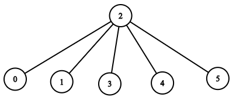

1376. Time Needed to Inform All Employees

A company has `n` employees with a unique ID for each employee from `0` to `n - 1`. The head of the company has is the one with `headID`.

Each employee has one direct manager given in the `manager` array where `manager[i]` is the direct manager of the `i`-th employee, `manager[headID] = -1`. Also it's guaranteed that the subordination relationships have a tree structure.

The head of the company wants to inform all the employees of the company of an urgent piece of news. He will inform his direct subordinates and they will inform their subordinates and so on until all employees know about the urgent news.

The `i`-th employee needs `informTime[i]` minutes to inform all of his direct subordinates (i.e After `informTime[i]` minutes, all his direct subordinates can start spreading the news).

Return the number of minutes needed to inform all the employees about the urgent news.

 

**Example 1:**
```
Input: n = 1, headID = 0, manager = [-1], informTime = [0]
Output: 0
Explanation: The head of the company is the only employee in the company.
```

**Example 2:**


```
Input: n = 6, headID = 2, manager = [2,2,-1,2,2,2], informTime = [0,0,1,0,0,0]
Output: 1
Explanation: The head of the company with id = 2 is the direct manager of all the employees in the company and needs 1 minute to inform them all.
The tree structure of the employees in the company is shown.
```

**Example 3:**


```
Input: n = 7, headID = 6, manager = [1,2,3,4,5,6,-1], informTime = [0,6,5,4,3,2,1]
Output: 21
Explanation: The head has id = 6. He will inform employee with id = 5 in 1 minute.
The employee with id = 5 will inform the employee with id = 4 in 2 minutes.
The employee with id = 4 will inform the employee with id = 3 in 3 minutes.
The employee with id = 3 will inform the employee with id = 2 in 4 minutes.
The employee with id = 2 will inform the employee with id = 1 in 5 minutes.
The employee with id = 1 will inform the employee with id = 0 in 6 minutes.
Needed time = 1 + 2 + 3 + 4 + 5 + 6 = 21.
```

**Example 4:**
```
Input: n = 15, headID = 0, manager = [-1,0,0,1,1,2,2,3,3,4,4,5,5,6,6], informTime = [1,1,1,1,1,1,1,0,0,0,0,0,0,0,0]
Output: 3
Explanation: The first minute the head will inform employees 1 and 2.
The second minute they will inform employees 3, 4, 5 and 6.
The third minute they will inform the rest of employees.
```

**Example 5:**
```
Input: n = 4, headID = 2, manager = [3,3,-1,2], informTime = [0,0,162,914]
Output: 1076
```

**Constraints:**

* `1 <= n <= 10^5`
* `0 <= headID < n`
* `manager.length == n`
* `0 <= manager[i] < n`
* `manager[headID] == -1`
* `informTime.length == n`
* `0 <= informTime[i] <= 1000`
* `informTime[i] == 0` if employee `i` has no subordinates.
* It is **guaranteed** that all the employees can be informed.

# Submissions
---
**Solution 1: (DFS, Post-Order)**

**Explanation**
dfs find out the time needed for each employees.  
The time for a manager = `max(manager's employees) + informTime[manager]`


**Complexity**

Time `O(N)`  
Space `O(N)`

```
Runtime: 1632 ms
Memory Usage: 50.6 MB
```
```python
class Solution:
    def numOfMinutes(self, n: int, headID: int, manager: List[int], informTime: List[int]) -> int:
        children = collections.defaultdict(list)
        for i, m in enumerate(manager):
            if m >= 0: children[m].append(i)

        def dfs(i):
            return max([dfs(j) for j in children[i]] or [0]) + informTime[i]
        return dfs(headID)
```

**Solution 2: (DFS)**
```
Runtime: 318 ms
Memory: 122.2 MB
```
```c++
class Solution {
    int dfs(int cur, vector<int> &time, vector<vector<int>> &g) {
        int rst = time[cur], nrst = 0;
        for (auto &ncur: g[cur]) {
            nrst = max(nrst, dfs(ncur, time, g));
        }
        return rst + nrst;
    }
public:
    int numOfMinutes(int n, int headID, vector<int>& manager, vector<int>& informTime) {
        vector<vector<int>> g(n);
        for (int i = 0; i < n; i ++) {
            if (manager[i] != -1) {
                g[manager[i]].push_back(i);
            }
        }

        return dfs(headID, informTime, g);
    }
};
```

**Solution 3: (DFS)**
```
Runtime: 94 ms, Beats 93.09%
Memory: 126.38 MB, Beats 75.60%
```
```c++
class Solution {
    void dfs(int u, int p, vector<vector<int>> &g, vector<int> &informTime, int &ans) {
        p += informTime[u];
        ans = max(ans, p);
        for (auto &v: g[u]) {
            dfs(v, p, g, informTime, ans);
        }
    }
public:
    int numOfMinutes(int n, int headID, vector<int>& manager, vector<int>& informTime) {
        int i, ans = 0;
        vector<vector<int>> g(n);
        for (i = 0; i < n; i ++) {
            if (i != headID) {
                g[manager[i]].push_back(i);
            }
        }
        dfs(headID, 0, g, informTime, ans);
        return ans;
    }
};
```
